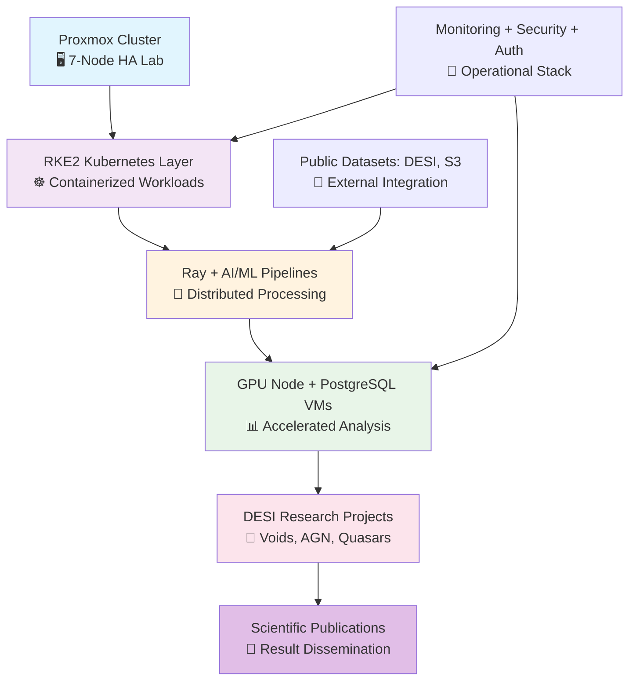

<p align="center">
  
  <h1 align="center">🌌 Proxmox Astronomy Lab</h1>
  <p align="center">
    Enterprise-grade astronomical computing platform for production-scale DESI analysis and reproducible research
  </p>
</p>

<p align="center">
  
  
  
  
  
  
  
</p>

<div align="center">

[🌟 **Explore Projects**](#-active-research-projects) • [📖 **Documentation**](docs/) • [🏗️ **Infrastructure**](#️-platform-architecture) • [🤝 **Contribute**](#-contributing)

---

*From SDR proof-of-concept to production DESI analysis: Building the future of astronomical computing with hybrid Kubernetes/VM architecture*

</div>

<details>
<summary><strong>📋 Table of Contents</strong></summary>

- [🎯 **Overview**](#-overview)
  - [🎯 Our Mission](#-our-mission)
  - [📊 Platform Stats](#-platform-stats)
- [✨ **What Makes This Special**](#-what-makes-this-special)
  - [🏢 **Enterprise-Grade, Garage-Scale**](#-enterprise-grade-garage-scale)
  - [🔀 **Hybrid Architecture Done Right**](#-hybrid-architecture-done-right)
  - [🔬 **Real Research, Real Impact**](#-real-research-real-impact)
  - [📚 **Documentation Excellence**](#-documentation-excellence)
- [🏗️ **Platform Architecture**](#️-platform-architecture)
  - [🔧 **Technology Stack**](#-technology-stack)
- [🔬 **Active Research Projects**](#-active-research-projects)
  - [🌌 DESI Cosmic Void Galaxy Analysis](#-desi-cosmic-void-galaxy-analysis)
  - [🌟 DESI AGN Outflow Energetics](#-desi-agn-outflow-energetics)
  - [🔍 DESI Anomalous Quasar Detection (QAD)](#-desi-anomalous-quasar-detection-qad)
- [🛰️ **From Radio Astronomy to DESI**](#️-from-radio-astronomy-to-desi)
  - [📡 **The Journey: SDR to Production Science**](#-the-journey-sdr-to-production-science)
  - [🔒 **Secure Research Environment**](#-secure-research-environment)
- [🚀 **Getting Started**](#-getting-started)
  - [🏁 Quick Start for Researchers](#-quick-start-for-researchers)
  - [🛠️ For Infrastructure Engineers](#️-for-infrastructure-engineers)
  - [📊 For Data Scientists](#-for-data-scientists)
- [📁 **Repository Structure**](#-repository-structure)
- [🤝 **Contributing**](#-contributing)
  - [Ways to Contribute](#ways-to-contribute)
  - [For Local Students \& Researchers](#for-local-students--researchers)
- [⚠️ **Ethics \& Transparency**](#️-ethics--transparency)
  - [Project Transparency](#project-transparency)
  - [AI Ethics \& Responsible Research](#ai-ethics--responsible-research)
- [🙏 **Acknowledgments**](#-acknowledgments)
  - [🌟 **Foundational Projects**](#-foundational-projects)
  - [🛠️ **Infrastructure \& Platforms**](#️-infrastructure--platforms)
  - [👥 **Community \& Support**](#-community--support)
  - [🏛️ **Institutional Acknowledgments**](#️-institutional-acknowledgments)
- [📄 **License**](#-license)
    - [🌌 **From SDR Proof-of-Concept to Production DESI Science**](#-from-sdr-proof-of-concept-to-production-desi-science)

</details>

# 🎯 **Overview**

The **Proxmox Astronomy Lab** is an enterprise-grade astronomical computing platform that demonstrates how modern infrastructure can enable world-class scientific research. What started as a proof-of-concept for SDR-based radio astronomy has evolved into a production-scale platform running real DESI DR1 analysis workloads and publishing peer-reviewed research.

Built on a **7-node Proxmox VE cluster** with hybrid **RKE2 Kubernetes** and **VM architecture**, we're proving that sophisticated astronomical computing doesn't require massive institutional resources—just smart engineering, open science principles, and a commitment to reproducibility.

## 🎯 Our Mission

- **🔬 Open Science**: Everything documented, reproducible, and shareable
- **📊 Real Science**: Production workloads on real data producing real papers  
- **🌍 Accessible Science**: Demonstrating that enterprise-grade research infrastructure can be built anywhere
- **🤝 Community Science**: Planning to offer compute resources to astronomy students and citizen scientists

## 📊 Platform Stats

| **Metric** | **Specification** | **Purpose** |
|------------|------------------|-------------|
| **🖥️ Compute** | 7-node cluster (~140 cores, ~1TB RAM) | Enterprise-scale parallel processing |
| **🗄️ Storage** | 13+ TB high-performance NVMe storage | Fast I/O for large dataset analysis |
| **🧠 AI/ML** | RTX A4000 GPU with enterprise ML stack | Distributed ML inference and training |
| **📡 Data** | Processing 30GB+ DESI cosmic void datasets | Production astronomical database workloads |
| **⚡ Network** | 10G backbone with enterprise switching | High-bandwidth data movement and migration |

# ✨ **What Makes This Special**

## 🏢 **Enterprise-Grade, Garage-Scale**

We've built legitimate research computing infrastructure that rivals institutional resources, documented every step, and made it all reproducible. This isn't a toy lab—we're running production workloads and publishing papers.

## 🔀 **Hybrid Architecture Done Right**

- **RKE2 Kubernetes** for dynamic ML/AI workloads and distributed computing
- **Strategic VMs** for PostgreSQL databases, persistent services, and GPU acceleration
- **Seamless integration** between containerized and virtualized workloads

## 🔬 **Real Research, Real Impact**

- **DESI Cosmic Void Analysis**: 30GB PostgreSQL implementation studying galaxy evolution in extreme environments
- **AGN Outflow Surveys**: Semi-automated spectral analysis with Cloudy modeling
- **Anomalous Quasar Detection**: Large-scale ML anomaly detection via Ray clusters

## 📚 **Documentation Excellence**

Every component is documented following enterprise standards with golden templates, CIS Controls compliance, and systematic knowledge management. If you can't reproduce it, we didn't build it right.

# 🏗️ **Platform Architecture**



## 🔧 **Technology Stack**

| **Layer** | **Technology** | **Purpose** |
|-----------|----------------|-------------|
| **Virtualization** | Proxmox VE 8.4.1 | Enterprise VM and container management |
| **Orchestration** | RKE2 + Portainer | Kubernetes cluster with enterprise UI |
| **Databases** | PostgreSQL 16 | Optimized for astronomical workloads |
| **AI/ML** | Ray, PyTorch, Ollama | Distributed ML and inference |
| **Storage** | Samsung PM983, Intel DC P4510 | High-performance NVMe storage |
| **Network** | 10G switching, dual-link architecture | Enterprise connectivity |
| **Security** | CIS Controls v8, NIST frameworks | Enterprise security compliance |

# 🔬 **Active Research Projects**

## 🌌 [DESI Cosmic Void Galaxy Analysis](projects/desi-cosmic-voids/)

Studying galaxy evolution in the most extreme large-scale environments using 30GB+ PostgreSQL database of DESI void galaxies. **Status**: Production analysis, paper in preparation.

## 🌟 [DESI AGN Outflow Energetics](projects/desi-agn-outflows/)

Semi-automated spectral analysis of quasar outflows with large-scale Cloudy photoionization modeling. **Status**: Active development, methodology validation.

## 🔍 [DESI Anomalous Quasar Detection (QAD)](projects/desi-qad-anomalous-quasars/)

Large-scale ML anomaly detection on 1.6M+ DESI quasar spectra using Ray distributed computing. **Status**: VAE model training, preliminary results.

# 🛰️ **From Radio Astronomy to DESI**

## 📡 **The Journey: SDR to Production Science**

This platform began as an SDR-based radio astronomy lab focused on Hydrogen Line observations. The foundational infrastructure—built with enterprise-grade practices from day one—proved robust enough to support much larger scientific workloads.

| **Original Focus** | **Current Evolution** |
|-------------------|----------------------|
| **📻 Hydrogen Line Radio Astronomy** | **🌌 DESI Spectroscopic Analysis** |
| SDR signal processing and noise reduction | Large-scale spectral data processing and ML |
| High-Velocity Clouds (HVCs) detection | Cosmic void galaxy evolution studies |
| Low Surface Brightness Galaxies research | AGN outflow energetics and feedback |
| AI-enhanced signal-to-noise optimization | Anomalous quasar detection via deep learning |

The transition demonstrates how solid infrastructure foundations enable scientific pivots and scaling to larger research questions.

## 🔒 **Secure Research Environment**

One of the unique aspects of this lab is its capability for **secure external collaboration**:

- **🔐 Tailscale + Entra ID**: Policy-driven access control with SSO integration
- **🛡️ RBAC**: Role-based access to different lab functions and datasets
- **🖥️ Virtualized Workspaces**: Kasm Workspaces for secure, browser-based research
- **📋 CIS Compliance**: Ubuntu 24.04 LTS @ CISv8 L2, Windows Server 2025 @ CISv9 L1
- **📊 SIEM/XDR**: Wazuh with daily CIS scans and NIST/ISO27001 control mapping

# 🚀 **Getting Started**

## 🏁 Quick Start for Researchers

```bash
# Clone the repository
git clone https://github.com/Proxmox-Astronomy-Lab/proxmox-astronomy-lab.git
cd proxmox-astronomy-lab

# Explore the documentation
cd docs/
# Browse project documentation and setup guides

# Check out active projects
cd ../projects/
# View current research implementations
```

## 🛠️ For Infrastructure Engineers

```bash
# Review cluster configuration
cat cluster-configuration-report.md

# Examine infrastructure documentation
cd infrastructure/
# Explore RKE2, database, and monitoring setups

# Review security implementation
cd ../security/
# CIS Controls, compliance frameworks
```

## 📊 For Data Scientists

```bash
# Explore AI/ML infrastructure
cd ai/
# GPU acceleration, Ray clusters, ML workflows

# Review analysis projects
cd ../projects/
# DESI analysis, PostgreSQL optimization, ML pipelines
```

# 📁 **Repository Structure**

| **Directory/File** | **Purpose** |
|------------------|-------------|
| [**📁 docs**](docs/) | Comprehensive documentation organized by domain |
| [**📁 projects**](projects/) | Active DESI research projects and analysis workflows |
| [**📁 infrastructure**](infrastructure/) | Platform architecture, RKE2, databases, networking |
| [**📁 ai**](ai/) | AI/ML infrastructure, GPU acceleration, Ray clusters |
| [**📁 hardware**](hardware/) | Physical infrastructure specifications and benchmarks |
| [**📁 monitoring**](monitoring/) | Observability, alerting, and performance tracking |
| [**📁 security**](security/) | CIS Controls, compliance frameworks, security policies |
| [**📁 publishing**](publishing/) | Scientific publication workflows and data release |
| [**📁 reproducibility**](reproducibility/) | Infrastructure as Code, Terraform, Ansible |
| [**📄 phase-*.md**](phase-1.md) | Implementation phases and project roadmap |

<details>
<summary><strong>📖 Detailed Documentation Structure</strong></summary>

```
proxmox-astronomy-lab/
├── 📖 docs/                    # Comprehensive documentation
│   ├── HowTo/                  # Step-by-step guides
│   ├── ITIL-Processes/         # Enterprise operational procedures
│   └── Policies/               # Governance and compliance
├── 🔬 projects/                # Active research projects
│   ├── desi-cosmic-voids/      # Galaxy evolution in voids
│   ├── desi-agn-outflows/      # Quasar outflow analysis
│   └── desi-qad-anomalous-quasars/ # ML anomaly detection
├── 🏗️ infrastructure/          # Platform architecture
│   ├── k8s/                    # RKE2 Kubernetes configuration
│   ├── databases/              # PostgreSQL astronomy optimization
│   ├── authentication/         # Identity and access management
│   └── orchestration/          # Container and VM management
├── 🧠 ai/                      # AI/ML infrastructure
│   └── gpu-node/               # GPU acceleration and inference
├── 🖥️ hardware/               # Physical infrastructure
│   ├── benchmarks/             # Performance testing
│   └── diagrams/               # Network and system architecture
├── 📊 monitoring/              # Observability and alerting
├── 🔒 security/                # Security frameworks and compliance
│   ├── CIS/                    # CIS Controls v8 implementation
│   ├── CNKF/                   # Cloud Native Kubernetes security
│   └── SSP/                    # System Security Plans
├── 📑 publishing/              # Scientific publication workflows
└── 🔄 reproducibility/         # Infrastructure as Code
    └── terraform-ansible/      # Automation and deployment
```

</details>

# 🤝 **Contributing**

We welcome contributions from the astronomy, infrastructure, and open science communities! Whether you're interested in:

- 🔬 **Scientific Analysis**: Contribute to DESI research projects
- 🏗️ **Infrastructure**: Improve our Kubernetes/VM hybrid architecture  
- 📖 **Documentation**: Help make our knowledge base even better
- 🔒 **Security**: Enhance our CIS Controls implementation
- 🤖 **AI/ML**: Optimize our distributed computing workflows

## Ways to Contribute

1. **🐛 Report Issues**: Found a bug or have a suggestion? [Open an issue](https://github.com/Proxmox-Astronomy-Lab/proxmox-astronomy-lab/issues)
2. **📝 Improve Documentation**: Submit PRs for clearer explanations or additional examples
3. **🧪 Share Results**: Reproduce our analysis or extend our methods
4. **💡 Propose Research**: Suggest new projects that could leverage our infrastructure

## For Local Students & Researchers

We're based in **Columbus, Ohio** and are exploring partnerships with **OSU Astronomy** and other local institutions. Interested in accessing compute resources for your research? [Get in touch!](mailto:contact@radioastronomy.io)

# ⚠️ **Ethics & Transparency**

## Project Transparency

This project is a transparent, living process where we document our successes and our mistakes. We follow real-world enterprise practices, but this is also a learning experience. We show our work—warts and all—for transparency. Mistakes and course corrections are part of the process, and that's intentional.

🔹 **Security Advisory**: Security policies and best practices should not be blindly lifted from this repository. Every lab has unique needs, and configurations here are tailored to our environment. Always review and adapt security measures accordingly.

## AI Ethics & Responsible Research

The Proxmox Astronomy Lab integrates AI/ML-enhanced analysis and automation with a strong commitment to ethical AI practices. **AI is a tool to enhance scientific discovery, not to replace rigorous analysis or responsible decision-making.**

**Key Ethical Principles:**

1. **🔍 Transparency** - AI/ML models used for analysis and automation are documented, explainable, and auditable
2. **📊 Data Integrity** – Scientific data is processed with AI for enhancement, not manipulation. Accuracy remains paramount
3. **🔒 Privacy & Security** – No user data, queries, or access logs are shared or monetized. All AI processing is local
4. **🌍 Open Science & Reproducibility** – AI-powered analysis pipelines are open-source for verification and improvement

🛰️ **Why It Matters**: AI in scientific computing should aid research, not obscure truth. We prioritize transparency, accuracy, and reproducibility over automation for automation's sake.

# 🙏 **Acknowledgments**

This project builds on the incredible work of open science communities and wouldn't be possible without:

## 🌟 **Foundational Projects**

- **[DESI Collaboration](https://www.desi.lbl.gov/)** - For making DR1 data publicly available and advancing spectroscopic surveys
- **[Amazon Web Services](https://aws.amazon.com/opendata/)** - For hosting DESI data on S3 public datasets
- **[AstroPy Project](https://www.astropy.org/)** - Essential astronomical Python libraries
- **[SciPy Ecosystem](https://scipy.org/)** - NumPy, SciPy, matplotlib, and the scientific Python stack

## 🛠️ **Infrastructure & Platforms**

- **[Proxmox](https://www.proxmox.com/)** - Enterprise virtualization platform
- **[Rancher/RKE2](https://rancher.com/)** - Kubernetes distribution and management
- **[PostgreSQL](https://www.postgresql.org/)** - Robust database foundation
- **[Ray Project](https://ray.io/)** - Distributed computing framework

## 👥 **Community & Support**

- Our **GitHub sponsors** who help fund hardware and development
- The **astronomy Twitter/X community** for feedback and collaboration
- **Local astronomy enthusiasts** in Columbus who support citizen science

## 🏛️ **Institutional Acknowledgments**

- **Ohio State University Department of Astronomy** - For fostering local astronomical research
- **Lawrence Berkeley National Laboratory** - For DESI project leadership
- **National Science Foundation** - For supporting spectroscopic survey science

# 📄 **License**

This project is licensed under the MIT License - see the [LICENSE](LICENSE) file for details.

---

### 🌌 **From SDR Proof-of-Concept to Production DESI Science**

*Building the future of astronomical computing, one commit at a time*

**[⭐ Star this repo](https://github.com/Proxmox-Astronomy-Lab/proxmox-astronomy-lab)** • **[🐦 Follow updates](https://twitter.com/radioastronomy)** • **[💬 Join discussions](https://github.com/Proxmox-Astronomy-Lab/proxmox-astronomy-lab/discussions)**

Made with ❤️ for open science | **[radioastronomy.io](http://radioastronomy.io)**
