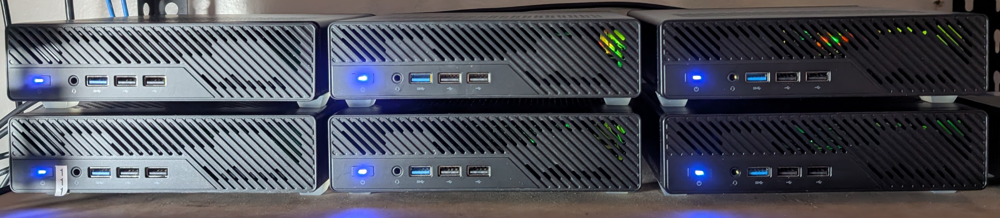
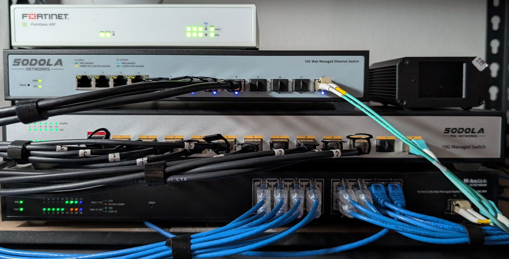
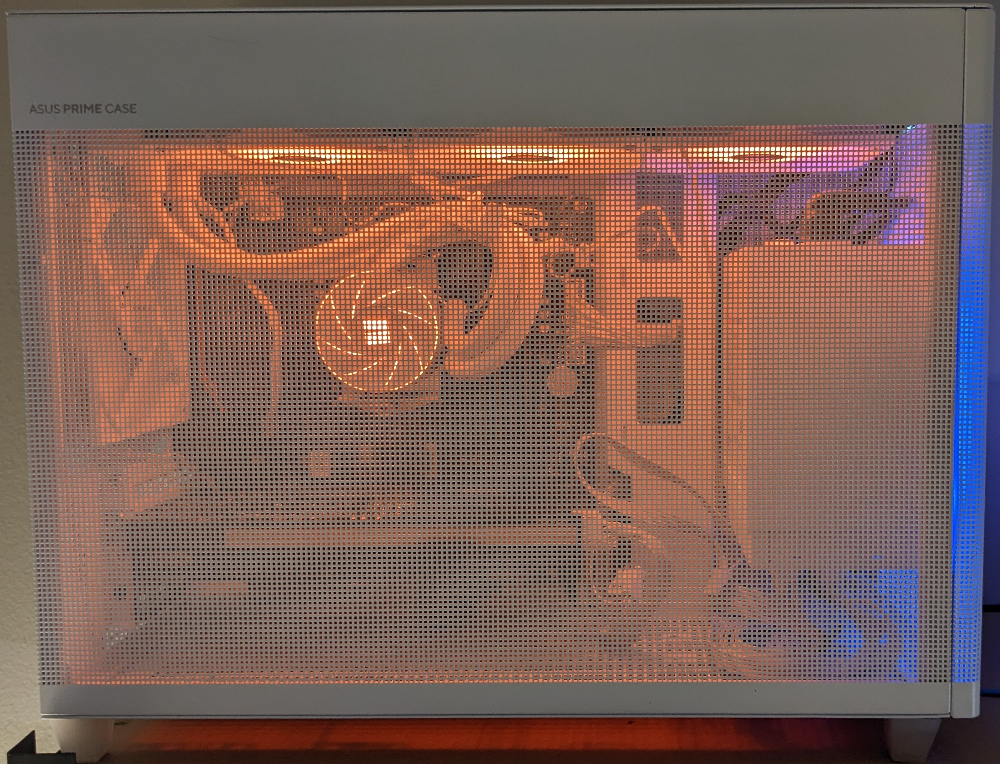
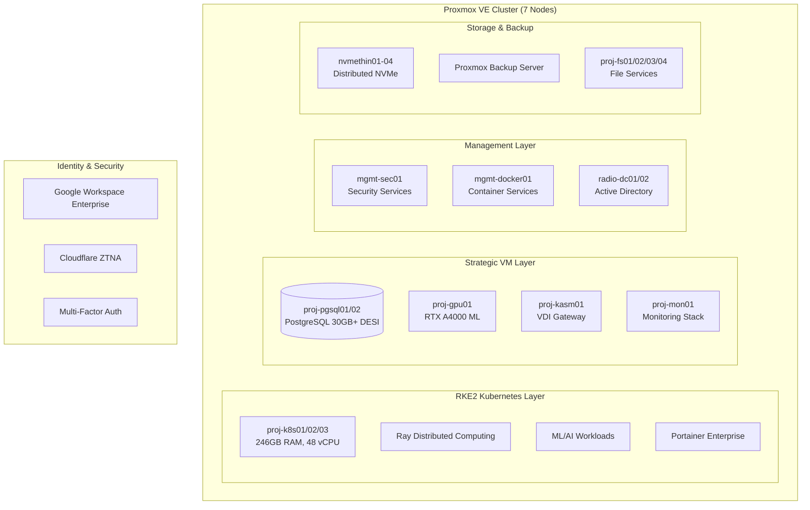

# 🌌 Proxmox Astronomy Lab

Enterprise-grade astronomical computing platform enabling cutting-edge DESI research through hybrid infrastructure

  

    

---

## 🎯 Platform Overview

The Proxmox Astronomy Lab is a production astronomical computing platform built on a 7-node Proxmox VE cluster with hybrid RKE2 Kubernetes and strategic VM architecture. We produce enhanced datasets and original research from public astronomical surveys, operating at organizational scale with enterprise infrastructure standards.



## 🚀 Our Mission

### Scientific Output

We produce enhanced datasets and original data science research as citizen scientists, transforming astronomical data into analysis-ready datasets (ARD) that enable downstream research. Our work includes anomaly detection, spectral analysis, and systematic data enhancement projects on public astronomical surveys.

Our Latest Released Dataset: https://github.com/vintagedon/steam-dataset-2025

Our Current Research: https://github.com/Pxomox-Astronomy-Lab/desi-cosmic-void-galaxies

### Data Quality Standards

Following FAIR principles (Findable, Accessible, Interoperable, Reusable), we implement scientific rigor throughout our data pipelines. Quality data prevents downstream problems—proper methodology at the source eliminates garbage propagation through the research ecosystem.

### AI-Native Operations

AI is embedded in 100% of our workflows, from automated data processing to governance documentation. We implement multi-framework governance (CIS-RAM, ISO42001, Colorado SB-24-205, NIST AI RMF) appropriate to our responsibility as data providers to downstream researchers.

Our governance journey and reusable templates are documented at [github.com/vintagedon/nist-ai-rmf-cookbook](https://github.com/vintagedon/nist-ai-rmf-cookbook).

### Transparency & Methodology

We publish complete methodological transparency through detailed worklogs documenting technical decisions, failures, lessons learned, and reproducible procedures. All analysis scripts and infrastructure patterns are openly shared—not just the results, but the entire decision-making process that produced them.

## 📊 Current Platform Specifications

| Component | Specification | Purpose |
|---------------|------------------|-------------|
| 🖥️ Compute Cluster | 7-node Proxmox VE 9.x (144 cores, 768G RAM, 24TB nvme) | Compute and Storage |
| 📦 Virtual Machines | 35+ production VMs + Docker Microservices | Static VMs supporting k8s Dynamic Workloads |
| ☸️ Kubernetes Platform | 4-node RKE2 cluster (246GB RAM, 48 vCPU) | Container orchestration for dynamic ML/AI workloads |
| 🗄️ Database Infrastructure | PostgreSQL 16 w/pgvector and PostGIS| Astronomy/data science workloads |
| 🧠 AI/ML Acceleration | 2 x RTX A4000 16G GPUs | Local LLMs + ML Workflow Pipelines |
| 🔡 Network Architecture | LACP 2.5G/10G Network + Fortigate 40F Firewall | VM and Storage network |
Security Framework | CIS Controls v8 + Google Workspace Enterprise + Netbird ZTNA | Security, Identity Management and Remote Access |





## ✨ Platform Capabilities

### 🔄 Hybrid Architecture

- RKE2 Kubernetes: 3-node cluster (246GB RAM, 48 vCPU) for dynamic ML/AI workloads and distributed computing
- Strategic VMs: PostgreSQL databases, persistent services, GPU acceleration, and enterprise applications
- Enterprise Integration: Google Workspace Enterprise identity, Zero Trust Network Access, comprehensive monitoring

### 🔬 Production Research Workloads

- 🌌 DESI Cosmic Void Analysis: 30GB+ PostgreSQL implementation studying galaxy evolution in extreme environments
- 💨 AGN Outflow Surveys: Semi-automated spectral analysis with Cloudy modeling integration
- 🔍 Anomalous Quasar Detection: Large-scale ML anomaly detection using distributed Ray clusters on RKE2
- 📊 ML Infrastructure: 1D Conv VAE on 1.6M spectra with enterprise GPU acceleration

### 🔒 Governance & Quality

We follow Responsible and Ethical AI principles and are beginning integration of explainable AI (xAI) into our workflows. AI is a tool to enhance scientific discovery, not to replace rigorous analysis or responsible decision-making.

Key Principles:

- Transparency: AI/ML models are documented, explainable, and auditable
- Data Integrity: Scientific data is processed with AI for enhancement, not manipulation
- Privacy & Security: No user data or access logs are shared or monetized
- Reproducibility: AI-powered analysis pipelines are open-source for verification

### 📚 Documentation Standards

Every component follows enterprise documentation standards with golden templates, CIS Controls compliance mapping, and systematic knowledge management. If you can't reproduce it, we didn't build it right.

---

## 🏗️ Architecture Overview

### Hybrid Infrastructure Strategy


### Service Architecture

| Service Tier | Implementation | Components |
|------------------|-------------------|----------------|
| Identity | Google Workspace Enterprise + Zero Trust | Enterprise identity, conditional access, MFA enforcement |
| Orchestration | RKE2 + Portainer | 3-node Kubernetes control plane, container orchestration |
| Compute | Hybrid K8s/VM | Dynamic scaling + persistent services across 35+ VMs |
| Data | PostgreSQL + File Services | 30GB+ DESI databases + distributed file systems |
| AI/ML | Ray + GPU acceleration | Distributed computing + RTX A4000 inference |
| Monitoring | Prometheus + Grafana + Loki | Centralized observability with proj-mon01 |
| Security | CIS Controls v8 + NIST | Infrastructure hardening + compliance monitoring |

---

## 📁 Repository Structure

```markdown
PROXMOX-ASTRONOMY-LAB/
├── 🤖 ai-and-machine-learning/      # AI/ML infrastructure, GPU computing, RAG systems
├── 🛠️ applications-and-services/    # Production service configurations and deployments
├── 🌌 astronomy-projects/           # Active DESI research projects and analysis workflows
├── 🔧 automation-and-orchestration/ # Ansible automation, infrastructure as code
├── 📚 docs/                        # Enterprise documentation standards and procedures
├── 🔩 hardware/                    # Cluster specifications and network architecture
├── 🏗️ infrastructure/              # Core platform services and hybrid architecture
├── 📋 policies-and-procedures/     # Enterprise governance and CIS Controls compliance
├── 📊 project-management/          # Project coordination, phases, and planning
├── 📄 publishing/                  # Scientific publication and data release workflows
├── 🔒 security-assurance/          # CIS Controls v8 implementation and compliance
└── 📖 wiki/                        # Operational procedures and technical guides
```

### Key Documentation Entry Points

- 🏗️ [Infrastructure Overview](infrastructure/README.md) - Core platform services and hybrid architecture
- 🌌 [Astronomy Projects](astronomy-projects/README.md) - Active DESI analysis and research portfolio
- 🔧 [Hardware Specifications](hardware/README.md) - Complete cluster hardware inventory and networking
- 📚 [Documentation Standards](docs/README.md) - Enterprise documentation framework and templates
- 🔒 [Security Assurance](security-assurance/README.md) - CIS Controls v8 and compliance implementation
- 🛠️ [Applications & Services](applications-and-services/README.md) - Production service deployments

---

## 🔬 Active Research Projects

### DESI Data Release 1 Analysis Portfolio

#### 🌌 [Cosmic Void Galaxy Analysis](astronomy-projects/desi-cosmic-void-galaxies.md)

- Objective: Environmental quenching studies in extreme low-density environments
- Infrastructure: 30GB+ PostgreSQL database (proj-pgsql01) with spatial indexing
- Dataset: DESI DR1 BGS galaxies cross-matched with cosmic void catalogs
- Status: Production analysis phase, systematic comparison methodology

#### 💨 [AGN Outflow Energetics](astronomy-projects/desi-quasar-outflows.md)

- Objective: Systematic survey of quasar outflow properties and feedback mechanisms
- Infrastructure: Hybrid Docker/Kubernetes deployment with Cloudy modeling integration
- Dataset: DESI DR1 QSO spectra with semi-automated spectral fitting
- Status: Active development, methodology validation complete

#### 🔍 [Anomalous Quasar Detection](astronomy-projects/desi-qso-anomaly-detection.md)

- Objective: ML-driven discovery of unusual quasar properties and phenomena
- Infrastructure: RKE2 Ray clusters with GPU acceleration for distributed ML
- Dataset: 1.6M DESI QSO spectra with 1D Conv VAE architecture
- Status: Production ML pipeline, anomaly catalog in development

### Platform Research

- 📊 [Spec-Driven AI](astronomy-projects/spec-driven-ai.md): AI methodology development for spectroscopic analysis
- 🏗️ Infrastructure Optimization: Performance validation and enterprise operational procedures

---

## 🌟 Organization Repositories

The Proxmox Astronomy Lab maintains several specialized repositories within our GitHub organization:

### Core Platform Repository

- [proxmox-astronomy-lab](https://github.com/Proxmox-Astronomy-Lab/proxmox-astronomy-lab) - Main infrastructure and documentation (this repository)

### Research Project Repositories

- [desi-cosmic-void-galaxies](https://github.com/Proxmox-Astronomy-Lab/desi-cosmic-void-galaxies) - Cosmic void galaxy analysis with DESI DR1
- [desi-qso-anomaly-detection](https://github.com/Proxmox-Astronomy-Lab/desi-qso-anomaly-detection) - ML anomaly detection on 1.6M+ quasar spectra
- [desi-quasar-outflows](https://github.com/Proxmox-Astronomy-Lab/desi-quasar-outflows) - AGN outflow energetics analysis
- [spec-driven-ai](https://github.com/Proxmox-Astronomy-Lab/spec-driven-ai) - AI methodology for spectroscopic analysis

### Platform Development

- [proxmox-astronomy-lab.github](https://github.com/Proxmox-Astronomy-Lab/.github) - Organization profile and community templates

Each repository follows our enterprise documentation standards and includes comprehensive setup instructions, methodology documentation, and reproducibility guidelines.

---

## 🚀 Getting Started

### For Researchers

1. 🌌 Review [Astronomy Projects](astronomy-projects/README.md) for active research projects and datasets
2. 🏗️ Understand [Infrastructure Overview](infrastructure/README.md) for compute resource capabilities
3. 📄 Explore [Publishing Workflows](publishing/README.md) for data release and citation procedures
4. 📖 Learn [Operational Procedures](wiki/README.md) for hands-on technical implementation

### For Infrastructure Engineers

1. 🔧 Study [Hardware Architecture](hardware/README.md) for cluster specifications and networking
2. 🔒 Examine [Security Framework](security-assurance/README.md) for CIS Controls v8 implementation
3. 📚 Follow [Documentation Standards](docs/README.md) for enterprise documentation framework
4. 🏗️ Deploy using [Infrastructure as Code](automation-and-orchestration/README.md) principles

### For Data Scientists & ML Engineers

1. 🤖 Explore [AI/ML Infrastructure](ai-and-machine-learning/README.md) for GPU acceleration and distributed computing
2. 🛠️ Review [Application Services](applications-and-services/README.md) for ML platforms and databases
3. 📊 Analyze [Research Projects](astronomy-projects/README.md) for active ML workloads and methodologies
4. ☸️ Learn [Kubernetes Platform](infrastructure/README.md) for container orchestration and Ray clusters

---

## 🔬 Research Impact & Contributions

### Scientific Output

- Open Data: All analysis code and enriched catalogs released publicly through GitHub
- Reproducible Research: Complete workflow documentation enabling independent verification
- FAIR Principles: Datasets follow Findable, Accessible, Interoperable, Reusable standards
- Downstream Responsibility: Quality data prevents garbage propagation through research ecosystem

### Technical Innovation

- Hybrid Architecture: Demonstrating optimal RKE2 Kubernetes + VM allocation for scientific computing
- AI Governance: Multi-framework implementation (CIS-RAM, ISO42001, SB-24-205, NIST AI RMF) at small-org scale
- Documentation Excellence: Enterprise standards with comprehensive technical documentation framework
- Methodological Transparency: Detailed worklogs documenting decisions, failures, and lessons learned

### Platform Metrics

- 🔥 Active Workloads: 3 major DESI analysis projects in production with dedicated infrastructure
- 💾 Data Processing: 30GB+ astronomical databases with optimized query performance
- 🧮 ML Throughput: 1.6M spectra processed through VAE architecture on distributed Ray clusters
- ⚡ Infrastructure Reliability: >99.5% availability across 35+ VM production environment

---

## 🤝 Get Involved

### AI Governance Journey

We document our multi-framework governance implementation and provide reusable templates at [github.com/vintagedon/nist-ai-rmf-cookbook](https://github.com/vintagedon/nist-ai-rmf-cookbook). This resource captures our journey implementing CIS-RAM, ISO42001, Colorado SB-24-205, and NIST AI RMF at small-organization scale.

### Citation & Data Use

If you use our datasets or build on our research, please cite:

ORCID: [0009-0008-7695-4093](https://orcid.org/0009-0008-7695-4093)

```bibtex
@misc{proxmox_astronomy_lab_2025,
  title={Proxmox Astronomy Lab: Enterprise-Grade Astronomical Computing Platform},
  author={VintageDon and Contributors},
  year={2025},
  url={https://github.com/Proxmox-Astronomy-Lab/proxmox-astronomy-lab},
  note={7-node hybrid Kubernetes/VM infrastructure for DESI astronomical research computing}
}
```

### Current Capacity

We do not have volunteer capacity at this time. For collaboration inquiries related to published datasets or governance frameworks, please reference the appropriate repository.

### Community Standards

- Professional Conduct: Respectful, inclusive, and constructive collaboration
- Scientific Rigor: Peer review, statistical validation, and systematic error analysis
- Open Communication: Transparent project status, methodology sharing, and collaborative development
- Knowledge Transfer: Active documentation, educational resource development, and community support

---

## 📄 License

This project is licensed under the MIT License - see the [LICENSE](LICENSE) file for details.

---

## 🙏 Acknowledgments

This platform builds on open-source foundations and demonstrates that sophisticated astronomical research infrastructure can be built through systematic engineering and enterprise standards.

Technology Foundation: Proxmox VE, RKE2 Kubernetes, PostgreSQL, Ray distributed computing, DESI collaboration data access

Community Support: Open source tools and libraries, astronomical research community, contributors and collaborators

Data Sources: DESI Dark Energy Spectroscopic Instrument, Amazon Web Services public datasets, AstroPy project, SciPy ecosystem

---

🌌 Production astronomical research computing platform | Citizen scientists at organizational scale

Last Updated: October 30, 2025 | Platform Status: Production
