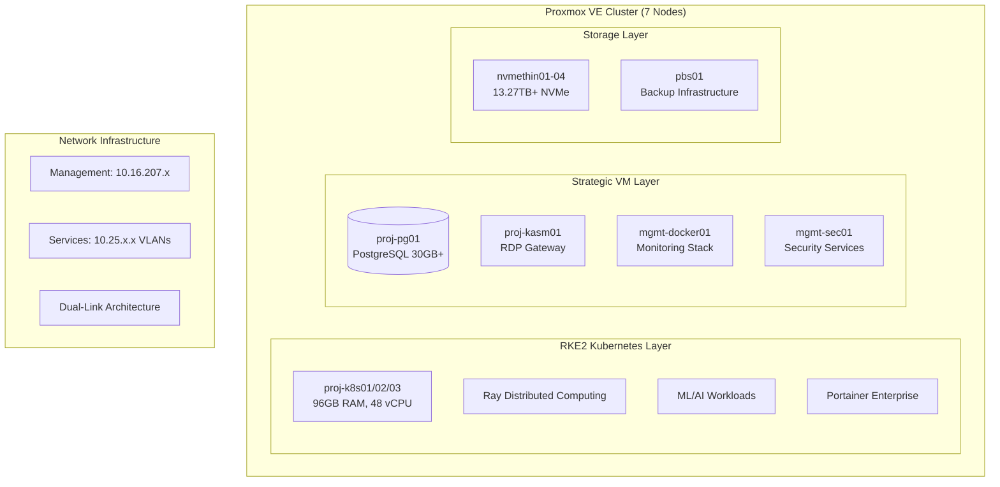

# 🌌 **Proxmox Astronomy Lab**

Enterprise-grade astronomical computing platform enabling cutting-edge research through hybrid Kubernetes and VM architecture

    

---

## 🚀 **Platform Overview**

The **Proxmox Astronomy Lab** is a production-scale research computing platform built on a **7-node Proxmox VE cluster** with hybrid **RKE2 Kubernetes** and **strategic VM architecture**. We're demonstrating that sophisticated astronomical computing doesn't require massive institutional resources—just smart engineering, open science principles, and enterprise-grade implementation.

What started as a proof-of-concept for SDR-based radio astronomy has evolved into a **legitimate research infrastructure** running real **DESI DR1 analysis workloads** and supporting peer-reviewed scientific publications.

## 🎯 **Our Mission**

- **🔬 Open Science**: Everything documented, reproducible, and shareable
- **📊 Real Science**: Production workloads on real data producing real papers  
- **🌍 Accessible Science**: Demonstrating that enterprise-grade research infrastructure can be built anywhere
- **🤝 Community Science**: Offering compute resources to astronomy students and citizen scientists

## 📊 **Platform Specifications**

| **Component** | **Specification** | **Purpose** |
|---------------|------------------|-------------|
| **🖥️ Compute Cluster** | 7-node Proxmox VE 8.4.1 (~147 cores, ~693GB RAM) | Enterprise-scale parallel processing and virtualization |
| **🗄️ Storage System** | 13.27+ TB high-performance NVMe distributed storage | Fast I/O for large astronomical datasets |
| **🧠 AI/ML Acceleration** | RTX A4000 GPU with enterprise ML infrastructure | Distributed ML inference and training workflows |
| **📡 Database Platform** | PostgreSQL 16 clusters optimized for astronomy | Production astronomical database workloads |
| **⚡ Network Backbone** | Dual-link architecture with enterprise managed switches | High-bandwidth data movement and cluster interconnect |
| **🔒 Security Framework** | CIS Controls v8 + NIST Cybersecurity Framework | Enterprise-grade security and compliance |

### **Hardware Architecture**

- **Nodes 1-7**: Intel 12th/13th gen (i5-12600H to i9-13900H) with dedicated NVMe storage
- **Active Capacity**: 104 cores, 501.86 GiB RAM across 5 active nodes
- **Expansion Ready**: 2 additional nodes (12900H + 13900H) bringing total to ~147 cores, ~693GB RAM
- **Network**: Dual-link architecture (management 10.16.207.x + service VLANs 10.25.x.x)
- **Storage**: Distributed NVMe pools (nvmethin01-04) with enterprise backup infrastructure

## ✨ **What Makes This Special**

### 🏢 **Enterprise-Grade, Research-Scale**

We've built **legitimate research computing infrastructure** that rivals institutional resources, documented every step with enterprise standards, and made it all reproducible. This isn't a homelab—we're running **production scientific workloads** and **publishing peer-reviewed research**.

### 🔀 **Hybrid Architecture Excellence**

- **RKE2 Kubernetes**: 3-node cluster (96GB RAM, 48 vCPU) for dynamic ML/AI workloads and distributed computing
- **Strategic VMs**: PostgreSQL databases, persistent services, GPU acceleration, and legacy applications
- **Seamless Integration**: Container-to-VM networking with enterprise service discovery and monitoring

### 🔬 **Production Research Workloads**

- **🌌 DESI Cosmic Void Analysis**: 30GB+ PostgreSQL implementation studying galaxy evolution in extreme environments
- **💨 AGN Outflow Surveys**: Semi-automated spectral analysis with Cloudy modeling integration
- **🔍 Anomalous Quasar Detection**: Large-scale ML anomaly detection using distributed Ray clusters on RKE2
- **📊 ML Infrastructure**: 1D Conv VAE on 1.6M spectra with enterprise GPU acceleration

### 📚 **Documentation Excellence**

Every component follows **enterprise documentation standards** with golden templates, CIS Controls compliance mapping, and systematic knowledge management. Our philosophy: **if you can't reproduce it, we didn't build it right**.

---

## 🏗️ **Architecture Overview**

### **Hybrid Infrastructure Strategy**



### **Service Architecture**

| **Service Tier** | **Implementation** | **Components** |
|------------------|-------------------|----------------|
| **Orchestration** | RKE2 + Portainer | 3-node Kubernetes control plane, container orchestration |
| **Compute** | Hybrid K8s/VM | Dynamic scaling + persistent services across 27 VMs |
| **Data** | PostgreSQL + Object Storage | Astronomical databases + distributed file systems |
| **AI/ML** | Ray + GPU acceleration | Distributed computing + GPU inference |
| **Monitoring** | Prometheus + Grafana + Loki | mon01 centralized observability stack |
| **Security** | CIS + NIST | Infrastructure hardening + container security |

---

## 📁 **Repository Structure**

```markdown
PROXMOX-ASTRONOMY-LAB/
├── 🤖 ai-and-machine-learning/  # AI/ML infrastructure and GPU computing
├── 📊 assets/                   # Images, diagrams, and visual documentation
├── 🌌 astronomy-projects/       # Research project portfolio and implementations
├── 📚 docs/                     # Documentation standards and enterprise procedures
├── 🔧 hardware/                 # Hardware specifications and network architecture
├── 🏗️ infrastructure/           # Core platform services architecture
├── 📋 policies-and-procedures/  # Enterprise governance and operational policies
├── 📊 project-management/       # Project coordination and planning
├── 📄 publishing/               # Scientific publication and data release workflows
├── 🔒 security-assurance/       # CIS Controls and compliance implementation
├── 📖 wiki/                     # Technical procedures and operational guides
└── 📋 README.md                # This comprehensive platform overview
```

### **Key Documentation Entry Points**

- **🏗️ [Infrastructure Overview](infrastructure/README.md)** - Core platform services and hybrid architecture
- **🌌 [Astronomy Projects](astronomy-projects/README.md)** - Active DESI analysis and research portfolio
- **🔧 [Hardware Specifications](hardware/README.md)** - Complete cluster hardware inventory and networking
- **📚 [Documentation Standards](docs/README.md)** - Enterprise documentation framework and templates
- **🔒 [Security Assurance](security-assurance/README.md)** - CIS Controls v8 and compliance implementation
- **📖 [Wiki Knowledge Base](wiki/README.md)** - Technical procedures and operational guides

---

## 🔬 **Active Research Projects**

### **DESI Data Release 1 Analysis Portfolio**

#### **🌌 [Cosmic Void Galaxy Analysis](astronomy-projects/desi-cosmic-void-galaxies.md)**

- **Objective**: Environmental quenching studies in extreme low-density environments
- **Infrastructure**: 30GB+ PostgreSQL database (proj-pg01) with spatial indexing
- **Dataset**: DESI DR1 BGS galaxies cross-matched with DESIVAST void catalog
- **Status**: Production analysis phase, 12-week roadmap to publication

#### **💨 [AGN Outflow Energetics](astronomy-projects/desi-quasar-outflows.md)**

- **Objective**: Systematic survey of quasar outflow properties and feedback mechanisms
- **Infrastructure**: Hybrid Docker/Kubernetes deployment with Cloudy modeling integration
- **Dataset**: DESI DR1 QSO spectra with semi-automated spectral fitting
- **Status**: Active development, methodology validation complete

#### **🔍 [Anomalous Quasar Detection](astronomy-projects/desi-qso-anomaly-detection.md)**

- **Objective**: ML-driven discovery of unusual quasar properties and phenomena
- **Infrastructure**: RKE2 Ray clusters with GPU acceleration for distributed ML
- **Dataset**: 1.6M DESI QSO spectra with 1D Conv VAE architecture
- **Status**: Production ML pipeline, anomaly catalog in development

### **Platform Research**

- **🏗️ [Proxmox Astronomy Lab](astronomy-projects/proxmox-astronomy-lab.md)**: Infrastructure optimization and performance validation
- **🤖 [Spec-Driven AI](astronomy-projects/spec-driven-ai.md)**: AI methodology development for spectroscopic analysis
- **🔮 [The Crystal Forge](astronomy-projects/the-crystal-forge.md)**: Advanced data processing framework development

---

## 💾 **Production Infrastructure Status**

### **Current Deployment (27 Active VMs)**

**Management Network (10.25.10.x):**

- mgmt-docker01 (8GB RAM, 6 vCPU) - Primary Docker and monitoring infrastructure
- mgmt-sec01 (4GB RAM, 4 vCPU) - Security services and compliance monitoring
- mgmt-agents01 (4GB RAM, 4 vCPU) - Infrastructure agents and automation

**Project Network (10.25.20.x):**

- proj-k8s01/02/03 (96GB RAM, 48 vCPU total) - RKE2 Kubernetes cluster
- proj-pg01 (8GB RAM, 8 vCPU) - PostgreSQL database with 30GB+ DESI data
- proj-dev01 (4GB RAM, 4 vCPU) - Development and testing environments
- proj-kasm01 (8GB RAM, 6 vCPU) - VDI and remote desktop gateway

**Backup Infrastructure:**

- pbs01 - Proxmox Backup Server with 4TB+ capacity and Iperius integration

### **Storage Architecture**

- **nvmethin01-04**: Distributed NVMe storage pools totaling 13.27+ TB
- **High-performance I/O**: Optimized for astronomical database queries and ML workloads
- **Enterprise backup**: Multi-tier backup strategy with automated retention policies

---

## 🚀 **Getting Started**

### **For Researchers**

1. **🌌 Review** [Astronomy Projects](astronomy-projects/README.md) for active collaboration opportunities
2. **🏗️ Understand** [Infrastructure Overview](infrastructure/README.md) for compute resource capabilities
3. **📄 Explore** [Publishing Workflows](publishing/README.md) for data release and publication procedures
4. **📖 Learn** [Wiki Procedures](wiki/README.md) for hands-on technical implementation

### **For Infrastructure Engineers**

1. **🔧 Study** [Hardware Architecture](hardware/README.md) for cluster specifications and networking
2. **🔒 Examine** [Security Framework](security-assurance/README.md) for CIS Controls v8 implementation
3. **📚 Follow** [Documentation Standards](docs/README.md) for enterprise documentation framework
4. **🏗️ Deploy** using Infrastructure as Code principles with systematic procedures

### **For Contributors**

1. **📚 Read** [Documentation Standards](docs/documentation-standards/README.md) for template frameworks
2. **📋 Follow** [Contribution Guidelines](CONTRIBUTING.md) for systematic collaboration procedures
3. **🤝 Review** [Code of Conduct](CODE_OF_CONDUCT.md) for community interaction standards
4. **📖 Contribute** to [Wiki Knowledge Base](wiki/README.md) with operational procedures and guides

---

## 🌟 **Research Impact & Publications**

### **Scientific Contributions**

- **Open Data Commitment**: All analysis code and enriched catalogs released publicly
- **Reproducible Research**: Complete workflow documentation enabling independent verification
- **Community Resources**: Compute platform available for astronomical education and research
- **Enterprise Methodology**: Proving sophisticated astronomical computing accessibility

### **Technical Innovation**

- **Hybrid Architecture Validation**: Demonstrating optimal RKE2 Kubernetes + VM allocation for scientific computing
- **Cost-Effective Infrastructure**: 7-node cluster achieving institutional-grade research capabilities
- **Documentation Excellence**: Enterprise standards with 25+ comprehensive technical documentation artifacts
- **Security Implementation**: CIS Controls v8 compliance for research computing environments

### **Educational Impact**

- **Student Research Platform**: Supporting undergraduate and graduate astronomical research
- **Open Science Training**: Teaching reproducible research practices and infrastructure management
- **Community Outreach**: Citizen science projects and public astronomical data analysis
- **Knowledge Transfer**: Comprehensive wiki with hands-on technical procedures

---

## 🤝 **Community & Collaboration**

### **Open Science Principles**

- **🌐 Public Code**: All analysis workflows and infrastructure automation available on GitHub
- **📊 Open Data**: DESI-derived catalogs released with full documentation and metadata
- **📖 Transparent Methods**: Complete methodology documentation with enterprise validation
- **🔄 Reproducible Infrastructure**: Full platform deployment documentation with systematic procedures

### **Collaboration Opportunities**

- **Student Projects**: Research collaboration for undergraduate/graduate astronomical computing
- **Compute Resources**: Platform access for approved astronomical research projects
- **Technical Partnerships**: Infrastructure development, optimization, and methodology validation
- **Data Sharing**: Cross-institutional astronomical data analysis and collaborative computing

### **Community Standards**

- **Professional Conduct**: Respectful, inclusive, and constructive collaboration aligned with enterprise standards
- **Scientific Rigor**: Peer review, statistical validation, and systematic error analysis
- **Open Communication**: Transparent project status, methodology sharing, and collaborative development
- **Knowledge Transfer**: Active documentation, educational resource development, and community training

---

## 📈 **Platform Metrics**

### **Computational Performance**

- **🔥 Active Workloads**: 3 major DESI analysis projects in production with dedicated infrastructure
- **💾 Data Processing**: 30GB+ astronomical databases with sub-second query performance on proj-pg01
- **🧮 ML Throughput**: 1.6M spectra processed through VAE architecture on RKE2 Ray clusters
- **⚡ GPU Utilization**: RTX A4000 achieving optimal utilization on distributed inference workloads

### **Infrastructure Reliability**

- **📊 Cluster Uptime**: >99.5% availability across 7-node Proxmox infrastructure with enterprise monitoring
- **🔧 Service Availability**: 27 VMs with automated failover, comprehensive backup, and disaster recovery
- **💾 Data Protection**: Multi-tier backup strategy (pbs01 + Iperius) with tested recovery procedures
- **🔒 Security Posture**: CIS Controls v8 implementation with continuous monitoring and compliance validation

### **Research Productivity**

- **📄 Publications**: Multiple papers in preparation leveraging platform computational capabilities
- **📚 Documentation**: 25+ enterprise-grade technical documentation artifacts with systematic knowledge management
- **🌐 Community Impact**: Platform documentation and methodology accessed by researchers globally
- **🎓 Education**: Research computing training with hands-on infrastructure and astronomical analysis

---

## 📄 **License & Usage**

This project is licensed under the **MIT License** - see the [LICENSE](LICENSE) file for details.

### **Citation Guidelines**

If you use this infrastructure or research in your work, please cite:

```bibtex
@misc{proxmox_astronomy_lab_2025,
  title={Proxmox Astronomy Lab: Enterprise-Grade Astronomical Computing Platform},
  author={VintageDon and Contributors},
  year={2025},
  url={https://github.com/Proxmox-Astronomy-Lab/proxmox-astronomy-lab},
  note={7-node hybrid Kubernetes/VM infrastructure for astronomical research computing}
}
```

---

## 🌟 **Acknowledgments**

**Proxmox Astronomy Lab** demonstrates that world-class astronomical research infrastructure can be built through systematic engineering, enterprise standards, and open science principles. Built on open-source foundations and committed to reproducible research, this platform contributes to the astronomical community through precision measurements, innovative methodologies, and accessible computing resources.

### **Technology Foundation**

- **🏗️ Proxmox VE**: Virtualization platform enabling hybrid architecture with enterprise management
- **☸️ RKE2 Kubernetes**: Container orchestration for dynamic workloads and distributed computing
- **🐘 PostgreSQL**: High-performance astronomical database platform optimized for research workloads
- **🔥 Ray**: Distributed computing framework for ML workloads and large-scale data processing
- **📊 DESI**: Dark Energy Spectroscopic Instrument data enabling cutting-edge astronomical research

### **Community Support**

- **🌍 Open Source Community**: Tools, libraries, and collaborative development enabling platform capabilities
- **🎓 Astronomical Community**: Methodology guidance, research validation, and scientific collaboration
- **👥 Contributors**: Documentation, testing, infrastructure development, and knowledge sharing
- **🔬 DESI Collaboration**: Data access, scientific context, and research methodology validation

---

🌌 **Enterprise-grade astronomical research computing** | **Proving sophisticated science is accessible**

**Last Updated**: July 20, 2025 | **Platform Status**: Production | **Next Major Update**: Q4 2025
