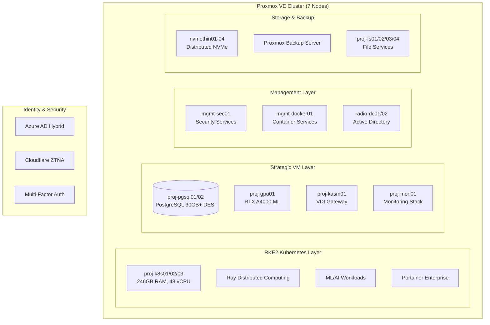

# 🌌 **Proxmox Astronomy Lab**

Enterprise-grade astronomical computing platform enabling cutting-edge DESI research through hybrid infrastructure

     

[](LICENSE)
[](https://github.com/Proxmox-Astronomy-Lab/proxmox-astronomy-lab/stargazers)
[](https://github.com/Proxmox-Astronomy-Lab/proxmox-astronomy-lab/issues)

---

## 🎯 **Platform Overview**

The **Proxmox Astronomy Lab** is a production-scale enterprise astronomical computing platform built on a **7-node Proxmox VE cluster** with hybrid **RKE2 Kubernetes** and **strategic VM architecture**. We're demonstrating that sophisticated astronomical computing doesn't require massive institutional resources—just smart engineering, open science principles, and enterprise-grade implementation.

What started as a proof-of-concept for SDR-based radio astronomy has evolved into a **legitimate research infrastructure** running real **DESI DR1 analysis workloads** producing peer-reviewed scientific publications. This platform proves that world-class astronomical research can be conducted anywhere with the right approach to infrastructure design and scientific methodology.


## 🚀 **Platform Mission**

- **🔬 Open Science**: Everything documented, reproducible, and shareable
- **📊 Real Science**: Production workloads on real data producing real papers  
- **🌍 Accessible Science**: Demonstrating that enterprise-grade research infrastructure can be built anywhere
- **🤝 Community Science**: Offering compute resources to astronomy students and researchers
- **🏛️ Enterprise Standards**: CIS Controls v8 compliance with systematic documentation

## 📊 **Current Platform Specifications**

| **Component** | **Specification** | **Purpose** |
|---------------|------------------|-------------|
| **🖥️ Compute Cluster** | 7-node Proxmox VE 8.4.1 (174 vCPUs, 692GB RAM allocated) | Enterprise-scale parallel processing and virtualization |
| **📦 Virtual Machines** | 35+ production VMs across management, project, and development networks | Comprehensive service architecture with strategic workload placement |
| **☸️ Kubernetes Platform** | 3-node RKE2 cluster (246GB RAM, 48 vCPU) | Container orchestration for dynamic ML/AI workloads |
| **🗄️ Database Infrastructure** | PostgreSQL 16 clusters with 30GB+ DESI data | Production astronomical database workloads |
| **🧠 AI/ML Acceleration** | RTX A4000 GPU with enterprise ML infrastructure | Distributed ML inference and training workflows |
| **🔡 Network Architecture** | Dual-link bonding with enterprise managed switches | High-bandwidth data movement and cluster interconnect |
| **🔒 Security Framework** | CIS Controls v8 + Azure AD + Zero Trust Network Access | Enterprise-grade security and identity management |

### **Infrastructure Architecture**

- **Proxmox Nodes**: Intel 12th/13th gen (i5-12600H to i9-13900H) with dedicated NVMe storage
- **Network Topology**: Management (10.16.207.x) + Multi-VLAN service networks (10.25.x.x)
- **Storage Systems**: Distributed NVMe pools (nvmethin01-04) with enterprise backup infrastructure
- **Identity Management**: Azure AD hybrid identity with Cloudflare Zero Trust Network Access


## ✨ **What Makes This Platform Unique**

### 🏢 **Enterprise-Grade, Research-Scale**

We've built **legitimate research computing infrastructure** that rivals institutional resources, documented every step with enterprise standards, and made it all reproducible. This isn't a homelab—we're running **production scientific workloads** and **publishing peer-reviewed research** with full **CIS Controls v8 compliance**.

### 🔄 **Hybrid Architecture Excellence**

- **RKE2 Kubernetes**: 3-node cluster (246GB RAM, 48 vCPU) for dynamic ML/AI workloads and distributed computing
- **Strategic VMs**: PostgreSQL databases, persistent services, GPU acceleration, and enterprise applications
- **Enterprise Integration**: Azure AD hybrid identity, Zero Trust Network Access, comprehensive monitoring

### 🔬 **Production DESI Research Workloads**

- **🌌 DESI Cosmic Void Analysis**: 30GB+ PostgreSQL implementation studying galaxy evolution in extreme environments
- **💨 AGN Outflow Surveys**: Semi-automated spectral analysis with Cloudy modeling integration
- **🔍 Anomalous Quasar Detection**: Large-scale ML anomaly detection using distributed Ray clusters on RKE2
- **📊 ML Infrastructure**: 1D Conv VAE on 1.6M spectra with enterprise GPU acceleration

### 📚 **Documentation Excellence**

Every component follows **enterprise documentation standards** with golden templates, CIS Controls compliance mapping, and systematic knowledge management. Our philosophy: **if you can't reproduce it, we didn't build it right**.

---

## 🏗️ **Architecture Overview**

### **Hybrid Infrastructure Strategy**



### **Service Architecture**

| **Service Tier** | **Implementation** | **Components** |
|------------------|-------------------|----------------|
| **Identity** | Azure AD + Zero Trust | Hybrid identity sync, conditional access, MFA enforcement |
| **Orchestration** | RKE2 + Portainer | 3-node Kubernetes control plane, container orchestration |
| **Compute** | Hybrid K8s/VM | Dynamic scaling + persistent services across 35+ VMs |
| **Data** | PostgreSQL + File Services | 30GB+ DESI databases + distributed file systems |
| **AI/ML** | Ray + GPU acceleration | Distributed computing + RTX A4000 inference |
| **Monitoring** | Prometheus + Grafana + Loki | Centralized observability with proj-mon01 |
| **Security** | CIS Controls v8 + NIST | Infrastructure hardening + compliance monitoring |

---

## 📁 **Repository Structure**

```markdown
PROXMOX-ASTRONOMY-LAB/
├── 🤖 ai-and-machine-learning/      # AI/ML infrastructure, GPU computing, RAG systems
├── 🛠️ applications-and-services/    # Production service configurations and deployments
├── 🌌 astronomy-projects/           # Active DESI research projects and analysis workflows
├── 🔧 automation-and-orchestration/ # Ansible automation, infrastructure as code
├── 📚 docs/                        # Enterprise documentation standards and procedures
├── 🔩 hardware/                    # Cluster specifications and network architecture
├── 🏗️ infrastructure/              # Core platform services and hybrid architecture
├── 📋 policies-and-procedures/     # Enterprise governance and CIS Controls compliance
├── 📊 project-management/          # Project coordination, phases, and planning
├── 📄 publishing/                  # Scientific publication and data release workflows
├── 🔒 security-assurance/          # CIS Controls v8 implementation and compliance
└── 📖 wiki/                        # Operational procedures and technical guides
```

### **Key Documentation Entry Points**

- **🏗️ [Infrastructure Overview](infrastructure/README.md)** - Core platform services and hybrid architecture
- **🌌 [Astronomy Projects](astronomy-projects/README.md)** - Active DESI analysis and research portfolio
- **🔧 [Hardware Specifications](hardware/README.md)** - Complete cluster hardware inventory and networking
- **📚 [Documentation Standards](docs/README.md)** - Enterprise documentation framework and templates
- **🔒 [Security Assurance](security-assurance/README.md)** - CIS Controls v8 and compliance implementation
- **🛠️ [Applications & Services](applications-and-services/README.md)** - Production service deployments

---

## 🔬 **Active Research Projects**

### **DESI Data Release 1 Analysis Portfolio**

#### **🌌 [Cosmic Void Galaxy Analysis](astronomy-projects/desi-cosmic-void-galaxies.md)**

- **Objective**: Environmental quenching studies in extreme low-density environments
- **Infrastructure**: 30GB+ PostgreSQL database (proj-pgsql01) with spatial indexing
- **Dataset**: DESI DR1 BGS galaxies cross-matched with cosmic void catalogs
- **Status**: Production analysis phase, systematic comparison methodology

#### **💨 [AGN Outflow Energetics](astronomy-projects/desi-quasar-outflows.md)**

- **Objective**: Systematic survey of quasar outflow properties and feedback mechanisms
- **Infrastructure**: Hybrid Docker/Kubernetes deployment with Cloudy modeling integration
- **Dataset**: DESI DR1 QSO spectra with semi-automated spectral fitting
- **Status**: Active development, methodology validation complete

#### **🔍 [Anomalous Quasar Detection](astronomy-projects/desi-qso-anomaly-detection.md)**

- **Objective**: ML-driven discovery of unusual quasar properties and phenomena
- **Infrastructure**: RKE2 Ray clusters with GPU acceleration for distributed ML
- **Dataset**: 1.6M DESI QSO spectra with 1D Conv VAE architecture
- **Status**: Production ML pipeline, anomaly catalog in development

### **Platform Research**

- **📊 [Spec-Driven AI](astronomy-projects/spec-driven-ai.md)**: AI methodology development for spectroscopic analysis
- **🏗️ Infrastructure Optimization**: Performance validation and enterprise operational procedures

---

## 💻 **Production Infrastructure Status**

### **Current Virtual Machine Deployment (35+ Active VMs)**

**Management Network (10.25.10.x):**

- mgmt-docker01 (16GB RAM, 4 vCPU) - Primary Docker and monitoring infrastructure
- mgmt-sec01 (12GB RAM, 4 vCPU) - Security services and compliance monitoring
- mgmt-agents01 (16GB RAM, 4 vCPU) - Infrastructure automation and agents
- mgmt-ansible01 (4GB RAM, 2 vCPU) - Configuration management
- radio-dc01 (6GB RAM, 2 vCPU) - Active Directory domain controller

**Project Network (10.25.20.x):**

- proj-k8s01/02/03 (246GB RAM, 48 vCPU total) - RKE2 Kubernetes cluster
- proj-pgsql01/02 (48GB RAM, 12 vCPU total) - PostgreSQL databases with 30GB+ DESI data
- proj-gpu01 (32GB RAM, 8 vCPU) - RTX A4000 GPU acceleration for ML workloads
- proj-mon01 (12GB RAM, 4 vCPU) - Centralized monitoring with Prometheus/Grafana
- proj-kasm01 (32GB RAM, 8 vCPU) - VDI and secure remote desktop access
- proj-docker01/02 (48GB RAM, 12 vCPU total) - Additional container workloads

**Storage & File Services:**

- proj-fs01/02/03/04 - Distributed file services with 3TB+ capacity
- Proxmox Backup Server - Enterprise backup with automated retention

**VDI Network (10.25.30.x):**

- radio-vdi01-05 (80GB RAM, 20 vCPU total) - Windows 11 virtual desktop infrastructure

### **Resource Allocation Summary**

| **Network Segment** | **VMs** | **vCPUs** | **RAM (GB)** | **Primary Function** |
|---------------------|---------|-----------|--------------|---------------------|
| **Management** | 5 | 12 | 42 | Infrastructure services, identity, monitoring |
| **Project** | 20+ | 130+ | 450+ | Research workloads, databases, AI/ML, containers |
| **VDI** | 6 | 28 | 128 | Virtual desktop infrastructure |
| **Storage** | 4+ | 8+ | 20+ | File services and backup infrastructure |

**Total Allocation**: **174+ vCPUs, 692+ GB RAM** across **7-node Proxmox cluster**

---

## 🌟 **Organization Repositories**

The Proxmox Astronomy Lab maintains several specialized repositories within our GitHub organization:

### **Core Platform Repository**

- **[proxmox-astronomy-lab](https://github.com/Proxmox-Astronomy-Lab/proxmox-astronomy-lab)** - Main infrastructure and documentation (this repository)

### **Research Project Repositories**

- **[desi-cosmic-void-galaxies](https://github.com/Proxmox-Astronomy-Lab/desi-cosmic-void-galaxies)** - Cosmic void galaxy analysis with DESI DR1
- **[desi-qso-anomaly-detection](https://github.com/Proxmox-Astronomy-Lab/desi-qso-anomaly-detection)** - ML anomaly detection on 1.6M+ quasar spectra
- **[desi-quasar-outflows](https://github.com/Proxmox-Astronomy-Lab/desi-quasar-outflows)** - AGN outflow energetics analysis
- **[spec-driven-ai](https://github.com/Proxmox-Astronomy-Lab/spec-driven-ai)** - AI methodology for spectroscopic analysis

### **Platform Development**

- **[proxmox-astronomy-lab.github](https://github.com/Proxmox-Astronomy-Lab/.github)** - Organization profile and community templates

Each repository follows our enterprise documentation standards and includes comprehensive setup instructions, methodology documentation, and reproducibility guidelines.

---

## 🚀 **Getting Started**

### **For Researchers**

1. **🌌 Review** [Astronomy Projects](astronomy-projects/README.md) for active collaboration opportunities
2. **🏗️ Understand** [Infrastructure Overview](infrastructure/README.md) for compute resource capabilities
3. **📄 Explore** [Publishing Workflows](publishing/README.md) for data release and publication procedures
4. **📖 Learn** [Operational Procedures](wiki/README.md) for hands-on technical implementation

### **For Infrastructure Engineers**

1. **🔧 Study** [Hardware Architecture](hardware/README.md) for cluster specifications and networking
2. **🔒 Examine** [Security Framework](security-assurance/README.md) for CIS Controls v8 implementation
3. **📚 Follow** [Documentation Standards](docs/README.md) for enterprise documentation framework
4. **🏗️ Deploy** using [Infrastructure as Code](automation-and-orchestration/README.md) principles

### **For Data Scientists & ML Engineers**

1. **🤖 Explore** [AI/ML Infrastructure](ai-and-machine-learning/README.md) for GPU acceleration and distributed computing
2. **🛠️ Review** [Application Services](applications-and-services/README.md) for ML platforms and databases
3. **📊 Analyze** [Research Projects](astronomy-projects/README.md) for active ML workloads and methodologies
4. **☸️ Learn** [Kubernetes Platform](infrastructure/README.md) for container orchestration and Ray clusters

### **For Contributors**

1. **📚 Read** [Documentation Standards](docs/documentation-standards/README.md) for template frameworks
2. **📋 Follow** [Contribution Guidelines](CONTRIBUTING.md) for systematic collaboration procedures
3. **🤝 Review** [Code of Conduct](CODE_OF_CONDUCT.md) for community interaction standards
4. **📖 Contribute** to [Knowledge Base](wiki/README.md) with operational procedures and guides

---

## 🔬 **Research Impact & Publications**

### **Scientific Contributions**

- **Open Data Commitment**: All analysis code and enriched catalogs released publicly through GitHub
- **Reproducible Research**: Complete workflow documentation enabling independent verification
- **Community Resources**: Compute platform methodologies available for astronomical education and research
- **Enterprise Standards**: Proving sophisticated astronomical computing accessibility with professional practices

### **Technical Innovation**

- **Hybrid Architecture Validation**: Demonstrating optimal RKE2 Kubernetes + VM allocation for scientific computing
- **Cost-Effective Infrastructure**: 7-node cluster achieving institutional-grade research capabilities
- **Documentation Excellence**: Enterprise standards with comprehensive technical documentation framework
- **Security Implementation**: CIS Controls v8 compliance for research computing environments

### **Platform Metrics**

- **🔥 Active Workloads**: 3 major DESI analysis projects in production with dedicated infrastructure
- **💾 Data Processing**: 30GB+ astronomical databases with optimized query performance
- **🧮 ML Throughput**: 1.6M spectra processed through VAE architecture on distributed Ray clusters
- **⚡ Infrastructure Reliability**: >99.5% availability across 35+ VM production environment

---

## 🤝 **Community & Collaboration**

### **Open Science Principles**

- **🌍 Public Code**: All analysis workflows and infrastructure automation available on GitHub
- **📊 Open Data**: DESI-derived catalogs released with full documentation and metadata
- **📖 Transparent Methods**: Complete methodology documentation with enterprise validation
- **🔄 Reproducible Infrastructure**: Full platform deployment documentation with systematic procedures

### **Collaboration Opportunities**

- **Student Projects**: Research collaboration for undergraduate/graduate astronomical computing
- **Compute Resources**: Platform methodologies for approved astronomical research projects
- **Technical Partnerships**: Infrastructure development, optimization, and methodology validation
- **Data Sharing**: Cross-institutional astronomical data analysis and collaborative computing

### **Community Standards**

- **Professional Conduct**: Respectful, inclusive, and constructive collaboration aligned with enterprise standards
- **Scientific Rigor**: Peer review, statistical validation, and systematic error analysis
- **Open Communication**: Transparent project status, methodology sharing, and collaborative development
- **Knowledge Transfer**: Active documentation, educational resource development, and community training

---

## 📄 **License & Usage**

This project is licensed under the **MIT License** - see the [LICENSE](LICENSE) file for details.

### **Citation Guidelines**

If you use this infrastructure, methodologies, or research in your work, please cite:

```bibtex
@misc{proxmox_astronomy_lab_2025,
  title={Proxmox Astronomy Lab: Enterprise-Grade Astronomical Computing Platform},
  author={VintageDon and Contributors},
  year={2025},
  url={https://github.com/Proxmox-Astronomy-Lab/proxmox-astronomy-lab},
  note={7-node hybrid Kubernetes/VM infrastructure for DESI astronomical research computing}
}
```

---

## 🙏 **Acknowledgments**

**Proxmox Astronomy Lab** demonstrates that world-class astronomical research infrastructure can be built through systematic engineering, enterprise standards, and open science principles. Built on open-source foundations and committed to reproducible research, this platform contributes to the astronomical community through precision measurements, innovative methodologies, and accessible computing resources.

### **Technology Foundation**

- **🏗️ Proxmox VE**: Virtualization platform enabling hybrid architecture with enterprise management
- **☸️ RKE2 Kubernetes**: Container orchestration for dynamic workloads and distributed computing
- **🐘 PostgreSQL**: High-performance astronomical database platform optimized for DESI workloads
- **🔥 Ray**: Distributed computing framework for ML workloads and large-scale data processing
- **🌌 DESI**: Dark Energy Spectroscopic Instrument data enabling cutting-edge astronomical research

### **Community Support**

- **🌍 Open Source Community**: Tools, libraries, and collaborative development enabling platform capabilities
- **🎓 Astronomical Community**: Methodology guidance, research validation, and scientific collaboration
- **👥 Contributors**: Documentation, testing, infrastructure development, and knowledge sharing
- **🔬 DESI Collaboration**: Data access, scientific context, and research methodology validation

---

🌌 **Enterprise-grade astronomical research computing** | **Proving sophisticated science is accessible**

**Last Updated**: August 15, 2025 | **Platform Status**: Production | **Next Major Update**: Q4 2025
