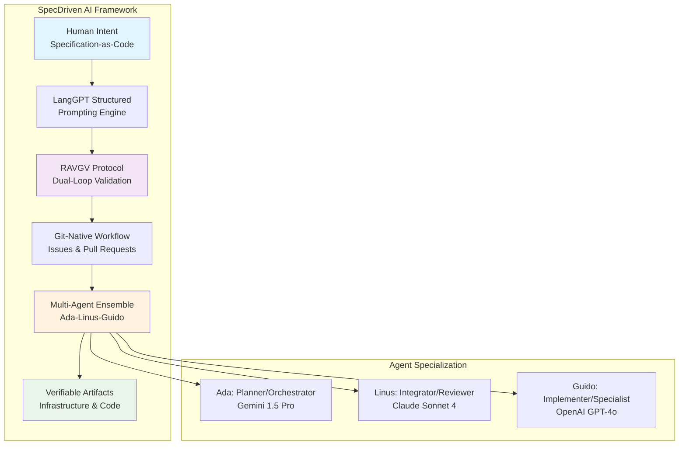

# 🤖 **Agentic AI**

This category provides comprehensive documentation for agentic artificial intelligence frameworks, tools, and implementations across the Proxmox Astronomy Lab's enterprise research computing platform. The documentation covers systematic approaches to autonomous AI agents, multi-modal reasoning systems, and human-AI collaborative frameworks supporting RAG (Retrieval-Augmented Generation), coding assistance, and scientific research automation. These implementations demonstrate enterprise-grade agentic AI deployment patterns for astronomical research, infrastructure automation, and knowledge management at scale.

## **Overview**

Agentic AI represents the sophisticated application of autonomous reasoning agents across multiple domains within the research computing infrastructure. The Proxmox Astronomy Lab implements advanced agentic frameworks including the SpecDriven AI Framework for verifiable human-AI collaboration, RAVGV (Request-Analyze-Verify-Generate-Validate) protocols for transparent co-creation, and comprehensive Model Context Protocol (MCP) server integrations. This implementation supports production astronomical research workflows, infrastructure automation, and enterprise-grade knowledge management through systematic deployment of Claude Code 4, OpenAI Codex, Gemini CLI, and Grok4 coding assistance platforms.

The agentic AI ecosystem enables autonomous infrastructure management, intelligent code generation, sophisticated RAG implementations, and transparent human-AI collaborative research workflows. These systems operate across the hybrid Kubernetes and VM architecture, providing seamless integration with PostgreSQL databases, Milvus vector storage, Neo4j graph databases, and comprehensive observability platforms for scientific computing applications requiring high reliability and auditability.

---

## **📁 Repository Structure**

```markdown
ai-and-machine-learning/agentic-ai/
├── README.md                                    # This category overview document
├── spec-driven-framework/
│   ├── README.md                               # SpecDriven AI Framework implementation
├── mcp-server-integrations/
│   ├── README.md                               # Model Context Protocol server deployments
├── multi-agent-orchestration/
│   ├── README.md                               # Multi-agent system coordination
├── claude-code-integration/
│   ├── README.md                               # Claude Code 4 development automation
├── openai-codex-workflows/
│   ├── README.md                               # OpenAI Codex implementations
├── gemini-cli-automation/
│   ├── README.md                               # Gemini CLI reasoning and analysis
├── enterprise-rag-pipelines/
│   ├── README.md                               # Production RAG implementations
├── scientific-knowledge-graphs/
│   ├── README.md                               # Astronomical research knowledge graphs
└── intelligent-documentation/
    ├── README.md                               # AI-powered documentation systems
```

---

## **📂 Directory Overview**

This section provides comprehensive navigation to all agentic AI frameworks, implementations, and supporting documentation.

### **🔧 Core Agentic Frameworks**

| **Component** | **Purpose** | **Implementation** |
|---------------|-------------|-------------------|
| **[spec-driven-framework/](spec-driven-framework/)** | SpecDriven AI Framework with declarative orchestration | Specification-as-Code with LangGPT and RAVGV protocols |
| **[mcp-server-integrations/](mcp-server-integrations/)** | Model Context Protocol server implementations | PostgreSQL, Milvus, Neo4j, Grafana, and infrastructure MCP servers |
| **[multi-agent-orchestration/](multi-agent-orchestration/)** | Multi-agent system coordination and management | CrewAI, LangGraph, and ensemble agent architectures |

### **🛠️ Coding and Development Agents**

| **Component** | **Purpose** | **Implementation** |
|---------------|-------------|-------------------|
| **[claude-code-integration/](claude-code-integration/)** | Claude Code 4 agentic development environment | Command-line AI coding assistance and code generation |
| **[openai-codex-workflows/](openai-codex-workflows/)** | OpenAI Codex code generation and analysis | Automated code review and generation workflows |
| **[gemini-cli-automation/](gemini-cli-automation/)** | Gemini CLI integration for reasoning and analysis | Multi-modal reasoning and scientific data analysis |

### **🧠 RAG and Knowledge Systems**

| **Component** | **Purpose** | **Implementation** |
|---------------|-------------|-------------------|
| **[enterprise-rag-pipelines/](enterprise-rag-pipelines/)** | Production RAG implementations with vector databases | Milvus, PostgreSQL, and Neo4j knowledge integration |
| **[scientific-knowledge-graphs/](scientific-knowledge-graphs/)** | Astronomical research knowledge graph construction | Neo4j-based scientific data relationship modeling |
| **[intelligent-documentation/](intelligent-documentation/)** | AI-powered documentation generation and maintenance | Automated knowledge base updates and scientific writing assistance |

---

## **🏗️ Architecture & Design**

This section details the systematic architecture supporting enterprise-grade agentic AI deployment across research computing infrastructure.

### **SpecDriven AI Framework Architecture**

The foundational agentic architecture implements declarative orchestration through Specification-as-Code paradigms, structured prompting via LangGPT, and verifiable co-creation through RAVGV protocols. This architecture prioritizes operational transparency and auditability over complex programmatic state machines.



### **MCP Server Integration Architecture**

The Model Context Protocol implementation provides standardized communication between AI applications and enterprise infrastructure components, enabling comprehensive observability and system management through agentic interfaces.

| **MCP Server Category** | **Implementation** | **Purpose** |
|------------------------|-------------------|-------------|
| **Database Integration** | PostgreSQL, Milvus, Neo4j, MongoDB MCP servers | Intelligent database management and knowledge retrieval |
| **Infrastructure Management** | Portainer, Prometheus, Grafana, Wazuh MCP servers | Autonomous infrastructure monitoring and maintenance |
| **Development Tooling** | Gitea, GitHub, VS Code MCP servers | AI-powered development workflow automation |
| **Observability Platform** | Unified Grafana MCP server for Prometheus/Loki integration | Comprehensive system observability through agentic queries |

### **Multi-Agent Orchestration Patterns**

The enterprise deployment implements sophisticated multi-agent coordination using proven orchestration frameworks optimized for research computing requirements and astronomical data processing workflows.

| **Orchestration Framework** | **Use Case** | **Implementation Pattern** |
|----------------------------|--------------|---------------------------|
| **CrewAI** | Role-based agent collaboration | Specialized agent teams for scientific research tasks |
| **LangGraph** | Complex cyclical workflows | Advanced state machine orchestration for data processing |
| **Custom Ensemble** | Ada-Linus-Guido architecture | Three-agent specialization for planning, implementation, and review |

---

## **⚙️ Management and Operations**

This section provides systematic approaches to managing enterprise agentic AI deployments across research computing infrastructure.

### **Agent Lifecycle Management**

Enterprise agentic AI operations require systematic lifecycle management across development, deployment, monitoring, and optimization phases to ensure reliable performance in production research environments.

| **Lifecycle Phase** | **Management Approach** | **Key Considerations** |
|-------------------|------------------------|----------------------|
| **Development** | SpecDriven framework with Git-native workflows | Transparent specification and verifiable co-creation |
| **Deployment** | Kubernetes-native agent orchestration | Container-based scaling and resource management |
| **Monitoring** | MCP-enabled observability with Grafana integration | Real-time agent performance and decision auditing |
| **Optimization** | Multi-model strategy with performance analysis | Cost optimization and capability specialization |

### **Quality Assurance and Validation**

Production agentic AI systems implement comprehensive validation frameworks ensuring reliable performance for critical research computing tasks and infrastructure automation.

| **Validation Layer** | **Implementation** | **Quality Metrics** |
|---------------------|-------------------|-------------------|
| **Specification Validation** | Pre-generation plan approval in RAVGV protocol | Intent alignment and requirement completeness |
| **Artifact Validation** | Post-generation verification and testing | Code quality, functionality, and compliance validation |
| **Performance Monitoring** | Real-time agent decision tracking and analysis | Response accuracy, execution time, and resource utilization |
| **Continuous Improvement** | Feedback loop integration and model optimization | Learning effectiveness and capability enhancement |

### **Security and Compliance Framework**

Enterprise agentic AI deployments implement comprehensive security controls ensuring safe operation within research computing environments while maintaining regulatory compliance and data protection requirements.

| **Security Domain** | **Implementation** | **Compliance Benefit** |
|-------------------|-------------------|----------------------|
| **Access Control** | Role-based agent permissions with MCP server integration | Principle of least privilege for autonomous systems |
| **Audit Logging** | Comprehensive decision and action logging | Transparent AI decision-making for research integrity |
| **Data Protection** | Secure vector storage and knowledge graph access controls | Research data confidentiality and intellectual property protection |
| **Operational Security** | Container isolation and network segmentation | Secure autonomous operation within enterprise infrastructure |

---

## **🔒 Security & Compliance**

This section documents comprehensive security controls and compliance alignment for enterprise agentic AI deployments within astronomical research computing infrastructure.

⚠️ AGENTIC AI SECURITY DISCLAIMER

*The agentic AI implementations described represent advanced autonomous systems requiring careful security consideration. These systems operate with elevated permissions for infrastructure management and data access. All agentic implementations follow enterprise security frameworks, but autonomous AI systems introduce novel risk profiles requiring ongoing security assessment and operational monitoring. For production deployments in sensitive research environments, implement comprehensive testing, monitoring, and human oversight protocols.*

### **Autonomous System Security Controls**

Enterprise-grade security implementation guided by industry standards for autonomous AI systems. Security controls are implemented systematically across the multi-agent orchestration platform to protect research computing infrastructure while enabling sophisticated autonomous operation capabilities.

| **Security Control Category** | **Implementation** | **Risk Mitigation** |
|------------------------------|-------------------|-------------------|
| **Agent Authentication** | MCP server-based identity and access management | Prevent unauthorized agent access to infrastructure |
| **Permission Boundaries** | Role-based access control with capability restrictions | Limit autonomous system scope and prevent privilege escalation |
| **Decision Auditing** | Comprehensive logging of all agent decisions and actions | Enable accountability and forensic analysis of autonomous operations |
| **Human Oversight** | RAVGV dual-loop validation with human approval gates | Maintain human control over critical system modifications |

### **Research Data Protection**

Agentic AI systems implement specialized controls for protecting sensitive astronomical research data and intellectual property during autonomous processing and analysis operations.

| **Data Protection Measure** | **Implementation** | **Research Benefit** |
|----------------------------|-------------------|---------------------|
| **Vector Database Security** | Encrypted Milvus storage with access controls | Secure research knowledge base access |
| **Graph Database Protection** | Neo4j authentication and relationship-based permissions | Protected scientific data relationship modeling |
| **Processing Isolation** | Container-based agent execution environments | Secure autonomous data analysis workflows |
| **Knowledge Sovereignty** | Local inference capabilities with sensitive data retention | Research data remains within institutional control |

### **Compliance Framework Integration**

Agentic AI implementations align with established research computing compliance requirements while enabling autonomous operation capabilities required for advanced scientific computing workflows.

| **Compliance Domain** | **Framework Alignment** | **Implementation Evidence** |
|----------------------|------------------------|---------------------------|
| **Research Integrity** | Transparent decision-making with comprehensive audit trails | RAVGV protocol validation and Git-native workflow documentation |
| **Data Governance** | Role-based access controls and data classification | MCP server permission frameworks and database access controls |
| **Operational Transparency** | Open-source frameworks with verifiable implementations | SpecDriven framework documentation and code availability |
| **Quality Assurance** | Multi-stage validation with human oversight integration | Dual-loop verification protocols and continuous monitoring |

---

## **🔗 Related Categories**

This section establishes systematic connections to other knowledge domains within the Proxmox Astronomy Lab ecosystem, demonstrating comprehensive integration across enterprise research computing infrastructure.

### **AI and Machine Learning Integration**

| **Category** | **Relationship** | **Agentic AI Integration** |
|--------------|------------------|--------------------------|
| **[../distributed-frameworks/](../distributed-frameworks/)** | Distributed computing orchestration | Agent-driven Ray cluster management and scaling |
| **[../training-pipelines/](../training-pipelines/)** | ML model training automation | Autonomous model training orchestration and optimization |
| **[../gpu-computing/](../gpu-computing/)** | GPU resource management | Intelligent GPU allocation and workload scheduling |
| **[../model-deployment/](../model-deployment/)** | Model serving infrastructure | Autonomous model deployment and lifecycle management |

### **Infrastructure and Platform Integration**

| **Category** | **Relationship** | **Agentic AI Integration** |
|--------------|------------------|--------------------------|
| **[../../infrastructure/k8s/](../../infrastructure/k8s/)** | Kubernetes orchestration platform | Agent-driven cluster management and workload orchestration |
| **[../../infrastructure/databases/](../../infrastructure/databases/)** | Database management automation | Intelligent database optimization and maintenance |
| **[../../infrastructure/monitoring/](../../infrastructure/monitoring/)** | Observability and alerting systems | Autonomous system monitoring and incident response |
| **[../../infrastructure/security/](../../infrastructure/security/)** | Security framework integration | AI-powered security monitoring and compliance validation |

### **Research and Documentation Integration**

| **Category** | **Relationship** | **Agentic AI Integration** |
|--------------|------------------|--------------------------|
| **[../../projects/](../../projects/)** | Active research project support | Autonomous research workflow assistance and data analysis |
| **[../../docs/](../../docs/)** | Documentation generation and maintenance | AI-powered documentation updates and knowledge management |
| **[../../reproducibility/](../../reproducibility/)** | Research reproducibility automation | Automated workflow documentation and validation |

---

## **🚀 Getting Started**

This section provides systematic guidance for implementing enterprise agentic AI capabilities across different operational roles and use cases within research computing infrastructure.

### **For AI Engineers**

**Framework Implementation:** [spec-driven-framework/](spec-driven-framework/)  
**Multi-Agent Setup:** [multi-agent-orchestration/](multi-agent-orchestration/)  
**MCP Integration:** [mcp-server-integrations/](mcp-server-integrations/)  
**RAG Systems:** [enterprise-rag-pipelines/](enterprise-rag-pipelines/)

### **For Infrastructure Engineers**

**MCP Server Deployment:** [mcp-server-integrations/](mcp-server-integrations/)  
**Agent Orchestration:** [multi-agent-orchestration/](multi-agent-orchestration/)  
**Infrastructure Automation:** [spec-driven-framework/](spec-driven-framework/)  
**Monitoring Integration:** [enterprise-rag-pipelines/](enterprise-rag-pipelines/)

### **For Research Computing Teams**

**Coding Assistance:** [claude-code-integration/](claude-code-integration/)  
**Knowledge Systems:** [scientific-knowledge-graphs/](scientific-knowledge-graphs/)  
**Documentation AI:** [intelligent-documentation/](intelligent-documentation/)  
**Research Automation:** [spec-driven-framework/](spec-driven-framework/)

### **For Platform Administrators**

**Enterprise Deployment:** [spec-driven-framework/](spec-driven-framework/)  
**Security Implementation:** [mcp-server-integrations/](mcp-server-integrations/)  
**Operations Management:** [multi-agent-orchestration/](multi-agent-orchestration/)  
**Compliance Framework:** [enterprise-rag-pipelines/](enterprise-rag-pipelines/)

---

## **Document Information**

| **Field** | **Value** |
|-----------|-----------|
| **Author** | VintageDon - <https://github.com/vintagedon> |
| **Created** | 2025-07-20 |
| **Last Updated** | 2025-07-20 |
| **Version** | 1.0 |

---
Tags: agentic-ai, autonomous-agents, spec-driven-framework, mcp-servers, multi-agent-orchestration, enterprise-rag, human-ai-collaboration, research-automation
