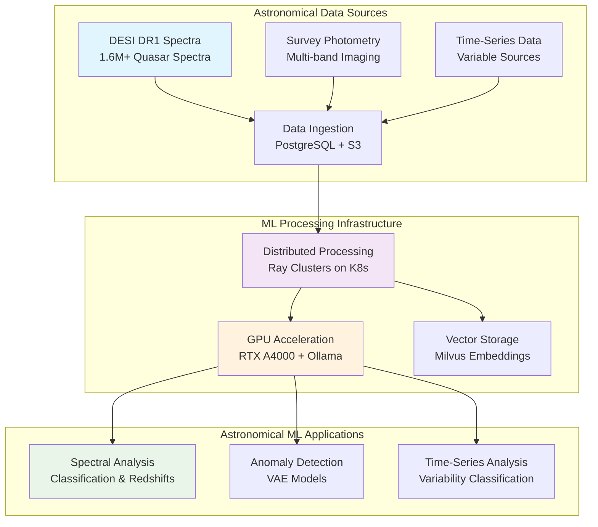

# 🔭 **Astronomical Machine Learning**

This category provides comprehensive documentation for machine learning methodologies, frameworks, and applications specifically designed for astronomical research and data analysis. The documentation covers systematic approaches to spectral analysis, anomaly detection, time-series analysis, and other domain-specific ML techniques supporting DESI data analysis, quasar research, and astronomical survey processing. These implementations demonstrate enterprise-grade machine learning deployment patterns optimized for large-scale astronomical datasets and scientific computing workflows.

## **Overview**

Astronomical Machine Learning represents the specialized application of machine learning techniques to solve complex problems in observational astronomy and astrophysics. The Proxmox Astronomy Lab implements production-scale ML workflows supporting DESI DR1 analysis, including 1.6M+ quasar spectra anomaly detection via Variational Autoencoders (VAE), distributed spectral processing using Ray clusters, and sophisticated time-series analysis for astronomical surveys. This implementation leverages enterprise GPU computing infrastructure, optimized data pipelines, and specialized astronomical ML libraries for reliable scientific research outcomes.

The astronomical ML ecosystem operates seamlessly across the hybrid Kubernetes and VM architecture, providing integration with PostgreSQL astronomical databases, Milvus vector storage for spectral embeddings, and distributed computing frameworks. These systems support production research workflows including cosmic void galaxy analysis, AGN outflow detection, and large-scale spectroscopic survey processing with emphasis on reproducibility, scalability, and scientific rigor.

---

## **📁 Repository Structure**

```markdown
ai-and-machine-learning/astronomical-ml/
├── README.md                                    # This category overview document
├── spectral-analysis-techniques/
│   └── README.md                               # ML methods for astronomical spectra
├── anomaly-detection-methods/
│   └── README.md                               # Outlier detection in astronomical data
├── time-series-analysis/
│   └── README.md                               # Temporal analysis for variable sources
├── survey-data-processing/
│   └── README.md                               # Large-scale survey ML pipelines
└── performance-optimization/
    └── README.md                               # ML performance tuning for astronomy
```

---

## **📂 Directory Overview**

This section provides comprehensive navigation to all astronomical machine learning methodologies and implementations.

### **🌌 Core Astronomical ML Techniques**

| **Component** | **Purpose** | **Implementation** |
|---------------|-------------|-------------------|
| **[spectral-analysis-techniques/](spectral-analysis-techniques/)** | Machine learning methods for astronomical spectral data | DESI spectra processing, redshift estimation, classification |
| **[anomaly-detection-methods/](anomaly-detection-methods/)** | Outlier detection and rare object identification | VAE-based quasar anomaly detection, unusual spectral features |
| **[time-series-analysis/](time-series-analysis/)** | Temporal analysis for variable astronomical sources | Light curve analysis, periodic signal detection, transient classification |

### **📊 Data Processing and Optimization**

| **Component** | **Purpose** | **Implementation** |
|---------------|-------------|-------------------|
| **[survey-data-processing/](survey-data-processing/)** | Large-scale astronomical survey ML pipelines | DESI DR1 processing workflows, distributed computing integration |
| **[performance-optimization/](performance-optimization/)** | ML performance tuning for astronomical applications | GPU optimization, distributed training, memory management |

---

## **🏗️ Architecture & Design**

This section details the systematic architecture supporting enterprise-grade astronomical machine learning across the research computing infrastructure.

### **Astronomical ML Pipeline Architecture**

The astronomical ML infrastructure implements specialized data processing pipelines optimized for large-scale spectroscopic surveys, multi-wavelength photometry, and time-domain astronomy applications with enterprise reliability and scientific reproducibility.



### **Enterprise ML Workflow Integration**

The astronomical ML implementation provides systematic integration with enterprise infrastructure components, enabling reliable processing of large astronomical datasets with comprehensive monitoring and validation.

| **Infrastructure Component** | **ML Integration** | **Astronomical Application** |
|------------------------------|-------------------|----------------------------|
| **RKE2 Kubernetes Clusters** | Ray distributed computing and ML job orchestration | Large-scale spectral processing and model training |
| **GPU Computing Infrastructure** | Accelerated deep learning and tensor operations | VAE training, CNN classification, transformer models |
| **Vector Database Storage** | Milvus for spectral embeddings and similarity search | Spectral template matching and anomaly detection |
| **PostgreSQL Integration** | Astronomical metadata and results storage | Survey catalogs, classification results, quality metrics |

### **Scientific Computing Optimization**

The astronomical ML platform implements domain-specific optimizations ensuring efficient processing of astronomical data characteristics including high-dimensional spectra, sparse photometry, and irregular time sampling.

| **Optimization Category** | **Implementation** | **Scientific Benefit** |
|---------------------------|-------------------|----------------------|
| **Memory Management** | Efficient handling of large spectral arrays | Processing 1.6M+ spectra without memory constraints |
| **Distributed Computing** | Ray-based parallel processing across cluster nodes | Scalable model training and inference for survey data |
| **GPU Utilization** | Optimized tensor operations for astronomical data formats | Accelerated deep learning on spectroscopic datasets |
| **Data Pipeline Efficiency** | Streaming data processing with quality validation | Real-time processing of incoming survey observations |

---

## **⚙️ Management and Operations**

This section provides systematic approaches to managing astronomical machine learning deployments across research computing infrastructure.

### **ML Model Lifecycle Management**

Enterprise astronomical ML operations require systematic model development, validation, deployment, and monitoring procedures ensuring reliable performance for scientific research applications and publication-quality results.

| **Lifecycle Phase** | **Management Approach** | **Astronomical Considerations** |
|-------------------|------------------------|-----------------------------|
| **Data Preparation** | Quality validation and astronomical metadata integration | Proper handling of observational uncertainties and calibration |
| **Model Development** | Domain-specific architectures and validation metrics | Astrophysically meaningful loss functions and evaluation criteria |
| **Production Deployment** | Containerized models with monitoring and rollback capabilities | Reliable processing for ongoing survey operations |
| **Performance Monitoring** | Scientific accuracy tracking and computational efficiency | Validation against known astronomical standards and benchmarks |

### **Quality Assurance Framework**

Astronomical ML systems implement comprehensive validation ensuring scientific accuracy, reproducibility, and compliance with observational astronomy standards and publication requirements.

| **Quality Domain** | **Validation Approach** | **Implementation** |
|-------------------|------------------------|-------------------|
| **Scientific Accuracy** | Cross-validation against established astronomical catalogs | Comparison with literature values and expert validation |
| **Computational Reproducibility** | Deterministic training procedures and version control | Fixed random seeds, environment containers, and data provenance |
| **Statistical Significance** | Proper uncertainty quantification and error propagation | Bayesian methods and bootstrap validation for astronomical measurements |
| **Observational Compliance** | Integration with astronomical data standards and formats | FITS file handling, WCS coordinate systems, and metadata preservation |

### **Resource Optimization Strategy**

Production astronomical ML deployments implement comprehensive resource management ensuring efficient utilization of computing infrastructure while maintaining scientific productivity and research timelines.

| **Resource Category** | **Optimization Strategy** | **Implementation** |
|----------------------|--------------------------|-------------------|
| **GPU Utilization** | Dynamic allocation and job scheduling | Multi-tenant GPU access via Kubernetes resource quotas |
| **Storage Management** | Tiered storage with automated archival | Hot storage for active datasets, cold storage for archived results |
| **Network Bandwidth** | Efficient data transfer and caching strategies | Local caching of frequently accessed datasets and model artifacts |
| **Computational Scaling** | Elastic cluster scaling based on workload demands | Automatic scaling of Ray clusters for large processing jobs |

---

## **🔒 Security & Compliance**

This section documents comprehensive security controls and compliance alignment for astronomical machine learning deployments within research computing environments.

⚠️ ASTRONOMICAL ML SECURITY DISCLAIMER

*The astronomical ML implementations process sensitive research data and computational resources requiring careful access control and data protection. Machine learning models may inadvertently encode sensitive information from training data, and large-scale processing capabilities require proper security boundaries. All astronomical ML deployments follow enterprise security frameworks with specific attention to research data confidentiality, intellectual property protection, and computational resource governance appropriate for scientific computing environments.*

### **Research Data Protection**

Enterprise-grade security implementation guided by research computing standards for astronomical machine learning systems. Security controls protect sensitive observational data, proprietary analysis methods, and computational resources while enabling collaborative research and publication.

| **Security Control Category** | **Implementation** | **Research Protection** |
|------------------------------|-------------------|------------------------|
| **Data Access Control** | Role-based permissions for astronomical datasets | Protection of proprietary survey data and unpublished research |
| **Model Security** | Secure model storage and controlled inference endpoints | Prevention of unauthorized access to trained models and algorithms |
| **Computational Governance** | Resource quotas and usage monitoring | Fair allocation of GPU resources and prevention of resource abuse |
| **Research Integrity** | Audit logging and provenance tracking | Transparent documentation of data processing and model development |

### **Scientific Computing Compliance**

Astronomical ML implementations align with research computing standards ensuring proper handling of scientific data, reproducible research practices, and compliance with funding agency requirements.

| **Compliance Domain** | **Framework Alignment** | **Implementation Evidence** |
|----------------------|------------------------|---------------------------|
| **Data Management** | Research data management plans and retention policies | Automated metadata capture and dataset versioning |
| **Reproducible Research** | Open science practices with transparent methodologies | Version-controlled code, containerized environments, and documentation |
| **Publication Standards** | Compliance with astronomical journal requirements | Proper uncertainty quantification and statistical methodology |
| **Collaborative Research** | Secure sharing and attribution frameworks | Access controls supporting multi-institutional collaboration |

---

## **🔗 Related Categories**

This section establishes systematic connections to other knowledge domains within the Proxmox Astronomy Lab ecosystem, demonstrating comprehensive integration across enterprise research computing infrastructure.

### **AI and Machine Learning Integration**

| **Category** | **Relationship** | **Astronomical ML Integration** |
|--------------|------------------|-------------------------------|
| **[../agentic-ai/](../agentic-ai/)** | Autonomous agent-driven ML workflows | AI-powered model optimization and hyperparameter tuning |
| **[../distributed-frameworks/](../distributed-frameworks/)** | Distributed computing for ML training | Ray cluster integration for large-scale astronomical model training |
| **[../gpu-computing/](../gpu-computing/)** | GPU acceleration for deep learning | Optimized tensor operations for astronomical neural networks |
| **[../training-pipelines/](../training-pipelines/)** | Automated ML pipeline management | End-to-end training workflows for astronomical models |

### **Research and Infrastructure Integration**

| **Category** | **Relationship** | **Astronomical ML Integration** |
|--------------|------------------|-------------------------------|
| **[../../projects/](../../projects/)** | Active research project ML implementations | DESI analysis workflows and scientific computing applications |
| **[../../infrastructure/databases/](../../infrastructure/databases/)** | Astronomical database integration | PostgreSQL optimization for ML training data and results storage |
| **[../../infrastructure/monitoring/](../../infrastructure/monitoring/)** | ML system observability | Model performance monitoring and computational resource tracking |
| **[../../infrastructure/k8s/](../../infrastructure/k8s/)** | Kubernetes orchestration for ML workloads | Container-based ML deployment and scaling |

---

## **🚀 Getting Started**

This section provides systematic guidance for implementing astronomical machine learning capabilities across different operational roles and research applications.

### **For Data Scientists**

**Spectral Analysis:** [spectral-analysis-techniques/](spectral-analysis-techniques/)  
**Anomaly Detection:** [anomaly-detection-methods/](anomaly-detection-methods/)  
**Time-Series Methods:** [time-series-analysis/](time-series-analysis/)  
**Performance Optimization:** [performance-optimization/](performance-optimization/)

### **For Research Computing Teams**

**Survey Processing:** [survey-data-processing/](survey-data-processing/)  
**ML Infrastructure:** [performance-optimization/](performance-optimization/)  
**Data Pipeline Development:** [spectral-analysis-techniques/](spectral-analysis-techniques/)  
**Distributed Computing:** [anomaly-detection-methods/](anomaly-detection-methods/)

### **For Astronomical Researchers**

**Spectroscopic Analysis:** [spectral-analysis-techniques/](spectral-analysis-techniques/)  
**Object Classification:** [anomaly-detection-methods/](anomaly-detection-methods/)  
**Variable Source Analysis:** [time-series-analysis/](time-series-analysis/)  
**Large-Scale Surveys:** [survey-data-processing/](survey-data-processing/)

### **For Platform Administrators**

**Infrastructure Optimization:** [performance-optimization/](performance-optimization/)  
**Resource Management:** [survey-data-processing/](survey-data-processing/)  
**Security Implementation:** [spectral-analysis-techniques/](spectral-analysis-techniques/)  
**Monitoring Integration:** [time-series-analysis/](time-series-analysis/)

---

## **Document Information**

| **Field** | **Value** |
|-----------|-----------|
| **Author** | VintageDon - <https://github.com/vintagedon> |
| **Created** | 2025-07-20 |
| **Last Updated** | 2025-07-20 |
| **Version** | 1.0 |

---
Tags: astronomical-ml, spectral-analysis, anomaly-detection, time-series, survey-processing, desi-analysis, enterprise-ml, scientific-computing
