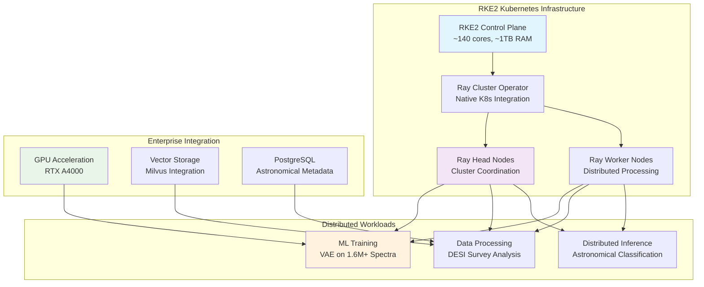

# ⚡ **Distributed Frameworks**

This category provides comprehensive documentation for distributed computing frameworks and parallel processing systems deployed across the Proxmox Astronomy Lab's enterprise research computing platform. The documentation covers systematic approaches to distributed machine learning, parallel data processing, and scalable computing orchestration supporting large-scale astronomical workloads. These implementations demonstrate enterprise-grade distributed computing deployment patterns optimized for DESI data analysis, Ray cluster management, and high-performance scientific computing at scale.

## **Overview**

Distributed Frameworks represent the sophisticated application of parallel and distributed computing technologies across the 7-node hybrid Kubernetes and VM architecture. The Proxmox Astronomy Lab implements production-scale distributed computing workflows centered on Ray distributed computing for ML training and inference, supporting DESI anomalous quasar detection with 1.6M+ spectra processing, VAE model training, and large-scale astronomical survey analysis. This implementation leverages enterprise RKE2 Kubernetes orchestration, GPU acceleration, and high-performance networking to enable scalable scientific computing with enterprise reliability and performance characteristics.

The distributed computing ecosystem operates seamlessly across the hybrid infrastructure, providing integration with PostgreSQL astronomical databases, Milvus vector processing, and comprehensive monitoring systems. These frameworks support production research workflows including distributed ML training, parallel spectral processing, and scalable data pipelines with emphasis on fault tolerance, resource optimization, and scientific reproducibility requirements.

---

## **📁 Repository Structure**

```markdown
ai-and-machine-learning/distributed-frameworks/
├── README.md                                    # This category overview document
├── ray-cluster-management/
│   ├── README.md                               # Ray distributed computing platform
│   ├── kubernetes-ray-deployment/             # Ray on RKE2 Kubernetes implementation
│   ├── distributed-ml-training/               # ML model training across clusters
│   └── autoscaling-configuration/             # Dynamic resource scaling
├── parallel-data-processing/
│   ├── README.md                               # Large-scale data processing frameworks
│   ├── dask-integration/                      # Dask parallel computing
│   ├── spark-kubernetes/                      # Apache Spark on Kubernetes
│   └── astronomical-pipelines/                # Domain-specific processing workflows
├── workload-orchestration/
│   ├── README.md                               # Distributed workload management
│   ├── kubernetes-jobs/                       # K8s-native distributed processing
│   ├── workflow-engines/                      # Argo Workflows and pipeline management
│   └── resource-allocation/                   # Multi-tenant resource management
├── performance-optimization/
│   ├── README.md                               # Distributed computing optimization
│   ├── network-optimization/                  # High-bandwidth cluster networking
│   ├── storage-acceleration/                  # Distributed storage and caching
│   └── gpu-cluster-coordination/              # Multi-GPU distributed computing
└── monitoring-observability/
    ├── README.md                               # Distributed system monitoring
    ├── cluster-metrics/                       # Resource utilization and performance
    ├── distributed-logging/                   # Centralized log aggregation
    └── fault-tolerance/                       # Failure detection and recovery
```

---

## **📂 Directory Overview**

This section provides comprehensive navigation to all distributed computing frameworks and implementations.

### **🔧 Core Distributed Computing Platforms**

| **Component** | **Purpose** | **Implementation** |
|---------------|-------------|-------------------|
| **[ray-cluster-management/](ray-cluster-management/)** | Ray distributed computing platform for ML and data processing | Kubernetes-native Ray clusters with autoscaling and GPU support |
| **[parallel-data-processing/](parallel-data-processing/)** | Large-scale data processing frameworks | Dask, Spark, and astronomical data pipeline orchestration |
| **[workload-orchestration/](workload-orchestration/)** | Distributed workload management and scheduling | Kubernetes jobs, Argo Workflows, and resource allocation |

### **⚙️ Optimization and Operations**

| **Component** | **Purpose** | **Implementation** |
|---------------|-------------|-------------------|
| **[performance-optimization/](performance-optimization/)** | Distributed computing performance tuning | Network, storage, and GPU cluster optimization |
| **[monitoring-observability/](monitoring-observability/)** | Distributed system monitoring and observability | Cluster metrics, logging, and fault tolerance systems |

---

## **🏗️ Architecture & Design**

This section details the systematic architecture supporting enterprise-grade distributed computing across the research computing infrastructure.

### **Ray Distributed Computing Architecture**

The foundational distributed computing architecture implements Ray clusters on RKE2 Kubernetes with enterprise orchestration, supporting large-scale ML training, distributed inference, and parallel data processing for astronomical research workloads.



### **Distributed ML Training Framework**

The enterprise distributed ML implementation provides systematic training orchestration across multiple nodes with GPU acceleration, supporting production astronomical research models and large-scale spectroscopic analysis.

| **Training Component** | **Implementation** | **Astronomical Application** |
|-----------------------|-------------------|----------------------------|
| **Ray Train Integration** | Distributed PyTorch training across cluster nodes | VAE model training on DESI quasar spectra datasets |
| **Multi-GPU Coordination** | GPU scheduling and memory management | Accelerated deep learning for spectral classification |
| **Fault Tolerance** | Automatic checkpoint and recovery mechanisms | Reliable long-running training for astronomical models |
| **Hyperparameter Optimization** | Ray Tune distributed hyperparameter search | Model optimization for astronomical data characteristics |

### **Parallel Data Processing Architecture**

The distributed data processing platform implements multiple frameworks optimized for different astronomical workload patterns, providing scalable processing for survey data, time-series analysis, and large-scale spectroscopic datasets.

| **Processing Framework** | **Use Case** | **Implementation Pattern** |
|--------------------------|--------------|---------------------------|
| **Ray Data** | Large-scale dataset processing and ETL | DESI survey data ingestion and preprocessing |
| **Dask Integration** | Parallel array and dataframe operations | Astronomical image processing and catalog analysis |
| **Spark on Kubernetes** | Big data analytics and SQL processing | Multi-survey cross-matching and statistical analysis |

---

## **⚙️ Management and Operations**

This section provides systematic approaches to managing distributed computing deployments across enterprise research computing infrastructure.

### **Cluster Lifecycle Management**

Enterprise distributed computing operations require systematic cluster provisioning, scaling, monitoring, and maintenance procedures ensuring reliable performance for production astronomical research workloads and scientific computing applications.

| **Lifecycle Phase** | **Management Approach** | **Distributed Computing Considerations** |
|-------------------|------------------------|----------------------------------------|
| **Cluster Provisioning** | Kubernetes-native deployment with Helm charts | Automated Ray cluster deployment with enterprise networking |
| **Dynamic Scaling** | Horizontal pod autoscaling based on workload demands | Elastic resource allocation for varying research computing needs |
| **Resource Management** | Multi-tenant resource quotas and prioritization | Fair allocation across multiple research projects and users |
| **Maintenance Operations** | Rolling updates and graceful job migration | Minimal disruption to long-running ML training and analysis |

### **Performance Optimization Strategy**

Production distributed computing deployments implement comprehensive performance tuning ensuring efficient utilization of cluster resources while maintaining scientific productivity and research timeline requirements.

| **Optimization Domain** | **Strategy** | **Implementation** |
|------------------------|--------------|-------------------|
| **Network Performance** | High-bandwidth interconnects and optimized communication | 10G networking with RDMA and MPI optimization |
| **Storage Acceleration** | Distributed caching and parallel I/O optimization | NVMe-backed distributed storage with intelligent caching |
| **CPU Utilization** | NUMA-aware scheduling and CPU affinity optimization | Optimal task placement for scientific computing workloads |
| **Memory Management** | Distributed memory allocation and garbage collection tuning | Efficient memory usage for large astronomical datasets |

### **Fault Tolerance and Reliability**

Enterprise distributed computing systems implement comprehensive fault tolerance ensuring reliable operation for critical research workloads and long-running scientific computations requiring high availability.

| **Reliability Component** | **Implementation** | **Research Benefit** |
|---------------------------|-------------------|---------------------|
| **Checkpoint Management** | Automatic state saving and recovery | Resilient long-running ML training and data processing |
| **Node Failure Handling** | Automatic task redistribution and recovery | Uninterrupted processing during hardware failures |
| **Data Replication** | Distributed data storage with redundancy | Protection against data loss in multi-node processing |
| **Health Monitoring** | Proactive failure detection and alerting | Early intervention to prevent compute resource waste |

---

## **🔒 Security & Compliance**

This section documents comprehensive security controls and compliance alignment for distributed computing deployments within research computing environments.

⚠️ DISTRIBUTED COMPUTING SECURITY DISCLAIMER

*The distributed computing implementations process sensitive research data across multiple nodes and require careful security boundary management. Distributed systems introduce complex attack surfaces including inter-node communication, shared storage access, and dynamic resource allocation. All distributed computing deployments follow enterprise security frameworks with specific attention to data-in-transit protection, compute resource isolation, and access control for research data processing environments.*

### **Distributed System Security Controls**

Enterprise-grade security implementation guided by research computing standards for distributed computing systems. Security controls protect data flows across cluster nodes, computation resources, and storage systems while enabling high-performance scientific computing.

| **Security Control Category** | **Implementation** | **Research Protection** |
|------------------------------|-------------------|------------------------|
| **Inter-Node Communication** | Encrypted network communication with mutual authentication | Protection of distributed data processing and model training |
| **Resource Isolation** | Kubernetes namespaces and network policies | Secure multi-tenant research computing environments |
| **Data Access Control** | Role-based access to distributed storage and databases | Controlled access to sensitive astronomical datasets |
| **Audit Logging** | Comprehensive logging of distributed job execution | Transparent tracking of research computation and data access |

### **Research Data Protection in Distributed Systems**

Distributed computing implementations provide specialized controls for protecting sensitive astronomical research data during parallel processing, distributed training, and multi-node analysis operations.

| **Data Protection Measure** | **Implementation** | **Research Benefit** |
|----------------------------|-------------------|---------------------|
| **Data Locality Controls** | Geographic and network-based data placement policies | Compliance with institutional data sovereignty requirements |
| **Encryption in Transit** | End-to-end encryption for inter-node data transfer | Secure distributed processing of proprietary research data |
| **Temporary Data Management** | Secure cleanup of intermediate processing results | Prevention of research data leakage in distributed environments |
| **Access Audit Trails** | Detailed logging of data access across distributed nodes | Research integrity and collaboration accountability |

---

## **🔗 Related Categories**

This section establishes systematic connections to other knowledge domains within the Proxmox Astronomy Lab ecosystem, demonstrating comprehensive integration across enterprise research computing infrastructure.

### **AI and Machine Learning Integration**

| **Category** | **Relationship** | **Distributed Frameworks Integration** |
|--------------|------------------|---------------------------------------|
| **[../agentic-ai/](../agentic-ai/)** | Distributed agent orchestration | Ray-based multi-agent system coordination and scaling |
| **[../astronomical-ml/](../astronomical-ml/)** | Large-scale ML model training | Distributed training for astronomical neural networks |
| **[../gpu-computing/](../gpu-computing/)** | Multi-GPU distributed computing | GPU cluster coordination for accelerated scientific computing |
| **[../training-pipelines/](../training-pipelines/)** | Automated distributed training workflows | Orchestrated ML pipeline execution across clusters |

### **Infrastructure and Platform Integration**

| **Category** | **Relationship** | **Distributed Frameworks Integration** |
|--------------|------------------|---------------------------------------|
| **[../../infrastructure/k8s/](../../infrastructure/k8s/)** | Kubernetes-native distributed computing | RKE2 cluster management and container orchestration |
| **[../../infrastructure/monitoring/](../../infrastructure/monitoring/)** | Distributed system observability | Cluster-wide metrics collection and performance monitoring |
| **[../../infrastructure/networking/](../../infrastructure/networking/)** | High-performance cluster networking | 10G network optimization for distributed workloads |
| **[../../infrastructure/storage/](../../infrastructure/storage/)** | Distributed storage and data management | NVMe-backed parallel storage for large-scale processing |

### **Research and Application Integration**

| **Category** | **Relationship** | **Distributed Frameworks Integration** |
|--------------|------------------|---------------------------------------|
| **[../../projects/](../../projects/)** | Distributed processing for research projects | DESI analysis workflows and astronomical data processing |
| **[../../reproducibility/](../../reproducibility/)** | Reproducible distributed computing | Infrastructure-as-code for distributed system deployment |

---

## **🚀 Getting Started**

This section provides systematic guidance for implementing distributed computing capabilities across different operational roles and research computing applications.

### **For Distributed Systems Engineers**

**Ray Cluster Setup:** [ray-cluster-management/](ray-cluster-management/)  
**Performance Optimization:** [performance-optimization/](performance-optimization/)  
**System Monitoring:** [monitoring-observability/](monitoring-observability/)  
**Workload Orchestration:** [workload-orchestration/](workload-orchestration/)

### **For ML Engineers**

**Distributed Training:** [ray-cluster-management/](ray-cluster-management/)  
**Data Processing Pipelines:** [parallel-data-processing/](parallel-data-processing/)  
**GPU Cluster Management:** [performance-optimization/](performance-optimization/)  
**Model Optimization:** [workload-orchestration/](workload-orchestration/)

### **For Research Computing Teams**

**Large-Scale Processing:** [parallel-data-processing/](parallel-data-processing/)  
**Workflow Management:** [workload-orchestration/](workload-orchestration/)  
**Resource Optimization:** [performance-optimization/](performance-optimization/)  
**System Reliability:** [monitoring-observability/](monitoring-observability/)

### **For Platform Administrators**

**Infrastructure Management:** [ray-cluster-management/](ray-cluster-management/)  
**Resource Allocation:** [workload-orchestration/](workload-orchestration/)  
**Performance Tuning:** [performance-optimization/](performance-optimization/)  
**Security Implementation:** [monitoring-observability/](monitoring-observability/)

---

## **Document Information**

| **Field** | **Value** |
|-----------|-----------|
| **Author** | VintageDon - <https://github.com/vintagedon> |
| **Created** | 2025-07-20 |
| **Last Updated** | 2025-07-20 |
| **Version** | 1.0 |

---
Tags: distributed-computing, ray-clusters, parallel-processing, kubernetes-orchestration, ml-training, astronomical-computing, enterprise-scaling, research-computing
