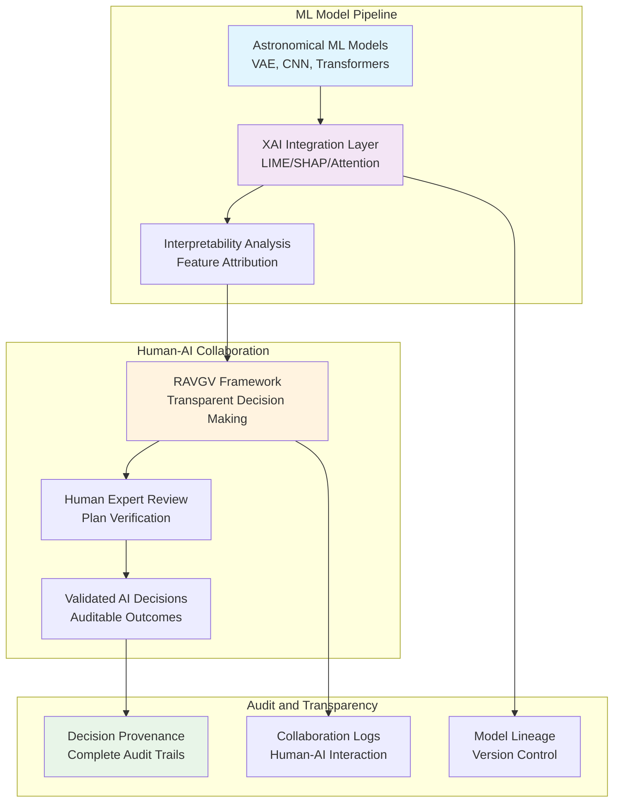

# 🔍 **Explainable and Responsible AI**

This category provides comprehensive documentation for explainable AI (XAI) techniques and responsible AI practices deployed across the Proxmox Astronomy Lab's enterprise research computing platform. The documentation covers systematic approaches to AI transparency, interpretability methods, and ethical AI frameworks supporting trustworthy machine learning in astronomical research. These implementations demonstrate enterprise-grade explainable AI deployment patterns optimized for scientific computing, research integrity, and transparent human-AI collaboration.

## **Overview**

Explainable and Responsible AI represents the critical application of transparency and interpretability techniques across AI/ML systems within the research computing infrastructure. The Proxmox Astronomy Lab implements production-scale explainable AI workflows including LIME and SHAP analysis for astronomical ML models, transparent decision-making frameworks for agentic AI systems, and comprehensive audit trails for AI-assisted research processes. This implementation supports scientific integrity requirements, research reproducibility standards, and responsible AI practices for astronomical data analysis and infrastructure automation.

The explainable AI ecosystem operates across the hybrid Kubernetes and VM architecture, providing integration with distributed ML frameworks, astronomical databases, and research workflows. These systems ensure AI transparency in DESI spectral analysis, VAE anomaly detection interpretability, and verifiable human-AI collaboration through systematic XAI techniques and responsible AI governance frameworks.

---

## **📁 Repository Structure**

```markdown
ai-and-machine-learning/explainable-and-responsible-ai/
├── README.md                                    # This category overview document
├── interpretability-techniques/
│   ├── README.md                               # XAI methods and implementation
│   ├── lime-analysis/                          # LIME explainability for astronomical ML
│   ├── shap-visualization/                     # SHAP plots and feature importance
│   └── attention-mechanisms/                   # Attention-based model interpretability
├── responsible-ai-frameworks/
│   ├── README.md                               # Ethical AI governance and practices
│   ├── bias-detection/                         # Fairness and bias assessment
│   ├── uncertainty-quantification/             # Model confidence and uncertainty
│   └── human-ai-collaboration/                 # Transparent human-AI workflows
├── audit-and-transparency/
│   ├── README.md                               # AI decision auditing and logging
│   ├── model-provenance/                       # ML model lineage and versioning
│   ├── decision-trails/                        # AI decision tracking and explanation
│   └── research-integrity/                     # Scientific computing transparency
└── ethics-and-governance/
    ├── README.md                               # AI ethics and governance frameworks
    ├── scientific-ethics/                     # Research ethics for AI-assisted science
    ├── data-governance/                        # Responsible data usage and privacy
    └── risk-assessment/                        # AI risk evaluation and mitigation
```

---

## **📂 Directory Overview**

This section provides comprehensive navigation to all explainable AI techniques and responsible AI implementations.

### **🔍 Core Explainability Techniques**

| **Component** | **Purpose** | **Implementation** |
|---------------|-------------|-------------------|
| **[interpretability-techniques/](interpretability-techniques/)** | XAI methods for astronomical ML model interpretation | LIME, SHAP, and attention visualization for spectral analysis |
| **[responsible-ai-frameworks/](responsible-ai-frameworks/)** | Ethical AI governance and bias detection | Fairness assessment and human-AI collaboration frameworks |
| **[audit-and-transparency/](audit-and-transparency/)** | AI decision auditing and provenance tracking | Model lineage, decision trails, and research integrity systems |

### **⚖️ Ethics and Governance**

| **Component** | **Purpose** | **Implementation** |
|---------------|-------------|-------------------|
| **[ethics-and-governance/](ethics-and-governance/)** | AI ethics frameworks and risk assessment | Scientific ethics, data governance, and responsible AI practices |

---

## **🏗️ Architecture & Design**

This section details the systematic architecture supporting explainable and responsible AI across the research computing infrastructure.

### **XAI Integration Architecture**

The explainable AI architecture implements interpretability techniques integrated with distributed ML frameworks, providing transparent insights into astronomical model decisions and enabling verifiable human-AI collaboration for scientific research.



### **Responsible AI Governance Framework**

The responsible AI implementation provides systematic governance ensuring ethical AI deployment, bias detection, and transparent decision-making across astronomical research and infrastructure automation applications.

| **Governance Component** | **Implementation** | **Research Application** |
|--------------------------|-------------------|-------------------------|
| **Bias Detection Systems** | Fairness metrics and demographic parity analysis | Equitable astronomical survey analysis and classification |
| **Uncertainty Quantification** | Bayesian methods and confidence interval estimation | Reliable uncertainty estimates for astronomical measurements |
| **Human Oversight Integration** | RAVGV dual-loop validation and expert review | Transparent human-AI collaboration for research decisions |
| **Ethical Review Processes** | Scientific ethics frameworks and peer review | Responsible AI use in astronomical research publications |

### **Scientific Integrity Assurance**

The explainable AI platform implements domain-specific transparency measures ensuring scientific integrity, reproducibility, and trust in AI-assisted astronomical research and data analysis.

| **Integrity Component** | **Implementation** | **Scientific Benefit** |
|-------------------------|-------------------|----------------------|
| **Model Interpretability** | LIME/SHAP analysis for astronomical feature importance | Understanding AI decisions in spectral classification |
| **Decision Transparency** | Comprehensive audit trails and explanation generation | Verifiable AI contributions to scientific analysis |
| **Reproducibility Assurance** | Version-controlled models and deterministic explanations | Reproducible XAI analysis across research studies |
| **Expert Validation** | Human expert review of AI explanations and decisions | Scientific quality assurance for AI-assisted research |

---

## **⚙️ Management and Operations**

This section provides systematic approaches to managing explainable AI deployments across enterprise research computing infrastructure.

### **XAI Workflow Integration**

Enterprise explainable AI operations require systematic integration of interpretability techniques into ML workflows, ensuring transparent model development, deployment, and monitoring for scientific research applications.

| **Integration Phase** | **XAI Implementation** | **Research Considerations** |
|----------------------|----------------------|----------------------------|
| **Model Development** | Built-in interpretability and explanation generation | XAI techniques compatible with astronomical model architectures |
| **Validation Testing** | Explanation quality assessment and expert review | Scientific validation of AI explanations and feature attribution |
| **Production Deployment** | Real-time explanation generation and monitoring | Interpretable AI decisions for ongoing research operations |
| **Continuous Improvement** | Explanation feedback and model refinement | Learning from expert feedback to improve AI transparency |

### **Responsible AI Monitoring**

Production explainable AI systems implement comprehensive monitoring ensuring ongoing transparency, bias detection, and ethical AI operation within research computing environments.

| **Monitoring Domain** | **Implementation** | **Responsible AI Benefit** |
|-----------------------|-------------------|---------------------------|
| **Model Fairness** | Continuous bias detection and mitigation | Equitable AI performance across diverse astronomical datasets |
| **Explanation Quality** | Automated explanation validation and human feedback | Reliable and trustworthy AI interpretations |
| **Decision Transparency** | Real-time audit logging and provenance tracking | Complete transparency for AI-assisted research decisions |
| **Ethical Compliance** | Ongoing assessment against responsible AI frameworks | Sustained ethical AI operation in scientific computing |

### **Scientific Quality Assurance**

Explainable AI implementations provide specialized quality assurance ensuring scientific rigor, peer review compatibility, and publication standards for AI-assisted astronomical research.

| **Quality Assurance Component** | **Implementation** | **Scientific Impact** |
|--------------------------------|-------------------|---------------------|
| **Peer Review Preparation** | Comprehensive explanation documentation | AI transparency for scientific peer review processes |
| **Reproducibility Validation** | Deterministic explanation generation | Consistent XAI analysis across independent research groups |
| **Publication Standards** | Explanation quality metrics and validation | Meeting journal requirements for AI transparency in publications |
| **Collaborative Verification** | Multi-expert explanation review and consensus | Community validation of AI explanation quality and accuracy |

---

## **🔒 Security & Compliance**

This section documents comprehensive security controls and compliance alignment for explainable AI deployments within research computing environments.

⚠️ EXPLAINABLE AI SECURITY DISCLAIMER

*The explainable AI implementations process sensitive research data and model information requiring careful transparency balance management. XAI techniques may inadvertently expose sensitive model parameters or training data characteristics. All explainable AI deployments follow responsible disclosure frameworks with specific attention to research data confidentiality, intellectual property protection, and appropriate transparency levels for scientific computing environments.*

### **Responsible Transparency Controls**

Enterprise-grade security implementation guided by responsible AI standards for explainable AI systems. Security controls balance AI transparency requirements with research data protection and intellectual property considerations.

| **Security Control Category** | **Implementation** | **Responsible AI Protection** |
|------------------------------|-------------------|------------------------------|
| **Explanation Access Control** | Role-based access to XAI outputs and model interpretations | Controlled transparency appropriate to research collaboration levels |
| **Model Information Protection** | Selective explanation disclosure without exposing proprietary methods | Protection of research algorithms while maintaining scientific transparency |
| **Data Privacy in Explanations** | Privacy-preserving XAI techniques and anonymization | Protection of sensitive astronomical data in explanation outputs |
| **Intellectual Property Safeguards** | Controlled sharing of AI explanations and model insights | Balanced transparency supporting collaboration without compromising IP |

### **Research Ethics Compliance**

Explainable AI implementations align with scientific ethics frameworks ensuring responsible AI use, transparent research practices, and appropriate disclosure for astronomical research and publication.

| **Ethics Domain** | **Framework Alignment** | **Implementation Evidence** |
|-------------------|------------------------|---------------------------|
| **Scientific Transparency** | Open science practices with appropriate AI disclosure | Comprehensive documentation of AI contributions to research |
| **Research Integrity** | Honest reporting of AI limitations and uncertainty | Transparent communication of AI model capabilities and constraints |
| **Collaborative Ethics** | Fair attribution and transparent human-AI collaboration | Clear documentation of human and AI contributions to research outcomes |
| **Publication Standards** | Compliance with journal requirements for AI transparency | Meeting scientific publication standards for AI-assisted research |

---

## **🔗 Related Categories**

This section establishes systematic connections to other knowledge domains within the Proxmox Astronomy Lab ecosystem, demonstrating comprehensive integration across enterprise research computing infrastructure.

### **AI and Machine Learning Integration**

| **Category** | **Relationship** | **Explainable AI Integration** |
|--------------|------------------|------------------------------|
| **[../agentic-ai/](../agentic-ai/)** | Transparent autonomous agent decision-making | XAI integration with RAVGV verification protocols |
| **[../astronomical-ml/](../astronomical-ml/)** | Interpretable astronomical ML models | LIME/SHAP analysis for spectral classification and anomaly detection |
| **[../distributed-frameworks/](../distributed-frameworks/)** | Explainable distributed computing decisions | Transparent resource allocation and distributed ML explanations |
| **[../training-pipelines/](../training-pipelines/)** | Interpretable ML pipeline development | XAI integration throughout model development and deployment |

### **Research and Infrastructure Integration**

| **Category** | **Relationship** | **Explainable AI Integration** |
|--------------|------------------|------------------------------|
| **[../../projects/](../../projects/)** | Transparent AI-assisted research workflows | XAI support for DESI analysis and astronomical research projects |
| **[../../reproducibility/](../../reproducibility/)** | Reproducible explainable AI analysis | Version-controlled XAI techniques and deterministic explanations |
| **[../../docs/](../../docs/)** | Transparent AI documentation and explanation | Comprehensive documentation of AI decision-making and interpretability |

---

## **🚀 Getting Started**

This section provides systematic guidance for implementing explainable AI capabilities across different operational roles and research applications.

### **For AI/ML Engineers**

**XAI Implementation:** [interpretability-techniques/](interpretability-techniques/)  
**Bias Detection:** [responsible-ai-frameworks/](responsible-ai-frameworks/)  
**Model Transparency:** [audit-and-transparency/](audit-and-transparency/)  
**Ethics Framework:** [ethics-and-governance/](ethics-and-governance/)

### **For Research Scientists**

**Model Interpretability:** [interpretability-techniques/](interpretability-techniques/)  
**Research Ethics:** [ethics-and-governance/](ethics-and-governance/)  
**Collaboration Transparency:** [responsible-ai-frameworks/](responsible-ai-frameworks/)  
**Publication Compliance:** [audit-and-transparency/](audit-and-transparency/)

### **For Data Scientists**

**LIME/SHAP Analysis:** [interpretability-techniques/](interpretability-techniques/)  
**Uncertainty Quantification:** [responsible-ai-frameworks/](responsible-ai-frameworks/)  
**Decision Auditing:** [audit-and-transparency/](audit-and-transparency/)  
**Quality Assurance:** [ethics-and-governance/](ethics-and-governance/)

### **For Platform Administrators**

**Governance Implementation:** [ethics-and-governance/](ethics-and-governance/)  
**Audit Systems:** [audit-and-transparency/](audit-and-transparency/)  
**Responsible AI Monitoring:** [responsible-ai-frameworks/](responsible-ai-frameworks/)  
**Transparency Infrastructure:** [interpretability-techniques/](interpretability-techniques/)

---

## **Document Information**

| **Field** | **Value** |
|-----------|-----------|
| **Author** | VintageDon - <https://github.com/vintagedon> |
| **Created** | 2025-07-20 |
| **Last Updated** | 2025-07-20 |
| **Version** | 1.0 |

---
Tags: explainable-ai, responsible-ai, lime-shap, interpretability, ai-ethics, transparency, audit-trails, scientific-integrity
