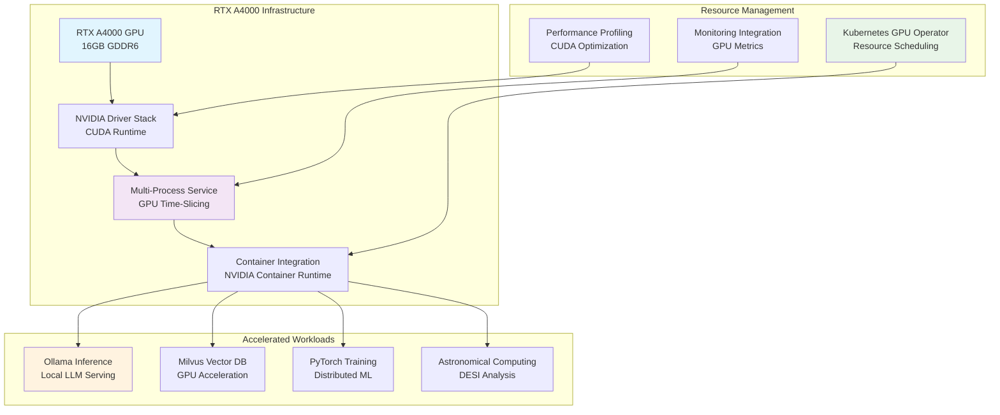

# 🚀 **GPU Computing**

This category provides comprehensive documentation for GPU acceleration and high-performance computing implementations across the Proxmox Astronomy Lab's enterprise research computing platform. The documentation covers systematic approaches to GPU-accelerated workloads, vector database optimization, machine learning inference, and distributed computing acceleration supporting large-scale astronomical research applications. These implementations demonstrate enterprise-grade GPU computing deployment patterns optimized for RTX A4000 acceleration, Milvus vector processing, and scientific computing workload optimization.

## **Overview**

GPU Computing represents the sophisticated application of graphics processing unit acceleration across diverse computational workloads within the research computing infrastructure. The Proxmox Astronomy Lab implements production-scale GPU acceleration centered on an RTX A4000 GPU supporting Ollama local inference, Milvus vector database acceleration, PyTorch distributed training, and specialized astronomical computing applications. This implementation provides enterprise-grade GPU resource management, multi-process service (MPS) coordination, and optimized CUDA workflows for scientific research requiring high-performance parallel processing capabilities.

The GPU computing ecosystem operates seamlessly across the hybrid Kubernetes and VM architecture, providing integration with distributed frameworks, vector databases, and astronomical ML pipelines. These systems enable accelerated DESI spectral analysis, VAE model training, vector similarity search, and real-time inference applications with emphasis on resource efficiency, performance optimization, and scientific computing reliability requirements.

---

## **📁 Repository Structure**

```markdown
ai-and-machine-learning/gpu-computing/
├── README.md                                    # This category overview document
├── rtx-a4000-management/
│   ├── README.md                               # RTX A4000 configuration and optimization
│   ├── driver-installation/                   # NVIDIA driver and CUDA setup
│   ├── multi-process-service/                 # MPS for GPU time-slicing
│   └── monitoring-metrics/                    # GPU utilization and performance tracking
├── accelerated-inference/
│   ├── README.md                               # GPU-accelerated model inference
│   ├── ollama-optimization/                   # Local LLM inference with Ollama
│   ├── pytorch-acceleration/                  # PyTorch GPU optimization
│   └── astronomical-models/                   # Domain-specific accelerated inference
├── vector-database-acceleration/
│   ├── README.md                               # GPU-accelerated vector operations
│   ├── milvus-gpu-optimization/               # Milvus vector database GPU acceleration
│   ├── embedding-generation/                  # Accelerated vector embedding creation
│   └── similarity-search/                     # High-performance vector similarity search
├── distributed-training/
│   ├── README.md                               # Multi-GPU and distributed training
│   ├── ray-gpu-integration/                   # Ray distributed GPU computing
│   ├── pytorch-distributed/                   # Multi-GPU PyTorch training
│   └── kubernetes-gpu-scheduling/             # K8s GPU resource management
└── performance-optimization/
    ├── README.md                               # GPU performance tuning and optimization
    ├── memory-management/                     # GPU memory optimization strategies
    ├── cuda-optimization/                     # CUDA kernel optimization
    └── workload-profiling/                    # GPU workload analysis and tuning
```

---

## **📂 Directory Overview**

This section provides comprehensive navigation to all GPU computing implementations and optimization techniques.

### **🔧 Core GPU Infrastructure**

| **Component** | **Purpose** | **Implementation** |
|---------------|-------------|-------------------|
| **[rtx-a4000-management/](rtx-a4000-management/)** | RTX A4000 GPU configuration and resource management | NVIDIA driver setup, MPS coordination, monitoring integration |
| **[accelerated-inference/](accelerated-inference/)** | GPU-accelerated model inference and serving | Ollama local inference, PyTorch acceleration, astronomical model optimization |
| **[vector-database-acceleration/](vector-database-acceleration/)** | GPU-accelerated vector operations and databases | Milvus GPU optimization, embedding acceleration, similarity search |

### **⚡ Advanced GPU Computing**

| **Component** | **Purpose** | **Implementation** |
|---------------|-------------|-------------------|
| **[distributed-training/](distributed-training/)** | Multi-GPU and distributed training workflows | Ray GPU integration, PyTorch distributed, Kubernetes GPU scheduling |
| **[performance-optimization/](performance-optimization/)** | GPU performance tuning and optimization | Memory management, CUDA optimization, workload profiling |

---

## **🏗️ Architecture & Design**

This section details the systematic architecture supporting enterprise-grade GPU computing across the research computing infrastructure.

### **RTX A4000 Enterprise Architecture**

The GPU computing architecture implements enterprise-grade RTX A4000 acceleration with systematic resource management, multi-tenant access control, and comprehensive monitoring supporting diverse research computing workloads and astronomical applications.



### **GPU-Accelerated Application Integration**

The enterprise GPU implementation provides systematic acceleration for multiple application categories, enabling high-performance computing across diverse research workloads with optimal resource utilization and performance characteristics.

| **Application Category** | **GPU Acceleration** | **Research Application** |
|-------------------------|---------------------|-------------------------|
| **Vector Database Operations** | Milvus GPU acceleration for embedding similarity search | High-speed astronomical catalog cross-matching and spectral template matching |
| **Local LLM Inference** | Ollama GPU optimization for sensitive data processing | Private AI inference for research data and proprietary analysis workflows |
| **Distributed ML Training** | PyTorch multi-GPU coordination with Ray integration | Large-scale VAE training on DESI spectral datasets |
| **Scientific Computing** | CUDA-accelerated astronomical algorithms | Optimized spectral processing and signal analysis workflows |

### **Enterprise Resource Management**

The GPU computing platform implements sophisticated resource management ensuring fair allocation, optimal utilization, and enterprise-grade reliability for multi-tenant research computing environments.

| **Resource Management Component** | **Implementation** | **Enterprise Benefit** |
|----------------------------------|-------------------|----------------------|
| **Multi-Process Service (MPS)** | GPU time-slicing for concurrent workload execution | Efficient GPU utilization across multiple research projects |
| **Kubernetes GPU Operator** | Native GPU resource scheduling and allocation | Enterprise-grade container orchestration with GPU awareness |
| **Memory Management** | Intelligent GPU memory allocation and garbage collection | Optimal memory utilization for large astronomical datasets |
| **Performance Monitoring** | Real-time GPU utilization and performance tracking | Proactive resource optimization and capacity planning |

---

## **⚙️ Management and Operations**

This section provides systematic approaches to managing GPU computing deployments across enterprise research computing infrastructure.

### **GPU Infrastructure Lifecycle**

Enterprise GPU computing operations require systematic hardware management, software maintenance, and performance optimization ensuring reliable operation for production research workloads and scientific computing applications.

| **Lifecycle Phase** | **Management Approach** | **GPU-Specific Considerations** |
|-------------------|------------------------|--------------------------------|
| **Hardware Provisioning** | RTX A4000 installation with enterprise cooling and power | Proper GPU seating, thermal management, and power supply validation |
| **Software Configuration** | NVIDIA driver installation with CUDA toolkit optimization | Driver version compatibility and CUDA library optimization |
| **Workload Deployment** | Container-based GPU workload orchestration | NVIDIA container runtime and GPU device allocation |
| **Performance Optimization** | Continuous monitoring and tuning of GPU utilization | Memory optimization, kernel efficiency, and thermal management |

### **Multi-Tenant GPU Resource Management**

Production GPU computing systems implement comprehensive resource allocation ensuring fair access, optimal utilization, and quality of service for multiple research teams and computational workloads.

| **Resource Management Domain** | **Implementation Strategy** | **Research Computing Benefit** |
|-------------------------------|----------------------------|-------------------------------|
| **Workload Scheduling** | Priority-based GPU job queuing and allocation | Fair access to GPU resources across research projects |
| **Memory Allocation** | Dynamic GPU memory management with overflow handling | Optimal memory utilization for varying dataset sizes |
| **Thermal Management** | Automated GPU thermal throttling and cooling optimization | Sustained performance under continuous research workloads |
| **Usage Monitoring** | Comprehensive GPU utilization tracking and reporting | Resource accountability and capacity planning for research groups |

### **Performance Optimization Strategy**

Enterprise GPU deployments implement systematic performance tuning ensuring optimal throughput, minimal latency, and efficient resource utilization for scientific computing and research applications.

| **Optimization Category** | **Tuning Strategy** | **Performance Impact** |
|---------------------------|-------------------|----------------------|
| **CUDA Kernel Optimization** | Memory coalescing and occupancy maximization | Improved computational throughput for astronomical algorithms |
| **Memory Management** | Unified memory usage and transfer optimization | Reduced data movement overhead for large spectral datasets |
| **Batch Processing** | Dynamic batch size optimization for varying workloads | Maximized GPU utilization across different research applications |
| **Pipeline Optimization** | Overlapped computation and data transfer | Minimized idle time and improved overall system throughput |

---

## **🔒 Security & Compliance**

This section documents comprehensive security controls and compliance alignment for GPU computing deployments within research computing environments.

⚠️ GPU COMPUTING SECURITY DISCLAIMER

*The GPU computing implementations provide high-performance acceleration for sensitive research data processing requiring careful access control and resource governance. GPU-accelerated workloads may process proprietary algorithms, sensitive astronomical data, and confidential research information. All GPU computing deployments follow enterprise security frameworks with specific attention to compute resource isolation, data protection during acceleration, and appropriate access controls for high-performance computing environments.*

### **GPU Resource Security Controls**

Enterprise-grade security implementation guided by research computing standards for GPU computing systems. Security controls protect computational resources, research data, and intellectual property while enabling high-performance scientific computing.

| **Security Control Category** | **Implementation** | **Research Protection** |
|------------------------------|-------------------|------------------------|
| **Compute Resource Isolation** | Container-based GPU allocation with namespace separation | Secure multi-tenant GPU access for different research groups |
| **Data Protection During Processing** | Memory encryption and secure data transfer to GPU | Protection of sensitive astronomical data during acceleration |
| **Access Control** | Role-based GPU resource allocation and usage monitoring | Controlled access to high-performance computing resources |
| **Audit Logging** | Comprehensive logging of GPU resource usage and access | Transparent tracking of computational resource utilization |

### **Research Computing Compliance**

GPU computing implementations align with research computing standards ensuring proper resource governance, data protection, and appropriate usage policies for scientific computing environments.

| **Compliance Domain** | **Framework Alignment** | **Implementation Evidence** |
|----------------------|------------------------|---------------------------|
| **Resource Governance** | Fair allocation and usage monitoring policies | Transparent GPU resource scheduling and utilization reporting |
| **Data Sovereignty** | Local GPU processing for sensitive research data | On-premises GPU acceleration maintaining data residency |
| **Performance Transparency** | Open monitoring and benchmarking practices | Comprehensive GPU performance metrics and optimization documentation |
| **Collaborative Access** | Secure multi-user GPU resource sharing | Controlled access supporting collaborative research while maintaining security |

---

## **🔗 Related Categories**

This section establishes systematic connections to other knowledge domains within the Proxmox Astronomy Lab ecosystem, demonstrating comprehensive integration across enterprise research computing infrastructure.

### **AI and Machine Learning Integration**

| **Category** | **Relationship** | **GPU Computing Integration** |
|--------------|------------------|------------------------------|
| **[../distributed-frameworks/](../distributed-frameworks/)** | Multi-GPU distributed computing | Ray GPU coordination and distributed training acceleration |
| **[../astronomical-ml/](../astronomical-ml/)** | GPU-accelerated astronomical models | Accelerated spectral analysis and VAE training optimization |
| **[../training-pipelines/](../training-pipelines/)** | GPU-accelerated model training | PyTorch GPU optimization and distributed training workflows |
| **[../rag-raggraph/](../rag-raggraph/)** | GPU-accelerated vector operations | Milvus GPU acceleration and embedding generation optimization |

### **Infrastructure and Platform Integration**

| **Category** | **Relationship** | **GPU Computing Integration** |
|--------------|------------------|------------------------------|
| **[../../infrastructure/k8s/](../../infrastructure/k8s/)** | Kubernetes GPU orchestration | GPU Operator deployment and container GPU allocation |
| **[../../infrastructure/monitoring/](../../infrastructure/monitoring/)** | GPU performance monitoring | NVIDIA GPU metrics integration and alerting |
| **[../../infrastructure/virtualization/](../../infrastructure/virtualization/)** | GPU passthrough and virtualization | Proxmox GPU passthrough and VM-based GPU acceleration |

### **Research and Application Integration**

| **Category** | **Relationship** | **GPU Computing Integration** |
|--------------|------------------|------------------------------|
| **[../../projects/](../../projects/)** | GPU-accelerated research workflows | DESI analysis acceleration and astronomical computing optimization |
| **[../../reproducibility/](../../reproducibility/)** | Reproducible GPU computing | Version-controlled GPU environments and deterministic acceleration |

---

## **🚀 Getting Started**

This section provides systematic guidance for implementing GPU computing capabilities across different operational roles and research computing applications.

### **For GPU Systems Engineers**

**RTX A4000 Setup:** [rtx-a4000-management/](rtx-a4000-management/)  
**Performance Optimization:** [performance-optimization/](performance-optimization/)  
**Resource Management:** [distributed-training/](distributed-training/)  
**Monitoring Integration:** [rtx-a4000-management/](rtx-a4000-management/)

### **For ML Engineers**

**Accelerated Inference:** [accelerated-inference/](accelerated-inference/)  
**Distributed Training:** [distributed-training/](distributed-training/)  
**Vector Acceleration:** [vector-database-acceleration/](vector-database-acceleration/)  
**Performance Tuning:** [performance-optimization/](performance-optimization/)

### **For Research Computing Teams**

**GPU Workload Optimization:** [accelerated-inference/](accelerated-inference/)  
**Vector Database Acceleration:** [vector-database-acceleration/](vector-database-acceleration/)  
**Scientific Computing:** [performance-optimization/](performance-optimization/)  
**Resource Access:** [distributed-training/](distributed-training/)

### **For Platform Administrators**

**Infrastructure Management:** [rtx-a4000-management/](rtx-a4000-management/)  
**Resource Allocation:** [distributed-training/](distributed-training/)  
**Performance Monitoring:** [performance-optimization/](performance-optimization/)  
**Security Implementation:** [rtx-a4000-management/](rtx-a4000-management/)

---

## **Document Information**

| **Field** | **Value** |
|-----------|-----------|
| **Author** | VintageDon - <https://github.com/vintagedon> |
| **Created** | 2025-07-20 |
| **Last Updated** | 2025-07-20 |
| **Version** | 1.0 |

---
Tags: gpu-computing, rtx-a4000, cuda-optimization, milvus-acceleration, ollama-inference, pytorch-gpu, distributed-training, enterprise-gpu
