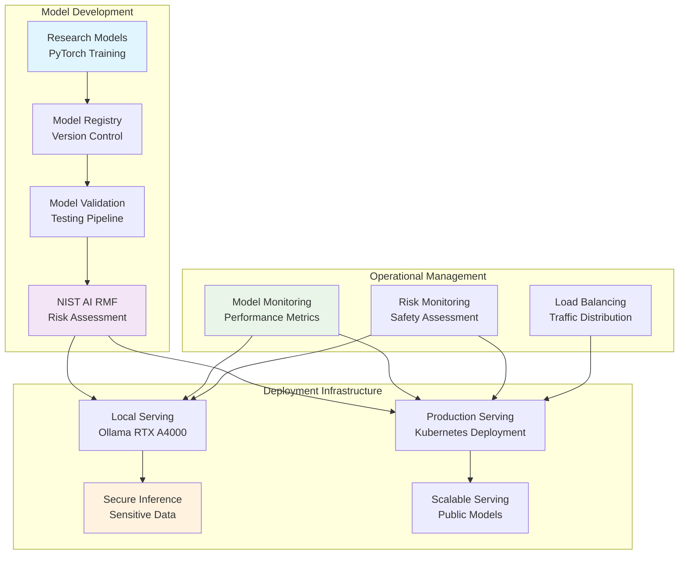

# 🚀 **Model Deployment**

This category provides comprehensive documentation for AI model deployment and serving infrastructure across the Proxmox Astronomy Lab's enterprise research computing platform. The documentation covers systematic approaches to model lifecycle management, production serving, local inference deployment, and risk management following NIST AI Risk Management Framework guidelines. These implementations demonstrate enterprise-grade model deployment patterns optimized for research computing environments, hybrid Kubernetes orchestration, and secure multi-tenant model serving supporting astronomical research applications.

## **Overview**

Model Deployment represents the sophisticated orchestration of AI/ML model serving, lifecycle management, and production deployment across the research computing infrastructure. The Proxmox Astronomy Lab implements enterprise-grade model deployment centered on Ollama local serving, PyTorch model orchestration, distributed model inference, and NIST AI RMF-aligned risk management procedures. This implementation provides comprehensive model versioning, A/B testing capabilities, canary deployments, and systematic risk assessment procedures for AI models supporting scientific research applications.

The model deployment ecosystem operates seamlessly across the hybrid Kubernetes and VM architecture, providing integration with GPU acceleration, vector databases, and astronomical ML pipelines. These systems enable secure local inference for sensitive research data, distributed model serving for large-scale analysis, and systematic model governance ensuring reliability, reproducibility, and risk management for production scientific computing applications.

---

## **📁 Repository Structure**

```markdown
ai-and-machine-learning/model-deployment/
├── README.md                                    # This category overview document
├── ollama-local-serving/
│   ├── README.md                               # Local model serving with Ollama
│   ├── model-management/                       # Model installation and versioning
│   ├── api-configuration/                      # API endpoints and authentication
│   └── performance-optimization/               # Local inference optimization
├── production-serving/
│   ├── README.md                               # Enterprise model serving infrastructure
│   ├── kubernetes-deployment/                 # K8s-based model deployment
│   ├── load-balancing/                         # Traffic distribution and scaling
│   └── monitoring-observability/              # Production model monitoring
├── model-lifecycle-management/
│   ├── README.md                               # End-to-end model lifecycle
│   ├── versioning-registry/                   # Model version control and registry
│   ├── ci-cd-pipelines/                        # Automated deployment pipelines
│   └── rollback-procedures/                   # Model rollback and recovery
├── inference-optimization/
│   ├── README.md                               # Model inference performance optimization
│   ├── batch-processing/                       # Efficient batch inference
│   ├── caching-strategies/                     # Intelligent result caching
│   └── hardware-acceleration/                 # GPU and specialized hardware optimization
├── risk-management/
│   ├── README.md                               # NIST AI RMF implementation
│   ├── nist-ai-rmf-compliance/                # AI Risk Management Framework
│   ├── model-validation/                      # Model testing and validation procedures
│   └── safety-monitoring/                     # Continuous model safety assessment
└── astronomical-models/
    ├── README.md                               # Domain-specific model deployments
    ├── spectral-analysis-models/               # DESI spectral processing models
    ├── vae-deployment/                         # Variational autoencoder serving
    └── anomaly-detection-serving/              # Astronomical anomaly detection models
```

---

## **📂 Directory Overview**

This section provides comprehensive navigation to all model deployment implementations and management procedures.

### **🔧 Core Deployment Infrastructure**

| **Component** | **Purpose** | **Implementation** |
|---------------|-------------|-------------------|
| **[ollama-local-serving/](ollama-local-serving/)** | Local model serving for sensitive data processing | Ollama configuration, model management, secure local inference |
| **[production-serving/](production-serving/)** | Enterprise-grade model serving infrastructure | Kubernetes deployment, load balancing, production monitoring |
| **[model-lifecycle-management/](model-lifecycle-management/)** | End-to-end model lifecycle orchestration | Version control, CI/CD pipelines, automated deployment |

### **⚡ Optimization and Performance**

| **Component** | **Purpose** | **Implementation** |
|---------------|-------------|-------------------|
| **[inference-optimization/](inference-optimization/)** | Model inference performance optimization | Batch processing, caching strategies, hardware acceleration |
| **[astronomical-models/](astronomical-models/)** | Domain-specific model deployment patterns | DESI models, VAE serving, astronomical ML deployments |

### **🛡️ Risk Management and Governance**

| **Component** | **Purpose** | **Implementation** |
|---------------|-------------|-------------------|
| **[risk-management/](risk-management/)** | NIST AI RMF compliance and model governance | Risk assessment, validation procedures, safety monitoring |

---

## **🏗️ Architecture & Design**

This section details the systematic architecture supporting enterprise-grade model deployment across the research computing infrastructure.

### **Hybrid Model Deployment Architecture**

The model deployment architecture implements enterprise-grade serving capabilities with systematic integration across local inference, production Kubernetes deployment, and comprehensive risk management following NIST AI Risk Management Framework guidelines.



### **NIST AI Risk Management Framework Integration**

The enterprise model deployment platform implements comprehensive risk management aligned with NIST AI RMF guidelines, ensuring systematic risk assessment, mitigation, and monitoring throughout the model lifecycle.

| **NIST AI RMF Function** | **Implementation** | **Research Application** |
|-------------------------|-------------------|-------------------------|
| **GOVERN (AI.1-4)** | AI governance framework with research computing policies | Oversight of astronomical model development and deployment |
| **MAP (AI.5-9)** | Systematic risk identification and impact assessment | Analysis of AI risks specific to scientific computing applications |
| **MEASURE (AI.10-15)** | Continuous monitoring and performance assessment | Real-time tracking of model performance and bias in astronomical analysis |
| **MANAGE (AI.16-19)** | Risk mitigation and incident response procedures | Proactive management of AI risks in research computing environments |

### **Enterprise Model Serving Strategy**

The deployment architecture provides systematic model serving across multiple deployment patterns, enabling optimal performance, security, and resource utilization for diverse research computing applications.

| **Deployment Pattern** | **Use Case** | **Implementation** | **Research Benefit** |
|------------------------|--------------|-------------------|---------------------|
| **Local Inference (Ollama)** | Sensitive research data processing | RTX A4000 GPU acceleration with secure local serving | Private analysis of proprietary astronomical data |
| **Kubernetes Production** | Scalable model serving for collaborative research | RKE2 deployment with load balancing and auto-scaling | High-availability model serving for distributed teams |
| **Batch Processing** | Large-scale astronomical analysis | Optimized batch inference for spectral processing | Efficient processing of DESI datasets and survey data |
| **Edge Deployment** | Real-time analysis and observatory integration | Containerized models for telescope integration | Live analysis and anomaly detection for observational data |

### **Model Lifecycle Management**

Enterprise model deployment implements comprehensive lifecycle management ensuring systematic versioning, testing, deployment, and governance across the research computing infrastructure.

| **Lifecycle Stage** | **Management Approach** | **Risk Mitigation** |
|--------------------|------------------------|-------------------|
| **Development** | Version-controlled model training with reproducible environments | Systematic tracking of model provenance and training procedures |
| **Validation** | Comprehensive testing including bias assessment and performance validation | NIST AI RMF-aligned testing procedures for research applications |
| **Deployment** | Automated CI/CD pipelines with staged rollout procedures | Canary deployments and rollback capabilities for production stability |
| **Monitoring** | Real-time performance and safety monitoring with alerting | Continuous assessment of model drift and performance degradation |

---

## **⚙️ Management and Operations**

This section provides systematic approaches to managing model deployment operations across enterprise research computing infrastructure.

### **Model Deployment Lifecycle**

Enterprise model deployment operations require systematic development workflow management, production deployment procedures, and continuous monitoring ensuring reliable operation for research computing applications and scientific analysis.

| **Lifecycle Phase** | **Management Approach** | **Deployment-Specific Considerations** |
|-------------------|------------------------|--------------------------------------|
| **Model Development** | Version-controlled training with reproducible environments | Git-based model versioning and experiment tracking |
| **Validation and Testing** | Comprehensive model validation including bias and performance testing | NIST AI RMF-aligned testing procedures for research applications |
| **Production Deployment** | Automated CI/CD pipelines with canary deployment patterns | Kubernetes-based deployment with traffic splitting and monitoring |
| **Operations and Monitoring** | Real-time model performance monitoring with alerting | Comprehensive observability for model drift and performance degradation |

### **Multi-Environment Deployment Management**

Production model deployment systems implement comprehensive environment management ensuring consistent deployment across development, staging, and production environments with appropriate security controls and performance optimization.

| **Environment** | **Purpose** | **Deployment Strategy** | **Research Computing Integration** |
|-----------------|------------|----------------------|----------------------------------|
| **Development** | Model experimentation and rapid iteration | Local Ollama deployment with GPU acceleration | Private development environment for sensitive research |
| **Staging** | Pre-production validation and integration testing | Kubernetes deployment mirroring production configuration | Validation environment for research workflow integration |
| **Production** | Live model serving for research applications | High-availability Kubernetes deployment with monitoring | Production serving for collaborative research and analysis |
| **Edge/Observatory** | Real-time analysis and data collection integration | Containerized deployment for observatory environments | Live analysis capabilities for observational astronomy |

### **Risk Assessment and Mitigation Strategy**

Enterprise model deployment implements systematic risk management following NIST AI Risk Management Framework guidelines, ensuring comprehensive risk identification, assessment, and mitigation throughout the model lifecycle.

| **Risk Category** | **Assessment Approach** | **Mitigation Strategy** |
|------------------|------------------------|----------------------|
| **Model Performance** | Continuous monitoring of accuracy, latency, and resource utilization | Automated alerting and rollback procedures for performance degradation |
| **Bias and Fairness** | Systematic bias assessment across astronomical data subsets | Regular bias auditing and model retraining procedures |
| **Security and Privacy** | Comprehensive security assessment for sensitive research data | Secure local inference and encrypted model serving |
| **Operational Reliability** | Infrastructure monitoring and dependency assessment | Redundant deployment patterns and comprehensive backup procedures |

---

## **🔒 Security & Compliance**

This section documents comprehensive security controls and compliance alignment for model deployment within research computing environments.

⚠️ AI MODEL DEPLOYMENT SECURITY DISCLAIMER

*The AI model deployment implementations provide high-performance serving for sensitive research data requiring careful access control, data governance, and AI-specific risk management. Model deployment systems may process proprietary algorithms, sensitive astronomical data, and confidential research information. All deployment implementations follow enterprise security frameworks with specific attention to AI model security, data protection during inference, and appropriate governance controls aligned with NIST AI Risk Management Framework guidelines for research computing environments.*

### **AI Model Security Controls**

Enterprise-grade security implementation guided by NIST AI RMF and research computing standards for AI model deployment systems. Security controls protect model intellectual property, research data during inference, and deployment infrastructure while enabling high-performance scientific computing.

| **Security Control Category** | **Implementation** | **Research Protection** |
|------------------------------|-------------------|------------------------|
| **Model Intellectual Property Protection** | Secure model storage and deployment with access controls | Protection of proprietary astronomical models and research algorithms |
| **Data Protection During Inference** | Encrypted model serving and secure data handling | Protection of sensitive astronomical data during AI processing |
| **Access Control and Authentication** | Role-based access to model deployment infrastructure | Controlled access to AI resources and research computing environments |
| **AI-Specific Risk Management** | NIST AI RMF-aligned risk assessment and monitoring | Systematic AI risk management for research computing applications |

### **NIST AI Risk Management Framework Compliance**

Model deployment implementations align with NIST AI Risk Management Framework ensuring systematic AI risk identification, assessment, and mitigation appropriate for research computing environments and scientific applications.

| **NIST AI RMF Function** | **Framework Alignment** | **Implementation Evidence** |
|-------------------------|------------------------|---------------------------|
| **GOVERN (AI.1-4)** | AI governance framework with clear policies and oversight | Documented AI governance procedures and research computing policies |
| **MAP (AI.5-9)** | Systematic AI risk identification and impact assessment | Comprehensive risk assessment procedures for astronomical AI applications |
| **MEASURE (AI.10-15)** | Continuous monitoring and performance measurement | Real-time model monitoring and bias assessment procedures |
| **MANAGE (AI.16-19)** | Risk mitigation and incident response for AI systems | Proactive risk management and incident response for model deployments |

---

## **🔗 Related Categories**

This section establishes systematic connections to other knowledge domains within the Proxmox Astronomy Lab ecosystem, demonstrating comprehensive integration across enterprise research computing infrastructure.

### **AI and Machine Learning Integration**

| **Category** | **Relationship** | **Model Deployment Integration** |
|--------------|------------------|----------------------------------|
| **[../gpu-computing/](../gpu-computing/)** | GPU-accelerated model inference | RTX A4000 optimization for local model serving |
| **[../distributed-frameworks/](../distributed-frameworks/)** | Distributed model serving and processing | Ray integration for large-scale model inference |
| **[../training-pipelines/](../training-pipelines/)** | Model development to deployment pipeline | Systematic transition from training to production serving |
| **[../rag-raggraph/](../rag-raggraph/)** | Vector model deployment and serving | Embedding model deployment and vector similarity serving |

### **Infrastructure and Platform Integration**

| **Category** | **Relationship** | **Model Deployment Integration** |
|--------------|------------------|----------------------------------|
| **[../../infrastructure/k8s/](../../infrastructure/k8s/)** | Kubernetes model orchestration | RKE2 deployment and container orchestration for model serving |
| **[../../infrastructure/monitoring/](../../infrastructure/monitoring/)** | Model performance monitoring | Comprehensive observability for deployment monitoring |
| **[../../infrastructure/databases/](../../infrastructure/databases/)** | Model metadata and registry storage | PostgreSQL-based model registry and metadata management |

### **Research and Application Integration**

| **Category** | **Relationship** | **Model Deployment Integration** |
|--------------|------------------|----------------------------------|
| **[../../projects/](../../projects/)** | Domain-specific model deployment | DESI model serving and astronomical analysis deployment |
| **[../../security/](../../security/)** | AI security and governance | NIST AI RMF compliance and secure model deployment |
| **[../../reproducibility/](../../reproducibility/)** | Reproducible model deployment | Version-controlled deployment and infrastructure as code |

---

## **🚀 Getting Started**

This section provides systematic guidance for implementing model deployment capabilities across different operational roles and research computing applications.

### **For AI/ML Engineers**

**Local Model Serving:** [ollama-local-serving/](ollama-local-serving/)  
**Production Deployment:** [production-serving/](production-serving/)  
**Lifecycle Management:** [model-lifecycle-management/](model-lifecycle-management/)  
**Performance Optimization:** [inference-optimization/](inference-optimization/)

### **For Research Computing Teams**

**Astronomical Models:** [astronomical-models/](astronomical-models/)  
**Risk Management:** [risk-management/](risk-management/)  
**Performance Optimization:** [inference-optimization/](inference-optimization/)  
**Monitoring and Operations:** [production-serving/](production-serving/)

### **For Platform Administrators**

**Infrastructure Management:** [production-serving/](production-serving/)  
**Security and Governance:** [risk-management/](risk-management/)  
**Lifecycle Management:** [model-lifecycle-management/](model-lifecycle-management/)  
**Monitoring Integration:** [production-serving/](production-serving/)

### **For Research Scientists**

**Local Inference Setup:** [ollama-local-serving/](ollama-local-serving/)  
**Domain-Specific Deployment:** [astronomical-models/](astronomical-models/)  
**Risk Assessment:** [risk-management/](risk-management/)  
**Performance Guidelines:** [inference-optimization/](inference-optimization/)

---

## **Document Information**

| **Field** | **Value** |
|-----------|-----------|
| **Author** | VintageDon - <https://github.com/vintagedon> |
| **Created** | 2025-07-20 |
| **Last Updated** | 2025-07-20 |
| **Version** | 1.0 |

---
Tags: model-deployment, ollama-serving, nist-ai-rmf, kubernetes-deployment, ai-governance, production-serving, model-lifecycle, enterprise-ai
