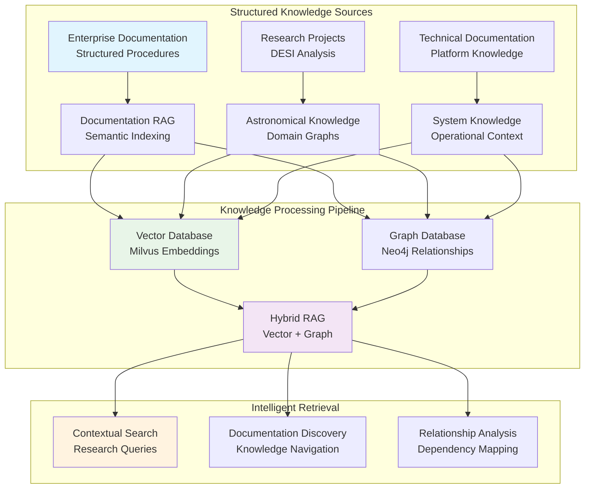

# 🧠 **RAG/RAGGraph**

This category provides comprehensive documentation for Retrieval-Augmented Generation (RAG) and graph-based knowledge systems across the Proxmox Astronomy Lab's enterprise research computing platform. The documentation covers systematic approaches to knowledge graph construction, vector similarity search, semantic retrieval, and intelligent documentation integration supporting the platform's structured knowledge management architecture. These implementations demonstrate enterprise-grade RAG deployment patterns optimized for research computing environments, with deep integration into documentation procedures and systematic knowledge organization.

## **Overview**

RAG/RAGGraph represents the sophisticated orchestration of knowledge retrieval, semantic search, and intelligent information architecture across the research computing infrastructure. The Proxmox Astronomy Lab implements enterprise-grade RAG systems centered on Milvus vector database acceleration, Neo4j graph relationships, PostgreSQL structured knowledge storage, and systematic integration with documentation procedures following the platform's comprehensive knowledge management framework. This implementation provides intelligent semantic search, automated knowledge extraction, systematic documentation RAG integration, and graph-based relationship modeling supporting scientific research and knowledge discovery applications.

The RAG ecosystem operates as the intelligent foundation for the platform's knowledge architecture, seamlessly integrating structured documentation procedures with vector similarity search, graph-based knowledge relationships, and automated content discovery. These systems enable intelligent documentation retrieval, research paper semantic search, astronomical knowledge graph construction, and systematic integration with the platform's enterprise documentation standards ensuring comprehensive knowledge accessibility and discovery across all research domains.

---

## **📁 Repository Structure**

```markdown
ai-and-machine-learning/rag-raggraph/
├── README.md                                    # This category overview document
├── knowledge-architecture/
│   ├── README.md                               # Enterprise knowledge architecture design
│   ├── documentation-integration/             # Integration with documentation procedures
│   ├── structured-knowledge/                  # Systematic knowledge organization
│   └── semantic-relationships/                # Knowledge graph relationship modeling
├── vector-databases/
│   ├── README.md                               # Vector database systems and optimization
│   ├── milvus-deployment/                     # Milvus vector database configuration
│   ├── embedding-generation/                  # Vector embedding creation and management
│   └── similarity-search/                     # Advanced vector similarity operations
├── graph-databases/
│   ├── README.md                               # Graph database systems and modeling
│   ├── neo4j-deployment/                      # Neo4j graph database implementation
│   ├── relationship-modeling/                 # Knowledge graph relationship design
│   └── dependency-analysis/                   # Systematic dependency and impact analysis
├── retrieval-systems/
│   ├── README.md                               # RAG retrieval system implementation
│   ├── hybrid-search/                         # Combined vector and structured search
│   ├── contextual-retrieval/                  # Context-aware knowledge retrieval
│   └── intelligent-ranking/                   # Advanced result ranking and relevance
├── documentation-rag/
│   ├── README.md                               # RAG integration with documentation systems
│   ├── structured-import/                     # Systematic documentation ingestion
│   ├── semantic-indexing/                     # Documentation semantic indexing
│   └── knowledge-discovery/                   # Intelligent documentation discovery
└── astronomical-knowledge/
    ├── README.md                               # Domain-specific astronomical knowledge graphs
    ├── desi-knowledge-graph/                  # DESI survey knowledge organization
    ├── spectral-relationships/                # Astronomical spectral knowledge modeling
    └── research-integration/                  # Integration with active research projects
```

---

## **📂 Directory Overview**

This section provides comprehensive navigation to all RAG/RAGGraph implementations and knowledge management procedures.

### **🏗️ Core Knowledge Infrastructure**

| **Component** | **Purpose** | **Implementation** |
|---------------|-------------|-------------------|
| **[knowledge-architecture/](knowledge-architecture/)** | Enterprise knowledge architecture and systematic organization | Documentation integration, structured knowledge, semantic relationships |
| **[vector-databases/](vector-databases/)** | Vector database systems for semantic similarity search | Milvus deployment, embedding generation, similarity operations |
| **[graph-databases/](graph-databases/)** | Graph database systems for relationship modeling | Neo4j implementation, relationship design, dependency analysis |

### **🔍 Retrieval and Discovery Systems**

| **Component** | **Purpose** | **Implementation** |
|---------------|-------------|-------------------|
| **[retrieval-systems/](retrieval-systems/)** | Advanced RAG retrieval system implementation | Hybrid search, contextual retrieval, intelligent ranking |
| **[documentation-rag/](documentation-rag/)** | RAG integration with enterprise documentation procedures | Structured import, semantic indexing, knowledge discovery |

### **🌌 Domain-Specific Knowledge**

| **Component** | **Purpose** | **Implementation** |
|---------------|-------------|-------------------|
| **[astronomical-knowledge/](astronomical-knowledge/)** | Astronomical domain knowledge graph construction | DESI knowledge graphs, spectral relationships, research integration |

---

## **🏗️ Architecture & Design**

This section details the systematic architecture supporting enterprise-grade RAG and knowledge graph systems across the research computing infrastructure.

### **Integrated Knowledge Architecture**

The RAG/RAGGraph architecture implements comprehensive knowledge management with systematic integration across documentation procedures, vector similarity search, and graph-based relationship modeling supporting intelligent knowledge discovery and research applications.



### **Documentation-Integrated RAG Strategy**

The enterprise RAG implementation provides systematic integration with the platform's comprehensive documentation procedures, enabling intelligent knowledge discovery across structured documentation, technical specifications, and research project knowledge.

| **Documentation Domain** | **RAG Integration** | **Knowledge Application** |
|--------------------------|-------------------|-------------------------|
| **Structured Documentation** | Systematic semantic indexing of enterprise documentation procedures | Intelligent documentation discovery and cross-reference navigation |
| **Technical Architecture** | Vector embedding of system architecture and operational procedures | Context-aware infrastructure knowledge retrieval and dependency analysis |
| **Research Projects** | Domain-specific knowledge graph construction for astronomical research | Semantic search across DESI analysis procedures and research methodologies |
| **Compliance Framework** | Graph-based modeling of compliance relationships and policy dependencies | Intelligent compliance navigation and regulatory knowledge discovery |

### **Vector and Graph Database Integration**

The knowledge architecture implements sophisticated integration between vector similarity search and graph-based relationship modeling, enabling comprehensive knowledge discovery and intelligent information retrieval.

| **Database System** | **Knowledge Representation** | **Retrieval Capability** | **Research Application** |
|-------------------|------------------------------|-------------------------|------------------------|
| **Milvus Vector Database** | High-dimensional embeddings of documentation and research content | Semantic similarity search across knowledge domains | Discovery of related research papers and documentation |
| **Neo4j Graph Database** | Explicit relationships between entities, dependencies, and concepts | Graph traversal and dependency analysis queries | Impact analysis and knowledge relationship exploration |
| **PostgreSQL Structured** | Canonical knowledge schema with metadata and versioning | Structured queries and systematic knowledge organization | Authoritative knowledge storage and version control |
| **Hybrid Integration** | Combined vector and graph representations | Multi-modal knowledge retrieval and contextual search | Comprehensive knowledge discovery across all domains |

### **Enterprise Knowledge Graph Design**

The platform implements comprehensive knowledge graph modeling supporting research computing, documentation procedures, and astronomical domain knowledge with systematic relationship modeling and dependency analysis.

| **Knowledge Domain** | **Graph Entities** | **Relationship Types** | **Discovery Applications** |
|---------------------|-------------------|----------------------|--------------------------|
| **Documentation Architecture** | Documents, Procedures, Standards, Policies | DEPENDS_ON, IMPLEMENTS, REFERENCES, SUPERSEDES | Documentation navigation and compliance tracking |
| **Infrastructure Knowledge** | Systems, Components, Services, Dependencies | HOSTS, PROVIDES, REQUIRES, MONITORS | Infrastructure understanding and operational knowledge |
| **Research Projects** | Projects, Datasets, Methods, Publications | ANALYZES, PRODUCES, BUILDS_ON, VALIDATES | Research methodology discovery and academic relationship mapping |
| **Astronomical Domain** | Surveys, Objects, Spectra, Catalogs | OBSERVES, CONTAINS, CORRELATES, CLASSIFIES | Scientific knowledge discovery and astronomical relationship exploration |

---

## **⚙️ Management and Operations**

This section provides systematic approaches to managing RAG and knowledge graph operations across enterprise research computing infrastructure.

### **Knowledge Pipeline Management**

Enterprise RAG operations require systematic knowledge ingestion, processing, and retrieval management ensuring reliable operation for research computing applications and intelligent knowledge discovery.

| **Pipeline Stage** | **Management Approach** | **RAG-Specific Considerations** |
|-------------------|------------------------|--------------------------------|
| **Knowledge Ingestion** | Automated documentation import with structured metadata extraction | Integration with enterprise documentation procedures and version control |
| **Processing and Indexing** | Vector embedding generation and graph relationship extraction | Systematic semantic indexing and knowledge graph construction |
| **Storage and Organization** | Multi-database knowledge architecture with synchronized updates | Consistent knowledge representation across vector, graph, and structured databases |
| **Retrieval and Discovery** | Intelligent search with contextual ranking and relationship analysis | Advanced RAG capabilities supporting research and documentation use cases |

### **Documentation Integration Management**

Production RAG systems implement comprehensive integration with enterprise documentation procedures ensuring systematic knowledge organization and intelligent discovery across all platform documentation domains.

| **Documentation Domain** | **Integration Strategy** | **RAG Enhancement** | **Knowledge Benefit** |
|--------------------------|------------------------|-------------------|---------------------|
| **Structured Procedures** | Systematic import of documentation standards and procedures | Semantic indexing and cross-reference discovery | Intelligent navigation of enterprise documentation |
| **Technical Architecture** | Integration with infrastructure documentation and operational guides | Vector similarity search across technical knowledge | Context-aware infrastructure knowledge retrieval |
| **Research Documentation** | Import of research project documentation and methodologies | Domain-specific knowledge graph construction | Intelligent research methodology discovery |
| **Compliance Framework** | Integration with security and compliance documentation | Graph-based policy dependency modeling | Automated compliance knowledge navigation |

### **Knowledge Quality and Governance**

Enterprise knowledge systems implement comprehensive quality assurance and governance ensuring knowledge accuracy, consistency, and appropriate access controls for research computing environments.

| **Quality Dimension** | **Governance Approach** | **RAG Implementation** |
|----------------------|------------------------|----------------------|
| **Knowledge Accuracy** | Systematic validation of knowledge extraction and representation | Automated quality assessment and human oversight procedures |
| **Semantic Consistency** | Standardized embedding models and relationship schemas | Consistent knowledge representation across all domains |
| **Access Control** | Role-based access to knowledge retrieval and discovery systems | Secure knowledge access appropriate for research computing environments |
| **Knowledge Currency** | Automated updates and version synchronization across knowledge systems | Real-time knowledge graph updates and version-aware retrieval |

---

## **🔒 Security & Compliance**

This section documents comprehensive security controls and compliance alignment for RAG and knowledge graph systems within research computing environments.

⚠️ RAG/KNOWLEDGE GRAPH SECURITY DISCLAIMER

*The RAG and knowledge graph implementations provide intelligent knowledge retrieval for research computing requiring careful access control, data governance, and information security management. Knowledge systems may process sensitive research data, proprietary documentation, and confidential intellectual property. All RAG implementations follow enterprise security frameworks with specific attention to knowledge access controls, data protection during processing, and appropriate governance aligned with research computing security requirements and information management policies.*

### **Knowledge Security Controls**

Enterprise-grade security implementation guided by research computing standards and information management policies for RAG and knowledge graph systems. Security controls protect research intellectual property, sensitive documentation, and knowledge assets while enabling intelligent discovery and collaboration.

| **Security Control Category** | **Implementation** | **Research Protection** |
|------------------------------|-------------------|------------------------|
| **Knowledge Access Control** | Role-based access to knowledge retrieval with granular permissions | Protection of sensitive research data and proprietary documentation |
| **Data Protection During Processing** | Encrypted knowledge storage and secure embedding generation | Protection of research content during vector and graph processing |
| **Information Governance** | Systematic knowledge classification and retention policies | Appropriate governance for research data and documentation assets |
| **Intellectual Property Protection** | Secure knowledge graph construction with attribution tracking | Protection of research intellectual property and academic attribution |

### **Research Computing Compliance**

RAG and knowledge graph implementations align with research computing standards ensuring proper knowledge governance, data protection, and appropriate usage policies for scientific computing environments and academic collaboration.

| **Compliance Domain** | **Framework Alignment** | **Implementation Evidence** |
|----------------------|------------------------|---------------------------|
| **Knowledge Governance** | Systematic knowledge organization and access management policies | Comprehensive knowledge classification and retrieval governance |
| **Data Sovereignty** | Local knowledge processing and storage for sensitive research data | On-premises RAG implementation maintaining data residency |
| **Academic Integrity** | Proper attribution and citation tracking in knowledge systems | Systematic attribution preservation and academic relationship modeling |
| **Collaborative Access** | Secure multi-user knowledge sharing with appropriate controls | Controlled knowledge access supporting collaborative research while maintaining security |

---

## **🔗 Related Categories**

This section establishes systematic connections to other knowledge domains within the Proxmox Astronomy Lab ecosystem, demonstrating comprehensive integration across enterprise research computing infrastructure.

### **AI and Machine Learning Integration**

| **Category** | **Relationship** | **RAG/Knowledge Graph Integration** |
|--------------|------------------|-------------------------------------|
| **[../model-deployment/](../model-deployment/)** | Knowledge-enhanced model serving | RAG-augmented model inference and context-aware AI applications |
| **[../distributed-frameworks/](../distributed-frameworks/)** | Distributed knowledge processing | Ray integration for large-scale knowledge graph construction |
| **[../gpu-computing/](../gpu-computing/)** | GPU-accelerated knowledge operations | RTX A4000 optimization for vector embedding generation and similarity search |
| **[../training-pipelines/](../training-pipelines/)** | Knowledge-enhanced model training | RAG integration for training data augmentation and context injection |

### **Infrastructure and Platform Integration**

| **Category** | **Relationship** | **RAG/Knowledge Graph Integration** |
|--------------|------------------|-------------------------------------|
| **[../../infrastructure/databases/](../../infrastructure/databases/)** | Knowledge storage infrastructure | PostgreSQL, Milvus, and Neo4j deployment and optimization |
| **[../../infrastructure/k8s/](../../infrastructure/k8s/)** | Kubernetes knowledge orchestration | RKE2 deployment and container orchestration for knowledge systems |
| **[../../docs/](../../docs/)** | Documentation architecture integration | Systematic RAG integration with enterprise documentation procedures |

### **Research and Documentation Integration**

| **Category** | **Relationship** | **RAG/Knowledge Graph Integration** |
|--------------|------------------|-------------------------------------|
| **[../../projects/](../../projects/)** | Research project knowledge integration | Domain-specific knowledge graphs for DESI research and astronomical analysis |
| **[../../reproducibility/](../../reproducibility/)** | Knowledge-enhanced reproducibility | RAG-powered methodology discovery and research workflow intelligence |
| **[../../publishing/](../../publishing/)** | Publication knowledge integration | Academic knowledge graph construction and research relationship modeling |

---

## **🚀 Getting Started**

This section provides systematic guidance for implementing RAG and knowledge graph capabilities across different operational roles and research computing applications.

### **For Knowledge Engineers**

**Knowledge Architecture:** [knowledge-architecture/](knowledge-architecture/)  
**Vector Database Setup:** [vector-databases/](vector-databases/)  
**Graph Database Implementation:** [graph-databases/](graph-databases/)  
**Documentation Integration:** [documentation-rag/](documentation-rag/)

### **For Research Computing Teams**

**Astronomical Knowledge:** [astronomical-knowledge/](astronomical-knowledge/)  
**Retrieval Systems:** [retrieval-systems/](retrieval-systems/)  
**Documentation RAG:** [documentation-rag/](documentation-rag/)  
**Knowledge Discovery:** [retrieval-systems/](retrieval-systems/)

### **For Platform Administrators**

**Infrastructure Management:** [vector-databases/](vector-databases/) and [graph-databases/](graph-databases/)  
**Documentation Integration:** [documentation-rag/](documentation-rag/)  
**Knowledge Architecture:** [knowledge-architecture/](knowledge-architecture/)  
**Security and Governance:** [knowledge-architecture/](knowledge-architecture/)

### **For Research Scientists**

**Domain Knowledge Access:** [astronomical-knowledge/](astronomical-knowledge/)  
**Intelligent Search:** [retrieval-systems/](retrieval-systems/)  
**Research Integration:** [astronomical-knowledge/](astronomical-knowledge/)  
**Documentation Discovery:** [documentation-rag/](documentation-rag/)

---

## **Document Information**

| **Field** | **Value** |
|-----------|-----------|
| **Author** | VintageDon - <https://github.com/vintagedon> |
| **Created** | 2025-07-20 |
| **Last Updated** | 2025-07-20 |
| **Version** | 1.0 |

---
Tags: rag-systems, knowledge-graphs, milvus-vector, neo4j-graph, documentation-integration, semantic-search, enterprise-knowledge, research-rag
