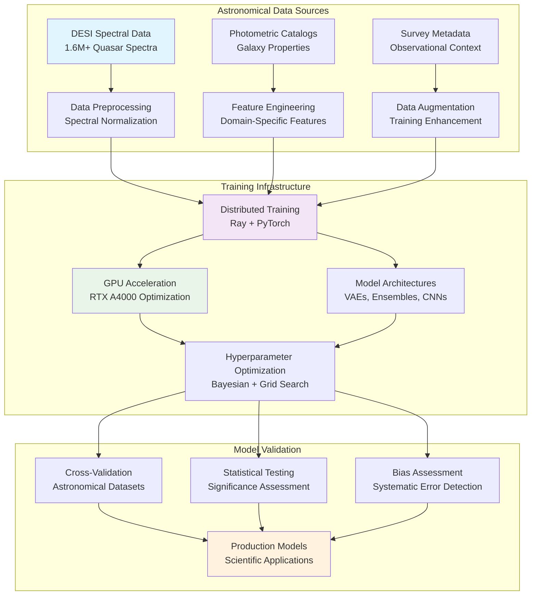

# 🏭 **Training Pipelines**

This category provides comprehensive documentation for machine learning model training pipelines across the Proxmox Astronomy Lab's enterprise research computing platform. The documentation covers systematic approaches to astronomical model training, distributed learning workflows, and specialized ML techniques optimized for astronomical research applications. These implementations demonstrate enterprise-grade training pipeline patterns supporting variational autoencoders, ensemble methods, clustering algorithms, and domain-specific astronomical machine learning techniques used in production DESI analysis and research computing environments.

## **Overview**

Training Pipelines represent the sophisticated orchestration of machine learning model development, distributed training workflows, and systematic model optimization across the research computing infrastructure. The Proxmox Astronomy Lab implements enterprise-grade training systems centered on PyTorch distributed training, Ray cluster coordination, astronomical domain-specific model architectures, and specialized training techniques for spectroscopic analysis, anomaly detection, and galaxy classification applications. This implementation provides comprehensive training orchestration, hyperparameter optimization, distributed computing coordination, and systematic model validation procedures supporting scientific research and astronomical discovery applications.

The training pipeline ecosystem operates seamlessly across the hybrid Kubernetes and VM architecture, providing integration with GPU acceleration, distributed computing frameworks, and astronomical data processing systems. These systems enable large-scale VAE training on DESI spectral datasets, ensemble method coordination for astronomical classification, clustering algorithm optimization for galaxy morphology analysis, and systematic training procedures ensuring reproducibility, scalability, and scientific rigor across all astronomical machine learning applications.

---

## **📁 Repository Structure**

```markdown
ai-and-machine-learning/training-pipelines/
├── README.md                                    # This category overview document
├── astronomical-models/
│   ├── README.md                               # Astronomical domain-specific model architectures
│   ├── variational-autoencoders/              # VAE training for spectral analysis and anomaly detection
│   ├── ensemble-methods/                      # Random forests and gradient boosting for astronomical classification
│   ├── clustering-algorithms/                 # Unsupervised learning for galaxy morphology and classification
│   └── deep-learning-architectures/           # CNNs and RNNs for astronomical image and spectral analysis
├── distributed-training/
│   ├── README.md                               # Distributed training coordination and optimization
│   ├── ray-training/                          # Ray distributed training for large-scale astronomical datasets
│   ├── pytorch-distributed/                   # PyTorch distributed training coordination
│   ├── multi-gpu-coordination/                # Multi-GPU training optimization and resource management
│   └── kubernetes-training/                   # Kubernetes-based training job orchestration
├── data-preprocessing/
│   ├── README.md                               # Astronomical data preprocessing and feature engineering
│   ├── spectral-preprocessing/                # DESI spectral data processing and normalization
│   ├── photometric-preprocessing/             # Photometric data preparation and augmentation
│   ├── feature-engineering/                   # Domain-specific feature extraction and selection
│   └── data-augmentation/                     # Training data augmentation techniques for astronomy
├── hyperparameter-optimization/
│   ├── README.md                               # Systematic hyperparameter tuning and optimization
│   ├── bayesian-optimization/                 # Bayesian optimization for astronomical model tuning
│   ├── grid-search/                           # Systematic grid search for parameter exploration
│   ├── evolutionary-algorithms/               # Genetic algorithms for complex parameter optimization
│   └── automated-ml/                          # AutoML techniques for astronomical model selection
├── model-validation/
│   ├── README.md                               # Comprehensive model validation and testing procedures
│   ├── cross-validation/                      # Astronomical dataset cross-validation strategies
│   ├── statistical-testing/                   # Statistical significance testing for astronomical models
│   ├── bias-assessment/                       # Systematic bias detection and mitigation
│   └── performance-metrics/                   # Domain-specific performance evaluation metrics
└── production-training/
    ├── README.md                               # Production training workflows and deployment
    ├── pipeline-orchestration/                # Training pipeline automation and scheduling
    ├── experiment-tracking/                   # Systematic experiment management and versioning
    ├── resource-optimization/                 # Training resource allocation and optimization
    └── continuous-training/                   # Automated retraining and model updating procedures
```

---

## **📂 Directory Overview**

This section provides comprehensive navigation to all training pipeline implementations and model development procedures.

### **🔬 Astronomical Model Architectures**

| **Component** | **Purpose** | **Implementation** |
|---------------|-------------|-------------------|
| **[astronomical-models/](astronomical-models/)** | Domain-specific astronomical model architectures | VAEs, ensemble methods, clustering, deep learning for astronomy |
| **[data-preprocessing/](data-preprocessing/)** | Astronomical data preprocessing and feature engineering | Spectral processing, photometric preparation, domain-specific features |

### **⚡ Distributed Training Infrastructure**

| **Component** | **Purpose** | **Implementation** |
|---------------|-------------|-------------------|
| **[distributed-training/](distributed-training/)** | Distributed training coordination and optimization | Ray training, PyTorch distributed, multi-GPU coordination |
| **[production-training/](production-training/)** | Production training workflows and deployment | Pipeline orchestration, experiment tracking, resource optimization |

### **🎛️ Optimization and Validation**

| **Component** | **Purpose** | **Implementation** |
|---------------|-------------|-------------------|
| **[hyperparameter-optimization/](hyperparameter-optimization/)** | Systematic hyperparameter tuning and optimization | Bayesian optimization, grid search, evolutionary algorithms |
| **[model-validation/](model-validation/)** | Comprehensive model validation and testing | Cross-validation, statistical testing, bias assessment |

---

## **🏗️ Architecture & Design**

This section details the systematic architecture supporting enterprise-grade training pipelines across the research computing infrastructure.

### **Astronomical Model Training Architecture**

The training pipeline architecture implements comprehensive model development with systematic integration across distributed computing, GPU acceleration, and astronomical domain expertise supporting large-scale model training and validation for scientific research applications.



### **Astronomical Machine Learning Model Types**

The training pipeline platform implements comprehensive support for astronomical domain-specific model architectures optimized for spectroscopic analysis, galaxy classification, and astronomical discovery applications.

| **Model Category** | **Astronomical Application** | **Training Approach** | **Research Implementation** |
|-------------------|------------------------------|----------------------|---------------------------|
| **Variational Autoencoders (VAEs)** | DESI spectral anomaly detection and dimensionality reduction | Distributed training on 1.6M+ quasar spectra | Anomalous quasar detection for rare object discovery |
| **Ensemble Methods (Random Forests)** | Galaxy classification and photometric redshift estimation | Parallel ensemble training with feature importance analysis | Multi-wavelength galaxy property prediction |
| **Clustering Algorithms** | Galaxy morphology classification and void galaxy analysis | Unsupervised learning with cosmic environment features | Cosmic void galaxy evolution studies |
| **Convolutional Neural Networks** | Astronomical image analysis and object detection | Multi-GPU training with data augmentation | Galaxy morphology classification and strong lens detection |
| **Recurrent Neural Networks** | Time-series analysis for variable objects and light curves | Sequence modeling with astronomical time-domain data | Variable star classification and transient detection |

### **Distributed Training Strategy**

The enterprise training infrastructure provides systematic distributed computing coordination enabling scalable model training across multiple nodes, GPUs, and astronomical datasets with optimal resource utilization and performance optimization.

| **Training Scale** | **Infrastructure Approach** | **Resource Allocation** | **Astronomical Benefit** |
|-------------------|----------------------------|----------------------|------------------------|
| **Single-GPU Training** | RTX A4000 optimization for medium-scale models | Local GPU training with optimized memory management | Rapid prototyping and model validation |
| **Multi-GPU Coordination** | Data parallelism across available GPU resources | Distributed data loading and gradient synchronization | Large-scale spectral analysis and image processing |
| **Cluster-Wide Training** | Ray distributed training across 7-node cluster | Automatic resource scheduling and load balancing | Massive dataset training and hyperparameter optimization |
| **Kubernetes Orchestration** | RKE2-based training job management | Container-based resource isolation and scaling | Production training workflows and experiment management |

### **Astronomical Training Specializations**

Enterprise training pipelines implement domain-specific optimizations ensuring optimal performance for astronomical data characteristics, observational constraints, and scientific analysis requirements.

| **Specialization** | **Domain Consideration** | **Training Optimization** |
|-------------------|------------------------|--------------------------|
| **Spectroscopic Analysis** | High-dimensional spectral data with noise characteristics | Specialized preprocessing and robust loss functions |
| **Photometric Processing** | Multi-band imaging with varying depth and resolution | Data augmentation and transfer learning techniques |
| **Time-Domain Analysis** | Irregular sampling and observational gaps | Sequence modeling with missing data handling |
| **Large-Scale Surveys** | Massive datasets with selection biases | Distributed training with systematic bias mitigation |

---

## **⚙️ Management and Operations**

This section provides systematic approaches to managing training pipeline operations across enterprise research computing infrastructure.

### **Training Pipeline Lifecycle**

Enterprise training operations require systematic workflow management, resource coordination, and performance optimization ensuring reliable model development for research computing applications and scientific discovery.

| **Lifecycle Phase** | **Management Approach** | **Training-Specific Considerations** |
|-------------------|------------------------|-----------------------------------|
| **Data Preparation** | Automated preprocessing with quality validation | Astronomical data calibration and systematic error handling |
| **Model Development** | Version-controlled training with systematic experimentation | Reproducible training procedures and parameter tracking |
| **Training Execution** | Distributed resource coordination with monitoring | Optimal resource utilization and training progress tracking |
| **Model Validation** | Comprehensive testing with statistical significance assessment | Domain-specific validation metrics and bias detection |

### **Resource Optimization Strategy**

Production training systems implement comprehensive resource management ensuring optimal utilization of computing infrastructure while maintaining training efficiency and scientific productivity.

| **Resource Type** | **Optimization Strategy** | **Training Benefit** | **Research Computing Integration** |
|------------------|-------------------------|---------------------|-----------------------------------|
| **GPU Utilization** | Dynamic GPU allocation with multi-process coordination | Optimal training throughput and memory usage | Efficient utilization of RTX A4000 resources |
| **CPU Coordination** | Distributed data loading and preprocessing optimization | Reduced training bottlenecks and improved pipeline efficiency | Systematic utilization of 7-node cluster compute resources |
| **Memory Management** | Intelligent batch sizing and data streaming | Large-scale dataset training without memory constraints | Optimal memory usage across hybrid architecture |
| **Storage Optimization** | High-performance data access and caching strategies | Fast data loading and reduced I/O bottlenecks | Integration with high-performance NVMe storage infrastructure |

### **Experiment Management and Tracking**

Enterprise training environments implement systematic experiment tracking ensuring reproducible model development, comprehensive performance analysis, and systematic optimization across all astronomical training applications.

| **Tracking Component** | **Implementation Strategy** | **Scientific Benefit** |
|------------------------|----------------------------|----------------------|
| **Hyperparameter Logging** | Systematic parameter tracking with optimization history | Reproducible model development and optimization analysis |
| **Performance Metrics** | Comprehensive metric collection with statistical analysis | Objective model comparison and performance validation |
| **Resource Utilization** | Real-time monitoring and usage analysis | Training efficiency optimization and cost analysis |
| **Model Versioning** | Systematic model artifact management with provenance tracking | Reproducible research and model deployment management |

---

## **🔒 Security & Compliance**

This section documents comprehensive security controls and compliance alignment for training pipelines within research computing environments.

⚠️ TRAINING PIPELINE SECURITY DISCLAIMER

*The training pipeline implementations provide high-performance model development for research computing requiring careful data governance, intellectual property protection, and resource access control. Training systems may process sensitive research data, proprietary algorithms, and confidential scientific information. All training implementations follow enterprise security frameworks with specific attention to data protection during training, model intellectual property security, and appropriate governance aligned with research computing security requirements and scientific collaboration policies.*

### **Training Security Controls**

Enterprise-grade security implementation guided by research computing standards for training pipeline systems. Security controls protect research data during training, model intellectual property, and computational resources while enabling collaborative scientific computing and model development.

| **Security Control Category** | **Implementation** | **Research Protection** |
|------------------------------|-------------------|------------------------|
| **Data Protection During Training** | Encrypted data access and secure training environments | Protection of sensitive astronomical data during model development |
| **Model Intellectual Property Protection** | Secure model storage and access controls | Protection of research algorithms and proprietary model architectures |
| **Resource Access Control** | Role-based access to training infrastructure and computational resources | Controlled access to training resources appropriate for research collaboration |
| **Training Provenance Tracking** | Comprehensive logging of training procedures and data usage | Transparent tracking of model development and data utilization |

### **Research Computing Compliance**

Training pipeline implementations align with research computing standards ensuring proper data governance, model development transparency, and appropriate usage policies for scientific computing environments and collaborative research.

| **Compliance Domain** | **Framework Alignment** | **Implementation Evidence** |
|----------------------|------------------------|---------------------------|
| **Data Governance** | Systematic data handling and training data management policies | Comprehensive data classification and training data governance |
| **Model Transparency** | Open model development and validation procedures | Transparent training methodologies and reproducible model development |
| **Resource Accountability** | Training resource usage tracking and allocation management | Systematic monitoring of computational resource utilization |
| **Collaborative Access** | Secure multi-user training access with appropriate controls | Controlled training access supporting collaborative research while maintaining security |

---

## **🔗 Related Categories**

This section establishes systematic connections to other knowledge domains within the Proxmox Astronomy Lab ecosystem, demonstrating comprehensive integration across enterprise research computing infrastructure.

### **AI and Machine Learning Integration**

| **Category** | **Relationship** | **Training Pipeline Integration** |
|--------------|------------------|-----------------------------------|
| **[../model-deployment/](../model-deployment/)** | Training to deployment pipeline integration | Seamless transition from training to production model serving |
| **[../distributed-frameworks/](../distributed-frameworks/)** | Distributed training coordination | Ray integration for large-scale training and resource coordination |
| **[../gpu-computing/](../gpu-computing/)** | GPU-accelerated training optimization | RTX A4000 optimization for training workflows and performance |
| **[../astronomical-ml/](../astronomical-ml/)** | Domain-specific model implementation | Specialized astronomical model architectures and training techniques |

### **Infrastructure and Platform Integration**

| **Category** | **Relationship** | **Training Pipeline Integration** |
|--------------|------------------|-----------------------------------|
| **[../../infrastructure/k8s/](../../infrastructure/k8s/)** | Kubernetes training job orchestration | RKE2 deployment and container orchestration for training workflows |
| **[../../infrastructure/databases/](../../infrastructure/databases/)** | Training data storage and management | PostgreSQL integration for training metadata and experiment tracking |
| **[../../infrastructure/monitoring/](../../infrastructure/monitoring/)** | Training performance monitoring | Comprehensive observability for training job monitoring and optimization |

### **Research and Application Integration**

| **Category** | **Relationship** | **Training Pipeline Integration** |
|--------------|------------------|-----------------------------------|
| **[../../projects/](../../projects/)** | Research project model training | DESI analysis model training and astronomical research applications |
| **[../../reproducibility/](../../reproducibility/)** | Reproducible training workflows | Version-controlled training procedures and systematic reproducibility |
| **[../../publishing/](../../publishing/)** | Scientific publication model validation | Training methodology documentation and research publication support |

---

## **🚀 Getting Started**

This section provides systematic guidance for implementing training pipeline capabilities across different operational roles and research computing applications.

### **For ML Engineers**

**Astronomical Models:** [astronomical-models/](astronomical-models/)  
**Distributed Training:** [distributed-training/](distributed-training/)  
**Hyperparameter Optimization:** [hyperparameter-optimization/](hyperparameter-optimization/)  
**Production Workflows:** [production-training/](production-training/)

### **For Research Computing Teams**

**Data Preprocessing:** [data-preprocessing/](data-preprocessing/)  
**Model Validation:** [model-validation/](model-validation/)  
**Resource Optimization:** [production-training/](production-training/)  
**Astronomical Applications:** [astronomical-models/](astronomical-models/)

### **For Platform Administrators**

**Infrastructure Management:** [distributed-training/](distributed-training/)  
**Resource Coordination:** [production-training/](production-training/)  
**Pipeline Orchestration:** [production-training/](production-training/)  
**Monitoring Integration:** [production-training/](production-training/)

### **For Research Scientists**

**Model Development:** [astronomical-models/](astronomical-models/)  
**Training Methodologies:** [hyperparameter-optimization/](hyperparameter-optimization/)  
**Validation Procedures:** [model-validation/](model-validation/)  
**Research Applications:** [astronomical-models/](astronomical-models/)

---

## **Document Information**

| **Field** | **Value** |
|-----------|-----------|
| **Author** | VintageDon - <https://github.com/vintagedon> |
| **Created** | 2025-07-20 |
| **Last Updated** | 2025-07-20 |
| **Version** | 1.0 |

---
Tags: training-pipelines, astronomical-ml, vae-training, ensemble-methods, distributed-training, pytorch-distributed, ray-training, enterprise-ml
