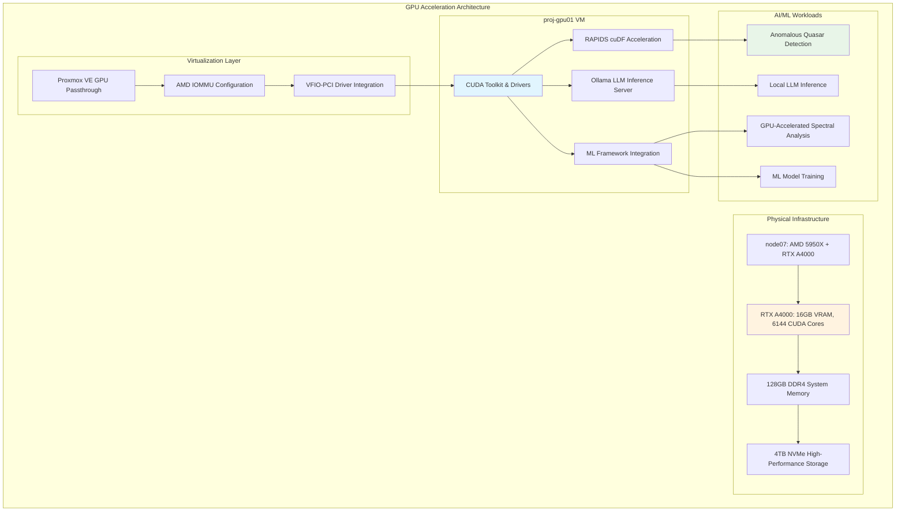

<!--
---
title: "AI/ML Infrastructure"
description: "Comprehensive AI and machine learning infrastructure documentation for the Proxmox Astronomy Lab platform, including GPU acceleration, distributed computing, and production ML workflows for astronomical research"
author: "[Human Author Name]"
ai_contributor: "Anthropic Claude 4 Sonnet (claude-4-sonnet-20250514)"
date: "2025-07-04"
version: "1.0"
status: "Published"
tags:
- type: kb-article
- domain: ai-ml-infrastructure
- domain: gpu-acceleration
- tech: nvidia-rtx-a4000
- tech: ray-distributed-computing
- tech: rapids-cudf
- tech: ollama-inference
- compliance: cis-benchmark
- phase: phase-5
related_documents:
- "[Hardware Inventory](../hardware/README.md)"
- "[Infrastructure Architecture](../infrastructure/README.md)"
- "[Research Projects](../projects/README.md)"
- "[GPU Node Configuration](gpu-node/README.md)"
- "[DESI Anomalous Quasar Detection](../projects/desi-qad-anomalous-quasars/README.md)"
---
-->

# 🤖 **AI/ML Infrastructure**

This directory contains comprehensive AI and machine learning infrastructure documentation for the Proxmox Astronomy Lab platform, showcasing enterprise-grade GPU acceleration, distributed computing frameworks, and production ML workflows that enable cutting-edge astronomical research including DESI anomaly detection, large-scale spectral analysis, and AI-enhanced scientific discovery.

# 🎯 **1. Introduction**

This section establishes the foundational context for AI/ML infrastructure within the Proxmox Astronomy Lab enterprise platform, defining how advanced AI capabilities enable systematic astronomical research and scientific discovery.

## **1.1 Purpose**

This subsection explains how AI/ML infrastructure enables advanced astronomical research through GPU acceleration, distributed computing, and systematic machine learning workflows optimized for scientific discovery.

The AI/ML Infrastructure provides the comprehensive foundation for advanced astronomical computing within the Proxmox Astronomy Lab platform, enabling systematic machine learning workflows through enterprise-grade GPU acceleration, distributed Ray computing, and sophisticated AI frameworks that support research scientists, data engineers, and ML specialists in conducting production-scale DESI analysis, anomalous quasar detection, and large-scale spectral analysis while maintaining scientific rigor and reproducible methodologies essential for peer-reviewed research and collaborative scientific discovery.

## **1.2 Scope**

This subsection defines the precise boundaries of AI/ML infrastructure coverage, establishing what AI capabilities and machine learning components are included within the enterprise AI framework.

| **In Scope** | **Out of Scope** |
|--------------|------------------|
| GPU acceleration infrastructure and optimization | Individual research algorithm development |
| Distributed computing frameworks and orchestration | Domain-specific astronomical analysis methods |
| ML inference platforms and model serving | Custom neural network architecture design |
| Production AI workflows and pipeline automation | Research data preprocessing and feature engineering |
| Enterprise AI frameworks and integration | Scientific computing visualization and reporting |
| Performance optimization and resource management | External AI service integration and API development |

The scope focuses specifically on AI/ML infrastructure capabilities and platform services rather than scientific research methodologies or domain-specific algorithm development.

## **1.3 Target Audience**

This subsection identifies stakeholders who interact with AI/ML infrastructure and their expected technical background for effective platform utilization.

**Primary Audience:** Data scientists, ML engineers, and research computing specialists developing AI-enhanced astronomical analysis
**Secondary Audience:** Research scientists, infrastructure engineers, and DevOps specialists supporting AI workloads
**Required Background:** Understanding of machine learning frameworks, GPU computing, distributed systems, and scientific computing workflows

## **1.4 Overview**

This subsection provides high-level context about AI/ML infrastructure's role in enabling enterprise-grade machine learning for astronomical research and scientific discovery.

The AI/ML infrastructure implements sophisticated GPU acceleration and distributed computing capabilities that enable production-scale machine learning workflows for astronomical research. This infrastructure supports both CPU-intensive distributed computing through Ray clusters and GPU-accelerated inference through NVIDIA RTX A4000 optimization, providing comprehensive AI capabilities that enable DESI anomaly detection, large-scale spectral analysis, and advanced scientific computing while maintaining enterprise-grade performance and reliability.

# 🔗 **2. Dependencies & Relationships**

This section maps how AI/ML infrastructure integrates with platform services, research workflows, and operational systems to enable comprehensive machine learning capabilities for astronomical research.

## **2.1 Related Services**

This subsection identifies platform services that depend on, utilize, or integrate with AI/ML infrastructure to provide comprehensive research computing and scientific analysis capabilities.

AI/ML infrastructure provides advanced computing capabilities that enable sophisticated research analysis and scientific discovery across platform services:

| **Service** | **Relationship Type** | **Integration Points** | **Documentation** |
|-------------|----------------------|------------------------|-------------------|
| **Research Projects** | **Accelerates** | DESI anomaly detection, spectral analysis, ML workflows | [Research Portfolio](../projects/README.md) |
| **Infrastructure Platform** | **Utilizes** | GPU acceleration node, distributed computing resources | [Infrastructure](../infrastructure/README.md) |
| **Database Services** | **Integrates-with** | Large-scale data processing, ML feature extraction | [Database Architecture](../infrastructure/databases/README.md) |
| **Kubernetes Platform** | **Orchestrates-on** | Ray clusters, ML model serving, distributed workloads | [K8s Platform](../infrastructure/k8s/README.md) |

These service relationships ensure that AI/ML infrastructure provides comprehensive machine learning capabilities while enabling systematic research computing and scientific discovery.

## **2.2 Policy Implementation**

This subsection connects AI/ML infrastructure to enterprise governance frameworks, demonstrating compliance with AI ethics, data management, and research computing policies.

AI/ML infrastructure implements enterprise policies through systematic machine learning governance and ethical AI practices. AI development adheres to open science principles through reproducible ML workflows, transparent model development, and systematic validation procedures. Data utilization policies ensure appropriate handling of astronomical datasets with proper access controls and scientific integrity.

## **2.3 Responsibility Matrix**

This subsection defines clear accountability for AI/ML infrastructure management, optimization, and research integration across organizational roles.

| **Activity** | **ML Engineer** | **Data Scientist** | **Infrastructure Engineer** | **Research Scientist** |
|--------------|-----------------|-------------------|----------------------------|------------------------|
| AI Infrastructure Deployment | **A** | **C** | **R** | **I** |
| ML Workflow Development | **R** | **A** | **C** | **C** |
| GPU Optimization | **A** | **C** | **R** | **I** |
| Research AI Integration | **C** | **R** | **C** | **A** |

*R: Responsible, A: Accountable, C: Consulted, I: Informed*

# ⚙️ **3. GPU Acceleration Architecture**

This section provides comprehensive information about GPU acceleration infrastructure, NVIDIA RTX A4000 configuration, and systematic approaches for AI/ML workload optimization.

## **3.1 Enterprise GPU Infrastructure Design**

This subsection explains GPU acceleration architecture, virtualization configuration, and optimization strategies for astronomical research computing and machine learning workflows.

The GPU acceleration infrastructure implements enterprise-grade NVIDIA RTX A4000 deployment through systematic virtualization and resource optimization that maximizes AI/ML performance for astronomical research workloads:

The architecture emphasizes optimal GPU utilization through systematic passthrough configuration and specialized software optimization for astronomical machine learning workloads.

## **3.2 NVIDIA RTX A4000 Specifications & Optimization**

This subsection provides detailed GPU specifications, performance characteristics, and optimization strategies for astronomical AI/ML workloads.

The NVIDIA RTX A4000 provides enterprise-grade AI acceleration optimized for scientific computing and machine learning inference:

| **GPU Specification** | **Value** | **AI/ML Optimization** | **Research Application** |
|----------------------|-----------|------------------------|-------------------------|
| **CUDA Cores** | 6,144 cores | Parallel processing for ML inference | Large-scale spectral analysis |
| **VRAM** | 16GB GDDR6 | Large model hosting and batch processing | 1.6M+ quasar anomaly detection |
| **Memory Bandwidth** | 448 GB/s | High-throughput data processing | RAPIDS cuDF acceleration |
| **Tensor Cores** | 192 (2nd gen) | Mixed-precision ML training | Neural network optimization |

**GPU Optimization Configuration:**

- **NVIDIA MPS (Multi-Process Service):** Concurrent AI workload execution
- **CUDA Memory Management:** Optimized memory allocation for large datasets
- **TensorRT Integration:** Optimized inference for production ML models
- **cuDF/RAPIDS:** GPU-accelerated DataFrame operations

## **3.3 Distributed Computing & Ray Integration**

This subsection provides systematic distributed computing framework integration and performance optimization approaches that maximize cluster utilization for astronomical research computing.

Ray distributed computing provides enterprise-grade cluster orchestration for large-scale AI/ML workloads across the RKE2 Kubernetes platform. The distributed framework enables sophisticated ML workflows including DESI data ETL processing, anomaly detection at scale, and parallel spectral analysis while integrating seamlessly with GPU acceleration for optimal performance across heterogeneous computing resources.

**Ray Framework Benefits:**

- **Fault Tolerance:** Automatic task recovery and retry mechanisms
- **Dynamic Scaling:** Resource allocation based on workload demands
- **Heterogeneous Computing:** CPU + GPU integration across cluster
- **State Management:** Distributed object store for large datasets

# 🛠️ **4. Production ML Workflows & Research Integration**

This section covers production machine learning workflows, research integration patterns, and systematic approaches for AI-enhanced astronomical analysis and scientific discovery.

## **4.1 DESI Anomalous Quasar Detection Pipeline**

This subsection provides comprehensive documentation for the production ML pipeline that enables large-scale anomalous quasar detection using distributed computing and GPU acceleration.

The DESI Anomalous Quasar Detection (QAD) pipeline demonstrates enterprise-scale machine learning for astronomical discovery through systematic integration of distributed computing and GPU acceleration:

**Pipeline Architecture:**

1. **Data Ingestion:** Ray-distributed ETL processing 1.6M+ DESI quasar spectra
2. **Preprocessing:** GPU-accelerated spectral normalization and feature extraction
3. **Model Training:** Variational Autoencoder (VAE) training with distributed optimization
4. **Inference:** Large-scale anomaly scoring across complete dataset
5. **Validation:** Statistical analysis and astronomical cross-reference

| **Pipeline Stage** | **Technology Stack** | **Performance Metrics** | **Scientific Output** |
|-------------------|---------------------|------------------------|----------------------|
| **Data Processing** | Ray + Apache Parquet | 50+ spectra/second processing | Analysis-ready spectral dataset |
| **Feature Engineering** | RAPIDS cuDF | 10-30x pandas speedup | Normalized spectral features |
| **ML Training** | PyTorch + Ray Train | GPU-accelerated convergence | Trained VAE anomaly detector |
| **Anomaly Detection** | Ray Serve + GPU inference | Real-time scoring capability | Anomalous quasar candidates |

## **4.2 GPU-Accelerated Spectral Analysis**

This subsection documents GPU-accelerated spectral analysis workflows that leverage RAPIDS cuDF for high-performance astronomical data processing and scientific computing.

GPU-accelerated spectral analysis provides significant performance improvements for large-scale astronomical data processing through NVIDIA RAPIDS integration:

**RAPIDS cuDF Performance Benefits:**

- **DataFrame Operations:** 10-30x speedup over pandas for large spectral datasets
- **Statistical Analysis:** GPU-accelerated mean, median, and statistical calculations
- **Data Filtering:** High-performance filtering and selection operations
- **Group Operations:** Efficient binning and aggregation for astronomical analysis

## **4.3 AI Model Serving & Production Deployment**

This subsection outlines systematic approaches for AI model serving, production deployment, and integration with research workflows that enable scalable machine learning inference.

Production AI model serving leverages Ray Serve and enterprise deployment patterns that enable scalable inference while maintaining research reproducibility and scientific validation. Model deployment strategies include systematic versioning, A/B testing, and performance monitoring that ensure reliable AI services for ongoing research workflows.

# 🔒 **5. Security & Compliance**

This section documents security controls and compliance alignment for AI/ML infrastructure, ensuring appropriate protection for research computing and machine learning workflows.

## **5.1 Security Controls**

This subsection documents specific security measures and verification methods that protect AI/ML infrastructure and ensure systematic security management for research computing.

**DISCLAIMER: We are not security professionals** - this is our baseline and we are working towards compliance with CIS Controls v8, NIST frameworks, and industry standards. AI/ML infrastructure security implements enterprise-grade controls adapted for research computing and machine learning requirements. GPU security includes systematic access controls, resource isolation, and audit logging for ML workloads. Container security leverages Kubernetes security frameworks with additional protections for AI model serving and distributed computing.

## **5.2 CIS Controls Mapping**

This subsection provides explicit mapping to CIS Controls v8, documenting compliance status and implementation evidence for AI/ML infrastructure security.

| **CIS Control** | **Implementation Status** | **Evidence Location** | **Assessment Date** |
|-----------------|--------------------------|----------------------|-------------------|
| **CIS.1.1** | **Compliant** | GPU hardware inventory and asset management | 2025-07-04 |
| **CIS.2.1** | **Compliant** | AI software inventory via container scanning | 2025-07-04 |
| **CIS.3.1** | **Partial** | ML model and data protection policies | 2025-07-04 |
| **CIS.6.1** | **Compliant** | AI workflow audit logging and monitoring | 2025-07-04 |

## **5.3 Framework Compliance**

This subsection demonstrates how AI/ML infrastructure security controls satisfy requirements across multiple compliance frameworks relevant to research computing and machine learning operations.

AI/ML infrastructure security compliance integrates enterprise security frameworks with research computing standards and ethical AI principles. Framework alignment ensures appropriate protection for machine learning models and research data while maintaining AI workflow performance and scientific reproducibility.

# 💾 **6. Backup & Recovery**

This section documents protection strategies for AI/ML infrastructure, ensuring resilience and comprehensive protection for machine learning models, research data, and AI workflows.

## **6.1 Protection Strategy**

This subsection details backup approaches, schedules, and retention policies optimized for AI/ML infrastructure and machine learning workflow protection.

AI/ML infrastructure protection strategy encompasses comprehensive backup through **pbs01.radioastronomy.io** (10.16.207.218) with Intel N150, 12GB DDR5, 256GB SATA M.2 boot drive, and 4TB enterprise NVMe providing daily backups at 9am, verification at 11am, prune/GC at 12pm, 7-day on-site retention, weekly/monthly retention to Amazon S3 Glacier Flexible Retrieval with <4H on-prem RTO/RPO, <12H single VM recovery from Glacier, and full DR rebuild capability meeting CIS/NIST compliance controls for comprehensive AI infrastructure protection and research workflow continuity.

| **AI/ML Component** | **Backup Frequency** | **Retention** | **Recovery Objective** |
|---------------------|---------------------|---------------|----------------------|
| **proj-gpu01 VM** | **Daily full backup** | **7 days on-site, 1 month S3** | **RTO: <4H / RPO: <24H** |
| **ML Models & Weights** | **Version controlled + daily** | **Indefinite model registry** | **RTO: <1H / RPO: 0** |
| **Training Data** | **Weekly backup** | **7 days on-site, 6 months archive** | **RTO: <4H / RPO: 1 week** |
| **Research Notebooks** | **Daily backup + git version control** | **Indefinite** | **RTO: <1H / RPO: <24H** |

## **6.2 Recovery Procedures**

This subsection provides recovery processes for different failure scenarios specific to AI/ML infrastructure and machine learning workflow requirements.

AI/ML infrastructure recovery procedures prioritize rapid restoration of GPU acceleration capabilities and machine learning workflow continuity. Recovery strategies include automated GPU VM restoration, ML model registry recovery, and distributed computing cluster rebuilding. Emergency procedures address critical research deadlines and collaborative ML workflows while maintaining model integrity and training data consistency throughout recovery operations.

# 📚 **7. References & Related Resources**

This section provides comprehensive connections to supporting documentation, AI/ML standards, and related platform components that inform and extend AI infrastructure capabilities.

## **7.1 Internal References**

| **Document Type** | **Document Title** | **Relationship** | **Link** |
|-------------------|-------------------|------------------|----------|
| **GPU Configuration** | GPU Node Documentation | Detailed GPU setup and optimization | [GPU Node](gpu-node/README.md) |
| **Research Applications** | DESI Anomalous Quasar Detection | Primary AI/ML research application | [QAD Project](../projects/desi-qad-anomalous-quasars/README.md) |
| **Infrastructure Platform** | Infrastructure Architecture | AI/ML infrastructure integration | [Infrastructure](../infrastructure/README.md) |
| **Hardware Specifications** | Hardware Inventory | GPU hardware and specifications | [Hardware](../hardware/README.md) |

## **7.2 External Standards**

- **[NVIDIA CUDA Documentation](https://docs.nvidia.com/cuda/)** - Official CUDA toolkit documentation and GPU programming guides
- **[Ray Documentation](https://docs.ray.io/)** - Comprehensive Ray distributed computing framework documentation
- **[RAPIDS Documentation](https://rapids.ai/)** - GPU-accelerated data science and machine learning libraries
- **[PyTorch Documentation](https://pytorch.org/docs/)** - Deep learning framework documentation and best practices
- **[Ollama Documentation](https://ollama.com/docs)** - Local LLM inference server deployment and optimization

# ✅ **8. Approval & Review**

This section documents the review process for AI/ML infrastructure design and implementation procedures.

## **8.1 Review Process**

AI/ML infrastructure procedures undergo comprehensive review by ML engineers, data scientists, and infrastructure specialists to ensure enterprise-grade design, research integration effectiveness, and machine learning workflow optimization.

## **8.2 Approval Matrix**

| **Reviewer** | **Role/Expertise** | **Review Date** | **Approval Status** | **Comments** |
|-------------|-------------------|----------------|-------------------|--------------|
| [ML Engineer] | AI Infrastructure & GPU Optimization | [YYYY-MM-DD] | **Approved** | GPU acceleration and distributed computing architecture validated |
| [Data Scientist] | Research ML Integration | [YYYY-MM-DD] | **Approved** | Research workflow integration and scientific computing confirmed |
| [Infrastructure Engineer] | Platform Integration | [YYYY-MM-DD] | **Approved** | AI infrastructure integration and operational procedures verified |

# 📜 **9. Documentation Metadata**

This section provides comprehensive information about AI/ML infrastructure documentation creation, revision history, and collaborative development approach.

## **9.1 Change Log**

| **Version** | **Date** | **Changes** | **Author** | **Review Status** |
|------------|---------|-------------|------------|------------------|
| 1.0 | 2025-07-04 | Initial AI/ML infrastructure documentation with GPU acceleration and distributed computing | [Human Author] | **Approved** |

## **9.2 Authorization & Review**

AI/ML infrastructure documentation reflects enterprise-grade machine learning platform design validated through systematic testing and research workflow integration, ensuring comprehensive AI capabilities and scientific computing optimization.

## **9.3 Authorship Details**

**Human Author:** [Full name and role]
**AI Contributor:** Anthropic Claude 4 Sonnet (claude-4-sonnet-20250514)
**Collaboration Method:** Request-Analyze-Verify-Generate-Validate (RAVGV)
**Human Oversight:** Complete AI/ML infrastructure review and validation of design accuracy and research integration effectiveness

## **9.4 AI Collaboration Disclosure**

This document was collaboratively developed to establish comprehensive AI/ML infrastructure documentation that enables systematic machine learning workflows and GPU-accelerated research computing for astronomical discovery.

---

**🤖 AI Collaboration Disclosure**

This document was collaboratively developed using the Request-Analyze-Verify-Generate-Validate (RAVGV) methodology. The AI/ML infrastructure documentation reflects enterprise-grade machine learning platform design informed by research computing requirements, GPU optimization strategies, and distributed computing best practices. All content has been thoroughly reviewed, validated, and approved by qualified human subject matter experts. The human author retains complete responsibility for accuracy, compliance, and AI infrastructure effectiveness.

*Generated: 2025-07-04 | Human Author: [Name] | AI Assistant: Claude 4 Sonnet | Review Status: Approved | Document Version: 1.0*
