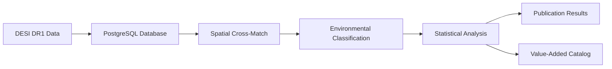

<!--
---
title: "DESI Cosmic Void Galaxies - Environmental Quenching Research Project"
description: "Systematic comparison of galaxies in cosmic voids versus dense walls using DESI DR1 data to investigate environmental quenching mechanisms in galaxy evolution"
author: "VintageDon - https://github.com/vintagedon"
ai_contributor: "Claude Sonnet 4 (claude-sonnet-4-20250514)"
date: "2025-07-23"
version: "1.0"
status: "Published"
tags:
- type: research-project-overview
- domain: galaxy-evolution
- tech: [desi-dr1, postgresql, python]
- phase: active-research
- dataset: desi-bgs-cosmic-voids
related_documents:
- "[Astronomy Projects Overview](./README.md)"
- "[Infrastructure Databases](../infrastructure/databases/README.md)"
- "[VM proj-pg01](../virtual-machines/vm-2002-proj-pg01.md)"
- "[VM proj-dp01](../virtual-machines/vm-2001-proj-dp01.md)"
scientific_context:
  objective: "Environmental quenching analysis using DESI DR1 data"
  dataset: "27.6GB DESI BGS galaxies, DESIVAST void catalog, FastSpecFit properties"
  methods: ["spatial-crossmatch", "statistical-comparison", "environmental-classification"]
---
-->

# 🌌 **DESI Cosmic Void Galaxies - Environmental Quenching Research**

Systematic comparison of galaxies in cosmic voids versus dense "walls" using DESI DR1 data to investigate environmental quenching mechanisms in galaxy evolution. This project leverages the statistical power of ~13.1 million galaxies to provide definitive constraints on how large-scale cosmic environment affects star formation and galaxy properties.

## **🎯 Research Objectives**

### **Primary Scientific Questions**

- **Environmental Quenching:** How does the cosmic environment (voids vs. walls) affect galaxy star formation rates and stellar mass assembly?
- **Mass Dependence:** Are environmental effects mass-dependent, and do they differ between low and high-mass galaxies?
- **Void Environment:** Do galaxies in cosmic voids exhibit enhanced or suppressed star formation compared to wall galaxies?
- **Statistical Constraints:** What are the most precise measurements of environmental effects on galaxy evolution to date?

### **Scientific Impact**

- **Unprecedented Statistical Power:** Leverage DESI DR1's massive galaxy sample for definitive environmental effect measurements
- **Clean Environmental Separation:** Compare ultimate low-density (voids) vs. higher-density (walls) environments
- **Community Resource:** Production of Value-Added Catalog with environmental classifications
- **Theory Validation:** Critical observational constraints for cosmological simulations and galaxy formation models

---

## **📊 Dataset & Methodology**

### **Primary Data Sources**

| **Dataset** | **Size** | **Content** | **Purpose** |
|-------------|----------|-------------|-------------|
| **DESI DR1 BGS** | ~26.4GB | Galaxy positions, redshifts, properties | Primary galaxy sample (~13.1M galaxies) |
| **DESIVAST Void Catalog** | ~1.2GB | Cosmic void positions and effective radii | Environmental classification |
| **FastSpecFit VAC** | Included | Stellar masses and star formation rates | Galaxy property analysis |
| **Total Volume** | **27.6GB** | Complete analysis dataset | Statistical comparison framework |

### **Analysis Framework**

1. **3D Spatial Cross-Match:** Calculate comoving distances between galaxies and void centers
2. **Environmental Classification:** Binary assignment (Void vs. Wall) based on void membership
3. **Statistical Analysis:** Compare galaxy properties between environments using multiple metrics
4. **Publication Pipeline:** Generate publication-quality results and community data products

### **Key Measurements**

- **Galaxy Stellar Mass Function** by environment
- **Star-Forming Main Sequence** environmental variations  
- **Quenched Fraction Analysis** as function of mass and environment
- **Environmental Effect Quantification** with statistical significance testing

---

## **🏗️ Infrastructure Integration**

### **Computing Architecture**

| **Component** | **Specification** | **Role** |
|--------------|------------------|----------|
| **[proj-pg01 Database](../virtual-machines/vm-2002-proj-pg01.md)** | 8 vCPU, 48GB RAM, PostgreSQL 16 | Data storage, spatial queries, analysis |
| **[proj-dp01 Analysis](../virtual-machines/vm-2001-proj-dp01.md)** | 4 vCPU, 16GB RAM, Python environment | Scientific computing, visualization |
| **Network** | 10.25.20.0/24 secure connectivity | Inter-VM communication, data access |
| **Backup** | Proxmox Backup Server integration | Research data protection |

### **Software Stack**

- **Database:** PostgreSQL 16 with spatial extensions for 3D coordinate analysis
- **Scientific Computing:** Python 3.9+ with AstroPy, NumPy, Pandas, SciPy
- **Visualization:** Matplotlib, Seaborn for publication-quality scientific plots
- **Analysis Tools:** Custom spatial cross-matching and statistical analysis pipelines

### **Data Processing Workflow**

---

## **🚀 Project Status & Timeline**

### **Current Phase:** Infrastructure Deployment

**Active Development:** Database implementation and data ingestion pipeline  
**Next Milestone:** Scientific analysis and environmental classification  
**Target Timeline:** 12-week roadmap from setup to publication submission

### **Development Phases**

| **Phase** | **Duration** | **Deliverable** | **Status** |
|-----------|-------------|----------------|------------|
| **Infrastructure Setup** | 1 Week | PostgreSQL deployment, Python environment | ✅ **Complete** |
| **Data Ingestion** | 1 Week | 27.6GB DESI data loaded and indexed | 🔄 **In Progress** |
| **Analysis Pipeline** | 2 Weeks | Environmental classification and statistics | ⏳ **Pending** |
| **Scientific Results** | 2 Weeks | Galaxy property comparisons and significance testing | ⏳ **Pending** |
| **Manuscript Preparation** | 3 Weeks | Complete scientific paper with figures | ⏳ **Pending** |
| **Review & Submission** | 2 Weeks | Journal submission and community VAC release | ⏳ **Pending** |

### **Research Advantages**

- **Rapid Development:** Direct analysis from pre-computed DESI Value-Added Catalogs
- **Low Technical Barrier:** Standard PostgreSQL and Python scientific stack
- **Early Publication:** First major result demonstrating lab capabilities
- **Community Impact:** Enriched catalog benefits broader astronomical community

---

## **🔬 Scientific Methodology**

### **Environmental Classification**

- **Void Galaxies:** Interior to any catalogued cosmic void (ultimate low-density environment)
- **Wall Galaxies:** Exterior to all voids, in filamentary structures (higher-density environment)
- **3D Analysis:** Full comoving distance calculations accounting for redshift-space distortions

### **Statistical Framework**

- **Galaxy Stellar Mass Function:** Number density vs. stellar mass by environment
- **Star Formation Main Sequence:** SFR vs. stellar mass correlation analysis
- **Quenched Fraction:** Environment-dependent star formation cessation rates
- **Significance Testing:** Robust statistical analysis with error propagation

### **Expected Results**

- **Precision Constraints:** Most definitive measurement of void environment effects on galaxy evolution
- **Mass Dependence:** Quantification of how environmental effects vary with galaxy stellar mass
- **Theoretical Validation:** Observational benchmarks for galaxy formation simulations
- **Community Data:** Public release of environmental classifications for ~13.1M galaxies

---

## **📚 External Resources**

### **Data Access**

- **[DESI DR1 Portal](https://data.desi.lbl.gov/doc/releases/dr1/)** - Official DESI Data Release 1
- **[DESIVAST Void Catalog](https://github.com/seshnadathur/DESIVAST)** - Cosmic void identification in DESI
- **[FastSpecFit VAC](https://github.com/desihub/fastspecfit)** - Galaxy property measurements

### **Related Research**

- **[Galaxy Evolution Reviews](https://arxiv.org/abs/astro-ph)** - Environmental quenching literature
- **[Cosmic Void Studies](https://ui.adsabs.harvard.edu/)** - Large-scale structure and void properties
- **[DESI Collaboration](https://www.desi.lbl.gov/)** - Dark Energy Spectroscopic Instrument overview

### **Infrastructure Documentation**

- **[Database Systems](../infrastructure/databases/README.md)** - PostgreSQL configuration and optimization
- **[Analysis Platforms](../infrastructure/README.md)** - Computing resource specifications
- **[Security Framework](../security/README.md)** - Data protection and access controls

---

## **🤝 Collaboration & Contribution**

### **Research Methodology**

- **Open Science:** Transparent methodology and reproducible analysis pipelines
- **Documentation Standards:** Comprehensive project documentation following enterprise standards
- **Statistical Rigor:** Systematic validation and error analysis for all measurements
- **Community Engagement:** Public data products and collaborative research approach

### **Technical Standards**

- **Version Control:** Git-based development with comprehensive commit documentation
- **Code Quality:** Peer review and validation of all analysis code
- **Data Management:** Systematic backup and versioning of research datasets
- **Reproducibility:** Complete workflow documentation enabling independent verification

### **Expected Outcomes**

- **Scientific Publication:** High-impact paper on environmental quenching in cosmic voids
- **Community Data Product:** Value-Added Catalog with environmental classifications
- **Methodology Validation:** Demonstration of systematic research capabilities
- **Infrastructure Benchmark:** Successful deployment of enterprise astronomical computing

---

## **📈 Research Impact**

### **Scientific Contributions**

- **Environmental Physics:** Definitive constraints on cosmic environment effects in galaxy evolution
- **Statistical Astronomy:** Demonstration of precision measurements using large astronomical surveys
- **Observational Cosmology:** Critical validation data for theoretical models and simulations
- **Community Science:** Open data products enabling follow-up research by broader community

### **Technical Innovation**

- **Enterprise Astronomy:** Production-grade infrastructure for large-scale astronomical analysis
- **Systematic Methodology:** RAVGV framework enabling reproducible scientific computing
- **Database Optimization:** PostgreSQL spatial query optimization for astronomical datasets
- **Research Workflow:** Integrated development environment for astronomical data analysis

This project represents the intersection of cutting-edge astronomical research and enterprise-grade computing infrastructure, delivering both scientific discovery and methodological innovation for the astronomical research community.

---

**Repository:** [github.com/Proxmox-Astronomy-Lab/desi-cosmic-void-galaxies](https://github.com/Proxmox-Astronomy-Lab/desi-cosmic-void-galaxies)  
**Infrastructure:** Proxmox Astronomy Lab Enterprise Computing Platform  
**Collaboration:** Systematic Human-AI Research Methodology (RAVGV Framework)
