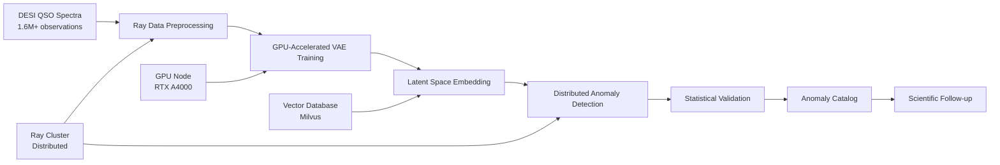

<!--
---
title: "DESI QSO Anomaly Detection - Machine Learning Pipeline for Automated Quasar Analysis"
description: "Large-scale ML anomaly detection on 1.6M+ DESI quasar spectra using Ray distributed computing and advanced neural network architectures"
author: "VintageDon - https://github.com/vintagedon"
ai_contributor: "Claude Sonnet 4 (claude-sonnet-4-20250514)"
date: "2025-07-23"
version: "1.0"
status: "Published"
tags:
- type: research-project-overview
- domain: machine-learning-astronomy
- tech: [desi-dr1, ray-distributed, pytorch, gpu-acceleration]
- phase: active-development
- dataset: desi-qso-spectra-ml
related_documents:
- "[Astronomy Projects Overview](./README.md)"
- "[AI/ML Infrastructure](../ai/README.md)"
- "[GPU Node](../ai/gpu-node/README.md)"
- "[Vector Database](../applications-and-services/milvus01-attu-milvus-backup/README.md)"
scientific_context:
  objective: "Automated anomaly detection in QSO spectra using machine learning"
  dataset: "1.6M+ DESI quasar spectra for unsupervised anomaly detection"
  methods: ["deep-learning", "anomaly-detection", "distributed-computing", "spectral-analysis"]
---
-->

# 🤖 **DESI QSO Anomaly Detection - ML-Driven Quasar Discovery**

[](https://github.com/Proxmox-Astronomy-Lab/desi-qso-anomaly-detection)
[](https://data.desi.lbl.gov/doc/releases/dr1/)
[](https://ray.io/)
[](https://pytorch.org/)
[](https://www.nvidia.com/)

Large-scale machine learning pipeline for automated detection of anomalous quasi-stellar objects (QSOs) in DESI spectroscopic surveys. This project leverages Ray distributed computing, GPU acceleration, and advanced neural network architectures to discover statistically significant outlier quasar spectra from 1.6M+ DESI observations, enabling systematic discovery of rare astrophysical phenomena and spectroscopic anomalies.

## **🎯 Research Objectives**

### **Primary Scientific Goals**

- **Automated Discovery:** Systematic identification of anomalous QSO spectra using unsupervised machine learning
- **Rare Phenomena Detection:** Discovery of unusual quasar spectral features indicating exotic astrophysical processes
- **Large-Scale Analysis:** Processing 1.6M+ quasar spectra for comprehensive anomaly mapping
- **Statistical Significance:** Robust outlier detection with quantified significance and false discovery rate control

### **Technical Innovation**

- **Distributed ML:** Ray cluster deployment for scalable spectral analysis across enterprise infrastructure
- **GPU Acceleration:** RTX A4000 optimization for neural network training and inference
- **Vector Embeddings:** High-dimensional spectral representations for similarity search and clustering
- **Real-Time Discovery:** Automated pipeline for continuous anomaly detection as new data becomes available

### **Scientific Impact**

- **Astrophysical Discovery:** Identification of QSOs with unusual spectral properties indicating rare physical processes
- **Survey Enhancement:** Value-added catalog of spectroscopic anomalies for community research
- **Methodology Validation:** Demonstration of ML techniques for large-scale astronomical survey analysis
- **Follow-up Targeting:** Priority targets for detailed spectroscopic and multi-wavelength observations

---

## **🧠 Machine Learning Architecture**

### **Neural Network Pipeline**

| **Stage** | **Architecture** | **Purpose** | **Output** |
|-----------|-----------------|-------------|------------|
| **Spectral Encoder** | 1D Convolutional VAE | Dimensionality reduction and feature extraction | 128-dimensional latent vectors |
| **Anomaly Scoring** | Isolation Forest + Ensemble | Outlier detection in latent space | Anomaly scores and rankings |
| **Clustering** | HDBSCAN + UMAP | Grouping similar anomalies | Anomaly type classification |
| **Validation** | Statistical Testing | Significance assessment | p-values and FDR control |

### **Distributed Computing Framework**



### **Data Processing Pipeline**

1. **Spectral Preprocessing:** Normalization, wavelength calibration, and quality filtering
2. **Feature Engineering:** Spectral line identification, continuum fitting, and emission/absorption mapping
3. **VAE Training:** Unsupervised learning of spectral representations using 1D convolutional architecture
4. **Anomaly Detection:** Isolation forest and ensemble methods in latent space
5. **Validation:** Statistical significance testing and false discovery rate control
6. **Catalog Production:** Ranked anomaly list with spectral classifications and follow-up priorities

---

## **📊 Dataset & Infrastructure**

### **DESI QSO Spectral Data**

| **Dataset Component** | **Size** | **Content** | **Processing** |
|----------------------|----------|-------------|----------------|
| **QSO Spectra** | ~500GB | 1.6M+ quasar spectra with flux, wavelength, errors | Ray distributed preprocessing |
| **Redshift Catalog** | ~50MB | Spectroscopic redshifts and quality flags | Cross-matching and validation |
| **Photometric Data** | ~200MB | Multi-band photometry for context | Feature augmentation |
| **Value-Added Catalogs** | ~1GB | Line measurements and spectral properties | Ground truth validation |

### **Infrastructure Integration**

| **Component** | **Specification** | **Role** |
|--------------|------------------|----------|
| **[GPU Node](../ai/gpu-node/README.md)** | RTX A4000, 16GB VRAM | Neural network training and inference |
| **[Ray Cluster](../ai/README.md)** | Distributed across K8s nodes | Parallel spectral processing |
| **[Vector Database](../applications-and-services/milvus01-attu-milvus-backup/README.md)** | Milvus with 128D embeddings | Spectral similarity search |
| **[PostgreSQL](../infrastructure/databases/README.md)** | Astronomical catalog storage | Metadata and results management |

### **Computing Requirements**

- **Memory:** 128GB+ across cluster for large spectral arrays
- **GPU Memory:** 16GB VRAM for batch processing neural networks
- **Storage:** 1TB+ high-performance storage for spectral data and model checkpoints
- **Network:** 10Gb connectivity for efficient data movement between nodes

---

## **🔬 Scientific Methodology**

### **Anomaly Detection Framework**

- **Unsupervised Learning:** No prior assumptions about anomaly types or spectral features
- **Multi-Scale Analysis:** Detection of both broad spectral shape and narrow line anomalies
- **Statistical Rigor:** Quantified significance levels with multiple testing correction
- **Interpretability:** Explainable AI techniques to understand anomaly characteristics

### **Validation Strategy**

- **Known Anomalies:** Testing on previously identified unusual QSOs for method validation
- **Synthetic Injection:** Artificial anomaly injection to measure detection efficiency
- **Expert Review:** Astronomical validation of high-significance anomalies
- **Follow-up Observations:** Targeted spectroscopy of highest-priority discoveries

### **Expected Discoveries**

- **Broad Absorption Line QSOs:** Unusual BAL profiles indicating exotic outflow geometries
- **Composite Spectra:** QSOs with unusual host galaxy or intervening system contamination
- **Variable Features:** Spectral changes between observations indicating transient phenomena
- **Extreme Redshifts:** QSOs at unusual redshift ranges or with peculiar spectral evolution

---

## **🚀 Project Status & Development**

### **Current Phase:** Algorithm Development and Validation

**Active Work:** VAE model training and anomaly detection pipeline optimization  
**Next Milestone:** Full 1.6M spectrum processing and anomaly catalog production  
**Timeline:** 16-week development cycle from prototype to publication

### **Development Phases**

| **Phase** | **Duration** | **Deliverable** | **Status** |
|-----------|-------------|----------------|------------|
| **Infrastructure Setup** | 2 Weeks | Ray cluster, GPU optimization, data pipelines | ✅ **Complete** |
| **Model Development** | 3 Weeks | VAE architecture, training pipeline, validation | 🔄 **In Progress** |
| **Anomaly Pipeline** | 2 Weeks | Detection algorithms, statistical validation | ⏳ **Pending** |
| **Large-Scale Processing** | 3 Weeks | Full 1.6M spectrum analysis, catalog production | ⏳ **Pending** |
| **Scientific Validation** | 2 Weeks | Expert review, follow-up target selection | ⏳ **Pending** |
| **Publication** | 3 Weeks | Manuscript preparation, community data release | ⏳ **Pending** |
| **Follow-up Coordination** | 1 Week | Observational proposals, collaboration outreach | ⏳ **Pending** |

### **Technical Milestones**

- **Model Performance:** >95% reconstruction accuracy on normal QSO spectra
- **Anomaly Detection:** <1% false positive rate with statistical significance testing
- **Processing Scale:** Complete 1.6M spectrum analysis within 72 hours
- **Discovery Rate:** Target identification of 100-1000 high-significance anomalies

---

## **💻 Technical Implementation**

### **Software Stack**

- **Distributed Computing:** Ray 2.8+ with Kubernetes integration for scalable processing
- **Deep Learning:** PyTorch 2.0+ with GPU acceleration for neural network training
- **Data Processing:** Astropy, SpectRes, and custom spectral analysis libraries
- **Anomaly Detection:** Scikit-learn, PyOD for ensemble anomaly detection methods
- **Visualization:** Matplotlib, Plotly for interactive spectral visualization and analysis

### **Model Architecture Details**

```python
# 1D Convolutional Variational Autoencoder for Spectral Analysis
class SpectralVAE(nn.Module):
    def __init__(self, input_dim=4000, latent_dim=128):
        # Encoder: Conv1D layers for spectral feature extraction
        # Latent: Mean and variance for probabilistic encoding
        # Decoder: Transposed convolutions for spectral reconstruction
        # Loss: Reconstruction + KL divergence + spectral line preservation
```

### **Distributed Processing Pipeline**

- **Data Sharding:** Intelligent spectral batching for balanced GPU utilization
- **Model Parallelism:** Distributed training across multiple GPU-enabled nodes
- **Result Aggregation:** Ray actors for collecting and ranking anomaly scores
- **Fault Tolerance:** Checkpoint-based recovery for long-running processing jobs

---

## **🔍 Expected Scientific Outcomes**

### **Discovery Categories**

- **Spectroscopic Rarities:** QSOs with unprecedented spectral features or line ratios
- **Physical Extremes:** Objects at extreme ends of parameter distributions (luminosity, redshift, etc.)
- **Systematic Anomalies:** Patterns indicating data quality issues or calibration problems
- **Astrophysical Phenomena:** Spectra indicating unusual physical processes or environmental conditions

### **Community Impact**

- **Anomaly Catalog:** Public release of ranked anomaly list with significance scores
- **Methodology Framework:** Open-source ML pipeline for spectroscopic anomaly detection
- **Follow-up Targets:** Priority list for detailed observational follow-up studies
- **Survey Enhancement:** Improved understanding of DESI data quality and completeness

### **Publication Strategy**

- **Primary Paper:** ML methodology and initial discovery results
- **Discovery Papers:** Detailed analysis of individual high-significance anomalies
- **Technical Paper:** Software framework and computational methodology
- **Community Data:** Value-added catalog with comprehensive anomaly characterization

---

## **📚 External Resources**

### **Data Access & Documentation**

- **[DESI DR1 QSO Catalog](https://data.desi.lbl.gov/doc/releases/dr1/)** - Official quasar spectroscopic data
- **[Ray Documentation](https://docs.ray.io/)** - Distributed computing framework
- **[PyTorch Lightning](https://lightning.ai/)** - Deep learning training optimization
- **[Astropy Spectroscopy](https://specutils.readthedocs.io/)** - Astronomical spectral analysis tools

### **Scientific Context**

- **[QSO Physics Reviews](https://arxiv.org/list/astro-ph.GA/recent)** - Quasar astrophysics literature
- **[ML in Astronomy](https://arxiv.org/list/astro-ph.IM/recent)** - Machine learning applications in astronomy
- **[Anomaly Detection](https://scikit-learn.org/stable/modules/outlier_detection.html)** - Statistical methods and algorithms

### **Infrastructure Integration**

- **[AI/ML Platform](../ai/README.md)** - Distributed computing and GPU acceleration
- **[Vector Database](../applications-and-services/milvus01-attu-milvus-backup/README.md)** - Embedding storage and similarity search
- **[Database Systems](../infrastructure/databases/README.md)** - Metadata and catalog management

---

## **🤝 Collaboration & Community**

### **Open Science Principles**

- **Reproducible Research:** Complete workflow documentation and code availability
- **Open Data:** Public release of anomaly catalogs and methodology frameworks
- **Community Validation:** Expert review process for high-significance discoveries
- **Educational Outreach:** Integration with astronomy education and citizen science programs

### **Expected Collaborations**

- **DESI Collaboration:** Integration with official survey anomaly identification efforts
- **Follow-up Observations:** Coordination with spectroscopic and multi-wavelength facilities
- **Theoretical Modeling:** Collaboration with QSO physics theorists for anomaly interpretation
- **Software Community:** Contribution to astronomical ML software ecosystem

This project represents a convergence of large-scale astronomical surveys, advanced machine learning techniques, and enterprise-grade computing infrastructure to enable systematic discovery of rare astrophysical phenomena in the era of big data astronomy.

---

**Repository:** [github.com/Proxmox-Astronomy-Lab/desi-qso-anomaly-detection](https://github.com/Proxmox-Astronomy-Lab/desi-qso-anomaly-detection)  
**Infrastructure:** Enterprise AI/ML Platform with Ray Distributed Computing  
**Methodology:** Systematic ML-Driven Astronomical Discovery (RAVGV Framework)
