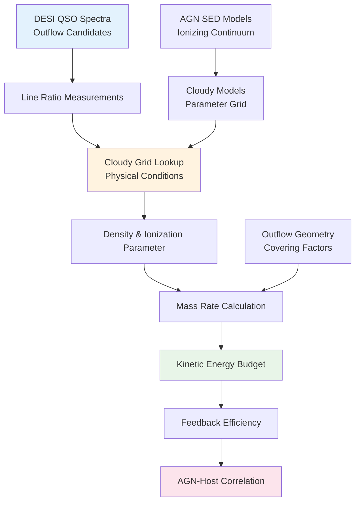

<!--
---
title: "DESI Quasar Outflows - AGN Feedback and Outflow Energetics Analysis"
description: "Large-scale, unsupervised discovery of statistically significant outlier quasar spectra from DESI Data Release with Cloudy photoionization modeling"
author: "VintageDon - https://github.com/vintagedon"
ai_contributor: "Claude Sonnet 4 (claude-sonnet-4-20250514)"
date: "2025-07-23"
version: "1.0"
status: "Published"
tags:
- type: research-project-overview
- domain: agn-astrophysics
- tech: [desi-dr1, cloudy-modeling, python, spectral-analysis]
- phase: active-development
- dataset: desi-qso-outflow-spectra
related_documents:
- "[Astronomy Projects Overview](./README.md)"
- "[Database Systems](../infrastructure/databases/README.md)"
- "[High-Performance Computing](../infrastructure/README.md)"
- "[AI/ML Infrastructure](../ai/README.md)"
scientific_context:
  objective: "AGN feedback and outflow energetics using DESI quasar spectroscopy"
  dataset: "DESI QSO spectra with outflow signatures, Cloudy photoionization grids"
  methods: ["spectral-fitting", "photoionization-modeling", "outflow-energetics", "agn-feedback"]
---
-->

# 🌟 **DESI Quasar Outflows - AGN Feedback & Outflow Energetics**

[](https://github.com/Proxmox-Astronomy-Lab/desi-quasar-outflows)
[](https://data.desi.lbl.gov/doc/releases/dr1/)
[](https://gitlab.nublado.org/cloudy/cloudy/-/wikis/home)
[](https://www.python.org/)
[](https://specutils.readthedocs.io/)

Large-scale, unsupervised discovery of statistically significant outlier quasar spectra from the Dark Energy Spectroscopic Instrument Data Release. This project combines systematic spectral analysis with sophisticated Cloudy photoionization modeling to investigate AGN feedback mechanisms, outflow energetics, and the role of quasar-driven winds in galaxy evolution across cosmic time.

## **🎯 Research Objectives**

### **Primary Scientific Goals**

- **Outflow Discovery:** Systematic identification of quasar outflow signatures in DESI spectroscopic data
- **Energetics Analysis:** Quantification of outflow velocities, mass rates, and kinetic energy feedback
- **AGN Feedback:** Investigation of quasar-driven feedback mechanisms and their impact on host galaxies
- **Evolutionary Context:** Understanding outflow properties as a function of redshift, luminosity, and environment

### **Theoretical Framework**

- **Photoionization Modeling:** Large-scale Cloudy grid calculations for outflow physical conditions
- **Feedback Efficiency:** Measurement of energy coupling between AGN and circumgalactic medium
- **Host Galaxy Impact:** Correlation between outflow properties and star formation quenching
- **Cosmological Context:** Outflow evolution across cosmic time using DESI's redshift coverage

### **Scientific Impact**

- **AGN Physics:** Definitive measurements of quasar outflow properties and feedback efficiency
- **Galaxy Evolution:** Quantitative constraints on AGN feedback in galaxy formation models
- **Survey Science:** Systematic outflow analysis methodology for large spectroscopic surveys
- **Theoretical Validation:** Observational benchmarks for AGN feedback simulations and models

---

## **🔬 Scientific Methodology**

### **Spectral Analysis Framework**

| **Analysis Stage** | **Method** | **Output** | **Purpose** |
|-------------------|------------|------------|-------------|
| **Line Detection** | Automated emission/absorption line identification | Line catalogs with velocities and strengths | Outflow signature identification |
| **Kinematic Analysis** | Multi-component Gaussian fitting | Velocity dispersions and outflow velocities | Outflow kinematics measurement |
| **Photoionization Modeling** | Cloudy grid interpolation | Physical conditions (density, ionization) | Outflow physics determination |
| **Energetics Calculation** | Mass-energy budget analysis | Outflow rates and kinetic powers | Feedback efficiency quantification |

### **Cloudy Photoionization Grid**



### **Physical Parameter Grid**

- **Ionization Parameter:** log U = -4.0 to -1.0 (0.1 dex steps)
- **Hydrogen Density:** log nH = 1.0 to 6.0 cm⁻³ (0.25 dex steps)
- **Metallicity:** 0.1 to 3.0 solar (logarithmic sampling)
- **AGN SED:** Composite quasar continuum with luminosity scaling
- **Geometry:** Spherical and planar geometries with covering factor variations

---

## **📊 Dataset & Infrastructure**

### **DESI Quasar Spectral Data**

| **Dataset Component** | **Size** | **Content** | **Analysis Focus** |
|----------------------|----------|-------------|-------------------|
| **QSO Spectra** | ~200GB | DESI quasar spectra with S/N > 5 | Outflow line detection and measurement |
| **Redshift Catalog** | ~50MB | Spectroscopic redshifts and quality assessments | Sample selection and cosmological context |
| **Photometric Data** | ~100MB | Multi-band photometry and host galaxy properties | AGN-host correlation analysis |
| **Cloudy Grid** | ~50GB | Precomputed photoionization model predictions | Physical condition determination |

### **Computational Requirements**

| **Component** | **Specification** | **Role** |
|--------------|------------------|----------|
| **Spectral Processing** | High-memory compute nodes | Large-scale spectral fitting and line measurement |
| **Cloudy Modeling** | CPU-intensive parallel processing | Photoionization grid calculation and interpolation |
| **Database Storage** | PostgreSQL with spatial extensions | Spectral catalogs and analysis results |
| **Visualization** | Interactive plotting and analysis | Scientific visualization and quality assessment |

### **Infrastructure Integration**

- **Database Systems:** PostgreSQL optimization for spectroscopic catalogs and line measurements
- **High-Performance Computing:** Distributed Cloudy modeling across enterprise cluster
- **Data Management:** Systematic storage and versioning of spectral analysis products
- **Quality Control:** Automated validation and outlier detection in analysis pipelines

---

## **🔬 Outflow Physics & Modeling**

### **Spectroscopic Signatures**

- **Broad Absorption Lines (BALs):** High-velocity outflows in UV resonance transitions
- **Narrow Absorption Lines (NALs):** Lower velocity absorbing gas along line of sight
- **Emission Line Asymmetries:** Blueshifted emission components indicating outflowing gas
- **Forbidden Line Ratios:** Diagnostic ratios for density and ionization conditions

### **Physical Diagnostics**

| **Measurement** | **Observable** | **Physical Insight** |
|----------------|----------------|---------------------|
| **Outflow Velocity** | Line centroid shifts and widths | Kinematic energy and momentum transfer |
| **Column Density** | Absorption line equivalent widths | Total gas mass in outflow |
| **Ionization State** | Line ratio diagnostics | Ionizing photon flux and hardness |
| **Covering Factor** | Residual flux in absorption troughs | Geometric distribution of outflowing gas |

### **Energetics Framework**

- **Mass Outflow Rate:** Ṁ_out = μ m_p n_H v_out A_out C_f
- **Kinetic Power:** Ė_kin = ½ Ṁ_out v_out²
- **Momentum Rate:** ṗ_out = Ṁ_out v_out
- **Feedback Efficiency:** ε_f = Ė_kin / L_AGN

---

## **🚀 Project Status & Development**

### **Current Phase:** Methodology Validation and Pipeline Development

**Active Work:** Cloudy grid optimization and automated spectral fitting pipeline  
**Next Milestone:** Large-scale outflow survey and statistical analysis  
**Timeline:** 18-week development cycle from methodology to publication

### **Development Phases**

| **Phase** | **Duration** | **Deliverable** | **Status** |
|-----------|-------------|----------------|------------|
| **Infrastructure Setup** | 2 Weeks | Cloudy installation, spectral analysis environment | ✅ **Complete** |
| **Methodology Development** | 3 Weeks | Automated fitting pipeline, Cloudy grid generation | 🔄 **In Progress** |
| **Validation Testing** | 2 Weeks | Known outflow validation, method benchmarking | ⏳ **Pending** |
| **Large-Scale Survey** | 4 Weeks | Full DESI sample processing, outflow catalog | ⏳ **Pending** |
| **Physical Analysis** | 3 Weeks | Energetics calculation, feedback efficiency | ⏳ **Pending** |
| **Statistical Studies** | 2 Weeks | Population analysis, evolutionary trends | ⏳ **Pending** |
| **Publication** | 2 Weeks | Manuscript preparation, community data release | ⏳ **Pending** |

### **Technical Milestones**

- **Spectral Fitting:** Automated pipeline processing >1000 spectra per hour
- **Cloudy Grid:** Complete photoionization model grid with <1% interpolation errors
- **Outflow Detection:** >95% completeness for outflows with v > 500 km/s
- **Physical Accuracy:** ±0.3 dex precision in density and ionization parameter determination

---

## **💻 Technical Implementation**

### **Software Stack**

- **Spectral Analysis:** Python with Astropy, SpectRes, and custom fitting routines
- **Photoionization Modeling:** Cloudy C23.01 with automated grid generation
- **Data Management:** PostgreSQL with specialized astronomical extensions
- **Statistical Analysis:** SciPy, NumPy for population studies and trend analysis
- **Visualization:** Matplotlib, Plotly for interactive spectral visualization

### **Analysis Pipeline Architecture**

```python
# Semi-Automated Spectral Analysis Pipeline
class QuasarOutflowAnalyzer:
    def __init__(self, cloudy_grid_path, spectrum_database):
        # Initialize Cloudy model grid and database connections
        
    def detect_outflows(self, spectrum):
        # Automated line detection and kinematic analysis
        
    def fit_physical_conditions(self, line_ratios):
        # Cloudy grid interpolation for density and ionization
        
    def calculate_energetics(self, physical_params, kinematics):
        # Mass rates, kinetic power, and feedback efficiency
```

### **Cloudy Grid Generation**

- **Parameter Space Exploration:** Systematic coverage of relevant physical parameter space
- **Model Optimization:** Efficient grid spacing and interpolation schemes
- **Quality Control:** Automated validation of model convergence and physical consistency
- **Scalable Computing:** Distributed grid calculation across multiple compute nodes

---

## **🔍 Expected Scientific Outcomes**

### **Discovery Categories**

- **High-Velocity Outflows:** QSOs with extreme outflow velocities (v > 10,000 km/s)
- **Massive Outflow Rates:** Systems with exceptionally high mass ejection rates
- **Feedback Extremes:** Objects with very high or low feedback efficiency
- **Evolutionary Trends:** Systematic changes in outflow properties with redshift or luminosity

### **Population Studies**

- **Outflow Incidence:** Frequency of detectable outflows as function of AGN properties
- **Energetics Distribution:** Statistical analysis of outflow power and feedback efficiency
- **Host Galaxy Correlations:** Relationship between outflow properties and host galaxy characteristics
- **Cosmological Evolution:** Changes in outflow properties across cosmic time

### **Theoretical Implications**

- **Feedback Models:** Observational constraints for AGN feedback prescriptions in simulations
- **Galaxy Quenching:** Quantitative assessment of AGN role in star formation cessation
- **Black Hole Growth:** Relationship between outflow properties and black hole accretion
- **Circumgalactic Medium:** Impact of AGN outflows on surrounding gas properties

---

## **📚 External Resources**

### **Software & Modeling Tools**

- **[Cloudy Photoionization Code](https://gitlab.nublado.org/cloudy/cloudy/)** - Plasma simulation code
- **[DESI Spectroscopic Pipeline](https://github.com/desihub/desispec)** - Official DESI data reduction
- **[PyNeb](https://pyneb.readthedocs.io/)** - Nebular emission line analysis
- **[Astropy Spectroscopy](https://specutils.readthedocs.io/)** - Astronomical spectral analysis

### **Scientific Literature**

- **[AGN Outflow Reviews](https://arxiv.org/list/astro-ph.GA/recent)** - Quasar outflow astrophysics
- **[Cloudy Documentation](https://cloudy.nublado.org/)** - Photoionization modeling methods
- **[DESI Collaboration Papers](https://www.desi.lbl.gov/publications/)** - Survey methodology and results

### **Data Access & Collaboration**

- **[DESI DR1 Portal](https://data.desi.lbl.gov/doc/releases/dr1/)** - Official quasar spectroscopic data
- **[AGN Working Groups](https://www.desi.lbl.gov/)** - DESI AGN science collaboration
- **[Theoretical Modeling](https://www.illustris-project.org/)** - AGN feedback simulation comparison

---

## **🤝 Collaboration & Community**

### **Research Methodology**

- **Semi-Automated Analysis:** Human oversight of automated pipeline for quality control
- **Open Science:** Transparent methodology and reproducible analysis workflows
- **Community Integration:** Coordination with DESI AGN working group and broader collaboration
- **Educational Outreach:** Training materials for AGN outflow analysis techniques

### **Expected Collaborations**

- **DESI AGN Science:** Integration with official survey AGN analysis efforts
- **Theoretical Modeling:** Collaboration with AGN feedback simulation groups
- **Multi-wavelength Campaigns:** Coordination with X-ray and radio outflow studies
- **Follow-up Observations:** High-resolution spectroscopy of exceptional objects

### **Data Products**

- **Outflow Catalog:** Comprehensive database of DESI quasar outflow measurements
- **Physical Parameters:** Cloudy-derived density, ionization, and energetics
- **Analysis Tools:** Open-source spectral analysis and Cloudy interface software
- **Educational Materials:** Tutorials and documentation for AGN outflow analysis

This project represents a comprehensive approach to understanding AGN feedback through systematic spectroscopic analysis, combining large-scale survey data with sophisticated theoretical modeling to quantify the role of quasar outflows in galaxy evolution.

---

**Repository:** [github.com/Proxmox-Astronomy-Lab/desi-quasar-outflows](https://github.com/Proxmox-Astronomy-Lab/desi-quasar-outflows)  
**Infrastructure:** Enterprise High-Performance Computing with Cloudy Modeling  
**Methodology:** Semi-Automated Spectroscopic Analysis (RAVGV Framework)
