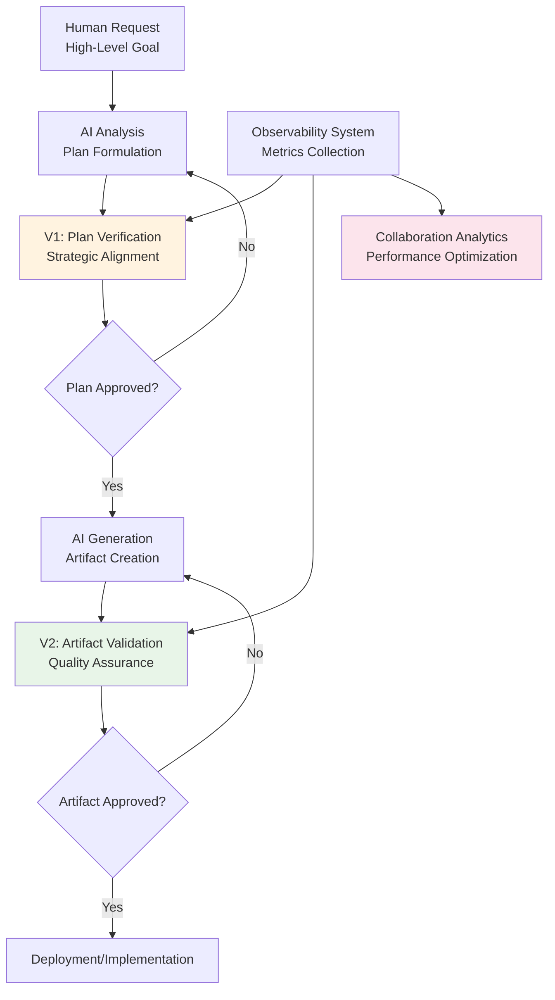

<!--
---
title: "Spec-Driven AI - Systematic Human-AI Collaboration Framework"
description: "Outcome-driven infrastructure through systematic AI collaboration within enterprise Proxmox Astronomy Lab validating RAVGV methodology with comprehensive observability and structured validation loops"
author: "VintageDon - https://github.com/vintagedon"
ai_contributor: "Claude Sonnet 4 (claude-sonnet-4-20250514)"
date: "2025-07-23"
version: "1.0"
status: "Published"
tags:
- type: research-project-overview
- domain: human-ai-collaboration
- tech: [ravgv-methodology, infrastructure-as-code, observability, vector-database]
- phase: methodology-validation
- dataset: collaboration-metrics-observability
related_documents:
- "[Astronomy Projects Overview](./README.md)"
- "[Vector Database](../applications-and-services/milvus01-attu-milvus-backup/README.md)"
- "[Graph Database](../applications-and-services/neo4j01-graph-database/README.md)"
- "[Infrastructure Overview](../infrastructure/README.md)"
scientific_context:
  objective: "Systematic human-AI collaboration methodology validation"
  dataset: "Collaboration metrics, observability data, and structured validation loops"
  methods: ["ravgv-protocol", "infrastructural-cognitive-architecture", "dual-validation-loops"]
---
-->

# 🛠️ **Spec-Driven AI - Systematic Human-AI Collaboration Framework**

[](https://github.com/Proxmox-Astronomy-Lab/spec-driven-ai)
[](https://github.com/Proxmox-Astronomy-Lab/spec-driven-ai)
[](../infrastructure/README.md)
[](../monitoring/README.md)
[](../ai/README.md)

Outcome-driven infrastructure through systematic AI collaboration within enterprise Proxmox Astronomy Lab. Validates RAVGV (Request-Analyze-Verify-Generate-Validate) methodology with comprehensive observability, state persistence, and structured validation loops for scalable human-AI cooperation. This project establishes theoretical foundations and practical implementation blueprint for verifiable, spec-driven AI collaboration systems.

## **🎯 Research Objectives**

### **Primary Framework Goals**

- **RAVGV Methodology Validation:** Systematic validation of Request-Analyze-Verify-Generate-Validate protocol for human-AI collaboration
- **Infrastructural Cognitive Architecture:** Development of work environments as cognitive extensions enforcing disciplined workflows
- **Dual-Validation Loops:** Implementation of pre-generation plan verification and post-generation artifact validation
- **Systematic Observability:** Comprehensive metrics collection for collaboration dynamics and system performance

### **Theoretical Innovation**

- **Specification-as-Code Paradigm:** Declarative artifact definition bridging human intent and machine execution
- **Git-Native Orchestration:** Leveraging established socio-technical workflows (Issues, PRs) as transparent control plane
- **Cognitive Scaffolding:** Ensuring human experts remain cognitively engaged at critical decision points
- **Hybrid Agent Transparency:** Solving opacity challenges in human-AI collaborative systems

### **Scientific Impact**

- **Human-Computer Interaction:** Novel socio-technical system for verifiable knowledge co-creation
- **Cognitive Science:** Formalization of Infrastructural Cognitive Architecture concept
- **AI Systems:** Empirical analysis of collaborative dynamics in specification-driven agentic systems
- **Enterprise Implementation:** Practical blueprint for reliable, auditable AI automation

---

## **🧠 RAVGV Methodology Framework**

### **Five-Stage Collaboration Protocol**

| **Stage** | **Function** | **Human Role** | **AI Role** | **Validation** |
|-----------|-------------|----------------|-------------|----------------|
| **Request** | Task initiation | Subject matter expert provides high-level goals | Context interpretation | Initial requirement clarity |
| **Analyze** | Plan formulation | Domain expertise and constraint definition | Plan development and context gathering | Strategic alignment check |
| **Verify (V1)** | Pre-generation validation | Plan review and approval | Plan presentation and clarification | **Critical: Plan validation before execution** |
| **Generate** | Artifact creation | Quality oversight and guidance | Artifact generation per approved plan | Execution monitoring |
| **Validate (V2)** | Post-generation review | Final quality assurance and approval | Artifact presentation and documentation | **Critical: Final artifact validation** |

### **Dual-Validation Innovation**



### **Key Differentiators**

- **Pre-Generation Validation:** Strategic alignment check preventing wasted computational effort
- **Post-Generation Quality Control:** Expert validation ensuring artifact correctness and completeness
- **Git-Native Workflow:** Transparent, auditable orchestration using established software development protocols
- **Cognitive Engagement:** Human experts remain actively involved rather than passive validators

---

## **📊 Observability & Metrics Framework**

### **Collaboration Dynamics Measurement**

| **Metric Category** | **Key Indicators** | **Purpose** | **Data Source** |
|--------------------|-------------------|-------------|-----------------|
| **Verification-Validation Ratio (VVR)** | V1 rejections / V2 rejections | Plan quality assessment | Git workflow tracking |
| **False Positive Mitigation Rate (FPMR)** | Prevented errors through dual validation | Error prevention effectiveness | Validation outcome analysis |
| **Cognitive Overhead Index (COI)** | Human effort per successful outcome | Efficiency measurement | Time tracking and effort analysis |
| **Iteration Convergence** | Cycles to successful completion | Process optimization | Workflow state analysis |

### **Infrastructure Integration Metrics**

- **Specification Coverage:** Percentage of infrastructure managed through spec-driven approach
- **Compliance Validation:** Automated CIS Controls v8 compliance checking through specifications
- **Knowledge Graph Connectivity:** Relationship mapping between specifications, resources, and teams
- **Semantic Search Effectiveness:** Vector database query accuracy for specification discovery

### **"Collaboration Cockpit" Dashboard**

Real-time observability system providing:

- **Live Workflow Status:** Current RAVGV stage for active collaboration sessions
- **Performance Analytics:** Historical trends in collaboration effectiveness
- **Quality Metrics:** Success rates, error patterns, and improvement opportunities
- **Resource Utilization:** Infrastructure impact of spec-driven methodology

---

## **🏗️ Technical Architecture**

### **Multi-Database Backend Evolution**

| **Phase** | **Implementation** | **Capability** | **Purpose** |
|-----------|-------------------|----------------|-------------|
| **Phase 1: File-Based** | Markdown + YAML specifications | Human-readable declarative artifacts | Immediate adoptability and validation |
| **Phase 2: Structured State** | PostgreSQL backend | Structured specification management | Queryable specification database |
| **Phase 3: Semantic Context** | Milvus vector database | Intelligent specification assistance | Semantic search and context awareness |
| **Phase 4: Dependency Analysis** | Neo4j graph database | Complex relationship modeling | Impact analysis and dependency mapping |

### **Infrastructure Integration**

| **Component** | **Role** | **Integration** |
|--------------|----------|-----------------|
| **[Vector Database](../applications-and-services/milvus01-attu-milvus-backup/README.md)** | Semantic specification search | Natural language specification discovery |
| **[Graph Database](../applications-and-services/neo4j01-graph-database/README.md)** | Dependency relationship mapping | Impact analysis and change management |
| **[Enterprise Infrastructure](../infrastructure/README.md)** | Specification target platform | Real-world validation environment |
| **[Monitoring Systems](../monitoring/README.md)** | Observability and metrics collection | Collaboration dynamics analysis |

### **Specification Framework Structure**

```yaml
# Example Specification-as-Code Structure
id: spec-database-postgresql-v1
metadata:
  author: platform-team
  created: 2025-07-23
  status: active
  
goal: |
  Deploy production PostgreSQL database with enterprise security,
  automated backup, and performance monitoring integration

constraints:
  - All traffic must be encrypted (TLS 1.3+)
  - Database must integrate with CIS Controls v8 compliance framework
  - Backup retention minimum 30 days with point-in-time recovery
  - Monitoring integration required for performance and security

dependencies:
  - spec-network-security-v2
  - spec-backup-infrastructure-v1
  - spec-monitoring-integration-v3

validation:
  pre_deployment:
    - Security configuration review
    - Performance baseline establishment
  post_deployment:
    - Compliance validation
    - Integration testing
```

---

## **🚀 Project Status & Development**

### **Current Phase:** Methodology Validation and Infrastructure Integration

**Active Work:** RAVGV protocol implementation and observability system development  
**Next Milestone:** Comprehensive collaboration metrics collection and analysis  
**Timeline:** 4-phase evolution from file-based to full multi-database implementation

### **Development Phases**

| **Phase** | **Duration** | **Deliverable** | **Status** |
|-----------|-------------|----------------|------------|
| **PoC Development** | 2 Quarters | File-based RAVGV implementation, MCP server PoC | ✅ **Complete** |
| **Infrastructure Integration** | 1 Quarter | PostgreSQL, Milvus, Neo4j backends, Collaboration Cockpit | 🔄 **In Progress** |
| **Self-Optimization** | 1-2 Quarters | Agent observability access, RAVGVR (Reflect) stage | ⏳ **Pending** |
| **Expertise Scaling** | 2-3 Quarters | AI-powered onboarding, knowledge transfer workflows | ⏳ **Planned** |

### **Research Milestones**

- **Methodology Validation:** Successful RAVGV protocol implementation across diverse infrastructure tasks
- **Observability Framework:** Comprehensive metrics collection enabling empirical collaboration analysis
- **Cognitive Architecture:** Demonstration of infrastructure as cognitive extension concept
- **Scalability Assessment:** Multi-user collaboration and knowledge transfer effectiveness

---

## **🔬 Scientific Methodology**

### **Empirical Research Framework**

- **Living Laboratory:** Proxmox Astronomy Lab as comprehensive testbed for human-AI collaboration
- **Radical Transparency:** Complete documentation and open science approach to methodology validation
- **Quantitative Analysis:** Statistical analysis of collaboration metrics and performance indicators
- **Qualitative Assessment:** Expert evaluation of cognitive load, workflow efficiency, and knowledge transfer

### **Publication Strategy**

- **Paper 1 (HCI/CSCW):** "RAVGV: A Git-Native Framework for Verifiable Human-AI Knowledge Co-Creation"
- **Paper 2 (Cognitive Science):** "Infrastructural Cognitive Architecture: A Case Study of Human-AI Symbiosis"
- **Paper 3 (AI/MAS):** "Empirical Analysis of Collaborative Dynamics in Specification-Driven Agentic Systems"
- **Technical Documentation:** Open-source framework and implementation guidelines

### **Validation Criteria**

- **Efficiency Gains:** Measurable improvement in infrastructure development velocity
- **Quality Improvement:** Reduced error rates and enhanced compliance adherence
- **Knowledge Transfer:** Successful onboarding and expertise scaling demonstration
- **System Reliability:** Consistent performance across diverse collaboration scenarios

---

## **💻 Implementation Details**

### **Core Technologies**

- **Specification Language:** LangGPT-structured Markdown and YAML for human-readable specifications
- **Orchestration:** Git-native workflow leveraging Issues and Pull Requests as state machine
- **Backend Integration:** Multi-database architecture supporting specification lifecycle management
- **Observability:** Custom metrics collection and analysis framework for collaboration dynamics
- **AI Integration:** MCP (Model Context Protocol) servers for structured AI interaction

### **Framework Components**

```python
# RAVGV Protocol Implementation
class RAVGVCollaborationFramework:
    def __init__(self, spec_database, vector_store, graph_db):
        self.specifications = spec_database
        self.semantic_search = vector_store
        self.dependencies = graph_db
        
    def request_analyze_cycle(self, human_goal):
        # R: Capture human intent and requirements
        # A: AI analysis and plan formulation
        
    def verify_validation_loop(self, ai_plan, generated_artifact):
        # V1: Pre-generation plan verification
        # V2: Post-generation artifact validation
        
    def observe_collaboration_metrics(self):
        # VVR, FPMR, COI calculation and analysis
```

### **Integration Patterns**

- **Infrastructure-as-Code:** Specification-driven infrastructure deployment and management
- **Compliance Automation:** CIS Controls v8 validation through structured specifications
- **Knowledge Management:** Vector database semantic search for specification discovery
- **Impact Analysis:** Graph database dependency tracking for change management

---

## **🔍 Expected Outcomes**

### **Academic Contributions**

- **Theoretical Framework:** Formalization of specification-driven AI collaboration methodology
- **Empirical Evidence:** Quantitative analysis of human-AI collaboration dynamics and effectiveness
- **Cognitive Architecture:** Novel concept of infrastructure as cognitive extension for expert workflows
- **Methodological Innovation:** Git-native orchestration as alternative to complex programmatic state machines

### **Industry Applications**

- **Enterprise AI Adoption:** Practical blueprint for reliable, auditable AI automation
- **Risk Management:** Systematic approach to managing AI risk through structured validation
- **Compliance Framework:** Integration of AI collaboration with regulatory compliance requirements
- **Knowledge Scaling:** Methodology for transferring expert knowledge through AI collaboration

### **Research Infrastructure**

- **Open Framework:** Complete implementation available for research community validation
- **Collaboration Metrics:** Standardized metrics for evaluating human-AI collaboration effectiveness
- **Living Laboratory:** Ongoing testbed for human-AI collaboration research and development
- **Educational Resources:** Training materials and documentation for systematic AI collaboration

---

## **📚 Theoretical Foundations**

### **Core Concepts**

- **[Specification-as-Code Paradigm](https://github.com/Proxmox-Astronomy-Lab/spec-driven-ai)** - Declarative intent specification
- **[LangGPT Framework](https://arxiv.org/html/2402.16929v1)** - Structured, reusable prompt design
- **[Cognitive Scaffolding](https://notes.andymatuschak.org/Cognitive_scaffolding)** - Supporting expert cognition
- **[Distributed Cognition](https://en.wikipedia.org/wiki/Distributed_cognition)** - Cognitive systems across agents

### **Related Research**

- **Human-Computer Interaction:** Collaborative AI systems and user experience design
- **Computer-Supported Cooperative Work:** Socio-technical systems for knowledge work
- **AI Systems:** Multi-agent systems and human-AI collaboration frameworks
- **Cognitive Science:** Expertise development and knowledge transfer mechanisms

### **Infrastructure Context**

- **[Enterprise Infrastructure](../infrastructure/README.md)** - Real-world validation environment
- **[CIS Controls Framework](../security/README.md)** - Compliance and security integration
- **[Observability Systems](../monitoring/README.md)** - Comprehensive metrics and monitoring

---

## **🤝 Collaboration & Community**

### **Research Methodology**

- **Open Science:** Complete transparency in methodology development and validation
- **Community Validation:** Framework implementation available for independent verification
- **Systematic Documentation:** Comprehensive documentation of collaboration patterns and outcomes
- **Knowledge Transfer:** Educational materials for systematic human-AI collaboration adoption

### **Expected Impact**

- **Academic Research:** Novel framework for studying human-AI collaboration dynamics
- **Industry Practice:** Practical methodology for enterprise AI adoption with risk management
- **Educational Applications:** Training framework for effective human-AI collaboration skills
- **Research Infrastructure:** Platform for ongoing collaboration research and development

This project represents a convergence of cognitive science, human-computer interaction, and AI systems research, providing both theoretical foundations and practical implementation for the next generation of human-AI collaborative systems.

---

**Repository:** [github.com/Proxmox-Astronomy-Lab/spec-driven-ai](https://github.com/Proxmox-Astronomy-Lab/spec-driven-ai)  
**Infrastructure:** Enterprise Cognitive Architecture Platform  
**Methodology:** RAVGV Framework for Systematic Human-AI Collaboration
