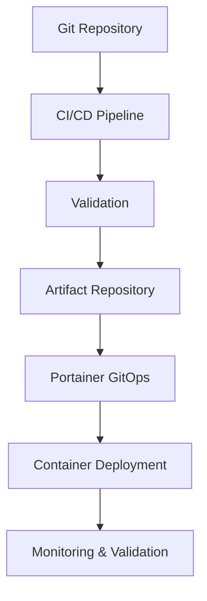

I'll rewrite the Docker README to align with our template standards and include proper references to the folder structure from the WikiTree.

<!-- 
---
title: "Docker & Portainer - Proxmox Astronomy Lab"
description: "Overview of the Docker and Portainer implementation in the Proxmox Astronomy Lab, including architecture, deployment strategy, and organization principles."
author: "VintageDon"
tags: ["docker", "portainer", "containers", "microservices", "infrastructure"]
category: "Infrastructure"
kb_type: "Reference"
version: "1.0"
status: "Published"
last_updated: "2025-03-08"
---
-->

# 🐳 **Docker & Portainer**

## 🔍 **1. Overview**

The Proxmox Astronomy Lab utilizes Docker containers and Portainer for **critical support services** that require **higher stability and isolation** from the Kubernetes cluster. This architecture deliberately separates **infrastructure support services** from **research workloads**, ensuring that core functionality remains available and stable regardless of Kubernetes cluster state.

This section documents the **Docker implementation strategy**, **Portainer architecture**, and **container organization principles** used throughout the lab.

## 🏛️ **2. Docker Strategy**

### **2.1 Why Docker Outside Kubernetes?**

The lab intentionally maintains certain services outside the Kubernetes cluster for specific reasons:

| **Consideration** | **Docker Advantage** | **Implementation** |
|------------------|---------------------|-------------------|
| **Stability** | Isolated from cluster state | Core services remain available even during K8s maintenance |
| **Simplicity** | Lower operational complexity | Faster troubleshooting and deployment for infrastructure services |
| **Dependency Isolation** | Infrastructure services independent from cluster | Database servers, authentication services run independently |
| **Performance** | Direct host access | Database and file services benefit from direct host resource access |
| **Management Overhead** | Lower for stable, rarely-changing services | Reduced operational burden for infrastructure team |

### **2.2 Service Categorization**

Services are categorized to determine appropriate containerization strategy:

| **Category** | **Deployment Method** | **Example Services** |
|--------------|----------------------|---------------------|
| **Infrastructure Support** | Docker with Portainer | PostgreSQL, MongoDB, NGINX, InfluxDB |
| **Research Processing** | Kubernetes | SDR processing, data pipelines, machine learning |
| **Development & Testing** | Kubernetes | CI/CD, testing environments, development instances |
| **User-Facing Applications** | Kubernetes | Dashboards, web interfaces, research tools |

## 🌐 **3. Docker Host Organization**

### **3.1 Node Distribution**

Docker workloads are distributed across dedicated nodes:

| **Host** | **Role** | **Primary Services** | **Documentation** |
|----------|---------|---------------------|------------------|
| **lab-port01** | Portainer Controller | Portainer Server, Edge management | [Portainer Control](/docker/portainer/lab-port01-portainer-master-control-node/README.md) |
| **lab-apps01** | Application Services | Web services, API gateways | [Applications Node](/docker/portainer/lab-apps01-portainer-docker-application-node/README.md) |
| **lab-db01** | Database Services | Database containers, data services | [Database Node](/docker/portainer/lab-db01-portainer-docker-database-node/README.md) |
| **proj-apps01** | Project Applications | Research-specific applications | [Project Applications](/docker/portainer/proj-apps01-portainer-docker-application-node/README.md) |

### **3.2 Stack Organization**

The lab uses Portainer stacks for organized deployment:

| **Node** | **Stack Category** | **Examples** | **Documentation** |
|----------|-------------------|------------|------------------|
| **lab-apps01** | Web Applications | [Gitea](/docker/portainer-stacks/lab-apps01-portainer-docker-application-node/gitea/README.md), [GLPI](/docker/portainer-stacks/lab-apps01-portainer-docker-application-node/glpi/README.md), [WikiJS](/docker/portainer-stacks/lab-apps01-portainer-docker-application-node/wikijs/README.md) | [Applications Stacks](/docker/portainer-stacks/lab-apps01-portainer-docker-application-node/README.md) |
| **lab-db01** | Databases | [PostgreSQL](/docker/portainer-stacks/lab-db01-portainer-docker-database-node/postgresql/README.md), [MongoDB](/docker/portainer-stacks/lab-db01-portainer-docker-database-node/mongodb/README.md), [InfluxDB](/docker/portainer-stacks/lab-db01-portainer-docker-database-node/influxdb/README.md) | [Database Stacks](/docker/portainer-stacks/lab-db01-portainer-docker-database-node/README.md) |
| **proj-apps01** | Research Apps | [Grafana](/docker/portainer-stacks/proj-apps01-portainer-docker-application-node/grafana/README.md), [Nextcloud](/docker/portainer-stacks/proj-apps01-portainer-docker-application-node/nextcloud/README.md) | [Project Stacks](/docker/portainer-stacks/proj-apps01-portainer-docker-application-node/README.md) |

## ⚙️ **4. Portainer Implementation**

Portainer Business Edition provides centralized container management with advanced features:

### **4.1 Portainer Architecture**

| **Component** | **Location** | **Purpose** |
|--------------|-------------|------------|
| **Portainer Server** | lab-port01 | Central management interface |
| **Edge Agents** | lab-apps01, lab-db01, proj-apps01 | Remote node management |
| **Edge Keys** | Secure storage | Encrypted communication |

### **4.2 Deployment Methodology**

The lab uses a GitOps approach for Portainer stack deployment:

## 🔐 **5. Security & Compliance**

### **5.1 Container Security Standards**

The lab implements consistent security standards across all Docker deployments:

| **Standard** | **Implementation** | **Purpose** |
|--------------|-------------------|------------|
| **Official Images** | Use Docker Official or vendor-provided images | Security and reliability |
| **Version Pinning** | Specific version tags (not latest) | Stability and reproducibility |
| **Non-Root Users** | Custom users in containers | Reduced attack surface |
| **Secret Management** | Docker secrets, no embedded credentials | Secure credential handling |
| **Network Isolation** | Custom bridge networks with defined access | Service isolation |

### **5.2 Compliance Integration**

Containers maintain compliance with lab-wide security standards:

| **Requirement** | **Implementation** | **Documentation** |
|-----------------|-------------------|------------------|
| **CIS Docker Benchmarks** | Regular scans using Trivy | [Docker Security](/docker/portainer-stacks/lab-documentation-and-style-guide.md) |
| **Container Image Scanning** | Pre-deployment vulnerability checks | [Image Security](/docker/portainer-stacks/lab-documentation-and-style-guide.md) |

## 📁 **6. Directory Contents**

### **Subdirectories**

| **Directory** | **Purpose** | **Link** |
|--------------|------------|----------|
| **📁 portainer** | Portainer node configuration | [Portainer Config](/docker/portainer/README.md) |
| **📁 portainer-stacks** | Stack definitions by node | [Stack Definitions](/docker/portainer-stacks/README.md) |

### **Key Documents**

| **Document** | **Purpose** | **Link** |
|--------------|------------|----------|
| **📄 portainer-stacks-lab-documentation** | Style guide and standards | [Stack Standards](/docker/portainer-stacks/portainer-stacks-lab-documentation-and-style-guide.md) |

## 🔄 **7. Related Categories**

| **Category** | **Relationship** | **Link** |
|--------------|----------------|----------|
| **Infrastructure** | Container host nodes | [Infrastructure](/infrastructure/README.md) |
| **Monitoring** | Container metrics collection | [Monitoring](/monitoring/README.md) |
| **Lab Services** | Services provided by containers | [Lab Services](/lab-services/README.md) |

## ✅ **8. Approval & Review**

| **Reviewer** | **Role** | **Approval Date** | **Status** |
|-------------|---------|------------------|------------|
| VintageDon | Lead Engineer | 2025-03-08 | ✅ Approved |

## 📜 **9. Change Log**

| **Version** | **Date** | **Changes** | **Author** |
|------------|---------|-------------|------------|
| 1.0 | 2025-03-08 | Initial documentation | VintageDon |