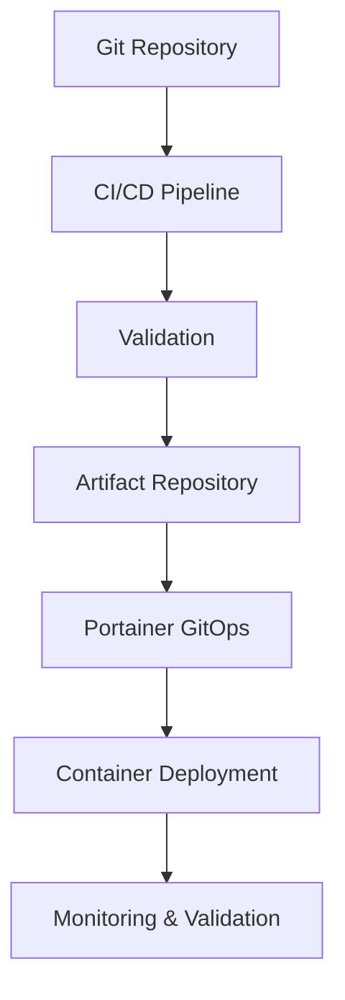

# **Docker & Portainer - Proxmox Astronomy Lab**

## **1. Overview**

The Proxmox Astronomy Lab utilizes Docker containers and Portainer for **critical support services** that require **higher stability and isolation** from the Kubernetes cluster. This architecture deliberately separates **infrastructure support services** from **research workloads**, ensuring that core functionality remains available and stable regardless of Kubernetes cluster state.

This document outlines the **Docker implementation strategy**, **Portainer architecture**, and **container organization principles** used throughout the lab.

### **1.1 Containerization Philosophy**

The lab follows a clear separation of concerns in containerization strategy:

✅ **Docker for Infrastructure Support** - Core services that support the broader infrastructure  
✅ **Kubernetes for Research Workloads** - Scalable, flexible environments for research applications  
✅ **Stability Over Complexity** - Prioritizing reliability for critical services  
✅ **Ease of Management** - GUI-based administration and standardized deployment  
✅ **Consistency and Reproducibility** - Version-controlled configurations  

---

## **2. Docker Strategy**

### **2.1 Why Docker Outside Kubernetes?**

The lab intentionally maintains certain services outside the Kubernetes cluster for specific reasons:

| **Consideration** | **Docker Advantage** | **Implementation** |
|------------------|---------------------|-------------------|
| **Stability** | Isolated from cluster state | Core services remain available even during K8s maintenance |
| **Simplicity** | Lower operational complexity | Faster troubleshooting and deployment for infrastructure services |
| **Dependency Isolation** | Infrastructure services independent from cluster | Database servers, authentication services run independently |
| **Performance** | Direct host access | Database and file services benefit from direct host resource access |
| **Management Overhead** | Lower for stable, rarely-changing services | Reduced operational burden for infrastructure team |

### **2.2 Service Categorization**

Services are categorized to determine appropriate containerization strategy:

| **Category** | **Deployment Method** | **Example Services** |
|--------------|----------------------|---------------------|
| **Infrastructure Support** | Docker with Portainer | PostgreSQL, MongoDB, NGINX, InfluxDB |
| **Research Processing** | Kubernetes | SDR processing, data pipelines, machine learning |
| **Development & Testing** | Kubernetes | CI/CD, testing environments, development instances |
| **User-Facing Applications** | Kubernetes | Dashboards, web interfaces, research tools |

### **2.3 Docker Host Distribution**

Docker workloads are distributed across dedicated nodes:

| **Host** | **Role** | **Primary Services** | **Resource Allocation** |
|----------|---------|---------------------|------------------------|
| **lab-port01** | Portainer Controller | Portainer Server, Edge management | 2 vCPU, 4GB RAM |
| **lab-apps01** | Application Services | Web services, API gateways, utility containers | 4 vCPU, 16GB RAM |
| **lab-apps02** | Application Services | Processing services, automation, scheduling | 4 vCPU, 12GB RAM |
| **lab-db01** | Database Services | Database containers, data services | 2 vCPU, 4GB RAM |
| **lab-mon01** | Monitoring Support | InfluxDB (standalone) | N/A (runs on monitoring VM) |

---

## **3. Portainer Implementation**

Portainer Business Edition provides centralized container management with advanced features:

### **3.1 Portainer Architecture**

| **Component** | **Location** | **Purpose** |
|--------------|-------------|------------|
| **Portainer Server** | lab-port01 | Central management interface |
| **Edge Agents** | lab-apps01, lab-apps02, lab-db01 | Remote node management |
| **Edge Keys** | Secure storage | Encrypted communication |

### **3.2 Portainer Business Edition Benefits**

| **Feature** | **Implementation** | **Business Value** |
|------------|-------------------|------------------|
| **Role-Based Access Control** | Team-based access model | Secure, appropriate access controls |
| **GitOps Integration** | Stack deployment from Git repositories | Version-controlled configurations |
| **Activity Monitoring** | Audit logging and event tracking | Compliance and change management |
| **Resource Controls** | Node-specific resource limits | Optimized resource allocation |
| **Edge Computing** | Centralized management of distributed nodes | Simplified administration |

### **3.3 Business Edition Licensing**

Portainer Business Edition is used with its **free tier for up to 5 nodes**:

- **No license cost** for the lab's current scale
- **Full functionality** available for free
- **Future expansion options** available if needed

---

## **4. Container Organization**

### **4.1 Node-Based Organization**

Containers are organized by host node, with each node serving a specific purpose:

| **Node** | **Container Types** | **Organization Principle** |
|----------|-------------------|-----------------------------|
| **lab-port01** | Portainer management only | Management isolation |
| **lab-apps01** | Web-facing services | External-facing applications |
| **lab-apps02** | Internal services | Backend processing |
| **lab-db01** | Database services | Data tier isolation |

### **4.2 Stack-Based Deployment**

Services are grouped into logical stacks:

| **Stack Category** | **Purpose** | **Deployment Method** |
|-------------------|------------|----------------------|
| **Web Services** | User interfaces, APIs | GitOps with Portainer |
| **Data Processing** | ETL, transformations | GitOps with Portainer |
| **Utility Services** | Support functions | GitOps with Portainer |
| **Databases** | Data storage | GitOps with Portainer |

### **4.3 Networking Strategy**

Docker networks are organized to ensure proper isolation and connectivity:

| **Network Type** | **Purpose** | **Scope** |
|-----------------|------------|-----------|
| **Bridge Networks** | Container-to-container on same host | Host-local |
| **Overlay Networks** | Multi-host communication | Cross-host |
| **Macvlan Networks** | Direct network attachment | Infrastructure services |
| **Host Network** | Performance-critical services | Database containers |

---

## **5. Management & Operations**

### **5.1 Deployment Workflow**

### **5.2 Operational Benefits**

| **Benefit** | **Implementation** | **Value** |
|------------|-------------------|----------|
| **Simplified Management** | Portainer GUI | Faster troubleshooting, visual management |
| **Centralized Logging** | Container logs in Portainer | Easy access to log data |
| **Direct Shell Access** | Web console in Portainer | Immediate debugging capability |
| **Standardized Deployments** | Stack templates | Consistency across environments |
| **Change Management** | GitOps workflow | Audit trail and rollback capability |

### **5.3 Backup Strategy**

| **Component** | **Backup Method** | **Frequency** |
|--------------|------------------|--------------|
| **Container Configurations** | Git repository | Real-time |
| **Portainer Settings** | Volume backup | Daily |
| **Container Data** | Volume snapshots | Daily |
| **Database Data** | Native backup tools | Hourly/Daily |

---

## **6. Container Standards**

### **6.1 Image Standards**

| **Standard** | **Implementation** | **Purpose** |
|--------------|-------------------|------------|
| **Official Images** | Use Docker Official or vendor-provided images | Security and reliability |
| **Version Pinning** | Specific version tags (not latest) | Stability and reproducibility |
| **Minimal Base Images** | Alpine or slim variants where possible | Reduced attack surface |
| **Local Registry Mirroring** | Cache of commonly used images | Availability and performance |

### **6.2 Security Standards**

| **Standard** | **Implementation** | **Purpose** |
|--------------|-------------------|------------|
| **Least Privilege** | Non-root users, minimal capabilities | Security best practice |
| **Image Scanning** | Vulnerability scanning in CI/CD | Early detection of issues |
| **Secret Management** | Docker secrets, no embedded credentials | Secure credential management |
| **Network Isolation** | Explicit network definitions | Containment and protection |

### **6.3 Operational Standards**

| **Standard** | **Implementation** | **Purpose** |
|--------------|-------------------|------------|
| **Health Checks** | Defined for all containers | Automated monitoring |
| **Resource Limits** | CPU and memory constraints | Prevent resource contention |
| **Logging Configuration** | Structured JSON logs | Consistent log processing |
| **Restart Policies** | Appropriate policies per service | Resilience and availability |

---

## **7. Documentation Sections**

Detailed documentation is available in the following sections:

### **7.1 Portainer Architecture**

- [**Portainer Overview**](portainer/README.md) - Detailed Portainer implementation
- [**Portainer Control Node**](portainer/lab-port01/README.md) - lab-port01 configuration
- [**Applications Node 1**](portainer/lab-apps01/README.md) - lab-apps01 configuration
- [**Applications Node 2**](portainer/lab-apps02/README.md) - lab-apps02 configuration
- [**Database Node**](portainer/lab-db01/README.md) - lab-db01 configuration

### **7.2 Standalone Docker**

- [**Standalone Containers**](standalone/README.md) - Docker containers outside Portainer
- [**InfluxDB on mon01**](standalone/influxdb-mon01/README.md) - Monitoring database configuration

### **7.3 Portainer Stacks**

- [**Stack Overview**](stacks/README.md) - Organization and management of stacks
- [**Web Services**](stacks/web-services/README.md) - User-facing applications
- [**Data Processing**](stacks/data-processing/README.md) - ETL and transformation services
- [**Utility Services**](stacks/utility-services/README.md) - Support and infrastructure services

---

## **8. Future Enhancements**

| **Enhancement** | **Description** | **Timeline** |
|----------------|----------------|-------------|
| **Image Build Pipeline** | Automated image building and testing | Q2 2025 |
| **Extended Monitoring** | Enhanced container metrics collection | Q3 2025 |
| **Secret Rotation** | Automated credential rotation | Q4 2025 |
| **High Availability** | Clustered database containers | Q1 2026 |
| **Advanced Backup** | Point-in-time recovery capabilities | Q1 2025 |

---

## **✅ Approval & Review**

| **Reviewer** | **Role** | **Approval Date** | **Status** |
|-------------|---------|------------------|------------|
| VintageDon | Lead Engineer | 2025-03-08 | ✅ Approved |

---

## **📜 Change Log**

| **Version** | **Date** | **Changes** | **Author** |
|------------|---------|-------------|------------|
| 1.0 | 2025-03-08 | Initial documentation | VintageDon |
