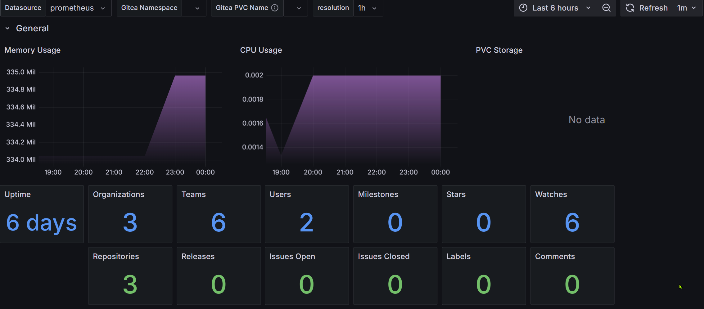

# **Gitea Stack**

## **Overview**

Gitea is a lightweight, self-hosted **Git service** that provides **source control, code collaboration, and repository management**. It is an alternative to GitHub, GitLab, and Bitbucket, optimized for efficiency and minimal resource usage.

Gitea is designed for ease of deployment and supports **pull requests, issue tracking, webhooks, CI/CD integrations, and a built-in package registry**.

**Official Website:** [Gitea Official Website](https://gitea.io/)

## **Role in the Lab**

Gitea serves as the **central repository** for lab-level **source control, automation, and infrastructure management**. It supports **GitOps workflows** and enables seamless collaboration for various lab services.

- **Lab-Level Repositories** – Manages code, documentation, and configurations for lab-wide services.
- **Portainer GitOps Integration** – Hosts Portainer stacks for automated deployments.
- **Ansible Playbooks Repository** – Stores playbooks for managing lab infrastructure.
- **Lab Configuration Management** – Provides version-controlled storage for lab-specific configurations.
- **GitHub Repository Mirror** – Syncs with external GitHub repositories for lab-related projects.
- **Database Backend:** Connects to **PostgreSQL on lab-db01** for persistent storage.
- **Metrics & Monitoring:** Publishes **performance metrics**, with dashboards available at:

## **Grafana Dashboard:**

[Grafana Gitea Monitoring Dashboard #17802](https://grafana.com/grafana/dashboards/17802-gitea-dashbaord/)



## **Stack Components**

- **`docker-compose.yml`** – Defines the Gitea service configuration, including versioning, ports, and volumes.
- **`stack.env.example`** – Provides a template for environment variables, containing example configurations.
- **`stack.env`** – Used for actual environment-specific configurations (Git ignored for security).
- **`README.md`** – Documentation for this stack.

## **Setup Instructions**

### **Deploy via Portainer (Recommended)**

1. Navigate to **Portainer → Stacks**.
2. Create a **new stack** and select **Git Repository**.
3. Enter the repository URL:

   ```
   https://gitea.beardinthe.cloud/Portainer_Stacks/gitea-stack.git
   ```

4. Deploy the stack.

### **Deploy via Docker Compose (Optional)**

1. **Clone the Repository:**

   ```bash
   git clone https://gitea.beardinthe.cloud/Portainer_Stacks/gitea-stack.git
   ```

2. **Navigate to the Gitea Stack Directory:**

   ```bash
   cd gitea-stack
   ```

3. **Prepare Environment Variables:**
   - Copy the example environment file:

     ```bash
     cp stack.env.example stack.env
     ```

   - Edit `stack.env` and configure required values such as:

     ```ini
     GITEA_ADMIN_USER=admin
     GITEA_ADMIN_PASSWORD=securepassword
     ```

4. **Deploy the Stack Using Docker Compose:**

   ```bash
   docker-compose up -d
   ```

5. **Access Gitea Web Interface:**
   - Open your browser and navigate to:

     ```
     http://localhost:3000
     ```

   - Log in using the credentials from `stack.env`.

## **Additional Resources**

- **Gitea Documentation:** [https://docs.gitea.io/](https://docs.gitea.io/)
- **Gitea Docker Hub:** [https://hub.docker.com/r/gitea/gitea](https://hub.docker.com/r/gitea/gitea)
- **Community Support:** [https://discourse.gitea.io/](https://discourse.gitea.io/)
