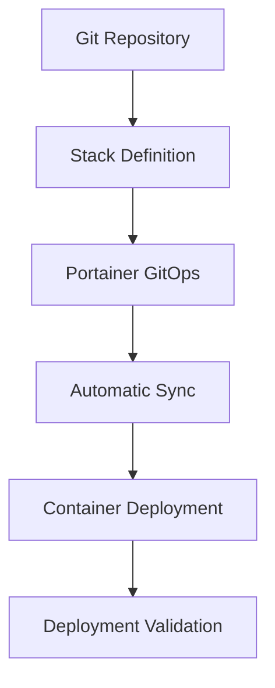

# **Portainer Implementation - Proxmox Astronomy Lab**

## **1. Overview**

The Proxmox Astronomy Lab uses **Portainer Business Edition** as the primary container management platform for all dockerized infrastructure services. This implementation provides a **centralized management interface** with **role-based access control**, **GitOps integration**, and **comprehensive monitoring** while remaining cost-effective through the free tier for small environments.

This document details the **Portainer architecture**, **node configuration**, **access control model**, and **operational procedures** used to manage containerized services across the lab.

### **1.1 Portainer Architecture**

The Portainer deployment follows a hub-and-spoke model:

- **Portainer Server** (hub) - Centralized management interface on lab-port01
- **Edge Agents** (spokes) - Remote agents on lab-apps01, lab-apps02, and lab-db01
- **Edge Communication** - Secure, encrypted communication between server and agents

This architecture provides **centralized control** while enabling **distributed container execution** across purpose-specific nodes.

---

## **2. Portainer Business Edition**

### **2.1 Business Edition Benefits**

The lab leverages Portainer Business Edition's free tier for small environments:

| **Feature** | **Implementation** | **Business Value** |
|------------|-------------------|------------------|
| **Role-Based Access Control** | Team-based access model | Granular security controls |
| **GitOps Integration** | Stack deployment from Git | Version-controlled configurations |
| **Activity Logging** | User actions and system events | Audit trail and compliance |
| **Edge Computing Management** | Centralized remote node control | Simplified administration |
| **Resource Controls** | Container-specific resource limits | Optimized resource allocation |
| **Registry Management** | Integration with Docker Hub | Streamlined image deployment |

### **2.2 Business Edition Licensing**

| **Aspect** | **Details** |
|-----------|------------|
| **License Type** | Business Edition (Free Tier) |
| **Node Limit** | Up to 5 nodes at no cost |
| **Features** | Full functionality (no limitations) |
| **Support** | Community support |
| **Upgrade Path** | Available if node count increases |

### **2.3 Version Information**

| **Component** | **Version** | **Release Date** |
|--------------|-----------|-----------------|
| **Portainer Server** | 2.19.4 CE | December 2024 |
| **Portainer Agent** | 2.19.4 CE | December 2024 |
| **Docker Engine** | 24.0.7 | October 2024 |

---

## **3. Portainer Nodes**

### **3.1 Control Node (lab-port01)**

The Portainer server runs on a dedicated VM to ensure management isolation:

| **Component** | **Specification** |
|--------------|-------------------|
| **Hostname** | lab-port01.beardinthe.cloud |
| **VM Resources** | 2 vCPU, 4GB RAM, 32GB storage |
| **Network** | VLAN10 (Control Plane) |
| **Host Node** | node01 |
| **Docker Version** | 24.0.7 |
| **Deployment Method** | Docker Compose |
| **Volume Configuration** | External volumes for data persistence |
| **Backup Strategy** | Daily volume snapshots |

For detailed configuration, see [**lab-port01 Documentation**](lab-port01/README.md).

### **3.2 Application Node 1 (lab-apps01)**

Primary application services node focusing on web-facing services:

| **Component** | **Specification** |
|--------------|-------------------|
| **Hostname** | lab-apps01.beardinthe.cloud |
| **VM Resources** | 4 vCPU, 16GB RAM, 32GB system + 250GB data |
| **Network** | VLAN10 (Control Plane) |
| **Host Node** | node02 |
| **Docker Version** | 24.0.7 |
| **Agent Type** | Edge Agent |
| **Main Services** | Web applications, API gateways, proxy services |
| **Container Count** | ~15 containers |

For detailed configuration and services, see [**lab-apps01 Documentation**](lab-apps01/README.md).

### **3.3 Application Node 2 (lab-apps02)**

Secondary application services node focusing on internal processing:

| **Component** | **Specification** |
|--------------|-------------------|
| **Hostname** | lab-apps02.beardinthe.cloud |
| **VM Resources** | 4 vCPU, 12GB RAM, 32GB system + 500GB data |
| **Network** | VLAN20 (Production) |
| **Host Node** | node04 |
| **Docker Version** | 24.0.7 |
| **Agent Type** | Edge Agent |
| **Main Services** | Backend processing, automation, scheduling |
| **Container Count** | ~10 containers |

For detailed configuration and services, see [**lab-apps02 Documentation**](lab-apps02/README.md).

### **3.4 Database Node (lab-db01)**

Dedicated database services node:

| **Component** | **Specification** |
|--------------|-------------------|
| **Hostname** | lab-db01.beardinthe.cloud |
| **VM Resources** | 2 vCPU, 4GB RAM, 32GB system + multiple data volumes |
| **Network** | VLAN10 (Control Plane) |
| **Host Node** | node03 |
| **Docker Version** | 24.0.7 |
| **Agent Type** | Edge Agent |
| **Main Services** | Database containers, caching services |
| **Container Count** | ~5 containers |

For detailed configuration and services, see [**lab-db01 Documentation**](lab-db01/README.md).

---

## **4. Access Control Model**

### **4.1 User Roles and Teams**

Portainer implements a role-based access control model:

| **Team** | **Access Level** | **Resource Scope** | **Members** |
|----------|----------------|-------------------|------------|
| **Administrators** | Full Control | All resources | Lab Owner |
| **Infrastructure Team** | Operator | All resources | Infrastructure Engineers |
| **Development Team** | Restricted Control | Development resources | Developers, Researchers |
| **Operations Team** | Operator | Production resources | Operations Staff |
| **Read-Only Users** | View Only | All resources | External Collaborators |

### **4.2 Role Definitions**

| **Role** | **Permissions** |
|----------|----------------|
| **Admin** | Full control of all resources |
| **Operator** | Deploy and manage containers, no endpoint configuration |
| **Restricted Control** | Limited to specific resources, cannot modify sensitive settings |
| **View Only** | Read-only access to dashboards and logs |

### **4.3 Access Control Integration**

| **Integration** | **Method** | **Authentication Flow** |
|----------------|----------|------------------------|
| **Entra ID** | OAuth 2.0 | SSO with Entra ID credentials |
| **RBAC Mapping** | Group-based | Entra ID groups mapped to Portainer teams |
| **Session Management** | Token-based | 12-hour session timeout |

---

## **5. GitOps Workflow**

### **5.1 Stack Deployment Process**

Portainer implements GitOps for container deployment:

### **5.2 Repository Structure**

| **Repository** | **Content** | **Branch Strategy** |
|---------------|-----------|---------------------|
| **infrastructure-stacks** | Core infrastructure stacks | main (production), dev (testing) |
| **application-stacks** | Application service stacks | main (production), dev (testing) |
| **database-stacks** | Database service stacks | main (production), dev (testing) |

### **5.3 GitOps Configuration**

| **Setting** | **Value** | **Purpose** |
|------------|----------|------------|
| **Automatic Updates** | Enabled | Continuous deployment from Git |
| **Update Interval** | 5 minutes | Frequency of repository checks |
| **Authentication** | Deploy key | Secure repository access |
| **Webhook Support** | Enabled | Immediate updates on commits |

---

## **6. Operational Aspects**

### **6.1 Monitoring and Logging**

| **Aspect** | **Implementation** | **Integration** |
|-----------|-------------------|----------------|
| **Container Logs** | Centralized in Portainer | Searchable through UI |
| **Resource Monitoring** | Built-in metrics | Dashboard visualization |
| **Event Logging** | Activity capture | Audit trail |
| **Alert Integration** | Webhook notifications | Integrated with monitoring stack |

### **6.2 Backup and Recovery**

| **Component** | **Backup Method** | **Frequency** | **Retention** |
|--------------|------------------|--------------|--------------|
| **Portainer Database** | Volume backup | Daily | 14 days |
| **Stack Definitions** | Git repository | Continuous | Unlimited |
| **Container Data** | Volume backups | Daily | Varies by importance |
| **Configuration** | Export to JSON | On change | Version controlled |

### **6.3 Update Procedures**

| **Component** | **Update Method** | **Frequency** | **Downtime** |
|--------------|------------------|--------------|-------------|
| **Portainer Server** | Scheduled maintenance | Quarterly | <15 minutes |
| **Portainer Agents** | Rolling updates | Quarterly | None |
| **Docker Engine** | Scheduled maintenance | Semi-annually | <30 minutes per node |

---

## **7. Container Network Architecture**

### **7.1 Network Types**

| **Network Type** | **Purpose** | **Implementation** |
|-----------------|------------|-------------------|
| **Bridge Networks** | Container isolation | Per-stack bridge networks |
| **Overlay Networks** | Cross-host communication | Swarm-mode overlay networks |
| **Macvlan Networks** | Direct network attachment | Infrastructure services |
| **Host Network** | High-performance services | Database containers |

### **7.2 Network Segmentation**

| **Segment** | **CIDR Range** | **Purpose** |
|------------|--------------|------------|
| **Infrastructure** | 172.18.0.0/16 | Core infrastructure services |
| **Applications** | 172.19.0.0/16 | Application services |
| **Databases** | 172.20.0.0/16 | Database services |
| **Isolated** | 172.21.0.0/16 | Security-sensitive services |

---

## **8. Security Configuration**

### **8.1 Container Security**

| **Security Measure** | **Implementation** | **Purpose** |
|---------------------|-------------------|------------|
| **Non-Root Users** | Custom user configurations | Principle of least privilege |
| **Read-Only Filesystems** | When possible | Prevent unauthorized modifications |
| **Capabilities Limiting** | Drop unnecessary capabilities | Reduce attack surface |
| **Health Checks** | Defined for all containers | Automated monitoring |

### **8.2 Portainer Security**

| **Security Measure** | **Implementation** | **Purpose** |
|---------------------|-------------------|------------|
| **TLS Encryption** | HTTPS with valid certificates | Secure communication |
| **Network Isolation** | Restricted access to Portainer UI | Limit exposure |
| **Authentication Policies** | Strong password enforcement | Prevent unauthorized access |
| **Session Timeouts** | 12-hour maximum | Limit session hijacking risk |

---

## **9. Documentation Sections**

Detailed documentation is available for each Portainer node:

- [**lab-port01 - Portainer Server**](lab-port01/README.md)
- [**lab-apps01 - Application Node 1**](lab-apps01/README.md)
- [**lab-apps02 - Application Node 2**](lab-apps02/README.md)
- [**lab-db01 - Database Node**](lab-db01/README.md)

---

## **10. Future Enhancements**

| **Enhancement** | **Description** | **Timeline** |
|----------------|----------------|-------------|
| **High Availability** | Redundant Portainer server setup | Q3 2025 |
| **Advanced Monitoring** | Enhanced container metrics | Q2 2025 |
| **Automated Testing** | Pre-deployment container validation | Q4 2025 |
| **Secrets Rotation** | Automated credential rotation | Q1 2026 |
| **Edge Computing Expansion** | Additional edge nodes | Ongoing |

---

## **✅ Approval & Review**

| **Reviewer** | **Role** | **Approval Date** | **Status** |
|-------------|---------|------------------|------------|
| VintageDon | Lead Engineer | 2025-03-08 | ✅ Approved |

---

## **📜 Change Log**

| **Version** | **Date** | **Changes** | **Author** |
|------------|---------|-------------|------------|
| 1.0 | 2025-03-08 | Initial documentation | VintageDon |
