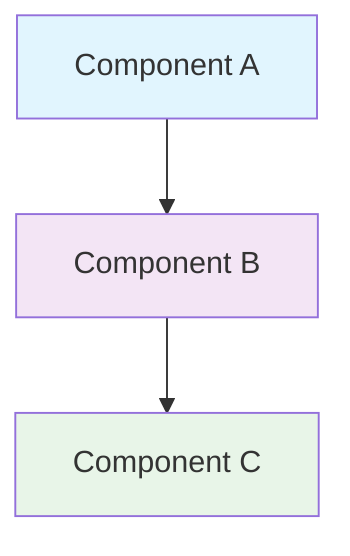

<!--
---
title: "[Document Title]"
description: "Brief, actionable description of what this document covers and its primary purpose"
author: "VintageDon - https://github.com/vintagedon"
ai_contributor: "[Full AI Model Name/Version]"
date: "YYYY-MM-DD"
version: "X.Y"
status: "[Draft/In-Review/Published/Archived]"
tags:
- type: [kb-article/how-to-guide/architecture-decision-record/policy/runbook/etc]
- domain: [infrastructure/kubernetes/security/ai-governance/gitops/etc]
- tech: [rke2/gitea/argocd/prometheus/ollama/etc]
- compliance: [cis-benchmark/nist-ai-rmf/iso-27001/etc]
- phase: [phase-0/phase-1/phase-2/phase-3/phase-4]
related_documents:
- "[Related Document 1](path/to/document.md)"
- "[Related Document 2](path/to/document.md)"
---
-->

# 📋 **[Document Title]**

This document provides [brief overview of what this document accomplishes]. It serves as [primary function description] within the Proxmox Astronomy Lab platform, addressing [specific problem or need] for [target users/systems].

# 🎯 **1. Introduction**

This section establishes the foundational context for this document, defining its boundaries, intended audience, and relationship to the broader enterprise astronomical computing ecosystem.

## **1.1 Purpose**

This subsection clearly articulates why this document exists and what specific value it delivers to the Proxmox Astronomy Lab platform and its users.

[2-3 sentences explaining the document's purpose, the problem it addresses, and the value it provides. Focus on outcomes and objectives.]

## **1.2 Scope**

This subsection defines the precise boundaries of what this document covers and explicitly states what falls outside its coverage area.

| **In Scope** | **Out of Scope** |
|--------------|------------------|
| [Specific items covered] | [Specific items NOT covered] |
| [Additional in-scope items] | [Additional out-of-scope items] |

[1-2 sentences explaining why this scope definition is important.]

## **1.3 Target Audience**

This subsection identifies who should use this document, their expected technical background, and how different roles might utilize the information.

**Primary Audience:** [Primary users and their roles]  
**Secondary Audience:** [Secondary users and their roles]  
**Required Background:** [Expected technical skills and knowledge]

## **1.4 Overview**

This subsection provides high-level context about the document's structure and its relationship to other Proxmox Astronomy Lab documentation.

[2-3 sentences providing context about the document's place in the ecosystem and what readers can expect.]

# 🔗 **2. Dependencies & Relationships**

This section maps how this document's subject matter integrates with other Proxmox Astronomy Lab components, establishing both upstream and downstream dependencies.

## **2.1 Related Services**

This subsection identifies other Proxmox Astronomy Lab services that interact with the subject of this document.

[Brief explanation of service relationships]

| **Service** | **Relationship Type** | **Integration Points** | **Documentation** |
|-------------|----------------------|------------------------|-------------------|
| [Service Name] | [Depends-on/Provides-to/Integrates-with] | [Brief integration description] | [Link to service doc] |

## **2.2 Policy Implementation**

This subsection connects this document to the Proxmox Astronomy Lab governance framework by identifying which organizational policies it implements or supports.

[Brief explanation of policy relationships]

- **[Policy Name](path/to/policy.md)** - [Brief description of implementation relationship]

## **2.3 Responsibility Matrix**

This subsection defines clear accountability for key activities related to this document.

| **Activity** | **Helpdesk** | **Operations** | **Engineering** | **Security** |
|--------------|--------------|----------------|-----------------|--------------|
| [Activity 1] | [R/A/C/I] | [R/A/C/I] | [R/A/C/I] | [R/A/C/I] |
| [Activity 2] | [R/A/C/I] | [R/A/C/I] | [R/A/C/I] | [R/A/C/I] |

*R: Responsible, A: Accountable, C: Consulted, I: Informed*

# ⚙️ **3. Technical Documentation**

This section provides the technical foundation necessary for understanding, implementing, and maintaining the subject matter.

**📝 GUIDANCE FOR SECTION 3:**
- **For Directory READMEs**: Focus on organization, structure, and relationships. Avoid detailed code examples.
- **For Implementation Guides**: Include necessary technical details, configuration examples, and procedures.
- **Keep concise**: Aim for clarity over comprehensiveness. Link to detailed implementation docs when needed.

## **3.1 Architecture & Design**

This subsection explains the technical architecture, component relationships, and design decisions.

**Note:** This section includes a simple chart to enhance understanding. Complex architectural diagrams should be referenced as separate documents.

[Concise technical overview with architectural patterns and design rationale. Include simple diagrams when they enhance understanding.]

## **3.2 Structure and Organization**

This subsection provides specific organization details, configuration parameters, or key structural elements.

[Focused description of structure, organization, or key technical elements. Use tables for categorization when helpful.]

| **Category** | **Description** | **Purpose** |
|--------------|-----------------|-------------|
| [Category 1] | [Brief description] | [Primary function] |
| [Category 2] | [Brief description] | [Primary function] |

## **3.3 Integration and Procedures**

This subsection provides systematic procedures or integration approaches relevant to the subject matter.

[Clear, step-by-step guidance or integration information. Keep procedures concise and focused on essential steps.]

# 🛠️ **4. Management & Operations**

This section covers operational procedures, monitoring approaches, and maintenance activities.

**📝 GUIDANCE FOR SECTION 4:**
- Focus on **what** needs to be managed, not **how** to implement it
- Describe operational patterns and responsibilities
- Keep maintenance procedures high-level unless this is an implementation guide

## **4.1 Lifecycle Management**

This subsection documents management approaches throughout the operational lifecycle.

[Description of key management activities and lifecycle phases. Focus on operational patterns rather than detailed procedures.]

## **4.2 Monitoring & Quality Assurance**

This subsection defines monitoring strategies and quality approaches.

**Monitoring Infrastructure:** All monitoring is handled by mon01, the centralized monitoring stack consisting of Prometheus (metrics), Loki (logs), Grafana (visualization), AlertManager (alerting), and Grafana Alloy (metrics/logging agent). Monitoring philosophy follows "if it can be collected, we do" approach with cluster-level monitoring from Proxmox to InfluxDB01 and VM-level monitoring via Alloy agents.

[Overview of monitoring approaches and quality assurance methods. Include key metrics or quality indicators when relevant.]

## **4.3 Maintenance and Optimization**

This subsection outlines systematic maintenance and optimization approaches.

[Description of maintenance patterns and optimization strategies. Focus on systematic approaches rather than detailed implementation.]

# 🔒 **5. Security & Compliance**

This section documents security controls and compliance alignment for enterprise-grade astronomical computing infrastructure.

**⚠️ SECURITY DISCLAIMER**

*The security implementations described in this document are part of ongoing baseline establishment and should not be considered production-ready specifications. Our team consists of research computing professionals, not dedicated security experts. All security measures are implemented as best-effort implementations based on industry standards. For production deployments requiring formal security validation, engage qualified security professionals for comprehensive review and approval.*

## **5.1 Security Controls**

This subsection documents specific security measures and their verification methods.

**Enterprise-grade security implementation guided by industry standards.** Security controls are implemented systematically across the 7-node hybrid Kubernetes and VM infrastructure to protect astronomical research data and computational resources while maintaining operational efficiency and compliance with research computing security requirements.

[Overview of security controls and protection mechanisms. Focus on what is protected and how verification occurs.]

## **5.2 CIS Controls Mapping**

This subsection provides explicit mapping to CIS Controls v8, documenting compliance status and implementation evidence.

**Baseline Standards:** CIS Controls v8, NIST AI Risk Management Framework  
**Framework:** NIST Cybersecurity Framework 2.0  
**Mapping to:** NIST SP 800-171

| **CIS Control** | **Implementation Status** | **Evidence Location** | **Assessment Date** |
|-----------------|--------------------------|----------------------|-------------------|
| [CIS.X.Y] | [Compliant/Partial/Planned] | [Evidence path/link] | [YYYY-MM-DD] |
| [Additional mappings specific to document subject] | [Status] | [Evidence] | [Date] |

## **5.3 Framework Compliance**

This subsection demonstrates how controls satisfy requirements across multiple compliance frameworks.

Cross-framework compliance approach aligns CIS Controls v8 with NIST CSF 2.0 and maps implementation evidence to NIST SP 800-171 requirements. This multi-framework strategy ensures comprehensive security coverage while maintaining research computing operational efficiency and scientific data accessibility requirements.

# 💾 **6. Backup & Recovery**

This section documents comprehensive data protection strategies and recovery processes across the 7-node Proxmox Astronomy Lab infrastructure.

## **6.1 Protection Strategy**

This subsection details backup approaches, schedules, and retention policies implemented across hybrid Kubernetes and VM infrastructure.

**Comprehensive Multi-Tier Backup Strategy:** The Proxmox Astronomy Lab implements enterprise-grade data protection across three distinct tiers: Proxmox-native VM backups, application-specific database backups, and Kubernetes persistent volume protection. All backup operations are monitored via mon01 with automated alerting for backup failures or retention policy violations.

| **Data Type** | **Backup Frequency** | **Retention** | **Recovery Objective** | **Method** |
|---------------|---------------------|---------------|----------------------|------------|
| **Proxmox VMs** | Daily 2:00 AM | 7 daily, 4 weekly, 6 monthly | RTO: 4 hours, RPO: 24 hours | Proxmox VE native backup |
| **PostgreSQL Databases** | Every 6 hours | 14 days + [Iperius if configured] | RTO: 1 hour, RPO: 6 hours | pg_dump + WAL archiving |
| **MongoDB Collections** | Daily 3:00 AM | 30 days | RTO: 2 hours, RPO: 24 hours | mongodump + gridfs |
| **Kubernetes PVs** | Daily via CSI snapshots | 14 days | RTO: 2 hours, RPO: 24 hours | Longhorn/local-path snapshots |
| **Configuration Files** | Git commit triggers | Unlimited (Git history) | RTO: 30 minutes, RPO: Real-time | Git repository sync |
| **Monitoring Data** | Weekly | 90 days (metrics), 30 days (logs) | RTO: 4 hours, RPO: 7 days | Prometheus/Loki native backup |

**Storage Infrastructure:** Primary backups stored on dedicated backup storage with secondary replication to geographically separated location. All backup data encrypted at rest using AES-256 encryption with keys managed through centralized key management system.

## **6.2 Recovery Procedures**

This subsection provides recovery processes for different failure scenarios across the hybrid infrastructure.

**Tiered Recovery Strategy:** Recovery procedures are organized by scope and urgency, from individual service restoration to full infrastructure rebuild. All recovery operations are documented with step-by-step procedures and tested quarterly during scheduled maintenance windows.

**Recovery Scenarios:**

- **Individual VM Recovery:** Proxmox VE restore from daily snapshots with automated integrity verification
- **Database Point-in-Time Recovery:** PostgreSQL WAL replay and MongoDB oplog recovery with transaction consistency validation  
- **Kubernetes Service Recovery:** PV snapshot restoration with pod recreation and service validation
- **Complete Site Recovery:** Infrastructure-as-Code deployment with automated service restoration and data synchronization
- **Configuration Rollback:** Git-based configuration management with automated rollback and validation testing

**Recovery Validation:** All recovery operations include automated validation testing to ensure data integrity, service functionality, and performance baseline compliance before declaring recovery complete.

# 📚 **7. References & Related Resources**

This section provides comprehensive links to related internal documentation and supporting resources.

## **7.1 Internal References**

| **Document Type** | **Document Title** | **Relationship** | **Link** |
|-------------------|-------------------|------------------|----------|
| [Type] | [Title] | [How it relates] | [Internal link] |
| [Additional internal documents] | [Title] | [Relationship] | [Link] |

# ✅ **8. Approval & Review**

This section documents the formal review and approval process.

## **8.1 Review Process**

[Brief description of review methodology and validation approach]

## **8.2 Approval Matrix**

| **Reviewer** | **Role/Expertise** | **Review Date** | **Approval Status** | **Comments** |
|-------------|-------------------|----------------|-------------------|--------------|
| [Name] | [Role/SME area] | [YYYY-MM-DD] | [Status] | [Review notes] |

# 📜 **9. Documentation Metadata**

This section provides comprehensive information about document creation, revision history, and authorship.

## **9.1 Change Log**

| **Version** | **Date** | **Changes** | **Author** | **Review Status** |
|------------|---------|-------------|------------|------------------|
| X.Y | YYYY-MM-DD | [Description of changes] | [Author] | [Status] |

## **9.2 Authorization & Review**

[Brief confirmation of human oversight and approval process]

## **9.3 Authorship Details**

**Human Author:** VintageDon (https://github.com/vintagedon)  
**AI Contributor:** [Full model designation]  
**Collaboration Method:** Request-Analyze-Verify-Generate-Validate (RAVGV)  
**Human Oversight:** [Description of human oversight approach]

## **9.4 AI Collaboration Disclosure**

This document was collaboratively developed using the Request-Analyze-Verify-Generate-Validate (RAVGV) methodology. [Brief description of AI involvement and human oversight]. All content has been thoroughly reviewed, validated, and approved by qualified human subject matter experts. The human author retains complete responsibility for accuracy, compliance, and technical correctness.

*Generated: [Date] | Human Author: VintageDon | AI Assistant: [Model] | Review Status: [Status] | Document Version: [X.Y]*

---

## **📋 Template Usage Guidelines**

### **⚠️ CRITICAL: Graceful Section Numbering**

**NEVER renumber sections to close gaps.** The knowledge base system requires consistent section numbering for RAG optimization. If a section is omitted, use graceful drop numbering:

- **Correct**: 1, 2, 3, 4, 6, 7, 8, 9 (Section 5 omitted, numbering preserved)
- **WRONG**: 1, 2, 3, 4, 5, 6, 7, 8 (Renumbered to close gap - BREAKS RAG SYSTEM)

**All documents MUST end on Section 9.4** - this is the standard termination point for the knowledge base.

### **Document Length Targets**
- **Directory READMEs**: 150-300 lines, focus on organization and relationships
- **Implementation Guides**: 300-600 lines, include necessary technical details
- **Policy Documents**: 200-400 lines, focus on requirements and compliance
- **Architecture Documents**: 400-800 lines, comprehensive technical coverage

### **Pre-Filled Static Content**

#### **Section 5: Security & Compliance**
- **Security Disclaimer**: Pre-filled with standard disclaimer about baseline establishment and non-production status
- **Framework Alignment**: Always uses CIS v8, NIST AI RMF baseline with NIST CSF 2.0 framework mapping to NIST SP 800-171
- **Only Variable Content**: Specific CIS control mappings in table format

#### **Section 6: Backup & Recovery**
- **Protection Strategy**: Complete multi-tier backup strategy pre-filled
- **Recovery Procedures**: Standard tiered recovery approach pre-filled
- **Only Variable Content**: Document-specific backup types or special considerations
- **Iperius Configuration**: Note in PostgreSQL backup entry if Iperius backup software is configured

#### **Section 4.2: Monitoring**
- **mon01 Stack**: Always references centralized monitoring with Prometheus, Loki, Grafana, AlertManager, Grafana Alloy
- **Philosophy**: "If it can be collected, we do" approach consistently applied

#### **Section 2.3: Responsibility Matrix**
- **Standard Four-Tier**: Helpdesk, Operations, Engineering, Security roles consistently used

### **Section 3 Guidance by Document Type**
- **Directory READMEs**: Focus on structure, organization, file types, relationships
- **How-to Guides**: Include step-by-step procedures and configuration examples
- **Architecture Docs**: Detailed technical specifications and design rationale
- **Policy Docs**: Requirements, controls, and compliance frameworks

### **Content Principles**
- **Clarity over Completeness**: Better to be clear and concise than comprehensive and confusing
- **Link Don't Repeat**: Reference detailed implementation docs rather than duplicating content
- **Focus on Purpose**: Stay aligned with the document's primary objective
- **Avoid Scope Creep**: Resist the urge to add "just a bit more detail"
- **Token Efficiency**: Static content prevents repetitive generation of standard sections

### **Quality Indicators**
- ✅ Document serves its stated purpose clearly
- ✅ Scope is well-defined and maintained
- ✅ Technical details are appropriate for document type
- ✅ Relationships to other documents are clear
- ✅ Length is appropriate for the content and audience
- ✅ Section numbering follows graceful drop rules
- ✅ Document terminates at Section 9.4
- ✅ Static content used where appropriate to maintain consistency