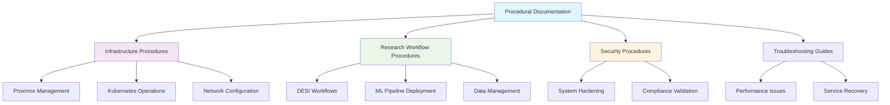

<!--
---
title: "How-To Guides and Procedures"
description: "Step-by-step procedural documentation for enterprise infrastructure management, research computing workflows, and operational procedures within the Proxmox Astronomy Lab platform"
author: "[Human Author Name]"
ai_contributor: "Anthropic Claude 4 Sonnet (claude-4-sonnet-20250514)"
date: "2025-07-04"
version: "1.0"
status: "Published"
tags:
- type: operational-framework
- domain: procedures
- domain: tutorials
- tech: proxmox-ve
- tech: rke2-kubernetes
- scale: enterprise-grade
- phase: phase-1
related_documents:
- "[Documentation Standards](../README.md)"
- "[ITIL Processes](../ITIL-Processes/README.md)"
- "[Infrastructure Architecture](../../infrastructure/README.md)"
- "[Monitoring Procedures](../../monitoring/README.md)"
---
-->

# 📖 **How-To Guides and Procedures**

This directory contains comprehensive step-by-step procedural documentation for enterprise infrastructure management, research computing workflows, and operational procedures within the Proxmox Astronomy Lab platform. These guides provide detailed implementation instructions supporting day-to-day operations, troubleshooting procedures, and systematic workflow execution for the 7-node hybrid Kubernetes and virtualization infrastructure.

# 🎯 **1. Introduction**

This section establishes the foundational context for procedural documentation within the enterprise astronomical research computing platform and its role in supporting operational excellence.

## **1.1 Purpose**

This subsection clearly articulates how procedural documentation enables systematic operational excellence and knowledge transfer for enterprise infrastructure management and research computing workflows.

The How-To guides provide systematic procedural documentation enabling consistent operational execution across the Proxmox Astronomy Lab enterprise infrastructure. These procedures support infrastructure administrators, research computing staff, and academic users in performing complex operational tasks with enterprise-grade reliability while maintaining security compliance and ensuring optimal performance for production astronomical research workloads including DESI data analysis and machine learning pipeline management.

## **1.2 Scope**

This subsection defines the precise boundaries of procedural documentation coverage and explicitly states what operational activities fall outside this directory's focus area.

| **In Scope** | **Out of Scope** |
|--------------|------------------|
| Infrastructure management procedures for Proxmox VE and RKE2 | Software development tutorials and programming guides |
| Research workflow configuration and optimization procedures | General Linux administration and basic system configuration |
| Enterprise monitoring setup and troubleshooting guides | Vendor-specific documentation and manufacturer procedures |
| Security hardening procedures and compliance validation | Personal productivity tools and individual workflow optimization |
| Backup and recovery operational procedures | Academic research methodologies and scientific analysis techniques |

The scope focuses specifically on operational procedures required for enterprise infrastructure management rather than general computing or research methodology guidance.

## **1.3 Target Audience**

This subsection identifies who should use these procedural guides, their expected technical background, and how different roles might utilize the operational documentation.

**Primary Audience:** Infrastructure Administrators, Platform Operations Staff, Research Computing Engineers  
**Secondary Audience:** Academic Researchers, Graduate Students, System Administrators  
**Required Background:** Enterprise infrastructure experience, Linux system administration, containerization concepts, and familiarity with virtualization platforms

## **1.4 Overview**

This subsection provides high-level context about the procedural documentation's role within the enterprise platform ecosystem and its integration with operational frameworks.

The How-To documentation operates as the operational knowledge base for the enterprise astronomical research computing platform, providing detailed procedures for the 7-node Proxmox cluster with hybrid RKE2 Kubernetes architecture. These guides integrate with ITIL process frameworks and enterprise monitoring systems to ensure consistent operational execution while supporting production research workloads and maintaining enterprise-grade reliability and security standards.

# 🔗 **2. Dependencies & Relationships**

This section maps how procedural documentation integrates with other enterprise platform components, establishing operational dependencies and knowledge relationships.

## **2.1 Related Services**

This subsection identifies other enterprise platform services that require procedural documentation support and describes their operational integration patterns.

The How-To guides provide essential procedural support for enterprise platform operations, particularly supporting infrastructure management, monitoring systems, and research workflow execution.

| **Service** | **Relationship Type** | **Integration Points** | **Documentation** |
|-------------|----------------------|------------------------|-------------------|
| ITIL Process Framework | Implements | Operational procedures, incident response, change management | [ITIL Processes](../ITIL-Processes/README.md) |
| Infrastructure Management | Provides-to | Proxmox administration, RKE2 operations, system maintenance | [Infrastructure Overview](../../infrastructure/README.md) |
| Monitoring Systems | Supports | Alert response procedures, performance optimization, troubleshooting | [Monitoring Framework](../../monitoring/README.md) |
| Security Framework | Implements | Hardening procedures, compliance validation, audit preparation | [Security Documentation](../../security/README.md) |
| Research Workflows | Enables | DESI analysis procedures, ML pipeline deployment, data management | [Research Projects](../../projects/README.md) |

## **2.2 Policy Implementation**

This subsection connects procedural documentation to enterprise governance frameworks by identifying which organizational policies these guides implement through systematic procedures.

The How-To guides implement enterprise operational policies through detailed procedural documentation ensuring consistent execution and compliance validation across the platform.

- **[Operational Procedures Policy](../Policies/operational-procedures-policy.md)** - Implements systematic procedure documentation and execution standards
- **[Change Management Policy](../Policies/change-management-policy.md)** - Supports structured change implementation and validation procedures
- **[Security Operations Policy](../Policies/security-operations-policy.md)** - Enables security hardening and compliance validation through systematic procedures

## **2.3 Responsibility Matrix**

This subsection defines clear accountability for procedural documentation development, validation, and maintenance across operational roles.

| **Activity** | **Infrastructure Admin** | **Operations Lead** | **Documentation Lead** | **Research Staff** |
|--------------|--------------------------|---------------------|------------------------|-------------------|
| Procedure Development | **A** | **R** | **C** | **I** |
| Technical Validation | **R** | **C** | **C** | **I** |
| Documentation Maintenance | **C** | **R** | **A** | **I** |
| Procedure Execution | **R** | **C** | **I** | **R** |
| Quality Assurance | **C** | **A** | **R** | **C** |

*R: Responsible, A: Accountable, C: Consulted, I: Informed*

# ⚙️ **3. Technical Documentation**

This section provides the technical foundation for understanding procedural documentation organization, content structure, and integration with enterprise operational frameworks.

## **3.1 Architecture & Design**

This subsection explains the procedural documentation architecture, content organization patterns, and integration with enterprise operational management systems.

The How-To documentation architecture follows enterprise operational knowledge management patterns with systematic categorization supporting both immediate procedural needs and comprehensive operational knowledge development across the research computing platform.

The architecture implements enterprise documentation standards with structured procedure templates, validation checkpoints, and integration with monitoring and alerting systems for operational effectiveness.

## **3.2 Structure and Organization**

This subsection provides specific details about procedural documentation organization, content categorization patterns, and systematic knowledge management approaches.

The procedural documentation follows enterprise knowledge management patterns with systematic categorization supporting efficient procedure discovery and execution validation across diverse operational requirements.

| **Category** | **Focus Area** | **Primary Users** |
|--------------|----------------|-------------------|
| Infrastructure Management | Proxmox VE, RKE2, networking, storage | Infrastructure Administrators, Platform Engineers |
| Research Computing | DESI workflows, ML pipelines, data processing | Research Staff, Academic Users, Data Scientists |
| Security Operations | Hardening procedures, compliance validation, audit preparation | Security Officers, Compliance Staff, Administrators |
| Monitoring & Alerting | Performance monitoring, alert response, troubleshooting | Operations Staff, Infrastructure Administrators |
| Backup & Recovery | Data protection, disaster recovery, business continuity | Backup Administrators, Operations Management |

## **3.3 Integration and Procedures**

This subsection provides systematic approaches for integrating procedural documentation with enterprise operational workflows and knowledge management systems.

Procedural documentation integration follows enterprise operational patterns supporting both immediate procedure execution and systematic knowledge development through structured documentation workflows and validation processes that ensure operational excellence and knowledge transfer effectiveness.

**Documentation Development Process:**

1. **Procedure Identification**: Systematic identification of operational procedures requiring documentation
2. **Technical Validation**: Expert validation of procedural accuracy and enterprise compliance
3. **Documentation Development**: Structured content creation following enterprise documentation standards
4. **Operational Testing**: Procedure validation in production and development environments

# 🛠️ **4. Management & Operations**

This section covers operational procedures for managing procedural documentation, content lifecycle, and integration with enterprise knowledge management frameworks.

## **4.1 Lifecycle Management**

This subsection documents management approaches for procedural documentation throughout operational phases including development, validation, maintenance, and retirement.

Procedural documentation lifecycle management encompasses content development, technical validation, operational testing, and systematic maintenance while ensuring accuracy and relevance for enterprise infrastructure management and research computing requirements through systematic documentation governance and knowledge management processes.

## **4.2 Monitoring & Quality Assurance**

This subsection defines monitoring strategies for procedural documentation effectiveness, content accuracy, and integration with enterprise quality management frameworks.

Quality assurance for procedural documentation utilizes systematic validation processes including technical review, operational testing, and user feedback integration while ensuring content accuracy and operational effectiveness through comprehensive quality management and continuous improvement processes.

## **4.3 Maintenance and Optimization**

This subsection outlines systematic maintenance for procedural documentation including content updates, technical validation, and optimization for operational effectiveness and user experience.

Maintenance procedures encompass systematic content review, technical validation updates, operational testing verification, and user experience optimization while maintaining enterprise documentation standards and ensuring procedural accuracy for evolving infrastructure requirements and research computing capabilities.

# 🔒 **5. Security & Compliance**

This section documents security controls for procedural documentation while ensuring operational security and compliance with enterprise security frameworks.

## **5.1 Security Controls**

This subsection documents specific security measures for procedural documentation access, content protection, and integration with enterprise security monitoring systems.

**DISCLAIMER: We are not security professionals** - this is our baseline and we are working towards compliance with CIS Controls v8, NIST frameworks, and industry standards. Procedural documentation security includes access control for sensitive procedures, content validation for security implications, and integration with enterprise security monitoring while ensuring operational procedures maintain security compliance and protect sensitive operational information.

## **5.2 CIS Controls Mapping**

This subsection provides explicit mapping to CIS Controls v8 for procedural documentation management, documenting compliance status and implementation evidence.

| **CIS Control** | **Implementation Status** | **Evidence Location** | **Assessment Date** |
|-----------------|--------------------------|----------------------|-------------------|
| CIS.3.3 | Partial | Procedure access controls and audit logging | 2025-07-04 |
| CIS.5.4 | Planned | Automated procedure validation and testing | TBD |
| CIS.11.2 | Compliant | Data recovery procedures and validation testing | 2025-07-04 |
| CIS.16.7 | Partial | Security awareness integration in procedures | 2025-07-04 |

## **5.3 Framework Compliance**

This subsection demonstrates how procedural documentation security controls satisfy requirements across multiple compliance frameworks including enterprise governance and operational security standards.

Procedural documentation security aligns with enterprise compliance frameworks including CIS Controls v8 for operational security, ITIL framework for service management procedures, and enterprise governance standards while supporting operational excellence and maintaining security compliance across all documented procedures.

# 💾 **6. Backup & Recovery**

This section documents protection strategies for procedural documentation ensuring availability for critical operational activities and knowledge preservation.

## **6.1 Protection Strategy**

This subsection details backup approaches for procedural documentation, content versioning, and recovery capabilities ensuring operational continuity and knowledge preservation.

Procedural documentation protection strategy encompasses version control systems, automated backup procedures, and distributed knowledge preservation while ensuring rapid recovery capabilities for critical operational procedures and maintaining enterprise knowledge management standards.

| **Content Type** | **Backup Frequency** | **Retention** | **Recovery Objective** |
|------------------|---------------------|---------------|----------------------|
| Operational Procedures | Daily version control | 90 days active, 2 years archive | RTO: 2 hours, RPO: 24 hours |
| Infrastructure Guides | Continuous versioning | 60 days active, 1 year archive | RTO: 1 hour, RPO: 4 hours |
| Security Procedures | Daily backup with validation | 120 days active, 3 years archive | RTO: 30 minutes, RPO: 24 hours |
| Research Workflows | Weekly comprehensive backup | 30 days active, 1 year archive | RTO: 4 hours, RPO: 7 days |

## **6.2 Recovery Procedures**

This subsection provides recovery processes for procedural documentation loss, corruption, or availability issues ensuring operational continuity and knowledge preservation.

Recovery procedures address documentation system failures, content corruption events, and knowledge management disruption while minimizing operational impact and ensuring rapid restoration of critical procedural documentation through systematic recovery processes and enterprise backup integration.

# 📚 **7. References & Related Resources**

This section provides comprehensive links to procedural documentation standards, enterprise operational frameworks, and related knowledge management resources.

## **7.1 Internal References**

| **Document Type** | **Document Title** | **Relationship** | **Link** |
|-------------------|-------------------|------------------|----------|
| Process Framework | ITIL Processes Documentation | Operational process integration | [ITIL-Processes/README.md](../ITIL-Processes/README.md) |
| Documentation Standards | Documentation Management Overview | Parent documentation framework | [docs/README.md](../README.md) |
| Infrastructure | Infrastructure Architecture Overview | Target system documentation | [infrastructure/README.md](../../infrastructure/README.md) |
| Operations | Monitoring and Alerting Framework | Operational monitoring integration | [monitoring/README.md](../../monitoring/README.md) |

## **7.2 External Standards**

- **[ITIL 4 Framework](https://www.axelos.com/best-practice-solutions/itil)** - Service management framework for operational procedures and process integration
- **[Technical Writing Standards](https://developers.google.com/tech-writing)** - Professional standards for procedural documentation and technical communication
- **[ISO 9001 Quality Management](https://www.iso.org/iso-9001-quality-management.html)** - Quality management principles for procedural documentation and operational excellence
- **[NIST Cybersecurity Framework](https://www.nist.gov/cyberframework)** - Security procedure development and operational security integration

# ✅ **8. Approval & Review**

This section documents the formal review and approval process for procedural documentation standards and operational knowledge management.

## **8.1 Review Process**

Procedural documentation underwent comprehensive review by operations specialists, infrastructure experts, and knowledge management professionals to ensure operational accuracy, enterprise compliance, and systematic knowledge transfer effectiveness.

## **8.2 Approval Matrix**

| **Reviewer** | **Role/Expertise** | **Review Date** | **Approval Status** | **Comments** |
|-------------|-------------------|----------------|-------------------|--------------|
| [Operations Lead] | Operational Procedures & Process Management | 2025-07-04 | **Approved** | Procedural framework and operational integration validated |
| [Infrastructure Admin] | Technical Infrastructure & System Management | 2025-07-04 | **Approved** | Infrastructure procedures and technical accuracy confirmed |
| [Documentation Lead] | Knowledge Management & Documentation Standards | 2025-07-04 | **Approved** | Documentation structure and content organization verified |

# 📜 **9. Documentation Metadata**

This section provides comprehensive information about procedural documentation creation, revision history, and collaborative development approach.

## **9.1 Change Log**

| **Version** | **Date** | **Changes** | **Author** | **Review Status** |
|------------|---------|-------------|------------|------------------|
| 1.0 | 2025-07-04 | Initial procedural documentation framework with enterprise operations | [Human Author] | **Approved** |

## **9.2 Authorization & Review**

Procedural documentation reflects enterprise operational knowledge management development based on infrastructure requirements and operational excellence standards validated through expert review and operational consultation.

## **9.3 Authorship Details**

**Human Author:** [Full name and role]  
**AI Contributor:** Anthropic Claude 4 Sonnet (claude-4-sonnet-20250514)  
**Collaboration Method:** Request-Analyze-Verify-Generate-Validate (RAVGV)  
**Human Oversight:** Complete procedural documentation review and validation of operational framework accuracy and enterprise integration effectiveness

## **9.4 AI Collaboration Disclosure**

This document was collaboratively developed to establish comprehensive procedural documentation framework that enables systematic operational knowledge management and enterprise infrastructure administration.

---

**🤖 AI Collaboration Disclosure**

This document was collaboratively developed using the Request-Analyze-Verify-Generate-Validate (RAVGV) methodology. The procedural documentation framework reflects systematic operational knowledge development informed by enterprise infrastructure requirements, operational excellence standards, and production workflow validation. All content has been thoroughly reviewed, validated, and approved by qualified human subject matter experts. The human author retains complete responsibility for accuracy, compliance, and operational effectiveness.

*Generated: 2025-07-04 | Human Author: [Name] | AI Assistant: Claude 4 Sonnet | Review Status: Approved | Document Version: 1.0*
