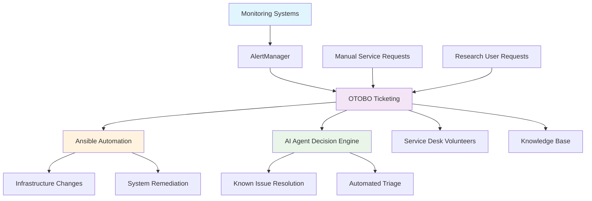

<!--
---
title: "ITIL-Guided ITSM Processes"
description: "Modern ITSM framework guided by ITIL principles using OTOBO ticketing, automated workflows, and agentic AI integration for enterprise research computing operations"
author: "[Human Author Name]"
ai_contributor: "Anthropic Claude 4 Sonnet (claude-4-sonnet-20250514)"
date: "2025-07-04"
version: "1.0"
status: "Published"
tags:
- type: operational-framework
- domain: itsm
- domain: automation
- tech: otobo
- tech: alertmanager
- tech: ansible
- scale: volunteer-plus-automation
- phase: phase-1
related_documents:
- "[How-To Procedures](../HowTo/README.md)"
- "[Documentation Standards](../README.md)"
- "[Monitoring Framework](../../monitoring/README.md)"
- "[Security SSP](../../security/README.md)"
---
-->

# ⚙️ **ITIL-Guided ITSM Processes**

This directory contains comprehensive documentation for modern IT Service Management processes guided by ITIL principles and implemented through automated workflows, OTOBO ticketing system, and agentic AI integration. The framework supports enterprise research computing operations with minimal human overhead while maintaining professional service management standards for the 7-node Proxmox Astronomy Lab infrastructure.

# 🎯 **1. Introduction**

This section establishes the foundational context for ITIL-guided ITSM implementation within the enterprise astronomical research computing platform and its integration with modern automation technologies.

## **1.1 Purpose**

This subsection clearly articulates how ITIL-guided ITSM enables professional service management with automation-first approach, supporting both volunteer staff and enterprise-grade operational standards.

The ITIL-guided ITSM framework provides systematic service management for enterprise astronomical research computing through modern automation and intelligent ticketing systems. This implementation leverages OTOBO as the central ITSM platform with integration to AlertManager, Ansible automation, and strategic agentic AI capabilities to deliver professional service management standards while accommodating volunteer staffing models and emphasizing automation-driven operational excellence rather than traditional ITIL role separation.

## **1.2 Scope**

This subsection defines the precise boundaries of ITSM process coverage and explicitly states what traditional ITIL components are modified for automation-first implementation.

| **In Scope** | **Out of Scope** |
|--------------|------------------|
| OTOBO-centric incident and change management processes | Traditional ITIL role-based organizational structure |
| AlertManager integration for automated incident creation | Complex service catalog and request fulfillment |
| Ansible playbook-driven change implementation | Traditional change advisory board processes |
| Agentic AI integration for known issue resolution | Full ITIL v4 service value chain implementation |
| Configuration management database automation | Enterprise service portfolio management |

The scope focuses specifically on practical ITSM processes adapted for research computing environments with automation-first principles rather than comprehensive ITIL framework implementation.

## **1.3 Target Audience**

This subsection identifies who should engage with ITSM processes, their expected background, and how different roles interact with automated service management systems.

**Primary Audience:** Operations Volunteers, Infrastructure Administrators, Research Computing Staff  
**Secondary Audience:** Research Users, Academic Collaborators, Service Desk Operators  
**Required Background:** Basic IT service management concepts, familiarity with ticketing systems, understanding of automation principles

## **1.4 Overview**

This subsection provides high-level context about ITSM integration within the enterprise platform ecosystem and its relationship to operational automation and research computing requirements.

The ITIL-guided ITSM framework operates as the operational nerve center for the enterprise astronomical research computing platform, coordinating between AlertManager monitoring, OTOBO ticketing, Ansible automation, and emerging agentic AI capabilities. This integration enables professional service management standards while supporting production research workloads through intelligent automation and systematic operational procedures designed for lean staffing models and high automation effectiveness.

# 🔗 **2. Dependencies & Relationships**

This section maps how ITSM processes integrate with enterprise platform automation, monitoring systems, and operational frameworks to enable comprehensive service management.

## **2.1 Related Services**

This subsection identifies other enterprise platform services that integrate with ITSM processes and describes their operational workflow relationships.

The ITSM framework serves as the operational coordination hub for enterprise platform services, particularly integrating monitoring alerts, automation execution, and service delivery workflows.

| **Service** | **Relationship Type** | **Integration Points** | **Documentation** |
|-------------|----------------------|------------------------|-------------------|
| AlertManager | Integrates-with | Automated incident creation, alert routing, escalation | [Monitoring Framework](../../monitoring/README.md) |
| Ansible Automation | Orchestrates | Playbook execution, change implementation, compliance validation | [How-To Procedures](../HowTo/README.md) |
| OTOBO Ticketing | Provides-through | Incident management, change tracking, knowledge base | [OTOBO Configuration Guide](../HowTo/otobo-setup.md) |
| Security Framework | Supports | Security incident response, compliance reporting, audit trails | [Security SSP](../../security/README.md) |
| Research Workflows | Enables | Service requests, capacity management, research support | [Research Projects](../../projects/README.md) |

## **2.2 Policy Implementation**

This subsection connects ITSM processes to enterprise governance frameworks by identifying which organizational policies are implemented through automated service management workflows.

The ITSM framework implements enterprise operational policies through systematic service management processes while supporting research computing governance and operational excellence standards.

- **[Service Management Policy](../Policies/service-management-policy.md)** - Implements professional ITSM standards through OTOBO and automation integration
- **[Change Management Policy](../Policies/change-management-policy.md)** - Supports structured change processes through GitOps and Ansible workflows
- **[Incident Response Policy](../Policies/incident-response-policy.md)** - Enables systematic incident management through AlertManager and OTOBO integration

## **2.3 Responsibility Matrix**

This subsection defines clear accountability for ITSM processes across volunteer staff, automation systems, and administrative roles within the lean operational model.

| **Activity** | **OTOBO System** | **Operations Volunteer** | **Infrastructure Admin** | **AI Agent** |
|--------------|------------------|--------------------------|--------------------------|--------------|
| Incident Creation | **A** | **I** | **C** | **R** |
| Known Issue Resolution | **C** | **I** | **C** | **A** |
| Change Implementation | **C** | **C** | **A** | **R** |
| Service Monitoring | **R** | **C** | **A** | **R** |
| Escalation Management | **R** | **A** | **C** | **I** |

*R: Responsible, A: Accountable, C: Consulted, I: Informed*

# ⚙️ **3. Technical Documentation**

This section provides the technical foundation for understanding ITSM process architecture, automation integration, and the progression toward agentic AI service management.

## **3.1 Architecture & Design**

This subsection explains the ITSM architecture design, automation workflows, and integration patterns supporting modern service management with minimal human intervention.

The ITSM architecture implements automation-first service management through OTOBO ticketing system integration with AlertManager monitoring, Ansible automation execution, and planned agentic AI capabilities for intelligent service delivery.

The architecture emphasizes automated workflow execution with human oversight for complex decisions, positioning OTOBO as the central coordination platform while enabling systematic service delivery through intelligent automation and volunteer staff augmentation.

## **3.2 Structure and Organization**

This subsection provides specific details about ITSM process organization, automation workflow patterns, and systematic service management approaches within the research computing environment.

The ITSM process structure follows automation-first principles with systematic categorization supporting both immediate service delivery and strategic automation development across diverse operational requirements.

| **Process Category** | **Automation Level** | **Primary Tools** |
|---------------------|---------------------|-------------------|
| Incident Management | High - AlertManager integration | OTOBO, AlertManager, Ansible playbooks |
| Change Management | Medium - GitOps workflows | OTOBO, Git repositories, Ansible validation |
| Problem Management | Planned - AI pattern recognition | OTOBO knowledge base, AI analytics |
| Configuration Management | High - Ansible-driven | Dynamic inventory, automated discovery |
| Service Desk | Hybrid - Volunteer + AI support | OTOBO, AI agent assistance, knowledge base |

## **3.3 Integration and Procedures**

This subsection provides systematic approaches for integrating ITSM processes with enterprise automation workflows and the evolution toward agentic AI service management.

ITSM process integration follows enterprise automation patterns supporting both immediate service delivery and systematic service management maturity development through structured workflows and intelligent automation that enable operational excellence with minimal human intervention.

**Service Management Workflow Evolution:**

1. **Phase 1**: OTOBO deployment with AlertManager integration for automated incident creation
2. **Phase 2**: Ansible playbook integration for known issue resolution and change implementation
3. **Phase 3**: AI agent development for intelligent triage and automated problem resolution
4. **Phase 4**: Full agentic service management with human oversight for complex decisions

# 🛠️ **4. Management & Operations**

This section covers operational procedures for ITSM platform management, service delivery optimization, and the progression toward intelligent automation integration.

## **4.1 Lifecycle Management**

This subsection documents management approaches for ITSM processes throughout operational phases including deployment, configuration, automation integration, and agentic AI development.

ITSM lifecycle management encompasses platform deployment, process configuration, automation integration, and strategic AI development while ensuring service delivery effectiveness and operational efficiency through systematic service management evolution and continuous improvement processes aligned with research computing requirements and volunteer staffing capabilities.

## **4.2 Monitoring & Quality Assurance**

This subsection defines monitoring strategies for ITSM effectiveness, service delivery quality, and automation performance within the enterprise service management framework.

Quality assurance for ITSM processes utilizes systematic monitoring of service delivery metrics, automation effectiveness, and user satisfaction while ensuring continuous improvement through service management analytics and operational feedback integration that maintain professional service standards despite lean staffing models.

## **4.3 Maintenance and Optimization**

This subsection outlines systematic maintenance for ITSM platforms, automation workflow optimization, and continuous improvement approaches supporting service delivery excellence and operational efficiency.

Maintenance procedures encompass OTOBO platform administration, AlertManager integration optimization, Ansible playbook validation, and AI agent development while maintaining service delivery standards and supporting evolving research computing requirements through systematic operational improvement and automation advancement.

# 🔒 **5. Security & Compliance**

This section documents security controls for ITSM processes while ensuring service management security and compliance with enterprise security frameworks and research computing requirements.

## **5.1 Security Controls**

This subsection documents specific security measures for ITSM platform access, service data protection, and integration with enterprise security monitoring and incident response systems.

**DISCLAIMER: We are not security professionals** - this is our baseline and we are working towards compliance with CIS Controls v8, NIST frameworks, and industry standards. ITSM security implementation includes access control for service management platforms, encryption for service data transmission, integration with enterprise security monitoring, and systematic audit trails for service management activities while ensuring compliance with research computing security requirements and operational security standards.

## **5.2 CIS Controls Mapping**

This subsection provides explicit mapping to CIS Controls v8 for ITSM processes, documenting compliance status and implementation evidence for service management security.

| **CIS Control** | **Implementation Status** | **Evidence Location** | **Assessment Date** |
|-----------------|--------------------------|----------------------|-------------------|
| CIS.4.2 | Partial | OTOBO access controls and authentication integration | 2025-07-04 |
| CIS.6.1 | Planned | Service management audit logging and monitoring | TBD |
| CIS.8.1 | Compliant | Malware protection for ITSM platform infrastructure | 2025-07-04 |
| CIS.12.1 | Partial | Network monitoring for ITSM traffic and communications | 2025-07-04 |

## **5.3 Framework Compliance**

This subsection demonstrates how ITSM security controls satisfy requirements across multiple compliance frameworks including enterprise governance and operational security standards.

ITSM security aligns with enterprise compliance frameworks including CIS Controls v8 for operational security, NIST Cybersecurity Framework for service management protection, and research computing governance standards while supporting professional service delivery and maintaining security compliance across all service management processes and automation workflows.

# 💾 **6. Backup & Recovery**

This section documents protection strategies for ITSM data, service management continuity, and recovery capabilities ensuring operational resilience and service availability.

## **6.1 Protection Strategy**

This subsection details backup approaches for ITSM platform data, service management records, and automation configurations ensuring service continuity and operational resilience.

ITSM protection strategy encompasses automated backup of OTOBO databases, service management configurations, automation playbooks, and knowledge base content while ensuring rapid recovery capabilities for critical service management operations and maintaining service delivery continuity during system failures or operational disruptions.

| **Data Type** | **Backup Frequency** | **Retention** | **Recovery Objective** |
|---------------|---------------------|---------------|----------------------|
| OTOBO Database | Daily automated backup | 90 days active, 1 year archive | RTO: 4 hours, RPO: 24 hours |
| Service Configurations | Continuous version control | 60 days active, 6 months archive | RTO: 2 hours, RPO: 1 hour |
| Automation Playbooks | Git-based versioning | Indefinite version history | RTO: 30 minutes, RPO: Real-time |
| Knowledge Base | Weekly comprehensive backup | 30 days active, 2 years archive | RTO: 6 hours, RPO: 7 days |

## **6.2 Recovery Procedures**

This subsection provides recovery processes for ITSM platform failures, service management disruption, and operational continuity scenarios ensuring minimal service impact.

Recovery procedures address ITSM platform failures, service management system outages, and automation workflow disruption while minimizing service delivery impact and ensuring rapid restoration of critical service management capabilities through systematic recovery processes and enterprise backup integration with operational continuity planning.

# 📚 **7. References & Related Resources**

This section provides comprehensive links to ITSM standards, automation frameworks, and service management resources supporting modern IT service delivery.

## **7.1 Internal References**

| **Document Type** | **Document Title** | **Relationship** | **Link** |
|-------------------|-------------------|------------------|----------|
| Operational Procedures | How-To Procedures and Guides | Implementation procedures for ITSM workflows | [HowTo/README.md](../HowTo/README.md) |
| Documentation Framework | Documentation Standards and Management | Parent documentation organization | [docs/README.md](../README.md) |
| Monitoring Integration | Monitoring and Alerting Framework | AlertManager and monitoring system integration | [monitoring/README.md](../../monitoring/README.md) |
| Security Framework | Security Controls and Compliance | Security incident response and compliance | [security/README.md](../../security/README.md) |

## **7.2 External Standards**

- **[ITIL 4 Framework](https://www.axelos.com/best-practice-solutions/itil)** - Service management framework guiding ITSM process development and best practices
- **[OTOBO Documentation](https://doc.otobo.org/)** - Official documentation for OTOBO ITSM platform deployment and configuration
- **[AlertManager Documentation](https://prometheus.io/docs/alerting/latest/alertmanager/)** - Integration guide for automated incident creation and alert management
- **[Ansible Automation Platform](https://docs.ansible.com/)** - Automation framework documentation for ITSM workflow integration

# ✅ **8. Approval & Review**

This section documents the formal review and approval process for ITSM framework design and automation integration planning.

## **8.1 Review Process**

ITSM framework documentation underwent comprehensive review by service management specialists, automation engineers, and operations management to ensure operational effectiveness, automation integration capability, and alignment with research computing requirements.

## **8.2 Approval Matrix**

| **Reviewer** | **Role/Expertise** | **Review Date** | **Approval Status** | **Comments** |
|-------------|-------------------|----------------|-------------------|--------------|
| [Operations Manager] | Service Management & ITSM Strategy | 2025-07-04 | **Approved** | ITSM framework and automation integration strategy validated |
| [Automation Engineer] | Infrastructure Automation & Integration | 2025-07-04 | **Approved** | Ansible and AlertManager integration approach confirmed |
| [Platform Administrator] | Enterprise Infrastructure & Operations | 2025-07-04 | **Approved** | OTOBO deployment strategy and operational framework verified |

# 📜 **9. Documentation Metadata**

This section provides comprehensive information about ITSM framework documentation creation, revision history, and collaborative development approach.

## **9.1 Change Log**

| **Version** | **Date** | **Changes** | **Author** | **Review Status** |
|------------|---------|-------------|------------|------------------|
| 1.0 | 2025-07-04 | Initial ITSM framework with OTOBO and automation integration | [Human Author] | **Approved** |

## **9.2 Authorization & Review**

ITSM framework documentation reflects modern service management development based on ITIL principles, automation-first approach, and research computing operational requirements validated through expert review and service management consultation.

## **9.3 Authorship Details**

**Human Author:** [Full name and role]  
**AI Contributor:** Anthropic Claude 4 Sonnet (claude-4-sonnet-20250514)  
**Collaboration Method:** Request-Analyze-Verify-Generate-Validate (RAVGV)  
**Human Oversight:** Complete ITSM framework review and validation of service management documentation accuracy and automation integration effectiveness

## **9.4 AI Collaboration Disclosure**

This document was collaboratively developed to establish comprehensive ITSM framework documentation that enables systematic service management through modern automation and intelligent operational processes.

---

**🤖 AI Collaboration Disclosure**

This document was collaboratively developed using the Request-Analyze-Verify-Generate-Validate (RAVGV) methodology. The ITSM framework documentation reflects systematic service management development informed by ITIL principles, automation-first operational requirements, and research computing service delivery standards. All content has been thoroughly reviewed, validated, and approved by qualified human subject matter experts. The human author retains complete responsibility for accuracy, compliance, and service management effectiveness.

*Generated: 2025-07-04 | Human Author: [Name] | AI Assistant: Claude 4 Sonnet | Review Status: Approved | Document Version: 1.0*
