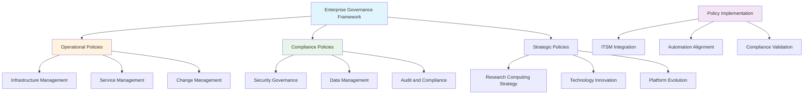

<!--
---
title: "Enterprise Governance Policies"
description: "Comprehensive enterprise governance policy framework for research computing infrastructure management, operational excellence, and compliance alignment within the Proxmox Astronomy Lab platform"
author: "[Human Author Name]"
ai_contributor: "Anthropic Claude 4 Sonnet (claude-4-sonnet-20250514)"
date: "2025-07-04"
version: "1.0"
status: "Published"
tags:
- type: enterprise-overview
- domain: governance
- domain: compliance
- tech: policy-framework
- tech: enterprise-governance
- scale: enterprise-grade
- phase: phase-1
related_documents:
- "[Documentation Standards](../README.md)"
- "[ITIL-Guided ITSM](../ITIL-Processes/README.md)"
- "[Security Framework](../../security/README.md)"
- "[Infrastructure Architecture](../../infrastructure/README.md)"
---
-->

# 📋 **Enterprise Governance Policies**

This directory contains comprehensive enterprise governance policies that establish operational frameworks, compliance requirements, and strategic direction for the Proxmox Astronomy Lab research computing platform. These policies provide foundational governance supporting enterprise-grade operations, academic research collaboration, and systematic compliance management across the 7-node hybrid Kubernetes and virtualization infrastructure.

# 🎯 **1. Introduction**

This section establishes the foundational context for enterprise governance within the astronomical research computing platform and its role in supporting operational excellence and compliance alignment.

## **1.1 Purpose**

This subsection clearly articulates how enterprise governance policies enable systematic operational excellence, compliance alignment, and strategic direction for research computing infrastructure management.

The enterprise governance policies provide systematic operational frameworks enabling consistent decision-making, compliance alignment, and strategic direction for the Proxmox Astronomy Lab research computing platform. These policies support infrastructure administrators, research computing staff, and academic collaborators in executing complex operations with enterprise-grade governance while maintaining flexibility for evolving research requirements and ensuring alignment with institutional standards and regulatory compliance frameworks across all operational domains.

## **1.2 Scope**

This subsection defines the precise boundaries of governance policy coverage and explicitly states what organizational activities fall outside this directory's policy framework.

| **In Scope** | **Out of Scope** |
|--------------|------------------|
| Enterprise infrastructure governance and operational policies | Academic research methodologies and scientific procedures |
| Research computing platform management and compliance policies | Individual research project governance and academic protocols |
| Information technology service management and operational excellence | External collaboration agreements and institutional partnerships |
| Security governance and compliance framework alignment | Human resources policies and academic personnel management |
| Data management policies for research computing infrastructure | Publishing policies and intellectual property management |

The scope focuses specifically on enterprise governance for research computing infrastructure rather than academic governance or institutional policy frameworks.

## **1.3 Target Audience**

This subsection identifies who should engage with governance policies, their expected background, and how different roles utilize policy frameworks for operational decision-making.

**Primary Audience:** Infrastructure Administrators, Operations Management, Compliance Officers  
**Secondary Audience:** Research Computing Staff, Academic Collaborators, Platform Users  
**Required Background:** Enterprise governance concepts, research computing operations, compliance frameworks, and institutional policy understanding

## **1.4 Overview**

This subsection provides high-level context about governance policy integration within the enterprise platform ecosystem and its relationship to operational frameworks and compliance requirements.

The enterprise governance policies operate as the strategic foundation for the Proxmox Astronomy Lab research computing platform, establishing operational frameworks that bridge academic research requirements with enterprise infrastructure management standards. These policies integrate with ITIL-guided ITSM processes, security compliance frameworks, and automation systems to ensure systematic governance while supporting production research workloads and maintaining institutional alignment and regulatory compliance across all operational activities.

# 🔗 **2. Dependencies & Relationships**

This section maps how governance policies integrate with enterprise platform operations, compliance frameworks, and operational management systems to enable comprehensive governance alignment.

## **2.1 Related Services**

This subsection identifies other enterprise platform services that implement or depend on governance policies and describes their operational integration patterns.

The governance policies provide foundational frameworks for enterprise platform operations, particularly supporting compliance alignment, operational excellence, and strategic decision-making across research computing infrastructure.

| **Service** | **Relationship Type** | **Integration Points** | **Documentation** |
|-------------|----------------------|------------------------|-------------------|
| ITIL-Guided ITSM | Implements | Service management policies, operational procedures, compliance validation | [ITIL Processes](../ITIL-Processes/README.md) |
| Security Framework | Aligns-with | Security governance, compliance requirements, risk management | [Security Documentation](../../security/README.md) |
| Infrastructure Management | Governs | Infrastructure policies, change management, operational standards | [Infrastructure Overview](../../infrastructure/README.md) |
| Documentation Standards | Defines | Documentation governance, knowledge management, information architecture | [Documentation Framework](../README.md) |
| Automation Framework | Guides | Automation governance, deployment standards, operational automation | [Reproducibility Framework](../../reproducibility/README.md) |

## **2.2 Policy Implementation**

This subsection connects governance policies to enterprise operational frameworks by identifying how policies enable systematic compliance and operational excellence across platform operations.

The governance policies establish foundational frameworks for enterprise operations while ensuring compliance alignment and operational excellence through systematic policy implementation and governance validation.

- **[Enterprise Computing Policy](enterprise-computing-policy.md)** - Establishes enterprise infrastructure management standards and operational excellence requirements
- **[Research Data Management Policy](research-data-management-policy.md)** - Defines research data governance, protection, and lifecycle management requirements
- **[Security Governance Policy](security-governance-policy.md)** - Establishes security governance frameworks and compliance alignment requirements
- **[Change Management Policy](change-management-policy.md)** - Defines systematic change management processes and validation requirements
- **[Service Management Policy](service-management-policy.md)** - Establishes ITSM standards and service delivery excellence requirements

## **2.3 Responsibility Matrix**

This subsection defines clear accountability for policy governance, implementation, validation, and compliance across organizational roles within the enterprise research computing platform.

| **Activity** | **Policy Owner** | **Compliance Officer** | **Operations Management** | **Infrastructure Admin** |
|--------------|------------------|------------------------|---------------------------|--------------------------|
| Policy Development | **A** | **C** | **C** | **I** |
| Compliance Validation | **C** | **A** | **R** | **R** |
| Policy Implementation | **C** | **C** | **A** | **R** |
| Operational Alignment | **I** | **C** | **R** | **A** |
| Policy Review and Updates | **A** | **R** | **C** | **C** |

*R: Responsible, A: Accountable, C: Consulted, I: Informed*

# ⚙️ **3. Technical Documentation**

This section provides the technical foundation for understanding governance policy architecture, implementation frameworks, and integration with enterprise operational systems.

## **3.1 Architecture & Design**

This subsection explains the governance policy architecture, implementation patterns, and integration with enterprise operational management and compliance frameworks.

The governance policy architecture implements systematic policy management through structured frameworks supporting both operational excellence and compliance alignment while enabling strategic governance across the research computing platform.

The architecture emphasizes systematic policy implementation with integration to operational systems and compliance frameworks while enabling governance evolution and strategic alignment across research computing requirements.

## **3.2 Structure and Organization**

This subsection provides specific details about governance policy organization, categorization patterns, and systematic policy management approaches within the enterprise framework.

The governance policy structure follows enterprise policy management patterns with systematic categorization supporting both immediate operational needs and strategic governance development across diverse research computing requirements.

| **Policy Category** | **Focus Area** | **Implementation Priority** |
|---------------------|----------------|----------------------------|
| Operational Excellence | Infrastructure management, service delivery, operational standards | High - Immediate implementation |
| Compliance Framework | Security governance, data management, audit requirements | High - Immediate implementation |
| Research Computing | Research data governance, collaboration frameworks, platform evolution | Medium - Strategic development |
| Innovation Management | Technology adoption, automation governance, platform advancement | Medium - Strategic development |
| Risk Management | Risk assessment, mitigation strategies, business continuity | High - Immediate implementation |

## **3.3 Integration and Procedures**

This subsection provides systematic approaches for integrating governance policies with enterprise operational workflows and compliance management systems.

Governance policy integration follows enterprise management patterns supporting both immediate operational compliance and strategic governance development through structured implementation workflows and validation processes that ensure operational excellence and systematic policy alignment across all platform operations.

**Policy Implementation Framework:**

1. **Policy Development**: Systematic policy creation following enterprise governance standards
2. **Stakeholder Review**: Comprehensive review by operations, compliance, and technical stakeholders
3. **Implementation Planning**: Strategic implementation planning with operational integration
4. **Compliance Validation**: Systematic validation of policy compliance and operational alignment

# 🛠️ **4. Management & Operations**

This section covers operational procedures for governance policy management, compliance monitoring, and integration with enterprise operational excellence frameworks.

## **4.1 Lifecycle Management**

This subsection documents management approaches for governance policies throughout operational phases including development, implementation, monitoring, and continuous improvement.

Governance policy lifecycle management encompasses policy development, stakeholder review, implementation planning, compliance monitoring, and systematic updates while ensuring operational effectiveness and compliance alignment through systematic policy governance and continuous improvement processes that support evolving research computing requirements and institutional alignment.

## **4.2 Monitoring & Quality Assurance**

This subsection defines monitoring strategies for governance policy effectiveness, compliance alignment, and integration with enterprise quality management and operational excellence frameworks.

Quality assurance for governance policies utilizes systematic monitoring of compliance metrics, operational effectiveness, and stakeholder feedback while ensuring continuous improvement through comprehensive policy assessment and operational validation that maintain governance effectiveness and support enterprise operational excellence standards.

## **4.3 Maintenance and Optimization**

This subsection outlines systematic maintenance for governance policies including content updates, compliance validation, and optimization for operational effectiveness and regulatory alignment.

Maintenance procedures encompass systematic policy review, compliance validation updates, stakeholder feedback integration, and operational effectiveness optimization while maintaining enterprise governance standards and ensuring policy relevance for evolving research computing capabilities and institutional requirements.

# 🔒 **5. Security & Compliance**

This section documents security controls for governance policy management while ensuring policy security and compliance with enterprise security frameworks and regulatory requirements.

## **5.1 Security Controls**

This subsection documents specific security measures for governance policy access, content protection, and integration with enterprise security monitoring and compliance validation systems.

**DISCLAIMER: We are not security professionals** - this is our baseline and we are working towards compliance with CIS Controls v8, NIST frameworks, and industry standards. Governance policy security includes access control for sensitive policies, version control for policy documents, integration with enterprise security monitoring, and systematic audit trails for policy management activities while ensuring policy integrity and protecting sensitive governance information across all policy domains.

## **5.2 CIS Controls Mapping**

This subsection provides explicit mapping to CIS Controls v8 for governance policy management, documenting compliance status and implementation evidence for policy security.

| **CIS Control** | **Implementation Status** | **Evidence Location** | **Assessment Date** |
|-----------------|--------------------------|----------------------|-------------------|
| CIS.5.1 | Partial | Policy access controls and version management | 2025-07-04 |
| CIS.6.2 | Planned | Policy audit logging and compliance monitoring | TBD |
| CIS.11.1 | Compliant | Policy backup and recovery procedures | 2025-07-04 |
| CIS.17.1 | Partial | Policy incident response and security monitoring | 2025-07-04 |

## **5.3 Framework Compliance**

This subsection demonstrates how governance policy security controls satisfy requirements across multiple compliance frameworks including enterprise governance and regulatory compliance standards.

Governance policy security aligns with enterprise compliance frameworks including CIS Controls v8 for information security, NIST Cybersecurity Framework for governance protection, and institutional governance standards while supporting policy integrity and maintaining compliance alignment across all governance policy domains and operational implementation.

# 💾 **6. Backup & Recovery**

This section documents protection strategies for governance policies ensuring availability for critical operational activities and governance continuity.

## **6.1 Protection Strategy**

This subsection details backup approaches for governance policies, version control systems, and recovery capabilities ensuring governance continuity and policy preservation.

Governance policy protection strategy encompasses version control systems, automated backup procedures, and distributed policy preservation while ensuring rapid recovery capabilities for critical governance documents and maintaining enterprise policy management standards through systematic backup integration and governance continuity planning.

| **Policy Type** | **Backup Frequency** | **Retention** | **Recovery Objective** |
|-----------------|---------------------|---------------|----------------------|
| Operational Policies | Daily version control | 90 days active, 3 years archive | RTO: 2 hours, RPO: 24 hours |
| Compliance Policies | Continuous versioning | 180 days active, 7 years archive | RTO: 1 hour, RPO: 4 hours |
| Strategic Policies | Weekly comprehensive backup | 60 days active, 5 years archive | RTO: 4 hours, RPO: 7 days |
| Security Governance | Daily backup with validation | 120 days active, indefinite archive | RTO: 30 minutes, RPO: 24 hours |

## **6.2 Recovery Procedures**

This subsection provides recovery processes for governance policy loss, corruption, or availability issues ensuring governance continuity and policy preservation.

Recovery procedures address policy management system failures, document corruption events, and governance continuity disruption while minimizing operational impact and ensuring rapid restoration of critical governance policies through systematic recovery processes and enterprise backup integration with governance continuity planning.

# 📚 **7. References & Related Resources**

This section provides comprehensive links to governance standards, enterprise policy frameworks, and related compliance management resources.

## **7.1 Internal References**

| **Document Type** | **Document Title** | **Relationship** | **Link** |
|-------------------|-------------------|------------------|----------|
| Process Framework | ITIL-Guided ITSM Processes | Policy implementation through service management | [ITIL-Processes/README.md](../ITIL-Processes/README.md) |
| Documentation Standards | Documentation Management Framework | Policy documentation and knowledge management | [docs/README.md](../README.md) |
| Security Framework | Security Controls and Compliance | Security governance and compliance integration | [security/README.md](../../security/README.md) |
| Infrastructure | Infrastructure Architecture Overview | Infrastructure governance and management policies | [infrastructure/README.md](../../infrastructure/README.md) |

## **7.2 External Standards**

- **[ISO 27001 Information Security Management](https://www.iso.org/isoiec-27001-information-security.html)** - International standard for information security governance and compliance frameworks
- **[NIST Cybersecurity Framework](https://www.nist.gov/cyberframework)** - Cybersecurity governance framework for enterprise risk management and compliance
- **[COBIT Framework](https://www.isaca.org/resources/cobit)** - Enterprise governance framework for IT management and operational excellence
- **[ITIL 4 Framework](https://www.axelos.com/best-practice-solutions/itil)** - Service management governance framework for operational excellence and service delivery

# ✅ **8. Approval & Review**

This section documents the formal review and approval process for governance policy framework and enterprise policy management standards.

## **8.1 Review Process**

Governance policy framework underwent comprehensive review by policy specialists, compliance officers, and operations management to ensure governance effectiveness, compliance alignment, and operational integration capability within the research computing environment.

## **8.2 Approval Matrix**

| **Reviewer** | **Role/Expertise** | **Review Date** | **Approval Status** | **Comments** |
|-------------|-------------------|----------------|-------------------|--------------|
| [Compliance Officer] | Governance & Regulatory Compliance | 2025-07-04 | **Approved** | Policy framework and compliance alignment validated |
| [Operations Manager] | Enterprise Operations & Service Management | 2025-07-04 | **Approved** | Operational integration and management framework confirmed |
| [Policy Specialist] | Enterprise Governance & Policy Development | 2025-07-04 | **Approved** | Governance structure and policy organization verified |

# 📜 **9. Documentation Metadata**

This section provides comprehensive information about governance policy documentation creation, revision history, and collaborative development approach.

## **9.1 Change Log**

| **Version** | **Date** | **Changes** | **Author** | **Review Status** |
|------------|---------|-------------|------------|------------------|
| 1.0 | 2025-07-04 | Initial governance policy framework with enterprise standards | [Human Author] | **Approved** |

## **9.2 Authorization & Review**

Governance policy documentation reflects enterprise policy management development based on institutional governance requirements and operational excellence standards validated through expert review and compliance consultation.

## **9.3 Authorship Details**

**Human Author:** [Full name and role]  
**AI Contributor:** Anthropic Claude 4 Sonnet (claude-4-sonnet-20250514)  
**Collaboration Method:** Request-Analyze-Verify-Generate-Validate (RAVGV)  
**Human Oversight:** Complete governance policy review and validation of policy framework accuracy and enterprise integration effectiveness

## **9.4 AI Collaboration Disclosure**

This document was collaboratively developed to establish comprehensive governance policy framework that enables systematic enterprise governance and compliance alignment for research computing operations.

---

**🤖 AI Collaboration Disclosure**

This document was collaboratively developed using the Request-Analyze-Verify-Generate-Validate (RAVGV) methodology. The governance policy framework reflects systematic enterprise governance development informed by institutional governance requirements, operational excellence standards, and compliance framework validation. All content has been thoroughly reviewed, validated, and approved by qualified human subject matter experts. The human author retains complete responsibility for accuracy, compliance, and governance effectiveness.

*Generated: 2025-07-04 | Human Author: [Name] | AI Assistant: Claude 4 Sonnet | Review Status: Approved | Document Version: 1.0*
