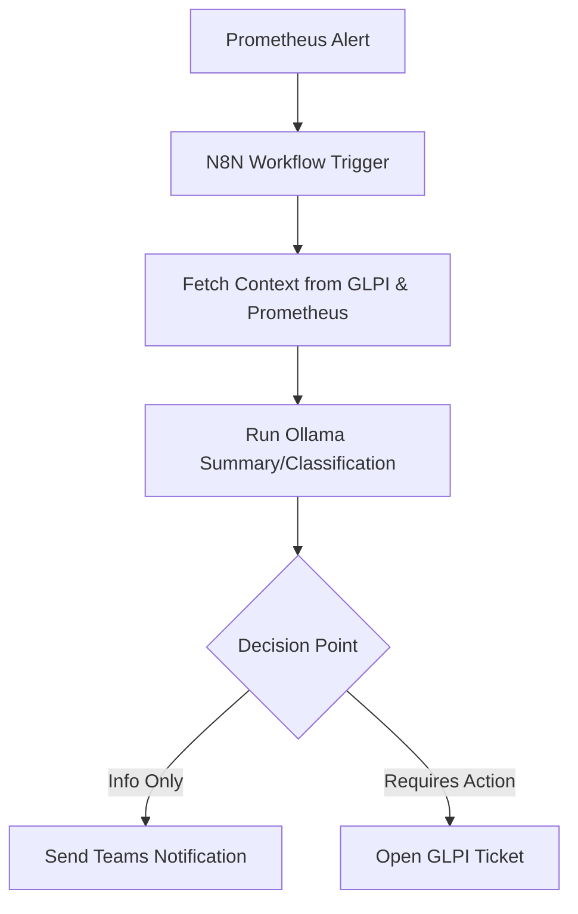
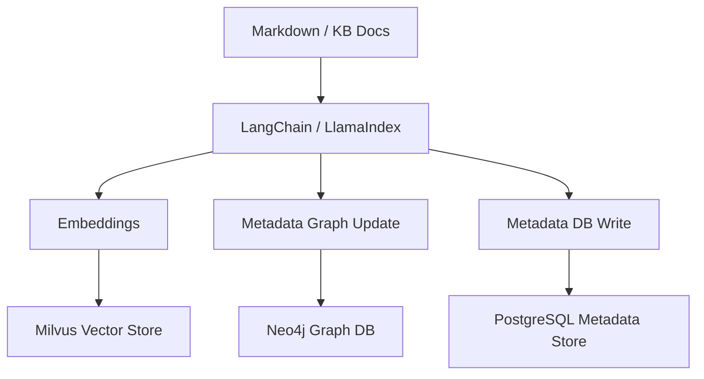
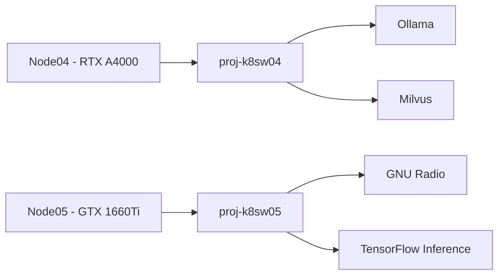
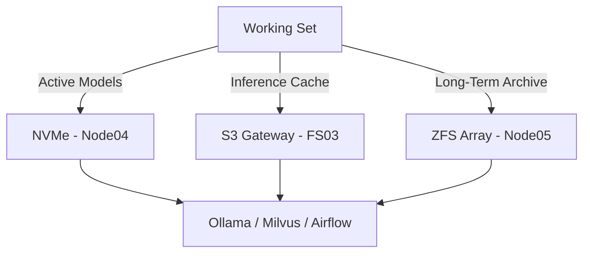

# **AI & Automation Architecture for Proxmox Astronomy Lab**

## **1. Overview**

This document outlines the end-to-end AI and automation architecture of the Proxmox Astronomy Lab, designed to support:

- **Structured RAG (Retrieval-Augmented Generation)** using vector, graph, and structured metadata stores
- **GPU-accelerated LLMs and signal processing workloads**
- **Event-driven task automation** using N8N across observability, ticketing, and infrastructure domains

The architecture is optimized for on-prem operation, security, and full observability—powered by a hybrid Proxmox + Kubernetes backbone.

---

## **2. Infrastructure Context**

This section describes the core physical hardware supporting the lab's AI/ML stack, including node roles and special hardware features like GPUs and NVMe.

| **Node** | **Role** | **Key Hardware** |
|---------|----------|------------------|
| Node01-03 | Proxmox quorum + K8s Mgmt | 64GB RAM, 2TB NVMe, 2.5G NICs |
| Node04 | AI/ML workloads, GPU host | 128GB RAM, 4TB NVMe, RTX A4000, dual 10G NICs |
| Node05 | Storage backbone + PoC GPU | 128GB RAM, ZFS RAID10 (8x8TB HDDs), NVMe SLOG, GTX 1660Ti |

All nodes participate in the RKE2 cluster. GPU passthrough is enabled for Nodes 04 and 05.

---

## **3. Core AI Services**

This layer powers vector search, metadata indexing, and graph-based document context. These services enable knowledge-driven workflows.

| **Component** | **Deployment** | **Affinity** | **Storage** |
|---------------|----------------|--------------|-------------|
| **Ollama** | RKE2 StatefulSet | `proj-k8sw04` | Node04 NVMe |
| **Milvus** | RKE2 StatefulSet | `proj-k8sw04` | NVMe + S3 (FS03) |
| **Neo4j** | Portainer (proj-apps01) | N/A | Local disk |
| **PostgreSQL Metadata** | `proj-pg01` VM | Node04 | Local NVMe |

These components form the semantic + graph + structured substrate for document intelligence and RAG.

---

## **4. Orchestration & Task Automation**

Describes automation infrastructure that connects observability, inference, and ticketing. N8N is central for event-driven flows.

| **Component** | **Role** | **Integrated With** |
|---------------|----------|---------------------|
| **N8N** | Event-driven automation orchestrator | Prometheus, GLPI, Ollama |
| **Airflow** | Batch and DAG-style pipeline runner | TimescaleDB, S3, ML workflows |
| **RabbitMQ** | Async messaging backbone | N8N, Airflow, LLM tools |

N8N is the primary interface layer between alerts, events, inference, and ITSM systems.

---

## **5. LLM & Development Interfaces**

Interactive components and UI frontends used by developers, researchers, or systems engineers to access LLMs and dashboards.

| **Interface** | **Purpose** | **Access** |
|---------------|-------------|------------|
| **OpenWebUI** | End-user LLM interface | Ingress route (Traefik) |
| **JupyterHub** | Interactive ML development | Ingress route |
| **Streamlit** | AI dashboarding / demos | Reverse proxied |

Ollama is abstracted behind all frontends, optionally with routing based on use case (e.g. summarization, structured prompts, RAG).

---

## **6. GPU Strategy**

Covers the role and configuration of GPU resources, including primary inference hosts and scheduling logic.

### 6.1 **Node04 – A4000 (Primary GPU Host)**

- Dedicated to LLM inference, embedding generation
- Runs Ollama, Milvus, and optionally TensorFlow Serving

### 6.2 **Node05 – GTX 1660Ti (PoC + SDR Workloads)**

- Used for early GPU scheduling validation
- Targets GNU Radio, preprocessing, inferencing of lightweight models

### 6.3 **Multi-GPU Orchestration Plan**

- `nvidia-device-plugin` deployed to expose resources per node
- GPU affinity labels applied for scheduling precision
- Exploration of NVIDIA MPS for fine-grained sharing planned

---

## **7. Storage Architecture**

Describes the lab’s multi-tiered storage model, designed for speed, durability, and archival suitability.

### **Tiered Model**

| **Tier** | **Purpose** | **Backed By** |
|----------|-------------|---------------|
| Tier 1 | Active model/data workloads | Local NVMe (Node04) |
| Tier 2 | Research artifacts, checkpoints | S3 Gateway (FS03) |
| Tier 3 | Long-term archive, snapshots | ZFS + NVMe SLOG (Node05) |

Data placement is aligned to IO profiles and backup policies.

---

## **8. AI Toolchain**

Breakdown of the open-source and custom software that forms the AI/ML, RAG, and SDR ecosystem.

### 8.1 **RAG + Document Intelligence**

- **LangChain / LlamaIndex** for semantic pipelines
- **Milvus** for embedding search
- **Neo4j** for graph-based context linkage
- **PostgreSQL** for structured metadata and lineage

### 8.2 **Signal Processing & ML**

- **GNU Radio** for SDR pipeline
- **SigMF** for metadata format standardization
- **TimescaleDB** for time-series ingestion (proj-pgts01)

### 8.3 **Interfaces & Services**

- **FastAPI** for LLM-based services
- **Streamlit** for data exploration dashboards
- **Grafana** for observability overlays

### 8.4 **Visual Workflow Diagrams**

This section provides diagrams that depict how core systems interact, from alert flows to document processing to GPU mapping.

#### **Event-Driven Automation**



#### **RAG Document Intelligence Stack**



#### **GPU Resource Affinity**



#### **Storage Tiering Overview**



---

## **9. Example Workflows**

This section highlights example pipelines that combine alerting, automation, LLMs, and signal classification.

### 9.1 **Alert-Driven Automation (N8N + LLM)**

```text
[Prometheus Alert] → [N8N Flow] → [Ollama Summary] → [GLPI Ticket/Teams Message]
```

### 9.2 **SDR Processing Pipeline**

```text
[RF Capture] → [GNU Radio (GPU)] → [Signal Classification] → [TimescaleDB + PostgreSQL]
```

### 9.3 **Knowledge Embedding & Query**

```text
[New Markdown or KB] → [LangChain Embed] → [Milvus + Neo4j] → [LLM RAG Assistant]
```

---

## **10. Governance & Security**

Covers the governance controls, security boundaries, and audit structures supporting the AI architecture.

| **Control Area** | **Implementation** |
|------------------|--------------------|
| **Access Control** | All LLM endpoints are internal-only; N8N runs with scoped service accounts |
| **Audit & Logging** | Prometheus exporters, GPU metrics, and LLM activity tracked via Grafana |
| **Data Governance** | Vector data encrypted at rest; backups to ZFS + S3 tiered store |

---


## 🔗 Related Documents

- [`docs/AI-ML-overview.md`](./AI-ML-overview.md)
- [`docs/data-pipelines.md`](./data-pipelines.md)
- [`docs/observatory-projects/hydrogen-line-hvc.md`](./observatory-projects/hydrogen-line-hvc.md)
- [`docs/azure-tagging-strategy.md`](./azure-tagging-strategy.md)
