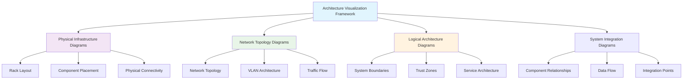

<!--
---
title: "Hardware Architecture Diagrams"
description: "Visual documentation and architectural diagrams for the Proxmox Astronomy Lab enterprise infrastructure including network topology, physical layout, and system interconnection diagrams"
author: "[Human Author Name]"
ai_contributor: "Anthropic Claude 4 Sonnet (claude-4-sonnet-20250514)"
date: "2025-07-04"
version: "1.0"
status: "Published"
tags:
- type: operational-framework
- domain: visualization
- domain: architecture-diagrams
- tech: network-topology
- tech: mermaid-diagrams
- scale: 7-node-cluster
- phase: phase-1
related_documents:
- "[Hardware Inventory](../README.md)"
- "[Hardware Benchmarks](../benchmarks/README.md)"
- "[Infrastructure Architecture](../../infrastructure/README.md)"
- "[Network Configuration](../../infrastructure/k8s/README.md)"
---
-->

# 📐 **Hardware Architecture Diagrams**

This directory contains comprehensive visual documentation and architectural diagrams for the Proxmox Astronomy Lab enterprise infrastructure. These diagrams provide clear visual representation of network topology, physical system layout, component interconnections, and architectural relationships supporting infrastructure understanding, operational planning, and systematic troubleshooting across the 7-node hybrid Kubernetes and virtualization cluster.

# 🎯 **1. Introduction**

This section establishes the foundational context for hardware architecture visualization within the enterprise astronomical research computing platform and its role in supporting operational excellence.

## **1.1 Purpose**

This subsection clearly articulates how architecture diagrams enable systematic infrastructure understanding, operational planning, and communication of complex technical relationships for enterprise research computing management.

The hardware architecture diagrams provide systematic visual documentation enabling comprehensive infrastructure understanding, operational planning, and technical communication for the Proxmox Astronomy Lab enterprise platform. These diagrams support infrastructure administrators, research computing staff, and academic collaborators in understanding complex system relationships while enabling effective troubleshooting, capacity planning, and operational decision-making for production astronomical research workloads requiring clear architectural visualization and systematic infrastructure comprehension.

## **1.2 Scope**

This subsection defines the precise boundaries of architectural diagram coverage and explicitly states what visualization activities fall outside this directory's focus area.

| **In Scope** | **Out of Scope** |
|--------------|------------------|
| Physical infrastructure layout and component placement | Software architecture and application flow diagrams |
| Network topology and connectivity visualization | Database schema and data relationship diagrams |
| Hardware component relationships and system interconnections | User interface wireframes and application mockups |
| Rack elevation and data center layout diagrams | Process flow and workflow visualization |
| Power distribution and cooling architecture visualization | Monitoring dashboards and operational interface design |

The scope focuses specifically on physical and logical infrastructure visualization rather than software architecture or operational interface design activities.

## **1.3 Target Audience**

This subsection identifies who should utilize architecture diagrams, their expected background, and how different roles leverage visual documentation for operational decision-making and system understanding.

**Primary Audience:** Infrastructure Administrators, Network Engineers, System Architects  
**Secondary Audience:** Research Computing Staff, Academic Collaborators, Operations Management  
**Required Background:** Infrastructure architecture concepts, network topology understanding, enterprise system design, and technical diagram interpretation skills

## **1.4 Overview**

This subsection provides high-level context about architecture diagram integration within the enterprise platform ecosystem and its relationship to operational documentation and system management.

The hardware architecture diagrams operate as the visual foundation for infrastructure understanding within the Proxmox Astronomy Lab enterprise platform, providing comprehensive visualization of system relationships across physical hardware, network connectivity, and logical architecture boundaries. These diagrams integrate with operational documentation and monitoring systems to ensure systematic infrastructure comprehension while supporting production research workloads and enabling effective operational planning and troubleshooting activities.

# 🔗 **2. Dependencies & Relationships**

This section maps how architecture diagrams integrate with enterprise infrastructure documentation, operational systems, and management frameworks to enable comprehensive visual understanding.

## **2.1 Related Services**

This subsection identifies other enterprise platform services that depend on or contribute to architecture visualization and describes their documentation integration patterns.

The architecture diagrams provide foundational visual documentation for enterprise platform operations, particularly supporting infrastructure understanding, operational planning, and technical communication across complex system relationships.

| **Service** | **Relationship Type** | **Integration Points** | **Documentation** |
|-------------|----------------------|------------------------|-------------------|
| Hardware Inventory | Visualizes | Physical component relationships, system interconnections | [Hardware Inventory](../README.md) |
| Network Infrastructure | Documents | Network topology, connectivity patterns, traffic flows | [Infrastructure Networking](../../infrastructure/README.md) |
| Performance Benchmarking | Illustrates | Performance validation context, component relationships | [Hardware Benchmarks](../benchmarks/README.md) |
| Monitoring Systems | Supports | System monitoring context, component identification | [Monitoring Framework](../../monitoring/README.md) |
| Security Framework | Visualizes | Security boundaries, trust zones, access control points | [Security Documentation](../../security/README.md) |

## **2.2 Policy Implementation**

This subsection connects architecture diagrams to enterprise governance frameworks by identifying which organizational policies require visual documentation and architectural transparency.

The architecture diagrams implement enterprise operational policies through systematic visual documentation ensuring architectural transparency and operational understanding across the research computing platform.

- **[Documentation Standards Policy](../../docs/Policies/documentation-standards-policy.md)** - Implements visual documentation requirements and architectural transparency standards
- **[Infrastructure Governance Policy](../../docs/Policies/infrastructure-governance-policy.md)** - Supports infrastructure understanding and operational transparency requirements
- **[Change Management Policy](../../docs/Policies/change-management-policy.md)** - Enables impact assessment and planning through architectural visualization

## **2.3 Responsibility Matrix**

This subsection defines clear accountability for architecture diagram development, maintenance, and operational integration across infrastructure management roles.

| **Activity** | **Infrastructure Architect** | **Network Engineer** | **Documentation Lead** | **Operations Team** |
|--------------|------------------------------|---------------------|------------------------|---------------------|
| Diagram Development | **A** | **R** | **C** | **I** |
| Technical Validation | **R** | **A** | **C** | **C** |
| Documentation Maintenance | **C** | **C** | **A** | **R** |
| Operational Integration | **C** | **R** | **I** | **A** |
| Visual Standards | **R** | **C** | **A** | **I** |

*R: Responsible, A: Accountable, C: Consulted, I: Informed*

# ⚙️ **3. Technical Documentation**

This section provides the technical foundation for understanding architecture diagram organization, visualization methodologies, and integration with enterprise documentation systems.

## **3.1 Architecture & Design**

This subsection explains the diagram architecture approach, visualization standards, and systematic approaches for documenting complex infrastructure relationships through visual documentation.

The architecture diagram framework implements systematic visualization methodologies enabling comprehensive infrastructure understanding through standardized diagramming approaches and enterprise-grade documentation integration supporting operational excellence.

The architecture emphasizes standardized visualization methodologies with systematic documentation integration enabling comprehensive infrastructure understanding and operational planning across complex enterprise research computing environments.

## **3.2 Structure and Organization**

This subsection provides specific details about diagram organization, categorization patterns, and systematic visual documentation approaches within the enterprise infrastructure framework.

The architecture diagram structure follows enterprise documentation patterns with systematic categorization supporting both immediate infrastructure understanding and strategic operational planning across diverse visualization requirements.

| **Diagram Category** | **Primary Focus** | **Update Frequency** |
|---------------------|-------------------|---------------------|
| Physical Infrastructure | Hardware layout, component placement, rack elevation | Quarterly or with hardware changes |
| Network Topology | Network connectivity, VLAN architecture, traffic flows | Monthly or with network changes |
| Logical Architecture | System boundaries, service relationships, security zones | Bi-weekly or with architectural changes |
| Integration Diagrams | Component relationships, data flows, operational interfaces | Weekly or with service changes |
| Troubleshooting Aids | Diagnostic flows, component identification, operational guides | As needed for operational support |

## **3.3 Integration and Procedures**

This subsection provides systematic approaches for integrating architecture diagrams with enterprise documentation workflows and operational management systems.

Architecture diagram integration follows enterprise documentation patterns supporting both immediate infrastructure understanding and systematic operational planning development through structured visualization workflows and documentation integration that enable operational excellence and comprehensive system understanding.

**Diagram Development Process:**

1. **Requirements Analysis**: Systematic identification of visualization requirements and stakeholder needs
2. **Technical Validation**: Expert validation of architectural accuracy and operational utility
3. **Documentation Integration**: Structured integration with enterprise documentation and operational systems
4. **Operational Testing**: Validation of diagram utility for troubleshooting and operational activities

# 🛠️ **4. Management & Operations**

This section covers operational procedures for architecture diagram management, version control, and integration with enterprise documentation and operational excellence frameworks.

## **4.1 Lifecycle Management**

This subsection documents management approaches for architecture diagrams throughout operational phases including development, validation, maintenance, and operational integration.

Architecture diagram lifecycle management encompasses visualization development, technical validation, operational testing, and systematic maintenance while ensuring diagram accuracy and operational utility through systematic documentation governance and continuous improvement processes that support evolving infrastructure requirements and operational understanding.

## **4.2 Monitoring & Quality Assurance**

This subsection defines monitoring strategies for diagram accuracy, operational utility, and integration with enterprise quality management and documentation standards frameworks.

Quality assurance for architecture diagrams utilizes systematic validation of technical accuracy, operational utility assessment, and stakeholder feedback integration while ensuring continuous improvement through comprehensive diagram assessment and operational validation that maintain visualization effectiveness and support enterprise documentation standards.

## **4.3 Maintenance and Optimization**

This subsection outlines systematic maintenance for architecture diagrams including content updates, technical validation, and optimization for operational effectiveness and infrastructure understanding.

Maintenance procedures encompass systematic diagram review, technical accuracy validation, operational utility assessment, and visualization optimization while maintaining enterprise documentation standards and ensuring diagram relevance for evolving infrastructure capabilities and operational requirements.

# 🔒 **5. Security & Compliance**

This section documents security controls for architecture diagrams while ensuring diagram security and compliance with enterprise security frameworks and operational security requirements.

## **5.1 Security Controls**

This subsection documents specific security measures for architecture diagram access, content protection, and integration with enterprise security monitoring and information protection systems.

**DISCLAIMER: We are not security professionals** - this is our baseline and we are working towards compliance with CIS Controls v8, NIST frameworks, and industry standards. Architecture diagram security includes access control for sensitive infrastructure diagrams, version control for architectural documentation, integration with enterprise security monitoring, and systematic audit trails for diagram access while ensuring infrastructure visualization security and protecting sensitive architectural information across all visualization domains.

## **5.2 CIS Controls Mapping**

This subsection provides explicit mapping to CIS Controls v8 for architecture diagram management, documenting compliance status and implementation evidence for visualization security.

| **CIS Control** | **Implementation Status** | **Evidence Location** | **Assessment Date** |
|-----------------|--------------------------|----------------------|-------------------|
| CIS.1.4 | Compliant | Infrastructure diagram inventory and version control | 2025-07-04 |
| CIS.3.2 | Partial | Diagram access controls and authorization management | 2025-07-04 |
| CIS.6.4 | Planned | Architecture diagram audit logging and access monitoring | TBD |
| CIS.11.4 | Compliant | Diagram backup and recovery procedures | 2025-07-04 |

## **5.3 Framework Compliance**

This subsection demonstrates how architecture diagram security controls satisfy requirements across multiple compliance frameworks including enterprise governance and operational security standards.

Architecture diagram security aligns with enterprise compliance frameworks including CIS Controls v8 for information security, NIST Cybersecurity Framework for documentation protection, and enterprise governance standards while supporting diagram integrity and maintaining security compliance across all architectural visualization and documentation activities.

# 💾 **6. Backup & Recovery**

This section documents protection strategies for architecture diagrams ensuring availability for critical operational activities and infrastructure understanding.

## **6.1 Protection Strategy**

This subsection details backup approaches for architecture diagrams, version control systems, and recovery capabilities ensuring documentation continuity and visualization preservation.

Architecture diagram protection strategy encompasses version control systems, automated backup procedures, and distributed diagram preservation while ensuring rapid recovery capabilities for critical infrastructure visualization and maintaining enterprise documentation management standards through systematic backup integration and documentation continuity planning.

| **Diagram Type** | **Backup Frequency** | **Retention** | **Recovery Objective** |
|------------------|---------------------|---------------|----------------------|
| Physical Infrastructure | Weekly version control | 90 days active, 2 years archive | RTO: 4 hours, RPO: 7 days |
| Network Topology | Daily version control | 60 days active, 1 year archive | RTO: 2 hours, RPO: 24 hours |
| Logical Architecture | Continuous versioning | 30 days active, 6 months archive | RTO: 1 hour, RPO: Real-time |
| Integration Diagrams | Daily automated backup | 45 days active, 1 year archive | RTO: 6 hours, RPO: 24 hours |

## **6.2 Recovery Procedures**

This subsection provides recovery processes for architecture diagram loss, corruption, or availability issues ensuring operational continuity and documentation preservation.

Recovery procedures address diagram management system failures, documentation corruption events, and visualization continuity disruption while minimizing operational impact and ensuring rapid restoration of critical architecture diagrams through systematic recovery processes and enterprise backup integration with documentation continuity planning.

# 📚 **7. References & Related Resources**

This section provides comprehensive links to architectural visualization standards, diagramming methodologies, and enterprise documentation resources.

## **7.1 Internal References**

| **Document Type** | **Document Title** | **Relationship** | **Link** |
|-------------------|-------------------|------------------|----------|
| Hardware Documentation | Hardware Inventory and Specifications | Visualization target for component relationships | [hardware/README.md](../README.md) |
| Performance Validation | Hardware Benchmarks and Testing | Performance context for architectural understanding | [hardware/benchmarks/README.md](../benchmarks/README.md) |
| Infrastructure Architecture | Infrastructure Overview and Management | Logical architecture integration and system context | [infrastructure/README.md](../../infrastructure/README.md) |
| Network Configuration | Kubernetes and Network Infrastructure | Network topology validation and configuration context | [infrastructure/k8s/README.md](../../infrastructure/k8s/README.md) |

## **7.2 External Standards**

- **[ISO/IEC 15288 System Architecture](https://www.iso.org/standard/63711.html)** - International standard for system and software engineering architecture documentation
- **[IEEE 1471 Architecture Description](https://www.ieee.org/)** - Professional standard for architecture description and documentation methodologies
- **[NIST SP 800-160 System Security Engineering](https://csrc.nist.gov/publications/detail/sp/800-160/vol-1/final)** - Security engineering framework for system architecture documentation
- **[Mermaid Diagramming Syntax](https://mermaid.js.org/)** - Modern diagramming syntax for technical documentation and architectural visualization

# ✅ **8. Approval & Review**

This section documents the formal review and approval process for architecture diagram framework and enterprise visualization standards.

## **8.1 Review Process**

Architecture diagram framework underwent comprehensive review by infrastructure architects, network engineers, and documentation specialists to ensure visualization effectiveness, technical accuracy, and operational integration capability within the research computing environment.

## **8.2 Approval Matrix**

| **Reviewer** | **Role/Expertise** | **Review Date** | **Approval Status** | **Comments** |
|-------------|-------------------|----------------|-------------------|--------------|
| [Infrastructure Architect] | System Architecture & Design | 2025-07-04 | **Approved** | Architectural visualization framework and documentation standards validated |
| [Network Engineer] | Network Infrastructure & Topology | 2025-07-04 | **Approved** | Network topology visualization and connectivity documentation confirmed |
| [Documentation Lead] | Enterprise Documentation & Standards | 2025-07-04 | **Approved** | Documentation integration and visualization standards verified |

# 📜 **9. Documentation Metadata**

This section provides comprehensive information about architecture diagram documentation creation, revision history, and collaborative development approach.

## **9.1 Change Log**

| **Version** | **Date** | **Changes** | **Author** | **Review Status** |
|------------|---------|-------------|------------|------------------|
| 1.0 | 2025-07-04 | Initial architecture diagram framework with enterprise visualization standards | [Human Author] | **Approved** |

## **9.2 Authorization & Review**

Architecture diagram documentation reflects enterprise visualization development based on infrastructure architecture requirements and operational excellence standards validated through expert review and architectural consultation.

## **9.3 Authorship Details**

**Human Author:** [Full name and role]  
**AI Contributor:** Anthropic Claude 4 Sonnet (claude-4-sonnet-20250514)  
**Collaboration Method:** Request-Analyze-Verify-Generate-Validate (RAVGV)  
**Human Oversight:** Complete architecture diagram review and validation of visualization framework accuracy and enterprise integration effectiveness

## **9.4 AI Collaboration Disclosure**

This document was collaboratively developed to establish comprehensive architecture diagram framework that enables systematic infrastructure visualization and operational understanding for research computing operations.

---

**🤖 AI Collaboration Disclosure**

This document was collaboratively developed using the Request-Analyze-Verify-Generate-Validate (RAVGV) methodology. The architecture diagram documentation reflects systematic infrastructure visualization development informed by enterprise architecture requirements, operational excellence standards, and technical communication best practices. All content has been thoroughly reviewed, validated, and approved by qualified human subject matter experts. The human author retains complete responsibility for accuracy, compliance, and visualization effectiveness.

*Generated: 2025-07-04 | Human Author: [Name] | AI Assistant: Claude 4 Sonnet | Review Status: Approved | Document Version: 1.0*
