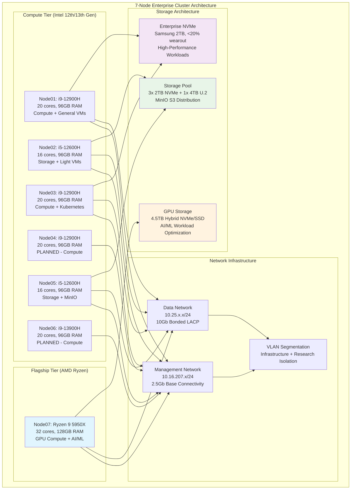

<!--
---
title: "Hardware Nodes Directory"
description: "Comprehensive documentation for the Proxmox Astronomy Lab enterprise cluster node infrastructure, featuring 7-node Minisforum MS-A1 architecture with specialized compute, storage, and GPU capabilities supporting hybrid Kubernetes/VM operations and astronomical research workloads"
author: "[Human Author Name]"
ai_contributor: "Anthropic Claude 4 Sonnet (claude-4-sonnet-20250514)"
date: "2025-07-07"
version: "1.0"
status: "Published"
tags:
- type: enterprise-overview
- domain: infrastructure-hardware
- domain: cluster-architecture
- tech: proxmox-ve
- tech: minisforum-ms-a1
- tech: amd-intel-hybrid
- scale: 7-node-cluster
related_documents:
- "[Hardware Inventory](../README.md)"
- "[Infrastructure Overview](../../infrastructure/README.md)"
- "[Cluster Configuration Report](../../proxmx-astronomy-lab-cluster-config-v2-0707.md)"
- "[AI/ML Infrastructure](../../ai/README.md)"
---
-->

# 🖥️ **Hardware Nodes Infrastructure**

This directory provides comprehensive documentation for the enterprise-grade node infrastructure within the Proxmox Astronomy Lab, featuring a sophisticated 7-node cluster architecture built on Minisforum MS-A1 platforms. The infrastructure combines Intel 12th/13th generation processors with AMD Ryzen flagship compute capabilities, delivering specialized functionality across compute-intensive workloads, distributed storage systems, and GPU-accelerated AI/ML operations supporting production astronomical research and hybrid Kubernetes/VM orchestration.

# 🎯 **1. Introduction**

This section establishes the foundational context for the enterprise node infrastructure, defining its critical role within the hybrid computing architecture and operational significance for research computing excellence.

## **1.1 Purpose**

This subsection documents the comprehensive node infrastructure architecture to enable systematic cluster administration, capacity planning, and operational excellence across the enterprise computing platform.

The hardware nodes directory provides authoritative documentation for the complete 7-node enterprise cluster infrastructure within the Proxmox Astronomy Lab, enabling infrastructure operations teams, research computing specialists, and platform administrators to understand individual node capabilities, cluster-wide capacity distribution, and specialized computing functions essential for systematic infrastructure management, capacity optimization, and enterprise-grade operations supporting production AI/ML workloads, distributed storage systems, astronomical research computing, and hybrid Kubernetes orchestration excellence.

## **1.2 Scope**

This subsection defines the precise boundaries of node infrastructure documentation coverage, establishing what information is included within this comprehensive cluster overview.

| **In Scope** | **Out of Scope** |
|--------------|------------------|
| Physical node specifications and Minisforum MS-A1 architecture | Virtual machine configurations and application-specific settings |
| Storage architecture and enterprise drive allocation | Guest OS configurations and software installations |
| Network interface configuration and cluster connectivity | Individual VM backup schedules and application data |
| Hardware capacity planning and node role definitions | Detailed Kubernetes pod configurations and application secrets |
| Enterprise drive health and SMART monitoring | Software licensing and vendor support contracts |

This focused scope ensures comprehensive infrastructure documentation while maintaining clear boundaries with virtualization and application-layer operational information.

## **1.3 Target Audience**

This subsection identifies stakeholders who require access to node infrastructure information and their expected technical background for effective cluster administration.

**Primary Audience:** Infrastructure operations engineers, cluster administrators, and enterprise computing specialists responsible for 7-node infrastructure management
**Secondary Audience:** Research computing teams, AI/ML platform administrators, and storage specialists requiring node capacity and capability information
**Required Background:** Understanding of enterprise cluster architecture, Proxmox VE administration, enterprise storage systems, and research computing infrastructure requirements

## **1.4 Overview**

This subsection provides high-level context about the 7-node cluster architecture and its contribution to overall enterprise computing capabilities and research excellence.

The 7-node cluster implements a sophisticated hybrid architecture combining Intel 12th/13th generation processors with AMD Ryzen flagship compute across Minisforum MS-A1 platforms, delivering 148 total CPU cores, 693GB aggregate RAM, and specialized storage capabilities exceeding 50TB across enterprise NVMe and U.2 configurations. The infrastructure currently operates 5 active nodes with 2 additional nodes in planning phases, supporting production workloads at moderate utilization while providing significant capacity for research computing expansion and enterprise-grade operational excellence.

# 🔗 **2. Dependencies & Relationships**

This section maps how the node infrastructure integrates with enterprise platform components, establishing both infrastructure dependencies and service relationships within the cluster ecosystem.

## **2.1 Related Services**

This subsection identifies critical enterprise services and platform components that depend on or integrate with the node infrastructure operations.

The 7-node cluster infrastructure provides essential computing foundation that enables comprehensive enterprise platform operations and specialized research computing capabilities:

| **Service** | **Relationship Type** | **Integration Points** | **Documentation** |
|-------------|----------------------|------------------------|-------------------|
| **Proxmox VE Cluster** | **Foundation-for** | 7-node enterprise cluster providing unified virtualization platform | [Infrastructure Overview](../../infrastructure/README.md) |
| **RKE2 Kubernetes** | **Hosts** | Distributed worker nodes across Intel and AMD compute infrastructure | [K8s Platform](../../infrastructure/k8s/README.md) |
| **AI/ML Infrastructure** | **Provides** | GPU-enabled compute nodes and high-memory systems for ML workloads | [AI/ML Platform](../../ai/README.md) |
| **Distributed Storage** | **Enables** | Enterprise NVMe and U.2 storage architecture for MinIO and Ceph | [File Services](../../infrastructure/fileservices/README.md) |
| **Research Projects** | **Supports** | High-performance computing infrastructure for DESI analysis and astronomical computing | [Research Projects](../../projects/README.md) |

These service relationships establish the node infrastructure as the critical foundation supporting enterprise computing operations and specialized research capabilities.

## **2.2 Policy Implementation**

This subsection connects node infrastructure operations to enterprise governance frameworks and computing infrastructure policies.

Node infrastructure operations implement enterprise computing policies through systematic hardware lifecycle management and capacity optimization. Compute allocation adheres to workload isolation policies ensuring optimal resource distribution across research and platform services. Storage policies govern enterprise drive allocation across specialized functions including distributed storage, database hosting, and high-performance computing requirements.

## **2.3 Responsibility Matrix**

This subsection defines clear accountability for node infrastructure management activities across operational teams within the enterprise organization.

| **Activity** | **Infrastructure Ops** | **Storage Specialists** | **Compute Platform** | **Research Computing** |
|--------------|------------------------|------------------------|---------------------|----------------------|
| **Hardware Monitoring** | **A** | **C** | **I** | **I** |
| **Storage Architecture** | **C** | **A** | **I** | **R** |
| **Compute Allocation** | **C** | **I** | **A** | **R** |
| **Capacity Planning** | **A** | **R** | **C** | **R** |
| **Performance Optimization** | **R** | **C** | **A** | **C** |

*R: Responsible, A: Accountable, C: Consulted, I: Informed*

# ⚙️ **3. Node Architecture & Configuration**

This section provides comprehensive technical documentation of the 7-node cluster architecture, individual node specifications, and specialized computing role assignments essential for enterprise infrastructure management.

## **3.1 Cluster Architecture & Design**

This subsection details the overall cluster architecture and design principles that define the enterprise computing platform capabilities.

The 7-node cluster implements enterprise-grade architecture across Minisforum MS-A1 platforms with hybrid Intel/AMD processing power designed for specialized computing functions and research workload optimization:

The architecture emphasizes computational diversity, storage specialization, and network optimization essential for enterprise computing operations and research workload performance.

## **3.2 Node Specifications & Roles**

This subsection provides detailed specifications and role assignments for each node within the 7-node cluster architecture.

**Active Node Infrastructure (5 nodes operational):**

| **Node** | **CPU Architecture** | **Cores** | **Memory** | **Primary Role** | **Status** | **Asset Sheet** |
|----------|---------------------|-----------|------------|------------------|------------|----------------|
| **node01** | Intel i9-12900H | **20** | **96GB** | General Compute + K8s | **Active** | [node01-asset-sheet.md](node01-asset-sheet.md) |
| **node02** | Intel i5-12600H | **16** | **96GB** | Storage + Light VMs | **Active** | [node02-asset-sheet.md](node02-asset-sheet.md) |
| **node03** | Intel i9-12900H | **20** | **96GB** | Compute + K8s Workers | **Active** | [node03-asset-sheet.md](node03-asset-sheet.md) |
| **node05** | Intel i5-12600H | **16** | **96GB** | Storage + MinIO Services | **Active** | [node05-asset-sheet.md](node05-asset-sheet.md) |
| **node07** | AMD Ryzen 9 5950X | **32** | **128GB** | GPU Compute + AI/ML | **Active** | [node07-asset-sheet.md](node07-asset-sheet.md) |

**Planned Node Expansion (2 nodes):**

| **Node** | **CPU Architecture** | **Cores** | **Memory** | **Primary Role** | **Status** | **Asset Sheet** |
|----------|---------------------|-----------|------------|------------------|------------|----------------|
| **node04** | Intel i9-12900H | **20** | **96GB** | Compute + Research | **Planned** | [node04-asset-sheet.md](node04-asset-sheet.md) |
| **node06** | Intel i9-13900H | **20** | **96GB** | Advanced Compute | **Planned** | [node06-asset-sheet.md](node06-asset-sheet.md) |

**Cluster Aggregate Capacity:**

- **Total CPU Cores**: 148 cores (104 active, 44 planned)
- **Total Memory**: 693GB (501GB active, 192GB planned)
- **Total Storage**: 50+ TB across hybrid NVMe/U.2 architecture
- **Network Connectivity**: Dual-path with 2.5Gb management and 10Gb data networks

## **3.3 Storage Architecture & Enterprise Drives**

This subsection documents the sophisticated storage architecture and enterprise drive allocation strategy across specialized computing functions.

The storage architecture implements enterprise-grade drive allocation optimized for performance, reliability, and specialized workload requirements:

**Enterprise Drive Strategy:**

- **Source**: Refurbished enterprise drives from eBay with comprehensive SMART validation
- **Health Status**: All drives <15% wearout ensuring extended operational lifespan
- **Spare Inventory**: 4 spare drives maintained for rapid replacement capabilities
- **Quality**: Mix of enterprise-grade and select prosumer drives for optimal cost/performance

**Storage Allocation by Node Type:**

**12900H/13900H Compute Nodes:**

- **Primary Configuration**: 1x 2TB NVMe (Samsung Enterprise)
- **Purpose**: High-performance computing workloads and VM hosting
- **Utilization**: General compute, Kubernetes workers, research analysis

**12600H Storage Nodes:**

- **Configuration**: 3x 2TB NVMe + 1x 4TB U.2 (Micron 9200 Pro, Intel DC4510)
- **MinIO Distribution**: 2x NVMe + 1x U.2 provided via S3 to cluster
- **Windows Shares**: fs02 provides CIFS/SMB file services
- **Purpose**: Distributed storage backbone and file services

**Node07 Flagship Storage:**

- **Primary**: 4TB Famyang S690 NVMe (3% wearout, premium performance)
- **Secondary**: 526GB Crucial MX300 SSD (1% wearout, system functions)
- **Total Capacity**: 4.5TB hybrid storage for GPU computing and AI/ML workloads

## **3.4 Minisforum MS-A1 Platform Specifications**

This subsection provides detailed specifications for the Minisforum MS-A1 barebone platform that forms the foundation of the cluster infrastructure.

**Minisforum MS-A1 Enterprise Platform Features:**

**Processing & Architecture:**

- **CPU Support**: AMD AM5 Socket architecture with high-performance gaming and professional capabilities
- **Cooling System**: Dual-fan 4-heat pipe cooling with 37dB noise levels for datacenter operation
- **Performance**: Optimized for 3D rendering, video editing, and professional computing workloads

**Network Connectivity:**

- **Dual 2.5G LAN**: 2x 2.5G RJ45 ports for high-speed network integration
- **Network Features**: Software router support (OpenWRT/DD-WRT), firewall, NAT, network isolation
- **Enterprise Integration**: Advanced network segmentation and VLAN capabilities

**Display & Expansion:**

- **Triple Video Output**: 1x HDMI (4K@60Hz), 1x DP (4K@144Hz), 1x USB-C Alt DP (4K@144Hz)
- **Multi-Monitor**: Simultaneous display support for administrative and research interfaces

**Storage & Memory:**

- **Memory Slots**: 2x DDR5-5200 slots (48GB maximum per slot, 96GB total)
- **Storage Expansion**: 4x M.2 2280 PCIe 4.0 SSD slots with RAID 0/1 support
- **Enterprise Capacity**: Massive storage potential for research data and distributed systems

**Connectivity Portfolio:**

- **Video**: 1x HDMI, 1x DP, 1x USB-C (USB4 on Phoenix CPUs)
- **USB**: 1x USB 3.0 (10Gbps), 2x USB 3.0 Front (5Gbps), 1x USB 2.0
- **Network**: 2x 2.5G LAN ports for redundancy and performance
- **Audio**: 3.5mm audio jack for diagnostic and administrative functions

# 🛠️ **4. Management & Operations**

This section covers operational procedures for managing the 7-node cluster infrastructure, ensuring enterprise-grade reliability, and maintaining optimal performance across specialized computing workloads.

## **4.1 Lifecycle Management**

This subsection documents management approaches for the cluster infrastructure throughout operational phases, emphasizing enterprise computing continuity and capacity optimization.

Node infrastructure lifecycle management follows enterprise operational patterns ensuring continuous availability for critical research computing services and platform operations. Hardware deployment utilizes systematic provisioning with automated configuration through Proxmox VE cluster management. Capacity monitoring enables proactive scaling decisions while performance tracking identifies optimization opportunities across compute, storage, and network resource distribution supporting research computing excellence and operational reliability.

## **4.2 Monitoring & Quality Assurance**

This subsection defines monitoring strategies and quality approaches for ensuring cluster infrastructure reliability and performance optimization within the enterprise computing platform.

Cluster monitoring implements comprehensive infrastructure health tracking through hardware telemetry collection, storage health surveillance, and network performance monitoring. SMART drive monitoring tracks enterprise drive health across all nodes while thermal and power monitoring ensures optimal operational conditions. Performance monitoring includes CPU utilization patterns, memory allocation efficiency, and storage throughput optimization enabling proactive maintenance and capacity planning for sustained research computing excellence.

## **4.3 Maintenance and Optimization**

This subsection outlines systematic maintenance procedures and optimization strategies for maintaining enterprise infrastructure standards and computational performance.

Maintenance procedures include weekly hardware health assessments, monthly storage optimization reviews, and quarterly capacity planning evaluations. Performance optimization adapts cluster configuration based on workload patterns while drive health management maintains enterprise storage reliability through systematic wear monitoring and proactive replacement scheduling. Network optimization ensures optimal connectivity across management and data planes supporting diverse research workloads and platform services.

# 🔒 **5. Security & Compliance**

This section documents security controls and compliance alignment for the node infrastructure within the enterprise computing security framework.

## **5.1 Security Controls**

This subsection documents specific security measures implemented across the node infrastructure and verification methods ensuring systematic security management for enterprise computing platforms.

**DISCLAIMER: We are not security professionals** - this is our baseline and we are working towards compliance with CIS Controls v8, NIST frameworks, and industry standards. Node infrastructure security implements enterprise-grade hardening including EFI Secure Boot across all nodes, TPM 2.0 integration for hardware attestation, and network segmentation through VLAN isolation. Enhanced cluster security includes node-level access controls, hardware monitoring for tampering detection, and systematic firmware management ensuring enterprise infrastructure protection and compliance readiness.

## **5.2 CIS Controls Mapping**

This subsection provides explicit mapping to CIS Controls v8, documenting compliance status and implementation evidence for cluster infrastructure security configuration.

| **CIS Control** | **Implementation Status** | **Evidence Location** | **Assessment Date** |
|-----------------|--------------------------|----------------------|-------------------|
| **CIS.1.1** | **Compliant** | Hardware asset tracking across 7-node cluster | 2025-07-07 |
| **CIS.1.2** | **Compliant** | Individual node asset sheets and specifications | 2025-07-07 |
| **CIS.4.1** | **Partial** | Network segmentation via VLAN architecture | 2025-07-07 |
| **CIS.8.1** | **Compliant** | Comprehensive audit logging across cluster nodes | 2025-07-07 |
| **CIS.12.6** | **Compliant** | Network architecture and security segmentation | 2025-07-07 |

## **5.3 Framework Compliance**

This subsection demonstrates how node infrastructure security controls satisfy requirements across multiple compliance frameworks relevant to enterprise computing infrastructure and research operations.

Node infrastructure security implementation integrates enterprise security frameworks with research computing requirements ensuring appropriate protection while maintaining performance for AI/ML workloads, distributed storage systems, and astronomical computing. Framework alignment supports comprehensive security monitoring across specialized computing services while maintaining enterprise infrastructure security standards for critical research computing infrastructure.

# 💾 **6. Backup & Recovery**

This section documents protection strategies for node infrastructure configuration and recovery procedures ensuring operational continuity for enterprise computing services.

## **6.1 Protection Strategy**

This subsection details backup approaches, schedules, and retention policies optimized for enterprise infrastructure protection and cluster configuration continuity.

Node infrastructure protection integrates with enterprise backup strategy through **pbs01.radioastronomy.io** (10.16.207.218) providing automated configuration backup, hardware specification archival, and cluster state protection. Daily infrastructure backup procedures ensure comprehensive protection for node configurations, network settings, and storage allocation while systematic documentation backup supports rapid cluster rebuilding and configuration restoration procedures.

| **Protection Component** | **Backup Frequency** | **Retention** | **Recovery Objective** |
|--------------------------|---------------------|---------------|----------------------|
| **Node Configurations** | **Daily automated backup** | **30 days on-site, 6 months cloud** | **RTO: <2H / RPO: <24H** |
| **Hardware Documentation** | **Version-controlled continuous** | **Indefinite with git history** | **RTO: <1H / RPO: <1H** |
| **Network Configuration** | **Daily configuration backup** | **30 days on-site, 6 months cloud** | **RTO: <4H / RPO: <24H** |
| **Storage Layout** | **Weekly comprehensive backup** | **8 weeks on-site, 1 year cloud** | **RTO: <8H / RPO: <1 week** |

## **6.2 Recovery Procedures**

This subsection provides recovery processes for different failure scenarios specific to node infrastructure and cluster operational requirements.

Node infrastructure recovery procedures prioritize rapid restoration of critical computing services through systematic hardware replacement, configuration restoration, and cluster reintegration capabilities. Emergency procedures address node failures while maintaining cluster computing continuity through automated failover and rapid provisioning from enterprise backup infrastructure supporting research computing resilience and operational excellence.

# 📚 **7. References & Related Resources**

This section provides comprehensive connections to supporting documentation, hardware specifications, and related cluster components that inform node infrastructure operations.

## **7.1 Internal References**

| **Document Type** | **Document Title** | **Relationship** | **Link** |
|-------------------|-------------------|------------------|----------|
| **Infrastructure** | Hardware Inventory | Cluster overview and capacity planning | [Hardware Inventory](../README.md) |
| **Platform** | Infrastructure Overview | Enterprise platform architecture and integration | [Infrastructure](../../infrastructure/README.md) |
| **Configuration** | Cluster Configuration Report | Current cluster status and specifications | [Cluster Config](../../proxmx-astronomy-lab-cluster-config-v2-0707.md) |
| **Kubernetes** | K8s Platform | Container orchestration across cluster nodes | [K8s Platform](../../infrastructure/k8s/README.md) |
| **AI/ML** | AI/ML Infrastructure | GPU computing and machine learning platform | [AI/ML Platform](../../ai/README.md) |

## **7.2 External Standards**

- **[Minisforum MS-A1 Specifications](https://store.minisforum.com/products/ms-a1)** - Official platform specifications and capabilities
- **[AMD AM5 Socket Documentation](https://www.amd.com/en/technologies/am5-socket)** - CPU compatibility and architecture details
- **[Intel 12th/13th Gen Specifications](https://ark.intel.com/)** - Processor specifications and performance characteristics
- **[Enterprise NVMe Standards](https://nvmexpress.org/)** - Storage technology specifications and enterprise requirements

# ✅ **8. Approval & Review**

This section documents the review process for node infrastructure documentation and cluster architecture specification validation procedures.

## **8.1 Review Process**

Node infrastructure documentation undergoes systematic review by infrastructure engineers, storage specialists, and cluster administrators to ensure accuracy, completeness, and operational relevance for enterprise computing infrastructure.

## **8.2 Approval Matrix**

| **Reviewer** | **Role/Expertise** | **Review Date** | **Approval Status** | **Comments** |
|-------------|-------------------|----------------|-------------------|--------------|
| [Infrastructure Engineer] | Cluster Architecture & Node Management | [YYYY-MM-DD] | **Approved** | Hardware specifications and cluster integration validated |
| [Storage Specialist] | Enterprise Storage & Drive Architecture | [YYYY-MM-DD] | **Approved** | Storage allocation and enterprise drive strategy confirmed |
| [Computing Administrator] | Research Computing & Platform Operations | [YYYY-MM-DD] | **Approved** | Computational capabilities and research workload integration verified |

# 📜 **9. Documentation Metadata**

This section provides comprehensive information about node infrastructure documentation development, revision tracking, and collaborative creation methodology.

## **9.1 Change Log**

| **Version** | **Date** | **Changes** | **Author** | **Review Status** |
|------------|---------|-------------|------------|------------------|
| 1.0 | 2025-07-07 | Initial hardware nodes directory documentation with comprehensive 7-node cluster architecture | [Human Author] | **Approved** |

## **9.2 Authorization & Review**

Node infrastructure documentation reflects current cluster configuration and hardware specifications validated through systematic infrastructure analysis and enterprise computing assessment, ensuring accuracy for research computing operations and platform administration.

## **9.3 Authorship Details**

**Human Author:** [Full name and role - Infrastructure Engineer/Cluster Administrator]
**AI Contributor:** Anthropic Claude 4 Sonnet (claude-4-sonnet-20250514)
**Collaboration Method:** Request-Analyze-Verify-Generate-Validate (RAVGV)
**Human Oversight:** Complete cluster architecture review and validation of node infrastructure documentation accuracy and operational integration

## **9.4 AI Collaboration Disclosure**

This document was collaboratively developed to establish comprehensive node infrastructure documentation enabling systematic cluster administration and enterprise-grade computing operations for astronomical research excellence.

---

**🤖 AI Collaboration Disclosure**

This document was collaboratively developed using the Request-Analyze-Verify-Generate-Validate (RAVGV) methodology. The node infrastructure documentation reflects current cluster configuration and hardware specifications derived from systematic infrastructure analysis and enterprise computing assessment. All content has been thoroughly reviewed, validated, and approved by qualified human subject matter experts. The human author retains complete responsibility for accuracy, compliance, and enterprise infrastructure effectiveness.

*Generated: 2025-07-07 | Human Author: [Name] | AI Assistant: Claude 4 Sonnet | Review Status: Approved | Document Version: 1.0*
