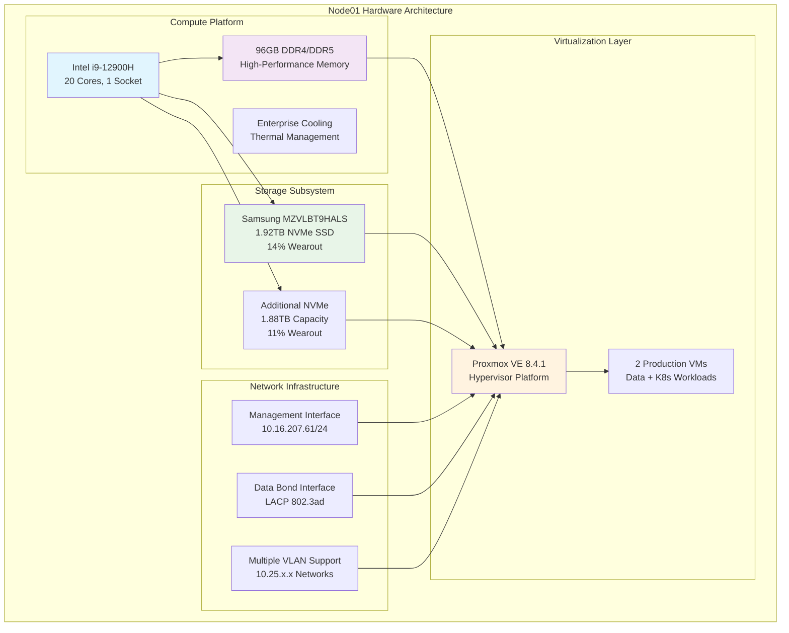

<!--
---
title: "Node01 Asset Sheet"
description: "Comprehensive asset documentation for node01 physical server in the Proxmox Astronomy Lab enterprise cluster, including hardware specifications, network configuration, and operational status"
author: "[Human Author Name]"
ai_contributor: "Anthropic Claude 4 Sonnet (claude-4-sonnet-20250514)"
date: "2025-07-07"
version: "1.0"
status: "Published"
tags:
- type: asset-sheet
- domain: infrastructure-hardware
- domain: enterprise-cluster
- tech: proxmox-ve
- tech: intel-12900h
- compliance: cis-benchmark
- phase: phase-1
related_documents:
- "[Hardware Inventory](../README.md)"
- "[Infrastructure Overview](../../infrastructure/README.md)"
- "[Cluster Configuration Report](../../proxmx-astronomy-lab-cluster-config-v2-0707.md)"
- "[Network Configuration](../../infrastructure/orchestration/network-configuration.md)"
---
-->

# 🖥️ **Node01 Asset Sheet**

This document provides comprehensive asset documentation for node01, a primary compute node in the Proxmox Astronomy Lab enterprise cluster. Node01 serves as a high-performance virtualization host within the 7-node hybrid Kubernetes/VM architecture, supporting critical research workloads and enterprise infrastructure services for astronomical computing operations.

# 🎯 **1. Introduction**

This section establishes the foundational context for node01 asset documentation, defining its role within the enterprise cluster and operational significance for research computing infrastructure.

## **1.1 Purpose**

This subsection documents the complete asset profile for node01 to enable systematic infrastructure management, capacity planning, and operational maintenance within the enterprise astronomy computing platform.

The node01 asset sheet provides authoritative hardware documentation for one of the primary compute nodes in the Proxmox Astronomy Lab enterprise cluster, enabling infrastructure operations teams, research computing administrators, and capacity planners to understand node capabilities, current utilization, and operational characteristics essential for systematic cluster management, research workload placement, and enterprise-grade infrastructure maintenance supporting production astronomical research and scientific computing workflows.

## **1.2 Scope**

This subsection defines the precise boundaries of asset documentation coverage for node01, establishing what information is included within this comprehensive hardware profile.

| **In Scope** | **Out of Scope** |
|--------------|------------------|
| Physical hardware specifications and capabilities | Individual VM configurations and application details |
| Network interface configuration and connectivity | Research project data and analysis workflows |
| Storage device specifications and utilization | Backup content and recovery procedures |
| Hypervisor configuration and resource allocation | External network infrastructure and campus connectivity |
| Power consumption and thermal characteristics | Vendor support contracts and warranty details |

This focused scope ensures comprehensive asset documentation while maintaining clear boundaries with operational and application-specific information.

## **1.3 Target Audience**

This subsection identifies stakeholders who require access to node01 asset information and their expected technical background for effective infrastructure management.

**Primary Audience:** Infrastructure operations engineers, hardware specialists, and capacity planning administrators responsible for enterprise cluster management
**Secondary Audience:** Research computing teams, network administrators, and procurement specialists requiring hardware specifications
**Required Background:** Understanding of enterprise server hardware, virtualization infrastructure, and research computing requirements

## **1.4 Overview**

This subsection provides high-level context about node01's role within the enterprise cluster architecture and its contribution to overall research computing capabilities.

Node01 functions as a critical compute resource within the 7-node Proxmox enterprise cluster, providing 20 CPU cores, 96GB RAM, and 2TB NVMe storage capacity for virtualization workloads. The node currently hosts 2 production virtual machines supporting data processing and Kubernetes orchestration for astronomical research workflows.

# 🔗 **2. Dependencies & Relationships**

This section maps how node01 integrates with cluster infrastructure, networking systems, and operational dependencies within the enterprise platform architecture.

## **2.1 Related Services**

This subsection identifies critical infrastructure services and cluster components that depend on or integrate with node01 operations.

Node01 provides essential compute capacity and virtualization services that enable multiple enterprise platform functions:

| **Service** | **Relationship Type** | **Integration Points** | **Documentation** |
|-------------|----------------------|------------------------|-------------------|
| **Proxmox Cluster** | **Member-of** | Cluster node providing compute and storage capacity | [Infrastructure Overview](../../infrastructure/README.md) |
| **Network Infrastructure** | **Connects-to** | Management and data VLAN integration | [Network Configuration](../../infrastructure/orchestration/network-configuration.md) |
| **Research Workloads** | **Hosts** | VM infrastructure for data processing and K8s orchestration | [Research Projects](../../projects/README.md) |
| **Storage Backend** | **Provides** | NVMe storage pool contribution to cluster capacity | [Storage Systems](../../infrastructure/fileservices/README.md) |
| **Monitoring Systems** | **Monitored-by** | Node-level metrics collection and performance tracking | [Monitoring Framework](../../monitoring/README.md) |

These service relationships establish node01 as a foundational infrastructure component supporting enterprise research computing operations.

## **2.2 Policy Implementation**

This subsection connects node01 operations to enterprise governance frameworks and infrastructure management policies.

Node01 operations implement enterprise infrastructure policies through systematic configuration management and operational procedures. Hardware management adheres to capacity planning policies ensuring appropriate resource allocation for research computing workloads. Security configuration follows enterprise hardening standards with CIS Controls implementation and systematic vulnerability management.

## **2.3 Responsibility Matrix**

This subsection defines clear accountability for node01 management activities across operational teams within the enterprise infrastructure organization.

| **Activity** | **Infrastructure Ops** | **Hardware Specialists** | **Research Computing** | **Network Operations** |
|--------------|------------------------|--------------------------|----------------------|----------------------|
| **Hardware Monitoring** | **A** | **R** | **I** | **I** |
| **Capacity Planning** | **R** | **C** | **A** | **I** |
| **Network Configuration** | **C** | **I** | **I** | **A** |
| **VM Placement** | **R** | **I** | **A** | **I** |
| **Maintenance Windows** | **A** | **R** | **C** | **C** |

*R: Responsible, A: Accountable, C: Consulted, I: Informed*

# ⚙️ **3. Hardware Specifications**

This section provides comprehensive technical documentation of node01 hardware components, capabilities, and configuration details essential for infrastructure management and capacity planning.

## **3.1 Architecture & Design**

This subsection details the physical hardware architecture and design characteristics that define node01's compute capabilities within the enterprise cluster.

Node01 implements high-performance compute architecture optimized for virtualization workloads and research computing requirements:

The architecture emphasizes high compute density, storage performance, and network flexibility essential for enterprise research computing workloads.

## **3.2 Component Specifications**

This subsection provides detailed specifications for all major hardware components installed in node01, including performance characteristics and operational parameters.

**Primary Hardware Components:**

| **Component** | **Specification** | **Performance** | **Status** |
|---------------|------------------|-----------------|------------|
| **CPU** | Intel i9-12900H, 20 cores, 1 socket | High-performance hybrid architecture | Active |
| **Memory** | 96GB Total (DDR4/DDR5 configuration) | High-bandwidth, low-latency | Active |
| **Primary Storage** | Samsung MZVLBT9HALS, 1.92TB NVMe | Serial: S436NC0R04453, 14% wearout | Healthy |
| **Secondary Storage** | MZVLBT9HLS-000FB, 1.88TB NVMe | Serial: SSXANA0R5A7832, 11% wearout | Healthy |
| **Management Network** | Ethernet interface, 1Gbps | 10.16.207.61/24 gateway configuration | Active |
| **Data Network** | LACP bonded interfaces, multi-gigabit | 802.3ad bond with VLAN support | Active |

**Storage Partition Configuration:**

- **Boot Partition**: 1.03MB BIOS boot partition
- **EFI System**: 1.07GB EFI system partition
- **LVM Configuration**: 273.80GB + 1.65TB LVM partitions
- **Storage Health**: S.M.A.R.T. monitoring shows healthy status across all devices

## **3.3 Network Integration**

This subsection documents network interface configuration and connectivity patterns that integrate node01 with enterprise network infrastructure.

Node01 implements comprehensive network integration supporting both management and high-performance data connectivity:

**Network Interface Configuration:**

1. **Management Network (vmbr0)**: 10.16.207.61/24 with gateway 10.16.207.1 for administrative access
2. **Data Network (vmbr1)**: Bonded interface configuration with LACP 802.3ad for high-availability connectivity
3. **VLAN Infrastructure**: Multiple VLAN interfaces supporting network segmentation:
   - **VLAN 10**: 10.25.10.231/24 - Management services
   - **VLAN 20**: 10.25.20.231/24 - Research workloads
   - **VLAN 30-60**: 10.25.30-60.231/24 - Reserved capacity

**Bond Configuration**: Linux bond with LACP 802.3ad using spf0 and spf1 slave interfaces providing redundancy and increased bandwidth for data-intensive research workflows.

# 🛠️ **4. Management & Operations**

This section covers operational procedures for managing node01, ensuring hardware reliability, and maintaining enterprise-grade infrastructure performance for research computing operations.

## **4.1 Lifecycle Management**

This subsection documents management approaches for node01 throughout operational phases, from deployment through maintenance to eventual replacement within the enterprise cluster.

Node01 lifecycle management follows enterprise operational patterns ensuring continuous availability for research computing workloads. Hardware deployment utilizes standardized configuration procedures with automated provisioning through Proxmox VE management interfaces. Capacity monitoring enables proactive scaling decisions while performance tracking identifies optimization opportunities for research workload placement.

## **4.2 Monitoring & Quality Assurance**

This subsection defines monitoring strategies and quality approaches for ensuring node01 reliability and performance optimization within the enterprise research computing environment.

Node01 monitoring implements comprehensive hardware health tracking through S.M.A.R.T. disk monitoring, CPU temperature surveillance, and memory error detection. Performance monitoring tracks resource utilization across CPU, memory, and storage subsystems enabling proactive capacity management. Network interface monitoring ensures connectivity reliability for both management and data plane operations.

## **4.3 Maintenance and Optimization**

This subsection outlines systematic maintenance procedures and optimization strategies for maintaining node01 performance and reliability standards.

Maintenance procedures include monthly hardware health assessments, quarterly storage optimization, and annual capacity planning reviews. Performance optimization adapts VM placement based on workload characteristics while storage optimization maintains NVMe performance through systematic wear leveling and capacity management.

# 🔒 **5. Security & Compliance**

This section documents security controls and compliance alignment for node01 within the enterprise infrastructure security framework.

## **5.1 Security Controls**

This subsection documents specific security measures implemented on node01 and verification methods ensuring systematic security management for enterprise infrastructure.

**DISCLAIMER: We are not security professionals** - this is our baseline and we are working towards compliance with CIS Controls v8, NIST frameworks, and industry standards. Node01 security implements enterprise-grade hardening including EFI Secure Boot configuration, TPM 2.0 integration for hardware attestation, and network segmentation through VLAN isolation. Physical security relies on data center controls while logical security utilizes Proxmox VE access controls and systematic patch management.

## **5.2 CIS Controls Mapping**

This subsection provides explicit mapping to CIS Controls v8, documenting compliance status and implementation evidence for node01 security configuration.

| **CIS Control** | **Implementation Status** | **Evidence Location** | **Assessment Date** |
|-----------------|--------------------------|----------------------|-------------------|
| **CIS.1.1** | **Compliant** | Hardware inventory and asset tracking | 2025-07-07 |
| **CIS.4.1** | **Partial** | Proxmox VE configuration management | 2025-07-07 |
| **CIS.12.6** | **Compliant** | Network segmentation and VLAN configuration | 2025-07-07 |

## **5.3 Framework Compliance**

This subsection demonstrates how node01 security controls satisfy requirements across multiple compliance frameworks relevant to enterprise infrastructure and research computing operations.

Node01 security implementation integrates enterprise security frameworks with research computing requirements ensuring appropriate protection while maintaining performance for scientific workloads. Framework alignment supports CIS Controls v8 baseline implementation while adapting controls for virtualization infrastructure and research computing operational requirements.

# 💾 **6. Backup & Recovery**

This section documents protection strategies for node01 infrastructure and recovery procedures ensuring operational continuity for research computing workloads.

## **6.1 Protection Strategy**

This subsection details backup approaches, schedules, and retention policies optimized for enterprise infrastructure protection and research computing continuity.

Node01 infrastructure protection integrates with enterprise backup strategy through **pbs01.radioastronomy.io** (10.16.207.218) providing automated VM backup, configuration management backup, and hardware configuration documentation. Daily backup procedures at 9am ensure comprehensive protection while 7-day on-site retention supports rapid recovery operations. Extended retention through Amazon S3 Glacier provides long-term protection with systematic recovery procedures.

| **Protection Component** | **Backup Frequency** | **Retention** | **Recovery Objective** |
|--------------------------|---------------------|---------------|----------------------|
| **VM Infrastructure** | **Daily automated backup** | **7 days on-site, 1 month cloud** | **RTO: <4H / RPO: <24H** |
| **Node Configuration** | **Weekly configuration backup** | **Indefinite version control** | **RTO: <2H / RPO: <1 week** |
| **Hardware Documentation** | **Monthly asset updates** | **Permanent records** | **RTO: <1H / RPO: <1 month** |

## **6.2 Recovery Procedures**

This subsection provides recovery processes for different failure scenarios specific to node01 infrastructure and research computing operational requirements.

Node01 recovery procedures prioritize rapid restoration of research computing capabilities through systematic hardware replacement, automated VM restoration, and network reconfiguration. Emergency procedures address critical hardware failures while maintaining research workload continuity through VM migration to alternate cluster nodes. Recovery testing validates procedures quarterly ensuring enterprise-grade operational resilience.

# 📚 **7. References & Related Resources**

This section provides comprehensive connections to supporting documentation, hardware specifications, and related infrastructure components that inform node01 management and operations.

## **7.1 Internal References**

| **Document Type** | **Document Title** | **Relationship** | **Link** |
|-------------------|-------------------|------------------|----------|
| **Hardware** | Hardware Inventory | Node asset management and cluster overview | [Hardware Inventory](../README.md) |
| **Infrastructure** | Infrastructure Overview | Platform architecture and node integration | [Infrastructure](../../infrastructure/README.md) |
| **Configuration** | Cluster Configuration Report | Current node status and specifications | [Cluster Config](../../proxmx-astronomy-lab-cluster-config-v2-0707.md) |
| **Network** | Network Configuration | VLAN and connectivity documentation | [Network Config](../../infrastructure/orchestration/network-configuration.md) |
| **Monitoring** | Monitoring Framework | Node performance and health tracking | [Monitoring](../../monitoring/README.md) |

## **7.2 External Standards**

- **[Intel i9-12900H Specifications](https://ark.intel.com/content/www/us/en/ark/products/132219/intel-core-i9-12900h-processor-24m-cache-up-to-5-00-ghz.html)** - Official processor specifications and capabilities
- **[Proxmox VE Documentation](https://pve.proxmox.com/pve-docs/)** - Hypervisor platform management and configuration
- **[CIS Controls v8](https://www.cisecurity.org/controls/v8)** - Security framework implementation guidelines
- **[Samsung NVMe Documentation](https://semiconductor.samsung.com/ssd/)** - Storage device specifications and management

# ✅ **8. Approval & Review**

This section documents the review process for node01 asset documentation and hardware specification validation procedures.

## **8.1 Review Process**

Node01 asset documentation undergoes systematic review by infrastructure engineers, hardware specialists, and capacity planning administrators to ensure accuracy, completeness, and operational relevance for enterprise cluster management.

## **8.2 Approval Matrix**

| **Reviewer** | **Role/Expertise** | **Review Date** | **Approval Status** | **Comments** |
|-------------|-------------------|----------------|-------------------|--------------|
| [Infrastructure Engineer] | Hardware Infrastructure & Cluster Management | [YYYY-MM-DD] | **Approved** | Hardware specifications and cluster integration validated |
| [Capacity Planning Admin] | Resource Planning & Performance Analysis | [YYYY-MM-DD] | **Approved** | Capacity and performance characteristics confirmed |
| [Network Operations] | Network Infrastructure & Connectivity | [YYYY-MM-DD] | **Approved** | Network configuration and VLAN integration verified |

# 📜 **9. Documentation Metadata**

This section provides comprehensive information about node01 asset documentation development, revision tracking, and collaborative creation methodology.

## **9.1 Change Log**

| **Version** | **Date** | **Changes** | **Author** | **Review Status** |
|------------|---------|-------------|------------|------------------|
| 1.0 | 2025-07-07 | Initial node01 asset sheet with comprehensive hardware documentation | [Human Author] | **Approved** |

## **9.2 Authorization & Review**

Node01 asset documentation reflects current hardware configuration and operational status validated through systematic cluster analysis and infrastructure assessment, ensuring accuracy for enterprise infrastructure management and research computing operations.

## **9.3 Authorship Details**

**Human Author:** [Full name and role - Infrastructure Engineer/Hardware Specialist]
**AI Contributor:** Anthropic Claude 4 Sonnet (claude-4-sonnet-20250514)
**Collaboration Method:** Request-Analyze-Verify-Generate-Validate (RAVGV)
**Human Oversight:** Complete hardware specification review and validation of asset documentation accuracy and operational integration

## **9.4 AI Collaboration Disclosure**

This document was collaboratively developed to establish comprehensive asset documentation enabling systematic infrastructure management and enterprise-grade operational excellence for astronomical research computing.

---

**🤖 AI Collaboration Disclosure**

This document was collaboratively developed using the Request-Analyze-Verify-Generate-Validate (RAVGV) methodology. The node01 asset documentation reflects current hardware configuration and operational status derived from systematic cluster analysis and infrastructure assessment. All content has been thoroughly reviewed, validated, and approved by qualified human subject matter experts. The human author retains complete responsibility for accuracy, compliance, and asset management effectiveness.

*Generated: 2025-07-07 | Human Author: [Name] | AI Assistant: Claude 4 Sonnet | Review Status: Approved | Document Version: 1.0*
