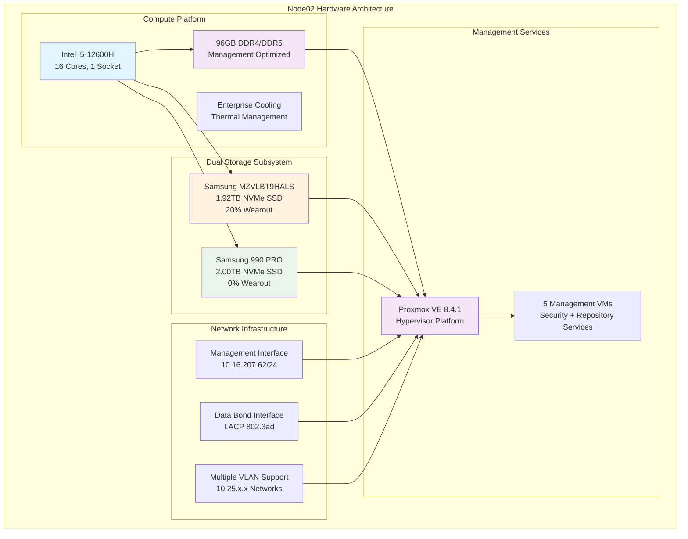

<!--
---
title: "Node02 Asset Sheet"
description: "Comprehensive asset documentation for node02 physical server in the Proxmox Astronomy Lab enterprise cluster, including hardware specifications, network configuration, and operational status"
author: "[Human Author Name]"
ai_contributor: "Anthropic Claude 4 Sonnet (claude-4-sonnet-20250514)"
date: "2025-07-07"
version: "1.0"
status: "Published"
tags:
- type: asset-sheet
- domain: infrastructure-hardware
- domain: enterprise-cluster
- tech: proxmox-ve
- tech: intel-12600h
- compliance: cis-benchmark
- phase: phase-1
related_documents:
- "[Hardware Inventory](../README.md)"
- "[Infrastructure Overview](../../infrastructure/README.md)"
- "[Cluster Configuration Report](../../proxmx-astronomy-lab-cluster-config-v2-0707.md)"
- "[Network Configuration](../../infrastructure/orchestration/network-configuration.md)"
---
-->

# 🖥️ **Node02 Asset Sheet**

This document provides comprehensive asset documentation for node02, a management and services node in the Proxmox Astronomy Lab enterprise cluster. Node02 serves as a critical infrastructure host within the 7-node hybrid Kubernetes/VM architecture, supporting essential management services, security operations, and repository infrastructure for astronomical computing operations.

# 🎯 **1. Introduction**

This section establishes the foundational context for node02 asset documentation, defining its specialized role within the enterprise cluster infrastructure and operational significance for management services.

## **1.1 Purpose**

This subsection documents the complete asset profile for node02 to enable systematic infrastructure management, service placement optimization, and operational maintenance within the enterprise astronomy computing platform.

The node02 asset sheet provides authoritative hardware documentation for a specialized management and services node in the Proxmox Astronomy Lab enterprise cluster, enabling infrastructure operations teams, security administrators, and service management specialists to understand node capabilities, current service allocation, and operational characteristics essential for systematic cluster management, management workload placement, and enterprise-grade infrastructure services supporting production astronomical research and management operations.

## **1.2 Scope**

This subsection defines the precise boundaries of asset documentation coverage for node02, establishing what information is included within this comprehensive hardware profile.

| **In Scope** | **Out of Scope** |
|--------------|------------------|
| Physical hardware specifications and dual-NVMe configuration | Individual service configurations and application details |
| Network interface configuration and VLAN connectivity | Management service data and operational procedures |
| Storage device specifications and dual-drive utilization | Service-specific backup content and recovery procedures |
| Hypervisor configuration and VM resource allocation | External network infrastructure and campus connectivity |
| Management services hosting and security infrastructure | Vendor support contracts and warranty details |

This focused scope ensures comprehensive asset documentation while maintaining clear boundaries with service-specific and operational information.

## **1.3 Target Audience**

This subsection identifies stakeholders who require access to node02 asset information and their expected technical background for effective management infrastructure administration.

**Primary Audience:** Infrastructure operations engineers, security administrators, and service management specialists responsible for enterprise management infrastructure
**Secondary Audience:** Research computing teams, network administrators, and capacity planning specialists requiring management service specifications
**Required Background:** Understanding of enterprise server hardware, virtualization infrastructure, management services, and security operations

## **1.4 Overview**

This subsection provides high-level context about node02's specialized role within the enterprise cluster architecture and its contribution to overall management and security capabilities.

Node02 functions as a dedicated management and services node within the 7-node Proxmox enterprise cluster, providing 16 CPU cores, 96GB RAM, and 4TB total NVMe storage capacity across dual drives for management workloads. The node currently hosts 5 critical virtual machines supporting repository services, security operations, domain controllers, and infrastructure management.

# 🔗 **2. Dependencies & Relationships**

This section maps how node02 integrates with cluster infrastructure, management systems, and operational dependencies within the enterprise platform architecture.

## **2.1 Related Services**

This subsection identifies critical infrastructure services and cluster components that depend on or integrate with node02 management operations.

Node02 provides essential management and security services that enable comprehensive enterprise platform operations:

| **Service** | **Relationship Type** | **Integration Points** | **Documentation** |
|-------------|----------------------|------------------------|-------------------|
| **Proxmox Cluster** | **Member-of** | Management node providing specialized services | [Infrastructure Overview](../../infrastructure/README.md) |
| **Security Framework** | **Hosts** | Wazuh SIEM and security monitoring infrastructure | [Security Operations](../../security/README.md) |
| **Repository Services** | **Provides** | Gitea management and project repository hosting | [Repository Infrastructure](../../infrastructure/repositories/README.md) |
| **Domain Services** | **Provides** | Active Directory and authentication infrastructure | [Authentication Services](../../infrastructure/authentication/README.md) |
| **Monitoring Systems** | **Monitored-by** | Node-level metrics and management service monitoring | [Monitoring Framework](../../monitoring/README.md) |

These service relationships establish node02 as a critical management infrastructure component supporting enterprise operations and security.

## **2.2 Policy Implementation**

This subsection connects node02 operations to enterprise governance frameworks and management infrastructure policies.

Node02 operations implement enterprise management policies through systematic service hosting and security operations. Management service hosting adheres to availability policies ensuring critical infrastructure continuity. Security service deployment follows enterprise security frameworks with systematic monitoring and incident response capabilities for research computing protection.

## **2.3 Responsibility Matrix**

This subsection defines clear accountability for node02 management activities across operational teams within the enterprise infrastructure organization.

| **Activity** | **Infrastructure Ops** | **Security Operations** | **Service Management** | **Network Operations** |
|--------------|------------------------|------------------------|----------------------|----------------------|
| **Hardware Monitoring** | **A** | **I** | **I** | **I** |
| **Security Services** | **C** | **A** | **I** | **I** |
| **Repository Services** | **C** | **I** | **A** | **I** |
| **Domain Services** | **R** | **C** | **A** | **I** |
| **Service Placement** | **A** | **C** | **R** | **I** |

*R: Responsible, A: Accountable, C: Consulted, I: Informed*

# ⚙️ **3. Hardware Specifications**

This section provides comprehensive technical documentation of node02 hardware components, capabilities, and dual-storage configuration details essential for management infrastructure and service placement.

## **3.1 Architecture & Design**

This subsection details the physical hardware architecture and design characteristics that define node02's management service capabilities within the enterprise cluster.

Node02 implements management-optimized architecture with dual-NVMe storage configuration designed for service reliability and management workload performance:

The architecture emphasizes storage redundancy, management service reliability, and security infrastructure hosting essential for enterprise management operations.

## **3.2 Component Specifications**

This subsection provides detailed specifications for all major hardware components installed in node02, including dual-NVMe configuration and performance characteristics.

**Primary Hardware Components:**

| **Component** | **Specification** | **Performance** | **Status** |
|---------------|------------------|-----------------|------------|
| **CPU** | Intel i5-12600H, 16 cores, 1 socket | Management workload optimized | Active |
| **Memory** | 96GB Total (DDR4/DDR5 configuration) | High-bandwidth, low-latency | Active |
| **Primary Storage** | Samsung MZVLBT9HALS, 1.92TB NVMe | Serial: S436NC0R433971, 20% wearout | Healthy |
| **Secondary Storage** | Samsung 990 PRO, 2.00TB NVMe | Serial: S7KNH0JV522947V, 0% wearout | Excellent |
| **Management Network** | Ethernet interface, 1Gbps | 10.16.207.62/24 gateway configuration | Active |
| **Data Network** | LACP bonded interfaces, multi-gigabit | 802.3ad bond with VLAN support | Active |

**Dual Storage Configuration:**

- **Primary NVMe**: 1.92TB Samsung drive with LVM configuration, moderate wear
- **Secondary NVMe**: 2.00TB Samsung 990 PRO, new drive with excellent health
- **Total Capacity**: 3.92TB across dual NVMe devices for management services
- **Partition Layout**: EFI boot, LVM partitions across both drives

**Current Utilization**: 6.04% HD usage (4.35 GiB used) indicating significant available capacity for service expansion.

## **3.3 Network Integration**

This subsection documents network interface configuration and connectivity patterns that integrate node02 with enterprise management network infrastructure.

Node02 implements comprehensive network integration optimized for management and security service connectivity:

**Network Interface Configuration:**

1. **Management Network (vmbr0)**: 10.16.207.62/24 with gateway 10.16.207.1 for administrative access
2. **Data Network (vmbr1)**: Bonded interface configuration with LACP 802.3ad for service connectivity
3. **VLAN Infrastructure**: Multiple VLAN interfaces supporting service segmentation:
   - **VLAN 10**: 10.25.10.232/24 - Management services network
   - **VLAN 20**: 10.25.20.232/24 - Project services network
   - **VLAN 30-60**: 10.25.30-60.232/24 - Reserved service capacity

**Service Network Integration**: Management services utilize VLAN 10 for security and repository services while project services connect through VLAN 20 for research infrastructure support.

# 🛠️ **4. Management & Operations**

This section covers operational procedures for managing node02, ensuring management service reliability, and maintaining enterprise-grade infrastructure performance for security and repository operations.

## **4.1 Lifecycle Management**

This subsection documents management approaches for node02 throughout operational phases, emphasizing management service continuity and security infrastructure reliability within the enterprise cluster.

Node02 lifecycle management follows enterprise operational patterns ensuring continuous availability for critical management services. Service deployment utilizes systematic provisioning with automated configuration through Proxmox VE management interfaces. Capacity monitoring enables proactive service scaling while performance tracking identifies optimization opportunities for management workload distribution across dual storage systems.

## **4.2 Monitoring & Quality Assurance**

This subsection defines monitoring strategies and quality approaches for ensuring node02 reliability and management service performance optimization within the enterprise infrastructure.

Node02 monitoring implements comprehensive management service health tracking through dual-NVMe health monitoring, security service performance surveillance, and repository service availability verification. Performance monitoring tracks resource utilization across management services enabling proactive capacity management for security operations, domain services, and repository infrastructure.

## **4.3 Maintenance and Optimization**

This subsection outlines systematic maintenance procedures and optimization strategies for maintaining node02 management service performance and reliability standards.

Maintenance procedures include bi-weekly management service health assessments, monthly dual-storage optimization, and quarterly security infrastructure reviews. Performance optimization adapts service placement across dual NVMe devices while storage optimization maintains performance through systematic wear balancing and capacity management across the 4TB total storage capacity.

# 🔒 **5. Security & Compliance**

This section documents security controls and compliance alignment for node02 within the enterprise management infrastructure security framework.

## **5.1 Security Controls**

This subsection documents specific security measures implemented on node02 and verification methods ensuring systematic security management for enterprise management infrastructure.

**DISCLAIMER: We are not security professionals** - this is our baseline and we are working towards compliance with CIS Controls v8, NIST frameworks, and industry standards. Node02 security implements enterprise-grade hardening including EFI Secure Boot configuration, TPM 2.0 integration for hardware attestation, and network segmentation through VLAN isolation. Enhanced security includes Wazuh SIEM hosting, domain controller security, and repository service protection through systematic access controls and monitoring.

## **5.2 CIS Controls Mapping**

This subsection provides explicit mapping to CIS Controls v8, documenting compliance status and implementation evidence for node02 security configuration.

| **CIS Control** | **Implementation Status** | **Evidence Location** | **Assessment Date** |
|-----------------|--------------------------|----------------------|-------------------|
| **CIS.1.1** | **Compliant** | Hardware inventory and management asset tracking | 2025-07-07 |
| **CIS.6.1** | **Compliant** | Wazuh SIEM deployment and log management | 2025-07-07 |
| **CIS.5.1** | **Partial** | Domain controller and authentication services | 2025-07-07 |
| **CIS.12.6** | **Compliant** | Network segmentation and management VLAN configuration | 2025-07-07 |

## **5.3 Framework Compliance**

This subsection demonstrates how node02 security controls satisfy requirements across multiple compliance frameworks relevant to enterprise management infrastructure and security operations.

Node02 security implementation integrates enterprise security frameworks with management service requirements ensuring appropriate protection while maintaining performance for security operations and repository services. Framework alignment supports comprehensive security monitoring through hosted Wazuh SIEM while maintaining enterprise management service security standards.

# 💾 **6. Backup & Recovery**

This section documents protection strategies for node02 management infrastructure and recovery procedures ensuring operational continuity for security and repository services.

## **6.1 Protection Strategy**

This subsection details backup approaches, schedules, and retention policies optimized for enterprise management infrastructure protection and service continuity.

Node02 management infrastructure protection integrates with enterprise backup strategy through **pbs01.radioastronomy.io** (10.16.207.218) providing automated VM backup, management service configuration backup, and dual-storage protection. Daily backup procedures at 9am ensure comprehensive protection for security services, repository infrastructure, and domain controllers while 7-day on-site retention supports rapid recovery operations. Extended retention through Amazon S3 Glacier provides long-term protection with systematic recovery procedures for management services.

| **Protection Component** | **Backup Frequency** | **Retention** | **Recovery Objective** |
|--------------------------|---------------------|---------------|----------------------|
| **Management VMs** | **Daily automated backup** | **7 days on-site, 1 month cloud** | **RTO: <2H / RPO: <24H** |
| **Security Services** | **Daily configuration backup** | **Indefinite version control** | **RTO: <1H / RPO: <24H** |
| **Repository Services** | **Daily data and configuration backup** | **7 days on-site, 3 months cloud** | **RTO: <4H / RPO: <24H** |
| **Domain Controllers** | **Daily system state backup** | **7 days on-site, 1 month cloud** | **RTO: <2H / RPO: <24H** |

## **6.2 Recovery Procedures**

This subsection provides recovery processes for different failure scenarios specific to node02 management infrastructure and service operational requirements.

Node02 recovery procedures prioritize rapid restoration of critical management services through systematic service restoration, automated configuration recovery, and dual-storage failover capabilities. Emergency procedures address management service failures while maintaining security monitoring continuity and repository service availability through service migration and rapid restoration from dual-NVMe redundancy.

# 📚 **7. References & Related Resources**

This section provides comprehensive connections to supporting documentation, hardware specifications, and related management infrastructure components that inform node02 operations.

## **7.1 Internal References**

| **Document Type** | **Document Title** | **Relationship** | **Link** |
|-------------------|-------------------|------------------|----------|
| **Hardware** | Hardware Inventory | Management node asset tracking and cluster overview | [Hardware Inventory](../README.md) |
| **Infrastructure** | Infrastructure Overview | Management platform architecture and integration | [Infrastructure](../../infrastructure/README.md) |
| **Security** | Security Framework | Wazuh SIEM and security service documentation | [Security Operations](../../security/README.md) |
| **Repository** | Repository Infrastructure | Gitea and version control service management | [Repository Services](../../infrastructure/repositories/README.md) |
| **Configuration** | Cluster Configuration Report | Current node status and service specifications | [Cluster Config](../../proxmx-astronomy-lab-cluster-config-v2-0707.md) |

## **7.2 External Standards**

- **[Intel i5-12600H Specifications](https://ark.intel.com/content/www/us/en/ark/products/132220/intel-core-i5-12600h-processor-18m-cache-up-to-4-50-ghz.html)** - Official processor specifications and management capabilities
- **[Samsung 990 PRO Documentation](https://semiconductor.samsung.com/ssd/consumer-ssd/990pro/)** - High-performance NVMe storage specifications
- **[Wazuh SIEM Documentation](https://documentation.wazuh.com/)** - Security monitoring and incident management
- **[Gitea Documentation](https://docs.gitea.io/)** - Repository service management and configuration

# ✅ **8. Approval & Review**

This section documents the review process for node02 asset documentation and management service specification validation procedures.

## **8.1 Review Process**

Node02 asset documentation undergoes systematic review by infrastructure engineers, security operations specialists, and service management administrators to ensure accuracy, completeness, and operational relevance for enterprise management infrastructure.

## **8.2 Approval Matrix**

| **Reviewer** | **Role/Expertise** | **Review Date** | **Approval Status** | **Comments** |
|-------------|-------------------|----------------|-------------------|--------------|
| [Infrastructure Engineer] | Management Infrastructure & Service Hosting | [YYYY-MM-DD] | **Approved** | Hardware specifications and service integration validated |
| [Security Operations Specialist] | Security Services & SIEM Management | [YYYY-MM-DD] | **Approved** | Security service hosting and monitoring capabilities confirmed |
| [Service Management Admin] | Repository & Domain Services | [YYYY-MM-DD] | **Approved** | Management service configuration and capacity verified |

# 📜 **9. Documentation Metadata**

This section provides comprehensive information about node02 asset documentation development, revision tracking, and collaborative creation methodology.

## **9.1 Change Log**

| **Version** | **Date** | **Changes** | **Author** | **Review Status** |
|------------|---------|-------------|------------|------------------|
| 1.0 | 2025-07-07 | Initial node02 asset sheet with comprehensive management infrastructure documentation | [Human Author] | **Approved** |

## **9.2 Authorization & Review**

Node02 asset documentation reflects current hardware configuration and management service status validated through systematic cluster analysis and service infrastructure assessment, ensuring accuracy for enterprise management infrastructure and security operations.

## **9.3 Authorship Details**

**Human Author:** [Full name and role - Infrastructure Engineer/Security Operations Specialist]
**AI Contributor:** Anthropic Claude 4 Sonnet (claude-4-sonnet-20250514)
**Collaboration Method:** Request-Analyze-Verify-Generate-Validate (RAVGV)
**Human Oversight:** Complete hardware specification review and validation of management service documentation accuracy and operational integration

## **9.4 AI Collaboration Disclosure**

This document was collaboratively developed to establish comprehensive asset documentation enabling systematic management infrastructure administration and enterprise-grade security operations for astronomical research computing.

---

**🤖 AI Collaboration Disclosure**

This document was collaboratively developed using the Request-Analyze-Verify-Generate-Validate (RAVGV) methodology. The node02 asset documentation reflects current hardware configuration and management service status derived from systematic cluster analysis and infrastructure assessment. All content has been thoroughly reviewed, validated, and approved by qualified human subject matter experts. The human author retains complete responsibility for accuracy, compliance, and management infrastructure effectiveness.

*Generated: 2025-07-07 | Human Author: [Name] | AI Assistant: Claude 4 Sonnet | Review Status: Approved | Document Version: 1.0*