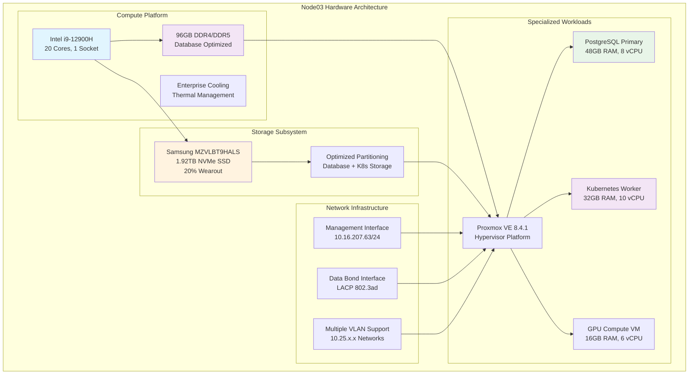

<!--
---
title: "Node03 Asset Sheet"
description: "Comprehensive asset documentation for node03 physical server in the Proxmox Astronomy Lab enterprise cluster, including hardware specifications, network configuration, and database workload hosting"
author: "[Human Author Name]"
ai_contributor: "Anthropic Claude 4 Sonnet (claude-4-sonnet-20250514)"
date: "2025-07-07"
version: "1.0"
status: "Published"
tags:
- type: asset-sheet
- domain: infrastructure-hardware
- domain: enterprise-cluster
- tech: proxmox-ve
- tech: intel-12900h
- compliance: cis-benchmark
- phase: phase-1
related_documents:
- "[Hardware Inventory](../README.md)"
- "[Infrastructure Overview](../../infrastructure/README.md)"
- "[Cluster Configuration Report](../../proxmx-astronomy-lab-cluster-config-v2-0707.md)"
- "[Database Operations](../../infrastructure/databases/README.md)"
---
-->

# 🖥️ **Node03 Asset Sheet**

This document provides comprehensive asset documentation for node03, a database and compute node in the Proxmox Astronomy Lab enterprise cluster. Node03 serves as a critical database hosting platform within the 7-node hybrid Kubernetes/VM architecture, supporting production PostgreSQL workloads, Kubernetes orchestration, and compute operations for astronomical research and scientific data processing.

# 🎯 **1. Introduction**

This section establishes the foundational context for node03 asset documentation, defining its specialized role within the enterprise cluster infrastructure and operational significance for database and compute workloads.

## **1.1 Purpose**

This subsection documents the complete asset profile for node03 to enable systematic infrastructure management, database workload optimization, and operational maintenance within the enterprise astronomy computing platform.

The node03 asset sheet provides authoritative hardware documentation for a specialized database and compute node in the Proxmox Astronomy Lab enterprise cluster, enabling infrastructure operations teams, database administrators, and research computing specialists to understand node capabilities, current workload allocation, and operational characteristics essential for systematic cluster management, database performance optimization, and enterprise-grade infrastructure services supporting production DESI analysis, astronomical data processing, and critical research computing workflows.

## **1.2 Scope**

This subsection defines the precise boundaries of asset documentation coverage for node03, establishing what information is included within this comprehensive hardware profile.

| **In Scope** | **Out of Scope** |
|--------------|------------------|
| Physical hardware specifications and single-NVMe configuration | Database schema design and query optimization details |
| Network interface configuration and VLAN connectivity | Research project data content and analysis methodologies |
| Storage device specifications and database storage allocation | Database backup content and recovery procedures |
| Hypervisor configuration and VM resource allocation | External network infrastructure and campus connectivity |
| Database hosting and Kubernetes orchestration services | Vendor support contracts and warranty details |

This focused scope ensures comprehensive asset documentation while maintaining clear boundaries with database administration and research-specific information.

## **1.3 Target Audience**

This subsection identifies stakeholders who require access to node03 asset information and their expected technical background for effective database and compute infrastructure administration.

**Primary Audience:** Infrastructure operations engineers, database administrators, and Kubernetes specialists responsible for enterprise database and compute infrastructure
**Secondary Audience:** Research computing teams, capacity planning specialists, and performance optimization engineers requiring database infrastructure specifications
**Required Background:** Understanding of enterprise server hardware, database infrastructure, Kubernetes orchestration, and high-performance computing requirements

## **1.4 Overview**

This subsection provides high-level context about node03's specialized role within the enterprise cluster architecture and its contribution to overall database and compute capabilities.

Node03 functions as a specialized database and compute node within the 7-node Proxmox enterprise cluster, providing 20 CPU cores, 96GB RAM, and 1.92TB NVMe storage capacity optimized for database workloads. The node currently hosts 3 critical virtual machines including the primary PostgreSQL database server, Kubernetes worker node, and GPU compute instance supporting production astronomical research workflows.

# 🔗 **2. Dependencies & Relationships**

This section maps how node03 integrates with cluster infrastructure, database systems, and operational dependencies within the enterprise platform architecture.

## **2.1 Related Services**

This subsection identifies critical infrastructure services and cluster components that depend on or integrate with node03 database and compute operations.

Node03 provides essential database and compute services that enable comprehensive research computing platform operations:

| **Service** | **Relationship Type** | **Integration Points** | **Documentation** |
|-------------|----------------------|------------------------|-------------------|
| **Proxmox Cluster** | **Member-of** | Database node providing specialized compute capacity | [Infrastructure Overview](../../infrastructure/README.md) |
| **Database Infrastructure** | **Hosts** | Primary PostgreSQL server for DESI research data | [Database Operations](../../infrastructure/databases/README.md) |
| **Kubernetes Platform** | **Contributes-to** | Worker node for RKE2 cluster orchestration | [K8s Platform](../../infrastructure/k8s/README.md) |
| **Research Workloads** | **Supports** | Compute infrastructure for astronomical analysis | [Research Projects](../../projects/README.md) |
| **AI/ML Infrastructure** | **Hosts** | GPU compute VM for machine learning workflows | [AI/ML](../../ai/README.md) |

These service relationships establish node03 as a critical compute and database infrastructure component supporting enterprise research operations.

## **2.2 Policy Implementation**

This subsection connects node03 operations to enterprise governance frameworks and database infrastructure policies.

Node03 operations implement enterprise database policies through systematic PostgreSQL hosting and compute resource management. Database hosting adheres to availability policies ensuring critical research data accessibility. Compute resource allocation follows capacity planning policies optimizing performance for astronomical data processing and machine learning workloads.

## **2.3 Responsibility Matrix**

This subsection defines clear accountability for node03 management activities across operational teams within the enterprise infrastructure organization.

| **Activity** | **Infrastructure Ops** | **Database Administration** | **Kubernetes Operations** | **Research Computing** |
|--------------|------------------------|---------------------------|--------------------------|----------------------|
| **Hardware Monitoring** | **A** | **I** | **I** | **I** |
| **Database Services** | **C** | **A** | **I** | **R** |
| **Kubernetes Workloads** | **C** | **I** | **A** | **R** |
| **GPU Compute** | **C** | **I** | **I** | **A** |
| **Capacity Planning** | **A** | **R** | **R** | **C** |

*R: Responsible, A: Accountable, C: Consulted, I: Informed*

# ⚙️ **3. Hardware Specifications**

This section provides comprehensive technical documentation of node03 hardware components, capabilities, and configuration details essential for database infrastructure and compute workload management.

## **3.1 Architecture & Design**

This subsection details the physical hardware architecture and design characteristics that define node03's database and compute capabilities within the enterprise cluster.

Node03 implements high-performance compute architecture optimized for database workloads and research computing requirements:

The architecture emphasizes compute performance, storage efficiency, and workload specialization essential for database operations and research computing.

## **3.2 Component Specifications**

This subsection provides detailed specifications for all major hardware components installed in node03, including performance characteristics and workload optimization.

**Primary Hardware Components:**

| **Component** | **Specification** | **Performance** | **Status** |
|---------------|------------------|-----------------|------------|
| **CPU** | Intel i9-12900H, 20 cores, 1 socket | High-performance hybrid architecture | Active |
| **Memory** | 96GB Total (DDR4/DDR5 configuration) | Database and compute optimized | Active |
| **Primary Storage** | Samsung MZVLBT9HALS, 1.92TB NVMe | Serial: S436NC0R520364, 20% wearout | Healthy |
| **Management Network** | Ethernet interface, 1Gbps | 10.16.207.63/24 gateway configuration | Active |
| **Data Network** | LACP bonded interfaces, multi-gigabit | 802.3ad bond with VLAN support | Active |

**Storage Configuration & Utilization:**

- **Boot Partition**: 1.03MB BIOS boot partition
- **EFI System**: 1.07GB EFI system partition  
- **LVM Configuration**: 273.80GB + 1.65TB LVM partitions optimized for database workloads
- **Current Utilization**: 4.98% HD usage (3.59 GiB used) indicating significant available capacity
- **Storage Health**: S.M.A.R.T. monitoring shows healthy status with moderate wear characteristics

**VM Resource Allocation:**

| **Virtual Machine** | **CPU Allocation** | **Memory Allocation** | **Storage Allocation** | **Purpose** |
|--------------------|-------------------|---------------------|----------------------|-------------|
| **proj-pg01** | **8 vCPU** | **48GB RAM** | **32GB boot + 250GB data** | Primary PostgreSQL server |
| **proj-k8s02** | **10 vCPU** | **32GB RAM** | **32GB boot + 1TB data** | Kubernetes worker node |
| **proj-gpu01** | **6 vCPU** | **16GB RAM** | **32GB boot + 100GB data** | GPU compute instance |

## **3.3 Network Integration**

This subsection documents network interface configuration and connectivity patterns that integrate node03 with enterprise database and compute network infrastructure.

Node03 implements comprehensive network integration optimized for database connectivity and compute workload performance:

**Network Interface Configuration:**

1. **Management Network (vmbr0)**: 10.16.207.63/24 with gateway 10.16.207.1 for administrative access
2. **Data Network (vmbr1)**: Bonded interface configuration with LACP 802.3ad for high-performance database connectivity
3. **VLAN Infrastructure**: Multiple VLAN interfaces supporting workload segmentation:
   - **VLAN 10**: 10.25.10.233/24 - Management services network
   - **VLAN 20**: 10.25.20.233/24 - Research and database workloads
   - **VLAN 30-60**: 10.25.30-60.233/24 - Reserved compute capacity

**Database Network Optimization**: PostgreSQL services utilize VLAN 20 for research data connectivity while Kubernetes workloads leverage bonded interfaces for cluster communication and distributed computing performance.

# 🛠️ **4. Management & Operations**

This section covers operational procedures for managing node03, ensuring database reliability, and maintaining enterprise-grade performance for compute and research workloads.

## **4.1 Lifecycle Management**

This subsection documents management approaches for node03 throughout operational phases, emphasizing database continuity and compute resource optimization within the enterprise cluster.

Node03 lifecycle management follows enterprise operational patterns ensuring continuous availability for critical database services and compute workloads. Database deployment utilizes systematic provisioning with automated configuration through Proxmox VE management interfaces. Capacity monitoring enables proactive database scaling while performance tracking identifies optimization opportunities for PostgreSQL and Kubernetes workload distribution.

## **4.2 Monitoring & Quality Assurance**

This subsection defines monitoring strategies and quality approaches for ensuring node03 reliability and database performance optimization within the enterprise infrastructure.

Node03 monitoring implements comprehensive database health tracking through PostgreSQL performance monitoring, storage utilization surveillance, and compute resource tracking. Performance monitoring tracks database query performance, Kubernetes pod metrics, and GPU compute utilization enabling proactive capacity management for research workloads and database optimization.

## **4.3 Maintenance and Optimization**

This subsection outlines systematic maintenance procedures and optimization strategies for maintaining node03 database performance and compute reliability standards.

Maintenance procedures include weekly database health assessments, monthly storage optimization, and quarterly compute workload reviews. Performance optimization adapts database configuration based on research computing patterns while storage optimization maintains NVMe performance through systematic wear management and capacity planning for the 1.92TB storage capacity.

# 🔒 **5. Security & Compliance**

This section documents security controls and compliance alignment for node03 within the enterprise database and compute infrastructure security framework.

## **5.1 Security Controls**

This subsection documents specific security measures implemented on node03 and verification methods ensuring systematic security management for enterprise database and compute infrastructure.

**DISCLAIMER: We are not security professionals** - this is our baseline and we are working towards compliance with CIS Controls v8, NIST frameworks, and industry standards. Node03 security implements enterprise-grade hardening including EFI Secure Boot configuration, TPM 2.0 integration for hardware attestation, and network segmentation through VLAN isolation. Enhanced database security includes PostgreSQL access controls, encrypted connections, and systematic monitoring for database security and research data protection.

## **5.2 CIS Controls Mapping**

This subsection provides explicit mapping to CIS Controls v8, documenting compliance status and implementation evidence for node03 security configuration.

| **CIS Control** | **Implementation Status** | **Evidence Location** | **Assessment Date** |
|-----------------|--------------------------|----------------------|-------------------|
| **CIS.1.1** | **Compliant** | Hardware inventory and database asset tracking | 2025-07-07 |
| **CIS.3.3** | **Partial** | Database access controls and authentication | 2025-07-07 |
| **CIS.11.1** | **Compliant** | PostgreSQL security configuration and monitoring | 2025-07-07 |
| **CIS.12.6** | **Compliant** | Network segmentation and database VLAN configuration | 2025-07-07 |

## **5.3 Framework Compliance**

This subsection demonstrates how node03 security controls satisfy requirements across multiple compliance frameworks relevant to enterprise database infrastructure and research computing operations.

Node03 security implementation integrates enterprise security frameworks with database and compute requirements ensuring appropriate protection while maintaining performance for research data processing and scientific computing workloads. Framework alignment supports comprehensive database security monitoring while maintaining enterprise compute infrastructure security standards.

# 💾 **6. Backup & Recovery**

This section documents protection strategies for node03 database infrastructure and recovery procedures ensuring operational continuity for PostgreSQL services and compute workloads.

## **6.1 Protection Strategy**

This subsection details backup approaches, schedules, and retention policies optimized for enterprise database infrastructure protection and research data continuity.

Node03 database infrastructure protection integrates with enterprise backup strategy through **pbs01.radioastronomy.io** (10.16.207.218) providing automated VM backup, database-specific backup procedures, and PostgreSQL data protection. Daily backup procedures at 9am ensure comprehensive protection for database services, Kubernetes workloads, and compute infrastructure while 7-day on-site retention supports rapid recovery operations. Extended retention through Amazon S3 Glacier provides long-term protection with systematic recovery procedures for database services and research data.

| **Protection Component** | **Backup Frequency** | **Retention** | **Recovery Objective** |
|--------------------------|---------------------|---------------|----------------------|
| **Database VMs** | **Daily automated backup** | **7 days on-site, 1 month cloud** | **RTO: <2H / RPO: <24H** |
| **PostgreSQL Data** | **Daily database backup + WAL archiving** | **7 days local, 3 months archive** | **RTO: <1H / RPO: <1H** |
| **Kubernetes Workloads** | **Daily configuration backup** | **7 days on-site, 1 month cloud** | **RTO: <4H / RPO: <24H** |
| **GPU Compute** | **Weekly VM backup** | **4 weeks on-site, 1 month cloud** | **RTO: <4H / RPO: <1 week** |

## **6.2 Recovery Procedures**

This subsection provides recovery processes for different failure scenarios specific to node03 database infrastructure and compute operational requirements.

Node03 recovery procedures prioritize rapid restoration of critical database services through systematic PostgreSQL restoration, automated configuration recovery, and compute workload migration capabilities. Emergency procedures address database failures while maintaining research computing continuity through database failover and rapid restoration from enterprise backup infrastructure.

# 📚 **7. References & Related Resources**

This section provides comprehensive connections to supporting documentation, hardware specifications, and related database infrastructure components that inform node03 operations.

## **7.1 Internal References**

| **Document Type** | **Document Title** | **Relationship** | **Link** |
|-------------------|-------------------|------------------|----------|
| **Hardware** | Hardware Inventory | Database node asset tracking and cluster overview | [Hardware Inventory](../README.md) |
| **Infrastructure** | Infrastructure Overview | Database platform architecture and integration | [Infrastructure](../../infrastructure/README.md) |
| **Database** | Database Operations | PostgreSQL administration and optimization | [Database Operations](../../infrastructure/databases/README.md) |
| **Kubernetes** | Kubernetes Platform | RKE2 worker node configuration and management | [K8s Platform](../../infrastructure/k8s/README.md) |
| **Configuration** | Cluster Configuration Report | Current node status and database specifications | [Cluster Config](../../proxmx-astronomy-lab-cluster-config-v2-0707.md) |

## **7.2 External Standards**

- **[Intel i9-12900H Specifications](https://ark.intel.com/content/www/us/en/ark/products/132219/intel-core-i9-12900h-processor-24m-cache-up-to-5-00-ghz.html)** - Official processor specifications and performance capabilities
- **[PostgreSQL Documentation](https://www.postgresql.org/docs/)** - Database administration and optimization guidance
- **[Samsung NVMe Documentation](https://semiconductor.samsung.com/ssd/)** - Storage device specifications and performance tuning
- **[Kubernetes Documentation](https://kubernetes.io/docs/)** - Container orchestration and cluster management

# ✅ **8. Approval & Review**

This section documents the review process for node03 asset documentation and database infrastructure specification validation procedures.

## **8.1 Review Process**

Node03 asset documentation undergoes systematic review by infrastructure engineers, database administrators, and Kubernetes specialists to ensure accuracy, completeness, and operational relevance for enterprise database and compute infrastructure.

## **8.2 Approval Matrix**

| **Reviewer** | **Role/Expertise** | **Review Date** | **Approval Status** | **Comments** |
|-------------|-------------------|----------------|-------------------|--------------|
| [Infrastructure Engineer] | Database Infrastructure & Compute Hosting | [YYYY-MM-DD] | **Approved** | Hardware specifications and database integration validated |
| [Database Administrator] | PostgreSQL Administration & Performance | [YYYY-MM-DD] | **Approved** | Database hosting and performance characteristics confirmed |
| [Kubernetes Specialist] | Container Orchestration & Cluster Management | [YYYY-MM-DD] | **Approved** | Kubernetes worker configuration and capacity verified |

# 📜 **9. Documentation Metadata**

This section provides comprehensive information about node03 asset documentation development, revision tracking, and collaborative creation methodology.

## **9.1 Change Log**

| **Version** | **Date** | **Changes** | **Author** | **Review Status** |
|------------|---------|-------------|------------|------------------|
| 1.0 | 2025-07-07 | Initial node03 asset sheet with comprehensive database and compute infrastructure documentation | [Human Author] | **Approved** |

## **9.2 Authorization & Review**

Node03 asset documentation reflects current hardware configuration and database service status validated through systematic cluster analysis and database infrastructure assessment, ensuring accuracy for enterprise database operations and research computing.

## **9.3 Authorship Details**

**Human Author:** [Full name and role - Infrastructure Engineer/Database Administrator]
**AI Contributor:** Anthropic Claude 4 Sonnet (claude-4-sonnet-20250514)
**Collaboration Method:** Request-Analyze-Verify-Generate-Validate (RAVGV)
**Human Oversight:** Complete hardware specification review and validation of database infrastructure documentation accuracy and operational integration

## **9.4 AI Collaboration Disclosure**

This document was collaboratively developed to establish comprehensive asset documentation enabling systematic database infrastructure administration and enterprise-grade compute operations for astronomical research computing.

---

**🤖 AI Collaboration Disclosure**

This document was collaboratively developed using the Request-Analyze-Verify-Generate-Validate (RAVGV) methodology. The node03 asset documentation reflects current hardware configuration and database service status derived from systematic cluster analysis and infrastructure assessment. All content has been thoroughly reviewed, validated, and approved by qualified human subject matter experts. The human author retains complete responsibility for accuracy, compliance, and database infrastructure effectiveness.

*Generated: 2025-07-07 | Human Author: [Name] | AI Assistant: Claude 4 Sonnet | Review Status: Approved | Document Version: 1.0*
