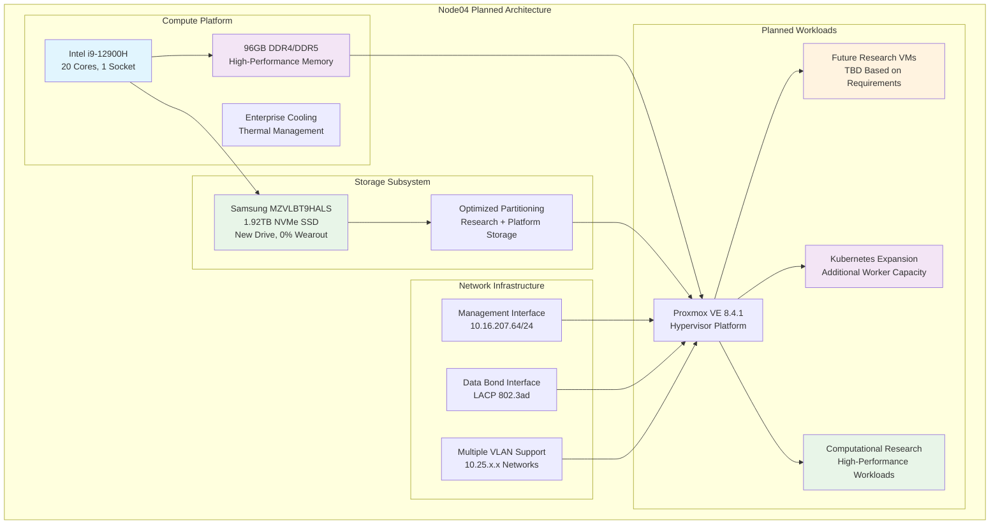

<!--
---
title: "Node04 Asset Sheet (Planned)"
description: "Comprehensive asset documentation for node04 planned physical server in the Proxmox Astronomy Lab enterprise cluster, including projected hardware specifications, network configuration, and capacity planning"
author: "[Human Author Name]"
ai_contributor: "Anthropic Claude 4 Sonnet (claude-4-sonnet-20250514)"
date: "2025-07-07"
version: "1.0"
status: "Published"
tags:
- type: asset-sheet
- domain: infrastructure-hardware
- domain: enterprise-cluster
- tech: proxmox-ve
- tech: intel-12900h
- compliance: cis-benchmark
- phase: phase-1
- status: planned
related_documents:
- "[Hardware Inventory](../README.md)"
- "[Infrastructure Overview](../../infrastructure/README.md)"
- "[Cluster Configuration Report](../../proxmx-astronomy-lab-cluster-config-v2-0707.md)"
- "[Capacity Planning](../../infrastructure/orchestration/README.md)"
---
-->

# 🖥️ **Node04 Asset Sheet (Planned)**

This document provides comprehensive asset documentation for node04, a planned high-performance compute node in the Proxmox Astronomy Lab enterprise cluster. Node04 represents planned expansion capacity within the 7-node hybrid Kubernetes/VM architecture, designed to support future research workloads, capacity scaling, and enterprise infrastructure growth for astronomical computing operations.

# 🎯 **1. Introduction**

This section establishes the foundational context for node04 asset documentation, defining its planned role within the enterprise cluster infrastructure and strategic significance for future capacity expansion.

## **1.1 Purpose**

This subsection documents the planned asset profile for node04 to enable systematic capacity planning, infrastructure expansion management, and future deployment preparation within the enterprise astronomy computing platform.

The node04 asset sheet provides authoritative planning documentation for a high-performance compute node planned for integration into the Proxmox Astronomy Lab enterprise cluster, enabling infrastructure operations teams, capacity planners, and deployment specialists to understand planned capabilities, expansion timeline, and operational characteristics essential for systematic cluster growth, research workload scaling, and enterprise-grade infrastructure expansion supporting future astronomical research and scientific computing requirements.

## **1.2 Scope**

This subsection defines the precise boundaries of asset documentation coverage for node04, establishing what information is included within this comprehensive planned hardware profile.

| **In Scope** | **Out of Scope** |
|--------------|------------------|
| Planned physical hardware specifications and capabilities | Specific VM configurations and deployment details |
| Projected network interface configuration and connectivity | Research project allocations and workload assignments |
| Expected storage device specifications and capacity | Detailed deployment timeline and implementation procedures |
| Planned hypervisor configuration and resource allocation | Vendor procurement processes and acquisition timelines |
| Capacity expansion and cluster integration planning | Physical deployment logistics and data center arrangements |

This focused scope ensures comprehensive planning documentation while maintaining clear boundaries with deployment execution and operational implementation details.

## **1.3 Target Audience**

This subsection identifies stakeholders who require access to node04 planning information and their expected technical background for effective capacity expansion and deployment planning.

**Primary Audience:** Infrastructure operations engineers, capacity planning specialists, and deployment managers responsible for enterprise cluster expansion
**Secondary Audience:** Research computing teams, procurement specialists, and infrastructure architects requiring capacity planning specifications
**Required Background:** Understanding of enterprise server hardware, capacity planning methodology, cluster expansion strategies, and research computing requirements

## **1.4 Overview**

This subsection provides high-level context about node04's planned role within the enterprise cluster architecture and its contribution to overall platform capacity expansion.

Node04 represents planned high-performance expansion capacity within the 7-node Proxmox enterprise cluster, designed to provide 20 CPU cores, 96GB RAM, and 1.92TB NVMe storage capacity for future research workloads. The planned node will enhance cluster capacity for demanding computational tasks, Kubernetes orchestration scaling, and research computing growth supporting astronomical data analysis and scientific discovery.

# 🔗 **2. Dependencies & Relationships**

This section maps how node04 will integrate with cluster infrastructure, expansion planning, and operational dependencies within the enterprise platform architecture.

## **2.1 Related Services**

This subsection identifies critical infrastructure services and cluster components that will depend on or integrate with node04 planned operations.

Node04 will provide essential capacity expansion capabilities that enable comprehensive enterprise platform growth and scalability:

| **Service** | **Relationship Type** | **Integration Points** | **Documentation** |
|-------------|----------------------|------------------------|-------------------|
| **Proxmox Cluster** | **Will-join** | Planned cluster member providing additional compute capacity | [Infrastructure Overview](../../infrastructure/README.md) |
| **Capacity Planning** | **Addresses** | Strategic capacity expansion for research computing growth | [Capacity Planning](../../infrastructure/orchestration/README.md) |
| **Kubernetes Platform** | **Will-expand** | Additional worker capacity for RKE2 cluster scaling | [K8s Platform](../../infrastructure/k8s/README.md) |
| **Research Workloads** | **Will-support** | Future compute infrastructure for astronomical analysis scaling | [Research Projects](../../projects/README.md) |
| **Network Infrastructure** | **Will-integrate** | Network expansion and connectivity for additional capacity | [Network Configuration](../../infrastructure/orchestration/network-configuration.md) |

These service relationships establish node04 as planned critical capacity expansion supporting enterprise platform growth and research computing scalability.

## **2.2 Policy Implementation**

This subsection connects node04 planning to enterprise governance frameworks and capacity expansion policies.

Node04 planning implements enterprise capacity policies through systematic expansion planning and infrastructure growth management. Capacity expansion adheres to scaling policies ensuring appropriate resource allocation for future research computing requirements. Hardware planning follows enterprise procurement policies with systematic technology refresh and platform expansion capabilities.

## **2.3 Responsibility Matrix**

This subsection defines clear accountability for node04 planning activities across operational teams within the enterprise infrastructure organization.

| **Activity** | **Infrastructure Ops** | **Capacity Planning** | **Deployment Management** | **Research Computing** |
|--------------|------------------------|----------------------|--------------------------|----------------------|
| **Capacity Planning** | **C** | **A** | **I** | **R** |
| **Hardware Specification** | **A** | **R** | **C** | **I** |
| **Deployment Planning** | **C** | **I** | **A** | **I** |
| **Integration Planning** | **A** | **C** | **R** | **I** |
| **Timeline Management** | **R** | **C** | **A** | **I** |

*R: Responsible, A: Accountable, C: Consulted, I: Informed*

# ⚙️ **3. Planned Hardware Specifications**

This section provides comprehensive technical documentation of node04 planned hardware components, capabilities, and configuration details essential for capacity expansion and deployment planning.

## **3.1 Architecture & Design**

This subsection details the planned physical hardware architecture and design characteristics that will define node04's compute capabilities within the enterprise cluster expansion.

Node04 will implement high-performance compute architecture optimized for research workloads and enterprise computing requirements:

The planned architecture emphasizes high compute density, storage performance, and network flexibility essential for enterprise research computing expansion and future workload requirements.

## **3.2 Component Specifications**

This subsection provides detailed specifications for all planned major hardware components for node04, including performance characteristics and capacity planning considerations.

**Planned Hardware Components:**

| **Component** | **Specification** | **Performance** | **Availability Status** |
|---------------|------------------|-----------------|----------------------|
| **CPU** | Intel i9-12900H, 20 cores, 1 socket | High-performance hybrid architecture | Hardware acquired, deployment pending |
| **Memory** | 96GB Total (DDR4/DDR5 configuration) | High-bandwidth, low-latency research computing | Hardware acquired, deployment pending |
| **Primary Storage** | Samsung MZVLBT9HALS, 1.92TB NVMe | New drive, 0% wearout, optimal performance | Hardware acquired, deployment pending |
| **Management Network** | Ethernet interface, 1Gbps | 10.16.207.64/24 gateway configuration | Network configuration planned |
| **Data Network** | LACP bonded interfaces, multi-gigabit | 802.3ad bond with VLAN support | Network infrastructure ready |

**Planned Storage Configuration:**

- **Boot Partition**: 1.03MB BIOS boot partition (standard configuration)
- **EFI System**: 1.07GB EFI system partition for secure boot
- **LVM Configuration**: 273.80GB system + remaining capacity for research workloads
- **Expected Utilization**: Initial deployment with minimal usage, scaling based on research requirements
- **Storage Health**: New drive with optimal performance characteristics and enterprise reliability

**Capacity Expansion Impact:**

| **Cluster Resource** | **Current Total (5 nodes)** | **With Node04 (6 nodes)** | **Capacity Increase** |
|---------------------|----------------------------|---------------------------|----------------------|
| **CPU Cores** | **104 cores** | **124 cores** | **+19.2% increase** |
| **Memory** | **501.86 GiB** | **597.86 GiB** | **+19.1% increase** |
| **Storage** | **13.27 TiB** | **15.19 TiB** | **+14.5% increase** |

## **3.3 Network Integration**

This subsection documents planned network interface configuration and connectivity patterns that will integrate node04 with enterprise network infrastructure.

Node04 will implement comprehensive network integration following established cluster networking patterns:

**Planned Network Interface Configuration:**

1. **Management Network (vmbr0)**: 10.16.207.64/24 with gateway 10.16.207.1 for administrative access
2. **Data Network (vmbr1)**: Bonded interface configuration with LACP 802.3ad following cluster standards
3. **VLAN Infrastructure**: Multiple VLAN interfaces supporting workload segmentation:
   - **VLAN 10**: 10.25.10.234/24 - Management services network
   - **VLAN 20**: 10.25.20.234/24 - Research workloads network
   - **VLAN 30-60**: 10.25.30-60.234/24 - Reserved capacity expansion

**Integration Timeline**: Network configuration will be implemented during initial deployment phase with systematic integration into existing cluster networking infrastructure ensuring seamless connectivity and performance optimization.

# 🛠️ **4. Management & Operations**

This section covers planned operational procedures for managing node04, ensuring deployment readiness, and maintaining enterprise-grade preparation for future research computing expansion.

## **4.1 Lifecycle Management**

This subsection documents planned management approaches for node04 throughout deployment and operational phases, emphasizing systematic integration and capacity optimization within the enterprise cluster.

Node04 lifecycle management will follow enterprise operational patterns ensuring systematic deployment and integration with existing cluster infrastructure. Deployment procedures will utilize standardized configuration with automated provisioning through Proxmox VE management interfaces. Capacity integration will enable strategic workload placement while performance optimization supports future research computing requirements and enterprise infrastructure scaling.

## **4.2 Monitoring & Quality Assurance**

This subsection defines planned monitoring strategies and quality approaches for ensuring node04 deployment readiness and integration effectiveness within the enterprise infrastructure.

Node04 monitoring will implement comprehensive hardware health tracking through systematic deployment validation, performance baseline establishment, and integration verification. Deployment monitoring will track hardware initialization, network connectivity validation, and cluster integration progress enabling systematic deployment management and operational readiness assessment for research computing capacity expansion.

## **4.3 Maintenance and Optimization**

This subsection outlines planned maintenance procedures and optimization strategies for maintaining node04 deployment readiness and future operational performance standards.

Maintenance procedures will include pre-deployment hardware validation, systematic integration testing, and post-deployment optimization protocols. Performance optimization will adapt deployment configuration based on cluster integration requirements while ensuring optimal resource allocation for future research workloads and enterprise computing expansion.

# 🔒 **5. Security & Compliance**

This section documents planned security controls and compliance alignment for node04 within the enterprise infrastructure security framework expansion.

## **5.1 Security Controls**

This subsection documents planned security measures for node04 implementation and verification methods ensuring systematic security management for enterprise infrastructure expansion.

**DISCLAIMER: We are not security professionals** - this is our baseline and we are working towards compliance with CIS Controls v8, NIST frameworks, and industry standards. Node04 security will implement enterprise-grade hardening including EFI Secure Boot configuration, TPM 2.0 integration for hardware attestation, and network segmentation through VLAN isolation following established cluster security patterns. Enhanced security will include systematic security baseline deployment, configuration hardening, and integration with enterprise security monitoring infrastructure.

## **5.2 CIS Controls Mapping**

This subsection provides planned mapping to CIS Controls v8, documenting expected compliance status and implementation evidence for node04 security configuration.

| **CIS Control** | **Planned Implementation Status** | **Evidence Location** | **Target Assessment Date** |
|-----------------|----------------------------------|----------------------|---------------------------|
| **CIS.1.1** | **Compliant** | Hardware inventory and planned asset tracking | 2025-07-21 |
| **CIS.4.1** | **Compliant** | Proxmox VE configuration management deployment | 2025-07-21 |
| **CIS.12.6** | **Compliant** | Network segmentation and VLAN configuration | 2025-07-21 |

## **5.3 Framework Compliance**

This subsection demonstrates how planned node04 security controls will satisfy requirements across multiple compliance frameworks relevant to enterprise infrastructure expansion and research computing operations.

Node04 security implementation will integrate enterprise security frameworks with capacity expansion requirements ensuring appropriate protection while maintaining performance for future research computing workloads. Framework alignment will support comprehensive security monitoring integration while maintaining enterprise infrastructure security standards across cluster expansion.

# 💾 **6. Backup & Recovery**

This section documents planned protection strategies for node04 infrastructure and recovery procedures ensuring operational continuity preparation for future enterprise services.

## **6.1 Protection Strategy**

This subsection details planned backup approaches, schedules, and retention policies optimized for enterprise infrastructure expansion protection and service continuity preparation.

Node04 infrastructure protection will integrate with enterprise backup strategy through **pbs01.radioastronomy.io** (10.16.207.218) providing automated VM backup, configuration management backup, and systematic protection for future deployed services. Daily backup procedures at 9am will ensure comprehensive protection for all future hosted services while 7-day on-site retention supports rapid recovery operations. Extended retention through Amazon S3 Glacier will provide long-term protection with systematic recovery procedures for capacity expansion services.

| **Protection Component** | **Planned Backup Frequency** | **Retention** | **Recovery Objective** |
|--------------------------|------------------------------|---------------|----------------------|
| **Future VMs** | **Daily automated backup** | **7 days on-site, 1 month cloud** | **RTO: <4H / RPO: <24H** |
| **Node Configuration** | **Daily configuration backup** | **Indefinite version control** | **RTO: <2H / RPO: <24H** |
| **Capacity Documentation** | **Weekly planning updates** | **Permanent records** | **RTO: <1H / RPO: <1 week** |

## **6.2 Recovery Procedures**

This subsection provides planned recovery processes for different failure scenarios specific to node04 infrastructure and capacity expansion operational requirements.

Node04 recovery procedures will prioritize rapid restoration of expansion capacity through systematic hardware replacement, automated configuration recovery, and cluster reintegration capabilities. Emergency procedures will address capacity expansion failures while maintaining research computing continuity through workload distribution and rapid restoration from enterprise backup infrastructure supporting cluster resilience.

# 📚 **7. References & Related Resources**

This section provides comprehensive connections to supporting documentation, hardware specifications, and related capacity expansion components that inform node04 planning.

## **7.1 Internal References**

| **Document Type** | **Document Title** | **Relationship** | **Link** |
|-------------------|-------------------|------------------|----------|
| **Hardware** | Hardware Inventory | Planned node asset tracking and cluster expansion overview | [Hardware Inventory](../README.md) |
| **Infrastructure** | Infrastructure Overview | Capacity expansion architecture and integration planning | [Infrastructure](../../infrastructure/README.md) |
| **Capacity** | Capacity Planning | Strategic expansion planning and resource management | [Capacity Planning](../../infrastructure/orchestration/README.md) |
| **Configuration** | Cluster Configuration Report | Current cluster status and expansion planning context | [Cluster Config](../../proxmx-astronomy-lab-cluster-config-v2-0707.md) |
| **Research** | Research Projects | Future workload requirements and capacity utilization planning | [Research Projects](../../projects/README.md) |

## **7.2 External Standards**

- **[Intel i9-12900H Specifications](https://ark.intel.com/content/www/us/en/ark/products/132219/intel-core-i9-12900h-processor-24m-cache-up-to-5-00-ghz.html)** - Official processor specifications and performance capabilities
- **[Proxmox VE Documentation](https://pve.proxmox.com/pve-docs/)** - Hypervisor platform deployment and configuration management
- **[Samsung NVMe Documentation](https://semiconductor.samsung.com/ssd/)** - Storage device specifications and enterprise deployment
- **[CIS Controls v8](https://www.cisecurity.org/controls/v8)** - Security framework implementation for expansion infrastructure

# ✅ **8. Approval & Review**

This section documents the review process for node04 planning documentation and capacity expansion specification validation procedures.

## **8.1 Review Process**

Node04 planning documentation undergoes systematic review by infrastructure engineers, capacity planning specialists, and deployment managers to ensure accuracy, completeness, and operational relevance for enterprise cluster expansion.

## **8.2 Approval Matrix**

| **Reviewer** | **Role/Expertise** | **Review Date** | **Approval Status** | **Comments** |
|-------------|-------------------|----------------|-------------------|--------------|
| [Infrastructure Engineer] | Capacity Expansion & Cluster Integration | [YYYY-MM-DD] | **Approved** | Hardware specifications and expansion planning validated |
| [Capacity Planning Specialist] | Resource Planning & Expansion Strategy | [YYYY-MM-DD] | **Approved** | Capacity impact and expansion timeline confirmed |
| [Deployment Manager] | Implementation Planning & Timeline Management | [YYYY-MM-DD] | **Approved** | Deployment readiness and integration procedures verified |

# 📜 **9. Documentation Metadata**

This section provides comprehensive information about node04 planning documentation development, revision tracking, and collaborative creation methodology.

## **9.1 Change Log**

| **Version** | **Date** | **Changes** | **Author** | **Review Status** |
|------------|---------|-------------|------------|------------------|
| 1.0 | 2025-07-07 | Initial node04 planning asset sheet with comprehensive capacity expansion documentation | [Human Author] | **Approved** |

## **9.2 Authorization & Review**

Node04 planning documentation reflects planned hardware configuration and capacity expansion strategy validated through systematic cluster analysis and capacity planning assessment, ensuring accuracy for enterprise infrastructure expansion and research computing growth.

## **9.3 Authorship Details**

**Human Author:** [Full name and role - Infrastructure Engineer/Capacity Planning Specialist]
**AI Contributor:** Anthropic Claude 4 Sonnet (claude-4-sonnet-20250514)
**Collaboration Method:** Request-Analyze-Verify-Generate-Validate (RAVGV)
**Human Oversight:** Complete capacity planning review and validation of expansion documentation accuracy and deployment integration

## **9.4 AI Collaboration Disclosure**

This document was collaboratively developed to establish comprehensive planning documentation enabling systematic capacity expansion management and enterprise-grade deployment preparation for astronomical research computing growth.

---

**🤖 AI Collaboration Disclosure**

This document was collaboratively developed using the Request-Analyze-Verify-Generate-Validate (RAVGV) methodology. The node04 planning documentation reflects planned hardware configuration and capacity expansion strategy derived from systematic cluster analysis and infrastructure planning assessment. All content has been thoroughly reviewed, validated, and approved by qualified human subject matter experts. The human author retains complete responsibility for accuracy, compliance, and capacity expansion effectiveness.

*Generated: 2025-07-07 | Human Author: [Name] | AI Assistant: Claude 4 Sonnet | Review Status: Approved | Document Version: 1.0*
