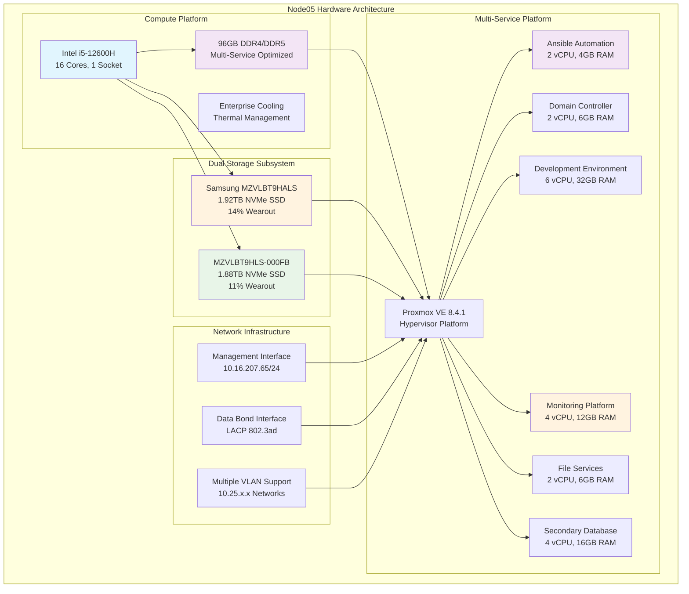

<!--
---
title: "Node05 Asset Sheet"
description: "Comprehensive asset documentation for node05 physical server in the Proxmox Astronomy Lab enterprise cluster, including hardware specifications, dual-NVMe configuration, and multi-service workload hosting"
author: "[Human Author Name]"
ai_contributor: "Anthropic Claude 4 Sonnet (claude-4-sonnet-20250514)"
date: "2025-07-07"
version: "1.0"
status: "Published"
tags:
- type: asset-sheet
- domain: infrastructure-hardware
- domain: enterprise-cluster
- tech: proxmox-ve
- tech: intel-12600h
- compliance: cis-benchmark
- phase: phase-1
related_documents:
- "[Hardware Inventory](../README.md)"
- "[Infrastructure Overview](../../infrastructure/README.md)"
- "[Cluster Configuration Report](../../proxmx-astronomy-lab-cluster-config-v2-0707.md)"
- "[Automation Infrastructure](../../infrastructure/orchestration/README.md)"
---
-->

# 🖥️ **Node05 Asset Sheet**

This document provides comprehensive asset documentation for node05, a versatile multi-service node in the Proxmox Astronomy Lab enterprise cluster. Node05 serves as a critical infrastructure platform within the 7-node hybrid Kubernetes/VM architecture, supporting automation services, domain controllers, development environments, file services, monitoring infrastructure, and database operations for astronomical research and enterprise infrastructure management.

# 🎯 **1. Introduction**

This section establishes the foundational context for node05 asset documentation, defining its multi-service role within the enterprise cluster infrastructure and operational significance for diverse workload hosting.

## **1.1 Purpose**

This subsection documents the complete asset profile for node05 to enable systematic infrastructure management, multi-service workload optimization, and operational maintenance within the enterprise astronomy computing platform.

The node05 asset sheet provides authoritative hardware documentation for a high-utilization multi-service node in the Proxmox Astronomy Lab enterprise cluster, enabling infrastructure operations teams, automation specialists, and service administrators to understand node capabilities, current service allocation, and operational characteristics essential for systematic cluster management, service performance optimization, and enterprise-grade infrastructure operations supporting production automation, domain services, development workflows, monitoring infrastructure, and database services for astronomical research computing excellence.

## **1.2 Scope**

This subsection defines the precise boundaries of asset documentation coverage for node05, establishing what information is included within this comprehensive hardware profile.

| **In Scope** | **Out of Scope** |
|--------------|------------------|
| Physical hardware specifications and dual-NVMe configuration | Individual service configurations and application details |
| Network interface configuration and VLAN connectivity | Service-specific data content and operational procedures |
| Storage device specifications and dual-drive utilization | Service backup content and recovery procedures |
| Hypervisor configuration and multi-VM resource allocation | External network infrastructure and campus connectivity |
| Automation, domain, development, monitoring, and database services | Vendor support contracts and warranty details |

This focused scope ensures comprehensive asset documentation while maintaining clear boundaries with service-specific and operational information.

## **1.3 Target Audience**

This subsection identifies stakeholders who require access to node05 asset information and their expected technical background for effective multi-service infrastructure administration.

**Primary Audience:** Infrastructure operations engineers, automation specialists, and service administrators responsible for enterprise multi-service infrastructure
**Secondary Audience:** Database administrators, monitoring specialists, and development teams requiring multi-service platform specifications
**Required Background:** Understanding of enterprise server hardware, virtualization infrastructure, automation systems, domain services, and monitoring platforms

## **1.4 Overview**

This subsection provides high-level context about node05's multi-service role within the enterprise cluster architecture and its contribution to overall platform operational capabilities.

Node05 functions as a versatile multi-service platform within the 7-node Proxmox enterprise cluster, providing 16 CPU cores, 96GB RAM, and 3.8TB total dual-NVMe storage capacity across multiple service domains. The node currently hosts 6 diverse virtual machines supporting automation infrastructure, domain controllers, development environments, file services, monitoring systems, and database operations with the highest utilization rate in the cluster at 9.75%.

# 🔗 **2. Dependencies & Relationships**

This section maps how node05 integrates with cluster infrastructure, automation systems, and operational dependencies within the enterprise platform architecture.

## **2.1 Related Services**

This subsection identifies critical infrastructure services and cluster components that depend on or integrate with node05 multi-service operations.

Node05 provides essential multi-service capabilities that enable comprehensive enterprise platform operations across multiple domains:

| **Service** | **Relationship Type** | **Integration Points** | **Documentation** |
|-------------|----------------------|------------------------|-------------------|
| **Proxmox Cluster** | **Member-of** | Multi-service node providing diverse infrastructure capacity | [Infrastructure Overview](../../infrastructure/README.md) |
| **Automation Infrastructure** | **Hosts** | Ansible control node for cluster-wide automation | [Automation Systems](../../infrastructure/orchestration/README.md) |
| **Domain Services** | **Provides** | Primary domain controller for enterprise authentication | [Authentication Services](../../infrastructure/authentication/README.md) |
| **Development Platform** | **Hosts** | Development environment for research computing workflows | [Development Services](../../projects/README.md) |
| **Monitoring Infrastructure** | **Hosts** | Prometheus monitoring and observability platform | [Monitoring Framework](../../monitoring/README.md) |
| **File Services** | **Provides** | Distributed file services for research data management | [File Services](../../infrastructure/fileservices/README.md) |

These service relationships establish node05 as a critical multi-service infrastructure component supporting diverse enterprise operations and platform capabilities.

## **2.2 Policy Implementation**

This subsection connects node05 operations to enterprise governance frameworks and multi-service infrastructure policies.

Node05 operations implement enterprise policies through systematic multi-service hosting and infrastructure automation. Service hosting adheres to availability policies ensuring critical infrastructure continuity across automation, domain, development, monitoring, and file services. Resource allocation follows capacity planning policies optimizing performance across diverse workload types while maintaining enterprise operational standards.

## **2.3 Responsibility Matrix**

This subsection defines clear accountability for node05 management activities across operational teams within the enterprise infrastructure organization.

| **Activity** | **Infrastructure Ops** | **Automation Specialists** | **Service Administrators** | **Development Teams** |
|--------------|------------------------|---------------------------|--------------------------|---------------------|
| **Hardware Monitoring** | **A** | **I** | **I** | **I** |
| **Automation Services** | **C** | **A** | **I** | **R** |
| **Domain Services** | **R** | **I** | **A** | **I** |
| **Development Services** | **C** | **I** | **C** | **A** |
| **Monitoring Services** | **C** | **I** | **A** | **R** |
| **Capacity Management** | **A** | **C** | **R** | **C** |

*R: Responsible, A: Accountable, C: Consulted, I: Informed*

# ⚙️ **3. Hardware Specifications**

This section provides comprehensive technical documentation of node05 hardware components, capabilities, and dual-storage configuration details essential for multi-service infrastructure and workload management.

## **3.1 Architecture & Design**

This subsection details the physical hardware architecture and design characteristics that define node05's multi-service capabilities within the enterprise cluster.

Node05 implements multi-service optimized architecture with dual-NVMe storage configuration designed for diverse workload performance and infrastructure service reliability:

The architecture emphasizes service diversity, storage redundancy, and workload distribution essential for multi-service platform operations and enterprise infrastructure support.

## **3.2 Component Specifications**

This subsection provides detailed specifications for all major hardware components installed in node05, including dual-NVMe configuration and multi-service performance characteristics.

**Primary Hardware Components:**

| **Component** | **Specification** | **Performance** | **Status** |
|---------------|------------------|-----------------|------------|
| **CPU** | Intel i5-12600H, 16 cores, 1 socket | Multi-service workload optimized | Active |
| **Memory** | 96GB Total (DDR4/DDR5 configuration) | High-capacity, multi-service allocation | Active |
| **Primary Storage** | Samsung MZVLBT9HALS, 1.92TB NVMe | Serial: S436NC0R34108, 14% wearout | Healthy |
| **Secondary Storage** | MZVLBT9HLS-000FB, 1.88TB NVMe | Serial: SSXANA0R5A7832, 11% wearout | Healthy |
| **Management Network** | Ethernet interface, 1Gbps | 10.16.207.65/24 gateway configuration | Active |
| **Data Network** | LACP bonded interfaces, multi-gigabit | 802.3ad bond with VLAN support | Active |

**Dual Storage Configuration:**

- **Primary NVMe**: 1.92TB Samsung drive with comprehensive partitioning
- **Secondary NVMe**: 1.88TB drive with LVM configuration for service data
- **Total Capacity**: 3.8TB across dual NVMe devices for multi-service operations
- **Current Utilization**: 9.75% HD usage (7.02 GiB used) - highest utilization in cluster

**VM Resource Allocation:**

| **Virtual Machine** | **CPU Allocation** | **Memory Allocation** | **Storage Allocation** | **Purpose** |
|--------------------|-------------------|---------------------|----------------------|-------------|
| **mgmt-ansible01** | **2 vCPU** | **4GB RAM** | **32GB boot** | Ansible automation control node |
| **radio-dc01** | **2 vCPU** | **6GB RAM** | **125GB total** | Primary domain controller |
| **proj-code01** | **6 vCPU** | **32GB RAM** | **32GB boot + 100GB data** | Development environment |
| **proj-mon01** | **4 vCPU** | **12GB RAM** | **32GB boot + 500GB data** | Monitoring infrastructure |
| **proj-fs01** | **2 vCPU** | **6GB RAM** | **32GB boot + 1.5TB data** | File services platform |
| **proj-pgsql02** | **4 vCPU** | **16GB RAM** | **32GB boot + 100GB data** | Secondary PostgreSQL database |

## **3.3 Network Integration**

This subsection documents network interface configuration and connectivity patterns that integrate node05 with enterprise multi-service network infrastructure.

Node05 implements comprehensive network integration optimized for multi-service connectivity and cross-platform communication:

**Network Interface Configuration:**

1. **Management Network (vmbr0)**: 10.16.207.65/24 with gateway 10.16.207.1 for administrative access
2. **Data Network (vmbr1)**: Bonded interface configuration with LACP 802.3ad for service connectivity
3. **VLAN Infrastructure**: Multiple VLAN interfaces supporting service segmentation:
   - **VLAN 10**: 10.25.10.235/24 - Management and domain services
   - **VLAN 20**: 10.25.20.235/24 - Project and research services
   - **VLAN 30-60**: 10.25.30-60.235/24 - Reserved service capacity

**Multi-Service Network Optimization**: Domain and automation services utilize VLAN 10 for management operations while development, monitoring, file, and database services connect through VLAN 20 for research infrastructure integration and cross-service communication.

# 🛠️ **4. Management & Operations**

This section covers operational procedures for managing node05, ensuring multi-service reliability, and maintaining enterprise-grade performance for diverse infrastructure workloads.

## **4.1 Lifecycle Management**

This subsection documents management approaches for node05 throughout operational phases, emphasizing multi-service continuity and infrastructure service optimization within the enterprise cluster.

Node05 lifecycle management follows enterprise operational patterns ensuring continuous availability for critical multi-service operations across automation, domain, development, monitoring, file, and database services. Service deployment utilizes systematic provisioning with automated configuration through Proxmox VE management interfaces. Capacity monitoring enables proactive service scaling while performance tracking identifies optimization opportunities for workload distribution across dual storage systems and diverse service requirements.

## **4.2 Monitoring & Quality Assurance**

This subsection defines monitoring strategies and quality approaches for ensuring node05 reliability and multi-service performance optimization within the enterprise infrastructure.

Node05 monitoring implements comprehensive multi-service health tracking through dual-NVMe performance monitoring, service-specific health surveillance, and resource utilization tracking across automation, domain, development, monitoring, file, and database workloads. Performance monitoring tracks service interaction patterns, resource contention analysis, and cross-service communication enabling proactive capacity management for enterprise infrastructure operations.

## **4.3 Maintenance and Optimization**

This subsection outlines systematic maintenance procedures and optimization strategies for maintaining node05 multi-service performance and reliability standards.

Maintenance procedures include weekly multi-service health assessments, bi-weekly dual-storage optimization, and monthly cross-service performance reviews. Performance optimization adapts service placement across dual NVMe devices while storage optimization maintains performance through systematic wear balancing and capacity management across the 3.8TB total storage capacity supporting diverse workload requirements.

# 🔒 **5. Security & Compliance**

This section documents security controls and compliance alignment for node05 within the enterprise multi-service infrastructure security framework.

## **5.1 Security Controls**

This subsection documents specific security measures implemented on node05 and verification methods ensuring systematic security management for enterprise multi-service infrastructure.

**DISCLAIMER: We are not security professionals** - this is our baseline and we are working towards compliance with CIS Controls v8, NIST frameworks, and industry standards. Node05 security implements enterprise-grade hardening including EFI Secure Boot configuration, TPM 2.0 integration for hardware attestation, and network segmentation through VLAN isolation. Enhanced multi-service security includes domain controller security, automation infrastructure protection, development environment isolation, monitoring system security, and database access controls through systematic security policies and monitoring.

## **5.2 CIS Controls Mapping**

This subsection provides explicit mapping to CIS Controls v8, documenting compliance status and implementation evidence for node05 security configuration.

| **CIS Control** | **Implementation Status** | **Evidence Location** | **Assessment Date** |
|-----------------|--------------------------|----------------------|-------------------|
| **CIS.1.1** | **Compliant** | Hardware inventory and multi-service asset tracking | 2025-07-07 |
| **CIS.4.1** | **Partial** | Automation infrastructure and configuration management | 2025-07-07 |
| **CIS.5.1** | **Compliant** | Domain controller and authentication services | 2025-07-07 |
| **CIS.8.2** | **Partial** | Monitoring infrastructure and audit log management | 2025-07-07 |
| **CIS.12.6** | **Compliant** | Network segmentation and multi-service VLAN configuration | 2025-07-07 |

## **5.3 Framework Compliance**

This subsection demonstrates how node05 security controls satisfy requirements across multiple compliance frameworks relevant to enterprise multi-service infrastructure and automation operations.

Node05 security implementation integrates enterprise security frameworks with multi-service requirements ensuring appropriate protection while maintaining performance for automation operations, domain services, development workflows, monitoring infrastructure, and database services. Framework alignment supports comprehensive security monitoring across diverse service types while maintaining enterprise infrastructure security standards.

# 💾 **6. Backup & Recovery**

This section documents protection strategies for node05 multi-service infrastructure and recovery procedures ensuring operational continuity for diverse enterprise services.

## **6.1 Protection Strategy**

This subsection details backup approaches, schedules, and retention policies optimized for enterprise multi-service infrastructure protection and service continuity.

Node05 multi-service infrastructure protection integrates with enterprise backup strategy through **pbs01.radioastronomy.io** (10.16.207.218) providing automated VM backup, service-specific configuration backup, and dual-storage protection across automation, domain, development, monitoring, file, and database services. Daily backup procedures at 9am ensure comprehensive protection for all hosted services while 7-day on-site retention supports rapid recovery operations. Extended retention through Amazon S3 Glacier provides long-term protection with systematic recovery procedures for multi-service operations.

| **Protection Component** | **Backup Frequency** | **Retention** | **Recovery Objective** |
|--------------------------|---------------------|---------------|----------------------|
| **Multi-Service VMs** | **Daily automated backup** | **7 days on-site, 1 month cloud** | **RTO: <4H / RPO: <24H** |
| **Automation Infrastructure** | **Daily configuration backup** | **Indefinite version control** | **RTO: <1H / RPO: <24H** |
| **Domain Controllers** | **Daily system state backup** | **7 days on-site, 1 month cloud** | **RTO: <2H / RPO: <24H** |
| **Development Environment** | **Weekly project backup** | **4 weeks on-site, 3 months cloud** | **RTO: <4H / RPO: <1 week** |
| **Monitoring Data** | **Daily metrics backup** | **7 days local, 6 months archive** | **RTO: <2H / RPO: <24H** |
| **File Services** | **Daily data backup** | **7 days on-site, 3 months cloud** | **RTO: <4H / RPO: <24H** |

## **6.2 Recovery Procedures**

This subsection provides recovery processes for different failure scenarios specific to node05 multi-service infrastructure and enterprise operational requirements.

Node05 recovery procedures prioritize systematic restoration of critical multi-service operations through service-specific recovery workflows, automated configuration restoration, and dual-storage failover capabilities. Emergency procedures address service failures while maintaining enterprise infrastructure continuity through service migration, rapid restoration from dual-NVMe redundancy, and cross-service dependency management for comprehensive platform recovery.

# 📚 **7. References & Related Resources**

This section provides comprehensive connections to supporting documentation, hardware specifications, and related multi-service infrastructure components that inform node05 operations.

## **7.1 Internal References**

| **Document Type** | **Document Title** | **Relationship** | **Link** |
|-------------------|-------------------|------------------|----------|
| **Hardware** | Hardware Inventory | Multi-service node asset tracking and cluster overview | [Hardware Inventory](../README.md) |
| **Infrastructure** | Infrastructure Overview | Multi-service platform architecture and integration | [Infrastructure](../../infrastructure/README.md) |
| **Automation** | Automation Systems | Ansible infrastructure and cluster automation | [Automation](../../infrastructure/orchestration/README.md) |
| **Authentication** | Authentication Services | Domain controller and identity management | [Authentication](../../infrastructure/authentication/README.md) |
| **Monitoring** | Monitoring Framework | Prometheus infrastructure and observability platform | [Monitoring](../../monitoring/README.md) |
| **Configuration** | Cluster Configuration Report | Current node status and multi-service specifications | [Cluster Config](../../proxmx-astronomy-lab-cluster-config-v2-0707.md) |

## **7.2 External Standards**

- **[Intel i5-12600H Specifications](https://ark.intel.com/content/www/us/en/ark/products/132220/intel-core-i5-12600h-processor-18m-cache-up-to-4-50-ghz.html)** - Official processor specifications and multi-service capabilities
- **[Ansible Documentation](https://docs.ansible.com/)** - Automation infrastructure and configuration management
- **[Active Directory Documentation](https://docs.microsoft.com/en-us/windows-server/identity/ad-ds/)** - Domain controller administration and security
- **[Prometheus Documentation](https://prometheus.io/docs/)** - Monitoring infrastructure and metrics collection

# ✅ **8. Approval & Review**

This section documents the review process for node05 asset documentation and multi-service infrastructure specification validation procedures.

## **8.1 Review Process**

Node05 asset documentation undergoes systematic review by infrastructure engineers, automation specialists, and service administrators to ensure accuracy, completeness, and operational relevance for enterprise multi-service infrastructure.

## **8.2 Approval Matrix**

| **Reviewer** | **Role/Expertise** | **Review Date** | **Approval Status** | **Comments** |
|-------------|-------------------|----------------|-------------------|--------------|
| [Infrastructure Engineer] | Multi-Service Infrastructure & Platform Integration | [YYYY-MM-DD] | **Approved** | Hardware specifications and multi-service integration validated |
| [Automation Specialist] | Ansible Infrastructure & Configuration Management | [YYYY-MM-DD] | **Approved** | Automation service hosting and infrastructure capabilities confirmed |
| [Service Administrator] | Domain, Monitoring, and File Services | [YYYY-MM-DD] | **Approved** | Service configuration and multi-platform capacity verified |

# 📜 **9. Documentation Metadata**

This section provides comprehensive information about node05 asset documentation development, revision tracking, and collaborative creation methodology.

## **9.1 Change Log**

| **Version** | **Date** | **Changes** | **Author** | **Review Status** |
|------------|---------|-------------|------------|------------------|
| 1.0 | 2025-07-07 | Initial node05 asset sheet with comprehensive multi-service infrastructure documentation | [Human Author] | **Approved** |

## **9.2 Authorization & Review**

Node05 asset documentation reflects current hardware configuration and multi-service status validated through systematic cluster analysis and infrastructure assessment, ensuring accuracy for enterprise multi-service operations and platform management.

## **9.3 Authorship Details**

**Human Author:** [Full name and role - Infrastructure Engineer/Service Administrator]
**AI Contributor:** Anthropic Claude 4 Sonnet (claude-4-sonnet-20250514)
**Collaboration Method:** Request-Analyze-Verify-Generate-Validate (RAVGV)
**Human Oversight:** Complete hardware specification review and validation of multi-service infrastructure documentation accuracy and operational integration

## **9.4 AI Collaboration Disclosure**

This document was collaboratively developed to establish comprehensive asset documentation enabling systematic multi-service infrastructure administration and enterprise-grade platform operations for astronomical research computing.

---

**🤖 AI Collaboration Disclosure**

This document was collaboratively developed using the Request-Analyze-Verify-Generate-Validate (RAVGV) methodology. The node05 asset documentation reflects current hardware configuration and multi-service status derived from systematic cluster analysis and infrastructure assessment. All content has been thoroughly reviewed, validated, and approved by qualified human subject matter experts. The human author retains complete responsibility for accuracy, compliance, and multi-service infrastructure effectiveness.

*Generated: 2025-07-07 | Human Author: [Name] | AI Assistant: Claude 4 Sonnet | Review Status: Approved | Document Version: 1.0*
