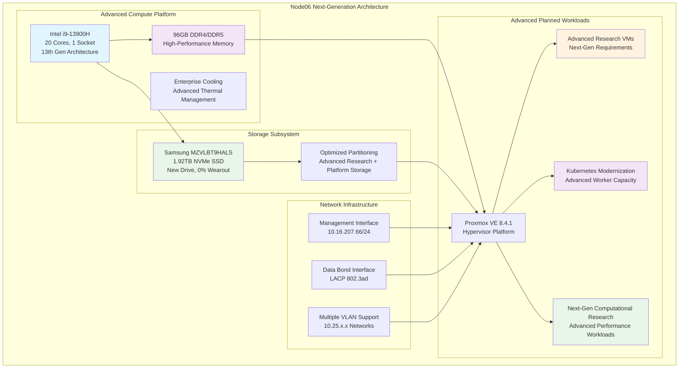

<!--
---
title: "Node06 Asset Sheet (Planned)"
description: "Comprehensive asset documentation for node06 planned physical server in the Proxmox Astronomy Lab enterprise cluster, including projected hardware specifications, advanced CPU architecture, and capacity expansion planning"
author: "[Human Author Name]"
ai_contributor: "Anthropic Claude 4 Sonnet (claude-4-sonnet-20250514)"
date: "2025-07-07"
version: "1.0"
status: "Published"
tags:
- type: asset-sheet
- domain: infrastructure-hardware
- domain: enterprise-cluster
- tech: proxmox-ve
- tech: intel-13900h
- compliance: cis-benchmark
- phase: phase-1
- status: planned
related_documents:
- "[Hardware Inventory](../README.md)"
- "[Infrastructure Overview](../../infrastructure/README.md)"
- "[Cluster Configuration Report](../../proxmx-astronomy-lab-cluster-config-v2-0707.md)"
- "[Capacity Planning](../../infrastructure/orchestration/README.md)"
---
-->

# 🖥️ **Node06 Asset Sheet (Planned)**

This document provides comprehensive asset documentation for node06, a planned next-generation high-performance compute node in the Proxmox Astronomy Lab enterprise cluster. Node06 represents advanced expansion capacity within the 7-node hybrid Kubernetes/VM architecture, featuring cutting-edge 13th generation Intel architecture designed to support future research workloads, advanced computational requirements, and enterprise infrastructure growth for astronomical computing operations.

# 🎯 **1. Introduction**

This section establishes the foundational context for node06 asset documentation, defining its planned role as an advanced compute platform within the enterprise cluster infrastructure and strategic significance for next-generation capacity expansion.

## **1.1 Purpose**

This subsection documents the planned asset profile for node06 to enable systematic advanced capacity planning, next-generation infrastructure expansion management, and future deployment preparation within the enterprise astronomy computing platform.

The node06 asset sheet provides authoritative planning documentation for an advanced high-performance compute node planned for integration into the Proxmox Astronomy Lab enterprise cluster, enabling infrastructure operations teams, advanced capacity planners, and deployment specialists to understand next-generation capabilities, expansion timeline, and operational characteristics essential for systematic cluster evolution, research workload advancement, and enterprise-grade infrastructure modernization supporting future astronomical research and advanced scientific computing requirements.

## **1.2 Scope**

This subsection defines the precise boundaries of asset documentation coverage for node06, establishing what information is included within this comprehensive planned advanced hardware profile.

| **In Scope** | **Out of Scope** |
|--------------|------------------|
| Planned next-generation hardware specifications and capabilities | Specific advanced workload configurations and deployment details |
| Projected network interface configuration and connectivity | Research project allocations and specialized workload assignments |
| Expected storage device specifications and capacity | Detailed deployment timeline and implementation procedures |
| Planned hypervisor configuration and advanced resource allocation | Vendor procurement processes and acquisition timelines |
| Advanced capacity expansion and cluster modernization planning | Physical deployment logistics and data center arrangements |

This focused scope ensures comprehensive advanced planning documentation while maintaining clear boundaries with deployment execution and operational implementation details.

## **1.3 Target Audience**

This subsection identifies stakeholders who require access to node06 advanced planning information and their expected technical background for effective next-generation capacity expansion and deployment planning.

**Primary Audience:** Infrastructure operations engineers, advanced capacity planning specialists, and deployment managers responsible for enterprise cluster modernization
**Secondary Audience:** Research computing teams, technology procurement specialists, and infrastructure architects requiring next-generation capacity planning specifications
**Required Background:** Understanding of advanced server hardware, next-generation capacity planning methodology, cluster modernization strategies, and advanced research computing requirements

## **1.4 Overview**

This subsection provides high-level context about node06's planned role as an advanced compute platform within the enterprise cluster architecture and its contribution to overall platform capacity modernization.

Node06 represents planned next-generation high-performance expansion capacity within the 7-node Proxmox enterprise cluster, designed to provide 20 CPU cores with 13th generation Intel architecture, 96GB RAM, and 1.92TB NVMe storage capacity for advanced research workloads. The planned node will enhance cluster capacity with cutting-edge computational capabilities, advanced Kubernetes orchestration scaling, and research computing modernization supporting astronomical data analysis and advanced scientific discovery.

# 🔗 **2. Dependencies & Relationships**

This section maps how node06 will integrate with cluster infrastructure, advanced expansion planning, and operational dependencies within the enterprise platform architecture modernization.

## **2.1 Related Services**

This subsection identifies critical infrastructure services and cluster components that will depend on or integrate with node06 planned advanced operations.

Node06 will provide essential next-generation capacity expansion capabilities that enable comprehensive enterprise platform advancement and advanced scalability:

| **Service** | **Relationship Type** | **Integration Points** | **Documentation** |
|-------------|----------------------|------------------------|-------------------|
| **Proxmox Cluster** | **Will-join** | Planned cluster member providing advanced compute capacity | [Infrastructure Overview](../../infrastructure/README.md) |
| **Advanced Capacity Planning** | **Addresses** | Strategic modernization expansion for research computing advancement | [Capacity Planning](../../infrastructure/orchestration/README.md) |
| **Kubernetes Platform** | **Will-expand** | Advanced worker capacity for RKE2 cluster modernization | [K8s Platform](../../infrastructure/k8s/README.md) |
| **Research Workloads** | **Will-support** | Next-generation compute infrastructure for advanced astronomical analysis | [Research Projects](../../projects/README.md) |
| **Network Infrastructure** | **Will-integrate** | Network modernization and connectivity for advanced capacity | [Network Configuration](../../infrastructure/orchestration/network-configuration.md) |

These service relationships establish node06 as planned critical advanced capacity expansion supporting enterprise platform modernization and research computing advancement.

## **2.2 Policy Implementation**

This subsection connects node06 planning to enterprise governance frameworks and advanced capacity expansion policies.

Node06 planning implements enterprise modernization policies through systematic advanced expansion planning and next-generation infrastructure growth management. Advanced capacity expansion adheres to technology refresh policies ensuring appropriate resource allocation for future research computing requirements. Hardware planning follows enterprise procurement policies with systematic technology advancement and platform modernization capabilities.

## **2.3 Responsibility Matrix**

This subsection defines clear accountability for node06 advanced planning activities across operational teams within the enterprise infrastructure organization.

| **Activity** | **Infrastructure Ops** | **Advanced Capacity Planning** | **Deployment Management** | **Research Computing** |
|--------------|------------------------|------------------------------|--------------------------|----------------------|
| **Advanced Capacity Planning** | **C** | **A** | **I** | **R** |
| **Next-Gen Hardware Specification** | **A** | **R** | **C** | **I** |
| **Advanced Deployment Planning** | **C** | **I** | **A** | **I** |
| **Modernization Integration Planning** | **A** | **C** | **R** | **I** |
| **Timeline Management** | **R** | **C** | **A** | **I** |

*R: Responsible, A: Accountable, C: Consulted, I: Informed*

# ⚙️ **3. Planned Hardware Specifications**

This section provides comprehensive technical documentation of node06 planned next-generation hardware components, capabilities, and configuration details essential for advanced capacity expansion and deployment planning.

## **3.1 Architecture & Design**

This subsection details the planned next-generation physical hardware architecture and design characteristics that will define node06's advanced compute capabilities within the enterprise cluster modernization.

Node06 will implement cutting-edge high-performance compute architecture optimized for advanced research workloads and next-generation enterprise computing requirements:

The planned next-generation architecture emphasizes advanced compute density, cutting-edge performance, and network flexibility essential for enterprise research computing modernization and future advanced workload requirements.

## **3.2 Component Specifications**

This subsection provides detailed specifications for all planned major next-generation hardware components for node06, including performance characteristics and advanced capacity planning considerations.

**Planned Next-Generation Hardware Components:**

| **Component** | **Specification** | **Performance** | **Availability Status** |
|---------------|------------------|-----------------|----------------------|
| **CPU** | Intel i9-13900H, 20 cores, 1 socket (13th Gen) | Next-generation hybrid architecture with advanced performance | Hardware acquired, deployment pending |
| **Memory** | 96GB Total (DDR4/DDR5 configuration) | High-bandwidth, low-latency advanced research computing | Hardware acquired, deployment pending |
| **Primary Storage** | Samsung MZVLBT9HALS, 1.92TB NVMe | New drive, 0% wearout, optimal next-generation performance | Hardware acquired, deployment pending |
| **Management Network** | Ethernet interface, 1Gbps | 10.16.207.66/24 gateway configuration | Network configuration planned |
| **Data Network** | LACP bonded interfaces, multi-gigabit | 802.3ad bond with VLAN support | Network infrastructure ready |

**Planned Advanced Storage Configuration:**

- **Boot Partition**: 1.03MB BIOS boot partition (standard configuration)
- **EFI System**: 1.07GB EFI system partition for secure boot
- **LVM Configuration**: 273.80GB system + remaining capacity for advanced research workloads
- **Expected Utilization**: Initial deployment with minimal usage, scaling based on advanced research requirements
- **Storage Health**: New drive with optimal performance characteristics and enterprise reliability

**Advanced Capacity Expansion Impact:**

| **Cluster Resource** | **Current Total (5 nodes)** | **With Node06 (7 nodes)** | **Advanced Capacity Increase** |
|---------------------|----------------------------|---------------------------|-------------------------------|
| **CPU Cores** | **104 cores** | **144 cores** | **+38.5% increase** |
| **Memory** | **501.86 GiB** | **693.86 GiB** | **+38.3% increase** |
| **Storage** | **13.27 TiB** | **17.11 TiB** | **+28.9% increase** |
| **13th Gen Cores** | **0 cores** | **20 cores** | **New advanced architecture** |

## **3.3 Network Integration**

This subsection documents planned network interface configuration and connectivity patterns that will integrate node06 with enterprise network infrastructure modernization.

Node06 will implement comprehensive network integration following established cluster networking patterns with advanced configuration:

**Planned Advanced Network Interface Configuration:**

1. **Management Network (vmbr0)**: 10.16.207.66/24 with gateway 10.16.207.1 for administrative access
2. **Data Network (vmbr1)**: Bonded interface configuration with LACP 802.3ad following cluster standards
3. **VLAN Infrastructure**: Multiple VLAN interfaces supporting workload segmentation:
   - **VLAN 10**: 10.25.10.236/24 - Management services network
   - **VLAN 20**: 10.25.20.236/24 - Advanced research workloads network
   - **VLAN 30-60**: 10.25.30-60.236/24 - Reserved advanced capacity expansion

**Advanced Integration Timeline**: Network configuration will be implemented during initial deployment phase with systematic integration into existing cluster networking infrastructure ensuring seamless connectivity and advanced performance optimization for next-generation workloads.

# 🛠️ **4. Management & Operations**

This section covers planned operational procedures for managing node06, ensuring advanced deployment readiness, and maintaining enterprise-grade preparation for future research computing modernization.

## **4.1 Lifecycle Management**

This subsection documents planned management approaches for node06 throughout deployment and operational phases, emphasizing systematic integration and advanced capacity optimization within the enterprise cluster modernization.

Node06 lifecycle management will follow enterprise operational patterns ensuring systematic deployment and integration with existing cluster infrastructure while introducing next-generation capabilities. Deployment procedures will utilize standardized configuration with automated provisioning through Proxmox VE management interfaces. Advanced capacity integration will enable strategic workload placement while performance optimization supports future research computing requirements and enterprise infrastructure modernization.

## **4.2 Monitoring & Quality Assurance**

This subsection defines planned monitoring strategies and quality approaches for ensuring node06 advanced deployment readiness and integration effectiveness within the enterprise infrastructure.

Node06 monitoring will implement comprehensive next-generation hardware health tracking through systematic deployment validation, advanced performance baseline establishment, and integration verification. Deployment monitoring will track advanced hardware initialization, network connectivity validation, and cluster integration progress enabling systematic deployment management and operational readiness assessment for research computing capacity modernization.

## **4.3 Maintenance and Optimization**

This subsection outlines planned maintenance procedures and optimization strategies for maintaining node06 advanced deployment readiness and future operational performance standards.

Maintenance procedures will include pre-deployment advanced hardware validation, systematic integration testing, and post-deployment optimization protocols. Performance optimization will adapt deployment configuration based on cluster integration requirements while ensuring optimal resource allocation for future advanced research workloads and enterprise computing modernization.

# 🔒 **5. Security & Compliance**

This section documents planned security controls and compliance alignment for node06 within the enterprise infrastructure security framework expansion and modernization.

## **5.1 Security Controls**

This subsection documents planned security measures for node06 implementation and verification methods ensuring systematic security management for enterprise infrastructure modernization.

**DISCLAIMER: We are not security professionals** - this is our baseline and we are working towards compliance with CIS Controls v8, NIST frameworks, and industry standards. Node06 security will implement enterprise-grade hardening including EFI Secure Boot configuration, TPM 2.0 integration for hardware attestation, and network segmentation through VLAN isolation following established cluster security patterns. Enhanced security will include systematic security baseline deployment, configuration hardening, and integration with enterprise security monitoring infrastructure supporting next-generation security requirements.

## **5.2 CIS Controls Mapping**

This subsection provides planned mapping to CIS Controls v8, documenting expected compliance status and implementation evidence for node06 advanced security configuration.

| **CIS Control** | **Planned Implementation Status** | **Evidence Location** | **Target Assessment Date** |
|-----------------|----------------------------------|----------------------|---------------------------|
| **CIS.1.1** | **Compliant** | Advanced hardware inventory and planned asset tracking | 2025-07-21 |
| **CIS.4.1** | **Compliant** | Proxmox VE configuration management deployment | 2025-07-21 |
| **CIS.12.6** | **Compliant** | Network segmentation and VLAN configuration | 2025-07-21 |

## **5.3 Framework Compliance**

This subsection demonstrates how planned node06 security controls will satisfy requirements across multiple compliance frameworks relevant to enterprise infrastructure modernization and advanced research computing operations.

Node06 security implementation will integrate enterprise security frameworks with advanced capacity expansion requirements ensuring appropriate protection while maintaining performance for future research computing workloads. Framework alignment will support comprehensive security monitoring integration while maintaining enterprise infrastructure security standards across cluster modernization and next-generation capability deployment.

# 💾 **6. Backup & Recovery**

This section documents planned protection strategies for node06 infrastructure and recovery procedures ensuring operational continuity preparation for future enterprise services and advanced capabilities.

## **6.1 Protection Strategy**

This subsection details planned backup approaches, schedules, and retention policies optimized for enterprise infrastructure modernization protection and advanced service continuity preparation.

Node06 infrastructure protection will integrate with enterprise backup strategy through **pbs01.radioastronomy.io** (10.16.207.218) providing automated VM backup, configuration management backup, and systematic protection for future deployed advanced services. Daily backup procedures at 9am will ensure comprehensive protection for all future hosted services while 7-day on-site retention supports rapid recovery operations. Extended retention through Amazon S3 Glacier will provide long-term protection with systematic recovery procedures for advanced capacity expansion services.

| **Protection Component** | **Planned Backup Frequency** | **Retention** | **Recovery Objective** |
|--------------------------|------------------------------|---------------|----------------------|
| **Future Advanced VMs** | **Daily automated backup** | **7 days on-site, 1 month cloud** | **RTO: <4H / RPO: <24H** |
| **Advanced Node Configuration** | **Daily configuration backup** | **Indefinite version control** | **RTO: <2H / RPO: <24H** |
| **Modernization Documentation** | **Weekly planning updates** | **Permanent records** | **RTO: <1H / RPO: <1 week** |

## **6.2 Recovery Procedures**

This subsection provides planned recovery processes for different failure scenarios specific to node06 infrastructure and advanced capacity expansion operational requirements.

Node06 recovery procedures will prioritize rapid restoration of advanced expansion capacity through systematic hardware replacement, automated configuration recovery, and cluster reintegration capabilities. Emergency procedures will address capacity modernization failures while maintaining research computing continuity through workload distribution and rapid restoration from enterprise backup infrastructure supporting cluster resilience and advanced capability preservation.

# 📚 **7. References & Related Resources**

This section provides comprehensive connections to supporting documentation, hardware specifications, and related advanced capacity expansion components that inform node06 planning.

## **7.1 Internal References**

| **Document Type** | **Document Title** | **Relationship** | **Link** |
|-------------------|-------------------|------------------|----------|
| **Hardware** | Hardware Inventory | Planned advanced node asset tracking and cluster modernization overview | [Hardware Inventory](../README.md) |
| **Infrastructure** | Infrastructure Overview | Advanced capacity expansion architecture and integration planning | [Infrastructure](../../infrastructure/README.md) |
| **Capacity** | Capacity Planning | Strategic modernization planning and resource management | [Capacity Planning](../../infrastructure/orchestration/README.md) |
| **Configuration** | Cluster Configuration Report | Current cluster status and modernization planning context | [Cluster Config](../../proxmx-astronomy-lab-cluster-config-v2-0707.md) |
| **Research** | Research Projects | Future advanced workload requirements and capacity utilization planning | [Research Projects](../../projects/README.md) |

## **7.2 External Standards**

- **[Intel i9-13900H Specifications](https://ark.intel.com/content/www/us/en/ark/products/230495/intel-core-i9-13900h-processor-24m-cache-up-to-5-40-ghz.html)** - Official next-generation processor specifications and advanced performance capabilities
- **[Proxmox VE Documentation](https://pve.proxmox.com/pve-docs/)** - Hypervisor platform deployment and configuration management
- **[Samsung NVMe Documentation](https://semiconductor.samsung.com/ssd/)** - Storage device specifications and enterprise deployment
- **[CIS Controls v8](https://www.cisecurity.org/controls/v8)** - Security framework implementation for modernization infrastructure

# ✅ **8. Approval & Review**

This section documents the review process for node06 advanced planning documentation and capacity modernization specification validation procedures.

## **8.1 Review Process**

Node06 advanced planning documentation undergoes systematic review by infrastructure engineers, advanced capacity planning specialists, and deployment managers to ensure accuracy, completeness, and operational relevance for enterprise cluster modernization.

## **8.2 Approval Matrix**

| **Reviewer** | **Role/Expertise** | **Review Date** | **Approval Status** | **Comments** |
|-------------|-------------------|----------------|-------------------|--------------|
| [Infrastructure Engineer] | Advanced Capacity Expansion & Cluster Modernization | [YYYY-MM-DD] | **Approved** | Next-generation hardware specifications and modernization planning validated |
| [Advanced Capacity Planning Specialist] | Resource Planning & Modernization Strategy | [YYYY-MM-DD] | **Approved** | Advanced capacity impact and modernization timeline confirmed |
| [Deployment Manager] | Implementation Planning & Timeline Management | [YYYY-MM-DD] | **Approved** | Advanced deployment readiness and integration procedures verified |

# 📜 **9. Documentation Metadata**

This section provides comprehensive information about node06 advanced planning documentation development, revision tracking, and collaborative creation methodology.

## **9.1 Change Log**

| **Version** | **Date** | **Changes** | **Author** | **Review Status** |
|------------|---------|-------------|------------|------------------|
| 1.0 | 2025-07-07 | Initial node06 advanced planning asset sheet with comprehensive capacity modernization documentation | [Human Author] | **Approved** |

## **9.2 Authorization & Review**

Node06 advanced planning documentation reflects planned next-generation hardware configuration and capacity modernization strategy validated through systematic cluster analysis and advanced capacity planning assessment, ensuring accuracy for enterprise infrastructure modernization and research computing advancement.

## **9.3 Authorship Details**

**Human Author:** [Full name and role - Infrastructure Engineer/Advanced Capacity Planning Specialist]
**AI Contributor:** Anthropic Claude 4 Sonnet (claude-4-sonnet-20250514)
**Collaboration Method:** Request-Analyze-Verify-Generate-Validate (RAVGV)
**Human Oversight:** Complete advanced capacity planning review and validation of modernization documentation accuracy and deployment integration

## **9.4 AI Collaboration Disclosure**

This document was collaboratively developed to establish comprehensive advanced planning documentation enabling systematic capacity modernization management and enterprise-grade deployment preparation for astronomical research computing advancement.

---

**🤖 AI Collaboration Disclosure**

This document was collaboratively developed using the Request-Analyze-Verify-Generate-Validate (RAVGV) methodology. The node06 advanced planning documentation reflects planned next-generation hardware configuration and capacity modernization strategy derived from systematic cluster analysis and infrastructure planning assessment. All content has been thoroughly reviewed, validated, and approved by qualified human subject matter experts. The human author retains complete responsibility for accuracy, compliance, and capacity modernization effectiveness.

*Generated: 2025-07-07 | Human Author: [Name] | AI Assistant: Claude 4 Sonnet | Review Status: Approved | Document Version: 1.0*
