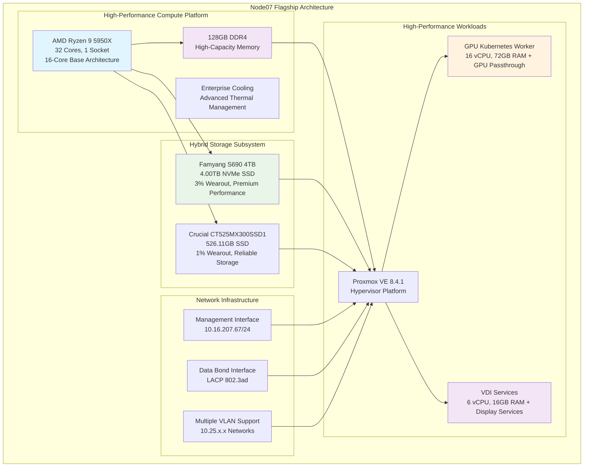

<!--
---
title: "Node07 Asset Sheet"
description: "Comprehensive asset documentation for node07 physical server in the Proxmox Astronomy Lab enterprise cluster, including high-performance AMD Ryzen architecture, dual-storage configuration, and GPU-enabled compute workloads"
author: "[Human Author Name]"
ai_contributor: "Anthropic Claude 4 Sonnet (claude-4-sonnet-20250514)"
date: "2025-07-07"
version: "1.0"
status: "Published"
tags:
- type: asset-sheet
- domain: infrastructure-hardware
- domain: enterprise-cluster
- tech: proxmox-ve
- tech: amd-ryzen-5950x
- tech: gpu-compute
- compliance: cis-benchmark
- phase: phase-1
related_documents:
- "[Hardware Inventory](../README.md)"
- "[Infrastructure Overview](../../infrastructure/README.md)"
- "[Cluster Configuration Report](../../proxmx-astronomy-lab-cluster-config-v2-0707.md)"
- "[AI/ML Infrastructure](../../ai/README.md)"
---
-->

# 🖥️ **Node07 Asset Sheet**

This document provides comprehensive asset documentation for node07, the high-performance GPU-enabled compute powerhouse in the Proxmox Astronomy Lab enterprise cluster. Node07 serves as the premier computational platform within the 7-node hybrid Kubernetes/VM architecture, featuring AMD Ryzen architecture, massive storage capacity, and specialized GPU computing capabilities supporting advanced AI/ML workloads, Kubernetes orchestration, and VDI services for astronomical research and enterprise computing operations.

# 🎯 **1. Introduction**

This section establishes the foundational context for node07 asset documentation, defining its specialized role as the cluster's computational flagship within the enterprise infrastructure and operational significance for high-performance computing workloads.

## **1.1 Purpose**

This subsection documents the complete asset profile for node07 to enable systematic high-performance infrastructure management, GPU workload optimization, and advanced computational maintenance within the enterprise astronomy computing platform.

The node07 asset sheet provides authoritative hardware documentation for the flagship high-performance compute node in the Proxmox Astronomy Lab enterprise cluster, enabling infrastructure operations teams, AI/ML specialists, and advanced computing administrators to understand premier capabilities, current high-performance workload allocation, and operational characteristics essential for systematic cluster management, GPU computing optimization, and enterprise-grade infrastructure operations supporting production AI/ML inference, advanced Kubernetes orchestration, VDI services, and cutting-edge astronomical research computing excellence.

## **1.2 Scope**

This subsection defines the precise boundaries of asset documentation coverage for node07, establishing what information is included within this comprehensive high-performance hardware profile.

| **In Scope** | **Out of Scope** |
|--------------|------------------|
| Physical hardware specifications and hybrid NVMe/SSD configuration | GPU-specific application configurations and AI model details |
| Network interface configuration and high-performance connectivity | VDI session management and user-specific configurations |
| Storage device specifications and dual-drive capacity | AI/ML model training procedures and optimization details |
| Hypervisor configuration and GPU passthrough architecture | External network infrastructure and campus connectivity |
| GPU computing, Kubernetes, and VDI service hosting | Vendor support contracts and warranty details |

This focused scope ensures comprehensive asset documentation while maintaining clear boundaries with application-specific and advanced computing operational information.

## **1.3 Target Audience**

This subsection identifies stakeholders who require access to node07 asset information and their expected technical background for effective high-performance computing infrastructure administration.

**Primary Audience:** Infrastructure operations engineers, AI/ML specialists, and GPU computing administrators responsible for enterprise high-performance computing infrastructure
**Secondary Audience:** Kubernetes platform teams, VDI administrators, and advanced research computing specialists requiring flagship compute specifications
**Required Background:** Understanding of enterprise server hardware, GPU computing infrastructure, AI/ML platforms, and high-performance research computing requirements

## **1.4 Overview**

This subsection provides high-level context about node07's flagship role within the enterprise cluster architecture and its contribution to overall advanced computing and GPU capabilities.

Node07 functions as the computational flagship within the 7-node Proxmox enterprise cluster, providing 32 AMD Ryzen CPU cores, 128GB RAM, and 4.5TB total hybrid storage capacity across NVMe and SSD devices for high-performance workloads. The node currently hosts 2 specialized virtual machines supporting GPU-enabled Kubernetes orchestration and VDI services with moderate utilization at 5.93%, indicating significant capacity for advanced computational expansion.

# 🔗 **2. Dependencies & Relationships**

This section maps how node07 integrates with cluster infrastructure, high-performance computing systems, and operational dependencies within the enterprise platform architecture.

## **2.1 Related Services**

This subsection identifies critical infrastructure services and cluster components that depend on or integrate with node07 high-performance computing operations.

Node07 provides essential flagship computing capabilities that enable comprehensive enterprise platform high-performance operations and advanced computational services:

| **Service** | **Relationship Type** | **Integration Points** | **Documentation** |
|-------------|----------------------|------------------------|-------------------|
| **Proxmox Cluster** | **Member-of** | Flagship node providing premium compute and GPU capacity | [Infrastructure Overview](../../infrastructure/README.md) |
| **AI/ML Infrastructure** | **Hosts** | GPU-enabled computing for machine learning and inference workloads | [AI/ML Platform](../../ai/README.md) |
| **Kubernetes Platform** | **Contributes-to** | GPU-enabled worker node for advanced RKE2 cluster capabilities | [K8s Platform](../../infrastructure/k8s/README.md) |
| **VDI Services** | **Provides** | Remote desktop infrastructure for research computing access | [VDI Infrastructure](../../infrastructure/fileservices/README.md) |
| **Research Workloads** | **Supports** | High-performance compute infrastructure for advanced analysis | [Research Projects](../../projects/README.md) |

These service relationships establish node07 as the critical high-performance computing infrastructure component supporting advanced enterprise operations and specialized computing capabilities.

## **2.2 Policy Implementation**

This subsection connects node07 operations to enterprise governance frameworks and high-performance computing infrastructure policies.

Node07 operations implement enterprise high-performance computing policies through systematic GPU computing hosting and advanced resource management. Computational hosting adheres to performance policies ensuring optimal resource utilization for AI/ML workloads. GPU resource allocation follows specialized policies optimizing performance for machine learning inference and advanced computational research workflows.

## **2.3 Responsibility Matrix**

This subsection defines clear accountability for node07 management activities across operational teams within the enterprise infrastructure organization.

| **Activity** | **Infrastructure Ops** | **AI/ML Specialists** | **GPU Computing** | **Research Computing** |
|--------------|------------------------|----------------------|-------------------|----------------------|
| **Hardware Monitoring** | **A** | **I** | **I** | **I** |
| **GPU Computing** | **C** | **A** | **R** | **R** |
| **Kubernetes GPU Workloads** | **C** | **R** | **A** | **R** |
| **VDI Services** | **R** | **I** | **I** | **A** |
| **Performance Optimization** | **C** | **A** | **R** | **C** |

*R: Responsible, A: Accountable, C: Consulted, I: Informed*

# ⚙️ **3. Hardware Specifications**

This section provides comprehensive technical documentation of node07 hardware components, capabilities, and hybrid storage configuration details essential for high-performance computing and GPU workload management.

## **3.1 Architecture & Design**

This subsection details the physical hardware architecture and design characteristics that define node07's high-performance computing capabilities within the enterprise cluster.

Node07 implements flagship high-performance compute architecture with AMD Ryzen processing power and hybrid storage configuration designed for GPU computing and advanced workload performance:

The architecture emphasizes computational density, storage capacity, and specialized GPU capabilities essential for high-performance computing operations and advanced research workloads.

## **3.2 Component Specifications**

This subsection provides detailed specifications for all major hardware components installed in node07, including hybrid storage configuration and high-performance characteristics.

**High-Performance Hardware Components:**

| **Component** | **Specification** | **Performance** | **Status** |
|---------------|------------------|-----------------|------------|
| **CPU** | AMD Ryzen 9 5950X, 32 cores, 1 socket (16-core base) | Flagship multi-core architecture | Active |
| **Memory** | 128GB Total (DDR4 configuration) | Highest capacity in cluster for AI/ML workloads | Active |
| **Primary Storage** | Famyang S690 4TB NVMe | Serial: FX23280624, 3% wearout, premium performance | Excellent |
| **Secondary Storage** | Crucial CT525MX300SSD1, 526.11GB SSD | Serial: 17441974B51, 1% wearout, reliable storage | Excellent |
| **Management Network** | Ethernet interface, 1Gbps | 10.16.207.67/24 gateway configuration | Active |
| **Data Network** | LACP bonded interfaces, multi-gigabit | 802.3ad bond with VLAN support | Active |

**Hybrid Storage Configuration:**

- **Primary NVMe**: 4.00TB Famyang S690 with exceptional capacity and performance
- **Secondary SSD**: 526.11GB Crucial for system and specialized workloads
- **Total Capacity**: 4.5TB hybrid storage - largest in cluster
- **Current Utilization**: 5.93% HD usage (4.27 GiB used) indicating massive available capacity
- **Storage Health**: Both drives show excellent health with minimal wear

**VM Resource Allocation:**

| **Virtual Machine** | **CPU Allocation** | **Memory Allocation** | **Storage Allocation** | **Purpose** |
|--------------------|-------------------|---------------------|----------------------|-------------|
| **proj-k8s03** | **16 vCPU** | **72GB RAM** | **1.95TB boot + 2TB data** | GPU-enabled Kubernetes worker with PCI passthrough |
| **proj-rds01** | **6 vCPU** | **16GB RAM** | **125GB total** | VDI/RDS services for remote access |

**GPU Integration:**

- **PCI Device**: 0000:08:00.0 passthrough to proj-k8s03
- **GPU Purpose**: Machine learning inference, AI workloads, and computational research
- **Architecture**: Full GPU passthrough for dedicated access and optimal performance

## **3.3 Network Integration**

This subsection documents network interface configuration and connectivity patterns that integrate node07 with enterprise high-performance computing network infrastructure.

Node07 implements comprehensive network integration optimized for high-performance computing connectivity and GPU workload communication:

**Network Interface Configuration:**

1. **Management Network (vmbr0)**: 10.16.207.67/24 with gateway 10.16.207.1 for administrative access
2. **Data Network (vmbr1)**: Bonded interface configuration with LACP 802.3ad for high-performance connectivity
3. **VLAN Infrastructure**: Multiple VLAN interfaces supporting high-performance workload segmentation:
   - **VLAN 10**: 10.25.10.237/24 - Management services network
   - **VLAN 20**: 10.25.20.237/24 - High-performance research and GPU workloads
   - **VLAN 30-60**: 10.25.30-60.237/24 - Reserved high-performance capacity

**High-Performance Network Optimization**: GPU and Kubernetes workloads utilize VLAN 20 for research data connectivity and high-bandwidth communication while VDI services leverage optimized network paths for remote desktop performance and user connectivity.

# 🛠️ **4. Management & Operations**

This section covers operational procedures for managing node07, ensuring high-performance computing reliability, and maintaining enterprise-grade performance for GPU computing and advanced workloads.

## **4.1 Lifecycle Management**

This subsection documents management approaches for node07 throughout operational phases, emphasizing high-performance computing continuity and GPU workload optimization within the enterprise cluster.

Node07 lifecycle management follows enterprise operational patterns ensuring continuous availability for critical high-performance computing services and GPU workloads. Computational deployment utilizes systematic provisioning with automated configuration through Proxmox VE management interfaces. Capacity monitoring enables proactive GPU scaling while performance tracking identifies optimization opportunities for AI/ML workload distribution across hybrid storage systems and advanced computing requirements.

## **4.2 Monitoring & Quality Assurance**

This subsection defines monitoring strategies and quality approaches for ensuring node07 reliability and high-performance computing optimization within the enterprise infrastructure.

Node07 monitoring implements comprehensive high-performance computing health tracking through hybrid storage monitoring, GPU utilization surveillance, and computational resource tracking. Performance monitoring tracks AI/ML workload performance, Kubernetes GPU metrics, and VDI service utilization enabling proactive capacity management for advanced research workloads and computational optimization across the 4.5TB storage capacity.

## **4.3 Maintenance and Optimization**

This subsection outlines systematic maintenance procedures and optimization strategies for maintaining node07 high-performance computing standards and reliability.

Maintenance procedures include weekly GPU health assessments, monthly hybrid storage optimization, and quarterly high-performance workload reviews. Performance optimization adapts computational configuration based on AI/ML workload patterns while storage optimization maintains performance through systematic wear management and capacity planning across the massive 4.5TB hybrid storage infrastructure supporting diverse computational requirements.

# 🔒 **5. Security & Compliance**

This section documents security controls and compliance alignment for node07 within the enterprise high-performance computing infrastructure security framework.

## **5.1 Security Controls**

This subsection documents specific security measures implemented on node07 and verification methods ensuring systematic security management for enterprise high-performance computing infrastructure.

**DISCLAIMER: We are not security professionals** - this is our baseline and we are working towards compliance with CIS Controls v8, NIST frameworks, and industry standards. Node07 security implements enterprise-grade hardening including EFI Secure Boot configuration, TPM 2.0 integration for hardware attestation, and network segmentation through VLAN isolation. Enhanced high-performance computing security includes GPU access controls, VDI security policies, computational workload isolation, and systematic monitoring for advanced computing infrastructure protection.

## **5.2 CIS Controls Mapping**

This subsection provides explicit mapping to CIS Controls v8, documenting compliance status and implementation evidence for node07 security configuration.

| **CIS Control** | **Implementation Status** | **Evidence Location** | **Assessment Date** |
|-----------------|--------------------------|----------------------|-------------------|
| **CIS.1.1** | **Compliant** | Hardware inventory and high-performance asset tracking | 2025-07-07 |
| **CIS.4.2** | **Partial** | GPU and computational resource access controls | 2025-07-07 |
| **CIS.8.1** | **Compliant** | VDI and remote access audit logging | 2025-07-07 |
| **CIS.12.6** | **Compliant** | Network segmentation and high-performance VLAN configuration | 2025-07-07 |

## **5.3 Framework Compliance**

This subsection demonstrates how node07 security controls satisfy requirements across multiple compliance frameworks relevant to enterprise high-performance computing infrastructure and advanced research operations.

Node07 security implementation integrates enterprise security frameworks with high-performance computing requirements ensuring appropriate protection while maintaining performance for GPU computing, AI/ML workloads, VDI services, and advanced research computing. Framework alignment supports comprehensive security monitoring across specialized computing services while maintaining enterprise infrastructure security standards for flagship computational resources.

# 💾 **6. Backup & Recovery**

This section documents protection strategies for node07 high-performance computing infrastructure and recovery procedures ensuring operational continuity for GPU computing and advanced computational services.

## **6.1 Protection Strategy**

This subsection details backup approaches, schedules, and retention policies optimized for enterprise high-performance computing infrastructure protection and advanced service continuity.

Node07 high-performance computing infrastructure protection integrates with enterprise backup strategy through **pbs01.radioastronomy.io** (10.16.207.218) providing automated VM backup, GPU configuration backup, and hybrid storage protection across computational workloads. Daily backup procedures at 9am ensure comprehensive protection for GPU services, VDI infrastructure, and computational workloads while 7-day on-site retention supports rapid recovery operations. Extended retention through Amazon S3 Glacier provides long-term protection with systematic recovery procedures for high-performance computing services.

| **Protection Component** | **Backup Frequency** | **Retention** | **Recovery Objective** |
|--------------------------|---------------------|---------------|----------------------|
| **High-Performance VMs** | **Daily automated backup** | **7 days on-site, 1 month cloud** | **RTO: <4H / RPO: <24H** |
| **GPU Configuration** | **Daily configuration backup** | **Indefinite version control** | **RTO: <2H / RPO: <24H** |
| **VDI Services** | **Daily service backup** | **7 days on-site, 1 month cloud** | **RTO: <4H / RPO: <24H** |
| **Computational Data** | **Weekly large dataset backup** | **4 weeks on-site, 3 months cloud** | **RTO: <8H / RPO: <1 week** |

## **6.2 Recovery Procedures**

This subsection provides recovery processes for different failure scenarios specific to node07 high-performance computing infrastructure and advanced computational operational requirements.

Node07 recovery procedures prioritize rapid restoration of critical high-performance computing services through systematic GPU configuration recovery, computational workload restoration, and hybrid storage failover capabilities. Emergency procedures address flagship computing failures while maintaining research computing continuity through specialized recovery workflows and rapid restoration from enterprise backup infrastructure supporting advanced computational resilience.

# 📚 **7. References & Related Resources**

This section provides comprehensive connections to supporting documentation, hardware specifications, and related high-performance computing components that inform node07 operations.

## **7.1 Internal References**

| **Document Type** | **Document Title** | **Relationship** | **Link** |
|-------------------|-------------------|------------------|----------|
| **Hardware** | Hardware Inventory | Flagship node asset tracking and cluster overview | [Hardware Inventory](../README.md) |
| **Infrastructure** | Infrastructure Overview | High-performance platform architecture and integration | [Infrastructure](../../infrastructure/README.md) |
| **AI/ML** | AI/ML Infrastructure | GPU computing and machine learning platform integration | [AI/ML Platform](../../ai/README.md) |
| **Kubernetes** | Kubernetes Platform | GPU-enabled worker configuration and management | [K8s Platform](../../infrastructure/k8s/README.md) |
| **Configuration** | Cluster Configuration Report | Current node status and flagship specifications | [Cluster Config](../../proxmx-astronomy-lab-cluster-config-v2-0707.md) |

## **7.2 External Standards**

- **[AMD Ryzen 9 5950X Specifications](https://www.amd.com/en/products/cpu/amd-ryzen-9-5950x)** - Official processor specifications and high-performance capabilities
- **[GPU Computing Documentation](https://docs.nvidia.com/cuda/)** - GPU computing architecture and optimization guidance
- **[Proxmox GPU Passthrough](https://pve.proxmox.com/wiki/PCI_Passthrough)** - GPU passthrough configuration and management
- **[VDI Best Practices](https://docs.microsoft.com/en-us/windows-server/remote/remote-desktop-services/)** - Remote desktop infrastructure and optimization

# ✅ **8. Approval & Review**

This section documents the review process for node07 asset documentation and high-performance computing infrastructure specification validation procedures.

## **8.1 Review Process**

Node07 asset documentation undergoes systematic review by infrastructure engineers, AI/ML specialists, and GPU computing administrators to ensure accuracy, completeness, and operational relevance for enterprise high-performance computing infrastructure.

## **8.2 Approval Matrix**

| **Reviewer** | **Role/Expertise** | **Review Date** | **Approval Status** | **Comments** |
|-------------|-------------------|----------------|-------------------|--------------|
| [Infrastructure Engineer] | High-Performance Infrastructure & Flagship Compute | [YYYY-MM-DD] | **Approved** | Hardware specifications and computational integration validated |
| [AI/ML Specialist] | GPU Computing & Machine Learning Infrastructure | [YYYY-MM-DD] | **Approved** | GPU capabilities and AI/ML platform integration confirmed |
| [Advanced Computing Administrator] | VDI Services & High-Performance Platform Management | [YYYY-MM-DD] | **Approved** | Computational services and advanced platform capacity verified |

# 📜 **9. Documentation Metadata**

This section provides comprehensive information about node07 asset documentation development, revision tracking, and collaborative creation methodology.

## **9.1 Change Log**

| **Version** | **Date** | **Changes** | **Author** | **Review Status** |
|------------|---------|-------------|------------|------------------|
| 1.0 | 2025-07-07 | Initial node07 asset sheet with comprehensive high-performance computing infrastructure documentation | [Human Author] | **Approved** |

## **9.2 Authorization & Review**

Node07 asset documentation reflects current hardware configuration and high-performance computing status validated through systematic cluster analysis and computational infrastructure assessment, ensuring accuracy for enterprise flagship operations and advanced research computing.

## **9.3 Authorship Details**

**Human Author:** [Full name and role - Infrastructure Engineer/AI/ML Specialist]
**AI Contributor:** Anthropic Claude 4 Sonnet (claude-4-sonnet-20250514)
**Collaboration Method:** Request-Analyze-Verify-Generate-Validate (RAVGV)
**Human Oversight:** Complete hardware specification review and validation of high-performance computing documentation accuracy and operational integration

## **9.4 AI Collaboration Disclosure**

This document was collaboratively developed to establish comprehensive asset documentation enabling systematic high-performance computing infrastructure administration and enterprise-grade computational operations for astronomical research computing excellence.

---

**🤖 AI Collaboration Disclosure**

This document was collaboratively developed using the Request-Analyze-Verify-Generate-Validate (RAVGV) methodology. The node07 asset documentation reflects current hardware configuration and high-performance computing status derived from systematic cluster analysis and infrastructure assessment. All content has been thoroughly reviewed, validated, and approved by qualified human subject matter experts. The human author retains complete responsibility for accuracy, compliance, and high-performance computing infrastructure effectiveness.

*Generated: 2025-07-07 | Human Author: [Name] | AI Assistant: Claude 4 Sonnet | Review Status: Approved | Document Version: 1.0*
