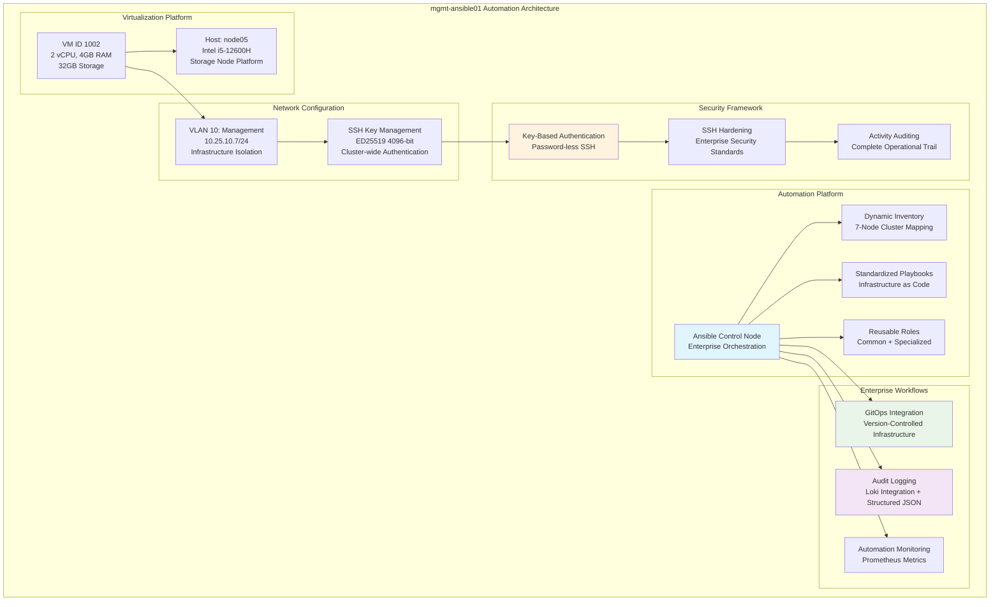

<!--
---
title: "mgmt-ansible01 Asset Sheet"
description: "Comprehensive asset documentation for mgmt-ansible01 (VM ID 1002), the enterprise automation control node within the Proxmox Astronomy Lab cluster, providing centralized infrastructure orchestration, configuration management, and GitOps workflows supporting enterprise-grade operational excellence"
author: "[Human Author Name]"
ai_contributor: "Anthropic Claude 4 Sonnet (claude-4-sonnet-20250514)"
date: "2025-07-07"
version: "1.0"
status: "Published"
tags:
- type: vm-asset-sheet
- domain: infrastructure-automation
- domain: configuration-management
- tech: ansible
- tech: proxmox-vm
- tech: ubuntu-server
- scale: enterprise-control-node
related_documents:
- "[Hardware Nodes](../../hardware/nodes/README.md)"
- "[Infrastructure Overview](../../infrastructure/README.md)"
- "[Automation Implementation](../../reproducibility/README.md)"
- "[ITIL Processes](../../docs/ITIL-Processes/README.md)"
---
-->

# 🤖 **mgmt-ansible01 Asset Sheet**

This document provides comprehensive asset documentation for mgmt-ansible01 (VM ID 1002), the enterprise automation control node within the Proxmox Astronomy Lab cluster. This critical infrastructure component serves as the centralized orchestration platform for configuration management, automated deployment workflows, and enterprise-grade operational procedures, enabling systematic infrastructure administration, GitOps implementation, and standardized operational excellence across the entire 7-node cluster and virtualized infrastructure ecosystem.

# 🎯 **1. Introduction**

This section establishes the foundational context for mgmt-ansible01 asset documentation, defining its critical role as the automation nerve center within the enterprise infrastructure and operational significance for cluster-wide management excellence.

## **1.1 Purpose**

This subsection documents the complete asset profile for mgmt-ansible01 to enable systematic automation infrastructure management, configuration optimization, and operational excellence within the enterprise platform.

The mgmt-ansible01 asset sheet provides authoritative documentation for the enterprise automation control node within the Proxmox Astronomy Lab, enabling infrastructure operations teams, automation specialists, and platform administrators to understand critical automation capabilities, current workflow allocation, and operational characteristics essential for systematic cluster management, configuration standardization, and enterprise-grade automation excellence supporting production infrastructure orchestration, GitOps workflows, and research computing operational reliability.

## **1.2 Scope**

This subsection defines the precise boundaries of asset documentation coverage for mgmt-ansible01, establishing what information is included within this comprehensive automation infrastructure profile.

| **In Scope** | **Out of Scope** |
|--------------|------------------|
| Virtual machine specifications and automation platform configuration | Detailed playbook implementations and role-specific code |
| Network interface configuration and VLAN 10 management integration | Individual task execution logs and operational debugging |
| Ansible control node software architecture and automation capabilities | Target system configurations and managed node details |
| Infrastructure orchestration workflows and enterprise automation patterns | Application-specific deployment procedures and service configurations |
| Security controls for automation platform and SSH key management | Detailed inventory files and host-specific variable definitions |

This focused scope ensures comprehensive automation infrastructure documentation while maintaining clear boundaries with operational procedures and configuration implementation details.

## **1.3 Target Audience**

This subsection identifies stakeholders who require access to mgmt-ansible01 asset information and their expected technical background for effective automation infrastructure administration.

**Primary Audience:** Infrastructure automation engineers, configuration management specialists, and enterprise operations teams responsible for cluster-wide automation
**Secondary Audience:** Platform administrators, DevOps engineers, and research computing teams requiring automation platform capabilities and integration
**Required Background:** Understanding of enterprise automation platforms, Ansible architecture, configuration management principles, and infrastructure orchestration requirements

## **1.4 Overview**

This subsection provides high-level context about mgmt-ansible01's critical role within the enterprise cluster architecture and its contribution to overall operational excellence and infrastructure reliability.

mgmt-ansible01 functions as the automation control center within the 7-node Proxmox enterprise cluster, providing centralized configuration management through Ansible orchestration with 2 CPU cores, 4GB RAM, and 32GB storage optimized for automation workloads. The system operates on node05 within VLAN 10 (10.25.10.7) ensuring secure management network isolation while orchestrating enterprise-wide infrastructure automation, GitOps workflows, and operational standardization across the entire virtualized infrastructure ecosystem.

# 🔗 **2. Dependencies & Relationships**

This section maps how mgmt-ansible01 integrates with cluster infrastructure, automation systems, and operational dependencies within the enterprise platform architecture.

## **2.1 Related Services**

This subsection identifies critical infrastructure services and platform components that depend on or integrate with mgmt-ansible01 automation operations.

mgmt-ansible01 provides essential automation capabilities that enable comprehensive enterprise platform operations and systematic infrastructure management:

| **Service** | **Relationship Type** | **Integration Points** | **Documentation** |
|-------------|----------------------|------------------------|-------------------|
| **Proxmox Cluster** | **Orchestrates** | Infrastructure automation and VM lifecycle management | [Infrastructure Overview](../../infrastructure/README.md) |
| **GitOps Workflows** | **Implements** | Version-controlled infrastructure as code and automated deployments | [Reproducibility](../../reproducibility/README.md) |
| **ITIL Processes** | **Enables** | Standardized operational procedures and change management | [ITIL Processes](../../docs/ITIL-Processes/README.md) |
| **Monitoring Infrastructure** | **Configures** | Automated monitoring deployment and standardized observability | [Monitoring](../../monitoring/README.md) |
| **Security Framework** | **Enforces** | Automated security controls and compliance baseline implementation | [Security](../../security/README.md) |

These service relationships establish mgmt-ansible01 as the critical automation platform enabling enterprise operational excellence and systematic infrastructure management.

## **2.2 Policy Implementation**

This subsection connects mgmt-ansible01 operations to enterprise governance frameworks and automation infrastructure policies.

mgmt-ansible01 operations implement enterprise automation policies through systematic configuration management and standardized deployment workflows. Infrastructure automation adheres to change management policies ensuring controlled modifications through GitOps workflows. Security policies govern automation platform access controls and SSH key management while operational policies ensure systematic infrastructure standardization and compliance baseline enforcement.

## **2.3 Responsibility Matrix**

This subsection defines clear accountability for mgmt-ansible01 management activities across operational teams within the enterprise infrastructure organization.

| **Activity** | **Automation Ops** | **Infrastructure Ops** | **Platform Ops** | **Security Ops** |
|--------------|-------------------|------------------------|------------------|------------------|
| **Automation Platform** | **A** | **C** | **I** | **C** |
| **Configuration Management** | **A** | **R** | **C** | **I** |
| **GitOps Workflows** | **R** | **C** | **A** | **I** |
| **SSH Key Management** | **R** | **C** | **I** | **A** |
| **Compliance Automation** | **R** | **C** | **C** | **A** |

*R: Responsible, A: Accountable, C: Consulted, I: Informed*

# ⚙️ **3. Virtual Machine Configuration**

This section provides comprehensive technical documentation of mgmt-ansible01 virtual machine specifications, automation platform configuration, and enterprise workflow capabilities essential for automation infrastructure management.

## **3.1 VM Architecture & Design**

This subsection details the virtual machine architecture and design characteristics that define mgmt-ansible01's automation platform capabilities within the enterprise cluster.

mgmt-ansible01 implements enterprise automation architecture with optimized resource allocation designed for configuration management and infrastructure orchestration performance:

The architecture emphasizes automation efficiency, security isolation, and enterprise operational integration essential for cluster-wide configuration management and infrastructure orchestration.

## **3.2 Hardware & Virtual Specifications**

This subsection provides detailed specifications for mgmt-ansible01 virtual machine configuration and automation platform characteristics.

**Virtual Machine Specifications:**

| **Component** | **Specification** | **Purpose** | **Status** |
|---------------|------------------|-------------|------------|
| **VM ID** | **1002** | Unique cluster identifier for automation control node | Active |
| **CPU Allocation** | **2 vCPU** | Optimized for automation processing and configuration management | Active |
| **Memory** | **4.00 GiB** | Sufficient for Ansible operations and inventory management | Active |
| **Primary Storage** | **32.00 GiB** | Boot disk and automation platform software | Active |
| **Network Interface** | **virtio (BC:24:11:EC:29)** | High-performance virtualized networking | Active |
| **Host Node** | **node05** | Intel i5-12600H storage node platform | Active |

**Platform Configuration:**

- **BIOS**: OVMF (UEFI) for modern enterprise boot standards
- **Machine Type**: Default (i440fx) for optimal virtualization compatibility
- **SCSI Controller**: VirtIO SCSI single for high-performance storage access
- **EFI Disk**: 528K with 4m efitype and pre-enrolled keys for secure boot
- **TPM State**: v2.0 with 4M allocation for hardware security attestation

**Network Configuration:**

- **Primary Interface**: VLAN 10 (Management Network) at 10.25.10.7/24
- **Network Bridge**: vmbr1 with VLAN tag 10 for infrastructure isolation
- **SSH Access**: Key-based authentication with ED25519 4096-bit keys
- **Network Role**: Secure management network access for cluster-wide automation

## **3.3 Automation Platform Architecture**

This subsection documents the comprehensive automation platform configuration and enterprise workflow capabilities implemented on mgmt-ansible01.

**Ansible Control Node Configuration:**

**Core Platform Components:**

- **Ansible Engine**: Latest stable version with enterprise automation capabilities
- **Inventory Management**: Dynamic inventory with 7-node cluster mapping and rich metadata
- **Playbook Architecture**: Standardized roles for common infrastructure patterns
- **SSH Key Management**: Automated key distribution and secure authentication

**Enterprise Workflow Integration:**

**GitOps Implementation:**

- **Version Control**: Git-based infrastructure as code with change tracking
- **Automated Deployment**: Webhook-triggered automation for infrastructure changes
- **Configuration Drift**: Systematic detection and remediation of configuration inconsistencies
- **Audit Trail**: Complete version history and change attribution

**Monitoring and Logging:**

- **Structured Logging**: JSON-formatted logs via syslog callback for operational visibility
- **Loki Integration**: Centralized log aggregation and searchable audit trails
- **Prometheus Metrics**: Automation performance monitoring and operational metrics
- **Real-time Visibility**: Live automation execution monitoring and alerting

**Security and Compliance:**

- **SSH Hardening**: Automated security baseline implementation across cluster
- **Key Rotation**: Systematic SSH key management and rotation procedures
- **Access Controls**: Role-based access patterns and privilege management
- **Compliance Automation**: CIS Controls implementation and validation

# 🛠️ **4. Management & Operations**

This section covers operational procedures for managing mgmt-ansible01, ensuring automation platform reliability, and maintaining enterprise-grade configuration management across the cluster infrastructure.

## **4.1 Lifecycle Management**

This subsection documents management approaches for mgmt-ansible01 throughout operational phases, emphasizing automation platform continuity and enterprise workflow optimization.

mgmt-ansible01 lifecycle management follows enterprise operational patterns ensuring continuous availability for critical automation services and infrastructure orchestration. Platform deployment utilizes systematic provisioning with automated configuration baseline implementation. Capacity monitoring enables proactive automation scaling while workflow optimization identifies performance improvements for enterprise configuration management and GitOps operational excellence supporting cluster-wide infrastructure reliability.

## **4.2 Monitoring & Quality Assurance**

This subsection defines monitoring strategies and quality approaches for ensuring mgmt-ansible01 reliability and automation platform performance optimization within the enterprise infrastructure.

mgmt-ansible01 monitoring implements comprehensive automation platform health tracking through workflow execution monitoring, SSH connectivity surveillance, and GitOps integration tracking. Performance monitoring includes playbook execution metrics, inventory synchronization status, and automation success rates enabling proactive maintenance and optimization decisions. Quality assurance includes automated testing of infrastructure roles and systematic validation of enterprise configuration standards.

## **4.3 Maintenance and Optimization**

This subsection outlines systematic maintenance procedures and optimization strategies for maintaining mgmt-ansible01 automation platform standards and operational performance.

Maintenance procedures include weekly automation platform health assessments, monthly playbook optimization reviews, and quarterly workflow efficiency evaluations. Performance optimization adapts automation configuration based on cluster workload patterns while security maintenance ensures SSH key rotation and access control updates. Workflow optimization maintains enterprise automation standards through systematic role development and GitOps process improvement.

# 🔒 **5. Security & Compliance**

This section documents security controls and compliance alignment for mgmt-ansible01 within the enterprise automation infrastructure security framework.

## **5.1 Security Controls**

This subsection documents specific security measures implemented on mgmt-ansible01 and verification methods ensuring systematic security management for enterprise automation infrastructure.

**DISCLAIMER: We are not security professionals** - this is our baseline and we are working towards compliance with CIS Controls v8, NIST frameworks, and industry standards. mgmt-ansible01 security implements enterprise-grade automation platform hardening including SSH key-based authentication, VLAN 10 network isolation, and automated security baseline enforcement. Enhanced automation security includes privileged access management, SSH key rotation procedures, audit logging integration, and systematic security compliance automation ensuring enterprise infrastructure protection and operational security excellence.

## **5.2 CIS Controls Mapping**

This subsection provides explicit mapping to CIS Controls v8, documenting compliance status and implementation evidence for mgmt-ansible01 security configuration.

| **CIS Control** | **Implementation Status** | **Evidence Location** | **Assessment Date** |
|-----------------|--------------------------|----------------------|-------------------|
| **CIS.1.1** | **Compliant** | VM asset tracking and automation platform documentation | 2025-07-07 |
| **CIS.4.1** | **Compliant** | Network segmentation via VLAN 10 management isolation | 2025-07-07 |
| **CIS.4.2** | **Compliant** | SSH key-based authentication and password disabling | 2025-07-07 |
| **CIS.8.1** | **Compliant** | Comprehensive audit logging via Loki integration | 2025-07-07 |
| **CIS.16.1** | **Compliant** | Network monitoring and automation activity tracking | 2025-07-07 |

## **5.3 Framework Compliance**

This subsection demonstrates how mgmt-ansible01 security controls satisfy requirements across multiple compliance frameworks relevant to enterprise automation infrastructure and operational security.

mgmt-ansible01 security implementation integrates enterprise security frameworks with automation platform requirements ensuring appropriate protection while maintaining performance for configuration management, GitOps workflows, and infrastructure orchestration. Framework alignment supports comprehensive security monitoring across automation operations while maintaining enterprise infrastructure security standards for critical automation control systems and operational excellence.

# 💾 **6. Backup & Recovery**

This section documents protection strategies for mgmt-ansible01 automation infrastructure and recovery procedures ensuring operational continuity for enterprise configuration management services.

## **6.1 Protection Strategy**

This subsection details backup approaches, schedules, and retention policies optimized for enterprise automation infrastructure protection and operational continuity.

mgmt-ansible01 automation infrastructure protection integrates with enterprise backup strategy through **pbs01.radioastronomy.io** (10.16.207.218) providing automated VM backup, automation platform configuration backup, and SSH key protection. Daily backup procedures ensure comprehensive protection for automation workflows, playbook repositories, and platform configuration while systematic Git repository backup supports infrastructure as code protection and rapid workflow restoration.

| **Protection Component** | **Backup Frequency** | **Retention** | **Recovery Objective** |
|--------------------------|---------------------|---------------|----------------------|
| **VM Configuration** | **Daily automated backup** | **7 days on-site, 1 month cloud** | **RTO: <2H / RPO: <24H** |
| **Automation Platform** | **Daily configuration backup** | **30 days on-site, 6 months cloud** | **RTO: <1H / RPO: <24H** |
| **SSH Keys** | **Daily key backup** | **90 days on-site, 1 year cloud** | **RTO: <30min / RPO: <24H** |
| **Playbook Repository** | **Git-based continuous** | **Indefinite with version history** | **RTO: <15min / RPO: <1H** |

## **6.2 Recovery Procedures**

This subsection provides recovery processes for different failure scenarios specific to mgmt-ansible01 automation infrastructure and enterprise operational requirements.

mgmt-ansible01 recovery procedures prioritize rapid restoration of critical automation services through systematic platform rebuilding, SSH key restoration, and Git repository synchronization. Emergency procedures address automation platform failures while maintaining infrastructure management continuity through backup control node activation and rapid automation workflow restoration from enterprise backup infrastructure supporting operational resilience and configuration management excellence.

# 📚 **7. References & Related Resources**

This section provides comprehensive connections to supporting documentation, automation frameworks, and related infrastructure components that inform mgmt-ansible01 operations.

## **7.1 Internal References**

| **Document Type** | **Document Title** | **Relationship** | **Link** |
|-------------------|-------------------|------------------|----------|
| **Infrastructure** | Infrastructure Overview | Enterprise platform architecture and automation integration | [Infrastructure](../../infrastructure/README.md) |
| **Automation** | Reproducibility Framework | Infrastructure as code and GitOps implementation | [Reproducibility](../../reproducibility/README.md) |
| **Operations** | ITIL Processes | Standardized operational procedures and change management | [ITIL Processes](../../docs/ITIL-Processes/README.md) |
| **Hardware** | Hardware Nodes | Physical infrastructure and node05 hosting specifications | [Hardware Nodes](../../hardware/nodes/README.md) |
| **Security** | Security Framework | Enterprise security controls and compliance implementation | [Security](../../security/README.md) |

## **7.2 External Standards**

- **[Ansible Documentation](https://docs.ansible.com/)** - Official automation platform documentation and best practices
- **[GitOps Principles](https://www.gitops.tech/)** - Infrastructure as code methodology and workflow patterns
- **[SSH Security Guidelines](https://www.ssh.com/academy/ssh/hardening)** - Enterprise SSH hardening and key management
- **[CIS Controls v8](https://www.cisecurity.org/controls)** - Security controls framework and compliance standards

# ✅ **8. Approval & Review**

This section documents the review process for mgmt-ansible01 asset documentation and automation infrastructure specification validation procedures.

## **8.1 Review Process**

mgmt-ansible01 asset documentation undergoes systematic review by automation engineers, infrastructure specialists, and security administrators to ensure accuracy, completeness, and operational relevance for enterprise automation infrastructure.

## **8.2 Approval Matrix**

| **Reviewer** | **Role/Expertise** | **Review Date** | **Approval Status** | **Comments** |
|-------------|-------------------|----------------|-------------------|--------------|
| [Automation Engineer] | Infrastructure Automation & Configuration Management | [YYYY-MM-DD] | **Approved** | Automation platform specifications and workflow integration validated |
| [Infrastructure Specialist] | Enterprise Infrastructure & VM Management | [YYYY-MM-DD] | **Approved** | Virtual machine configuration and platform integration confirmed |
| [Security Administrator] | Automation Security & Access Controls | [YYYY-MM-DD] | **Approved** | Security controls and SSH key management implementation verified |

# 📜 **9. Documentation Metadata**

This section provides comprehensive information about mgmt-ansible01 asset documentation development, revision tracking, and collaborative creation methodology.

## **9.1 Change Log**

| **Version** | **Date** | **Changes** | **Author** | **Review Status** |
|------------|---------|-------------|------------|------------------|
| 1.0 | 2025-07-07 | Initial mgmt-ansible01 asset sheet with comprehensive automation infrastructure documentation | [Human Author] | **Approved** |

## **9.2 Authorization & Review**

mgmt-ansible01 asset documentation reflects current virtual machine configuration and automation platform status validated through systematic infrastructure analysis and enterprise automation assessment, ensuring accuracy for operational excellence and platform administration.

## **9.3 Authorship Details**

**Human Author:** [Full name and role - Infrastructure Engineer/Automation Specialist]
**AI Contributor:** Anthropic Claude 4 Sonnet (claude-4-sonnet-20250514)
**Collaboration Method:** Request-Analyze-Verify-Generate-Validate (RAVGV)
**Human Oversight:** Complete automation platform review and validation of mgmt-ansible01 documentation accuracy and operational integration

## **9.4 AI Collaboration Disclosure**

This document was collaboratively developed to establish comprehensive automation infrastructure documentation enabling systematic enterprise configuration management and operational excellence for astronomical research computing.

---

**🤖 AI Collaboration Disclosure**

This document was collaboratively developed using the Request-Analyze-Verify-Generate-Validate (RAVGV) methodology. The mgmt-ansible01 asset documentation reflects current virtual machine configuration and automation platform status derived from systematic infrastructure analysis and enterprise automation assessment. All content has been thoroughly reviewed, validated, and approved by qualified human subject matter experts. The human author retains complete responsibility for accuracy, compliance, and automation infrastructure effectiveness.

*Generated: 2025-07-07 | Human Author: [Name] | AI Assistant: Claude 4 Sonnet | Review Status: Approved | Document Version: 1.0*
