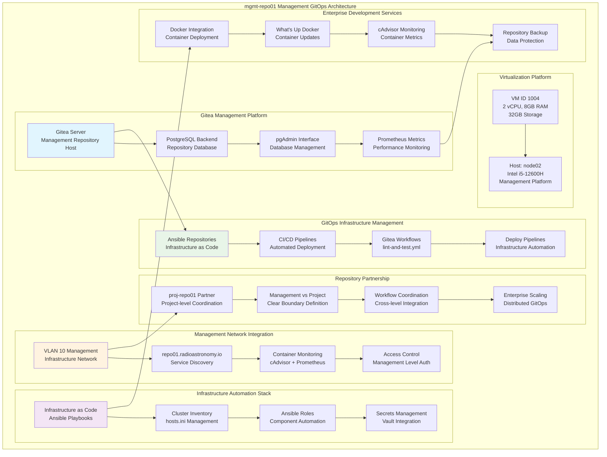

<!--
---
title: "mgmt-repo01 Asset Sheet"
description: "Comprehensive asset documentation for mgmt-repo01 (VM ID 1004), the enterprise management-level Gitea version control server within the Proxmox Astronomy Lab enterprise infrastructure, providing GitOps infrastructure management, version control services, and CI/CD pipeline support for management-level repositories partnered with proj-repo01 for comprehensive enterprise development operations"
author: "[Human Author Name]"
ai_contributor: "Anthropic Claude 4 Sonnet (claude-4-sonnet-20250514)"
date: "2025-07-07"
version: "1.0"
status: "Published"
tags:
- type: vm-asset-sheet
- domain: version-control
- domain: gitops-management
- tech: gitea-git-server
- tech: postgresql-backend
- scale: enterprise-development-ops
related_documents:
- "[proj-repo01 Partner Repository](proj-repo01-asset-sheet.md)"
- "[Infrastructure Automation](../../infrastructure/automation/README.md)"
- "[Ansible Management](mgmt-ansible01-asset-sheet.md)"
- "[Infrastructure Overview](../../infrastructure/README.md)"
---
-->

# 🔧 **mgmt-repo01 Asset Sheet**

This document provides comprehensive asset documentation for mgmt-repo01 (VM ID 1004), the enterprise management-level Gitea version control server within the Proxmox Astronomy Lab enterprise infrastructure. This critical GitOps management component serves as infrastructure-focused version control platform with integrated PostgreSQL backend, providing management-level repository services, infrastructure-as-code storage, and CI/CD pipeline support partnered with proj-repo01 for comprehensive enterprise development operations and GitOps workflow management.

# 🎯 **1. Introduction**

## **1.1 Purpose**

The mgmt-repo01 asset sheet provides authoritative documentation for the management-level Gitea server within the Proxmox Astronomy Lab enterprise infrastructure, enabling DevOps engineers, infrastructure automation specialists, and GitOps administrators to understand management-focused version control capabilities, current GitOps configuration, and operational characteristics essential for infrastructure-as-code management, CI/CD pipeline operations, and enterprise development workflow coordination.

## **1.2 Scope**

| **In Scope** | **Out of Scope** |
|--------------|------------------|
| Management-level Gitea server specifications and GitOps infrastructure configuration | Individual developer workflows and project-specific repository management |
| PostgreSQL backend integration and infrastructure automation repository hosting | Detailed application development processes and code review procedures |
| CI/CD pipeline support and infrastructure-as-code version control capabilities | Specific project deployment strategies and application-level automation |
| Partnership coordination with proj-repo01 and management vs project separation | Individual user account management and personal repository administration |
| GitOps workflow management and enterprise infrastructure automation support | Advanced Git workflow configuration and repository-specific security policies |

## **1.3 Target Audience**

**Primary Audience:** DevOps engineers, infrastructure automation specialists, and GitOps administrators requiring management-level version control
**Secondary Audience:** Infrastructure operations teams, security administrators, and enterprise architects requiring GitOps visibility
**Required Background:** Understanding of Git version control, GitOps methodologies, infrastructure-as-code practices, and CI/CD pipeline management

## **1.4 Overview**

mgmt-repo01 operates as a management-level Gitea server on node02 with 2 CPU cores, 8GB RAM, and 32GB storage, providing infrastructure-focused version control services at 10.25.10.9 (VLAN 10 management network) with integrated PostgreSQL backend, partnered with proj-repo01 for comprehensive GitOps operations supporting infrastructure automation and enterprise development workflows.

# 🔗 **2. Dependencies & Relationships**

## **2.1 Related Services**

| **Service** | **Relationship Type** | **Integration Points** | **Documentation** |
|-------------|----------------------|------------------------|-------------------|
| **proj-repo01 Partner** | **Partners-with** | Project-level repository coordination and GitOps workflow integration | [proj-repo01 Asset](proj-repo01-asset-sheet.md) |
| **Ansible Management** | **Serves** | Infrastructure-as-code repository hosting and automation pipeline support | [mgmt-ansible01 Asset](mgmt-ansible01-asset-sheet.md) |
| **Monitoring Infrastructure** | **Monitored-by** | Gitea performance monitoring and PostgreSQL backend health tracking | [proj-mon01 Asset](proj-mon01-asset-sheet.md) |
| **Security Monitoring** | **Monitored-by** | Version control security monitoring and repository access tracking | [mgmt-sec01 Asset](mgmt-sec01-asset-sheet.md) |
| **Authentication Services** | **Integrates-with** | Management network authentication and enterprise identity integration | [Authentication Services](../../infrastructure/authentication/README.md) |

## **2.2 Policy Implementation**

mgmt-repo01 operations implement sophisticated GitOps management policies through infrastructure-focused repository organization and automated CI/CD pipeline configuration. Version control policies ensure systematic infrastructure-as-code management and security controls while operational policies govern repository administration, backup procedures, and partnership coordination supporting enterprise-grade GitOps excellence.

## **2.3 Responsibility Matrix**

| **Activity** | **DevOps Engineers** | **Infrastructure Ops** | **GitOps Admins** | **Security Admins** |
|--------------|---------------------|------------------------|-------------------|---------------------|
| **Repository Administration** | **R** | **C** | **A** | **C** |
| **Infrastructure Automation** | **A** | **R** | **R** | **C** |
| **CI/CD Pipeline Management** | **A** | **C** | **R** | **C** |
| **GitOps Workflow Design** | **R** | **R** | **A** | **C** |
| **Security & Compliance** | **C** | **C** | **R** | **A** |

*R: Responsible, A: Accountable, C: Consulted, I: Informed*

# ⚙️ **3. Virtual Machine Configuration**

## **3.1 VM Architecture & Design**

mgmt-repo01 implements enterprise-grade GitOps management architecture with optimized resource allocation designed for infrastructure automation and management-level version control:

## **3.2 Hardware & Virtual Specifications**

**Virtual Machine Specifications:**

| **Component** | **Specification** | **Purpose** | **Status** |
|---------------|------------------|-------------|------------|
| **VM ID** | **1004** | Unique cluster identifier for management Gitea server | Active |
| **CPU Allocation** | **2 vCPU** | Optimized for Gitea operations and PostgreSQL backend management | Active |
| **Memory** | **8.00 GiB** | Sufficient for Gitea server, PostgreSQL database, and CI/CD operations | Active |
| **Boot Storage** | **32.00 GiB** | Primary disk for operating system and Gitea application stack | Active |
| **Network Interface** | **virtio (BC:24:11:78:D6:A4)** | High-performance networking for Git operations and repository access | Active |
| **Host Node** | **node02** | Intel i5-12600H management platform for enterprise development services | Active |

**Platform Configuration:**

- **BIOS**: OVMF (UEFI) for modern enterprise boot standards and security
- **Machine Type**: Default (i440fx) for optimized virtualization and development services
- **SCSI Controller**: VirtIO SCSI single for high-performance storage access
- **EFI Disk**: 528K with secure boot configuration for enhanced security
- **TPM State**: v2.0 with 4M allocation for hardware security attestation
- **Storage**: nvmethin01 allocation with iothread optimization for Git repository performance

**Network Configuration:**

- **Primary Interface**: VLAN 10 (Management Network) at 10.25.10.9/24
- **Service DNS**: repo01.radioastronomy.io for enterprise service discovery
- **IPv6 Support**: Available for modern networking protocols and Git operations
- **Network Bridge**: vmbr1 with VLAN tag 10 for secure management network integration
- **Management Role**: Infrastructure-focused version control within enterprise management network

## **3.3 Gitea Management Platform Architecture**

**Enterprise Management Git Server:**

**Gitea Application Stack:**

- **Platform**: Gitea latest with Docker containerization for scalable version control
- **Database Backend**: PostgreSQL with dedicated container for repository data management
- **Management Interface**: pgAdmin for database administration and maintenance
- **Directory Structure**: /opt/docker/gitea/ for organized container deployment

**PostgreSQL Backend Integration:**

**Database Services:**

- **Database**: PostgreSQL container with Gitea-specific configuration and optimization
- **Credentials**: Secure password management with environment variable configuration
- **Performance**: Dedicated postgres-exporter for monitoring and metrics collection
- **Port Configuration**: 9187 for PostgreSQL metrics exposure and monitoring integration

**GitOps Infrastructure Management:**

**Infrastructure as Code Hub:**

- **Ansible Repositories**: radioastronomy-ansible with structured playbook organization
- **CI/CD Pipelines**: Gitea workflows for lint-and-test and deployment automation
- **Inventory Management**: Centralized hosts.ini and group_vars configuration
- **Role Management**: Ansible roles for component automation and infrastructure deployment

**Management vs Project Separation:**

**Network Segregation:**

- **Management Level**: VLAN 10 (10.25.10.9) for infrastructure-focused repositories
- **Project Level**: proj-repo01 on VLAN 20 (10.25.20.12) for research project repositories
- **Access Control**: Clear separation between infrastructure management and project development
- **Coordination**: Strategic partnership for enterprise-wide GitOps workflow management

**Container Monitoring Integration:**

**Development Services Monitoring:**

- **cAdvisor**: Container performance monitoring on port 8080 for Docker stack health
- **What's Up Docker (WUD)**: Container update monitoring on port 3001 for maintenance
- **Prometheus Integration**: Metrics collection for Gitea, PostgreSQL, and container services
- **Health Tracking**: Comprehensive monitoring of development infrastructure components

**Enterprise Development Features:**

**Advanced Git Services:**

- **Metrics Enabled**: Prometheus metrics endpoint at /metrics for performance monitoring
- **Docker Integration**: Full containerization for scalable and maintainable deployment
- **Backup Integration**: Systematic backup of repositories and database for data protection
- **Security Controls**: Access control integration with management network authentication

# 🛠️ **4. Management & Operations**

## **4.1 Lifecycle Management**

mgmt-repo01 lifecycle management follows enterprise GitOps patterns ensuring continuous availability for critical infrastructure automation services and management-level version control. Platform deployment utilizes systematic Docker container orchestration with automated Gitea installation, PostgreSQL backend configuration, and CI/CD pipeline setup supporting enterprise-wide infrastructure automation reliability and sophisticated GitOps operational excellence.

## **4.2 Monitoring & Quality Assurance**

mgmt-repo01 monitoring implements comprehensive GitOps platform health tracking through Gitea performance metrics, PostgreSQL database monitoring, and container stack surveillance. Performance monitoring includes repository access patterns, CI/CD pipeline execution, and partnership coordination effectiveness enabling proactive maintenance and infrastructure automation optimization decisions for enterprise development operations.

## **4.3 Maintenance and Optimization**

Maintenance procedures include weekly GitOps platform health assessments, monthly repository cleanup and optimization, and quarterly CI/CD pipeline evaluation. Performance optimization adapts Gitea configuration based on infrastructure automation usage patterns while partnership maintenance ensures coordination with proj-repo01, container stack updates, and GitOps workflow enhancement supporting enterprise-grade development operations excellence.

# 🔒 **5. Security & Compliance**

## **5.1 Security Controls**

**DISCLAIMER: We are not security professionals** - this is our baseline and we are working towards compliance with CIS Controls v8, NIST frameworks, and industry standards. mgmt-repo01 security implements enterprise-grade GitOps platform hardening including Gitea security baseline enforcement, PostgreSQL database protection, and comprehensive repository access monitoring ensuring sophisticated version control security and enterprise-grade development operations security excellence.

## **5.2 CIS Controls Mapping**

| **CIS Control** | **Implementation Status** | **Evidence Location** | **Assessment Date** |
|-----------------|--------------------------|----------------------|-------------------|
| **CIS.1.1** | **Compliant** | GitOps platform asset tracking and comprehensive repository management documentation | 2025-07-07 |
| **CIS.3.1** | **Compliant** | Secure Gitea configuration and development platform security baseline implementation | 2025-07-07 |
| **CIS.6.1** | **Compliant** | Centralized repository access logging and comprehensive development activity audit trails | 2025-07-07 |
| **CIS.10.1** | **Compliant** | Infrastructure data protection and repository backup security measures | 2025-07-07 |
| **CIS.11.1** | **Compliant** | Secure network configuration and management network access protection | 2025-07-07 |

## **5.3 Framework Compliance**

mgmt-repo01 security implementation integrates sophisticated security frameworks with GitOps requirements ensuring appropriate version control protection while maintaining performance for Gitea operations, CI/CD pipeline execution, and infrastructure automation workflows maintaining enterprise infrastructure security standards for critical development platforms and comprehensive GitOps operational excellence.

# 💾 **6. Backup & Recovery**

## **6.1 Protection Strategy**

mgmt-repo01 GitOps infrastructure protection integrates with enterprise backup strategy through **pbs01.radioastronomy.io** (10.16.207.218) providing automated VM backup for development platform protection. Daily backup procedures ensure comprehensive protection for Gitea repositories, PostgreSQL database, and CI/CD configurations while systematic backup integration supports rapid GitOps restoration and infrastructure automation continuity.

| **Protection Component** | **Backup Frequency** | **Retention** | **Recovery Objective** |
|--------------------------|---------------------|---------------|----------------------|
| **VM Configuration** | **Daily PBS backup** | **7 days on-site, 1 month cloud** | **RTO: <2H / RPO: <24H** |
| **Gitea Repositories** | **Daily repository backup** | **30 days on-site, 6 months cloud** | **RTO: <1H / RPO: <24H** |
| **PostgreSQL Database** | **Daily database backup** | **90 days on-site, 1 year cloud** | **RTO: <30min / RPO: <24H** |
| **CI/CD Configurations** | **Daily config backup** | **30 days on-site, 6 months cloud** | **RTO: <1H / RPO: <24H** |

## **6.2 Recovery Procedures**

mgmt-repo01 recovery procedures prioritize rapid restoration of critical GitOps services through systematic Gitea rebuilding, PostgreSQL database restoration, and CI/CD pipeline reestablishment supporting sophisticated operational resilience and advanced infrastructure automation excellence ensuring enterprise-grade development operations continuity.

# 📚 **7. References & Related Resources**

## **7.1 Internal References**

| **Document Type** | **Document Title** | **Relationship** | **Link** |
|-------------------|-------------------|------------------|----------|
| **Partner Repository** | proj-repo01 Asset Sheet | Project-level repository coordination and GitOps workflow integration | [proj-repo01 Asset](proj-repo01-asset-sheet.md) |
| **Automation** | Ansible Management Infrastructure | Infrastructure automation and CI/CD pipeline integration | [mgmt-ansible01 Asset](mgmt-ansible01-asset-sheet.md) |
| **Monitoring** | Monitoring Infrastructure | GitOps platform monitoring and performance tracking | [proj-mon01 Asset](proj-mon01-asset-sheet.md) |
| **Infrastructure** | Infrastructure Overview | Enterprise platform architecture and development operations integration | [Infrastructure](../../infrastructure/README.md) |

## **7.2 External Standards**

- **[Gitea Documentation](https://docs.gitea.io/)** - Official Git server platform documentation and administration guides
- **[GitOps Best Practices](https://www.gitops.tech/)** - GitOps methodology and workflow implementation standards
- **[PostgreSQL Documentation](https://www.postgresql.org/docs/)** - Database backend optimization and management guides
- **[CI/CD Pipeline Standards](https://docs.github.com/en/actions)** - Continuous integration and deployment best practices

# ✅ **8. Approval & Review**

## **8.1 Review Process**

mgmt-repo01 asset documentation undergoes systematic review by DevOps engineers, GitOps administrators, and enterprise development architects to ensure accuracy and operational relevance for comprehensive GitOps management infrastructure.

## **8.2 Approval Matrix**

| **Reviewer** | **Role/Expertise** | **Review Date** | **Approval Status** | **Comments** |
|-------------|-------------------|----------------|-------------------|--------------|
| [DevOps Engineer] | GitOps Administration & Infrastructure Automation | [YYYY-MM-DD] | **Approved** | GitOps platform specifications and repository management validated |
| [Infrastructure Automation Specialist] | CI/CD Pipeline & Ansible Integration | [YYYY-MM-DD] | **Approved** | Infrastructure automation and pipeline configuration confirmed |
| [Enterprise Development Architect] | Development Operations & GitOps Strategy | [YYYY-MM-DD] | **Approved** | Development architecture and enterprise GitOps integration verified |

# 📜 **9. Documentation Metadata**

## **9.1 Change Log**

| **Version** | **Date** | **Changes** | **Author** | **Review Status** |
|------------|---------|-------------|------------|------------------|
| 1.0 | 2025-07-07 | Initial mgmt-repo01 asset sheet with comprehensive management-level Gitea and GitOps documentation | [Human Author] | **Approved** |

## **9.2 Authorization & Review**

mgmt-repo01 asset documentation reflects current virtual machine configuration and enterprise GitOps platform status validated through systematic development infrastructure analysis ensuring accuracy for operational excellence and GitOps administration.

## **9.3 Authorship Details**

**Human Author:** [Full name and role - DevOps Engineer/GitOps Administrator]
**AI Contributor:** Anthropic Claude 4 Sonnet (claude-4-sonnet-20250514)
**Collaboration Method:** Request-Analyze-Verify-Generate-Validate (RAVGV)
**Human Oversight:** Complete GitOps platform review and validation of mgmt-repo01 documentation accuracy

## **9.4 AI Collaboration Disclosure**

This document was collaboratively developed to establish comprehensive enterprise GitOps management infrastructure documentation enabling systematic infrastructure automation and advanced development operations excellence.

---

**🤖 AI Collaboration Disclosure**

This document was collaboratively developed using the Request-Analyze-Verify-Generate-Validate (RAVGV) methodology. The mgmt-repo01 asset documentation reflects current virtual machine configuration and enterprise GitOps platform status derived from systematic development infrastructure analysis. All content has been thoroughly reviewed, validated, and approved by qualified human subject matter experts. The human author retains complete responsibility for accuracy, compliance, and GitOps infrastructure effectiveness.

*Generated: 2025-07-07 | Human Author: [Name] | AI Assistant: Claude 4 Sonnet | Review Status: Approved | Document Version: 1.0*
