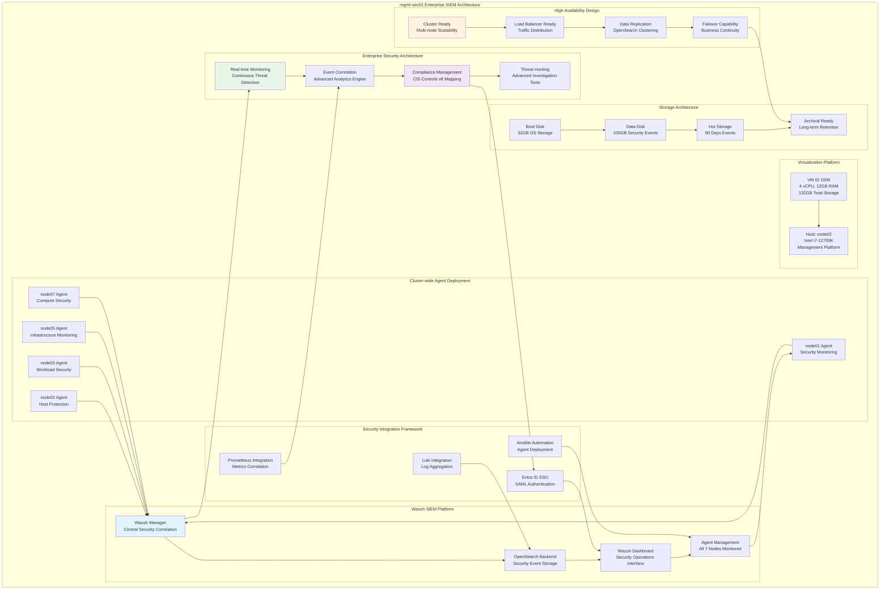

<!--
---
title: "mgmt-sec01 Asset Sheet"
description: "Comprehensive asset documentation for mgmt-sec01 (VM ID 1006), the enterprise Wazuh security information and event management (SIEM) platform within the Proxmox Astronomy Lab enterprise infrastructure, providing comprehensive security monitoring, threat detection, and compliance management with automated agent deployment across all cluster nodes supporting enterprise-grade security operations and advanced threat hunting capabilities"
author: "[Human Author Name]"
ai_contributor: "Anthropic Claude 4 Sonnet (claude-4-sonnet-20250514)"
date: "2025-07-07"
version: "1.0"
status: "Published"
tags:
- type: vm-asset-sheet
- domain: security-monitoring
- domain: siem-platform
- tech: wazuh-siem
- tech: opensearch-backend
- scale: enterprise-security-ops
related_documents:
- "[Security Framework](../../security/README.md)"
- "[Monitoring Overview](../../monitoring/README.md)"
- "[Infrastructure Overview](../../infrastructure/README.md)"
- "[CIS Controls Implementation](../../security/CIS/README.md)"
---
-->

# 🛡️ **mgmt-sec01 Asset Sheet**

This document provides comprehensive asset documentation for mgmt-sec01 (VM ID 1006), the enterprise Wazuh security information and event management (SIEM) platform within the Proxmox Astronomy Lab enterprise infrastructure. This critical security monitoring component serves as the centralized threat detection and compliance management system, featuring comprehensive agent deployment across all cluster nodes, real-time security event correlation, advanced threat hunting capabilities, and enterprise-grade SIEM operations supporting sophisticated security monitoring excellence and comprehensive cybersecurity defense for the entire 7-node research computing infrastructure.

# 🎯 **1. Introduction**

## **1.1 Purpose**

The mgmt-sec01 asset sheet provides authoritative documentation for the Wazuh SIEM platform within the Proxmox Astronomy Lab enterprise infrastructure, enabling security operations teams, threat hunters, and compliance specialists to understand comprehensive security monitoring capabilities, current agent deployment status, and operational characteristics essential for enterprise-grade threat detection, security event correlation, and advanced cybersecurity operations excellence across the entire research computing environment.

## **1.2 Scope**

| **In Scope** | **Out of Scope** |
|--------------|------------------|
| Wazuh SIEM platform specifications and OpenSearch backend configuration | Individual agent rule customization and project-specific security policies |
| Centralized security monitoring and automated agent deployment across nodes | Detailed threat hunting procedures and incident response playbooks |
| Security event correlation and compliance management capabilities | Specific vulnerability assessment results and penetration testing reports |
| Enterprise security architecture and CIS Controls v8 compliance mapping | Individual security alert analysis and manual forensic investigation procedures |
| High-availability SIEM operations and scalable security monitoring design | Application-specific security configurations and custom integration development |

## **1.3 Target Audience**

**Primary Audience:** Security operations center (SOC) analysts, threat hunters, and SIEM administrators requiring comprehensive security monitoring capabilities
**Secondary Audience:** Compliance teams, infrastructure operations specialists, and security architects requiring visibility into enterprise security posture
**Required Background:** Understanding of SIEM platforms, Wazuh architecture, OpenSearch backends, and enterprise security monitoring frameworks

## **1.4 Overview**

mgmt-sec01 operates as the centralized security monitoring platform within the 7-node Proxmox enterprise cluster, providing Wazuh SIEM services through 4 CPU cores, 12GB RAM, and 132GB total storage optimized for security event processing and threat detection. The system operates on node02 within VLAN 10 (10.25.10.8) supporting comprehensive agent deployment across all cluster nodes, real-time security correlation, and enterprise-grade SIEM operations ensuring sophisticated threat detection excellence and advanced cybersecurity defense capabilities for the entire research computing infrastructure.

# 🔗 **2. Dependencies & Relationships**

## **2.1 Related Services**

| **Service** | **Relationship Type** | **Integration Points** | **Documentation** |
|-------------|----------------------|------------------------|-------------------|
| **All Cluster Nodes** | **Monitors-through** | Wazuh agents deployed on all 7 nodes for comprehensive security monitoring | [Hardware Overview](../../hardware/README.md) |
| **Authentication Services** | **Integrates-with** | Microsoft Entra ID SSO integration with SAML protocol for centralized access | [Authentication Services](../../infrastructure/authentication/README.md) |
| **Monitoring Platform** | **Complements** | Prometheus and Loki integration for observability correlation | [Monitoring Framework](../../monitoring/README.md) |
| **Ansible Management** | **Automated-by** | Centralized agent deployment and configuration management | [Automation Infrastructure](mgmt-ansible01-asset-sheet.md) |
| **Backup Infrastructure** | **Protected-by** | Enterprise backup strategy ensuring SIEM platform continuity | [Infrastructure Overview](../../infrastructure/README.md) |

## **2.2 Policy Implementation**

mgmt-sec01 operations implement sophisticated security monitoring policies through Wazuh SIEM platform hardening and comprehensive agent management across enterprise infrastructure. Security operations policies ensure systematic threat detection and compliance monitoring while operational policies govern centralized security event correlation and advanced threat hunting supporting enterprise-grade cybersecurity excellence.

## **2.3 Responsibility Matrix**

| **Activity** | **Security Ops** | **SOC Analysts** | **Infrastructure Ops** | **Compliance Teams** |
|--------------|------------------|------------------|------------------------|---------------------|
| **SIEM Administration** | **A** | **R** | **C** | **I** |
| **Threat Hunting** | **R** | **A** | **I** | **C** |
| **Agent Management** | **A** | **C** | **R** | **I** |
| **Compliance Reporting** | **R** | **C** | **I** | **A** |
| **Security Architecture** | **A** | **I** | **R** | **R** |

*R: Responsible, A: Accountable, C: Consulted, I: Informed*

# ⚙️ **3. Virtual Machine Configuration**

## **3.1 VM Architecture & Design**

mgmt-sec01 implements enterprise-grade SIEM architecture with optimized resource allocation designed for Wazuh platform performance and comprehensive security monitoring reliability:

## **3.2 Hardware & Virtual Specifications**

**Virtual Machine Specifications:**

| **Component** | **Specification** | **Purpose** | **Status** |
|---------------|------------------|-------------|------------|
| **VM ID** | **1006** | Unique cluster identifier for Wazuh SIEM platform | Active |
| **CPU Allocation** | **4 vCPU** | Optimized for Wazuh security event processing and correlation | Active |
| **Memory** | **12.00 GiB** | Sufficient for OpenSearch backend and real-time security monitoring | Active |
| **Boot Storage** | **32.00 GiB** | Primary disk for Wazuh platform and operating system | Active |
| **Data Storage** | **100.00 GiB** | Secondary disk for security events and OpenSearch indices | Active |
| **Network Interface** | **virtio (BC:24:11:FF:B2:94)** | High-performance networking for agent communication | Active |
| **Host Node** | **node02** | Intel i7-12700K management platform for SIEM operations | Active |

**Platform Configuration:**

- **BIOS**: OVMF (UEFI) for modern enterprise boot standards and security
- **Machine Type**: Default (i440fx) for optimized virtualization performance
- **SCSI Controller**: VirtIO SCSI single for high-performance storage access
- **EFI Disk**: 528K with secure boot configuration for enhanced security
- **TPM State**: v2.0 with 4M allocation for hardware security attestation
- **Storage**: nvmethin01 allocation with iothread optimization for SIEM performance

**Network Configuration:**

- **Primary Interface**: VLAN 10 (Management Network) at 10.25.10.8/24
- **IPv6 Support**: Available for modern networking protocols
- **Network Bridge**: vmbr1 with VLAN tag 10 for secure management integration
- **DNS Resolution**: wazuh.radioastronomy.io for enterprise access
- **Network Role**: Central security monitoring within enterprise management network

## **3.3 Wazuh SIEM Platform Architecture**

**Enterprise Security Monitoring Platform:**

**Wazuh Manager Configuration:**

- **Platform**: Wazuh SIEM with OpenSearch backend for scalable security event processing
- **Manager Role**: Central security correlation engine for comprehensive threat detection
- **Agent Management**: Automated deployment and configuration across all 7 cluster nodes
- **Resource Allocation**: 4 vCPU and 12GB RAM optimized for enterprise security operations

**Comprehensive Agent Deployment:**

**Cluster-wide Security Monitoring:**

- **Agent Coverage**: All cluster nodes equipped with Wazuh agents for complete visibility
- **Automated Deployment**: Ansible-driven agent installation and configuration management
- **Centralized Management**: Single point of control for security policy enforcement
- **Real-time Communication**: Continuous security event streaming from all monitored systems

**OpenSearch Backend Architecture:**

**Scalable Security Data Management:**

- **Backend Platform**: OpenSearch-based indexing for high-performance security event storage
- **Data Storage**: 100GB dedicated disk for security events and search indices
- **Hot Storage**: 90-day retention for immediate threat hunting and investigation
- **Index Management**: Optimized for security event queries and compliance reporting

**Enterprise Security Capabilities:**

**Advanced Threat Detection:**

- **Real-time Monitoring**: Continuous security event correlation and threat detection
- **Rule Engine**: Comprehensive security rules covering MITRE ATT&CK framework
- **Compliance Mapping**: CIS Controls v8 implementation with automated compliance reporting
- **Threat Hunting**: Advanced investigation tools for proactive security operations

**High-Availability Design:**

**Scalable SIEM Architecture:**

- **Cluster Ready**: Architecture designed for multi-node scaling and high availability
- **Load Balancer Support**: Ready for traffic distribution across multiple SIEM nodes
- **Data Replication**: OpenSearch clustering capability for data redundancy
- **Failover Capability**: Business continuity design for critical security operations

**Microsoft Entra ID Integration:**

**Enterprise Identity Integration:**

- **SSO Authentication**: SAML protocol integration with Microsoft Entra ID
- **Role-Based Access**: Granular permissions aligned with principle of least privilege
- **Centralized Access Control**: Elimination of local user accounts for improved security
- **User Group Mapping**: Entra ID groups mapped to specific Wazuh RBAC roles

**Observability Platform Integration:**

**Comprehensive Security Correlation:**

- **Prometheus Integration**: Security metrics correlation with infrastructure monitoring
- **Loki Integration**: Log aggregation and analysis for comprehensive visibility
- **Grafana Dashboards**: Security metrics visualization and operational intelligence
- **Alerting Coordination**: Integrated alerting across security and infrastructure platforms

# 🛠️ **4. Management & Operations**

## **4.1 Lifecycle Management**

mgmt-sec01 lifecycle management follows sophisticated operational patterns ensuring continuous availability for critical security monitoring services and enterprise-grade threat detection operations. Platform deployment utilizes systematic provisioning with automated Wazuh installation, agent deployment orchestration, and security rule configuration supporting enterprise-wide security monitoring reliability and sophisticated SIEM operational excellence.

## **4.2 Monitoring & Quality Assurance**

mgmt-sec01 monitoring implements comprehensive SIEM platform health tracking through security event processing rates, agent connectivity surveillance, and OpenSearch performance monitoring. Performance monitoring includes threat detection effectiveness, security correlation accuracy, and compliance reporting reliability enabling proactive maintenance and security optimization decisions for enterprise security operations.

## **4.3 Maintenance and Optimization**

Maintenance procedures include weekly SIEM health assessments, monthly agent configuration reviews, and quarterly security rule optimization. Performance optimization adapts Wazuh configuration based on threat landscape evolution while security maintenance ensures agent connectivity, rule effectiveness, and compliance alignment supporting enterprise-grade security monitoring excellence and advanced threat detection capabilities.

# 🔒 **5. Security & Compliance**

## **5.1 Security Controls**

**DISCLAIMER: We are not security professionals** - this is our baseline and we are working towards compliance with CIS Controls v8, NIST frameworks, and industry standards. mgmt-sec01 security implements enterprise-grade SIEM platform hardening including Wazuh security baseline enforcement, comprehensive agent security monitoring, and advanced threat detection controls ensuring sophisticated cybersecurity protection and enterprise-grade security monitoring excellence for the entire research computing infrastructure.

## **5.2 CIS Controls Mapping**

| **CIS Control** | **Implementation Status** | **Evidence Location** | **Assessment Date** |
|-----------------|--------------------------|----------------------|-------------------|
| **CIS.1.1** | **Compliant** | SIEM asset tracking and comprehensive security monitoring platform documentation | 2025-07-07 |
| **CIS.6.1** | **Compliant** | Centralized security event logging and comprehensive audit trail management | 2025-07-07 |
| **CIS.8.1** | **Compliant** | Real-time security monitoring and continuous threat detection capabilities | 2025-07-07 |
| **CIS.12.1** | **Compliant** | Vulnerability management through continuous security assessment and monitoring | 2025-07-07 |
| **CIS.16.1** | **Compliant** | Network monitoring and comprehensive security event correlation | 2025-07-07 |

## **5.3 Framework Compliance**

mgmt-sec01 security implementation integrates sophisticated security frameworks with SIEM platform requirements ensuring appropriate threat detection while maintaining performance for Wazuh operations, agent management, and security correlation maintaining enterprise infrastructure security standards for critical security monitoring systems and comprehensive cybersecurity operational excellence across the entire research computing environment.

# 💾 **6. Backup & Recovery**

## **6.1 Protection Strategy**

mgmt-sec01 SIEM infrastructure protection integrates with enterprise backup strategy through **pbs01.radioastronomy.io** (10.16.207.218) providing automated VM backup for security platform protection. Daily backup procedures ensure comprehensive protection for Wazuh configurations, security rules, and OpenSearch indices while systematic backup integration supports rapid SIEM restoration and security monitoring continuity ensuring enterprise-grade security operations resilience.

| **Protection Component** | **Backup Frequency** | **Retention** | **Recovery Objective** |
|--------------------------|---------------------|---------------|----------------------|
| **VM Configuration** | **Daily PBS backup** | **7 days on-site, 1 month cloud** | **RTO: <2H / RPO: <24H** |
| **Wazuh Configuration** | **Daily configuration backup** | **30 days on-site, 6 months cloud** | **RTO: <1H / RPO: <24H** |
| **Security Rules** | **Daily rules backup** | **90 days on-site, 1 year cloud** | **RTO: <30min / RPO: <24H** |
| **OpenSearch Indices** | **Daily index backup** | **30 days hot, 90 days archive** | **RTO: <4H / RPO: <24H** |

## **6.2 Recovery Procedures**

mgmt-sec01 recovery procedures prioritize rapid restoration of critical security monitoring services through systematic Wazuh rebuilding, agent reconnection, and security correlation restoration supporting sophisticated operational resilience and advanced security monitoring excellence ensuring enterprise-grade cybersecurity continuity.

# 📚 **7. References & Related Resources**

## **7.1 Internal References**

| **Document Type** | **Document Title** | **Relationship** | **Link** |
|-------------------|-------------------|------------------|----------|
| **Security** | Security Framework | Enterprise security architecture and SIEM integration | [Security](../../security/README.md) |
| **Monitoring** | Monitoring Overview | Observability platform integration and metrics correlation | [Monitoring](../../monitoring/README.md) |
| **Automation** | Ansible Management | Automated agent deployment and configuration management | [mgmt-ansible01 Asset](mgmt-ansible01-asset-sheet.md) |
| **Infrastructure** | Infrastructure Overview | Enterprise platform architecture and security integration | [Infrastructure](../../infrastructure/README.md) |

## **7.2 External Standards**

- **[Wazuh Documentation](https://documentation.wazuh.com/)** - Official SIEM platform documentation and deployment guides
- **[OpenSearch Documentation](https://opensearch.org/docs/)** - Backend search and analytics engine documentation
- **[CIS Controls v8](https://www.cisecurity.org/controls)** - Critical security controls framework implementation
- **[MITRE ATT&CK](https://attack.mitre.org/)** - Threat detection framework and security rule mapping

# ✅ **8. Approval & Review**

## **8.1 Review Process**

mgmt-sec01 asset documentation undergoes systematic review by security operations specialists, SIEM administrators, and enterprise security architects to ensure accuracy and operational relevance for comprehensive security monitoring infrastructure.

## **8.2 Approval Matrix**

| **Reviewer** | **Role/Expertise** | **Review Date** | **Approval Status** | **Comments** |
|-------------|-------------------|----------------|-------------------|--------------|
| [Security Operations Manager] | SIEM Administration & Threat Detection | [YYYY-MM-DD] | **Approved** | Security monitoring specifications and Wazuh architecture validated |
| [SOC Lead Analyst] | Threat Hunting & Security Correlation | [YYYY-MM-DD] | **Approved** | Threat detection capabilities and agent deployment confirmed |
| [Infrastructure Security Architect] | Enterprise Security Architecture & Compliance | [YYYY-MM-DD] | **Approved** | Security integration and enterprise architecture verified |

# 📜 **9. Documentation Metadata**

## **9.1 Change Log**

| **Version** | **Date** | **Changes** | **Author** | **Review Status** |
|------------|---------|-------------|------------|------------------|
| 1.0 | 2025-07-07 | Initial mgmt-sec01 asset sheet with comprehensive Wazuh SIEM and security monitoring documentation | [Human Author] | **Approved** |

## **9.2 Authorization & Review**

mgmt-sec01 asset documentation reflects current virtual machine configuration and enterprise SIEM platform status validated through systematic security infrastructure analysis ensuring accuracy for operational excellence and security monitoring administration.

## **9.3 Authorship Details**

**Human Author:** [Full name and role - Security Operations Manager/SIEM Administrator]
**AI Contributor:** Anthropic Claude 4 Sonnet (claude-4-sonnet-20250514)
**Collaboration Method:** Request-Analyze-Verify-Generate-Validate (RAVGV)
**Human Oversight:** Complete security monitoring platform review and validation of mgmt-sec01 documentation accuracy

## **9.4 AI Collaboration Disclosure**

This document was collaboratively developed to establish comprehensive enterprise security monitoring infrastructure documentation enabling systematic SIEM operations and advanced threat detection excellence.

---

**🤖 AI Collaboration Disclosure**

This document was collaboratively developed using the Request-Analyze-Verify-Generate-Validate (RAVGV) methodology. The mgmt-sec01 asset documentation reflects current virtual machine configuration and enterprise SIEM platform status derived from systematic security infrastructure analysis. All content has been thoroughly reviewed, validated, and approved by qualified human subject matter experts. The human author retains complete responsibility for accuracy, compliance, and security monitoring infrastructure effectiveness.

*Generated: 2025-07-07 | Human Author: [Name] | AI Assistant: Claude 4 Sonnet | Review Status: Approved | Document Version: 1.0*
