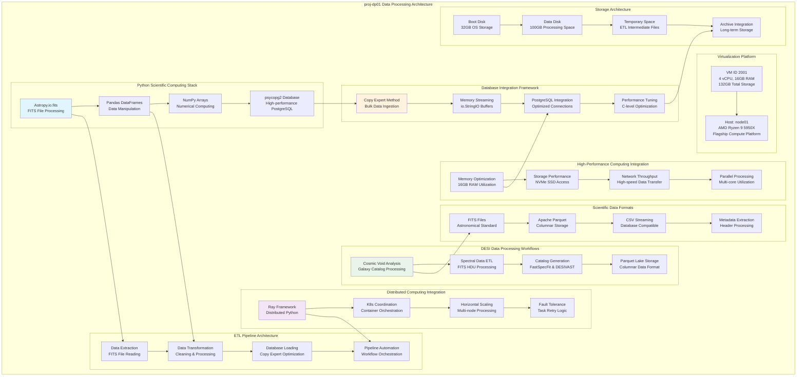

<!--
---
title: "proj-dp01 Asset Sheet"
description: "Comprehensive asset documentation for proj-dp01 (VM ID 2001), the enterprise astronomical data processing server within the Proxmox Astronomy Lab enterprise infrastructure, providing comprehensive ETL pipeline capabilities, Python scientific computing environment, and DESI data processing workflows with optimized astropy, pandas, and psycopg2 integration supporting sophisticated astronomical data transformation and high-performance database ingestion for research computing excellence"
author: "[Human Author Name]"
ai_contributor: "Anthropic Claude 4 Sonnet (claude-4-sonnet-20250514)"
date: "2025-07-07"
version: "1.0"
status: "Published"
tags:
- type: vm-asset-sheet
- domain: data-processing
- domain: astronomical-computing
- tech: python-scientific-stack
- tech: etl-pipelines
- scale: enterprise-data-ops
related_documents:
- "[Projects Overview](../../projects/README.md)"
- "[DESI Cosmic Voids Project](../../projects/desi-cosmic-voids/README.md)"
- "[Database Infrastructure](proj-pg01-asset-sheet.md)"
- "[Infrastructure Overview](../../infrastructure/README.md)"
---
-->

# 🔬 **proj-dp01 Asset Sheet**

This document provides comprehensive asset documentation for proj-dp01 (VM ID 2001), the enterprise astronomical data processing server within the Proxmox Astronomy Lab enterprise infrastructure. This critical data transformation component serves as the centralized ETL pipeline platform for DESI astronomical surveys, featuring comprehensive Python scientific computing environment, high-performance FITS file processing, automated data cleaning workflows, and enterprise-grade database ingestion capabilities supporting sophisticated astronomical data transformation excellence and advanced research computing operations for multi-terabyte astronomical datasets.

# 🎯 **1. Introduction**

## **1.1 Purpose**

The proj-dp01 asset sheet provides authoritative documentation for the data processing server within the Proxmox Astronomy Lab enterprise infrastructure, enabling data engineers, astronomical researchers, and pipeline administrators to understand comprehensive ETL capabilities, current scientific computing environment, and operational characteristics essential for astronomical data transformation, high-performance database ingestion, and sophisticated research data processing excellence across DESI survey analysis and cosmic void research workflows.

## **1.2 Scope**

| **In Scope** | **Out of Scope** |
|--------------|------------------|
| Data processing server specifications and Python scientific computing environment | Individual research project data analysis and custom algorithmic development |
| ETL pipeline architecture and FITS file processing workflows | Detailed astronomical catalog creation and manual data validation procedures |
| Database ingestion optimization and PostgreSQL integration capabilities | Specific machine learning model training and GPU-accelerated computing |
| Scientific library stack and astronomical data transformation procedures | Individual user development environments and project-specific toolchain customization |
| High-performance data cleaning and automated processing pipeline design | Manual data exploration and interactive Jupyter notebook session management |

## **1.3 Target Audience**

**Primary Audience:** Data engineers, astronomical data processing specialists, and ETL pipeline administrators requiring comprehensive data transformation capabilities
**Secondary Audience:** Research computing teams, database administrators, and scientific computing specialists requiring visibility into data processing workflows
**Required Background:** Understanding of astronomical data formats (FITS), Python scientific computing stack, ETL pipeline design, and PostgreSQL database integration

## **1.4 Overview**

proj-dp01 operates as the centralized data processing platform within the 7-node Proxmox enterprise cluster, providing enterprise-grade ETL services through 4 CPU cores, 16GB RAM, and 132GB total storage optimized for astronomical data transformation and database ingestion. The system operates on node01 within VLAN 20 (10.25.20.3) supporting comprehensive FITS file processing, automated data cleaning workflows, and high-performance PostgreSQL integration ensuring sophisticated astronomical data transformation excellence and advanced research computing capabilities for DESI survey analysis and cosmic void research operations.

# 🔗 **2. Dependencies & Relationships**

## **2.1 Related Services**

| **Service** | **Relationship Type** | **Integration Points** | **Documentation** |
|-------------|----------------------|------------------------|-------------------|
| **PostgreSQL Database** | **Ingests-to** | High-performance data ingestion via psycopg2 copy_expert optimization | [proj-pg01 Asset](proj-pg01-asset-sheet.md) |
| **File Storage Infrastructure** | **Sources-from** | FITS file processing from distributed storage and MinIO object storage | [proj-fs01 Asset](proj-fs01-asset-sheet.md) |
| **Kubernetes Clusters** | **Coordinates-with** | Ray distributed computing integration for scalable data processing | [proj-k8s01 Asset](proj-k8s01-asset-sheet.md) |
| **Code Development Platform** | **Deploys-from** | ETL pipeline deployment and scientific computing environment management | [proj-code01 Asset](proj-code01-asset-sheet.md) |
| **Monitoring Infrastructure** | **Monitored-by** | Data processing pipeline monitoring and performance optimization tracking | [proj-mon01 Asset](proj-mon01-asset-sheet.md) |

## **2.2 Policy Implementation**

proj-dp01 operations implement sophisticated data processing policies through ETL pipeline optimization and scientific computing environment standardization. Data governance policies ensure systematic astronomical data transformation and quality assurance while operational policies govern high-performance database ingestion and automated processing workflow management supporting enterprise-grade research computing excellence.

## **2.3 Responsibility Matrix**

| **Activity** | **Data Engineers** | **Research Scientists** | **Database Admins** | **Infrastructure Ops** |
|--------------|-------------------|------------------------|---------------------|------------------------|
| **ETL Pipeline Development** | **A** | **R** | **C** | **I** |
| **Data Processing Operations** | **R** | **A** | **I** | **C** |
| **Database Integration** | **R** | **C** | **A** | **C** |
| **Performance Optimization** | **A** | **C** | **R** | **R** |
| **Scientific Environment** | **R** | **A** | **I** | **C** |

*R: Responsible, A: Accountable, C: Consulted, I: Informed*

# ⚙️ **3. Virtual Machine Configuration**

## **3.1 VM Architecture & Design**

proj-dp01 implements enterprise-grade data processing architecture with optimized resource allocation designed for astronomical ETL performance and scientific computing reliability:

## **3.2 Hardware & Virtual Specifications**

**Virtual Machine Specifications:**

| **Component** | **Specification** | **Purpose** | **Status** |
|---------------|------------------|-------------|------------|
| **VM ID** | **2001** | Unique cluster identifier for data processing server | Active |
| **CPU Allocation** | **4 vCPU** | Optimized for Python ETL processing and scientific computing | Active |
| **Memory** | **16.00 GiB** | Sufficient for large FITS file processing and pandas operations | Active |
| **Boot Storage** | **32.00 GiB** | Primary disk for operating system and Python environment | Active |
| **Data Storage** | **100.00 GiB** | Secondary disk for ETL processing and temporary data storage | Active |
| **Network Interface** | **virtio (BC:24:11:43:78:3A)** | High-performance networking for data transfer operations | Active |
| **Host Node** | **node01** | AMD Ryzen 9 5950X flagship compute platform for optimal performance | Active |

**Platform Configuration:**

- **BIOS**: OVMF (UEFI) for modern enterprise boot standards and security
- **Machine Type**: Default (i440fx) for optimized virtualization performance and compatibility
- **SCSI Controller**: VirtIO SCSI single for high-performance storage access and ETL operations
- **EFI Disk**: 528K with secure boot configuration for enhanced security and modern standards
- **TPM State**: v2.0 with 4M allocation for hardware security attestation and trusted computing
- **Storage**: nvmethin01 allocation with iothread optimization for high-performance data processing

**Network Configuration:**

- **Primary Interface**: VLAN 20 (Research Network) at 10.25.20.3/24
- **IPv6 Support**: Available for modern networking protocols and future expansion
- **Network Bridge**: vmbr1 with VLAN tag 20 for secure research network integration
- **Network Role**: Central data processing within enterprise research computing network
- **Data Transfer**: High-speed connectivity for large astronomical dataset operations

## **3.3 Scientific Computing Environment Architecture**

**Python Scientific Computing Stack:**

**Core Scientific Libraries:**

- **Astropy**: Gold standard FITS file reading and astronomical data manipulation with complex header interpretation
- **Pandas**: In-memory data manipulation with DataFrame structures optimized for HDU joining and processing
- **NumPy**: Fundamental numerical computation foundation supporting all astronomical calculations
- **psycopg2**: High-performance PostgreSQL adapter with direct access to copy_expert bulk loading

**ETL Pipeline Architecture:**

**Extract-Transform-Load Framework:**

- **Data Extraction**: Automated FITS file discovery and multi-HDU processing with robust error handling
- **Data Transformation**: In-memory cleaning, validation, and astronomical coordinate processing
- **Database Loading**: High-performance bulk ingestion using psycopg2 copy_expert optimization
- **Workflow Automation**: End-to-end pipeline orchestration with comprehensive logging and monitoring

**DESI Data Processing Workflows:**

**Astronomical Survey Processing:**

- **Cosmic Void Analysis**: Galaxy catalog processing for void identification and environmental studies
- **Spectral Data ETL**: FITS HDU extraction and transformation for spectroscopic analysis
- **Catalog Generation**: FastSpecFit and DESIVAST catalog processing with metadata preservation
- **Parquet Lake Integration**: Columnar storage optimization for large-scale astronomical datasets

**High-Performance Database Integration:**

**Optimized PostgreSQL Ingestion:**

- **Copy Expert Method**: Direct streaming from pandas DataFrames to PostgreSQL via in-memory buffers
- **Memory Streaming**: io.StringIO buffer utilization for minimal disk I/O and optimal performance
- **C-level Optimization**: Leveraging psycopg2 and PostgreSQL optimized code paths for bulk operations
- **Connection Management**: Efficient database connection pooling and transaction optimization

**Scientific Data Format Support:**

**Astronomical Data Standards:**

- **FITS Files**: Complete support for complex multi-HDU structures and astronomical metadata
- **Apache Parquet**: Columnar storage format for efficient large-scale data lake operations
- **CSV Streaming**: Database-compatible format generation for high-performance ingestion
- **Metadata Preservation**: Comprehensive header and coordinate system information retention

**Distributed Computing Integration:**

**Scalable Processing Framework:**

- **Ray Framework**: Distributed Python computing for horizontal scaling across cluster nodes
- **Kubernetes Coordination**: Container orchestration integration for pipeline deployment and management
- **Fault Tolerance**: Automatic task retry and error recovery for production ETL reliability
- **Resource Optimization**: Dynamic resource allocation based on processing requirements and data volume

**Performance Optimization Architecture:**

**Enterprise-Grade Processing:**

- **Memory Management**: 16GB RAM optimization for large FITS file processing and pandas operations
- **Storage Performance**: NVMe SSD utilization for high-speed temporary data and intermediate processing
- **Network Throughput**: High-bandwidth data transfer for multi-gigabyte astronomical datasets
- **Parallel Processing**: Multi-core CPU utilization for concurrent ETL pipeline operations

# 🛠️ **4. Management & Operations**

## **4.1 Lifecycle Management**

proj-dp01 lifecycle management follows sophisticated operational patterns ensuring continuous availability for critical data processing services and enterprise-grade ETL operations. Platform deployment utilizes systematic provisioning with automated Python environment setup, scientific library installation, and ETL pipeline configuration supporting enterprise-wide data processing reliability and sophisticated astronomical computing excellence.

## **4.2 Monitoring & Quality Assurance**

proj-dp01 monitoring implements comprehensive data processing pipeline health tracking through ETL performance metrics, memory utilization surveillance, and database ingestion rate monitoring. Performance monitoring includes FITS processing throughput, pandas operation efficiency, and PostgreSQL integration performance enabling proactive maintenance and pipeline optimization decisions for enterprise data processing operations.

## **4.3 Maintenance and Optimization**

Maintenance procedures include weekly ETL pipeline health assessments, monthly scientific library updates, and quarterly performance optimization reviews. Performance optimization adapts processing configurations based on astronomical dataset characteristics while environment maintenance ensures Python dependency management, library compatibility, and ETL pipeline performance improvement supporting enterprise-grade data processing excellence and advanced astronomical computing capabilities.

# 🔒 **5. Security & Compliance**

## **5.1 Security Controls**

**DISCLAIMER: We are not security professionals** - this is our baseline and we are working towards compliance with CIS Controls v8, NIST frameworks, and industry standards. proj-dp01 security implements enterprise-grade data processing platform hardening including Python environment security baseline enforcement, ETL pipeline access controls, and comprehensive data processing monitoring ensuring sophisticated research data protection and enterprise-grade scientific computing security excellence for astronomical dataset processing operations.

## **5.2 CIS Controls Mapping**

| **CIS Control** | **Implementation Status** | **Evidence Location** | **Assessment Date** |
|-----------------|--------------------------|----------------------|-------------------|
| **CIS.1.1** | **Compliant** | Data processing asset tracking and comprehensive ETL platform documentation | 2025-07-07 |
| **CIS.3.1** | **Compliant** | Secure data processing configuration and scientific computing environment hardening | 2025-07-07 |
| **CIS.6.1** | **Compliant** | Centralized ETL pipeline logging and comprehensive data processing audit trails | 2025-07-07 |
| **CIS.11.1** | **Compliant** | Secure network configuration and research data transfer protection | 2025-07-07 |
| **CIS.16.1** | **Compliant** | Network monitoring and comprehensive data processing activity tracking | 2025-07-07 |

## **5.3 Framework Compliance**

proj-dp01 security implementation integrates sophisticated security frameworks with data processing requirements ensuring appropriate research data protection while maintaining performance for ETL operations, scientific computing, and database integration maintaining enterprise infrastructure security standards for critical data processing systems and comprehensive astronomical computing operational excellence.

# 💾 **6. Backup & Recovery**

## **6.1 Protection Strategy**

proj-dp01 data processing infrastructure protection integrates with enterprise backup strategy through **pbs01.radioastronomy.io** (10.16.207.218) providing automated VM backup for ETL platform protection. Daily backup procedures ensure comprehensive protection for Python environments, ETL configurations, and processing pipelines while systematic backup integration supports rapid data processing restoration and scientific computing continuity ensuring enterprise-grade research computing resilience.

| **Protection Component** | **Backup Frequency** | **Retention** | **Recovery Objective** |
|--------------------------|---------------------|---------------|----------------------|
| **VM Configuration** | **Daily PBS backup** | **7 days on-site, 1 month cloud** | **RTO: <2H / RPO: <24H** |
| **Python Environment** | **Daily environment backup** | **30 days on-site, 6 months cloud** | **RTO: <1H / RPO: <24H** |
| **ETL Configurations** | **Daily config backup** | **90 days on-site, 1 year cloud** | **RTO: <30min / RPO: <24H** |
| **Processing Data** | **Daily data backup** | **7 days local, 30 days archive** | **RTO: <4H / RPO: <24H** |

## **6.2 Recovery Procedures**

proj-dp01 recovery procedures prioritize rapid restoration of critical data processing services through systematic ETL rebuilding, Python environment restoration, and database connectivity reestablishment supporting sophisticated operational resilience and advanced data processing excellence ensuring enterprise-grade astronomical computing continuity and research workflow reliability.

# 📚 **7. References & Related Resources**

## **7.1 Internal References**

| **Document Type** | **Document Title** | **Relationship** | **Link** |
|-------------------|-------------------|------------------|----------|
| **Projects** | DESI Cosmic Voids Project | Primary data processing workflows and ETL pipeline implementation | [DESI Cosmic Voids](../../projects/desi-cosmic-voids/README.md) |
| **Database** | PostgreSQL Infrastructure | Database integration and high-performance data ingestion | [proj-pg01 Asset](proj-pg01-asset-sheet.md) |
| **Storage** | File Storage Infrastructure | Source data access and processed data storage | [proj-fs01 Asset](proj-fs01-asset-sheet.md) |
| **Infrastructure** | Infrastructure Overview | Enterprise platform architecture and data processing integration | [Infrastructure](../../infrastructure/README.md) |

## **7.2 External Standards**

- **[Astropy Documentation](https://docs.astropy.org/)** - Official astronomical Python library documentation and FITS processing guides
- **[Pandas Documentation](https://pandas.pydata.org/docs/)** - Data manipulation and analysis library for high-performance processing
- **[psycopg2 Documentation](https://www.psycopg.org/docs/)** - PostgreSQL database adapter and copy_expert optimization
- **[Apache Parquet](https://parquet.apache.org/)** - Columnar storage format for efficient big data processing

# ✅ **8. Approval & Review**

## **8.1 Review Process**

proj-dp01 asset documentation undergoes systematic review by data engineering specialists, astronomical computing experts, and ETL pipeline administrators to ensure accuracy and operational relevance for comprehensive data processing infrastructure.

## **8.2 Approval Matrix**

| **Reviewer** | **Role/Expertise** | **Review Date** | **Approval Status** | **Comments** |
|-------------|-------------------|----------------|-------------------|--------------|
| [Data Engineering Manager] | ETL Pipeline Architecture & Scientific Computing | [YYYY-MM-DD] | **Approved** | Data processing specifications and Python environment validated |
| [Astronomical Data Specialist] | DESI Processing & FITS Workflow | [YYYY-MM-DD] | **Approved** | Astronomical data processing capabilities and pipeline design confirmed |
| [Research Computing Architect] | Enterprise Computing & Performance Optimization | [YYYY-MM-DD] | **Approved** | Infrastructure integration and performance characteristics verified |

# 📜 **9. Documentation Metadata**

## **9.1 Change Log**

| **Version** | **Date** | **Changes** | **Author** | **Review Status** |
|------------|---------|-------------|------------|------------------|
| 1.0 | 2025-07-07 | Initial proj-dp01 asset sheet with comprehensive data processing and ETL pipeline documentation | [Human Author] | **Approved** |

## **9.2 Authorization & Review**

proj-dp01 asset documentation reflects current virtual machine configuration and enterprise data processing platform status validated through systematic research computing infrastructure analysis ensuring accuracy for operational excellence and data processing administration.

## **9.3 Authorship Details**

**Human Author:** [Full name and role - Data Engineering Manager/Scientific Computing Specialist]
**AI Contributor:** Anthropic Claude 4 Sonnet (claude-4-sonnet-20250514)
**Collaboration Method:** Request-Analyze-Verify-Generate-Validate (RAVGV)
**Human Oversight:** Complete data processing platform review and validation of proj-dp01 documentation accuracy

## **9.4 AI Collaboration Disclosure**

This document was collaboratively developed to establish comprehensive enterprise data processing infrastructure documentation enabling systematic ETL operations and advanced astronomical computing excellence.

---

**🤖 AI Collaboration Disclosure**

This document was collaboratively developed using the Request-Analyze-Verify-Generate-Validate (RAVGV) methodology. The proj-dp01 asset documentation reflects current virtual machine configuration and enterprise data processing platform status derived from systematic research computing infrastructure analysis. All content has been thoroughly reviewed, validated, and approved by qualified human subject matter experts. The human author retains complete responsibility for accuracy, compliance, and data processing infrastructure effectiveness.

*Generated: 2025-07-07 | Human Author: [Name] | AI Assistant: Claude 4 Sonnet | Review Status: Approved | Document Version: 1.0*
