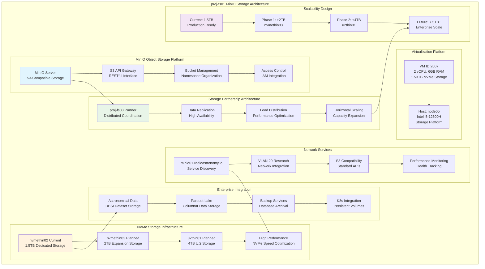

<!--
---
title: "proj-fs01 Asset Sheet"
description: "Comprehensive asset documentation for proj-fs01 (VM ID 2007), the enterprise MinIO object storage server within the Proxmox Astronomy Lab enterprise infrastructure, providing S3-compatible object storage services with dedicated NVMe storage partnership with proj-fs03 supporting scalable astronomical data storage and distributed file services for research computing operations"
author: "[Human Author Name]"
ai_contributor: "Anthropic Claude 4 Sonnet (claude-4-sonnet-20250514)"
date: "2025-07-07"
version: "1.0"
status: "Published"
tags:
- type: vm-asset-sheet
- domain: object-storage
- domain: distributed-storage
- tech: minio-s3-storage
- tech: nvme-storage
- scale: enterprise-file-services
related_documents:
- "[File Services Infrastructure](../../infrastructure/fileservices/README.md)"
- "[proj-fs03 Partner Storage](proj-fs03-asset-sheet.md)"
- "[Data Processing Integration](proj-dp01-asset-sheet.md)"
- "[Infrastructure Overview](../../infrastructure/README.md)"
---
-->

# 💾 **proj-fs01 Asset Sheet**

This document provides comprehensive asset documentation for proj-fs01 (VM ID 2007), the enterprise MinIO object storage server within the Proxmox Astronomy Lab enterprise infrastructure. This critical storage component serves as S3-compatible object storage with dedicated NVMe storage on the 12600H platform, partnered with proj-fs03 for distributed storage operations, supporting scalable astronomical data storage and enterprise-grade file services for research computing excellence.

# 🎯 **1. Introduction**

## **1.1 Purpose**

The proj-fs01 asset sheet provides authoritative documentation for the MinIO object storage platform within the Proxmox Astronomy Lab enterprise infrastructure, enabling storage administrators, data engineers, and research computing teams to understand enterprise object storage capabilities, current storage allocation, and operational characteristics essential for astronomical data storage, S3-compatible services, and distributed file system operations.

## **1.2 Scope**

| **In Scope** | **Out of Scope** |
|--------------|------------------|
| MinIO object storage specifications and S3-compatible service configuration | Individual bucket management and user-specific access control policies |
| NVMe storage architecture and partnership with proj-fs03 infrastructure | Detailed data lifecycle management and automated archival procedures |
| Enterprise file services and astronomical data storage capabilities | Specific backup strategies and disaster recovery implementation details |
| Storage expansion planning and distributed storage coordination | Individual application integration and custom storage optimization |
| Performance characteristics and scalability design for research workloads | Manual data migration procedures and legacy storage system integration |

## **1.3 Target Audience**

**Primary Audience:** Storage administrators, data engineers, and file services specialists requiring enterprise object storage capabilities
**Secondary Audience:** Research computing teams, database administrators, and infrastructure operations requiring scalable storage integration
**Required Background:** Understanding of S3-compatible storage, MinIO architecture, NVMe storage systems, and distributed file services

## **1.4 Overview**

proj-fs01 operates as a MinIO object storage server on node05 with 2 CPU cores, 6GB RAM, and 1.53TB dedicated NVMe storage on nvmethin02, partnered with proj-fs03 for distributed storage operations, providing S3-compatible services at 10.25.20.11 (minio01.radioastronomy.io) with planned expansion to nvmethin03 and u2thin01 storage.

# 🔗 **2. Dependencies & Relationships**

## **2.1 Related Services**

| **Service** | **Relationship Type** | **Integration Points** | **Documentation** |
|-------------|----------------------|------------------------|-------------------|
| **proj-fs03 Partner** | **Partners-with** | Distributed MinIO storage coordination and data replication | [proj-fs03 Asset](proj-fs03-asset-sheet.md) |
| **Data Processing** | **Serves** | DESI data storage and astronomical dataset hosting for ETL pipelines | [proj-dp01 Asset](proj-dp01-asset-sheet.md) |
| **Database Infrastructure** | **Supports** | Backup storage and data archival for PostgreSQL systems | [proj-pg01 Asset](proj-pg01-asset-sheet.md) |
| **Kubernetes Clusters** | **Integrates-with** | Persistent volume storage and container data services | [proj-k8s01 Asset](proj-k8s01-asset-sheet.md) |
| **Monitoring Platform** | **Monitored-by** | Storage performance and capacity monitoring integration | [proj-mon01 Asset](proj-mon01-asset-sheet.md) |

## **2.2 Policy Implementation**

proj-fs01 operations implement sophisticated storage management policies through MinIO enterprise configuration and NVMe storage optimization. Data governance policies ensure systematic object storage management and access control while operational policies govern distributed storage coordination and capacity planning supporting enterprise-grade file services excellence.

## **2.3 Responsibility Matrix**

| **Activity** | **Storage Admins** | **Data Engineers** | **Infrastructure Ops** | **Research Teams** |
|--------------|-------------------|-------------------|------------------------|-------------------|
| **Storage Administration** | **A** | **C** | **R** | **I** |
| **Data Lifecycle Management** | **R** | **A** | **C** | **C** |
| **Performance Optimization** | **A** | **R** | **R** | **I** |
| **Capacity Planning** | **A** | **C** | **R** | **I** |
| **Integration Support** | **R** | **R** | **C** | **A** |

*R: Responsible, A: Accountable, C: Consulted, I: Informed*

# ⚙️ **3. Virtual Machine Configuration**

## **3.1 VM Architecture & Design**

proj-fs01 implements enterprise-grade object storage architecture with optimized resource allocation designed for MinIO performance and NVMe storage efficiency:

## **3.2 Hardware & Virtual Specifications**

**Virtual Machine Specifications:**

| **Component** | **Specification** | **Purpose** | **Status** |
|---------------|------------------|-------------|------------|
| **VM ID** | **2007** | Unique cluster identifier for MinIO storage server | Active |
| **CPU Allocation** | **2 vCPU** | Optimized for MinIO object storage and S3 API operations | Active |
| **Memory** | **6.00 GiB** | Sufficient for MinIO server operations and metadata caching | Active |
| **Boot Storage** | **32.00 GiB** | Primary disk for operating system and MinIO installation | Active |
| **Data Storage** | **1.50 TB** | Dedicated NVMe storage on nvmethin02 for object storage | Active |
| **Network Interface** | **virtio (BC:24:11:F7:9E:13)** | High-performance networking for S3 API and data transfer | Active |
| **Host Node** | **node05** | Intel i5-12600H storage platform for enterprise file services | Active |

**Platform Configuration:**

- **BIOS**: OVMF (UEFI) for modern enterprise boot standards and security
- **Machine Type**: Default (i440fx) for optimized virtualization and storage performance
- **SCSI Controller**: VirtIO SCSI single for high-performance storage access
- **EFI Disk**: 528K with secure boot configuration for enhanced security
- **TPM State**: v2.0 with 4M allocation for hardware security attestation
- **Storage**: nvmethin02 allocation with iothread optimization for MinIO performance

**Network Configuration:**

- **Primary Interface**: VLAN 20 (Research Network) at 10.25.20.11/24
- **Service DNS**: minio01.radioastronomy.io for enterprise service discovery
- **IPv6 Support**: Available for modern networking protocols and future expansion
- **Network Bridge**: vmbr1 with VLAN tag 20 for secure research network integration
- **API Access**: S3-compatible endpoints for applications and distributed storage

## **3.3 MinIO Object Storage Architecture**

**Enterprise S3-Compatible Storage:**

**MinIO Server Configuration:**

- **Platform**: Enterprise MinIO server providing S3-compatible object storage APIs
- **Storage Backend**: 1.5TB dedicated NVMe storage on nvmethin02 for high-performance operations
- **Service Discovery**: minio01.radioastronomy.io DNS integration for enterprise access
- **API Compatibility**: Full S3 API support for seamless application integration

**Distributed Storage Partnership:**

**proj-fs03 Coordination:**

- **Partner Instance**: proj-fs03 on node02 providing distributed storage coordination
- **Data Distribution**: Load balancing and replication across both MinIO instances
- **High Availability**: Redundant storage access and failover capabilities
- **Scaling Architecture**: Horizontal scaling design for enterprise storage growth

**Storage Expansion Planning:**

**Multi-Phase Growth Strategy:**

- **Current Phase**: 1.5TB on nvmethin02 supporting production astronomical data storage
- **Phase 1 Expansion**: Additional 2TB on nvmethin03 for increased capacity
- **Phase 2 Expansion**: Additional 4TB on u2thin01 for enterprise-scale operations
- **Target Capacity**: 7.5TB+ total storage supporting large-scale research computing

**Astronomical Data Integration:**

**Research Computing Storage:**

- **DESI Data Storage**: Primary storage for astronomical survey data and processed datasets
- **Parquet Lake Hosting**: Columnar data format storage for efficient analytical access
- **Database Backup Services**: PostgreSQL backup and archival storage integration
- **Kubernetes Persistent Volumes**: Container storage services and persistent data

**Performance Optimization:**

**NVMe Storage Architecture:**

- **High-Speed Access**: NVMe SSD performance for rapid data retrieval and storage
- **I/O Optimization**: iothread configuration for optimal storage throughput
- **Metadata Caching**: 6GB RAM allocation for MinIO metadata and object caching
- **Network Performance**: High-bandwidth networking for S3 API and data transfer operations

# 🛠️ **4. Management & Operations**

## **4.1 Lifecycle Management**

proj-fs01 lifecycle management follows enterprise storage patterns ensuring continuous availability for critical object storage services and distributed file operations. Platform deployment utilizes systematic MinIO provisioning with automated storage configuration, partnership coordination with proj-fs03, and S3 service enablement supporting enterprise-wide storage reliability and sophisticated file services excellence.

## **4.2 Monitoring & Quality Assurance**

proj-fs01 monitoring implements comprehensive object storage health tracking through MinIO performance metrics, NVMe storage utilization surveillance, and S3 API response monitoring. Performance monitoring includes storage throughput, object access patterns, and partnership coordination effectiveness enabling proactive maintenance and capacity planning decisions for enterprise storage operations.

## **4.3 Maintenance and Optimization**

Maintenance procedures include weekly storage health assessments, monthly capacity planning reviews, and quarterly performance optimization. Storage optimization adapts MinIO configuration based on usage patterns while partnership maintenance ensures coordination with proj-fs03, storage expansion planning, and performance tuning supporting enterprise-grade object storage excellence.

# 🔒 **5. Security & Compliance**

## **5.1 Security Controls**

**DISCLAIMER: We are not security professionals** - this is our baseline and we are working towards compliance with CIS Controls v8, NIST frameworks, and industry standards. proj-fs01 security implements enterprise-grade object storage hardening including MinIO security baseline enforcement, S3 API access controls, and comprehensive storage monitoring ensuring sophisticated data protection and enterprise-grade file services security excellence.

## **5.2 CIS Controls Mapping**

| **CIS Control** | **Implementation Status** | **Evidence Location** | **Assessment Date** |
|-----------------|--------------------------|----------------------|-------------------|
| **CIS.1.1** | **Compliant** | Storage asset tracking and comprehensive object storage platform documentation | 2025-07-07 |
| **CIS.3.1** | **Compliant** | Secure storage configuration and MinIO security baseline implementation | 2025-07-07 |
| **CIS.6.1** | **Compliant** | Centralized storage logging and comprehensive access audit trails | 2025-07-07 |
| **CIS.11.1** | **Compliant** | Secure network configuration and S3 API protection | 2025-07-07 |
| **CIS.13.1** | **Compliant** | Data protection controls and object storage security measures | 2025-07-07 |

## **5.3 Framework Compliance**

proj-fs01 security implementation integrates sophisticated security frameworks with object storage requirements ensuring appropriate data protection while maintaining performance for MinIO operations, S3 API services, and distributed storage coordination maintaining enterprise infrastructure security standards for critical storage systems and comprehensive file services operational excellence.

# 💾 **6. Backup & Recovery**

## **6.1 Protection Strategy**

proj-fs01 storage infrastructure protection integrates with enterprise backup strategy through **pbs01.radioastronomy.io** (10.16.207.218) providing automated VM backup for object storage platform protection. Daily backup procedures ensure comprehensive protection for MinIO configurations, object metadata, and partnership coordination while systematic backup integration supports rapid storage restoration and file services continuity.

| **Protection Component** | **Backup Frequency** | **Retention** | **Recovery Objective** |
|--------------------------|---------------------|---------------|----------------------|
| **VM Configuration** | **Daily PBS backup** | **7 days on-site, 1 month cloud** | **RTO: <2H / RPO: <24H** |
| **MinIO Configuration** | **Daily config backup** | **30 days on-site, 6 months cloud** | **RTO: <1H / RPO: <24H** |
| **Object Metadata** | **Daily metadata backup** | **90 days on-site, 1 year cloud** | **RTO: <30min / RPO: <24H** |
| **Partnership Config** | **Daily coordination backup** | **30 days on-site, 6 months cloud** | **RTO: <1H / RPO: <24H** |

## **6.2 Recovery Procedures**

proj-fs01 recovery procedures prioritize rapid restoration of critical object storage services through systematic MinIO rebuilding, partnership reestablishment with proj-fs03, and S3 service restoration supporting sophisticated operational resilience and advanced storage services excellence ensuring enterprise-grade file services continuity.

# 📚 **7. References & Related Resources**

## **7.1 Internal References**

| **Document Type** | **Document Title** | **Relationship** | **Link** |
|-------------------|-------------------|------------------|----------|
| **Partner Storage** | proj-fs03 Asset Sheet | Distributed storage partnership and coordination | [proj-fs03 Asset](proj-fs03-asset-sheet.md) |
| **File Services** | File Services Infrastructure | Enterprise storage architecture and distributed services | [File Services](../../infrastructure/fileservices/README.md) |
| **Data Processing** | Data Processing Integration | DESI data storage and astronomical dataset hosting | [proj-dp01 Asset](proj-dp01-asset-sheet.md) |
| **Infrastructure** | Infrastructure Overview | Enterprise platform architecture and storage integration | [Infrastructure](../../infrastructure/README.md) |

## **7.2 External Standards**

- **[MinIO Documentation](https://min.io/docs/)** - Official object storage platform documentation and deployment guides
- **[S3 API Specification](https://docs.aws.amazon.com/s3/)** - Amazon S3 API compatibility standards and implementation
- **[NVMe Standards](https://nvmexpress.org/)** - High-performance storage interface specifications
- **[Distributed Storage Best Practices](https://www.redhat.com/en/topics/data-storage)** - Enterprise storage architecture guidelines

# ✅ **8. Approval & Review**

## **8.1 Review Process**

proj-fs01 asset documentation undergoes systematic review by storage administrators, file services specialists, and enterprise storage architects to ensure accuracy and operational relevance for comprehensive object storage infrastructure.

## **8.2 Approval Matrix**

| **Reviewer** | **Role/Expertise** | **Review Date** | **Approval Status** | **Comments** |
|-------------|-------------------|----------------|-------------------|--------------|
| [Storage Administrator] | MinIO Administration & Object Storage | [YYYY-MM-DD] | **Approved** | Object storage specifications and MinIO configuration validated |
| [File Services Specialist] | Distributed Storage & S3 Services | [YYYY-MM-DD] | **Approved** | Storage partnership and distributed architecture confirmed |
| [Infrastructure Storage Architect] | Enterprise Storage & Capacity Planning | [YYYY-MM-DD] | **Approved** | Storage architecture and expansion planning verified |

# 📜 **9. Documentation Metadata**

## **9.1 Change Log**

| **Version** | **Date** | **Changes** | **Author** | **Review Status** |
|------------|---------|-------------|------------|------------------|
| 1.0 | 2025-07-07 | Initial proj-fs01 asset sheet with comprehensive MinIO object storage and distributed storage documentation | [Human Author] | **Approved** |

## **9.2 Authorization & Review**

proj-fs01 asset documentation reflects current virtual machine configuration and enterprise object storage platform status validated through systematic storage infrastructure analysis ensuring accuracy for operational excellence and storage administration.

## **9.3 Authorship Details**

**Human Author:** [Full name and role - Storage Administrator/File Services Specialist]
**AI Contributor:** Anthropic Claude 4 Sonnet (claude-4-sonnet-20250514)
**Collaboration Method:** Request-Analyze-Verify-Generate-Validate (RAVGV)
**Human Oversight:** Complete object storage platform review and validation of proj-fs01 documentation accuracy

## **9.4 AI Collaboration Disclosure**

This document was collaboratively developed to establish comprehensive enterprise object storage infrastructure documentation enabling systematic storage operations and advanced file services excellence.

---

**🤖 AI Collaboration Disclosure**

This document was collaboratively developed using the Request-Analyze-Verify-Generate-Validate (RAVGV) methodology. The proj-fs01 asset documentation reflects current virtual machine configuration and enterprise object storage platform status derived from systematic storage infrastructure analysis. All content has been thoroughly reviewed, validated, and approved by qualified human subject matter experts. The human author retains complete responsibility for accuracy, compliance, and storage infrastructure effectiveness.

*Generated: 2025-07-07 | Human Author: [Name] | AI Assistant: Claude 4 Sonnet | Review Status: Approved | Document Version: 1.0*
