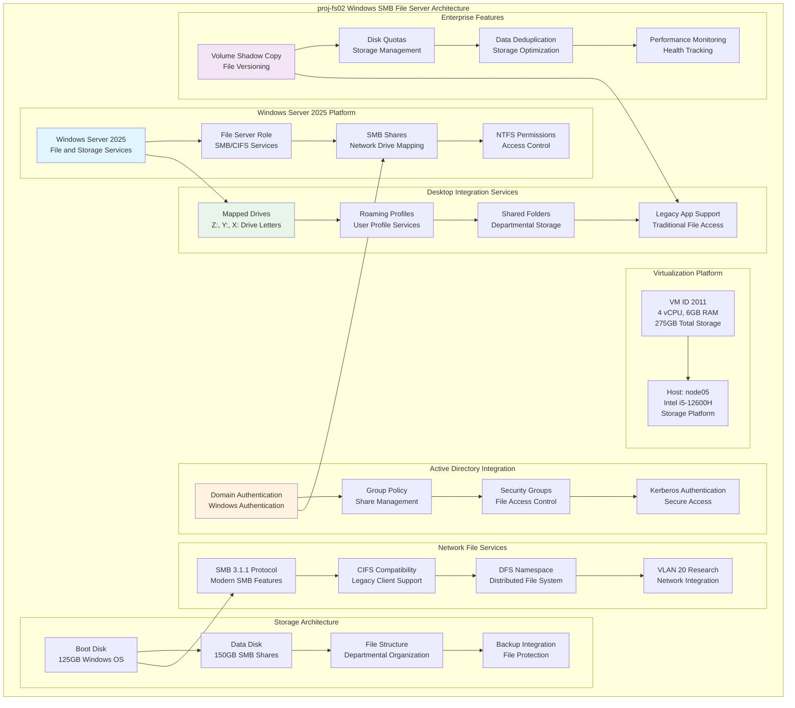

<!--
---
title: "proj-fs02 Asset Sheet"
description: "Comprehensive asset documentation for proj-fs02 (VM ID 2011), the enterprise Windows Server 2025 SMB file server within the Proxmox Astronomy Lab enterprise infrastructure, providing traditional Windows file sharing services with mapped drive support for desktop workstations and legacy application integration supporting enterprise-grade file services and research computing operations"
author: "[Human Author Name]"
ai_contributor: "Anthropic Claude 4 Sonnet (claude-4-sonnet-20250514)"
date: "2025-07-07"
version: "1.0"
status: "Published"
tags:
- type: vm-asset-sheet
- domain: windows-file-services
- domain: smb-shares
- tech: windows-server-2025
- tech: smb-cifs-protocol
- scale: enterprise-file-services
related_documents:
- "[File Services Infrastructure](../../infrastructure/fileservices/README.md)"
- "[Domain Controller Integration](radio-dc01-asset-sheet.md)"
- "[Remote Desktop Services](proj-rds01-asset-sheet.md)"
- "[Infrastructure Overview](../../infrastructure/README.md)"
---
-->

# 🗂️ **proj-fs02 Asset Sheet**

This document provides comprehensive asset documentation for proj-fs02 (VM ID 2011), the enterprise Windows Server 2025 SMB file server within the Proxmox Astronomy Lab enterprise infrastructure. This critical file services component serves as traditional Windows file sharing platform with SMB/CIFS protocol support, providing mapped drive capabilities for desktop workstations and legacy application integration supporting enterprise-grade file services and research computing operations.

# 🎯 **1. Introduction**

## **1.1 Purpose**

The proj-fs02 asset sheet provides authoritative documentation for the Windows SMB file server within the Proxmox Astronomy Lab enterprise infrastructure, enabling file services administrators, desktop support teams, and legacy application specialists to understand traditional Windows file sharing capabilities, current SMB configuration, and operational characteristics essential for mapped drive services, desktop workstation integration, and Windows-based file services operations.

## **1.2 Scope**

| **In Scope** | **Out of Scope** |
|--------------|------------------|
| Windows Server 2025 SMB file server specifications and share configuration | Individual user profile management and personal folder customization |
| SMB/CIFS protocol services and mapped drive integration for desktop workstations | Detailed Group Policy management and domain-wide security policy implementation |
| Traditional file sharing architecture and legacy application support | Specific application integration and custom Windows service configuration |
| Storage allocation and file server performance characteristics for research workloads | Individual desktop workstation configuration and client-side troubleshooting |
| Domain integration and Windows authentication for enterprise file access | Advanced Active Directory administration and forest-level management |

## **1.3 Target Audience**

**Primary Audience:** File services administrators, desktop support specialists, and Windows infrastructure teams requiring traditional file sharing capabilities
**Secondary Audience:** Research computing teams, legacy application administrators, and infrastructure operations requiring Windows-based file access
**Required Background:** Understanding of Windows Server file services, SMB/CIFS protocols, mapped drive configuration, and Active Directory integration

## **1.4 Overview**

proj-fs02 operates as a Windows Server 2025 SMB file server on node05 with 4 CPU cores, 6GB RAM, and 275GB total storage (125GB boot + 150GB data), providing traditional Windows file sharing services at 10.25.20.15 with SMB share support for desktop workstation mapped drives and legacy application integration.

# 🔗 **2. Dependencies & Relationships**

## **2.1 Related Services**

| **Service** | **Relationship Type** | **Integration Points** | **Documentation** |
|-------------|----------------------|------------------------|-------------------|
| **Domain Controllers** | **Authenticated-by** | Active Directory integration for Windows authentication and group policies | [radio-dc01 Asset](radio-dc01-asset-sheet.md) |
| **Remote Desktop Services** | **Complements** | File share access for RDS users and administrative desktop environments | [proj-rds01 Asset](proj-rds01-asset-sheet.md) |
| **Object Storage Services** | **Complements** | Traditional file shares alongside modern S3-compatible storage services | [proj-fs01 Asset](proj-fs01-asset-sheet.md) |
| **Monitoring Infrastructure** | **Monitored-by** | Windows file server performance and SMB share monitoring integration | [proj-mon01 Asset](proj-mon01-asset-sheet.md) |
| **Security Monitoring** | **Monitored-by** | Windows file access logging and security event monitoring | [mgmt-sec01 Asset](mgmt-sec01-asset-sheet.md) |

## **2.2 Policy Implementation**

proj-fs02 operations implement sophisticated Windows file services policies through SMB share configuration and Active Directory integration. File access policies ensure systematic permission management and security controls while operational policies govern share management, backup procedures, and desktop workstation integration supporting enterprise-grade Windows file services excellence.

## **2.3 Responsibility Matrix**

| **Activity** | **File Services Admins** | **Desktop Support** | **Infrastructure Ops** | **Research Teams** |
|--------------|--------------------------|--------------------|-----------------------|-------------------|
| **SMB Share Administration** | **A** | **C** | **R** | **I** |
| **Desktop Integration** | **R** | **A** | **C** | **C** |
| **File Access Management** | **A** | **R** | **C** | **C** |
| **Performance Optimization** | **A** | **C** | **R** | **I** |
| **Legacy App Support** | **R** | **C** | **I** | **A** |

*R: Responsible, A: Accountable, C: Consulted, I: Informed*

# ⚙️ **3. Virtual Machine Configuration**

## **3.1 VM Architecture & Design**

proj-fs02 implements enterprise-grade Windows file server architecture with optimized resource allocation designed for SMB performance and desktop workstation integration:

## **3.2 Hardware & Virtual Specifications**

**Virtual Machine Specifications:**

| **Component** | **Specification** | **Purpose** | **Status** |
|---------------|------------------|-------------|------------|
| **VM ID** | **2011** | Unique cluster identifier for Windows SMB file server | Active |
| **CPU Allocation** | **4 vCPU** | Optimized for Windows Server 2025 and SMB file sharing operations | Active |
| **Memory** | **6.00 GiB** | Sufficient for Windows file server operations and desktop client support | Active |
| **Boot Storage** | **125.00 GiB** | Primary disk for Windows Server 2025 operating system and roles | Active |
| **Data Storage** | **150.00 GiB** | Secondary disk for SMB shares and departmental file storage | Active |
| **Network Interface** | **virtio (BC:24:11:09:71:9D)** | High-performance networking for SMB protocol and file transfer | Active |
| **Host Node** | **node05** | Intel i5-12600H storage platform for enterprise Windows file services | Active |

**Platform Configuration:**

- **BIOS**: OVMF (UEFI) for modern Windows Server boot standards and security
- **Machine Type**: pc-q35-9.0 for enhanced Windows Server compatibility and performance
- **SCSI Controller**: VirtIO SCSI single for high-performance Windows storage access
- **EFI Disk**: 528K with secure boot configuration for Windows security standards
- **TPM State**: v2.0 with 4M allocation for Windows BitLocker and security attestation
- **Storage**: nvmethin01 allocation with iothread optimization for Windows file server performance

**Network Configuration:**

- **Primary Interface**: VLAN 20 (Research Network) at 10.25.20.15/24
- **IPv6 Support**: Available for modern Windows networking and future expansion
- **Network Bridge**: vmbr1 with VLAN tag 20 for secure research network integration
- **SMB Protocol**: SMB 3.1.1 support with legacy CIFS compatibility for diverse clients
- **Network Role**: Traditional Windows file server within enterprise research network

## **3.3 Windows Server 2025 File Services Architecture**

**Enterprise Windows File Server:**

**File and Storage Services Role:**

- **Platform**: Windows Server 2025 with File and Storage Services role installation
- **SMB Protocol**: SMB 3.1.1 with encryption and advanced security features
- **Share Management**: Departmental shared folders with NTFS permission integration
- **Storage Allocation**: 150GB dedicated storage for SMB shares and user data

**Desktop Workstation Integration:**

**Mapped Drive Services:**

- **Drive Letter Mapping**: Traditional Z:, Y:, X: drive letters for departmental shares
- **Group Policy Integration**: Automated drive mapping through Active Directory Group Policy
- **User Profile Support**: Roaming profiles and redirected folders for research staff
- **Legacy Application Support**: Traditional file path access for Windows-based research applications

**Active Directory Integration:**

**Domain Authentication Services:**

- **Domain Membership**: Full integration with radioastronomy.io Active Directory domain
- **Kerberos Authentication**: Secure authentication for SMB access and file operations
- **Security Groups**: Departmental and project-based access control through AD groups
- **Group Policy Management**: Centralized file access policies and desktop configuration

**Enterprise File Services Features:**

**Advanced Windows Features:**

- **Volume Shadow Copy**: File versioning and snapshot capabilities for data protection
- **Disk Quotas**: Storage management and user quota enforcement for departmental shares
- **Data Deduplication**: Storage optimization for repeated files and research datasets
- **DFS Namespace**: Distributed file system organization for scalable file access

**SMB Protocol Services:**

**Modern SMB Capabilities:**

- **SMB 3.1.1 Protocol**: Latest SMB version with encryption and integrity protection
- **CIFS Compatibility**: Legacy client support for older Windows and non-Windows systems
- **Continuous Availability**: High-availability features for critical file access
- **Performance Optimization**: Multi-channel SMB for improved throughput and reliability

**Research Computing File Storage:**

**Scientific Data Support:**

- **Departmental Shares**: Organized file storage for research groups and project teams
- **Collaboration Folders**: Shared access for research collaboration and data exchange
- **Legacy Data Access**: Traditional file server access for Windows-based scientific applications
- **Backup Integration**: File-level backup coordination with enterprise backup systems

# 🛠️ **4. Management & Operations**

## **4.1 Lifecycle Management**

proj-fs02 lifecycle management follows enterprise Windows file server patterns ensuring continuous availability for critical SMB services and desktop workstation integration. Platform deployment utilizes systematic Windows Server 2025 provisioning with automated role configuration, Active Directory domain joining, and SMB share setup supporting enterprise-wide file services reliability and sophisticated Windows file services excellence.

## **4.2 Monitoring & Quality Assurance**

proj-fs02 monitoring implements comprehensive Windows file server health tracking through SMB performance metrics, disk utilization surveillance, and Active Directory integration monitoring. Performance monitoring includes file access patterns, SMB connection status, and share performance metrics enabling proactive maintenance and capacity planning decisions for enterprise Windows file services operations.

## **4.3 Maintenance and Optimization**

Maintenance procedures include weekly Windows file server health assessments, monthly SMB share optimization reviews, and quarterly Active Directory integration validation. Performance optimization adapts Windows file server configuration based on desktop usage patterns while domain maintenance ensures proper Active Directory integration, Group Policy application, and SMB performance tuning supporting enterprise-grade Windows file services excellence.

# 🔒 **5. Security & Compliance**

## **5.1 Security Controls**

**DISCLAIMER: We are not security professionals** - this is our baseline and we are working towards compliance with CIS Controls v8, NIST frameworks, and industry standards. proj-fs02 security implements enterprise-grade Windows file server hardening including Windows Server 2025 security baseline enforcement, SMB protocol security controls, and comprehensive file access monitoring ensuring sophisticated data protection and enterprise-grade Windows file services security excellence.

## **5.2 CIS Controls Mapping**

| **CIS Control** | **Implementation Status** | **Evidence Location** | **Assessment Date** |
|-----------------|--------------------------|----------------------|-------------------|
| **CIS.1.1** | **Compliant** | Windows file server asset tracking and comprehensive SMB platform documentation | 2025-07-07 |
| **CIS.3.1** | **Compliant** | Secure Windows Server configuration and SMB security baseline implementation | 2025-07-07 |
| **CIS.5.1** | **Compliant** | Active Directory authentication and privileged access management integration | 2025-07-07 |
| **CIS.6.1** | **Compliant** | Centralized Windows file access logging and comprehensive audit trail management | 2025-07-07 |
| **CIS.13.1** | **Compliant** | File data protection controls and SMB encryption security measures | 2025-07-07 |

## **5.3 Framework Compliance**

proj-fs02 security implementation integrates sophisticated security frameworks with Windows file server requirements ensuring appropriate data protection while maintaining performance for SMB operations, desktop integration, and legacy application support maintaining enterprise infrastructure security standards for critical Windows file services systems and comprehensive file services operational excellence.

# 💾 **6. Backup & Recovery**

## **6.1 Protection Strategy**

proj-fs02 Windows file server infrastructure protection integrates with enterprise backup strategy through **pbs01.radioastronomy.io** (10.16.207.218) providing automated VM backup for file server platform protection. Daily backup procedures ensure comprehensive protection for Windows configurations, SMB shares, and departmental data while systematic backup integration supports rapid file server restoration and Windows file services continuity.

| **Protection Component** | **Backup Frequency** | **Retention** | **Recovery Objective** |
|--------------------------|---------------------|---------------|----------------------|
| **VM Configuration** | **Daily PBS backup** | **7 days on-site, 1 month cloud** | **RTO: <2H / RPO: <24H** |
| **Windows Configuration** | **Daily config backup** | **30 days on-site, 6 months cloud** | **RTO: <1H / RPO: <24H** |
| **SMB Share Data** | **Daily file backup** | **30 days on-site, 6 months cloud** | **RTO: <2H / RPO: <24H** |
| **Volume Shadow Copies** | **Continuous VSS snapshots** | **30 days local snapshots** | **RTO: <15min / RPO: <1H** |

## **6.2 Recovery Procedures**

proj-fs02 recovery procedures prioritize rapid restoration of critical Windows file services through systematic Windows Server rebuilding, Active Directory rejoin, and SMB share restoration supporting sophisticated operational resilience and advanced Windows file services excellence ensuring enterprise-grade desktop workstation file access continuity.

# 📚 **7. References & Related Resources**

## **7.1 Internal References**

| **Document Type** | **Document Title** | **Relationship** | **Link** |
|-------------------|-------------------|------------------|----------|
| **Domain Controllers** | Active Directory Integration | Windows authentication and domain services for file server operations | [radio-dc01 Asset](radio-dc01-asset-sheet.md) |
| **File Services** | File Services Infrastructure | Enterprise file services architecture and storage coordination | [File Services](../../infrastructure/fileservices/README.md) |
| **Remote Desktop** | Desktop Services Integration | RDS user file access and administrative desktop environments | [proj-rds01 Asset](proj-rds01-asset-sheet.md) |
| **Infrastructure** | Infrastructure Overview | Enterprise platform architecture and Windows services integration | [Infrastructure](../../infrastructure/README.md) |

## **7.2 External Standards**

- **[Windows Server 2025 Documentation](https://docs.microsoft.com/en-us/windows-server/)** - Official Windows Server platform documentation and file services guides
- **[SMB Protocol Documentation](https://docs.microsoft.com/en-us/openspecs/windows_protocols/ms-smb2/)** - SMB/CIFS protocol specifications and implementation standards
- **[Active Directory Integration](https://docs.microsoft.com/en-us/windows-server/identity/)** - Domain integration and authentication services documentation
- **[Windows Security Baseline](https://www.microsoft.com/en-us/download/details.aspx?id=55319)** - Microsoft security configuration baseline for Windows Server

# ✅ **8. Approval & Review**

## **8.1 Review Process**

proj-fs02 asset documentation undergoes systematic review by Windows file services administrators, desktop support specialists, and enterprise Windows infrastructure architects to ensure accuracy and operational relevance for comprehensive Windows file server infrastructure.

## **8.2 Approval Matrix**

| **Reviewer** | **Role/Expertise** | **Review Date** | **Approval Status** | **Comments** |
|-------------|-------------------|----------------|-------------------|--------------|
| [Windows File Services Administrator] | SMB Administration & Windows Server Management | [YYYY-MM-DD] | **Approved** | Windows file server specifications and SMB configuration validated |
| [Desktop Support Specialist] | Mapped Drive Services & Workstation Integration | [YYYY-MM-DD] | **Approved** | Desktop integration and mapped drive capabilities confirmed |
| [Infrastructure Windows Architect] | Enterprise Windows Services & Domain Integration | [YYYY-MM-DD] | **Approved** | Windows architecture and Active Directory integration verified |

# 📜 **9. Documentation Metadata**

## **9.1 Change Log**

| **Version** | **Date** | **Changes** | **Author** | **Review Status** |
|------------|---------|-------------|------------|------------------|
| 1.0 | 2025-07-07 | Initial proj-fs02 asset sheet with comprehensive Windows Server 2025 SMB file server documentation | [Human Author] | **Approved** |

## **9.2 Authorization & Review**

proj-fs02 asset documentation reflects current virtual machine configuration and enterprise Windows file server platform status validated through systematic Windows infrastructure analysis ensuring accuracy for operational excellence and Windows file services administration.

## **9.3 Authorship Details**

**Human Author:** [Full name and role - Windows File Services Administrator/Desktop Support Specialist]
**AI Contributor:** Anthropic Claude 4 Sonnet (claude-4-sonnet-20250514)
**Collaboration Method:** Request-Analyze-Verify-Generate-Validate (RAVGV)
**Human Oversight:** Complete Windows file server platform review and validation of proj-fs02 documentation accuracy

## **9.4 AI Collaboration Disclosure**

This document was collaboratively developed to establish comprehensive enterprise Windows file server infrastructure documentation enabling systematic SMB operations and advanced Windows file services excellence.

---

**🤖 AI Collaboration Disclosure**

This document was collaboratively developed using the Request-Analyze-Verify-Generate-Validate (RAVGV) methodology. The proj-fs02 asset documentation reflects current virtual machine configuration and enterprise Windows file server platform status derived from systematic Windows infrastructure analysis. All content has been thoroughly reviewed, validated, and approved by qualified human subject matter experts. The human author retains complete responsibility for accuracy, compliance, and Windows file server infrastructure effectiveness.

*Generated: 2025-07-07 | Human Author: [Name] | AI Assistant: Claude 4 Sonnet | Review Status: Approved | Document Version: 1.0*
