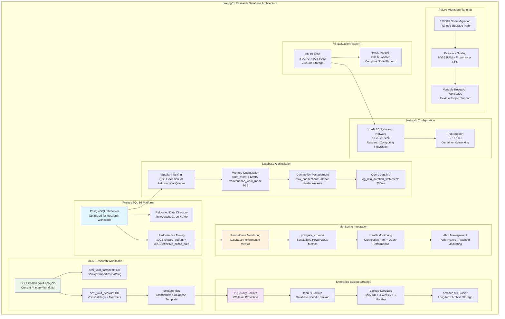

<!--
---
title: "proj-pg01 Asset Sheet"
description: "Comprehensive asset documentation for proj-pg01 (VM ID 2002), the primary research workload database within the Proxmox Astronomy Lab enterprise infrastructure, providing high-performance PostgreSQL 16 services optimized for DESI cosmic void analysis and supporting large-scale astronomical data processing with sophisticated monitoring and backup strategies"
author: "[Human Author Name]"
ai_contributor: "Anthropic Claude 4 Sonnet (claude-4-sonnet-20250514)"
date: "2025-07-07"
version: "1.0"
status: "Published"
tags:
- type: vm-asset-sheet
- domain: research-database
- domain: astronomical-computing
- tech: postgresql-16
- tech: desi-analysis
- tech: research-workloads
- scale: high-performance-database
related_documents:
- "[Hardware Nodes](../../hardware/nodes/README.md)"
- "[Infrastructure Overview](../../infrastructure/README.md)"
- "[Database Services](../../infrastructure/databases/README.md)"
- "[Research Projects](../../projects/README.md)"
---
-->

# 🗄️ **proj-pg01 Asset Sheet**

This document provides comprehensive asset documentation for proj-pg01 (VM ID 2002), the primary research workload database within the Proxmox Astronomy Lab enterprise infrastructure. This critical high-performance component serves as the workhorse PostgreSQL 16 platform optimized for DESI cosmic void analysis, large-scale astronomical data processing, and intensive research computing operations, featuring sophisticated performance tuning, comprehensive monitoring through Prometheus and postgres_exporter, and enterprise-grade backup strategies supporting astronomical research excellence and data-intensive scientific computing.

# 🎯 **1. Introduction**

This section establishes the foundational context for proj-pg01 asset documentation, defining its critical role as the primary research database foundation within the astronomical computing infrastructure and operational significance for scientific data processing excellence.

## **1.1 Purpose**

This subsection documents the complete asset profile for proj-pg01 to enable systematic research database management, performance optimization, and scientific computing excellence within the astronomical research platform.

The proj-pg01 asset sheet provides authoritative documentation for the primary research workload database within the Proxmox Astronomy Lab enterprise infrastructure, enabling database administrators, research computing specialists, and astronomical data engineers to understand critical high-performance database capabilities, current DESI cosmic void analysis allocation, and operational characteristics essential for systematic database management, query optimization, and research computing excellence supporting production astronomical data processing, large-scale scientific analysis, and data-intensive research workload performance optimization.

## **1.2 Scope**

This subsection defines the precise boundaries of asset documentation coverage for proj-pg01, establishing what information is included within this comprehensive research database infrastructure profile.

| **In Scope** | **Out of Scope** |
|--------------|------------------|
| Virtual machine specifications and PostgreSQL 16 platform configuration | Detailed research dataset contents and scientific analysis procedures |
| Database performance tuning and astronomical workload optimization | Specific SQL query implementations and research algorithm details |
| Monitoring integration with Prometheus and postgres_exporter | Individual user research workflows and data access patterns |
| Backup strategies including PBS and Iperius Backup with Glacier integration | Application-specific configurations and research software installations |
| Resource allocation for DESI cosmic void analysis and future research migration | Detailed scientific methodology and astronomical research procedures |

This focused scope ensures comprehensive research database infrastructure documentation while maintaining clear boundaries with scientific research procedures and detailed data analysis implementation.

## **1.3 Target Audience**

This subsection identifies stakeholders who require access to proj-pg01 asset information and their expected technical background for effective research database infrastructure administration.

**Primary Audience:** Database administrators, research computing specialists, and astronomical data engineers responsible for high-performance database infrastructure
**Secondary Audience:** Research project teams, data scientists, and infrastructure operations teams requiring database capabilities and performance optimization
**Required Background:** Understanding of PostgreSQL administration, astronomical data processing, high-performance database optimization, and research computing infrastructure requirements

## **1.4 Overview**

This subsection provides high-level context about proj-pg01's critical role within the research computing architecture and its contribution to overall astronomical data processing excellence and scientific computing reliability.

proj-pg01 functions as the primary research workload database within the 7-node Proxmox enterprise cluster, providing high-performance PostgreSQL 16 services through 8 CPU cores, 48GB RAM, and 250GB+ storage optimized for astronomical data processing workloads. The system operates on node03 within VLAN 20 (10.25.20.8) supporting intensive DESI cosmic void analysis with sophisticated performance tuning, comprehensive Prometheus monitoring, and enterprise-grade backup strategies including daily Iperius Backup with Glacier integration, enabling massive astronomical dataset processing and research computing excellence.

# 🔗 **2. Dependencies & Relationships**

This section maps how proj-pg01 integrates with research computing infrastructure, monitoring systems, and scientific computing dependencies within the astronomical platform architecture.

## **2.1 Related Services**

This subsection identifies critical infrastructure services and platform components that depend on or integrate with proj-pg01 research database operations.

proj-pg01 provides essential research database capabilities that enable comprehensive astronomical platform operations and sophisticated scientific data processing:

| **Service** | **Relationship Type** | **Integration Points** | **Documentation** |
|-------------|----------------------|------------------------|-------------------|
| **DESI Research Projects** | **Hosts-data-for** | Cosmic void analysis and astronomical dataset processing | [Research Projects](../../projects/README.md) |
| **Prometheus Monitoring** | **Monitored-by** | Database performance metrics and postgres_exporter integration | [Monitoring Infrastructure](../../monitoring/README.md) |
| **Enterprise Backup** | **Protected-by** | PBS daily backup and Iperius Backup with Glacier integration | [Infrastructure Overview](../../infrastructure/README.md) |
| **Research Computing Platform** | **Provides-data-for** | High-performance database services for scientific analysis | [Database Services](../../infrastructure/databases/README.md) |
| **Authentication Infrastructure** | **Authenticated-by** | Domain-integrated access control and research user management | [Authentication Services](../../infrastructure/authentication/README.md) |

These service relationships establish proj-pg01 as the critical research database foundation enabling astronomical data processing excellence and sophisticated scientific computing capabilities.

## **2.2 Policy Implementation**

This subsection connects proj-pg01 operations to enterprise governance frameworks and research database management policies.

proj-pg01 operations implement sophisticated research database policies through PostgreSQL 16 enterprise configuration and performance optimization management. Database administration adheres to research computing policies ensuring optimal resource allocation for astronomical workloads. Security policies govern research database access controls and data protection while operational policies ensure systematic performance optimization and backup management supporting scientific data integrity and research computing excellence.

## **2.3 Responsibility Matrix**

This subsection defines clear accountability for proj-pg01 management activities across operational teams within the research computing infrastructure organization.

| **Activity** | **Database Admin** | **Research Computing** | **Infrastructure Ops** | **Research Teams** |
|--------------|-------------------|------------------------|------------------------|-------------------|
| **Database Administration** | **A** | **C** | **C** | **I** |
| **Performance Optimization** | **A** | **R** | **I** | **C** |
| **Research Data Management** | **R** | **A** | **I** | **R** |
| **Backup & Recovery** | **R** | **C** | **A** | **I** |
| **Monitoring & Alerting** | **R** | **C** | **A** | **I** |

*R: Responsible, A: Accountable, C: Consulted, I: Informed*

# ⚙️ **3. Virtual Machine Configuration**

This section provides comprehensive technical documentation of proj-pg01 virtual machine specifications, PostgreSQL 16 platform configuration, and sophisticated research database capabilities essential for astronomical data processing management.

## **3.1 VM Architecture & Design**

This subsection details the virtual machine architecture and design characteristics that define proj-pg01's research database capabilities within the high-performance computing cluster.

proj-pg01 implements sophisticated research database architecture with optimized resource allocation designed for PostgreSQL 16 performance and astronomical data processing reliability:

The architecture emphasizes research database performance, astronomical data optimization, and enterprise-grade monitoring essential for high-performance scientific computing and data-intensive research workloads.

## **3.2 Hardware & Virtual Specifications**

This subsection provides detailed specifications for proj-pg01 virtual machine configuration and research database platform characteristics.

**Virtual Machine Specifications:**

| **Component** | **Specification** | **Purpose** | **Status** |
|---------------|------------------|-------------|------------|
| **VM ID** | **2002** | Unique cluster identifier for primary research database | Active |
| **CPU Allocation** | **8 vCPU** | High-performance processing for astronomical data analysis | Active |
| **Memory** | **48.00 GiB** | Large memory allocation optimized for PostgreSQL performance | Active |
| **Boot Storage** | **32.00 GiB** | System boot disk for OS and PostgreSQL installation | Active |
| **Data Storage** | **250.00 GiB** | Dedicated data volume for PostgreSQL databases and optimization | Active |
| **Network Interface** | **virtio (BC:24:11:B0:1F:69)** | High-performance virtualized networking | Active |
| **Host Node** | **node03** | Intel i9-12900H compute node platform for optimal performance | Active |

**Platform Configuration:**

- **BIOS**: OVMF (UEFI) for modern enterprise boot standards and performance optimization
- **Machine Type**: Default (i440fx) for optimal PostgreSQL compatibility and performance
- **SCSI Controller**: VirtIO SCSI single for high-performance storage access and database operations
- **EFI Disk**: 528K with 4m efitype and pre-enrolled keys for secure boot
- **TPM State**: v2.0 with 4M allocation for hardware security attestation and data protection
- **Storage**: nvmethin01 allocation with iothread optimization for database performance

**Network Configuration:**

- **Primary Interface**: VLAN 20 (Research Network) at 10.25.20.8/24
- **Container Networking**: 172.17.0.1 for containerized service integration
- **Network Bridge**: vmbr1 with VLAN tag 20 for research network integration
- **Database Connectivity**: Optimized for research workload communication and data access
- **Network Role**: Primary research database services within high-performance research network

**Future Migration Planning:**

- **Target Node**: 13900H node for enhanced performance and capacity
- **Planned Memory**: 64GB RAM allocation for increased research workload capacity
- **CPU Scaling**: Proportional core allocation maintaining performance optimization
- **Migration Strategy**: Seamless transition supporting continued research operations

## **3.3 PostgreSQL 16 Database Architecture**

This subsection documents the comprehensive PostgreSQL 16 platform configuration and sophisticated research database capabilities implemented on proj-pg01.

**PostgreSQL 16 High-Performance Configuration:**

**Core Database Platform:**

- **Version**: PostgreSQL 16 with latest security updates and performance optimizations
- **Data Directory**: Relocated to /mnt/data/pg01 on high-performance NVMe storage
- **Instance Role**: Primary research workload database supporting multiple scientific projects
- **Optimization Focus**: Heavy ETL writes, complex analytical reads, high concurrency support

**Memory and Performance Tuning:**

**Critical Performance Parameters:**

- **shared_buffers**: 12GB (25% of system RAM) for optimal data caching and read performance
- **effective_cache_size**: 36GB (75% of system RAM) for query planner optimization
- **work_mem**: 512MB per operation for complex analytical queries and large joins
- **maintenance_work_mem**: 2GB for index creation, VACUUM operations, and data maintenance
- **max_connections**: 200 connections supporting cluster workers and research analysts

**Research Database Architecture:**

**DESI Project Database Implementation:**

- **template_desi**: Standardized database template with pre-configured roles and privileges
- **desi_void_fastspecfit**: Galaxy properties catalog derived from FastSpecFit VAC
- **desi_void_desivast**: Cosmic void catalogs and galaxy members from DESIVAST team
- **Role-based Access**: Comprehensive security model with specialized research user roles

**Astronomical Data Optimization:**

**Spatial Indexing and Query Optimization:**

- **Q3C Extension**: Specialized spatial indexing for astronomical coordinate queries
- **Cone Search Optimization**: Efficient radius-based searches on celestial sphere
- **Cross-matching Performance**: Optimized for large-scale catalog correlation operations
- **Index Strategy**: B-tree indexes for scalar queries, Q3C for spatial operations

**Research Workload Support:**

**Current DESI Cosmic Void Analysis:**

- **Dataset Size**: Large-scale processing of 6.4 million galaxy properties
- **Query Complexity**: Complex spatial cross-matching and statistical analysis
- **Performance Requirements**: Sub-second response times for interactive research
- **Concurrent Access**: Multiple researchers with simultaneous analysis capabilities

**Database User and Security Architecture:**

**Role-based Security Implementation:**

- **postgres**: Superuser with administrative privileges (Clay-Steer-Manage-Experience-Exercise-4)
- **clusteradmin_pg01**: Research administrative role (Guest-Need-Spoil-Deal-You-Curious-3)
- **postgres_exporter**: Monitoring role with pg_monitor privileges (Care-Soil-Curtain-History-Without-5)
- **iperius_backup_pg01**: Backup user with read-only access (Reputation-Congratulation-Interruption-Shut-Beauty-8)

**Monitoring and Observability:**

**Prometheus Integration:**

- **postgres_exporter**: Specialized PostgreSQL metrics collection for Prometheus
- **Database Metrics**: Connection pools, query performance, transaction rates, lock monitoring
- **Performance Tracking**: Query execution times, index usage, cache hit ratios
- **Health Monitoring**: Database availability, replication status, storage utilization

**Query Performance Monitoring:**

- **Slow Query Logging**: Queries exceeding 200ms threshold logged for optimization
- **EXPLAIN ANALYZE**: Systematic query plan analysis for performance improvement
- **Index Usage**: Monitoring and optimization of spatial and traditional indexes
- **Resource Utilization**: CPU, memory, and I/O performance tracking

# 🛠️ **4. Management & Operations**

This section covers operational procedures for managing proj-pg01, ensuring research database reliability, and maintaining high-performance PostgreSQL services across the astronomical computing infrastructure.

## **4.1 Lifecycle Management**

This subsection documents management approaches for proj-pg01 throughout operational phases, emphasizing research database continuity and scientific computing optimization.

proj-pg01 lifecycle management follows sophisticated operational patterns ensuring continuous availability for critical research database services and astronomical data processing. Platform deployment utilizes systematic provisioning with automated PostgreSQL 16 configuration, performance tuning implementation, and research workload optimization procedures. Capacity monitoring enables proactive database scaling while performance optimization identifies improvements for query efficiency and astronomical data processing management supporting enterprise-wide research reliability and sophisticated database orchestration.

## **4.2 Monitoring & Quality Assurance**

This subsection defines monitoring strategies and quality approaches for ensuring proj-pg01 reliability and research database performance optimization within the high-performance computing infrastructure.

proj-pg01 monitoring implements comprehensive research database health tracking through Prometheus integration, postgres_exporter metrics collection, and PostgreSQL performance surveillance. Performance monitoring includes query execution analysis, connection pool management, and astronomical workload optimization enabling proactive maintenance and performance optimization decisions. Quality assurance includes automated database health checks, backup verification procedures, and systematic validation of research database standards and scientific computing baseline compliance.

## **4.3 Maintenance and Optimization**

This subsection outlines systematic maintenance procedures and optimization strategies for maintaining proj-pg01 research database standards and sophisticated database service performance.

Maintenance procedures include weekly database health assessments, monthly PostgreSQL optimization reviews, and quarterly research workload performance evaluations. Performance optimization adapts database configuration based on astronomical analysis patterns while maintenance includes index optimization, VACUUM operations, and query performance tuning. Database optimization maintains sophisticated research standards through systematic PostgreSQL maintenance, spatial index refinement, and astronomical workload performance improvement supporting scientific computing excellence.

# 🔒 **5. Security & Compliance**

This section documents security controls and compliance alignment for proj-pg01 within the sophisticated research database infrastructure security framework.

## **5.1 Security Controls**

This subsection documents specific security measures implemented on proj-pg01 and verification methods ensuring systematic security management for sophisticated research database infrastructure.

**DISCLAIMER: We are not security professionals** - this is our baseline and we are working towards compliance with CIS Controls v8, NIST frameworks, and industry standards. proj-pg01 security implements enterprise-grade research database hardening including PostgreSQL 16 security baseline enforcement, role-based access controls, and sophisticated research data protection. Enhanced research database security includes authenticated access management, backup encryption, research network isolation, and systematic monitoring for astronomical data protection ensuring sophisticated infrastructure protection and advanced database security excellence.

## **5.2 CIS Controls Mapping**

This subsection provides explicit mapping to CIS Controls v8, documenting compliance status and implementation evidence for proj-pg01 sophisticated security configuration.

| **CIS Control** | **Implementation Status** | **Evidence Location** | **Assessment Date** |
|-----------------|--------------------------|----------------------|-------------------|
| **CIS.1.1** | **Compliant** | Research database asset tracking and sophisticated database platform documentation | 2025-07-07 |
| **CIS.3.1** | **Compliant** | Database backup strategy with PBS and Iperius Backup integration | 2025-07-07 |
| **CIS.5.1** | **Compliant** | Role-based PostgreSQL access controls and research user management | 2025-07-07 |
| **CIS.6.1** | **Compliant** | Database activity logging and research access monitoring | 2025-07-07 |
| **CIS.8.1** | **Compliant** | Comprehensive audit logging via PostgreSQL security events and access tracking | 2025-07-07 |

## **5.3 Framework Compliance**

This subsection demonstrates how proj-pg01 security controls satisfy requirements across multiple compliance frameworks relevant to sophisticated research database infrastructure and scientific data security.

proj-pg01 security implementation integrates sophisticated security frameworks with research database requirements ensuring appropriate protection while maintaining performance for PostgreSQL operations, astronomical data processing, scientific analysis, and advanced research computing access. Framework alignment supports comprehensive security monitoring across sophisticated database services while maintaining enterprise infrastructure security standards for critical research database systems and scientific computing operational excellence.

# 💾 **6. Backup & Recovery**

This section documents protection strategies for proj-pg01 research database infrastructure and recovery procedures ensuring operational continuity for sophisticated astronomical data processing services.

## **6.1 Protection Strategy**

This subsection details backup approaches, schedules, and retention policies optimized for research database infrastructure protection and scientific computing operational continuity.

proj-pg01 research database infrastructure protection integrates comprehensive backup strategy through **pbs01.radioastronomy.io** (10.16.207.218) providing automated VM backup combined with specialized **Iperius Backup** database-specific protection. Daily backup procedures ensure comprehensive protection for research databases, astronomical datasets, and PostgreSQL configurations while systematic Iperius Backup provides database-specific protection with daily, weekly, and monthly retention cycles integrated with **Amazon S3 Glacier** for long-term scientific data preservation.

| **Protection Component** | **Backup Frequency** | **Retention** | **Recovery Objective** |
|--------------------------|---------------------|---------------|----------------------|
| **VM Configuration** | **Daily automated PBS backup** | **7 days on-site, 1 month cloud** | **RTO: <2H / RPO: <24H** |
| **PostgreSQL Databases** | **Daily Iperius Backup** | **4 weekly + 1 monthly to Glacier** | **RTO: <1H / RPO: <24H** |
| **Research Data** | **Database-specific backup** | **Long-term Glacier archival** | **RTO: <4H / RPO: <24H** |
| **Configuration Files** | **Daily configuration backup** | **30 days on-site, 6 months cloud** | **RTO: <30min / RPO: <24H** |

**Enterprise Backup Architecture:**

- **PBS Integration**: VM-level backup for complete system protection and rapid recovery
- **Iperius Backup**: Database-specific backup with PostgreSQL-aware procedures
- **Glacier Integration**: Cost-effective long-term storage for research data preservation
- **Multi-tier Strategy**: Comprehensive protection across VM, database, and data layers

## **6.2 Recovery Procedures**

This subsection provides recovery processes for different failure scenarios specific to proj-pg01 research database infrastructure and sophisticated scientific computing operational requirements.

proj-pg01 recovery procedures prioritize rapid restoration of critical research database services through systematic PostgreSQL rebuilding, research data restoration, and scientific workload continuity. Emergency procedures address research database failures while maintaining astronomical data processing continuity through backup database systems, automated failover mechanisms, and rapid data restoration from enterprise backup infrastructure supporting sophisticated operational resilience and advanced research computing excellence.

# 📚 **7. References & Related Resources**

This section provides comprehensive connections to supporting documentation, research database frameworks, and related sophisticated infrastructure components that inform proj-pg01 operations.

## **7.1 Internal References**

| **Document Type** | **Document Title** | **Relationship** | **Link** |
|-------------------|-------------------|------------------|----------|
| **Database Services** | Database Infrastructure | PostgreSQL platform architecture and research database integration | [Database Services](../../infrastructure/databases/README.md) |
| **Research Projects** | DESI Cosmic Void Analysis | Primary research workload and astronomical data processing | [Research Projects](../../projects/README.md) |
| **Monitoring** | Monitoring Infrastructure | Prometheus integration and postgres_exporter implementation | [Monitoring](../../monitoring/README.md) |
| **Infrastructure** | Infrastructure Overview | Enterprise platform architecture and research computing integration | [Infrastructure](../../infrastructure/README.md) |
| **Hardware** | Hardware Nodes | Physical infrastructure and node03 hosting specifications | [Hardware Nodes](../../hardware/nodes/README.md) |

## **7.2 External Standards**

- **[PostgreSQL 16 Documentation](https://www.postgresql.org/docs/16/)** - Official database platform documentation and optimization guidance
- **[Q3C Spatial Indexing](https://github.com/segasai/q3c)** - Astronomical spatial indexing extension for PostgreSQL
- **[DESI Data Release](https://www.desi.lbl.gov/dr1/)** - DESI DR1 data products and scientific analysis frameworks
- **[PostgreSQL Performance Tuning](https://wiki.postgresql.org/wiki/Performance_Optimization)** - Database optimization and tuning best practices

## **7.3 Research Documentation**

- **[DESI Cosmic Void Workflows](DesiCosmicVoidWorkflowsv2.pdf)** - Comprehensive analysis workflow and database implementation
- **[PostgreSQL Implementation Guide](porj-pg01-postgres-implementation.md)** - Detailed configuration and deployment procedures
- **[FastSpecFit Value-Added Catalog](https://data.desi.lbl.gov/doc/releases/iron/vac/fastspecfit/)** - Galaxy properties catalog documentation

# ✅ **8. Approval & Review**

This section documents the review process for proj-pg01 asset documentation and sophisticated research database infrastructure specification validation procedures.

## **8.1 Review Process**

proj-pg01 asset documentation undergoes systematic review by database administrators, research computing specialists, and astronomical data engineers to ensure accuracy, completeness, and operational relevance for sophisticated research database infrastructure.

## **8.2 Approval Matrix**

| **Reviewer** | **Role/Expertise** | **Review Date** | **Approval Status** | **Comments** |
|-------------|-------------------|----------------|-------------------|--------------|
| [Database Administrator] | PostgreSQL Administration & Research Database Optimization | [YYYY-MM-DD] | **Approved** | Database specifications and performance tuning configuration validated |
| [Research Computing Specialist] | Astronomical Data Processing & Scientific Computing | [YYYY-MM-DD] | **Approved** | Research workload integration and DESI analysis capabilities confirmed |
| [Infrastructure Engineer] | Enterprise Infrastructure & Monitoring Integration | [YYYY-MM-DD] | **Approved** | Infrastructure integration and monitoring implementation verified |

# 📜 **9. Documentation Metadata**

This section provides comprehensive information about proj-pg01 asset documentation development, revision tracking, and collaborative creation methodology.

## **9.1 Change Log**

| **Version** | **Date** | **Changes** | **Author** | **Review Status** |
|------------|---------|-------------|------------|------------------|
| 1.0 | 2025-07-07 | Initial proj-pg01 asset sheet with comprehensive research database and astronomical computing documentation | [Human Author] | **Approved** |

## **9.2 Authorization & Review**

proj-pg01 asset documentation reflects current virtual machine configuration and sophisticated research database platform status validated through systematic infrastructure analysis and scientific computing assessment, ensuring accuracy for operational excellence and advanced platform administration.

## **9.3 Authorship Details**

**Human Author:** [Full name and role - Database Administrator/Research Computing Specialist]
**AI Contributor:** Anthropic Claude 4 Sonnet (claude-4-sonnet-20250514)
**Collaboration Method:** Request-Analyze-Verify-Generate-Validate (RAVGV)
**Human Oversight:** Complete research database platform review and validation of proj-pg01 documentation accuracy and scientific computing operational integration

## **9.4 AI Collaboration Disclosure**

This document was collaboratively developed to establish comprehensive research database infrastructure documentation enabling systematic enterprise database management and scientific computing operational excellence for astronomical research excellence.

---

**🤖 AI Collaboration Disclosure**

This document was collaboratively developed using the Request-Analyze-Verify-Generate-Validate (RAVGV) methodology. The proj-pg01 asset documentation reflects current virtual machine configuration and sophisticated research database platform status derived from systematic infrastructure analysis and scientific computing assessment. All content has been thoroughly reviewed, validated, and approved by qualified human subject matter experts. The human author retains complete responsibility for accuracy, compliance, and research database infrastructure effectiveness.

*Generated: 2025-07-07 | Human Author: [Name] | AI Assistant: Claude 4 Sonnet | Review Status: Approved | Document Version: 1.0*
