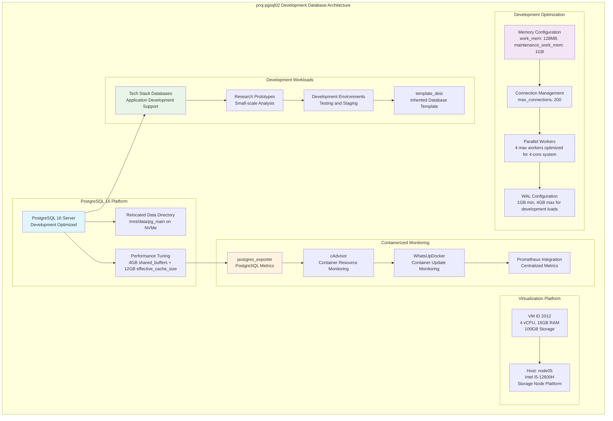

<!--
---
title: "proj-pgsql02 Asset Sheet"
description: "Comprehensive asset documentation for proj-pgsql02 (VM ID 2012), the secondary development database within the Proxmox Astronomy Lab enterprise infrastructure, providing PostgreSQL 16 services optimized for tech stacks, development workloads, and smaller research projects with containerized monitoring integration"
author: "[Human Author Name]"
ai_contributor: "Anthropic Claude 4 Sonnet (claude-4-sonnet-20250514)"
date: "2025-07-07"
version: "1.0"
status: "Published"
tags:
- type: vm-asset-sheet
- domain: development-database
- domain: secondary-workloads
- tech: postgresql-16
- tech: development-platform
- scale: development-database
related_documents:
- "[Primary Database](proj-pg01-asset-sheet.md)"
- "[Infrastructure Overview](../../infrastructure/README.md)"
- "[Database Services](../../infrastructure/databases/README.md)"
- "[Development Workflows](../../projects/README.md)"
---
-->

# 🗄️ **proj-pgsql02 Asset Sheet**

This document provides comprehensive asset documentation for proj-pgsql02 (VM ID 2012), the secondary development database within the Proxmox Astronomy Lab enterprise infrastructure. This essential development component serves as the PostgreSQL 16 platform for tech stacks, development workloads, and smaller research projects that don't require the full resources of proj-pg01, featuring optimized configuration for 4-core systems, containerized monitoring with postgres_exporter and cAdvisor, and comprehensive backup integration supporting development workflows and research prototyping excellence.

# 🎯 **1. Introduction**

## **1.1 Purpose**

The proj-pgsql02 asset sheet provides authoritative documentation for the secondary development database within the Proxmox Astronomy Lab enterprise infrastructure, enabling database administrators, development teams, and research computing specialists to understand development database capabilities, current tech stack allocation, and operational characteristics essential for development workflow management, prototype optimization, and secondary research workload excellence.

## **1.2 Scope**

| **In Scope** | **Out of Scope** |
|--------------|------------------|
| Virtual machine specifications and PostgreSQL 16 development configuration | Primary research database operations and large-scale dataset processing |
| Development workload optimization and tech stack database support | Production astronomical analysis and intensive computational workloads |
| Containerized monitoring integration with postgres_exporter and cAdvisor | Individual development environment configurations and personal projects |
| Backup strategies and development data protection | Application deployment procedures and development software installations |

## **1.3 Target Audience**

**Primary Audience:** Database administrators, development teams, and research computing specialists responsible for development database infrastructure
**Secondary Audience:** Software developers, research project teams, and infrastructure operations teams requiring development database capabilities
**Required Background:** Understanding of PostgreSQL administration, development workflows, containerized monitoring, and research development infrastructure

## **1.4 Overview**

proj-pgsql02 functions as the secondary development database within the 7-node Proxmox enterprise cluster, providing PostgreSQL 16 services through 4 CPU cores, 16GB RAM, and 100GB storage optimized for development workloads. The system operates on node05 within VLAN 20 (10.25.20.16) supporting tech stacks, development workflows, and smaller research projects with containerized monitoring integration and comprehensive backup strategies enabling flexible development database operations.

# 🔗 **2. Dependencies & Relationships**

## **2.1 Related Services**

| **Service** | **Relationship Type** | **Integration Points** | **Documentation** |
|-------------|----------------------|------------------------|-------------------|
| **Primary Database** | **Complements** | Workload distribution with proj-pg01 for non-intensive operations | [proj-pg01 Asset](proj-pg01-asset-sheet.md) |
| **Development Platform** | **Supports** | Tech stack databases and development environment data services | [Development Workflows](../../projects/README.md) |
| **Containerized Monitoring** | **Monitored-by** | postgres_exporter and cAdvisor integration with Prometheus | [Monitoring Infrastructure](../../monitoring/README.md) |
| **Enterprise Backup** | **Protected-by** | PBS backup integration and development data protection | [Infrastructure Overview](../../infrastructure/README.md) |
| **Research Projects** | **Hosts-dev-data-for** | Smaller research workloads and prototype development | [Database Services](../../infrastructure/databases/README.md) |

## **2.2 Policy Implementation**

proj-pgsql02 operations implement development database policies through PostgreSQL 16 configuration optimization and resource management. Development workload administration adheres to resource allocation policies ensuring optimal performance for tech stacks and prototype development. Security policies govern development database access controls while operational policies ensure systematic backup management and development workflow support.

## **2.3 Responsibility Matrix**

| **Activity** | **Database Admin** | **Development Teams** | **Infrastructure Ops** | **Research Teams** |
|--------------|-------------------|----------------------|------------------------|-------------------|
| **Database Administration** | **A** | **C** | **C** | **I** |
| **Development Workloads** | **R** | **A** | **I** | **R** |
| **Monitoring & Alerting** | **R** | **I** | **A** | **I** |
| **Backup & Recovery** | **R** | **C** | **A** | **I** |

*R: Responsible, A: Accountable, C: Consulted, I: Informed*

# ⚙️ **3. Virtual Machine Configuration**

## **3.1 VM Architecture & Design**

proj-pgsql02 implements development database architecture with optimized resource allocation designed for PostgreSQL 16 performance and development workload reliability:

## **3.2 Hardware & Virtual Specifications**

**Virtual Machine Specifications:**

| **Component** | **Specification** | **Purpose** | **Status** |
|---------------|------------------|-------------|------------|
| **VM ID** | **2012** | Unique cluster identifier for development database | Active |
| **CPU Allocation** | **4 vCPU** | Optimized for development workloads and tech stack support | Active |
| **Memory** | **16.00 GiB** | Balanced allocation for development database operations | Active |
| **Boot Storage** | **32.00 GiB** | System boot disk for OS and PostgreSQL installation | Active |
| **Data Storage** | **100.00 GiB** | Development data volume for databases and prototyping | Active |
| **Network Interface** | **virtio (BC:24:11:25:2A:D3)** | High-performance networking for development workflows | Active |
| **Host Node** | **node05** | Intel i5-12600H storage node platform | Active |

**Platform Configuration:**

- **BIOS**: OVMF (UEFI) for modern boot standards
- **Machine Type**: Default (i440fx) for PostgreSQL compatibility
- **SCSI Controller**: VirtIO SCSI single for storage performance
- **EFI Disk**: 528K with secure boot configuration
- **TPM State**: v2.0 with 4M allocation for security
- **Storage**: nvmethin01 allocation with iothread optimization

**Network Configuration:**

- **Primary Interface**: VLAN 20 (Research Network) at 10.25.20.16/24
- **Container Networking**: 172.17.0.1 for containerized services
- **Network Bridge**: vmbr1 with VLAN tag 20
- **Network Role**: Development database services within research network

## **3.3 PostgreSQL 16 Development Configuration**

**Development-Optimized Database Platform:**

**Core Configuration (4 Cores, 16GB RAM):**

- **Version**: PostgreSQL 16 with development-focused optimization
- **Data Directory**: Relocated to /mnt/data/pg_main on NVMe storage
- **Instance Role**: Secondary database for development and smaller workloads
- **Optimization Focus**: Development workflows, tech stacks, and prototype support

**Memory and Performance Tuning:**

**Development-Optimized Parameters:**

- **shared_buffers**: 4GB (25% of system RAM) for optimal development caching
- **effective_cache_size**: 12GB (75% of system RAM) for query optimization
- **work_mem**: 128MB per operation for development queries
- **maintenance_work_mem**: 1GB for development maintenance tasks
- **max_connections**: 200 connections supporting development teams

**Containerized Monitoring Architecture:**

**Container Services:**

- **postgres_exporter**: Specialized PostgreSQL metrics for Prometheus integration
- **cAdvisor**: Container resource monitoring and performance tracking
- **WhatsUpDocker**: Container update monitoring and management
- **Docker Compose**: Orchestrated container deployment and management

**Development Workload Support:**

**Tech Stack and Development Focus:**

- **Application Databases**: Supporting web applications and development frameworks
- **Prototype Development**: Small-scale research analysis and testing environments
- **Development Environments**: Testing, staging, and development workflow support
- **Resource Efficiency**: Optimized for multiple concurrent development projects

**Database Security and Access:**

**Inherited Security Model:**

- **template_desi**: Shared database template with proj-pg01 role structure
- **Role-based Access**: Development team access with appropriate permissions
- **Security Controls**: Development-appropriate security without production restrictions
- **Backup Integration**: PBS backup with development data protection strategies

# 🛠️ **4. Management & Operations**

## **4.1 Lifecycle Management**

proj-pgsql02 lifecycle management follows development operational patterns ensuring continuous availability for development database services and tech stack support. Platform deployment utilizes systematic provisioning with automated PostgreSQL 16 configuration, containerized monitoring setup, and development workload optimization procedures supporting enterprise-wide development reliability.

## **4.2 Monitoring & Quality Assurance**

proj-pgsql02 monitoring implements comprehensive development database health tracking through containerized postgres_exporter, cAdvisor resource monitoring, and PostgreSQL performance surveillance. Performance monitoring includes development query analysis, container resource utilization, and tech stack workload optimization enabling proactive maintenance decisions.

## **4.3 Maintenance and Optimization**

Maintenance procedures include weekly development database health assessments, monthly PostgreSQL optimization reviews, and quarterly development workload evaluations. Performance optimization adapts database configuration based on development patterns while maintenance includes container updates, index optimization, and development workflow performance improvement.

# 🔒 **5. Security & Compliance**

## **5.1 Security Controls**

**DISCLAIMER: We are not security professionals** - this is our baseline and we are working towards compliance with CIS Controls v8, NIST frameworks, and industry standards. proj-pgsql02 security implements development-grade database hardening including PostgreSQL 16 security baseline enforcement, containerized service security, and development data protection ensuring appropriate infrastructure protection for development environments.

## **5.2 CIS Controls Mapping**

| **CIS Control** | **Implementation Status** | **Evidence Location** | **Assessment Date** |
|-----------------|--------------------------|----------------------|-------------------|
| **CIS.1.1** | **Compliant** | Development database asset tracking and platform documentation | 2025-07-07 |
| **CIS.3.1** | **Compliant** | Database backup strategy with PBS integration | 2025-07-07 |
| **CIS.5.1** | **Compliant** | Development-appropriate PostgreSQL access controls | 2025-07-07 |
| **CIS.6.1** | **Compliant** | Database activity logging and development access monitoring | 2025-07-07 |

## **5.3 Framework Compliance**

proj-pgsql02 security implementation integrates development security frameworks ensuring appropriate protection while maintaining performance for PostgreSQL operations, development workflows, and tech stack support maintaining development infrastructure security standards.

# 💾 **6. Backup & Recovery**

## **6.1 Protection Strategy**

proj-pgsql02 development database infrastructure protection integrates with enterprise backup strategy through **pbs01.radioastronomy.io** (10.16.207.218) providing automated VM backup for development database protection. Daily backup procedures ensure comprehensive protection for development databases, tech stack data, and PostgreSQL configurations supporting development workflow continuity.

| **Protection Component** | **Backup Frequency** | **Retention** | **Recovery Objective** |
|--------------------------|---------------------|---------------|----------------------|
| **VM Configuration** | **Daily PBS backup** | **7 days on-site, 1 month cloud** | **RTO: <2H / RPO: <24H** |
| **Development Databases** | **Daily VM backup** | **7 days on-site, 1 month cloud** | **RTO: <1H / RPO: <24H** |
| **Container Configurations** | **Configuration backup** | **30 days on-site** | **RTO: <30min / RPO: <24H** |

## **6.2 Recovery Procedures**

proj-pgsql02 recovery procedures prioritize rapid restoration of development database services through systematic PostgreSQL rebuilding, container reconfiguration, and development workflow restoration supporting development operational resilience.

# 📚 **7. References & Related Resources**

## **7.1 Internal References**

| **Document Type** | **Document Title** | **Relationship** | **Link** |
|-------------------|-------------------|------------------|----------|
| **Primary Database** | proj-pg01 Asset Sheet | Primary research database and workload distribution | [proj-pg01 Asset](proj-pg01-asset-sheet.md) |
| **Database Services** | Database Infrastructure | PostgreSQL platform architecture and development integration | [Database Services](../../infrastructure/databases/README.md) |
| **Infrastructure** | Infrastructure Overview | Enterprise platform architecture and development integration | [Infrastructure](../../infrastructure/README.md) |
| **Monitoring** | Monitoring Infrastructure | Containerized monitoring and Prometheus integration | [Monitoring](../../monitoring/README.md) |

## **7.2 External Standards**

- **[PostgreSQL 16 Documentation](https://www.postgresql.org/docs/16/)** - Official database platform documentation
- **[postgres_exporter](https://github.com/prometheus-community/postgres_exporter)** - PostgreSQL Prometheus exporter
- **[cAdvisor](https://github.com/google/cadvisor)** - Container monitoring and resource tracking

# ✅ **8. Approval & Review**

## **8.1 Review Process**

proj-pgsql02 asset documentation undergoes systematic review by database administrators, development teams, and infrastructure specialists to ensure accuracy and operational relevance for development database infrastructure.

## **8.2 Approval Matrix**

| **Reviewer** | **Role/Expertise** | **Review Date** | **Approval Status** | **Comments** |
|-------------|-------------------|----------------|-------------------|--------------|
| [Database Administrator] | PostgreSQL Administration & Development Database Optimization | [YYYY-MM-DD] | **Approved** | Development database specifications and configuration validated |
| [Development Team Lead] | Development Workflows & Tech Stack Integration | [YYYY-MM-DD] | **Approved** | Development workload support and tech stack capabilities confirmed |
| [Infrastructure Engineer] | Enterprise Infrastructure & Monitoring Integration | [YYYY-MM-DD] | **Approved** | Infrastructure integration and containerized monitoring verified |

# 📜 **9. Documentation Metadata**

## **9.1 Change Log**

| **Version** | **Date** | **Changes** | **Author** | **Review Status** |
|------------|---------|-------------|------------|------------------|
| 1.0 | 2025-07-07 | Initial proj-pgsql02 asset sheet with comprehensive development database documentation | [Human Author] | **Approved** |

## **9.2 Authorization & Review**

proj-pgsql02 asset documentation reflects current virtual machine configuration and development database platform status validated through systematic infrastructure analysis ensuring accuracy for operational excellence and development platform administration.

## **9.3 Authorship Details**

**Human Author:** [Full name and role - Database Administrator/Development Infrastructure Specialist]
**AI Contributor:** Anthropic Claude 4 Sonnet (claude-4-sonnet-20250514)
**Collaboration Method:** Request-Analyze-Verify-Generate-Validate (RAVGV)
**Human Oversight:** Complete development database platform review and validation of proj-pgsql02 documentation accuracy

## **9.4 AI Collaboration Disclosure**

This document was collaboratively developed to establish comprehensive development database infrastructure documentation enabling systematic enterprise database management and development operational excellence.

---

**🤖 AI Collaboration Disclosure**

This document was collaboratively developed using the Request-Analyze-Verify-Generate-Validate (RAVGV) methodology. The proj-pgsql02 asset documentation reflects current virtual machine configuration and development database platform status derived from systematic infrastructure analysis. All content has been thoroughly reviewed, validated, and approved by qualified human subject matter experts. The human author retains complete responsibility for accuracy, compliance, and development database infrastructure effectiveness.

*Generated: 2025-07-07 | Human Author: [Name] | AI Assistant: Claude 4 Sonnet | Review Status: Approved | Document Version: 1.0*
