<!--
---
title: "proj-rds01 Asset Sheet"
description: "Comprehensive asset documentation for proj-rds01 (VM ID 2006), the secure Remote Desktop Services server within the Proxmox Astronomy Lab enterprise infrastructure, providing privileged access for trusted staff with mandatory Yubikey MFA authentication and direct environment access supporting secure administrative operations"
author: "[Human Author Name]"
ai_contributor: "Anthropic Claude 4 Sonnet (claude-4-sonnet-20250514)"
date: "2025-07-07"
version: "1.0"
status: "Published"
tags:
- type: vm-asset-sheet
- domain: secure-remote-access
- domain: privileged-access
- tech: windows-server-rds
- tech: yubikey-mfa
- scale: trusted-staff-access
related_documents:
- "[Authentication Services](../../infrastructure/authentication/README.md)"
- "[Security Framework](../../security/README.md)"
- "[Infrastructure Overview](../../infrastructure/README.md)"
- "[Zero-Trust Architecture](radio-dc01-asset-sheet.md)"
---
-->

# 🖥️ **proj-rds01 Asset Sheet**

This document provides comprehensive asset documentation for proj-rds01 (VM ID 2006), the secure Remote Desktop Services server within the Proxmox Astronomy Lab enterprise infrastructure. This critical privileged access component serves as the secure RDS platform for trusted staff requiring direct environment access, featuring mandatory Yubikey MFA authentication, Windows Server RDS configuration, and enterprise-grade security controls supporting secure administrative operations and privileged infrastructure management for a very small handful of authorized personnel.

# 🎯 **1. Introduction**

## **1.1 Purpose**

The proj-rds01 asset sheet provides authoritative documentation for the secure RDS server within the Proxmox Astronomy Lab enterprise infrastructure, enabling security administrators, privileged access management teams, and infrastructure operations specialists to understand secure remote access capabilities, current trusted staff allocation, and operational characteristics essential for privileged access management, security control enforcement, and secure administrative operations excellence.

## **1.2 Scope**

| **In Scope** | **Out of Scope** |
|--------------|------------------|
| Virtual machine specifications and Windows Server RDS configuration | Individual user session management and personal desktop configurations |
| Yubikey MFA integration and mandatory authentication requirements | Specific application installations and user software configurations |
| Privileged access controls and trusted staff authentication | Detailed audit log analysis and session recording procedures |
| Security hardening and zero-trust integration architecture | Individual user account management and role-specific permissions |
| Network isolation and secure access pathway configuration | Application-specific troubleshooting and performance optimization |

## **1.3 Target Audience**

**Primary Audience:** Security administrators, privileged access management specialists, and trusted staff requiring secure administrative access
**Secondary Audience:** Infrastructure operations teams, security operations centers, and compliance teams requiring privileged access visibility
**Required Background:** Understanding of Windows Server RDS, Yubikey authentication, privileged access management, and zero-trust security architectures

## **1.4 Overview**

proj-rds01 functions as the secure privileged access gateway within the 7-node Proxmox enterprise cluster, providing Windows Server RDS services through 6 CPU cores, 16GB RAM, and 125GB storage optimized for secure remote desktop operations. The system operates on node07 within VLAN 20 (10.25.20.20) supporting a very small handful of trusted staff with mandatory Yubikey MFA authentication, direct environment access capabilities, and enterprise-grade security controls ensuring privileged access excellence and secure administrative operations.

# 🔗 **2. Dependencies & Relationships**

## **2.1 Related Services**

| **Service** | **Relationship Type** | **Integration Points** | **Documentation** |
|-------------|----------------------|------------------------|-------------------|
| **Zero-Trust Authentication** | **Secured-by** | Mandatory Yubikey MFA and conditional access integration | [Authentication Services](../../infrastructure/authentication/README.md) |
| **Cloudflare ZTNA** | **Accessed-through** | Secure edge access with full MFA authentication for trusted staff | [Security Framework](../../security/README.md) |
| **Domain Controllers** | **Authenticated-by** | Active Directory integration for privileged user authentication | [radio-dc01 Asset](radio-dc01-asset-sheet.md) |
| **Teleport Infrastructure** | **Complements** | Post-edge access control with machine identity and PKI integration | [Infrastructure Overview](../../infrastructure/README.md) |
| **Enterprise Monitoring** | **Monitored-by** | Comprehensive session monitoring and security event tracking | [Monitoring](proj-mon01-asset-sheet.md) |

## **2.2 Policy Implementation**

proj-rds01 operations implement sophisticated privileged access policies through Windows Server RDS hardening and mandatory Yubikey authentication enforcement. Privileged access administration adheres to zero-trust policies ensuring controlled access through hardware token verification. Security policies govern trusted staff authentication and session management while operational policies ensure systematic privileged access monitoring and secure administrative excellence.

## **2.3 Responsibility Matrix**

| **Activity** | **Privileged Access Ops** | **Security Ops** | **Infrastructure Ops** | **Trusted Staff** |
|--------------|---------------------------|------------------|------------------------|------------------|
| **RDS Administration** | **A** | **C** | **C** | **I** |
| **Yubikey Management** | **R** | **A** | **I** | **R** |
| **Access Control** | **A** | **R** | **C** | **I** |
| **Session Monitoring** | **R** | **A** | **C** | **I** |
| **Security Compliance** | **R** | **A** | **R** | **I** |

*R: Responsible, A: Accountable, C: Consulted, I: Informed*

# ⚙️ **3. Virtual Machine Configuration**

## **3.1 VM Architecture & Design**

proj-rds01 implements secure privileged access architecture with optimized resource allocation designed for Windows Server RDS performance and Yubikey authentication reliability:

```mermaid
graph TB
    subgraph "proj-rds01 Secure RDS Architecture"
        subgraph "Virtualization Platform"
            VM[VM ID 2006<br/>6 vCPU, 16GB RAM<br/>125GB Storage]
            HOST[Host: node07<br/>AMD Ryzen 9 5950X<br/>Flagship Compute Platform]
        end
        
        subgraph "Secure Access Pathway"
            CLOUDFLARE[Cloudflare ZTNA<br/>Secure Edge Access]
            FULLMFA[Full MFA Authentication<br/>Mandatory for All Access]
            TRUSTED[Trusted Staff Access<br/>Very Small Handful]
            DIRECTACCESS[Direct Environment Access<br/>Privileged Operations]
        end
        
        subgraph "Windows Server RDS Platform"
            RDS[Windows Server RDS<br/>Remote Desktop Services]
            YUBIKEY[Mandatory Yubikey MFA<br/>Hardware Token Authentication]
            SESSION[Session Management<br/>Secure Desktop Environment]
            HARDENING[Security Hardening<br/>Enterprise Security Controls]
        end
        
        subgraph "Zero-Trust Integration"
            ENTRAID[Entra ID Integration<br/>Conditional Access Policies]
            CONDITIONAL[Conditional Access<br/>Yubikey Enforcement]
            PASSWORDLESS[Passwordless Authentication<br/>Hardware Token Required]
            NAMEDLOC[Named Locations<br/>On-Premises Recognition]
        end
        
        subgraph "Privileged Access Controls"
            ADMIN[Administrative Access<br/>Infrastructure Management]
            MONITORING[Session Monitoring<br/>Security Event Tracking]
            AUDIT[Audit Logging<br/>Privileged Action Recording]
            COMPLIANCE[Compliance Controls<br/>Regulatory Alignment]
        end
        
        subgraph "Security Architecture"
            ISOLATION[Network Isolation<br/>VLAN 20 Secure Placement]
            TELEPORT[Teleport Integration<br/>Post-Edge Access Control]
            PKI[PKI Integration<br/>Machine Identity Services]
            ZEROTRUST[Zero-Trust Network<br/>Never Trust, Always Verify]
        end
    end
    
    VM --> HOST
    
    CLOUDFLARE --> FULLMFA
    FULLMFA --> TRUSTED
    TRUSTED --> DIRECTACCESS
    
    RDS --> YUBIKEY
    YUBIKEY --> SESSION
    SESSION --> HARDENING
    
    ENTRAID --> CONDITIONAL
    CONDITIONAL --> PASSWORDLESS
    PASSWORDLESS --> NAMEDLOC
    
    ADMIN --> MONITORING
    MONITORING --> AUDIT
    AUDIT --> COMPLIANCE
    
    ISOLATION --> TELEPORT
    TELEPORT --> PKI
    PKI --> ZEROTRUST
    
    CLOUDFLARE --> RDS
    YUBIKEY --> ENTRAID
    DIRECTACCESS --> ADMIN
    HARDENING --> ISOLATION
    
    style YUBIKEY fill:#e1f5fe
    style CLOUDFLARE fill:#e8f5e8
    style ADMIN fill:#fff3e0
    style ZEROTRUST fill:#f3e5f5
```

## **3.2 Hardware & Virtual Specifications**

**Virtual Machine Specifications:**

| **Component** | **Specification** | **Purpose** | **Status** |
|---------------|------------------|-------------|------------|
| **VM ID** | **2006** | Unique cluster identifier for secure RDS server | Active |
| **CPU Allocation** | **6 vCPU** | Optimized for Windows Server RDS and secure session processing | Active |
| **Memory** | **16.00 GiB** | Sufficient for RDS operations and secure desktop environments | Active |
| **Storage** | **125.00 GiB** | Boot disk for Windows Server and RDS configuration | Active |
| **Network Interface** | **virtio (BC:24:11:EC:A8:99)** | High-performance networking for secure remote access | Active |
| **Host Node** | **node07** | AMD Ryzen 9 5950X flagship compute platform for optimal performance | Active |

**Platform Configuration:**

- **BIOS**: OVMF (UEFI) for modern enterprise boot standards and security
- **Machine Type**: pc-q35-9.0 for enhanced Windows Server compatibility and performance
- **SCSI Controller**: VirtIO SCSI single for high-performance storage access
- **EFI Disk**: 4M with secure boot configuration for enhanced security
- **TPM State**: v2.0 with 4M allocation for hardware security attestation and Windows security
- **Storage**: nvmethin01 allocation with iothread optimization for RDS performance

**Network Configuration:**

- **Primary Interface**: VLAN 20 (Research Network) at 10.25.20.20/24
- **IPv6 Support**: fe80::720b:9f67:771a:f823%12 for modern networking
- **Network Bridge**: vmbr1 with VLAN tag 20 for secure network integration
- **Network Role**: Secure privileged access within enterprise research network
- **Access Control**: Restricted to trusted staff through Cloudflare ZTNA and Yubikey MFA

## **3.3 Secure RDS Platform Architecture**

**Windows Server RDS Configuration:**

**Remote Desktop Services Platform:**

- **Platform**: Windows Server with Remote Desktop Services role
- **Session Management**: Secure desktop environments for trusted staff
- **Resource Allocation**: 6 vCPU and 16GB RAM optimized for concurrent secure sessions
- **Security Hardening**: Enterprise-grade Windows Server security baseline implementation

**Mandatory Yubikey MFA Authentication:**

**Hardware Token Authentication:**

- **Yubikey Requirement**: Mandatory hardware token authentication for all access
- **Authentication Flow**: Cloudflare ZTNA → Full MFA → Yubikey verification → RDS access
- **Passwordless Enforcement**: Hardware token required, password authentication disabled
- **Conditional Access**: Entra ID conditional access policies enforcing Yubikey usage

**Zero-Trust Integration Architecture:**

**Sophisticated Access Control:**

- **Cloudflare ZTNA**: Secure edge access with comprehensive MFA authentication
- **Entra ID Integration**: Conditional access policies with Yubikey enforcement
- **Named Locations**: On-premises network recognition for security optimization
- **Geographic Controls**: Access restrictions aligned with zero-trust security model

**Privileged Access Management:**

**Trusted Staff Access Model:**

- **User Population**: Very small handful of trusted staff with direct environment access
- **Access Scope**: Administrative operations, infrastructure management, and privileged tasks
- **Session Controls**: Monitored sessions with comprehensive audit logging
- **Direct Environment**: Full access to enterprise infrastructure and administrative tools

**Security and Compliance Framework:**

**Enterprise Security Controls:**

- **Network Isolation**: VLAN 20 placement for secure network segmentation
- **Session Monitoring**: Comprehensive tracking of privileged access sessions
- **Audit Logging**: Complete recording of administrative actions and privileged operations
- **Compliance Alignment**: Security controls meeting enterprise governance requirements

**Post-Edge Security Integration:**

**Teleport Coordination:**

- **Machine Identity**: PKI-based authentication for infrastructure access
- **SSH Management**: Centralized access control for infrastructure systems
- **Certificate Management**: Automated PKI for secure communications
- **Access Orchestration**: Coordinated privileged access across enterprise infrastructure

# 🛠️ **4. Management & Operations**

## **4.1 Lifecycle Management**

proj-rds01 lifecycle management follows sophisticated operational patterns ensuring continuous availability for critical privileged access services and secure administrative operations. Platform deployment utilizes systematic provisioning with automated Windows Server RDS configuration, Yubikey integration setup, and zero-trust access policy implementation supporting enterprise-wide privileged access reliability and sophisticated security orchestration.

## **4.2 Monitoring & Quality Assurance**

proj-rds01 monitoring implements comprehensive privileged access health tracking through session monitoring, Yubikey authentication surveillance, and RDS performance tracking. Performance monitoring includes session responsiveness, authentication success rates, and privileged access compliance enabling proactive maintenance and security optimization decisions for trusted staff operations.

## **4.3 Maintenance and Optimization**

Maintenance procedures include weekly RDS health assessments, monthly Yubikey integration reviews, and quarterly privileged access evaluations. Performance optimization adapts RDS configuration based on trusted staff usage patterns while security maintenance ensures Yubikey token management, access policy updates, and privileged access performance improvement supporting secure administrative excellence.

# 🔒 **5. Security & Compliance**

## **5.1 Security Controls**

**DISCLAIMER: We are not security professionals** - this is our baseline and we are working towards compliance with CIS Controls v8, NIST frameworks, and industry standards. proj-rds01 security implements enterprise-grade privileged access hardening including Windows Server RDS security baseline enforcement, mandatory Yubikey MFA integration, and zero-trust access controls ensuring sophisticated infrastructure protection and advanced privileged access security excellence.

## **5.2 CIS Controls Mapping**

| **CIS Control** | **Implementation Status** | **Evidence Location** | **Assessment Date** |
|-----------------|--------------------------|----------------------|-------------------|
| **CIS.1.1** | **Compliant** | Privileged access asset tracking and secure RDS platform documentation | 2025-07-07 |
| **CIS.4.1** | **Compliant** | Network segmentation via VLAN 20 and Cloudflare ZTNA edge security | 2025-07-07 |
| **CIS.5.1** | **Compliant** | Yubikey-enforced privileged access management and hardware token authentication | 2025-07-07 |
| **CIS.6.1** | **Compliant** | Comprehensive session logging and privileged access monitoring | 2025-07-07 |
| **CIS.16.1** | **Compliant** | Network monitoring and privileged access activity tracking | 2025-07-07 |

## **5.3 Framework Compliance**

proj-rds01 security implementation integrates sophisticated security frameworks with privileged access requirements ensuring appropriate protection while maintaining performance for Windows Server RDS operations, Yubikey authentication, and secure administrative access maintaining enterprise infrastructure security standards for critical privileged access systems and zero-trust operational excellence.

# 💾 **6. Backup & Recovery**

## **6.1 Protection Strategy**

proj-rds01 privileged access infrastructure protection integrates with enterprise backup strategy through **pbs01.radioastronomy.io** (10.16.207.218) providing automated VM backup for secure RDS server protection. Daily backup procedures ensure comprehensive protection for RDS configurations, user profiles, and security settings while systematic backup integration supports rapid privileged access restoration and secure administrative continuity.

| **Protection Component** | **Backup Frequency** | **Retention** | **Recovery Objective** |
|--------------------------|---------------------|---------------|----------------------|
| **VM Configuration** | **Daily PBS backup** | **7 days on-site, 1 month cloud** | **RTO: <2H / RPO: <24H** |
| **RDS Configuration** | **Daily configuration backup** | **30 days on-site, 6 months cloud** | **RTO: <1H / RPO: <24H** |
| **Security Settings** | **Daily security backup** | **90 days on-site, 1 year cloud** | **RTO: <30min / RPO: <24H** |

## **6.2 Recovery Procedures**

proj-rds01 recovery procedures prioritize rapid restoration of critical privileged access services through systematic RDS rebuilding, Yubikey reconfiguration, and zero-trust access restoration supporting sophisticated operational resilience and advanced privileged access excellence.

# 📚 **7. References & Related Resources**

## **7.1 Internal References**

| **Document Type** | **Document Title** | **Relationship** | **Link** |
|-------------------|-------------------|------------------|----------|
| **Authentication** | Zero-Trust Authentication | Yubikey MFA and conditional access integration | [Authentication Services](../../infrastructure/authentication/README.md) |
| **Security** | Security Framework | Zero-trust architecture and Cloudflare ZTNA implementation | [Security](../../security/README.md) |
| **Domain Controllers** | radio-dc01 Asset Sheet | Active Directory integration and hybrid identity authentication | [radio-dc01 Asset](radio-dc01-asset-sheet.md) |
| **Infrastructure** | Infrastructure Overview | Enterprise platform architecture and privileged access integration | [Infrastructure](../../infrastructure/README.md) |

## **7.2 External Standards**

- **[Windows Server RDS](https://docs.microsoft.com/en-us/windows-server/remote/remote-desktop-services/)** - Official remote desktop services documentation
- **[Yubikey Authentication](https://www.yubico.com/authentication-standards/)** - Hardware token authentication standards and implementation
- **[Cloudflare Zero Trust](https://developers.cloudflare.com/cloudflare-one/)** - Zero-trust network access architecture and ZTNA implementation
- **[Privileged Access Management](https://www.nist.gov/cyberframework)** - NIST framework for privileged access security

# ✅ **8. Approval & Review**

## **8.1 Review Process**

proj-rds01 asset documentation undergoes systematic review by privileged access specialists, security administrators, and zero-trust architects to ensure accuracy and operational relevance for secure privileged access infrastructure.

## **8.2 Approval Matrix**

| **Reviewer** | **Role/Expertise** | **Review Date** | **Approval Status** | **Comments** |
|-------------|-------------------|----------------|-------------------|--------------|
| [Privileged Access Specialist] | RDS Administration & Yubikey Integration | [YYYY-MM-DD] | **Approved** | Privileged access specifications and Yubikey authentication validated |
| [Security Administrator] | Zero-Trust Architecture & MFA Implementation | [YYYY-MM-DD] | **Approved** | Security controls and Cloudflare ZTNA integration confirmed |
| [Infrastructure Manager] | Enterprise Infrastructure & Access Management | [YYYY-MM-DD] | **Approved** | Infrastructure integration and privileged access capabilities verified |

# 📜 **9. Documentation Metadata**

## **9.1 Change Log**

| **Version** | **Date** | **Changes** | **Author** | **Review Status** |
|------------|---------|-------------|------------|------------------|
| 1.0 | 2025-07-07 | Initial proj-rds01 asset sheet with comprehensive secure RDS and privileged access documentation | [Human Author] | **Approved** |

## **9.2 Authorization & Review**

proj-rds01 asset documentation reflects current virtual machine configuration and secure privileged access platform status validated through systematic infrastructure analysis ensuring accuracy for operational excellence and privileged access administration.

## **9.3 Authorship Details**

**Human Author:** [Full name and role - Privileged Access Specialist/Security Administrator]
**AI Contributor:** Anthropic Claude 4 Sonnet (claude-4-sonnet-20250514)
**Collaboration Method:** Request-Analyze-Verify-Generate-Validate (RAVGV)
**Human Oversight:** Complete privileged access platform review and validation of proj-rds01 documentation accuracy

## **9.4 AI Collaboration Disclosure**

This document was collaboratively developed to establish comprehensive secure privileged access infrastructure documentation enabling systematic enterprise access management and zero-trust operational excellence.

---

**🤖 AI Collaboration Disclosure**

This document was collaboratively developed using the Request-Analyze-Verify-Generate-Validate (RAVGV) methodology. The proj-rds01 asset documentation reflects current virtual machine configuration and secure privileged access platform status derived from systematic infrastructure analysis. All content has been thoroughly reviewed, validated, and approved by qualified human subject matter experts. The human author retains complete responsibility for accuracy, compliance, and privileged access infrastructure effectiveness.

*Generated: 2025-07-07 | Human Author: [Name] | AI Assistant: Claude 4 Sonnet | Review Status: Approved | Document Version: 1.0*
