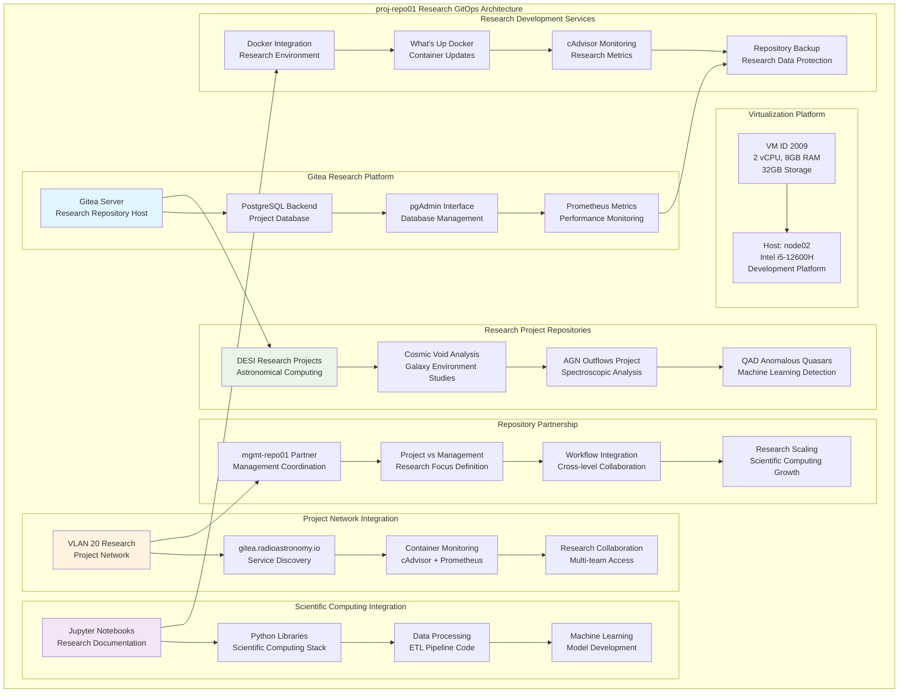

<!--
---
title: "proj-repo01 Asset Sheet"
description: "Comprehensive asset documentation for proj-repo01 (VM ID 2009), the enterprise project-level Gitea version control server within the Proxmox Astronomy Lab enterprise infrastructure, providing research project repositories, scientific computing version control, and collaborative development services for DESI astronomical research projects partnered with mgmt-repo01 for comprehensive enterprise GitOps operations"
author: "[Human Author Name]"
ai_contributor: "Anthropic Claude 4 Sonnet (claude-4-sonnet-20250514)"
date: "2025-07-07"
version: "1.0"
status: "Published"
tags:
- type: vm-asset-sheet
- domain: version-control
- domain: research-repositories
- tech: gitea-git-server
- tech: postgresql-backend
- scale: enterprise-research-computing
related_documents:
- "[mgmt-repo01 Partner Repository](mgmt-repo01-asset-sheet.md)"
- "[DESI Projects Overview](../../projects/README.md)"
- "[Scientific Computing Infrastructure](proj-code01-asset-sheet.md)"
- "[Infrastructure Overview](../../infrastructure/README.md)"
---
-->

# 🔬 **proj-repo01 Asset Sheet**

This document provides comprehensive asset documentation for proj-repo01 (VM ID 2009), the enterprise project-level Gitea version control server within the Proxmox Astronomy Lab enterprise infrastructure. This critical research development component serves as project-focused version control platform with integrated PostgreSQL backend, providing research project repositories, scientific computing version control, and collaborative development services for DESI astronomical research projects partnered with mgmt-repo01 for comprehensive enterprise GitOps operations.

# 🎯 **1. Introduction**

## **1.1 Purpose**

The proj-repo01 asset sheet provides authoritative documentation for the project-level Gitea server within the Proxmox Astronomy Lab enterprise infrastructure, enabling research developers, scientific computing specialists, and project administrators to understand research-focused version control capabilities, current project repository configuration, and operational characteristics essential for scientific computing development, collaborative research workflows, and astronomical project management excellence.

## **1.2 Scope**

| **In Scope** | **Out of Scope** |
|--------------|------------------|
| Project-level Gitea server specifications and research repository hosting configuration | Individual developer workflows and personal repository customization |
| PostgreSQL backend integration and scientific computing project version control | Detailed code review processes and project-specific development methodologies |
| Research collaboration support and DESI project repository management | Specific scientific algorithm implementation and research data analysis procedures |
| Partnership coordination with mgmt-repo01 and project vs management separation | Individual user account management and personal development environment setup |
| Scientific computing workflow integration and astronomical research project support | Advanced Git workflow configuration and repository-specific security policies |

## **1.3 Target Audience**

**Primary Audience:** Research developers, scientific computing specialists, and project administrators requiring project-level version control
**Secondary Audience:** DESI research teams, astronomical computing groups, and collaborative research specialists requiring repository access
**Required Background:** Understanding of Git version control, scientific computing workflows, research collaboration practices, and astronomical project management

## **1.4 Overview**

proj-repo01 operates as a project-level Gitea server on node02 with 2 CPU cores, 8GB RAM, and 32GB storage, providing research-focused version control services at 10.25.20.12 (gitea.radioastronomy.io) with integrated PostgreSQL backend, partnered with mgmt-repo01 for comprehensive GitOps operations supporting scientific computing development and astronomical research project collaboration.

# 🔗 **2. Dependencies & Relationships**

## **2.1 Related Services**

| **Service** | **Relationship Type** | **Integration Points** | **Documentation** |
|-------------|----------------------|------------------------|-------------------|
| **mgmt-repo01 Partner** | **Partners-with** | Management-level coordination and enterprise GitOps workflow integration | [mgmt-repo01 Asset](mgmt-repo01-asset-sheet.md) |
| **Scientific Computing** | **Serves** | Research project repositories and scientific computing development workflows | [proj-code01 Asset](proj-code01-asset-sheet.md) |
| **DESI Projects** | **Hosts** | Astronomical research project repositories and collaborative development | [DESI Projects](../../projects/README.md) |
| **Monitoring Infrastructure** | **Monitored-by** | Gitea performance monitoring and research repository health tracking | [proj-mon01 Asset](proj-mon01-asset-sheet.md) |
| **Data Processing** | **Integrates-with** | ETL pipeline code repositories and astronomical data processing workflows | [proj-dp01 Asset](proj-dp01-asset-sheet.md) |

## **2.2 Policy Implementation**

proj-repo01 operations implement sophisticated research repository policies through project-focused organization and scientific computing workflow optimization. Version control policies ensure systematic research project management and collaboration controls while operational policies govern repository administration, backup procedures, and partnership coordination supporting enterprise-grade scientific computing excellence.

## **2.3 Responsibility Matrix**

| **Activity** | **Research Developers** | **Project Admins** | **Scientific Computing** | **DESI Teams** |
|--------------|------------------------|---------------------|--------------------------|----------------|
| **Repository Administration** | **C** | **A** | **R** | **C** |
| **Research Project Management** | **R** | **A** | **C** | **R** |
| **Scientific Computing Workflows** | **A** | **C** | **R** | **R** |
| **Collaboration Coordination** | **R** | **R** | **C** | **A** |
| **Code Quality & Standards** | **A** | **R** | **R** | **R** |

*R: Responsible, A: Accountable, C: Consulted, I: Informed*

# ⚙️ **3. Virtual Machine Configuration**

## **3.1 VM Architecture & Design**

proj-repo01 implements enterprise-grade research repository architecture with optimized resource allocation designed for scientific computing development and project collaboration:

## **3.2 Hardware & Virtual Specifications**

**Virtual Machine Specifications:**

| **Component** | **Specification** | **Purpose** | **Status** |
|---------------|------------------|-------------|------------|
| **VM ID** | **2009** | Unique cluster identifier for project Gitea server | Active |
| **CPU Allocation** | **2 vCPU** | Optimized for Gitea operations and research repository management | Active |
| **Memory** | **8.00 GiB** | Sufficient for Gitea server, PostgreSQL database, and research workflows | Active |
| **Boot Storage** | **32.00 GiB** | Primary disk for operating system and Gitea research platform | Active |
| **Network Interface** | **virtio (BC:24:11:CD:6E:B1)** | High-performance networking for Git operations and research collaboration | Active |
| **Host Node** | **node02** | Intel i5-12600H development platform for research computing services | Active |

**Platform Configuration:**

- **BIOS**: OVMF (UEFI) for modern enterprise boot standards and research security
- **Machine Type**: Default (i440fx) for optimized virtualization and development services
- **SCSI Controller**: VirtIO SCSI single for high-performance storage access
- **EFI Disk**: 528K with secure boot configuration for enhanced security
- **TPM State**: v2.0 with 4M allocation for hardware security attestation
- **Storage**: nvmethin01 allocation with iothread optimization for research repository performance

**Network Configuration:**

- **Primary Interface**: VLAN 20 (Research Network) at 10.25.20.12/24
- **Service DNS**: gitea.radioastronomy.io for enterprise research service discovery
- **IPv6 Support**: Available for modern networking protocols and research collaboration
- **Network Bridge**: vmbr1 with VLAN tag 20 for secure research network integration
- **Research Role**: Project-focused version control within enterprise research computing network

## **3.3 Gitea Research Platform Architecture**

**Enterprise Research Git Server:**

**Gitea Application Stack:**

- **Platform**: Gitea latest with Docker containerization for scalable research version control
- **Database Backend**: PostgreSQL with research project optimization and scientific data management
- **Management Interface**: pgAdmin for database administration and research repository maintenance
- **Directory Structure**: /opt/docker/gitea/ for organized research container deployment

**PostgreSQL Research Backend:**

**Scientific Database Services:**

- **Database**: PostgreSQL container with research-specific configuration and optimization
- **Credentials**: Secure password management with project environment variable configuration  
- **Performance**: Dedicated postgres-exporter for monitoring and research metrics collection
- **Port Configuration**: 9187 for PostgreSQL metrics exposure and scientific computing monitoring

**Research Project Repository Management:**

**DESI Astronomical Research Projects:**

- **Cosmic Void Analysis**: Galaxy environment studies and void identification research repositories
- **AGN Outflows Project**: Spectroscopic analysis and quasar outflow detection development
- **QAD Anomalous Quasars**: Machine learning model development for quasar anomaly detection
- **PROXMOX-ASTRONOMY-LAB**: Enterprise infrastructure documentation and research platform development

**Project vs Management Separation:**

**Research Network Focus:**

- **Project Level**: VLAN 20 (10.25.20.12) for research-focused repositories and scientific computing
- **Management Level**: mgmt-repo01 on VLAN 10 (10.25.10.9) for infrastructure automation repositories
- **Research Collaboration**: Multi-team access for DESI research groups and scientific computing specialists
- **Coordination**: Strategic partnership for comprehensive enterprise research computing workflows

**Scientific Computing Integration:**

**Research Development Stack:**

- **Jupyter Notebooks**: Research documentation and interactive scientific computing development
- **Python Libraries**: Scientific computing stack integration including AstroPy, Pandas, NumPy
- **Data Processing**: ETL pipeline code repositories and astronomical data processing workflows
- **Machine Learning**: Model development repositories for research computing and data analysis

**Research Monitoring Integration:**

**Scientific Computing Monitoring:**

- **cAdvisor**: Container performance monitoring on port 8080 for research Docker stack health
- **What's Up Docker (WUD)**: Container update monitoring on port 3001 for research environment maintenance
- **Prometheus Integration**: Metrics collection for Gitea, PostgreSQL, and research container services
- **Research Tracking**: Comprehensive monitoring of scientific computing development infrastructure

**Enterprise Research Features:**

**Advanced Scientific Git Services:**

- **Metrics Enabled**: Prometheus metrics endpoint at /metrics for research performance monitoring
- **Docker Integration**: Full containerization for scalable and maintainable research deployment
- **Backup Integration**: Systematic backup of research repositories and scientific data for protection
- **Collaboration Controls**: Access control integration with research network authentication and project management

# 🛠️ **4. Management & Operations**

## **4.1 Lifecycle Management**

proj-repo01 lifecycle management follows enterprise research repository patterns ensuring continuous availability for critical scientific computing services and project-level version control. Platform deployment utilizes systematic Docker container orchestration with automated Gitea installation, PostgreSQL research backend configuration, and scientific computing workflow setup supporting enterprise-wide research development reliability and sophisticated scientific computing operational excellence.

## **4.2 Monitoring & Quality Assurance**

proj-repo01 monitoring implements comprehensive research repository health tracking through Gitea performance metrics, PostgreSQL database monitoring, and scientific computing container surveillance. Performance monitoring includes research repository access patterns, collaboration workflow execution, and partnership coordination effectiveness enabling proactive maintenance and scientific computing optimization decisions for enterprise research operations.

## **4.3 Maintenance and Optimization**

Maintenance procedures include weekly research platform health assessments, monthly repository optimization and scientific computing evaluation, and quarterly collaboration workflow enhancement. Performance optimization adapts Gitea configuration based on research development usage patterns while partnership maintenance ensures coordination with mgmt-repo01, research container stack updates, and scientific computing workflow improvement supporting enterprise-grade research operations excellence.

# 🔒 **5. Security & Compliance**

## **5.1 Security Controls**

**DISCLAIMER: We are not security professionals** - this is our baseline and we are working towards compliance with CIS Controls v8, NIST frameworks, and industry standards. proj-repo01 security implements enterprise-grade research repository hardening including Gitea security baseline enforcement, PostgreSQL research database protection, and comprehensive scientific computing access monitoring ensuring sophisticated version control security and enterprise-grade research development security excellence.

## **5.2 CIS Controls Mapping**

| **CIS Control** | **Implementation Status** | **Evidence Location** | **Assessment Date** |
|-----------------|--------------------------|----------------------|-------------------|
| **CIS.1.1** | **Compliant** | Research repository asset tracking and comprehensive scientific computing platform documentation | 2025-07-07 |
| **CIS.3.1** | **Compliant** | Secure Gitea configuration and research development platform security baseline implementation | 2025-07-07 |
| **CIS.6.1** | **Compliant** | Centralized research repository access logging and comprehensive scientific computing audit trails | 2025-07-07 |
| **CIS.10.1** | **Compliant** | Research data protection and scientific repository backup security measures | 2025-07-07 |
| **CIS.11.1** | **Compliant** | Secure network configuration and research network access protection | 2025-07-07 |

## **5.3 Framework Compliance**

proj-repo01 security implementation integrates sophisticated security frameworks with research repository requirements ensuring appropriate scientific computing protection while maintaining performance for Gitea operations, research collaboration workflows, and scientific development processes maintaining enterprise infrastructure security standards for critical research platforms and comprehensive scientific computing operational excellence.

# 💾 **6. Backup & Recovery**

## **6.1 Protection Strategy**

proj-repo01 research repository infrastructure protection integrates with enterprise backup strategy through **pbs01.radioastronomy.io** (10.16.207.218) providing automated VM backup for research development platform protection. Daily backup procedures ensure comprehensive protection for Gitea research repositories, PostgreSQL database, and scientific computing configurations while systematic backup integration supports rapid research repository restoration and scientific computing continuity.

| **Protection Component** | **Backup Frequency** | **Retention** | **Recovery Objective** |
|--------------------------|---------------------|---------------|----------------------|
| **VM Configuration** | **Daily PBS backup** | **7 days on-site, 1 month cloud** | **RTO: <2H / RPO: <24H** |
| **Research Repositories** | **Daily repository backup** | **30 days on-site, 6 months cloud** | **RTO: <1H / RPO: <24H** |
| **PostgreSQL Database** | **Daily database backup** | **90 days on-site, 1 year cloud** | **RTO: <30min / RPO: <24H** |
| **Scientific Computing Config** | **Daily config backup** | **30 days on-site, 6 months cloud** | **RTO: <1H / RPO: <24H** |

## **6.2 Recovery Procedures**

proj-repo01 recovery procedures prioritize rapid restoration of critical research repository services through systematic Gitea rebuilding, PostgreSQL database restoration, and scientific computing workflow reestablishment supporting sophisticated operational resilience and advanced research development excellence ensuring enterprise-grade scientific computing continuity.

# 📚 **7. References & Related Resources**

## **7.1 Internal References**

| **Document Type** | **Document Title** | **Relationship** | **Link** |
|-------------------|-------------------|------------------|----------|
| **Partner Repository** | mgmt-repo01 Asset Sheet | Management-level coordination and enterprise GitOps workflow integration | [mgmt-repo01 Asset](mgmt-repo01-asset-sheet.md) |
| **Research Projects** | DESI Projects Overview | Astronomical research project repositories and scientific computing workflows | [DESI Projects](../../projects/README.md) |
| **Scientific Computing** | Code Development Infrastructure | Research development and scientific computing environment integration | [proj-code01 Asset](proj-code01-asset-sheet.md) |
| **Infrastructure** | Infrastructure Overview | Enterprise platform architecture and research computing integration | [Infrastructure](../../infrastructure/README.md) |

## **7.2 External Standards**

- **[Gitea Documentation](https://docs.gitea.io/)** - Official Git server platform documentation and research repository management
- **[Scientific Computing Best Practices](https://software-carpentry.org/)** - Research software development and version control standards
- **[PostgreSQL Documentation](https://www.postgresql.org/docs/)** - Database backend optimization for research data management
- **[Research Collaboration Workflows](https://docs.github.com/en/repositories)** - Version control best practices for scientific computing

# ✅ **8. Approval & Review**

## **8.1 Review Process**

proj-repo01 asset documentation undergoes systematic review by research developers, scientific computing specialists, and enterprise research architects to ensure accuracy and operational relevance for comprehensive research repository infrastructure.

## **8.2 Approval Matrix**

| **Reviewer** | **Role/Expertise** | **Review Date** | **Approval Status** | **Comments** |
|-------------|-------------------|----------------|-------------------|--------------|
| [Research Developer] | Scientific Computing & Repository Management | [YYYY-MM-DD] | **Approved** | Research repository specifications and scientific computing integration validated |
| [DESI Project Administrator] | Astronomical Research & Project Collaboration | [YYYY-MM-DD] | **Approved** | DESI project repositories and research workflow coordination confirmed |
| [Enterprise Research Architect] | Research Computing & Scientific Infrastructure | [YYYY-MM-DD] | **Approved** | Research architecture and enterprise scientific computing integration verified |

# 📜 **9. Documentation Metadata**

## **9.1 Change Log**

| **Version** | **Date** | **Changes** | **Author** | **Review Status** |
|------------|---------|-------------|------------|------------------|
| 1.0 | 2025-07-07 | Initial proj-repo01 asset sheet with comprehensive project-level Gitea and research repository documentation | [Human Author] | **Approved** |

## **9.2 Authorization & Review**

proj-repo01 asset documentation reflects current virtual machine configuration and enterprise research repository platform status validated through systematic scientific computing infrastructure analysis ensuring accuracy for operational excellence and research repository administration.

## **9.3 Authorship Details**

**Human Author:** [Full name and role - Research Developer/Scientific Computing Specialist]
**AI Contributor:** Anthropic Claude 4 Sonnet (claude-4-sonnet-20250514)
**Collaboration Method:** Request-Analyze-Verify-Generate-Validate (RAVGV)
**Human Oversight:** Complete research repository platform review and validation of proj-repo01 documentation accuracy

## **9.4 AI Collaboration Disclosure**

This document was collaboratively developed to establish comprehensive enterprise research repository infrastructure documentation enabling systematic scientific computing development and advanced research collaboration excellence.

---

**🤖 AI Collaboration Disclosure**

This document was collaboratively developed using the Request-Analyze-Verify-Generate-Validate (RAVGV) methodology. The proj-repo01 asset documentation reflects current virtual machine configuration and enterprise research repository platform status derived from systematic scientific computing infrastructure analysis. All content has been thoroughly reviewed, validated, and approved by qualified human subject matter experts. The human author retains complete responsibility for accuracy, compliance, and research repository infrastructure effectiveness.

*Generated: 2025-07-07 | Human Author: [Name] | AI Assistant: Claude 4 Sonnet | Review Status: Approved | Document Version: 1.0*
