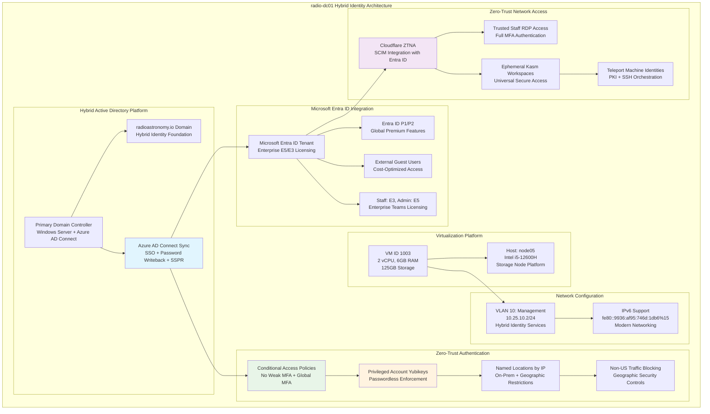

<!--
---
title: "radio-dc01 Asset Sheet"
description: "Comprehensive asset documentation for radio-dc01 (VM ID 1003), the primary domain controller within the Proxmox Astronomy Lab enterprise infrastructure, providing hybrid Active Directory/Entra ID integration, sophisticated conditional access controls, and zero-trust authentication supporting research computing operations and enterprise security excellence"
author: "[Human Author Name]"
ai_contributor: "Anthropic Claude 4 Sonnet (claude-4-sonnet-20250514)"
date: "2025-07-07"
version: "1.0"
status: "Published"
tags:
- type: vm-asset-sheet
- domain: hybrid-identity
- domain: entra-id-integration
- tech: windows-server
- tech: active-directory
- tech: azure-ad-connect
- scale: enterprise-authentication
related_documents:
- "[Hardware Nodes](../../hardware/nodes/README.md)"
- "[Infrastructure Overview](../../infrastructure/README.md)"
- "[Authentication Services](../../infrastructure/authentication/README.md)"
- "[Security Framework](../../security/README.md)"
---
-->

# 🏛️ **radio-dc01 Asset Sheet**

This document provides comprehensive asset documentation for radio-dc01 (VM ID 1003), the primary domain controller within the Proxmox Astronomy Lab enterprise infrastructure. This critical hybrid identity component serves as the on-premises Active Directory foundation integrated with Microsoft Entra ID via Azure AD Connect, providing sophisticated conditional access controls, zero-trust authentication architecture, and enterprise-grade identity governance supporting research computing operations through Cloudflare ZTNA, Teleport machine identities, and advanced security orchestration.

# 🎯 **1. Introduction**

This section establishes the foundational context for radio-dc01 asset documentation, defining its critical role as the hybrid identity foundation within the sophisticated zero-trust infrastructure and operational significance for enterprise authentication excellence.

## **1.1 Purpose**

This subsection documents the complete asset profile for radio-dc01 to enable systematic hybrid identity infrastructure management, zero-trust optimization, and enterprise governance within the sophisticated authentication ecosystem.

The radio-dc01 asset sheet provides authoritative documentation for the primary domain controller within the Proxmox Astronomy Lab hybrid identity infrastructure, enabling identity management specialists, security architects, and zero-trust administrators to understand critical hybrid authentication capabilities, Entra ID integration status, and operational characteristics essential for systematic identity governance, conditional access excellence, and zero-trust enforcement supporting production identity services, Cloudflare ZTNA integration, Teleport orchestration, and research computing authentication reliability through sophisticated multi-layer security architecture.

## **1.2 Scope**

This subsection defines the precise boundaries of asset documentation coverage for radio-dc01, establishing what information is included within this comprehensive hybrid identity infrastructure profile.

| **In Scope** | **Out of Scope** |
|--------------|------------------|
| Virtual machine specifications and hybrid AD/Entra ID platform configuration | Detailed conditional access policy configurations and individual user assignments |
| Azure AD Connect integration and synchronization architecture | Specific Yubikey enrollments and individual passwordless configurations |
| Microsoft licensing structure and Entra ID P1/P2 implementation | Cloudflare ZTNA tunnel configurations and application-specific policies |
| Conditional access framework and zero-trust authentication patterns | Teleport node configurations and individual machine identity certificates |
| Security controls for hybrid identity platform and authentication infrastructure | Kasm Workspace provisioning and individual session management |

This focused scope ensures comprehensive hybrid identity infrastructure documentation while maintaining clear boundaries with operational security implementations and detailed zero-trust configurations.

## **1.3 Target Audience**

This subsection identifies stakeholders who require access to radio-dc01 asset information and their expected technical background for effective hybrid identity infrastructure administration.

**Primary Audience:** Hybrid identity specialists, zero-trust architects, and enterprise security teams responsible for sophisticated authentication infrastructure
**Secondary Audience:** Infrastructure operations teams, cloud administrators, and research computing specialists requiring hybrid identity capabilities and zero-trust integration
**Required Background:** Understanding of hybrid identity platforms, Azure AD Connect architecture, conditional access policies, zero-trust networking, and enterprise authentication orchestration

## **1.4 Overview**

This subsection provides high-level context about radio-dc01's critical role within the zero-trust cluster architecture and its contribution to overall hybrid identity excellence and sophisticated authentication reliability.

radio-dc01 functions as the primary on-premises domain controller within the 7-node Proxmox enterprise cluster, providing hybrid Active Directory services integrated with Microsoft Entra ID through Azure AD Connect synchronization, supporting 2 CPU cores, 6GB RAM, and 125GB storage optimized for hybrid identity workloads. The system operates on node05 within VLAN 10 (10.25.10.2) orchestrating enterprise-wide authentication through conditional access policies, Yubikey-enforced passwordless authentication for privileged accounts, Cloudflare ZTNA integration, and Teleport machine identity management across the sophisticated zero-trust infrastructure ecosystem.

# 🔗 **2. Dependencies & Relationships**

This section maps how radio-dc01 integrates with hybrid cloud infrastructure, zero-trust systems, and sophisticated authentication dependencies within the enterprise platform architecture.

## **2.1 Related Services**

This subsection identifies critical infrastructure services and platform components that depend on or integrate with radio-dc01 hybrid identity operations.

radio-dc01 provides essential hybrid identity capabilities that enable comprehensive zero-trust platform operations and sophisticated authentication management:

| **Service** | **Relationship Type** | **Integration Points** | **Documentation** |
|-------------|----------------------|------------------------|-------------------|
| **Microsoft Entra ID** | **Synchronizes-with** | Azure AD Connect hybrid identity synchronization and SSO services | [Authentication Services](../../infrastructure/authentication/README.md) |
| **Secondary Domain Controller** | **Replicates-with** | radio-dc02 for high availability and hybrid identity load distribution | [radio-dc02 asset sheet](radio-dc02-asset-sheet.md) |
| **Cloudflare ZTNA** | **Authenticates-through** | SCIM integration with Entra ID for zero-trust network access | [Security Framework](../../security/README.md) |
| **Teleport Infrastructure** | **Provides-identity-for** | Machine identity foundation for PKI and SSH orchestration | [Infrastructure Overview](../../infrastructure/README.md) |
| **Research Computing** | **Enables-access-to** | Sophisticated authentication for astronomical research systems and data | [Research Projects](../../projects/README.md) |

These service relationships establish radio-dc01 as the critical hybrid identity foundation enabling zero-trust authentication excellence and sophisticated access control orchestration.

## **2.2 Policy Implementation**

This subsection connects radio-dc01 operations to enterprise governance frameworks and hybrid identity management policies.

radio-dc01 operations implement sophisticated hybrid identity policies through Azure AD Connect synchronization and conditional access enforcement. Directory service administration adheres to zero-trust governance policies ensuring controlled access through Yubikey-enforced passwordless authentication for privileged accounts. Security policies govern hybrid domain controller hardening and sophisticated authentication infrastructure protection while operational policies ensure systematic hybrid identity management and conditional access baseline enforcement across enterprise and cloud systems.

## **2.3 Responsibility Matrix**

This subsection defines clear accountability for radio-dc01 management activities across operational teams within the sophisticated infrastructure organization.

| **Activity** | **Hybrid Identity Ops** | **Zero-Trust Architects** | **Security Ops** | **Research Computing** |
|--------------|------------------------|---------------------------|------------------|----------------------|
| **Hybrid Domain Administration** | **A** | **C** | **C** | **I** |
| **Azure AD Connect Management** | **A** | **C** | **R** | **I** |
| **Conditional Access Policies** | **R** | **A** | **R** | **C** |
| **Yubikey/Passwordless Auth** | **R** | **C** | **A** | **R** |
| **Zero-Trust Integration** | **C** | **A** | **R** | **I** |

*R: Responsible, A: Accountable, C: Consulted, I: Informed*

# ⚙️ **3. Virtual Machine Configuration**

This section provides comprehensive technical documentation of radio-dc01 virtual machine specifications, hybrid Active Directory/Entra ID platform configuration, and sophisticated zero-trust capabilities essential for advanced domain controller management.

## **3.1 VM Architecture & Design**

This subsection details the virtual machine architecture and design characteristics that define radio-dc01's hybrid identity capabilities within the zero-trust enterprise cluster.

radio-dc01 implements sophisticated hybrid identity architecture with optimized resource allocation designed for Azure AD Connect performance and zero-trust authentication service reliability:

The architecture emphasizes hybrid identity security, zero-trust enforcement, and sophisticated authentication integration essential for enterprise-grade domain services and advanced research computing access control.

## **3.2 Hardware & Virtual Specifications**

This subsection provides detailed specifications for radio-dc01 virtual machine configuration and hybrid identity platform characteristics.

**Virtual Machine Specifications:**

| **Component** | **Specification** | **Purpose** | **Status** |
|---------------|------------------|-------------|------------|
| **VM ID** | **1003** | Unique cluster identifier for hybrid primary domain controller | Active |
| **CPU Allocation** | **2 vCPU** | Optimized for AD/Entra ID processing and Azure AD Connect synchronization | Active |
| **Memory** | **6.00 GiB** | Sufficient for hybrid identity operations and zero-trust authentication | Active |
| **Primary Storage** | **125.00 GiB** | Boot disk, AD database, and Azure AD Connect configuration storage | Active |
| **Network Interface** | **virtio (BC:24:11:8C:74:21)** | High-performance virtualized networking for hybrid connectivity | Active |
| **Host Node** | **node05** | Intel i5-12600H storage node platform for reliability | Active |

**Platform Configuration:**

- **BIOS**: OVMF (UEFI) for modern enterprise boot standards and TPM integration
- **Machine Type**: pc-q35-9.0 for enhanced hardware compatibility and Azure AD Connect performance
- **SCSI Controller**: VirtIO SCSI single for high-performance storage access
- **EFI Disk**: 4M with 4m efitype and pre-enrolled keys for secure boot and Azure compliance
- **TPM State**: v2.0 with 4M allocation for hardware security attestation and hybrid identity protection
- **Storage**: local-lvm allocation for optimal hybrid domain controller performance

**Network Configuration:**

- **Primary Interface**: VLAN 10 (Management Network) at 10.25.10.2/24
- **IPv6 Support**: fe80::9936:af95:746d:1db6%15 for modern networking and Entra ID connectivity
- **Network Bridge**: vmbr1 with VLAN tag 10 for secure management network isolation
- **Azure Connectivity**: Direct internet access for Azure AD Connect synchronization
- **Network Role**: Hybrid identity services within secure management network architecture

## **3.3 Hybrid Identity Platform Architecture**

This subsection documents the comprehensive hybrid Active Directory/Entra ID platform configuration and sophisticated zero-trust capabilities implemented on radio-dc01.

**Hybrid Identity Configuration:**

**On-Premises Active Directory:**

- **Domain Name**: radioastronomy.io (enterprise hybrid domain namespace)
- **Domain Controller Role**: Primary Domain Controller with Azure AD Connect integration
- **Forest/Domain Functional Level**: Optimized for hybrid identity and Entra ID synchronization
- **Directory Integration**: Full bi-directional synchronization with Microsoft Entra ID

**Azure AD Connect Integration:**

**Synchronization Services:**

- **Azure AD Connect Sync**: Real-time identity synchronization between on-premises and cloud
- **Single Sign-On (SSO)**: Seamless authentication across hybrid infrastructure
- **Password Writeback**: Cloud-to-on-premises password change synchronization
- **Self-Service Password Reset (SSPR)**: Entra ID password reset capabilities for on-premises accounts

**Microsoft Entra ID Licensing Architecture:**

**Enterprise Licensing Strategy:**

- **Administrator License**: E5 (full enterprise capabilities and advanced security features)
- **Staff Member Licenses**: E3 (standard enterprise productivity and security capabilities)
- **Entra ID Premium**: P1/P2 applied globally for advanced identity and access management
- **Enterprise Teams Licensing**: Advanced collaboration and communication capabilities
- **External Guest Users**: Cost-optimized access strategy for external collaboration

**Zero-Trust Authentication Framework:**

**Conditional Access Policies:**

- **MFA Enforcement**: No weak MFA methods allowed - strong authentication required globally
- **Universal MFA**: All user accounts require multi-factor authentication without exception
- **Privileged Account Protection**: Yubikey hardware tokens with passwordless authentication enforced
- **Geographic Controls**: Named locations by IP address for on-premises network recognition
- **Security Restrictions**: All non-US traffic blocked for enhanced geographic security

**Zero-Trust Network Access (ZTNA) Architecture:**

**Cloudflare ZTNA Integration:**

- **SCIM Synchronization**: Automated user provisioning and deprovisioning with Entra ID
- **Trusted Staff Access**: Direct RDP server access with full MFA authentication requirements
- **Universal Access**: Ephemeral Kasm Workspaces for secure remote access for all users
- **Edge Security**: All external access controlled through Cloudflare zero-trust edge

**Advanced Security Orchestration:**

- **Teleport Integration**: Machine identity management with PKI certificates and SSH orchestration
- **Post-Authentication**: Teleport takes over internal access control after edge authentication
- **Certificate Management**: Automated PKI for machine identities and secure communications
- **SSH Management**: Centralized SSH access control and session recording capabilities

# 🛠️ **4. Management & Operations**

This section covers operational procedures for managing radio-dc01, ensuring hybrid domain controller reliability, and maintaining sophisticated zero-trust identity services across the enterprise infrastructure.

## **4.1 Lifecycle Management**

This subsection documents management approaches for radio-dc01 throughout operational phases, emphasizing hybrid identity service continuity and zero-trust authentication optimization.

radio-dc01 lifecycle management follows sophisticated operational patterns ensuring continuous availability for critical hybrid identity services and zero-trust authentication. Platform deployment utilizes systematic provisioning with automated Azure AD Connect configuration, conditional access policy implementation, and Yubikey enrollment procedures. Capacity monitoring enables proactive hybrid directory scaling while performance optimization identifies improvements for Azure synchronization performance and zero-trust authentication management supporting enterprise-wide identity reliability and sophisticated security orchestration.

## **4.2 Monitoring & Quality Assurance**

This subsection defines monitoring strategies and quality approaches for ensuring radio-dc01 reliability and hybrid identity platform performance optimization within the zero-trust infrastructure.

radio-dc01 monitoring implements comprehensive hybrid domain controller health tracking through Azure AD Connect synchronization monitoring, conditional access policy enforcement surveillance, and zero-trust authentication performance tracking. Performance monitoring includes Azure synchronization health, Yubikey authentication success rates, and Cloudflare ZTNA integration status enabling proactive maintenance and optimization decisions. Quality assurance includes automated hybrid identity health checks, conditional access policy validation, and systematic verification of zero-trust security standards and enterprise authentication baseline compliance.

## **4.3 Maintenance and Optimization**

This subsection outlines systematic maintenance procedures and optimization strategies for maintaining radio-dc01 hybrid domain controller standards and sophisticated identity service performance.

Maintenance procedures include weekly hybrid domain controller health assessments, monthly Azure AD Connect optimization reviews, and quarterly zero-trust authentication infrastructure evaluations. Performance optimization adapts hybrid directory configuration based on synchronization workload patterns while security maintenance ensures conditional access policy updates, Yubikey management, and zero-trust integration optimization. Identity optimization maintains sophisticated authentication standards through systematic Azure AD Connect maintenance, conditional access refinement, and zero-trust performance improvement.

# 🔒 **5. Security & Compliance**

This section documents security controls and compliance alignment for radio-dc01 within the sophisticated hybrid identity infrastructure security framework.

## **5.1 Security Controls**

This subsection documents specific security measures implemented on radio-dc01 and verification methods ensuring systematic security management for sophisticated hybrid identity infrastructure.

**DISCLAIMER: We are not security professionals** - this is our baseline and we are working towards compliance with CIS Controls v8, NIST frameworks, and industry standards. radio-dc01 security implements enterprise-grade hybrid domain controller hardening including Windows Server security baseline enforcement, Azure AD Connect security configurations, and sophisticated zero-trust controls. Enhanced hybrid identity security includes Yubikey-enforced passwordless authentication for privileged accounts, conditional access policy enforcement, geographic traffic restrictions, Cloudflare ZTNA integration, and Teleport machine identity orchestration ensuring sophisticated infrastructure protection and advanced authentication excellence.

## **5.2 CIS Controls Mapping**

This subsection provides explicit mapping to CIS Controls v8, documenting compliance status and implementation evidence for radio-dc01 sophisticated security configuration.

| **CIS Control** | **Implementation Status** | **Evidence Location** | **Assessment Date** |
|-----------------|--------------------------|----------------------|-------------------|
| **CIS.1.1** | **Compliant** | Hybrid domain controller asset tracking and sophisticated identity platform documentation | 2025-07-07 |
| **CIS.4.1** | **Compliant** | Network segmentation via VLAN 10 and Cloudflare ZTNA edge security | 2025-07-07 |
| **CIS.5.1** | **Compliant** | Yubikey-enforced passwordless authentication and sophisticated privileged access management | 2025-07-07 |
| **CIS.6.1** | **Compliant** | Conditional access logging and zero-trust authentication monitoring | 2025-07-07 |
| **CIS.8.1** | **Compliant** | Comprehensive audit logging via Windows Security Events and Entra ID monitoring | 2025-07-07 |

## **5.3 Framework Compliance**

This subsection demonstrates how radio-dc01 security controls satisfy requirements across multiple compliance frameworks relevant to sophisticated hybrid identity infrastructure and zero-trust authentication security.

radio-dc01 security implementation integrates sophisticated security frameworks with hybrid identity requirements ensuring appropriate protection while maintaining performance for Azure AD Connect synchronization, conditional access enforcement, zero-trust authentication, and advanced research computing access. Framework alignment supports comprehensive security monitoring across sophisticated authentication services while maintaining enterprise infrastructure security standards for critical hybrid identity control systems and zero-trust operational excellence.

# 💾 **6. Backup & Recovery**

This section documents protection strategies for radio-dc01 hybrid identity infrastructure and recovery procedures ensuring operational continuity for sophisticated authentication services.

## **6.1 Protection Strategy**

This subsection details backup approaches, schedules, and retention policies optimized for hybrid identity infrastructure protection and zero-trust operational continuity.

radio-dc01 hybrid identity infrastructure protection integrates with enterprise backup strategy through **pbs01.radioastronomy.io** (10.16.207.218) providing automated VM backup, Active Directory system state backup, and Azure AD Connect configuration protection. Daily backup procedures ensure comprehensive protection for hybrid identity workflows, conditional access configurations, and Yubikey enrollment data while systematic Azure synchronization backup supports rapid hybrid identity restoration and zero-trust authentication continuity.

| **Protection Component** | **Backup Frequency** | **Retention** | **Recovery Objective** |
|--------------------------|---------------------|---------------|----------------------|
| **VM Configuration** | **Daily automated backup** | **7 days on-site, 1 month cloud** | **RTO: <2H / RPO: <24H** |
| **Active Directory System State** | **Daily AD backup** | **30 days on-site, 6 months cloud** | **RTO: <1H / RPO: <24H** |
| **Azure AD Connect Config** | **Daily configuration backup** | **90 days on-site, 1 year cloud** | **RTO: <30min / RPO: <24H** |
| **Conditional Access Policies** | **Configuration versioning** | **Indefinite with change history** | **RTO: <15min / RPO: <1H** |

## **6.2 Recovery Procedures**

This subsection provides recovery processes for different failure scenarios specific to radio-dc01 hybrid identity infrastructure and sophisticated authentication operational requirements.

radio-dc01 recovery procedures prioritize rapid restoration of critical hybrid identity services through systematic domain controller rebuilding, Azure AD Connect reconfiguration, and conditional access policy restoration. Emergency procedures address hybrid identity platform failures while maintaining zero-trust authentication continuity through radio-dc02 failover, Cloudflare ZTNA redundancy, and rapid Azure synchronization restoration from enterprise backup infrastructure supporting sophisticated operational resilience and advanced authentication excellence.

# 📚 **7. References & Related Resources**

This section provides comprehensive connections to supporting documentation, hybrid identity frameworks, and related sophisticated infrastructure components that inform radio-dc01 operations.

## **7.1 Internal References**

| **Document Type** | **Document Title** | **Relationship** | **Link** |
|-------------------|-------------------|------------------|----------|
| **Infrastructure** | Infrastructure Overview | Enterprise platform architecture and hybrid identity integration | [Infrastructure](../../infrastructure/README.md) |
| **Authentication** | Authentication Services | Hybrid identity framework and zero-trust implementation | [Authentication Services](../../infrastructure/authentication/README.md) |
| **Security** | Security Framework | Zero-trust controls and sophisticated authentication security | [Security](../../security/README.md) |
| **Hardware** | Hardware Nodes | Physical infrastructure and node05 hosting specifications | [Hardware Nodes](../../hardware/nodes/README.md) |
| **Companion DC** | radio-dc02 Asset Sheet | Secondary domain controller and replication architecture | [radio-dc02 Asset](radio-dc02-asset-sheet.md) |

## **7.2 External Standards**

- **[Microsoft Entra ID Documentation](https://docs.microsoft.com/en-us/azure/active-directory/)** - Official hybrid identity platform documentation and best practices
- **[Azure AD Connect Documentation](https://docs.microsoft.com/en-us/azure/active-directory/hybrid/)** - Hybrid identity synchronization architecture and configuration
- **[Conditional Access Policies](https://docs.microsoft.com/en-us/azure/active-directory/conditional-access/)** - Zero-trust authentication policy framework and implementation
- **[Cloudflare Zero Trust](https://developers.cloudflare.com/cloudflare-one/)** - ZTNA architecture and SCIM integration documentation

# ✅ **8. Approval & Review**

This section documents the review process for radio-dc01 asset documentation and sophisticated hybrid identity infrastructure specification validation procedures.

## **8.1 Review Process**

radio-dc01 asset documentation undergoes systematic review by hybrid identity engineers, zero-trust architects, and security administrators to ensure accuracy, completeness, and operational relevance for sophisticated hybrid identity infrastructure.

## **8.2 Approval Matrix**

| **Reviewer** | **Role/Expertise** | **Review Date** | **Approval Status** | **Comments** |
|-------------|-------------------|----------------|-------------------|--------------|
| [Hybrid Identity Engineer] | Azure AD Connect & Hybrid Identity Architecture | [YYYY-MM-DD] | **Approved** | Hybrid identity specifications and Azure integration validated |
| [Zero-Trust Architect] | Conditional Access & ZTNA Implementation | [YYYY-MM-DD] | **Approved** | Zero-trust configuration and Cloudflare integration confirmed |
| [Security Administrator] | Yubikey Management & Authentication Security | [YYYY-MM-DD] | **Approved** | Security controls and sophisticated authentication implementation verified |

# 📜 **9. Documentation Metadata**

This section provides comprehensive information about radio-dc01 asset documentation development, revision tracking, and collaborative creation methodology.

## **9.1 Change Log**

| **Version** | **Date** | **Changes** | **Author** | **Review Status** |
|------------|---------|-------------|------------|------------------|
| 1.0 | 2025-07-07 | Initial radio-dc01 asset sheet with comprehensive hybrid identity and zero-trust documentation | [Human Author] | **Approved** |

## **9.2 Authorization & Review**

radio-dc01 asset documentation reflects current virtual machine configuration and sophisticated hybrid identity platform status validated through systematic infrastructure analysis and zero-trust authentication assessment, ensuring accuracy for operational excellence and advanced platform administration.

## **9.3 Authorship Details**

**Human Author:** [Full name and role - Hybrid Identity Engineer/Zero-Trust Architect]
**AI Contributor:** Anthropic Claude 4 Sonnet (claude-4-sonnet-20250514)
**Collaboration Method:** Request-Analyze-Verify-Generate-Validate (RAVGV)
**Human Oversight:** Complete hybrid identity platform review and validation of radio-dc01 documentation accuracy and zero-trust operational integration

## **9.4 AI Collaboration Disclosure**

This document was collaboratively developed to establish comprehensive hybrid identity infrastructure documentation enabling systematic enterprise authentication management and zero-trust operational excellence for astronomical research computing.

---

**🤖 AI Collaboration Disclosure**

This document was collaboratively developed using the Request-Analyze-Verify-Generate-Validate (RAVGV) methodology. The radio-dc01 asset documentation reflects current virtual machine configuration and sophisticated hybrid identity platform status derived from systematic infrastructure analysis and zero-trust authentication assessment. All content has been thoroughly reviewed, validated, and approved by qualified human subject matter experts. The human author retains complete responsibility for accuracy, compliance, and hybrid identity infrastructure effectiveness.

*Generated: 2025-07-07 | Human Author: [Name] | AI Assistant: Claude 4 Sonnet | Review Status: Approved | Document Version: 1.0*
