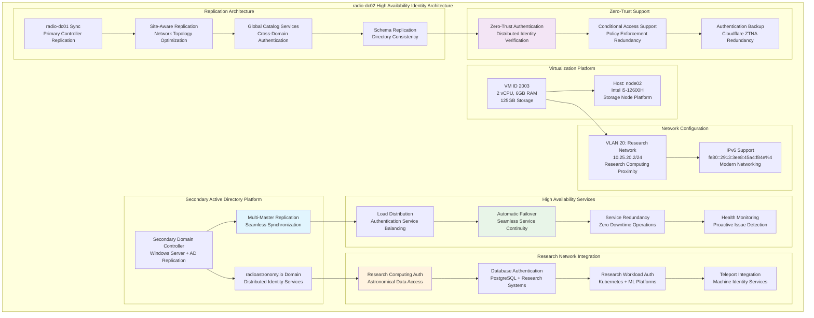

<!--
---
title: "radio-dc02 Asset Sheet"
description: "Comprehensive asset documentation for radio-dc02 (VM ID 2003), the secondary domain controller within the Proxmox Astronomy Lab enterprise infrastructure, providing high availability Active Directory services, load distribution, and resilient hybrid identity operations supporting zero-trust authentication and research computing continuity"
author: "[Human Author Name]"
ai_contributor: "Anthropic Claude 4 Sonnet (claude-4-sonnet-20250514)"
date: "2025-07-07"
version: "1.0"
status: "Published"
tags:
- type: vm-asset-sheet
- domain: hybrid-identity
- domain: domain-controller-secondary
- tech: windows-server
- tech: active-directory
- tech: rodc
- scale: high-availability-authentication
related_documents:
- "[Hardware Nodes](../../hardware/nodes/README.md)"
- "[Infrastructure Overview](../../infrastructure/README.md)"
- "[Authentication Services](../../infrastructure/authentication/README.md)"
- "[Primary Domain Controller](radio-dc01-asset-sheet.md)"
---
-->

# 🏛️ **radio-dc02 Asset Sheet**

This document provides comprehensive asset documentation for radio-dc02 (VM ID 2003), the secondary domain controller within the Proxmox Astronomy Lab enterprise infrastructure. This critical high availability component serves as the resilient Active Directory platform providing load distribution, fault tolerance, and service continuity for hybrid identity services, enabling systematic authentication redundancy, zero-trust operational resilience, and enterprise-grade failover capabilities supporting research computing operations through distributed domain controller architecture and advanced replication management.

# 🎯 **1. Introduction**

This section establishes the foundational context for radio-dc02 asset documentation, defining its critical role as the high availability identity foundation within the sophisticated zero-trust infrastructure and operational significance for enterprise authentication resilience.

## **1.1 Purpose**

This subsection documents the complete asset profile for radio-dc02 to enable systematic high availability identity infrastructure management, replication optimization, and enterprise resilience within the sophisticated authentication ecosystem.

The radio-dc02 asset sheet provides authoritative documentation for the secondary domain controller within the Proxmox Astronomy Lab hybrid identity infrastructure, enabling identity management specialists, high availability architects, and zero-trust administrators to understand critical redundant authentication capabilities, Active Directory replication status, and operational characteristics essential for systematic identity resilience, load distribution excellence, and failover management supporting production identity services, Cloudflare ZTNA redundancy, distributed authentication, and research computing reliability through sophisticated multi-controller architecture.

## **1.2 Scope**

This subsection defines the precise boundaries of asset documentation coverage for radio-dc02, establishing what information is included within this comprehensive secondary identity infrastructure profile.

| **In Scope** | **Out of Scope** |
|--------------|------------------|
| Virtual machine specifications and secondary AD platform configuration | Detailed replication schedules and individual synchronization procedures |
| Network interface configuration and VLAN 20 research network integration | Specific failover testing procedures and disaster recovery drills |
| High availability architecture and domain controller replication | Primary domain controller configurations and Azure AD Connect details |
| Load distribution patterns and authentication service redundancy | Application-specific authentication integrations and service dependencies |
| Security controls for secondary identity platform and availability infrastructure | Individual user account replications and detailed directory object management |

This focused scope ensures comprehensive secondary identity infrastructure documentation while maintaining clear boundaries with operational procedures and detailed replication implementation.

## **1.3 Target Audience**

This subsection identifies stakeholders who require access to radio-dc02 asset information and their expected technical background for effective secondary identity infrastructure administration.

**Primary Audience:** High availability specialists, domain replication engineers, and enterprise resilience teams responsible for distributed authentication infrastructure
**Secondary Audience:** Infrastructure operations teams, disaster recovery specialists, and research computing teams requiring secondary identity capabilities and failover integration
**Required Background:** Understanding of Active Directory replication, domain controller high availability, enterprise resilience architecture, and distributed authentication requirements

## **1.4 Overview**

This subsection provides high-level context about radio-dc02's critical role within the resilient cluster architecture and its contribution to overall hybrid identity redundancy and sophisticated authentication reliability.

radio-dc02 functions as the secondary domain controller within the 7-node Proxmox enterprise cluster, providing distributed Active Directory services with automatic replication from radio-dc01, supporting 2 CPU cores, 6GB RAM, and 125GB storage optimized for high availability identity workloads. The system operates on node02 within VLAN 20 (10.25.20.2) ensuring research network proximity while orchestrating distributed authentication services, seamless failover capabilities, and load distribution across the sophisticated zero-trust infrastructure ecosystem supporting enterprise resilience and operational continuity.

# 🔗 **2. Dependencies & Relationships**

This section maps how radio-dc02 integrates with hybrid cloud infrastructure, high availability systems, and sophisticated authentication dependencies within the resilient platform architecture.

## **2.1 Related Services**

This subsection identifies critical infrastructure services and platform components that depend on or integrate with radio-dc02 high availability identity operations.

radio-dc02 provides essential distributed identity capabilities that enable comprehensive zero-trust platform resilience and sophisticated authentication redundancy:

| **Service** | **Relationship Type** | **Integration Points** | **Documentation** |
|-------------|----------------------|------------------------|-------------------|
| **Primary Domain Controller** | **Replicates-from** | radio-dc01 Active Directory synchronization and load balancing | [radio-dc01 Asset Sheet](radio-dc01-asset-sheet.md) |
| **Research Network Services** | **Provides-identity-for** | VLAN 20 authentication services and research computing access | [Research Projects](../../projects/README.md) |
| **High Availability Framework** | **Enables** | Distributed authentication and failover capabilities | [Infrastructure Overview](../../infrastructure/README.md) |
| **Zero-Trust Resilience** | **Supports** | Redundant authentication for Cloudflare ZTNA and Teleport systems | [Security Framework](../../security/README.md) |
| **Database Services** | **Authenticates** | Research database access and astronomical data security | [Database Infrastructure](../../infrastructure/databases/README.md) |

These service relationships establish radio-dc02 as the critical high availability identity component enabling zero-trust authentication resilience and sophisticated access control redundancy.

## **2.2 Policy Implementation**

This subsection connects radio-dc02 operations to enterprise governance frameworks and high availability identity management policies.

radio-dc02 operations implement sophisticated distributed identity policies through Active Directory multi-master replication and load distribution enforcement. Secondary domain controller administration adheres to high availability governance policies ensuring seamless failover through automated replication management. Security policies govern secondary domain controller hardening and distributed authentication infrastructure protection while operational policies ensure systematic high availability identity management and resilience baseline enforcement across enterprise systems.

## **2.3 Responsibility Matrix**

This subsection defines clear accountability for radio-dc02 management activities across operational teams within the sophisticated infrastructure organization.

| **Activity** | **High Availability Ops** | **Identity Management** | **Security Ops** | **Research Computing** |
|--------------|---------------------------|------------------------|------------------|----------------------|
| **Secondary DC Administration** | **A** | **R** | **C** | **I** |
| **Replication Management** | **A** | **R** | **I** | **I** |
| **Failover Operations** | **A** | **C** | **C** | **R** |
| **Load Distribution** | **R** | **C** | **I** | **A** |
| **Availability Monitoring** | **A** | **C** | **R** | **C** |

*R: Responsible, A: Accountable, C: Consulted, I: Informed*

# ⚙️ **3. Virtual Machine Configuration**

This section provides comprehensive technical documentation of radio-dc02 virtual machine specifications, secondary Active Directory platform configuration, and sophisticated high availability capabilities essential for distributed domain controller management.

## **3.1 VM Architecture & Design**

This subsection details the virtual machine architecture and design characteristics that define radio-dc02's high availability identity capabilities within the resilient enterprise cluster.

radio-dc02 implements sophisticated secondary identity architecture with optimized resource allocation designed for Active Directory replication performance and distributed authentication service reliability:

The architecture emphasizes distributed identity reliability, high availability enforcement, and research network integration essential for enterprise-grade secondary domain services and advanced authentication redundancy.

## **3.2 Hardware & Virtual Specifications**

This subsection provides detailed specifications for radio-dc02 virtual machine configuration and secondary identity platform characteristics.

**Virtual Machine Specifications:**

| **Component** | **Specification** | **Purpose** | **Status** |
|---------------|------------------|-------------|------------|
| **VM ID** | **2003** | Unique cluster identifier for secondary domain controller | Active |
| **CPU Allocation** | **2 vCPU** | Optimized for AD replication processing and distributed authentication services | Active |
| **Memory** | **6.00 GiB** | Sufficient for secondary identity operations and replication workloads | Active |
| **Primary Storage** | **125.00 GiB** | Boot disk, replicated AD database, and high availability configuration storage | Active |
| **Network Interface** | **virtio (BC:24:11:4F:DE:D1)** | High-performance virtualized networking for research network integration | Active |
| **Host Node** | **node02** | Intel i5-12600H storage node platform for distributed reliability | Active |

**Platform Configuration:**

- **BIOS**: OVMF (UEFI) for modern enterprise boot standards and high availability integration
- **Machine Type**: pc-q35-9.0 for enhanced hardware compatibility and replication performance
- **SCSI Controller**: VirtIO SCSI single for high-performance storage access and replication efficiency
- **EFI Disk**: 528K with 4m efitype, raw format, and pre-enrolled keys for secure boot
- **TPM State**: v2.0 with 4M allocation for hardware security attestation and distributed identity protection
- **Storage**: nvmethin01 allocation with raw format for optimal secondary domain controller performance

**Network Configuration:**

- **Primary Interface**: VLAN 20 (Research Network) at 10.25.20.2/24
- **IPv6 Support**: fe80::2913:3ee8:45a4:f84e%4 for modern networking and research computing connectivity
- **Network Bridge**: vmbr1 with VLAN tag 20 for research network integration
- **Cross-Network Access**: Firewall rules enabling communication with radio-dc01 on VLAN 10
- **Network Role**: Research network authentication services with primary controller replication

## **3.3 Secondary Domain Controller Architecture**

This subsection documents the comprehensive secondary Active Directory platform configuration and sophisticated high availability capabilities implemented on radio-dc02.

**Secondary Domain Controller Configuration:**

**High Availability Active Directory:**

- **Domain Role**: Secondary Domain Controller with full replication capabilities
- **Replication Mode**: Multi-master bidirectional synchronization with radio-dc01
- **Service Distribution**: Load balancing for authentication requests and directory queries
- **Failover Capability**: Automatic promotion to primary controller during radio-dc01 outages

**Active Directory Replication Services:**

**Replication Architecture:**

- **Multi-Master Replication**: Seamless bidirectional synchronization with primary controller
- **Site-Aware Configuration**: Optimized for network topology and performance characteristics
- **Global Catalog Services**: Comprehensive directory search and cross-domain authentication
- **Schema Consistency**: Automated schema replication and directory structure maintenance

**Research Network Integration:**

**Research Computing Authentication:**

- **Database Services**: PostgreSQL authentication for astronomical research databases
- **Kubernetes Integration**: Container platform authentication for research workloads
- **ML Platform Access**: Machine learning infrastructure authentication and authorization
- **Data Access Control**: Secure access to astronomical datasets and research repositories

**High Availability Services:**

**Load Distribution and Failover:**

- **Authentication Load Balancing**: Distributed processing of authentication requests
- **Service Redundancy**: Seamless failover during primary controller maintenance or outages
- **Health Monitoring**: Continuous service availability monitoring and proactive alerting
- **Performance Optimization**: Dynamic load adjustment based on authentication patterns

**Zero-Trust Integration Support:**

**Distributed Zero-Trust Authentication:**

- **Conditional Access Redundancy**: Backup enforcement of conditional access policies
- **Yubikey Authentication Support**: Hardware token validation for privileged accounts
- **Cloudflare ZTNA Backup**: Redundant authentication for zero-trust network access
- **Teleport Integration**: Machine identity services for distributed SSH and PKI management

**Network Segmentation and Security:**

**Research Network Positioning:**

- **VLAN 20 Integration**: Direct connectivity to research computing infrastructure
- **Cross-Network Communication**: Secure replication with VLAN 10 primary controller
- **Firewall Integration**: Systematic access controls and traffic management
- **Network Optimization**: Research workload proximity for optimal authentication performance

# 🛠️ **4. Management & Operations**

This section covers operational procedures for managing radio-dc02, ensuring secondary domain controller reliability, and maintaining sophisticated high availability identity services across the enterprise infrastructure.

## **4.1 Lifecycle Management**

This subsection documents management approaches for radio-dc02 throughout operational phases, emphasizing high availability identity service continuity and replication optimization.

radio-dc02 lifecycle management follows sophisticated operational patterns ensuring continuous availability for critical distributed identity services and high availability authentication. Platform deployment utilizes systematic provisioning with automated replication configuration, load balancing implementation, and failover testing procedures. Capacity monitoring enables proactive secondary directory scaling while performance optimization identifies improvements for replication efficiency and distributed authentication management supporting enterprise-wide identity reliability and sophisticated availability orchestration.

## **4.2 Monitoring & Quality Assurance**

This subsection defines monitoring strategies and quality approaches for ensuring radio-dc02 reliability and secondary identity platform performance optimization within the high availability infrastructure.

radio-dc02 monitoring implements comprehensive secondary domain controller health tracking through Active Directory replication monitoring, load distribution surveillance, and high availability authentication performance tracking. Performance monitoring includes replication health status, authentication response times, and failover readiness verification enabling proactive maintenance and optimization decisions. Quality assurance includes automated secondary identity health checks, replication consistency validation, and systematic verification of high availability standards and distributed authentication baseline compliance.

## **4.3 Maintenance and Optimization**

This subsection outlines systematic maintenance procedures and optimization strategies for maintaining radio-dc02 secondary domain controller standards and sophisticated availability service performance.

Maintenance procedures include weekly secondary domain controller health assessments, monthly Active Directory replication optimization reviews, and quarterly high availability infrastructure evaluations. Performance optimization adapts distributed directory configuration based on authentication workload patterns while availability maintenance ensures replication health monitoring, failover testing, and load distribution optimization. Identity optimization maintains sophisticated authentication standards through systematic replication maintenance, load balancing refinement, and high availability performance improvement.

# 🔒 **5. Security & Compliance**

This section documents security controls and compliance alignment for radio-dc02 within the sophisticated secondary identity infrastructure security framework.

## **5.1 Security Controls**

This subsection documents specific security measures implemented on radio-dc02 and verification methods ensuring systematic security management for sophisticated secondary identity infrastructure.

**DISCLAIMER: We are not security professionals** - this is our baseline and we are working towards compliance with CIS Controls v8, NIST frameworks, and industry standards. radio-dc02 security implements enterprise-grade secondary domain controller hardening including Windows Server security baseline enforcement, distributed authentication security configurations, and sophisticated high availability controls. Enhanced secondary identity security includes replication security protocols, load balancing protection, research network integration security, and distributed authentication monitoring ensuring sophisticated infrastructure protection and advanced availability excellence.

## **5.2 CIS Controls Mapping**

This subsection provides explicit mapping to CIS Controls v8, documenting compliance status and implementation evidence for radio-dc02 sophisticated security configuration.

| **CIS Control** | **Implementation Status** | **Evidence Location** | **Assessment Date** |
|-----------------|--------------------------|----------------------|-------------------|
| **CIS.1.1** | **Compliant** | Secondary domain controller asset tracking and sophisticated availability platform documentation | 2025-07-07 |
| **CIS.4.1** | **Compliant** | Network segmentation via VLAN 20 and cross-network replication security | 2025-07-07 |
| **CIS.5.1** | **Compliant** | Distributed authentication and sophisticated secondary access management | 2025-07-07 |
| **CIS.6.1** | **Compliant** | Replication logging and high availability authentication monitoring | 2025-07-07 |
| **CIS.8.1** | **Compliant** | Comprehensive audit logging via Windows Security Events and replication monitoring | 2025-07-07 |

## **5.3 Framework Compliance**

This subsection demonstrates how radio-dc02 security controls satisfy requirements across multiple compliance frameworks relevant to sophisticated secondary identity infrastructure and high availability authentication security.

radio-dc02 security implementation integrates sophisticated security frameworks with secondary identity requirements ensuring appropriate protection while maintaining performance for Active Directory replication, load distribution, high availability authentication, and advanced research computing access. Framework alignment supports comprehensive security monitoring across sophisticated distributed authentication services while maintaining enterprise infrastructure security standards for critical secondary identity control systems and high availability operational excellence.

# 💾 **6. Backup & Recovery**

This section documents protection strategies for radio-dc02 secondary identity infrastructure and recovery procedures ensuring operational continuity for sophisticated high availability services.

## **6.1 Protection Strategy**

This subsection details backup approaches, schedules, and retention policies optimized for secondary identity infrastructure protection and high availability operational continuity.

radio-dc02 secondary identity infrastructure protection integrates with enterprise backup strategy through **pbs01.radioastronomy.io** (10.16.207.218) providing automated VM backup, Active Directory system state backup, and replication configuration protection. Daily backup procedures ensure comprehensive protection for distributed identity workflows, load balancing configurations, and failover capabilities while systematic replication backup supports rapid secondary identity restoration and high availability authentication continuity.

| **Protection Component** | **Backup Frequency** | **Retention** | **Recovery Objective** |
|--------------------------|---------------------|---------------|----------------------|
| **VM Configuration** | **Daily automated backup** | **7 days on-site, 1 month cloud** | **RTO: <2H / RPO: <24H** |
| **Active Directory Replica** | **Daily AD backup** | **30 days on-site, 6 months cloud** | **RTO: <1H / RPO: <24H** |
| **Replication Configuration** | **Daily replication backup** | **90 days on-site, 1 year cloud** | **RTO: <30min / RPO: <24H** |
| **Load Balancing Config** | **Configuration versioning** | **Indefinite with change history** | **RTO: <15min / RPO: <1H** |

## **6.2 Recovery Procedures**

This subsection provides recovery processes for different failure scenarios specific to radio-dc02 secondary identity infrastructure and sophisticated high availability operational requirements.

radio-dc02 recovery procedures prioritize rapid restoration of critical distributed identity services through systematic secondary domain controller rebuilding, replication reconfiguration, and load balancing restoration. Emergency procedures address secondary identity platform failures while maintaining high availability authentication continuity through primary controller operation, automatic failover mechanisms, and rapid replication restoration from enterprise backup infrastructure supporting sophisticated operational resilience and advanced distributed authentication excellence.

# 📚 **7. References & Related Resources**

This section provides comprehensive connections to supporting documentation, high availability frameworks, and related sophisticated infrastructure components that inform radio-dc02 operations.

## **7.1 Internal References**

| **Document Type** | **Document Title** | **Relationship** | **Link** |
|-------------------|-------------------|------------------|----------|
| **Primary DC** | radio-dc01 Asset Sheet | Primary domain controller and replication source architecture | [radio-dc01 Asset](radio-dc01-asset-sheet.md) |
| **Infrastructure** | Infrastructure Overview | Enterprise platform architecture and high availability integration | [Infrastructure](../../infrastructure/README.md) |
| **Authentication** | Authentication Services | Distributed identity framework and high availability implementation | [Authentication Services](../../infrastructure/authentication/README.md) |
| **Security** | Security Framework | High availability controls and sophisticated authentication security | [Security](../../security/README.md) |
| **Hardware** | Hardware Nodes | Physical infrastructure and node02 hosting specifications | [Hardware Nodes](../../hardware/nodes/README.md) |

## **7.2 External Standards**

- **[Active Directory Replication](https://docs.microsoft.com/en-us/windows-server/identity/ad-ds/get-started/replication/)** - Official replication architecture documentation and best practices
- **[Domain Controller High Availability](https://docs.microsoft.com/en-us/windows-server/identity/ad-ds/deploy/)** - High availability deployment and management guidance
- **[Windows Server Security](https://docs.microsoft.com/en-us/windows-server/security/)** - Security hardening and compliance framework for domain controllers
- **[Enterprise Identity Architecture](https://docs.microsoft.com/en-us/security/zero-trust/deploy/)** - Zero-trust identity implementation and distributed authentication

# ✅ **8. Approval & Review**

This section documents the review process for radio-dc02 asset documentation and sophisticated secondary identity infrastructure specification validation procedures.

## **8.1 Review Process**

radio-dc02 asset documentation undergoes systematic review by high availability engineers, replication specialists, and distributed authentication administrators to ensure accuracy, completeness, and operational relevance for sophisticated secondary identity infrastructure.

## **8.2 Approval Matrix**

| **Reviewer** | **Role/Expertise** | **Review Date** | **Approval Status** | **Comments** |
|-------------|-------------------|----------------|-------------------|--------------|
| [High Availability Engineer] | Secondary Domain Controller & Replication Architecture | [YYYY-MM-DD] | **Approved** | Secondary identity specifications and replication integration validated |
| [Identity Management Specialist] | Distributed Authentication & Load Balancing Implementation | [YYYY-MM-DD] | **Approved** | High availability configuration and research network integration confirmed |
| [Security Administrator] | Secondary DC Security & Distributed Authentication | [YYYY-MM-DD] | **Approved** | Security controls and sophisticated availability implementation verified |

# 📜 **9. Documentation Metadata**

This section provides comprehensive information about radio-dc02 asset documentation development, revision tracking, and collaborative creation methodology.

## **9.1 Change Log**

| **Version** | **Date** | **Changes** | **Author** | **Review Status** |
|------------|---------|-------------|------------|------------------|
| 1.0 | 2025-07-07 | Initial radio-dc02 asset sheet with comprehensive secondary identity and high availability documentation | [Human Author] | **Approved** |

## **9.2 Authorization & Review**

radio-dc02 asset documentation reflects current virtual machine configuration and sophisticated secondary identity platform status validated through systematic infrastructure analysis and high availability authentication assessment, ensuring accuracy for operational excellence and advanced platform administration.

## **9.3 Authorship Details**

**Human Author:** [Full name and role - High Availability Engineer/Secondary Identity Specialist]
**AI Contributor:** Anthropic Claude 4 Sonnet (claude-4-sonnet-20250514)
**Collaboration Method:** Request-Analyze-Verify-Generate-Validate (RAVGV)
**Human Oversight:** Complete secondary identity platform review and validation of radio-dc02 documentation accuracy and high availability operational integration

## **9.4 AI Collaboration Disclosure**

This document was collaboratively developed to establish comprehensive secondary identity infrastructure documentation enabling systematic enterprise authentication management and high availability operational excellence for astronomical research computing.

---

**🤖 AI Collaboration Disclosure**

This document was collaboratively developed using the Request-Analyze-Verify-Generate-Validate (RAVGV) methodology. The radio-dc02 asset documentation reflects current virtual machine configuration and sophisticated secondary identity platform status derived from systematic infrastructure analysis and high availability authentication assessment. All content has been thoroughly reviewed, validated, and approved by qualified human subject matter experts. The human author retains complete responsibility for accuracy, compliance, and secondary identity infrastructure effectiveness.

*Generated: 2025-07-07 | Human Author: [Name] | AI Assistant: Claude 4 Sonnet | Review Status: Approved | Document Version: 1.0*
