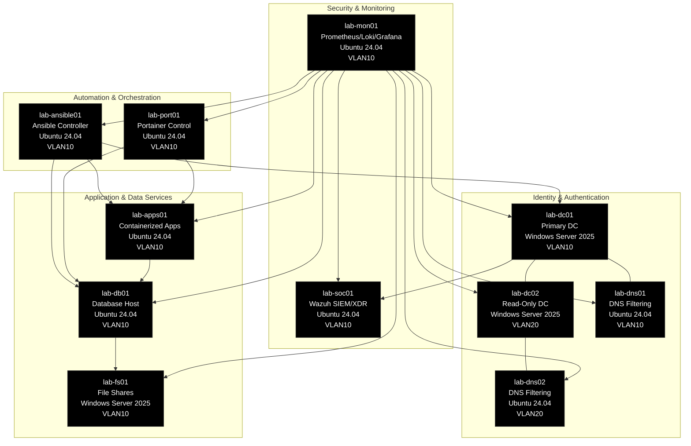

# **Proxmox Astronomy Lab - Infrastructure Overview**

## **Introduction**

The **Proxmox Astronomy Lab** is a purpose-built hybrid research and IT environment that supports **radio astronomy, AI-driven signal processing, and structured IT operations**. Infrastructure plays a foundational role in ensuring that the lab is **scalable, high-performance, and secure** while maintaining the flexibility needed for continuous research.

This section provides a **detailed breakdown of the infrastructure**, from **compute resources and Kubernetes deployments** to **networking, storage, and observatory hardware**. Each component has been architected to balance **performance, modularity, and security**, ensuring that the lab can evolve alongside its research needs.

This is not a traditional **enterprise stack**, nor is it a **home lab with ad-hoc infrastructure**—it is a structured system that **blends DevOps methodologies, high-performance computing, and scientific instrumentation into a cohesive environment.**

 

---

## **Infrastructure Components**

The infrastructure is divided into key areas, each serving a specific function in the lab's operations.

### **Compute & Virtualization**

- **Proxmox Cluster** → Five-node cluster supporting research workloads, virtualized infrastructure, and GPU-accelerated processing.
- **Kubernetes (RKE2)** → A containerized workload environment optimized for ML/AI, automation, and scientific data pipelines.
- **GPU Workloads** → Dedicated compute resources for AI-driven signal processing and astronomical data analysis.

### **Networking & Security**

- **VLAN-Segmented Architecture** → Logical separation between control plane, research workloads, and observatory systems.
- **Zero-Trust Security** → Enforced via **Entra ID, Conditional Access, and Tailscale**.
- **Hybrid Identity Management** → Windows Server 2025 AD & Entra ID hybrid model with Azure Arc integration.

### **Storage & Data Management**

- **NVMe-Backed Object Storage** → High-speed S3 gateway for research data and Kubernetes workloads.
- **PostgreSQL & TimescaleDB** → Structured database solutions for astronomical data and signal storage.
- **Proxmox Backup Server (PBS)** → Daily snapshot-based backup strategy with offsite replication.

### **Observatory & Research Hardware**

- **Hydrogen Line Research Systems** → Custom-built **radio astronomy hardware, antennas, and SDR receivers**.
- **Signal Processing Pipelines** → AI-driven **noise reduction, signal validation, and long-term data retention**.
- **Scientific Data Integration** → Federated research approach leveraging public datasets alongside lab-collected data.

---

## **How This Section is Organized**

This section is divided into **specific infrastructure components**, each with its own documentation for clarity and depth.

### **[Control Plane](control-plane/README.md)**

Handles the **management of Kubernetes, orchestration layers, and core services** that enable research operations.

### **[Kubernetes](kubernetes/README.md)**

Documents the **RKE2 cluster, workloads, and supporting containerized services**.

### **[Networking](networking/README.md)**

Covers the **structured VLAN segmentation, firewall policies, and network topology** of the lab.

### **[Observatory Hardware](observatory-hardware/README.md)**

Details **radio astronomy instrumentation, SDR hardware, and data acquisition methods**.

### **[Projects](projects/README.md)**

Tracks **current and planned research efforts**, including **Hydrogen Line studies, AI-driven analysis, and collaborative projects**.

### **[Proxmox](proxmox/README.md)**

Explains the **hypervisor architecture, VM deployments, and high-performance computing environments**.

### **[Storage](storage/README.md)**

Documents **data handling strategies, structured database implementations, and long-term archival policies**.

---

## **Why This Matters**

This infrastructure is **purpose-built to bridge the gap between high-performance computing, structured research, and modern IT automation**. Every component is designed with **long-term scalability, reproducibility, and automation** in mind, ensuring that the lab remains at the forefront of **scientific computing and DevOps-driven research**.

📌 **This section is continuously evolving as new integrations, optimizations, and research initiatives are introduced.**
