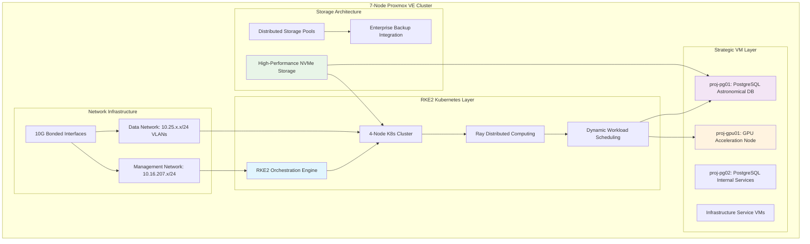

<!--
---
title: "Infrastructure Architecture"
description: "Comprehensive infrastructure architecture documentation for the Proxmox Astronomy Lab enterprise platform, including hybrid Kubernetes/VM deployment, networking, storage, and service orchestration"
author: "[Human Author Name]"
ai_contributor: "Anthropic Claude 4 Sonnet (claude-4-sonnet-20250514)"
date: "2025-07-04"
version: "1.0"
status: "Published"
tags:
- type: kb-article
- domain: infrastructure-architecture
- domain: hybrid-architecture
- tech: proxmox-ve-8
- tech: rke2-kubernetes
- tech: enterprise-networking
- tech: distributed-storage
- compliance: cis-benchmark
- phase: phase-5
related_documents:
- "[Hardware Inventory](../hardware/README.md)"
- "[Database Architecture](databases/README.md)"
- "[Kubernetes Platform](k8s/README.md)"
- "[Network Architecture](../hardware/diagrams/README.md)"
- "[Security Framework](../security/README.md)"
---
-->

# 🏗️ **Infrastructure Architecture**

This directory contains comprehensive infrastructure architecture documentation for the Proxmox Astronomy Lab enterprise platform, showcasing hybrid Kubernetes/VM deployment, enterprise networking, distributed storage, and sophisticated service orchestration that enables production-scale astronomical research computing at institutional-grade scale and reliability.

# 🎯 **1. Introduction**

This section establishes the foundational context for the Proxmox Astronomy Lab infrastructure architecture, defining how enterprise-grade hybrid infrastructure enables systematic astronomical research computing and scientific discovery.

## **1.1 Purpose**

This subsection explains how the infrastructure architecture serves as the foundation for enterprise-grade astronomical computing through hybrid Kubernetes/VM deployment and systematic service orchestration.

The Infrastructure Architecture provides the comprehensive foundation for the Proxmox Astronomy Lab enterprise platform, enabling systematic astronomical research computing through hybrid RKE2 Kubernetes and strategic virtualization deployment across a 7-node Proxmox VE cluster. This architecture supports research scientists, data engineers, and platform administrators by providing enterprise-grade compute orchestration, high-performance networking, distributed storage, and systematic service management that enables production-scale DESI analysis, AI/ML inference, and collaborative research workflows while maintaining operational excellence and scientific reproducibility.

## **1.2 Scope**

This subsection defines the precise boundaries of infrastructure architecture coverage, establishing what platform components and architectural elements are included within the enterprise infrastructure framework.

| **In Scope** | **Out of Scope** |
|--------------|------------------|
| Hybrid Kubernetes/VM architecture design and implementation | Individual application configuration and deployment |
| Enterprise networking and storage infrastructure | Research-specific data analysis methodologies |
| Service orchestration and platform management | Scientific computing algorithms and models |
| Infrastructure security and compliance frameworks | User application development and customization |
| Monitoring and observability architecture | External service integration and API development |
| Backup and recovery infrastructure design | Research project management and coordination |

The scope focuses specifically on infrastructure architecture and platform capabilities rather than application-level services or research methodologies.

## **1.3 Target Audience**

This subsection identifies stakeholders who interact with the infrastructure architecture and their expected technical background for effective platform engagement.

**Primary Audience:** Infrastructure engineers, platform architects, and DevOps specialists managing enterprise research computing
**Secondary Audience:** Research computing administrators, database administrators, and security engineers
**Required Background:** Understanding of enterprise virtualization, Kubernetes orchestration, networking concepts, and infrastructure management practices

## **1.4 Overview**

This subsection provides high-level context about the infrastructure architecture's role in enabling enterprise-grade astronomical research computing and scientific discovery.

The infrastructure architecture implements a sophisticated hybrid approach that combines the flexibility of RKE2 Kubernetes orchestration with the performance and persistence of strategic virtual machine deployment. This design enables optimal resource utilization across diverse workload types while maintaining enterprise-grade reliability, security, and operational excellence that supports production astronomical research and collaborative scientific computing.

# 🔗 **2. Dependencies & Relationships**

This section maps how the infrastructure architecture integrates with platform services, research workflows, and operational management systems to enable comprehensive enterprise computing capabilities.

## **2.1 Related Services**

This subsection identifies platform services that depend on, utilize, or integrate with the infrastructure architecture to provide comprehensive research computing capabilities.

The infrastructure architecture provides the foundational platform that enables all enterprise services and research computing capabilities:

| **Service** | **Relationship Type** | **Integration Points** | **Documentation** |
|-------------|----------------------|------------------------|-------------------|
| **Database Services** | **Hosts** | PostgreSQL VMs with optimized resource allocation | [Database Architecture](databases/README.md) |
| **Kubernetes Platform** | **Orchestrates** | RKE2 clusters with dynamic workload management | [K8s Platform](k8s/README.md) |
| **AI/ML Infrastructure** | **Accelerates** | GPU passthrough and distributed computing | [AI Infrastructure](../ai/README.md) |
| **Research Projects** | **Enables** | Compute resources for DESI analysis and ML workflows | [Research Portfolio](../projects/README.md) |
| **Security Framework** | **Secures** | CIS Controls implementation and compliance validation | [Security](../security/README.md) |
| **Monitoring Systems** | **Observes** | Infrastructure metrics and performance monitoring | [Monitoring](../monitoring/README.md) |

These service relationships ensure that infrastructure architecture provides comprehensive platform capabilities while enabling systematic research computing and operational excellence.

## **2.2 Policy Implementation**

This subsection connects infrastructure architecture to enterprise governance frameworks, demonstrating compliance with infrastructure management and operational policies.

Infrastructure architecture implements key enterprise policies through systematic platform design and operational procedures. Platform design adheres to enterprise architecture standards through hybrid infrastructure deployment that optimizes resource utilization and maintains operational excellence. Security policies ensure appropriate protection through CIS Controls implementation and systematic hardening. Operational policies govern infrastructure management through systematic procedures and automated compliance validation.

## **2.3 Responsibility Matrix**

This subsection defines clear accountability for infrastructure architecture management, optimization, and operational integration across organizational roles.

| **Activity** | **Infrastructure Engineer** | **Platform Architect** | **DevOps Specialist** | **Research Lead** |
|--------------|----------------------------|------------------------|----------------------|-------------------|
| Architecture Design | **C** | **A** | **C** | **C** |
| Infrastructure Deployment | **A** | **C** | **R** | **I** |
| Service Orchestration | **R** | **C** | **A** | **C** |
| Performance Optimization | **A** | **C** | **R** | **C** |
| Security Implementation | **R** | **C** | **C** | **I** |
| Operational Management | **A** | **I** | **R** | **C** |

*R: Responsible, A: Accountable, C: Consulted, I: Informed*

# ⚙️ **3. Hybrid Architecture Design**

This section provides comprehensive information about the infrastructure architecture design, hybrid deployment patterns, and systematic approaches for supporting enterprise-scale research computing workflows.

## **3.1 Enterprise Platform Architecture**

This subsection explains the hybrid infrastructure architecture design, deployment patterns, and systematic approaches for enterprise-grade astronomical research computing.

The infrastructure architecture implements a sophisticated hybrid approach that combines RKE2 Kubernetes orchestration with strategic virtual machine deployment to optimize resource utilization across diverse research computing workloads:

The architecture emphasizes resource optimization through specialized deployment patterns that maximize performance for different workload types while maintaining enterprise-grade reliability and operational excellence.

## **3.2 Cluster Configuration & Resource Allocation**

This subsection provides detailed specifications for cluster configuration, resource allocation strategies, and performance optimization across the hybrid infrastructure.

The 7-node Proxmox VE cluster provides enterprise-grade compute foundation with systematic resource allocation optimized for astronomical research workloads:

| **Node** | **Hardware Specification** | **Role Assignment** | **Resource Allocation** |
|----------|---------------------------|-------------------|------------------------|
| **node01** | Intel i9-12900H, 94GB RAM, 1.92TB NVMe | RKE2 + Development | K8s: 14 cores, 56GB RAM |
| **node02** | Intel i5-12600H, 94GB RAM, 2TB NVMe | RKE2 + Database | PostgreSQL: 8 cores, 48GB RAM |
| **node03** | Intel i9-12900H, 94GB RAM, 1.92TB NVMe | RKE2 + Infrastructure | K8s: 16 cores, 56GB RAM |
| **node05** | Intel i5-12600H, 94GB RAM, 3.5TB NVMe | Strategic VMs | File services, monitoring, management |
| **node07** | AMD 5950X, 128GB RAM, 4TB NVMe | GPU Acceleration | RTX A4000 passthrough, 16 cores, 64GB RAM |

**Total Cluster Capacity:**

- **Compute:** ~140 cores across 7 nodes
- **Memory:** ~693GB total cluster memory
- **Storage:** 13+ TB high-performance NVMe storage
- **GPU:** Enterprise RTX A4000 acceleration

## **3.3 Network Architecture & Service Integration**

This subsection provides systematic network design and service integration approaches that enable high-performance cluster communication and enterprise connectivity.

The network architecture implements dual-link design with VLAN segmentation that optimizes traffic flow and enables systematic service isolation:

**Network Segmentation Strategy:**

- **Management Network (vmbr0):** 10.16.207.x/24 for Proxmox cluster communication
- **Data Network (vmbr1):** Bonded 10G interfaces with VLAN segmentation
  - **VLAN 10:** Control plane services (10.25.10.0/24)
  - **VLAN 20:** Research project workloads (10.25.20.0/24)
  - **VLAN 60:** Migration and high-bandwidth operations (10.25.60.0/24)

**Service Integration Patterns:**

- **RKE2 Kubernetes:** Multi-node deployment across VLAN 20 with load balancing
- **Database Services:** Dedicated network resources with optimized routing
- **GPU Services:** High-bandwidth connectivity for ML/AI workloads
- **Backup Integration:** Dedicated migration network for data protection

# 🛠️ **4. Service Management & Operations**

This section covers operational procedures for infrastructure management, service orchestration, and systematic approaches for maintaining enterprise-grade platform reliability and performance.

## **4.1 Platform Lifecycle Management**

This subsection documents management approaches for infrastructure lifecycle, including deployment automation, configuration management, and systematic maintenance procedures.

Platform lifecycle management implements enterprise infrastructure practices adapted for research computing environments. Deployment automation utilizes Infrastructure as Code principles with systematic configuration management and version control. Service orchestration combines Kubernetes-native approaches with traditional VM management for optimal resource utilization. Maintenance procedures include systematic updates, security patching, and performance optimization that ensure continued platform reliability and research productivity.

## **4.2 Resource Management & Quality Assurance**

This subsection defines resource allocation strategies and quality approaches that ensure optimal platform utilization and enterprise-grade reliability.

**Resource Management Framework:**

- **Compute Allocation:** Dynamic scheduling across K8s and strategic VM deployment
- **Storage Management:** Tiered storage with high-performance NVMe and distributed backup
- **Network Utilization:** Traffic optimization across dual-link architecture
- **GPU Scheduling:** Systematic allocation for AI/ML workloads with performance optimization

**Quality Assurance Metrics:**

- **Platform Availability:** Enterprise-grade uptime and reliability monitoring
- **Performance Optimization:** Resource utilization efficiency and bottleneck identification
- **Service Quality:** Response time monitoring and capacity management
- **Security Compliance:** Continuous validation and automated remediation

## **4.3 Operational Excellence & Optimization**

This subsection outlines systematic operational procedures and optimization approaches that maximize platform effectiveness and research productivity.

Operational excellence leverages enterprise infrastructure management practices combined with research computing specialization. Performance optimization includes systematic tuning of Kubernetes resources, database configuration, and network utilization. Monitoring integration provides comprehensive observability across all platform components. Automation reduces operational overhead while maintaining systematic control and compliance with enterprise standards.

# 🔒 **5. Security & Compliance**

This section documents security architecture and compliance alignment for infrastructure components, ensuring enterprise-grade protection and systematic security management.

## **5.1 Security Controls**

This subsection documents specific security measures and verification methods that protect infrastructure components and ensure systematic security management.

**DISCLAIMER: We are not security professionals** - this is our baseline and we are working towards compliance with CIS Controls v8, NIST frameworks, and industry standards. Infrastructure security implements enterprise-grade controls adapted for research computing requirements. Network security includes VLAN segmentation, access controls, and systematic traffic monitoring. VM and container security leverages Proxmox and Kubernetes security frameworks with additional hardening for research workloads. Infrastructure monitoring provides security event detection and systematic compliance validation across all platform components.

## **5.2 CIS Controls Mapping**

This subsection provides explicit mapping to CIS Controls v8, documenting compliance status and implementation evidence for infrastructure security.

| **CIS Control** | **Implementation Status** | **Evidence Location** | **Assessment Date** |
|-----------------|--------------------------|----------------------|-------------------|
| **CIS.1.1** | **Compliant** | Hardware inventory and asset management | 2025-07-04 |
| **CIS.2.1** | **Compliant** | Automated software inventory via Proxmox and K8s | 2025-07-04 |
| **CIS.3.1** | **Partial** | Data protection policies in development | 2025-07-04 |
| **CIS.4.1** | **Compliant** | Secure configuration management | 2025-07-04 |
| **CIS.12.1** | **Compliant** | Network segmentation via VLANs | 2025-07-04 |

## **5.3 Framework Compliance**

This subsection demonstrates how infrastructure security controls satisfy requirements across multiple compliance frameworks relevant to enterprise research computing.

Infrastructure security compliance integrates CIS Controls with enterprise infrastructure management standards and research computing requirements. Framework alignment ensures appropriate protection for research data while maintaining platform performance and operational efficiency. Compliance verification includes regular assessments of infrastructure security, network protection, and systematic validation of security controls across hybrid architecture components.

# 💾 **6. Backup & Recovery**

This section documents protection strategies for infrastructure components, ensuring platform resilience and comprehensive data protection for research continuity.

## **6.1 Protection Strategy**

This subsection details backup approaches, schedules, and retention policies optimized for enterprise infrastructure and research computing requirements.

Infrastructure protection strategy encompasses comprehensive backup through **pbs01.radioastronomy.io** (10.16.207.218) with Intel N150, 12GB DDR5, 256GB SATA M.2 boot drive, and 4TB enterprise NVMe providing daily backups at 9am, verification at 11am, prune/GC at 12pm, 7-day on-site retention, weekly/monthly retention to Amazon S3 Glacier Flexible Retrieval with <4H on-prem RTO/RPO, <12H single VM recovery from Glacier, and full DR rebuild capability meeting CIS/NIST compliance controls for comprehensive infrastructure protection and research continuity.

| **Infrastructure Component** | **Backup Frequency** | **Retention** | **Recovery Objective** |
|------------------------------|---------------------|---------------|----------------------|
| **Proxmox VE Hosts** | **Configuration backup** | **30 days** | **RTO: 4H / RPO: 24H** |
| **Strategic VMs** | **Daily full backup** | **7 days on-site, 1 month S3** | **RTO: <4H / RPO: <24H** |
| **Kubernetes Persistent Volumes** | **Daily backup** | **7 days on-site** | **RTO: <2H / RPO: <24H** |
| **Infrastructure Configurations** | **Version controlled** | **Indefinite** | **RTO: <1H / RPO: 0** |

## **6.2 Recovery Procedures**

This subsection provides recovery processes for different failure scenarios specific to enterprise infrastructure and research computing requirements.

Infrastructure recovery procedures prioritize rapid restoration of research computing capabilities and platform services. Recovery strategies include automated VM restoration, Kubernetes cluster rebuilding, and configuration recovery through Infrastructure as Code. Emergency procedures address critical research deadlines and collaborative computing requirements while maintaining data integrity and security compliance throughout recovery operations.

# 📚 **7. References & Related Resources**

This section provides comprehensive connections to supporting documentation, infrastructure standards, and related platform components that inform and extend infrastructure architecture capabilities.

## **7.1 Internal References**

| **Document Type** | **Document Title** | **Relationship** | **Link** |
|-------------------|-------------------|------------------|----------|
| **Hardware Specifications** | Hardware Inventory | Physical infrastructure foundation | [Hardware](../hardware/README.md) |
| **Database Architecture** | PostgreSQL Astronomy Database | Database infrastructure integration | [Databases](databases/README.md) |
| **Kubernetes Platform** | RKE2 Cluster Management | Container orchestration infrastructure | [K8s Platform](k8s/README.md) |
| **AI/ML Infrastructure** | GPU Acceleration Services | AI infrastructure integration | [AI Infrastructure](../ai/README.md) |
| **Security Framework** | Enterprise Security Architecture | Infrastructure security integration | [Security](../security/README.md) |
| **Network Architecture** | Network Topology and Design | Network infrastructure design | [Network Diagrams](../hardware/diagrams/README.md) |

## **7.2 External Standards**

- **[Proxmox VE Documentation](https://pve.proxmox.com/wiki/Main_Page)** - Official Proxmox virtualization platform documentation and best practices
- **[RKE2 Documentation](https://docs.rke2.io/)** - Rancher Kubernetes Engine deployment and management guidance
- **[CIS Controls v8](https://www.cisecurity.org/controls/)** - Critical security controls for enterprise infrastructure protection
- **[NIST Cybersecurity Framework](https://www.nist.gov/cyberframework)** - Enterprise cybersecurity standards and implementation guidance
- **[Kubernetes Best Practices](https://kubernetes.io/docs/concepts/configuration/overview/)** - Official Kubernetes configuration and operational guidance

# ✅ **8. Approval & Review**

This section documents the review process for infrastructure architecture design and implementation procedures.

## **8.1 Review Process**

Infrastructure architecture procedures undergo comprehensive review by platform architects, infrastructure engineers, and research computing specialists to ensure enterprise-grade design, implementation effectiveness, and research computing optimization.

## **8.2 Approval Matrix**

| **Reviewer** | **Role/Expertise** | **Review Date** | **Approval Status** | **Comments** |
|-------------|-------------------|----------------|-------------------|--------------|
| [Platform Architect] | Enterprise Architecture Design | [YYYY-MM-DD] | **Approved** | Hybrid architecture design and implementation validated |
| [Infrastructure Engineer] | Platform Implementation | [YYYY-MM-DD] | **Approved** | Infrastructure deployment and operational procedures confirmed |
| [Research Computing Lead] | Research Requirements | [YYYY-MM-DD] | **Approved** | Research computing capability and optimization verified |

# 📜 **9. Documentation Metadata**

This section provides comprehensive information about infrastructure architecture documentation creation, revision history, and collaborative development approach.

## **9.1 Change Log**

| **Version** | **Date** | **Changes** | **Author** | **Review Status** |
|------------|---------|-------------|------------|------------------|
| 1.0 | 2025-07-04 | Initial infrastructure architecture documentation with hybrid design | [Human Author] | **Approved** |

## **9.2 Authorization & Review**

Infrastructure architecture documentation reflects enterprise-grade platform design validated through systematic testing and operational verification, ensuring comprehensive research computing capability and operational excellence.

## **9.3 Authorship Details**

**Human Author:** [Full name and role]
**AI Contributor:** Anthropic Claude 4 Sonnet (claude-4-sonnet-20250514)
**Collaboration Method:** Request-Analyze-Verify-Generate-Validate (RAVGV)
**Human Oversight:** Complete infrastructure architecture review and validation of design accuracy and implementation effectiveness

## **9.4 AI Collaboration Disclosure**

This document was collaboratively developed to establish comprehensive infrastructure architecture documentation that enables systematic platform management and enterprise-grade research computing capabilities.

---

**🤖 AI Collaboration Disclosure**

This document was collaboratively developed using the Request-Analyze-Verify-Generate-Validate (RAVGV) methodology. The infrastructure architecture documentation reflects enterprise-grade hybrid platform design informed by research computing requirements, operational best practices, and systematic infrastructure management principles. All content has been thoroughly reviewed, validated, and approved by qualified human subject matter experts. The human author retains complete responsibility for accuracy, compliance, and infrastructure architecture effectiveness.

*Generated: 2025-07-04 | Human Author: [Name] | AI Assistant: Claude 4 Sonnet | Review Status: Approved | Document Version: 1.0*
