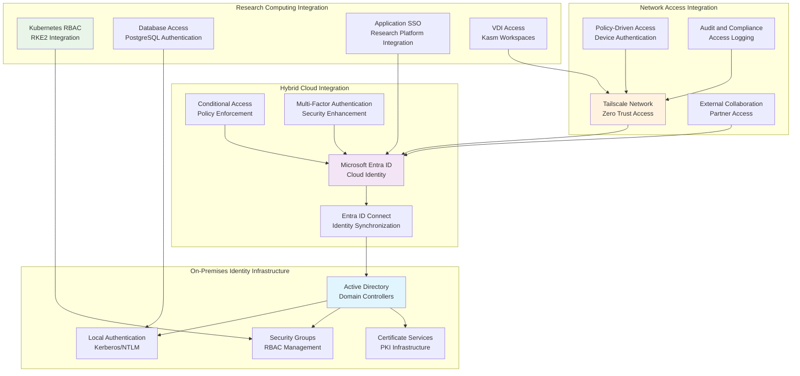

# 🏢 **Active Directory**

This category provides comprehensive documentation for hybrid Active Directory infrastructure across the Proxmox Astronomy Lab's enterprise research computing platform. The documentation covers systematic approaches to identity and access management, hybrid cloud integration with Microsoft Entra ID, single sign-on implementation, and enterprise security group management supporting secure research collaboration and external partnership workflows. These implementations demonstrate enterprise-grade identity management patterns optimized for research computing environments with emphasis on secure external collaboration capabilities and policy-driven access control.

## **Overview**

Active Directory represents the sophisticated orchestration of enterprise identity management, hybrid cloud authentication, and systematic access control across the research computing infrastructure. The Proxmox Astronomy Lab implements enterprise-grade identity services centered on hybrid Active Directory deployment, Microsoft Entra ID Connect synchronization, Tailscale policy-driven network access, and comprehensive single sign-on integration supporting secure research collaboration, external partnership access, and systematic authentication workflows. This implementation provides centralized identity management, seamless cloud authentication, granular security group coordination, and systematic access control procedures supporting collaborative research computing and secure external access requirements.

The identity infrastructure operates as the foundational security layer across the hybrid Kubernetes and VM architecture, providing seamless integration with research applications, database access control, and external collaboration platforms. These systems enable secure researcher authentication, policy-driven network access through Tailscale integration, comprehensive audit logging, and systematic identity lifecycle management ensuring appropriate access control while enabling productive research collaboration across institutional boundaries.

---

## **📁 Repository Structure**

```markdown
infrastructure/active-directory/
├── README.md                                    # This category overview document
├── hybrid-identity-architecture/
│   ├── README.md                               # Hybrid AD and Entra ID integration design
│   ├── domain-controller-deployment/          # On-premises AD infrastructure
│   ├── entra-connect-sync/                    # Azure AD Connect synchronization
│   └── identity-lifecycle-management/         # Systematic identity provisioning
├── authentication-services/
│   ├── README.md                               # Enterprise authentication implementation
│   ├── single-sign-on/                        # SSO integration and configuration
│   ├── multi-factor-authentication/           # MFA implementation and policies
│   ├── certificate-management/                # PKI and certificate services
│   └── kerberos-integration/                  # Kerberos authentication coordination
├── security-groups-rbac/
│   ├── README.md                               # Security group design and RBAC implementation
│   ├── research-access-groups/                # Research-specific security groups
│   ├── administrative-groups/                 # Infrastructure and administrative access
│   ├── external-collaboration/                # Partner and external researcher access
│   └── application-permissions/               # Application-specific access control
├── tailscale-integration/
│   ├── README.md                               # Policy-driven network access with Tailscale
│   ├── entra-id-integration/                  # Tailscale Entra ID authentication
│   ├── access-control-policies/               # Network access policy management
│   ├── device-management/                     # Systematic device registration and control
│   └── audit-compliance/                      # Access logging and compliance reporting
├── external-collaboration/
│   ├── README.md                               # Secure external partnership access
│   ├── guest-user-management/                 # External researcher account management
│   ├── partnership-access-policies/           # Institution-specific access controls
│   ├── time-limited-access/                   # Temporary access and project-based permissions
│   └── compliance-reporting/                  # External access audit and compliance
└── operational-procedures/
    ├── README.md                               # Identity management operational procedures
    ├── user-lifecycle-management/             # Account provisioning and deprovisioning
    ├── access-review-procedures/              # Systematic access review and validation
    ├── incident-response/                     # Identity-related security incident procedures
    └── monitoring-alerting/                   # Identity infrastructure monitoring and alerting
```

---

## **📂 Directory Overview**

This section provides comprehensive navigation to all Active Directory implementations and identity management procedures.

### **🏗️ Core Identity Infrastructure**

| **Component** | **Purpose** | **Implementation** |
|---------------|-------------|-------------------|
| **[hybrid-identity-architecture/](hybrid-identity-architecture/)** | Hybrid AD and Entra ID integration design | Domain controllers, Entra Connect sync, identity lifecycle |
| **[authentication-services/](authentication-services/)** | Enterprise authentication implementation | SSO, MFA, certificates, Kerberos integration |
| **[security-groups-rbac/](security-groups-rbac/)** | Security group design and RBAC implementation | Research groups, administrative access, application permissions |

### **🌐 External Access and Collaboration**

| **Component** | **Purpose** | **Implementation** |
|---------------|-------------|-------------------|
| **[tailscale-integration/](tailscale-integration/)** | Policy-driven network access with Tailscale | Entra ID integration, access policies, device management |
| **[external-collaboration/](external-collaboration/)** | Secure external partnership access | Guest users, partnership policies, time-limited access |

### **⚙️ Operations and Management**

| **Component** | **Purpose** | **Implementation** |
|---------------|-------------|-------------------|
| **[operational-procedures/](operational-procedures/)** | Identity management operational procedures | User lifecycle, access reviews, incident response, monitoring |

---

## **🏗️ Architecture & Design**

This section details the systematic architecture supporting enterprise-grade identity management across the research computing infrastructure.

### **Hybrid Identity Architecture**

The Active Directory architecture implements comprehensive hybrid identity management with systematic integration between on-premises Active Directory, Microsoft Entra ID cloud services, and policy-driven network access supporting secure research collaboration and external partnership workflows.



### **Research Computing Identity Strategy**

The enterprise identity implementation provides systematic access control across research computing infrastructure with emphasis on secure external collaboration, policy-driven network access, and comprehensive audit capabilities supporting institutional partnerships and collaborative research.

| **Identity Domain** | **Access Pattern** | **Integration Method** | **Research Benefit** |
|-------------------|------------------|----------------------|---------------------|
| **Internal Researchers** | Direct AD authentication with SSO | On-premises AD with Entra ID sync | Seamless access to research infrastructure and applications |
| **External Collaborators** | Guest user accounts with time-limited access | Entra ID guest management with conditional access | Secure partner access to specific research projects and datasets |
| **Remote Access** | Policy-driven network access through Tailscale | Entra ID authentication with device compliance | Secure remote access to research computing infrastructure |
| **Application Integration** | Single sign-on across research platforms | SAML/OAuth integration with Entra ID | Streamlined access to research tools and data platforms |

### **Security Group and RBAC Design**

The identity architecture implements comprehensive role-based access control with systematic security group management ensuring appropriate access to research computing resources while maintaining security boundaries and audit capabilities.

| **Security Group Category** | **Access Scope** | **Permission Model** | **Research Application** |
|----------------------------|------------------|---------------------|------------------------|
| **Research Project Groups** | Project-specific data and compute resources | Time-limited access with automatic expiration | Controlled access to DESI analysis projects and datasets |
| **Infrastructure Groups** | Platform administration and operational access | Privileged access with enhanced monitoring | Systematic infrastructure management and operational procedures |
| **External Partnership Groups** | Partner-specific access with institutional boundaries | Guest access with conditional policies | Secure collaboration with OSU Astronomy and other institutions |
| **Application-Specific Groups** | Service and application access control | Role-based permissions with least privilege | Granular access to databases, Kubernetes, and research applications |

### **Tailscale Policy-Driven Network Access**

The network access strategy implements zero-trust principles with systematic device authentication, policy enforcement, and comprehensive audit capabilities enabling secure external collaboration while maintaining infrastructure security.

| **Access Policy Type** | **Policy Implementation** | **Device Requirements** | **Audit Capabilities** |
|------------------------|-------------------------|----------------------|----------------------|
| **Researcher Access** | Entra ID authentication with device compliance | Managed devices with certificate authentication | Comprehensive access logging and session tracking |
| **External Collaboration** | Time-limited access with project-specific policies | Partner device registration with security validation | Detailed access auditing and compliance reporting |
| **Administrative Access** | Enhanced authentication with privileged access management | Multi-factor authentication with hardware tokens | Complete administrative action logging and review |
| **Emergency Access** | Break-glass procedures with enhanced logging | Temporary access with immediate notification | Extensive audit trail and security team notification |

---

## **⚙️ Management and Operations**

This section provides systematic approaches to managing identity infrastructure operations across enterprise research computing environments.

### **Identity Lifecycle Management**

Enterprise identity operations require systematic user lifecycle management, access provisioning, and systematic deprovisioning ensuring appropriate access control while supporting collaborative research workflows and external partnership requirements.

| **Lifecycle Phase** | **Management Approach** | **Identity-Specific Considerations** |
|-------------------|------------------------|-----------------------------------|
| **User Onboarding** | Automated provisioning with role-based access assignment | Integration with HR systems and research project assignments |
| **Access Management** | Regular access reviews with systematic validation | Time-limited access for external collaborators and project-based permissions |
| **Access Modification** | Change management with approval workflows | Research project transitions and role changes with audit trails |
| **User Offboarding** | Systematic deprovisioning with data protection | Account suspension with data access review and transfer procedures |

### **External Collaboration Management**

Production identity systems implement comprehensive external partnership access management ensuring secure collaboration while maintaining institutional security boundaries and compliance requirements.

| **Collaboration Type** | **Access Management Strategy** | **Security Implementation** | **Research Computing Integration** |
|------------------------|------------------------------|---------------------------|-----------------------------------|
| **Institutional Partnerships** | Guest account management with sponsor validation | Conditional access policies with institutional trust frameworks | Controlled access to collaborative research projects and shared datasets |
| **Conference Collaborations** | Time-limited access with event-specific permissions | Temporary access with automatic expiration and security monitoring | Demonstration access to research platforms and public datasets |
| **Vendor Access** | Service provider access with enhanced monitoring | Privileged access management with comprehensive audit requirements | Controlled access to infrastructure management and support services |
| **Research Visitor Access** | Short-term access with sponsor oversight | Local device registration with network access policies | Temporary access to research computing resources and collaboration tools |

### **Compliance and Audit Strategy**

Enterprise identity infrastructure implements systematic audit capabilities ensuring comprehensive access tracking, compliance reporting, and security incident detection supporting institutional governance and external partnership requirements.

| **Audit Domain** | **Monitoring Strategy** | **Compliance Reporting** |
|------------------|------------------------|-------------------------|
| **Access Logging** | Comprehensive authentication and authorization tracking | Regular access reports with anomaly detection and security review |
| **External Access** | Enhanced monitoring for guest users and external devices | Detailed external access reports with institutional compliance validation |
| **Privileged Access** | Real-time monitoring with automated alerting | Privileged access reviews with enhanced security validation |
| **Policy Compliance** | Systematic policy validation with automated assessment | Compliance dashboard with regulatory alignment and audit preparation |

---

## **🔒 Security & Compliance**

This section documents comprehensive security controls and compliance alignment for identity infrastructure within research computing environments.

⚠️ IDENTITY INFRASTRUCTURE SECURITY DISCLAIMER

*The identity infrastructure implementations provide enterprise-grade authentication and access control for research computing requiring careful identity governance, access management, and systematic security monitoring. Identity systems may process sensitive researcher information, external collaboration data, and institutional access patterns. All identity implementations follow enterprise security frameworks with specific attention to identity protection, access control validation, and appropriate governance aligned with research computing security requirements and institutional collaboration policies.*

### **Identity Security Controls**

Enterprise-grade security implementation guided by research computing standards and institutional governance policies for identity infrastructure systems. Security controls protect researcher identities, institutional access patterns, and collaboration workflows while enabling secure research computing and external partnership access.

| **Security Control Category** | **Implementation** | **Research Protection** |
|------------------------------|-------------------|------------------------|
| **Identity Protection** | Multi-factor authentication with conditional access policies | Protection of researcher accounts and institutional identity information |
| **Access Control Validation** | Role-based access with systematic review and approval workflows | Controlled access to research computing resources and sensitive datasets |
| **External Collaboration Security** | Guest user management with time-limited access and enhanced monitoring | Secure external partnership access with institutional security boundaries |
| **Audit and Compliance** | Comprehensive access logging with automated compliance reporting | Transparent access tracking and institutional governance validation |

### **Research Computing Compliance**

Identity infrastructure implementations align with research computing standards ensuring proper identity governance, access management transparency, and appropriate collaboration policies for academic institutions and external partnerships.

| **Compliance Domain** | **Framework Alignment** | **Implementation Evidence** |
|----------------------|------------------------|---------------------------|
| **Identity Governance** | Institutional identity management policies with systematic access control | Comprehensive identity lifecycle management and access review procedures |
| **External Collaboration** | Academic collaboration frameworks with appropriate security controls | Systematic guest user management and partnership access validation |
| **Data Protection** | Research data access controls with appropriate identity-based authorization | Identity-based access to research datasets with systematic audit capabilities |
| **Institutional Compliance** | University and research institution security frameworks | Compliance reporting and institutional governance alignment validation |

---

## **🔗 Related Categories**

This section establishes systematic connections to other knowledge domains within the Proxmox Astronomy Lab ecosystem, demonstrating comprehensive integration across enterprise research computing infrastructure.

### **Infrastructure Integration**

| **Category** | **Relationship** | **Active Directory Integration** |
|--------------|------------------|----------------------------------|
| **[../k8s-rke2/](../k8s-rke2/)** | Kubernetes RBAC integration | Active Directory authentication for RKE2 cluster access and authorization |
| **[../databases/](../databases/)** | Database authentication integration | PostgreSQL authentication with Active Directory credentials and authorization |
| **[../docker/](../docker/)** | Container registry authentication | Docker registry access control with enterprise identity management |
| **[../automation-and-orchestration/](../automation-and-orchestration/)** | Infrastructure automation identity | Service account management and automated workflow authentication |

### **Security and Compliance Integration**

| **Category** | **Relationship** | **Active Directory Integration** |
|--------------|------------------|----------------------------------|
| **[../../security-assurance/](../../security-assurance/)** | Identity security compliance | CIS Controls implementation for identity management and access control |
| **[../../policies-and-procedures/access-management/](../../policies-and-procedures/access-management/)** | Access management policy implementation | Policy enforcement and systematic access control procedures |
| **[../../monitoring/](../../monitoring/)** | Identity infrastructure monitoring | Authentication monitoring and access pattern analysis |

### **Research and Application Integration**

| **Category** | **Relationship** | **Active Directory Integration** |
|--------------|------------------|----------------------------------|
| **[../../projects/](../../projects/)** | Research project access control | Project-specific access management and collaboration authentication |
| **[../../ai-and-machine-learning/](../../ai-and-machine-learning/)** | AI/ML platform authentication | Secure access to machine learning infrastructure and computational resources |
| **[../vdi-kasm-workspaces/](../vdi-kasm-workspaces/)** | Virtual desktop authentication | Single sign-on integration for secure virtual research environments |

---

## **🚀 Getting Started**

This section provides systematic guidance for implementing Active Directory capabilities across different operational roles and research computing applications.

### **For Identity Administrators**

**Hybrid Architecture:** [hybrid-identity-architecture/](hybrid-identity-architecture/)  
**Authentication Services:** [authentication-services/](authentication-services/)  
**Security Groups:** [security-groups-rbac/](security-groups-rbac/)  
**Operational Procedures:** [operational-procedures/](operational-procedures/)

### **For Research Computing Teams**

**External Collaboration:** [external-collaboration/](external-collaboration/)  
**Network Access:** [tailscale-integration/](tailscale-integration/)  
**Application Integration:** [authentication-services/](authentication-services/)  
**Access Management:** [security-groups-rbac/](security-groups-rbac/)

### **For Platform Administrators**

**Infrastructure Integration:** [hybrid-identity-architecture/](hybrid-identity-architecture/)  
**Monitoring and Alerting:** [operational-procedures/](operational-procedures/)  
**Compliance Management:** [external-collaboration/](external-collaboration/)  
**Incident Response:** [operational-procedures/](operational-procedures/)

### **For Research Scientists**

**Access Procedures:** [external-collaboration/](external-collaboration/)  
**Collaboration Setup:** [tailscale-integration/](tailscale-integration/)  
**Application Access:** [authentication-services/](authentication-services/)  
**Support Resources:** [operational-procedures/](operational-procedures/)

---

## **Document Information**

| **Field** | **Value** |
|-----------|-----------|
| **Author** | VintageDon - <https://github.com/vintagedon> |
| **Created** | 2025-07-20 |
| **Last Updated** | 2025-07-20 |
| **Version** | 1.0 |

---
Tags: active-directory, hybrid-identity, entra-id, tailscale-integration, sso-authentication, security-groups, external-collaboration, enterprise-identity
